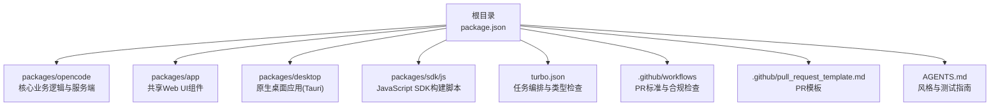
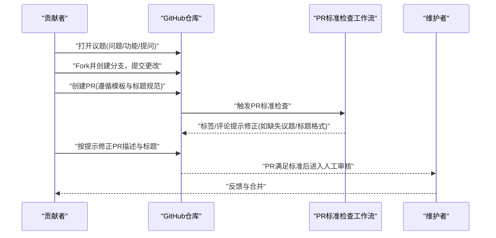
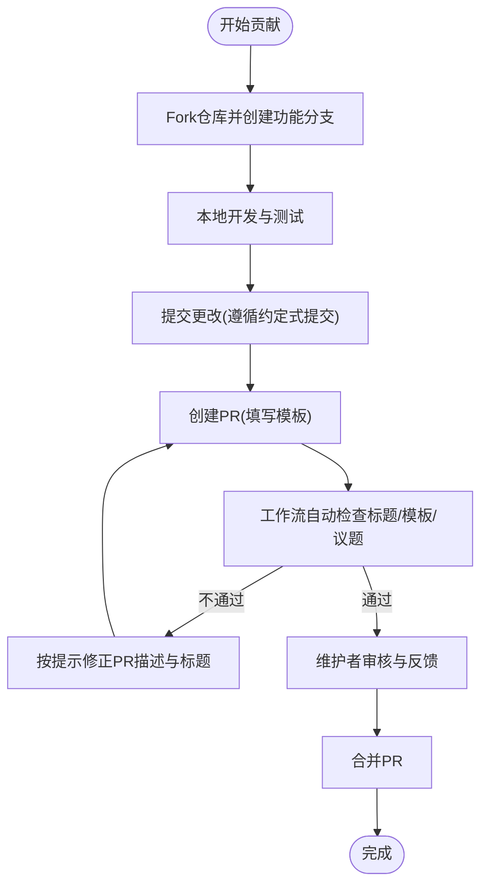
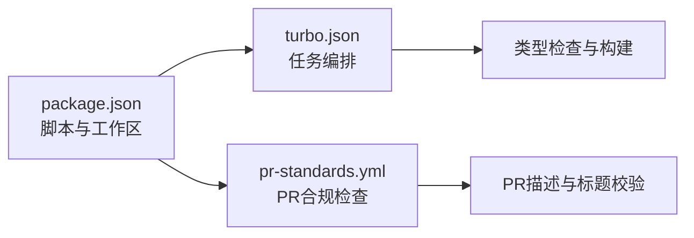

# 贡献指南

<cite>
**本文引用的文件**
- [CONTRIBUTING.md](file://CONTRIBUTING.md)
- [SECURITY.md](file://SECURITY.md)
- [README.md](file://README.md)
- [.github/pull_request_template.md](file://.github/pull_request_template.md)
- [AGENTS.md](file://AGENTS.md)
- [package.json](file://package.json)
- [.github/workflows/pr-standards.yml](file://.github/workflows/pr-standards.yml)
- [.github/VOUCHED.td](file://.github/VOUCHED.td)
- [turbo.json](file://turbo.json)
</cite>

## 目录
1. [简介](#简介)
2. [项目结构](#项目结构)
3. [核心组件](#核心组件)
4. [架构总览](#架构总览)
5. [详细组件分析](#详细组件分析)
6. [依赖分析](#依赖分析)
7. [性能考虑](#性能考虑)
8. [故障排查指南](#故障排查指南)
9. [结论](#结论)
10. [附录](#附录)

## 简介
本指南面向OpenCode社区贡献者，帮助你高效地发现问题、提出建议、参与讨论与代码贡献。内容涵盖从问题发现与报告、功能请求与设计评审、到完整的Fork/分支/提交/PR流程；同时提供代码风格、文档规范、提交信息格式、行为准则、沟通渠道以及安全漏洞报告与负责任披露流程。

## 项目结构
OpenCode采用多包（monorepo）结构，核心开发工具链与脚本集中在根目录配置中，便于在不同包之间复用与统一管理。

图表来源
- [package.json:1-118](file://package.json#L1-L118)
- [turbo.json:1-21](file://turbo.json#L1-L21)

章节来源
- [package.json:1-118](file://package.json#L1-L118)
- [turbo.json:1-21](file://turbo.json#L1-L21)

## 核心组件
- 贡献流程与要求：PR必须关联现有议题；标题需遵循约定式提交；描述需符合模板；UI变更需附截图或录屏；逻辑变更需说明验证方法。
- 开发环境与运行：使用Bun 1.3+；支持本地开发服务器、Web应用、桌面应用等多形态运行与构建。
- 信任与担保系统：通过vouch机制维护受信贡献者名单，明确担保/谴责操作与处理流程。
- 安全策略：不接受AI生成的安全报告；服务端模式需自行加固；明确范围内外与责任边界；提供负责任披露流程与升级通道。

章节来源
- [CONTRIBUTING.md:190-312](file://CONTRIBUTING.md#L190-L312)
- [SECURITY.md:1-48](file://SECURITY.md#L1-L48)
- [.github/VOUCHED.td:1-24](file://.github/VOUCHED.td#L1-L24)

## 架构总览
下图展示了贡献者从发现问题到合并PR的关键路径，以及自动化校验与合规检查在CI中的作用。

图表来源
- [.github/workflows/pr-standards.yml:1-352](file://.github/workflows/pr-standards.yml#L1-L352)
- [.github/pull_request_template.md:1-30](file://.github/pull_request_template.md#L1-L30)
- [CONTRIBUTING.md:190-249](file://CONTRIBUTING.md#L190-L249)

## 详细组件分析

### 发现与报告问题
- 使用议题模板：错误报告、功能请求、提问三类模板，确保必要字段完整。
- 模板强制与自动检查：机器人会检查标题格式、是否关联议题、描述是否为空或仅占位符等，不符合将被标记并限时修正。
- 首先政策：所有PR必须关联现有议题，避免重复劳动与无序推进。

章节来源
- [CONTRIBUTING.md:294-312](file://CONTRIBUTING.md#L294-L312)
- [.github/workflows/pr-standards.yml:86-154](file://.github/workflows/pr-standards.yml#L86-L154)

### 提出功能请求与设计评审
- 新功能需先进行设计讨论，明确问题背景、方案与为何属于OpenCode范畴。
- 核心团队将决定是否推进，避免直接开功能PR导致方向偏差。

章节来源
- [CONTRIBUTING.md:263-266](file://CONTRIBUTING.md#L263-L266)

### 参与讨论与沟通渠道
- 社区交流：Discord频道用于日常讨论与协作。
- 文档与安装：README提供安装指引与文档入口，便于快速上手。

章节来源
- [README.md:119-122](file://README.md#L119-L122)
- [README.md:141-142](file://README.md#L141-L142)

### 代码贡献流程（Fork/分支/提交/PR）
- Fork与分支：基于默认分支进行功能开发，保持小而聚焦的提交。
- 提交信息：遵循约定式提交标题规范，可选scope限定包名。
- PR模板：严格按模板填写“类型”“验证方法”“检查清单”“议题链接”等。
- 合规检查：标题格式、议题关联、模板完整性、检查清单等由工作流自动校验，不符合将被标记并限时修正。

图表来源
- [.github/workflows/pr-standards.yml:86-154](file://.github/workflows/pr-standards.yml#L86-L154)
- [.github/pull_request_template.md:1-30](file://.github/pull_request_template.md#L1-L30)
- [CONTRIBUTING.md:224-249](file://CONTRIBUTING.md#L224-L249)

章节来源
- [CONTRIBUTING.md:190-249](file://CONTRIBUTING.md#L190-L249)
- [.github/pull_request_template.md:1-30](file://.github/pull_request_template.md#L1-L30)
- [.github/workflows/pr-standards.yml:155-352](file://.github/workflows/pr-standards.yml#L155-L352)

### 代码风格与文档规范
- 风格偏好：函数内聚、避免不必要的解构、优先使用单词命名、避免else与try/catch、优先使用Bun API、追求精确类型与不可变变量等。
- 测试：尽量不使用mock，测试真实实现；测试不能在根目录执行，需在具体包目录运行。
- 类型检查：在包目录执行类型检查，避免全局直接tsc。
- 文档与SDK：遵循风格指南，必要时生成JavaScript SDK。

章节来源
- [AGENTS.md:7-129](file://AGENTS.md#L7-L129)
- [CONTRIBUTING.md:156-157](file://CONTRIBUTING.md#L156-L157)

### 提交信息格式要求
- 标题前缀：feat/fix/docs/chore/refactor/test，可选scope限定包名。
- 示例：feat(app): 添加深色模式支持；fix(desktop): 修复启动崩溃；chore(opencode): 升级依赖版本等。

章节来源
- [CONTRIBUTING.md:224-249](file://CONTRIBUTING.md#L224-L249)

### 行为准则与信任/担保系统
- vouch系统：维护受信贡献者列表，明确担保/谴责/解除操作与理由。
- 处理流程：贡献者可通过评论触发vouch/denounce/unvouch；被谴责用户可联系维护者申诉。
- 政策：谴责仅适用于反复提交低质量AI生成贡献、垃圾信息或恶意行为，不针对分歧或误判。

章节来源
- [CONTRIBUTING.md:267-293](file://CONTRIBUTING.md#L267-L293)
- [.github/VOUCHED.td:1-24](file://.github/VOUCHED.td#L1-L24)

### 安全漏洞报告与负责任披露
- 不接受AI生成的安全报告；接收大量此类报告导致资源不足。
- 威胁模型：OpenCode是本地运行的AI编码助手，无沙箱隔离；服务端模式需自行加固。
- 报告渠道：使用GitHub安全通告“Report a Vulnerability”页面提交。
- 升级通道：若超过6个工作日未收到确认回复，可邮件联系安全邮箱。

章节来源
- [SECURITY.md:1-48](file://SECURITY.md#L1-L48)

### 新贡献者入门指南
- 必备条件：熟悉Bun 1.3+；理解多包结构与脚本命令。
- 运行与调试：本地开发服务器、Web应用、桌面应用的启动与调试方法；调试建议与VSCode示例配置。
- 生成与SDK：当API或SDK有变更时，运行生成脚本更新SDK及相关文件。

章节来源
- [CONTRIBUTING.md:32-178](file://CONTRIBUTING.md#L32-L178)

### 技能要求与学习资源
- 技术栈：SolidJS、Tauri、Bun、TypeScript、Turbo等。
- 学习路径：参考README中的文档入口、安装与运行说明，结合各包内的源码与脚本逐步深入。

章节来源
- [README.md:115-122](file://README.md#L115-L122)
- [package.json:1-118](file://package.json#L1-L118)

## 依赖分析
- 包管理与脚本：根目录package.json定义了统一的开发与构建脚本，覆盖opencode、app、desktop、storybook等。
- 任务编排：turbo.json定义类型检查与构建任务的依赖关系，确保跨包一致性。
- 工作流：PR标准检查工作流对标题、议题关联、模板完整性进行自动化校验，减少人工负担。

图表来源
- [package.json:1-118](file://package.json#L1-L118)
- [turbo.json:1-21](file://turbo.json#L1-L21)
- [.github/workflows/pr-standards.yml:1-352](file://.github/workflows/pr-standards.yml#L1-L352)

章节来源
- [package.json:1-118](file://package.json#L1-L118)
- [turbo.json:1-21](file://turbo.json#L1-L21)
- [.github/workflows/pr-standards.yml:1-352](file://.github/workflows/pr-standards.yml#L1-L352)

## 性能考虑
- 小步快跑：保持PR小而聚焦，降低审查成本与回归风险。
- 自动化先行：利用工作流与脚本减少重复性劳动，提升迭代效率。
- 本地验证：在提交前完成本地测试与类型检查，减少CI失败概率。

## 故障排查指南
- PR标题不规范：标题需以约定式提交前缀开头，并可选scope；工作流会自动标记并提示修正。
- 缺少议题关联：除docs/refactor/feat外，其他PR需在描述中添加议题链接；否则会被标记并限时修正。
- PR模板不完整：缺少必需段落、未勾选类型、未填写验证方法或检查清单项过少；请按模板逐项补齐。
- 调试建议：优先使用指定的调试方式与端口，避免断点映射错误；必要时分离调试服务端与TUI。

章节来源
- [.github/workflows/pr-standards.yml:86-154](file://.github/workflows/pr-standards.yml#L86-L154)
- [.github/workflows/pr-standards.yml:155-352](file://.github/workflows/pr-standards.yml#L155-L352)
- [CONTRIBUTING.md:158-188](file://CONTRIBUTING.md#L158-L188)

## 结论
通过遵循议题模板与PR标准、使用约定式提交、配合自动化检查与受信担保体系，OpenCode社区能够高效、有序地推进高质量贡献。遇到安全问题请走负责任披露流程，日常沟通与协作请使用Discord与议题模板。欢迎新老贡献者加入，共同打造开放、透明、可持续的AI编程助手生态。

## 附录
- 贡献与开发：参见贡献指南与开发说明。
- 安全与披露：参见安全策略与披露流程。
- 沟通与文档：参见README中的文档入口与安装说明。

章节来源
- [CONTRIBUTING.md:1-312](file://CONTRIBUTING.md#L1-L312)
- [SECURITY.md:1-48](file://SECURITY.md#L1-L48)
- [README.md:115-122](file://README.md#L115-L122)