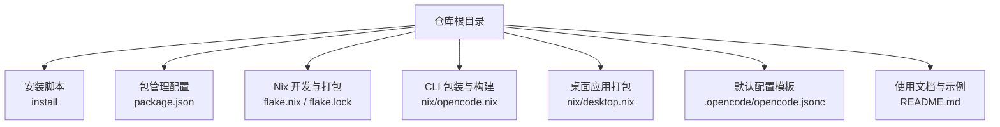
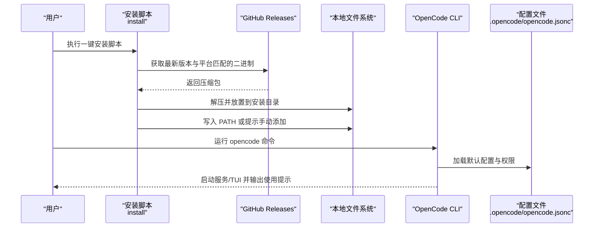
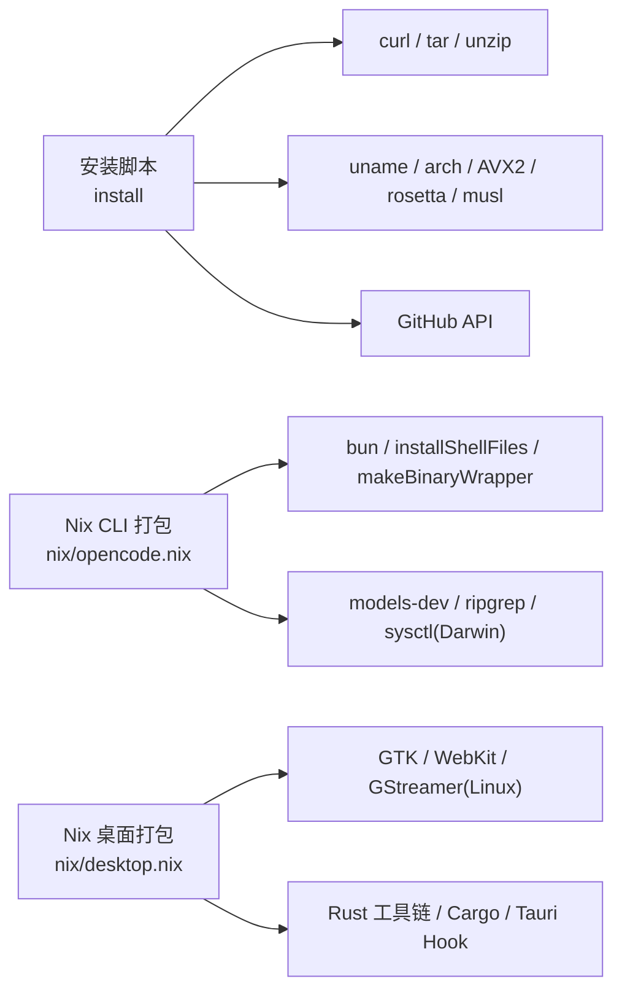

# 快速开始

<cite>
**本文引用的文件**
- [README.md](file://README.md)
- [install](file://install)
- [package.json](file://package.json)
- [flake.nix](file://flake.nix)
- [flake.lock](file://flake.lock)
- [nix/opencode.nix](file://nix/opencode.nix)
- [nix/desktop.nix](file://nix/desktop.nix)
- [.opencode/opencode.jsonc](file://.opencode/opencode.jsonc)
- [packages/web/src/content/docs/providers.mdx](file://packages/web/src/content/docs/providers.mdx)
- [packages/web/src/content/docs/es/config.mdx](file://packages/web/src/content/docs/es/config.mdx)
- [CONTRIBUTING.md](file://CONTRIBUTING.md)
</cite>

## 目录
1. [简介](#简介)
2. [项目结构](#项目结构)
3. [核心组件](#核心组件)
4. [架构总览](#架构总览)
5. [详细组件分析](#详细组件分析)
6. [依赖分析](#依赖分析)
7. [性能考虑](#性能考虑)
8. [故障排除指南](#故障排除指南)
9. [结论](#结论)
10. [附录](#附录)

## 简介
OpenCode 是一个开源的 AI 驱动开发助手，支持终端界面与桌面应用，提供内置代理与工具链，帮助你在本地或云端环境中进行高效开发。本“快速开始”旨在帮助新用户在最短时间内完成安装、基础配置与首次使用，体验核心功能。

## 项目结构
仓库采用多包工作区组织，核心 CLI 工具位于 packages/opencode，同时提供 Web UI、桌面应用、SDK、插件等模块。安装入口与脚本位于根目录，包含一键安装脚本、Nix 打包定义与桌面应用打包定义等。

图示来源
- [README.md:46-84](file://README.md#L46-L84)
- [install:1-461](file://install#L1-L461)
- [package.json:1-118](file://package.json#L1-L118)
- [flake.nix:1-77](file://flake.nix#L1-L77)
- [flake.lock:1-28](file://flake.lock#L1-L28)
- [nix/opencode.nix:1-98](file://nix/opencode.nix#L1-L98)
- [nix/desktop.nix:1-101](file://nix/desktop.nix#L1-L101)
- [.opencode/opencode.jsonc:1-19](file://.opencode/opencode.jsonc#L1-L19)

章节来源
- [README.md:46-84](file://README.md#L46-L84)
- [package.json:21-72](file://package.json#L21-L72)
- [flake.nix:21-51](file://flake.nix#L21-L51)

## 核心组件
- 安装与分发
  - 一键安装脚本：支持自动识别平台与架构，下载对应二进制并写入 PATH。
  - 多渠道安装：包管理器（npm/bun/pnpm/yarn）、包管理器（Scoop/Chocolatey/Brew/Pacman）、Nix、mise、桌面应用。
- 运行时与构建
  - Nix 打包：本地构建 CLI 可执行文件与 Shell 补全。
  - 桌面应用：基于 Tauri 的原生应用，封装 Web UI 并内嵌 CLI。
- 默认配置
  - 提供默认配置模板，支持按项目覆盖，支持环境变量与文件占位符注入。

章节来源
- [README.md:46-84](file://README.md#L46-L84)
- [install:68-110](file://install#L68-L110)
- [nix/opencode.nix:15-49](file://nix/opencode.nix#L15-L49)
- [nix/desktop.nix:26-84](file://nix/desktop.nix#L26-L84)
- [.opencode/opencode.jsonc:1-19](file://.opencode/opencode.jsonc#L1-L19)

## 架构总览
下图展示了从安装到首次运行的关键路径：安装脚本选择目标平台与架构，下载二进制并写入 PATH；随后通过 opencode 命令启动服务或 TUI，并加载默认配置与权限策略。

图示来源
- [install:183-204](file://install#L183-L204)
- [install:327-346](file://install#L327-L346)
- [install:403-439](file://install#L403-L439)
- [.opencode/opencode.jsonc:1-19](file://.opencode/opencode.jsonc#L1-L19)

章节来源
- [install:183-204](file://install#L183-L204)
- [install:327-346](file://install#L327-L346)
- [install:403-439](file://install#L403-L439)

## 详细组件分析

### 安装方式与系统要求
- 支持的安装方式
  - 一键安装脚本：适用于大多数 Unix-like 系统，自动检测 OS/架构并下载对应二进制。
  - 包管理器：npm/bun/pnpm/yarn（全局安装 opencode-ai）。
  - 包管理器（Windows）：Scoop、Chocolatey。
  - 包管理器（macOS/Linux）：Homebrew（tap 与官方公式）。
  - 包管理器（Linux）：Arch（pacman 稳定版、paru AUR 最新版）。
  - mise：跨语言工具链管理器。
  - Nix：nixpkgs 或 GitHub 源码分支。
  - 桌面应用：直接从发布页或官网下载，亦可通过 Homebrew Cask 安装。
- 系统要求与前置条件
  - 支持平台：Linux x64/x86_64、Linux ARM64、macOS x64（Rosetta 自动识别）、macOS ARM64、Windows x64。
  - 额外依赖：Linux 下需要 tar；非 Linux 需要 unzip；部分场景需要 AVX2 支持或 baseline 版本。
  - 路径优先级：OPENCODE_INSTALL_DIR > XDG_BIN_DIR > $HOME/bin > $HOME/.opencode/bin。
- 安装脚本特性
  - 支持指定版本安装与本地二进制安装。
  - 自动探测 shell 配置文件并写入 PATH（可禁用自动修改）。
  - 在 CI 环境中自动写入 GITHUB_PATH。

章节来源
- [README.md:46-84](file://README.md#L46-L84)
- [install:10-27](file://install#L10-L27)
- [install:68-110](file://install#L68-L110)
- [install:117-181](file://install#L117-L181)
- [install:362-439](file://install#L362-L439)

### 首次使用与基本命令
- 启动服务
  - 使用开发模式（本地等效）：bun dev serve 或 opencode serve。
  - 指定端口：bun dev serve --port 8080 或 opencode serve --port 8080。
- 启动 Web 界面
  - 先启动服务，再启动 Web 应用：bun run --cwd packages/app dev。
- 启动 TUI
  - 在指定目录启动：bun dev <directory> 或 opencode <directory>。
- 桌面应用
  - 开发：bun run --cwd packages/desktop tauri dev。
  - 构建：bun run --cwd packages/desktop tauri build。
- 代理与工具
  - 内置 build/plan 代理，可在 TUI 中用 Tab 切换。
  - 支持通用 general 子代理用于复杂搜索与多步任务。

章节来源
- [CONTRIBUTING.md:82-95](file://CONTRIBUTING.md#L82-L95)
- [CONTRIBUTING.md:97-122](file://CONTRIBUTING.md#L97-L122)
- [CONTRIBUTING.md:124-147](file://CONTRIBUTING.md#L124-L147)
- [README.md:100-113](file://README.md#L100-L113)

### 配置与环境变量
- 默认配置
  - 位置：.opencode/opencode.jsonc。
  - 示例内容：提供 provider、permission、tools 等字段的默认值与注释。
- 环境变量注入
  - Quick Start：AWS 访问密钥、命名 AWS Profile、Bedrock Bearer Token。
  - 推荐方式：配置文件（opencode.json），优先于环境变量。
- 高级配置
  - VPC 终端节点：通过 endpoint/baseURL 选项配置。
  - 变量替换：支持 {env:VAR} 与 {file:path} 占位符。

章节来源
- [.opencode/opencode.jsonc:1-19](file://.opencode/opencode.jsonc#L1-L19)
- [packages/web/src/content/docs/providers.mdx:171-254](file://packages/web/src/content/docs/providers.mdx#L171-L254)
- [packages/web/src/content/docs/es/config.mdx:629-685](file://packages/web/src/content/docs/es/config.mdx#L629-L685)

### Nix 打包与本地构建
- CLI 构建
  - 通过 nix/opencode.nix 本地构建单文件可执行，并生成 Shell 补全。
- 桌面应用
  - 通过 nix/desktop.nix 构建原生应用，内嵌 CLI 侧车程序。
- 开发 Shell
  - flake.nix 提供统一的开发环境（bun、node、pkg-config、openssl、git）。

章节来源
- [nix/opencode.nix:15-76](file://nix/opencode.nix#L15-L76)
- [nix/desktop.nix:26-91](file://nix/desktop.nix#L26-L91)
- [flake.nix:21-31](file://flake.nix#L21-L31)

## 依赖分析
- 安装脚本依赖
  - curl、tar/unzip、uname/arch 检测、AVX2/rosetta 检测、musl 检测、GitHub API。
- Nix 打包依赖
  - bun、installShellFiles、makeBinaryWrapper、models-dev、ripgrep、sysctl（Darwin）。
- 桌面应用依赖
  - GTK、WebKit、GStreamer 等系统库（Linux），以及 Rust 工具链。

图示来源
- [install:117-181](file://install#L117-L181)
- [nix/opencode.nix:20-26](file://nix/opencode.nix#L20-L26)
- [nix/opencode.nix:57-66](file://nix/opencode.nix#L57-L66)
- [nix/desktop.nix:39-64](file://nix/desktop.nix#L39-L64)

章节来源
- [install:117-181](file://install#L117-L181)
- [nix/opencode.nix:20-26](file://nix/opencode.nix#L20-L26)
- [nix/opencode.nix:57-66](file://nix/opencode.nix#L57-L66)
- [nix/desktop.nix:39-64](file://nix/desktop.nix#L39-L64)

## 性能考虑
- 二进制选择
  - x64 平台若不满足 AVX2，将回退到 baseline 版本以保证兼容性。
  - macOS Intel 上若检测到 Rosetta，将切换为 ARM64 版本以获得更好性能。
- 构建优化
  - Nix 构建阶段使用单文件打包与 schema 生成，减少运行时开销。
- I/O 与网络
  - 安装脚本提供进度条与降级逻辑，避免非 TTY 环境下的阻塞问题。

章节来源
- [install:130-158](file://install#L130-L158)
- [install:267-325](file://install#L267-L325)
- [nix/opencode.nix:41-49](file://nix/opencode.nix#L41-L49)

## 故障排除指南
- 安装失败
  - 检查系统架构是否受支持；确认 tar/unzip 是否可用；确保网络可达 GitHub Releases。
  - 指定版本安装时检查版本是否存在；必要时清理旧版本后再安装。
- PATH 未生效
  - 安装脚本会尝试写入 shell 配置文件；若未自动修改，请手动将安装目录加入 PATH。
- 权限与代理
  - plan 代理默认拒绝文件编辑与命令执行，需显式授权；如需编辑文件或运行命令，请切换到 build 代理或调整权限配置。
- 桌面应用启动失败
  - 确认已安装 Tauri 所需系统库与 Rust 工具链；参考贡献指南中的桌面应用运行与构建说明。
- 配置冲突
  - 配置文件优先于环境变量；若出现异常行为，优先检查 opencode.jsonc 与环境变量的覆盖关系。

章节来源
- [install:107-110](file://install#L107-L110)
- [install:172-181](file://install#L172-L181)
- [install:403-439](file://install#L403-L439)
- [README.md:100-113](file://README.md#L100-L113)
- [CONTRIBUTING.md:150-151](file://CONTRIBUTING.md#L150-L151)
- [packages/web/src/content/docs/providers.mdx:196-221](file://packages/web/src/content/docs/providers.mdx#L196-L221)

## 结论
通过一键安装脚本、包管理器与 Nix 等多种方式，OpenCode 能够在不同平台上快速落地。结合默认配置与清晰的命令体系，新用户可以在几分钟内启动服务、打开 TUI 或桌面应用，并根据需要扩展代理与工具。遇到问题时，可依据本指南的安装与配置要点进行排查与修复。

## 附录
- 快速命令清单
  - 安装：curl -fsSL https://opencode.ai/install | bash
  - 启动服务：opencode serve 或 bun dev serve
  - 启动 Web：bun run --cwd packages/app dev
  - 启动 TUI：opencode <项目目录>
  - 桌面应用：bun run --cwd packages/desktop tauri dev
- 常用配置
  - 默认配置：.opencode/opencode.jsonc
  - 环境变量：AWS_* 或其他提供商相关变量
  - 配置文件：opencode.json（推荐）