# 插件API参考

<cite>
**本文档引用的文件**
- [packages/plugin/src/index.ts](file://packages/plugin/src/index.ts)
- [packages/sdk/src/index.ts](file://packages/sdk/src/index.ts)
- [packages/app/src/i18n/en.ts](file://packages/app/src/i18n/en.ts)
- [packages/app/e2e/status/status-popover.spec.ts](file://packages/app/e2e/status/status-popover.spec.ts)
</cite>

## 目录
1. [简介](#简介)
2. [项目结构](#项目结构)
3. [核心组件](#核心组件)
4. [架构总览](#架构总览)
5. [详细组件分析](#详细组件分析)
6. [依赖关系分析](#依赖关系分析)
7. [性能考虑](#性能考虑)
8. [故障排除指南](#故障排除指南)
9. [结论](#结论)
10. [附录](#附录)

## 简介
本文件为 OpenCode 插件系统的完整 API 参考文档，覆盖插件生命周期钩子、事件监听器、认证与授权机制、工具函数与工具定义、实验性扩展点以及 TypeScript 类型规范。文档同时提供调用流程图、类图与数据模型图，帮助开发者快速理解并正确集成插件。

## 项目结构
OpenCode 的插件系统位于 packages/plugin 模块中，核心入口导出插件类型、钩子接口、认证与授权定义、工具定义等。SDK 提供与后端交互的客户端与基础类型（如 Event、Project、Model、Provider、Permission、UserMessage、Message、Part、Auth、Config）。应用层通过国际化文案与端到端测试体现插件状态展示与交互。

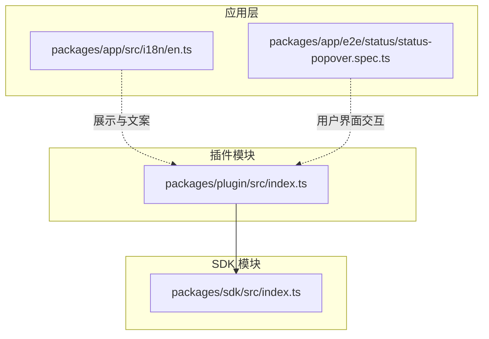

**图表来源**
- [packages/plugin/src/index.ts:1-235](file://packages/plugin/src/index.ts#L1-L235)
- [packages/sdk/src/index.ts](file://packages/sdk/src/index.ts)
- [packages/app/src/i18n/en.ts](file://packages/app/src/i18n/en.ts)
- [packages/app/e2e/status/status-popover.spec.ts](file://packages/app/e2e/status/status-popover.spec.ts)

**章节来源**
- [packages/plugin/src/index.ts:1-235](file://packages/plugin/src/index.ts#L1-L235)

## 核心组件
本节概述插件系统的核心类型与职责边界：
- 插件输入上下文：包含客户端、项目信息、工作目录、服务器地址、Bun Shell 工具等。
- 钩子接口：统一的生命周期回调集合，涵盖事件、配置、聊天消息、参数、请求头、权限询问、命令执行、工具执行、Shell 环境变量注入、实验性扩展点等。
- 认证与授权：支持 OAuth 与 API 两种授权方式，提供动态表单提示、条件显示、校验与回调。
- 工具定义：插件可注册工具，LLM 可按需调用；支持在工具定义阶段进行描述与参数的修改。

**章节来源**
- [packages/plugin/src/index.ts:20-35](file://packages/plugin/src/index.ts#L20-L35)
- [packages/plugin/src/index.ts:148-234](file://packages/plugin/src/index.ts#L148-L234)
- [packages/plugin/src/index.ts:37-103](file://packages/plugin/src/index.ts#L37-L103)
- [packages/plugin/src/index.ts:151-153](file://packages/plugin/src/index.ts#L151-L153)

## 架构总览
下图展示了插件与 SDK、应用层之间的交互关系，以及插件钩子在运行时的调用时机。

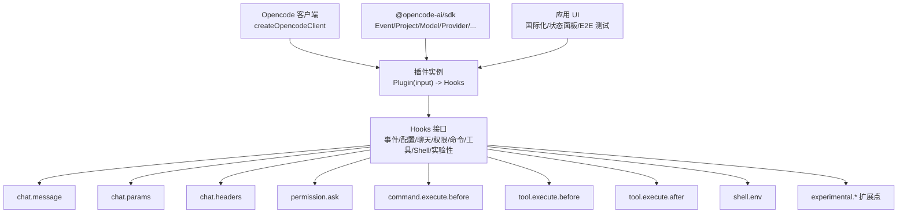

**图表来源**
- [packages/plugin/src/index.ts:26-35](file://packages/plugin/src/index.ts#L26-L35)
- [packages/plugin/src/index.ts:148-234](file://packages/plugin/src/index.ts#L148-L234)
- [packages/sdk/src/index.ts](file://packages/sdk/src/index.ts)
- [packages/app/src/i18n/en.ts](file://packages/app/src/i18n/en.ts)
- [packages/app/e2e/status/status-popover.spec.ts](file://packages/app/e2e/status/status-popover.spec.ts)

## 详细组件分析

### 插件类型与输入上下文
- 插件类型：函数签名接收 PluginInput 并返回 Hooks 对象。
- 插件输入上下文包含：
  - 客户端：由 SDK 提供的 createOpencodeClient 返回值。
  - 项目信息：Project。
  - 目录与工作树：字符串路径。
  - 服务器地址：URL。
  - Shell 工具：BunShell，用于执行系统命令与环境注入。

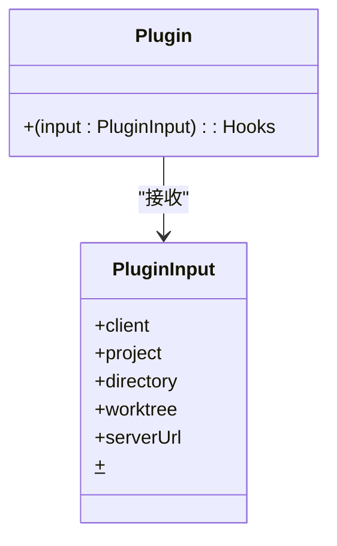

**图表来源**
- [packages/plugin/src/index.ts:26-35](file://packages/plugin/src/index.ts#L26-L35)
- [packages/plugin/src/index.ts:35-35](file://packages/plugin/src/index.ts#L35-L35)

**章节来源**
- [packages/plugin/src/index.ts:26-35](file://packages/plugin/src/index.ts#L26-L35)
- [packages/plugin/src/index.ts:35-35](file://packages/plugin/src/index.ts#L35-L35)

### 钩子接口（Hooks）
Hooks 是插件生命周期的核心扩展点，支持以下回调：
- 通用事件与配置：event、config
- 聊天相关：chat.message、chat.params、chat.headers
- 权限控制：permission.ask
- 命令与工具：command.execute.before、tool.execute.before、tool.execute.after、tool.definition
- Shell 环境：shell.env
- 实验性扩展：experimental.chat.messages.transform、experimental.chat.system.transform、experimental.session.compacting、experimental.text.complete

每个钩子均以“输入对象 + 输出对象”的形式传递数据，并允许异步修改输出对象中的字段。

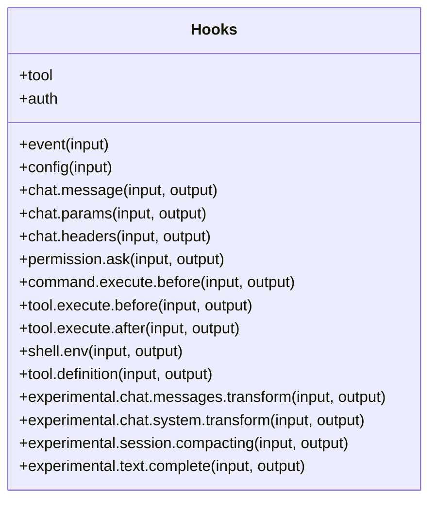

**图表来源**
- [packages/plugin/src/index.ts:148-234](file://packages/plugin/src/index.ts#L148-L234)

**章节来源**
- [packages/plugin/src/index.ts:148-234](file://packages/plugin/src/index.ts#L148-L234)

### 认证与授权（AuthHook）
支持两种授权方式：
- OAuth：提供 label 与可选的动态表单提示（文本框或选择框），包含校验与条件显示逻辑；authorize 返回 URL 与操作指引，并支持自动回调或代码回调。
- API：提供 label 与可选表单，authorize 返回成功或失败结果，成功时可携带 provider 或 key。

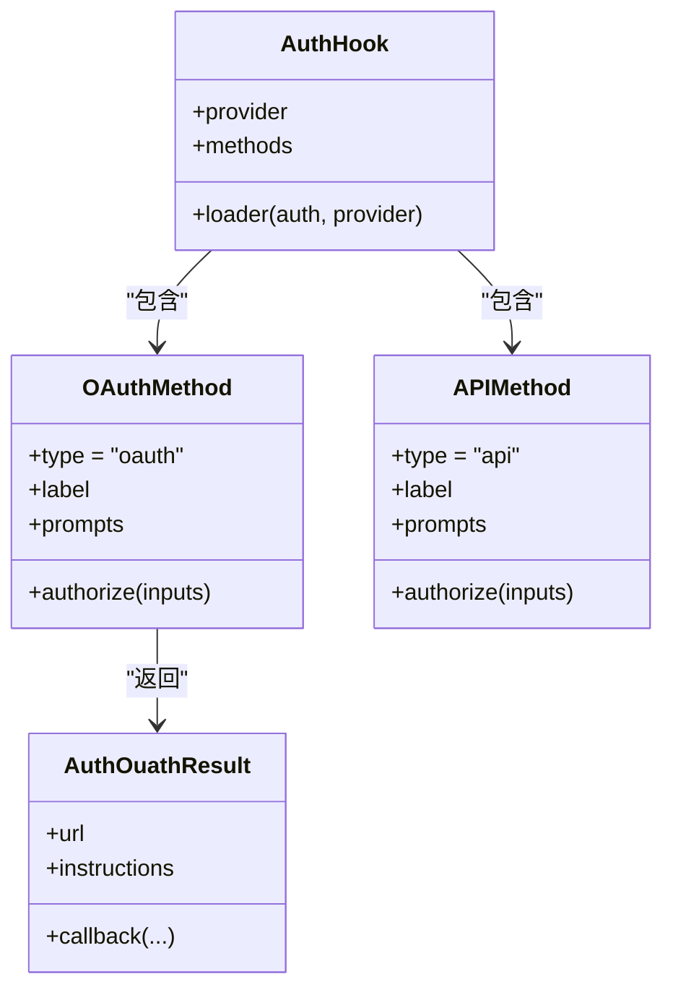

**图表来源**
- [packages/plugin/src/index.ts:37-103](file://packages/plugin/src/index.ts#L37-L103)
- [packages/plugin/src/index.ts:105-146](file://packages/plugin/src/index.ts#L105-L146)

**章节来源**
- [packages/plugin/src/index.ts:37-103](file://packages/plugin/src/index.ts#L37-L103)
- [packages/plugin/src/index.ts:105-146](file://packages/plugin/src/index.ts#L105-L146)

### 工具定义（ToolDefinition）
插件可通过 hooks.tool 注册工具，工具定义由 SDK 的 ToolDefinition 提供。在工具执行前后，可分别通过 tool.execute.before 与 tool.execute.after 进行参数修改与结果增强。

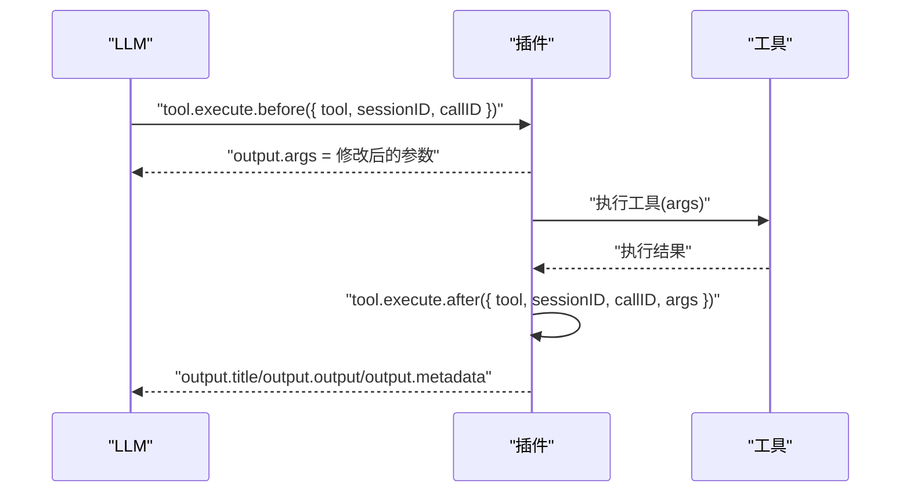

**图表来源**
- [packages/plugin/src/index.ts:151-153](file://packages/plugin/src/index.ts#L151-L153)
- [packages/plugin/src/index.ts:184-199](file://packages/plugin/src/index.ts#L184-L199)

**章节来源**
- [packages/plugin/src/index.ts:151-153](file://packages/plugin/src/index.ts#L151-L153)
- [packages/plugin/src/index.ts:184-199](file://packages/plugin/src/index.ts#L184-L199)

### 聊天消息与参数修改
- chat.message：在收到新消息时触发，可用于记录或转换消息内容。
- chat.params：允许修改温度、采样比例、选项等推理参数。
- chat.headers：允许注入额外请求头。

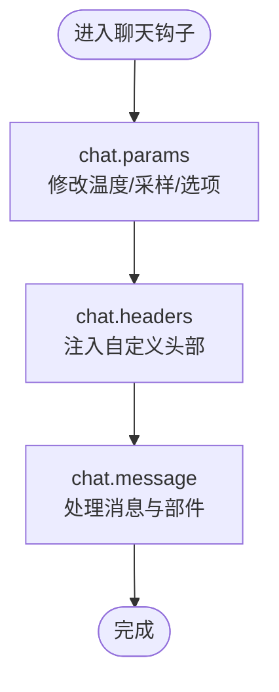

**图表来源**
- [packages/plugin/src/index.ts:158-178](file://packages/plugin/src/index.ts#L158-L178)

**章节来源**
- [packages/plugin/src/index.ts:158-178](file://packages/plugin/src/index.ts#L158-L178)

### 权限询问（permission.ask）
在需要用户授权时触发，允许插件决定放行、拒绝或进一步询问。

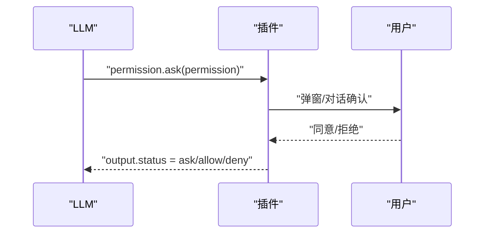

**图表来源**
- [packages/plugin/src/index.ts:179-179](file://packages/plugin/src/index.ts#L179-L179)

**章节来源**
- [packages/plugin/src/index.ts:179-179](file://packages/plugin/src/index.ts#L179-L179)

### 命令执行（command.execute.before）
在执行命令前触发，允许插件注入或修改命令参数（例如通过 parts）。

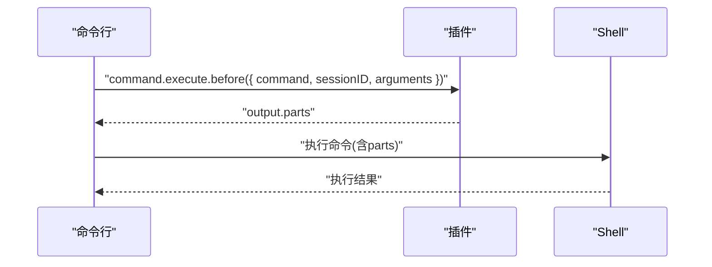

**图表来源**
- [packages/plugin/src/index.ts:180-183](file://packages/plugin/src/index.ts#L180-L183)

**章节来源**
- [packages/plugin/src/index.ts:180-183](file://packages/plugin/src/index.ts#L180-L183)

### Shell 环境变量注入（shell.env）
允许插件在执行命令时注入环境变量，支持按工作目录与会话标识进行定制。

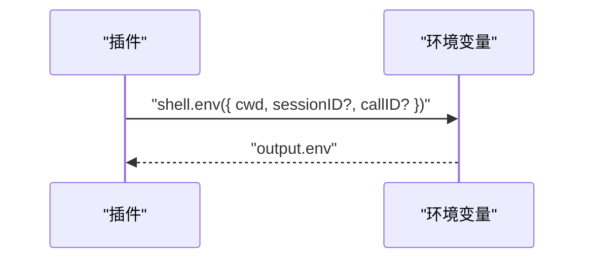

**图表来源**
- [packages/plugin/src/index.ts:188-191](file://packages/plugin/src/index.ts#L188-L191)

**章节来源**
- [packages/plugin/src/index.ts:188-191](file://packages/plugin/src/index.ts#L188-L191)

### 实验性扩展点
- experimental.chat.messages.transform：允许转换消息列表（消息与部件）。
- experimental.chat.system.transform：允许修改系统提示词数组。
- experimental.session.compacting：允许定制会话压缩提示（追加上下文或替换默认提示）。
- experimental.text.complete：允许修改部分文本补全结果。

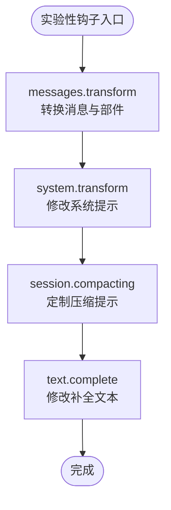

**图表来源**
- [packages/plugin/src/index.ts:200-229](file://packages/plugin/src/index.ts#L200-L229)

**章节来源**
- [packages/plugin/src/index.ts:200-229](file://packages/plugin/src/index.ts#L200-L229)

## 依赖关系分析
- 插件依赖 SDK 提供的基础类型与客户端能力。
- 应用层通过国际化文案与端到端测试体现插件状态展示与交互。

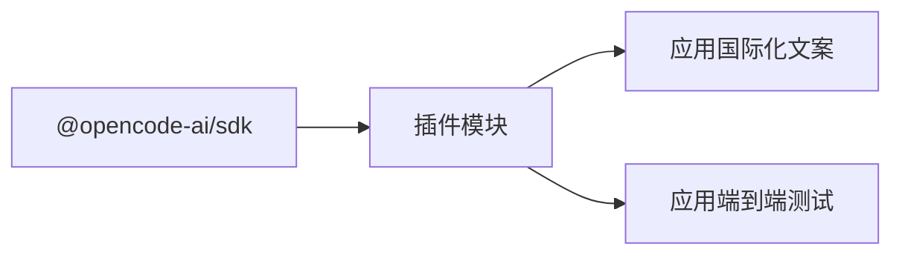

**图表来源**
- [packages/plugin/src/index.ts:1-13](file://packages/plugin/src/index.ts#L1-L13)
- [packages/app/src/i18n/en.ts](file://packages/app/src/i18n/en.ts)
- [packages/app/e2e/status/status-popover.spec.ts](file://packages/app/e2e/status/status-popover.spec.ts)

**章节来源**
- [packages/plugin/src/index.ts:1-13](file://packages/plugin/src/index.ts#L1-L13)
- [packages/app/src/i18n/en.ts](file://packages/app/src/i18n/en.ts)
- [packages/app/e2e/status/status-popover.spec.ts](file://packages/app/e2e/status/status-popover.spec.ts)

## 性能考虑
- 钩子回调应尽量保持轻量，避免阻塞主线程。
- chat.params 与 chat.headers 修改应最小化网络往返与计算开销。
- tool.execute.before/after 中的参数与结果处理应避免大对象深拷贝。
- experimental 扩展点仅在必要时启用，避免引入额外复杂度。
- shell.env 注入的环境变量数量与大小应受控，减少进程启动成本。

## 故障排除指南
- 插件未生效：检查插件是否正确导出并被应用加载；查看状态面板与国际化文案确认插件可见性。
- 认证失败：核对 OAuth 授权回调与 API 授权返回值；确保表单提示与校验逻辑满足当前 provider。
- 工具执行异常：检查 tool.execute.before 的参数修改是否符合工具期望；确认 tool.execute.after 的输出结构完整。
- 权限被拒绝：在 permission.ask 中提供清晰的解释与引导，避免频繁弹窗导致用户体验下降。

**章节来源**
- [packages/app/src/i18n/en.ts](file://packages/app/src/i18n/en.ts)
- [packages/app/e2e/status/status-popover.spec.ts](file://packages/app/e2e/status/status-popover.spec.ts)

## 结论
OpenCode 插件 API 通过 Hooks 提供了丰富的扩展点，覆盖从聊天参数、权限控制到工具执行与 Shell 环境注入的全链路能力。配合 SDK 的类型与客户端能力，插件可以安全、可控地增强 AI 会话体验。建议在开发过程中遵循性能与用户体验的最佳实践，并充分利用实验性扩展点进行创新。

## 附录

### TypeScript 类型与接口清单
- 插件输入上下文：PluginInput
- 插件类型：Plugin
- 钩子接口：Hooks
- 认证钩子：AuthHook
- OAuth 授权结果：AuthOuathResult
- 工具定义：ToolDefinition（来自 SDK）

**章节来源**
- [packages/plugin/src/index.ts:20-35](file://packages/plugin/src/index.ts#L20-L35)
- [packages/plugin/src/index.ts:35-35](file://packages/plugin/src/index.ts#L35-L35)
- [packages/plugin/src/index.ts:148-234](file://packages/plugin/src/index.ts#L148-L234)
- [packages/plugin/src/index.ts:37-103](file://packages/plugin/src/index.ts#L37-L103)
- [packages/plugin/src/index.ts:105-146](file://packages/plugin/src/index.ts#L105-L146)