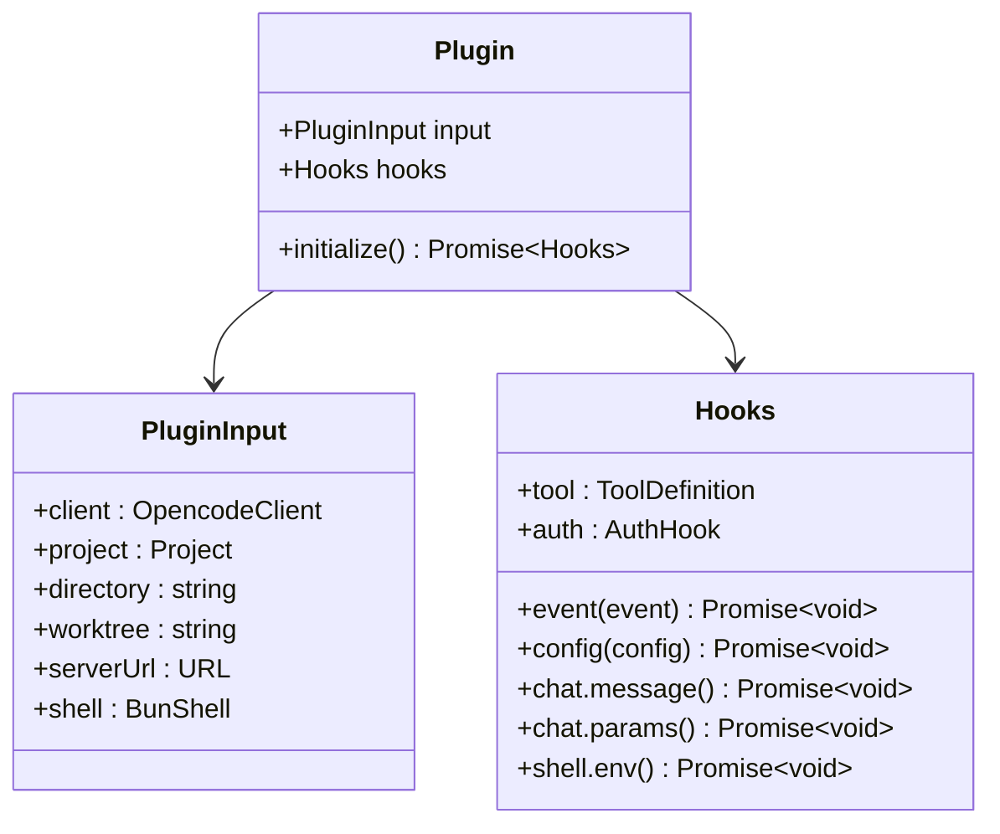
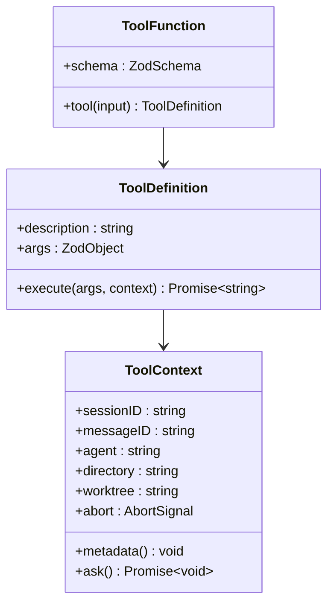
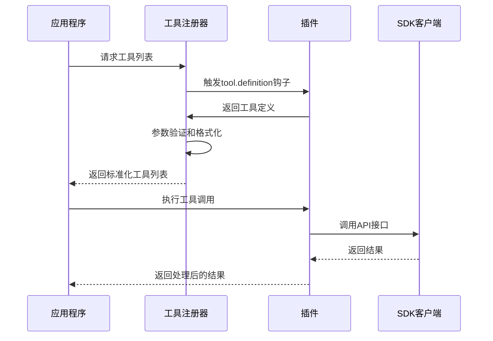
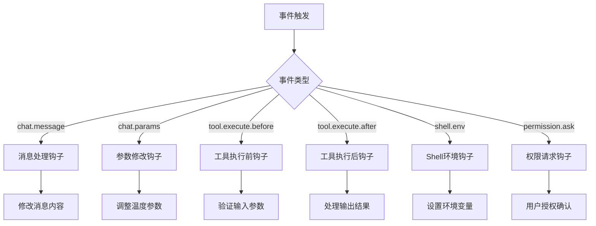
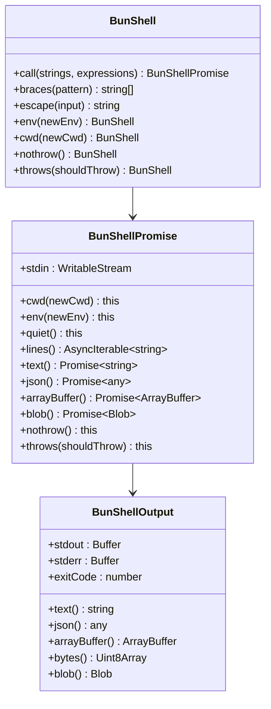
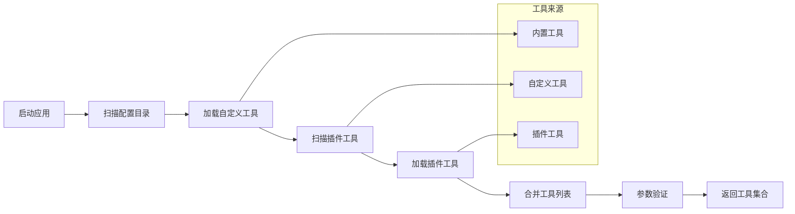
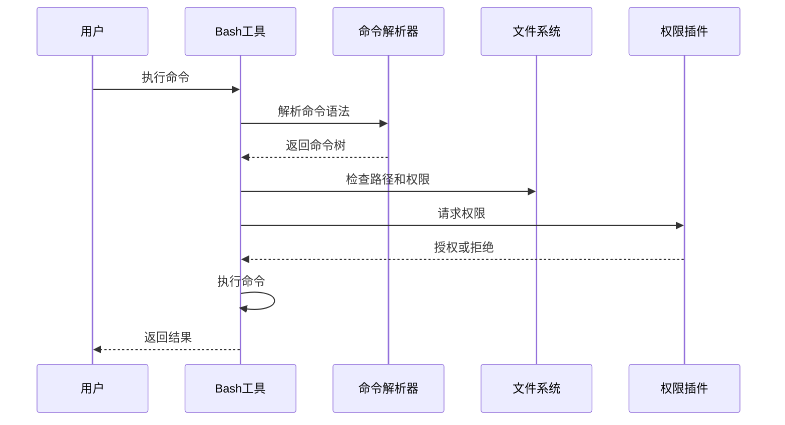
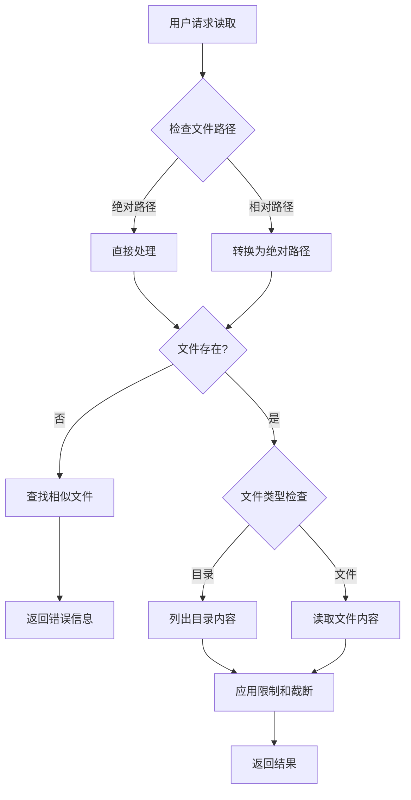
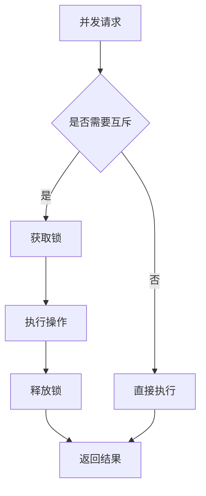

# 插件开发指南

<cite>
**本文档引用的文件**
- [packages/plugin/package.json](file://packages/plugin/package.json)
- [packages/plugin/src/index.ts](file://packages/plugin/src/index.ts)
- [packages/plugin/src/tool.ts](file://packages/plugin/src/tool.ts)
- [packages/plugin/src/shell.ts](file://packages/plugin/src/shell.ts)
- [packages/opencode/src/tool/registry.ts](file://packages/opencode/src/tool/registry.ts)
- [packages/opencode/src/tool/bash.ts](file://packages/opencode/src/tool/bash.ts)
- [packages/opencode/src/tool/read.ts](file://packages/opencode/src/tool/read.ts)
- [packages/opencode/src/tool/write.ts](file://packages/opencode/src/tool/write.ts)
- [packages/opencode/src/tool/edit.ts](file://packages/opencode/src/tool/edit.ts)
</cite>

## 目录
1. [简介](#简介)
2. [项目结构](#项目结构)
3. [核心组件](#核心组件)
4. [架构概览](#架构概览)
5. [详细组件分析](#详细组件分析)
6. [依赖关系分析](#依赖关系分析)
7. [性能考虑](#性能考虑)
8. [故障排除指南](#故障排除指南)
9. [结论](#结论)
10. [附录](#附录)

## 简介

OpenCode插件系统为开发者提供了一个强大的扩展框架，允许创建自定义工具和功能来增强AI助手的能力。本指南将详细介绍如何从零开始开发OpenCode插件，包括项目初始化、目录结构设计、配置文件编写以及核心接口的使用方法。

插件系统基于TypeScript构建，提供了完整的类型安全保证和丰富的扩展点。通过插件，开发者可以添加新的工具、修改AI交互行为、集成外部服务等。

## 项目结构

OpenCode插件系统采用模块化架构，主要由以下核心部分组成：

```mermaid
graph TB
subgraph "插件核心模块"
A[packages/plugin] --> B[index.ts 核心接口]
A --> C[tool.ts 工具定义]
A --> D[shell.ts Shell接口]
end
subgraph "工具注册模块"
E[packages/opencode/src/tool] --> F[registry.ts 工具注册器]
E --> G[bash.ts Bash工具]
E --> H[read.ts 读取工具]
E --> I[write.ts 写入工具]
E --> J[edit.ts 编辑工具]
end
subgraph "SDK依赖"
K[@opencode-ai/sdk] --> L[类型定义]
K --> M[客户端接口]
end
A --> K
F --> A
F --> E
```

**图表来源**
- [packages/plugin/src/index.ts:1-235](file://packages/plugin/src/index.ts#L1-L235)
- [packages/opencode/src/tool/registry.ts:1-175](file://packages/opencode/src/tool/registry.ts#L1-L175)

### 目录结构设计

插件开发遵循以下目录组织原则：

- **根目录**: 包含插件包配置和入口文件
- **src/**: 源代码目录，包含核心接口定义
- **工具实现**: 在工具注册模块中实现具体功能
- **类型定义**: 使用Zod进行参数验证和类型安全

**章节来源**
- [packages/plugin/package.json:1-29](file://packages/plugin/package.json#L1-L29)
- [packages/plugin/src/index.ts:1-50](file://packages/plugin/src/index.ts#L1-L50)

## 核心组件

### 插件接口定义

插件系统的核心是`Plugin`接口，它定义了插件的基本结构和生命周期：



**图表来源**
- [packages/plugin/src/index.ts:35-36](file://packages/plugin/src/index.ts#L35-L36)
- [packages/plugin/src/index.ts:26-33](file://packages/plugin/src/index.ts#L26-L33)
- [packages/plugin/src/index.ts:148-234](file://packages/plugin/src/index.ts#L148-L234)

### 工具定义系统

工具是插件的核心功能单元，通过`tool`函数创建：



**图表来源**
- [packages/plugin/src/tool.ts:29-35](file://packages/plugin/src/tool.ts#L29-L35)
- [packages/plugin/src/tool.ts:3-20](file://packages/plugin/src/tool.ts#L3-L20)

**章节来源**
- [packages/plugin/src/tool.ts:1-39](file://packages/plugin/src/tool.ts#L1-L39)

## 架构概览

OpenCode插件系统采用事件驱动架构，通过钩子机制实现松耦合的扩展点：



**图表来源**
- [packages/opencode/src/tool/registry.ts:162-170](file://packages/opencode/src/tool/registry.ts#L162-L170)
- [packages/plugin/src/index.ts:233-234](file://packages/plugin/src/index.ts#L233-L234)

### 事件处理机制

插件系统支持多种事件类型的监听和处理：



**图表来源**
- [packages/plugin/src/index.ts:148-234](file://packages/plugin/src/index.ts#L148-L234)

**章节来源**
- [packages/plugin/src/index.ts:148-234](file://packages/plugin/src/index.ts#L148-L234)

## 详细组件分析

### Shell接口实现

BunShell提供了强大的命令行执行能力，支持模板字符串语法和流式处理：



**图表来源**
- [packages/plugin/src/shell.ts:10-137](file://packages/plugin/src/shell.ts#L10-L137)

### 工具注册流程

工具注册器负责收集和管理所有可用工具：



**图表来源**
- [packages/opencode/src/tool/registry.ts:38-63](file://packages/opencode/src/tool/registry.ts#L38-L63)
- [packages/opencode/src/tool/registry.ts:99-126](file://packages/opencode/src/tool/registry.ts#L99-L126)

**章节来源**
- [packages/opencode/src/tool/registry.ts:1-175](file://packages/opencode/src/tool/registry.ts#L1-L175)

### 具体工具实现示例

#### Bash工具实现

Bash工具展示了如何实现复杂的命令执行和权限管理：



**图表来源**
- [packages/opencode/src/tool/bash.ts:78-268](file://packages/opencode/src/tool/bash.ts#L78-L268)

#### 读取工具实现

读取工具演示了文件操作的安全性和用户体验优化：



**图表来源**
- [packages/opencode/src/tool/read.ts:28-232](file://packages/opencode/src/tool/read.ts#L28-L232)

**章节来源**
- [packages/opencode/src/tool/bash.ts:1-271](file://packages/opencode/src/tool/bash.ts#L1-L271)
- [packages/opencode/src/tool/read.ts:1-294](file://packages/opencode/src/tool/read.ts#L1-L294)

## 依赖关系分析

插件系统采用清晰的依赖层次结构：

```mermaid
graph TB
subgraph "外部依赖"
A[zod 类型验证]
B[@opencode-ai/sdk SDK]
end
subgraph "内部模块"
C[插件核心]
D[工具注册器]
E[工具实现]
F[Shell接口]
end
subgraph "应用层"
G[主应用程序]
H[会话管理]
I[权限系统]
end
A --> C
B --> C
C --> D
C --> F
D --> E
E --> H
F --> I
G --> D
```

**图表来源**
- [packages/plugin/package.json:18-27](file://packages/plugin/package.json#L18-L27)
- [packages/plugin/src/index.ts:1-13](file://packages/plugin/src/index.ts#L1-L13)

### 关键依赖特性

- **类型安全**: 使用Zod确保参数验证和运行时类型检查
- **模块化设计**: 清晰的模块边界和依赖注入机制
- **异步处理**: 完全基于Promise的异步架构
- **错误处理**: 统一的错误处理和恢复机制

**章节来源**
- [packages/plugin/package.json:1-29](file://packages/plugin/package.json#L1-L29)

## 性能考虑

### 内存管理

插件系统在内存使用方面采用了多项优化策略：

1. **延迟加载**: 工具按需加载，减少启动时间
2. **缓存机制**: 使用懒加载模式缓存昂贵的操作结果
3. **流式处理**: 大文件和输出使用流式处理避免内存峰值

### 并发控制



**图表来源**
- [packages/opencode/src/tool/edit.ts:59-123](file://packages/opencode/src/tool/edit.ts#L59-L123)

### 性能优化建议

1. **合理使用权限**: 只在必要时请求权限，避免频繁的用户交互
2. **批量操作**: 合并多个小操作为批量操作
3. **结果缓存**: 对重复的计算结果进行缓存
4. **超时控制**: 为长时间运行的操作设置合理的超时

## 故障排除指南

### 常见问题及解决方案

#### 权限相关问题

**问题**: 工具执行被拒绝
**原因**: 权限系统阻止了操作
**解决方案**: 
- 检查工具的权限声明
- 验证用户授权状态
- 实现适当的权限提示逻辑

#### 参数验证失败

**问题**: 工具参数验证抛出异常
**原因**: 输入参数不符合Zod定义
**解决方案**:
- 检查工具参数定义
- 验证输入数据格式
- 添加适当的错误处理

#### 内存泄漏

**问题**: 应用程序内存使用持续增长
**原因**: 未正确清理资源或事件监听器
**解决方案**:
- 确保正确清理AbortSignal监听器
- 及时释放文件句柄和网络连接
- 使用WeakRef处理大对象引用

**章节来源**
- [packages/opencode/src/tool/bash.ts:209-243](file://packages/opencode/src/tool/bash.ts#L209-L243)
- [packages/opencode/src/tool/edit.ts:209-230](file://packages/opencode/src/tool/edit.ts#L209-L230)

## 结论

OpenCode插件系统提供了一个强大而灵活的扩展框架，支持从简单的工具添加到复杂的AI交互定制。通过理解其架构设计和核心组件，开发者可以创建高质量的插件来增强AI助手的功能。

关键成功因素包括：
- 深入理解钩子机制和事件处理
- 正确使用类型定义和参数验证
- 注重性能优化和资源管理
- 提供良好的用户体验和错误处理

## 附录

### 开发最佳实践

1. **模块化设计**: 将功能分解为独立的模块
2. **错误处理**: 实现全面的错误处理和恢复机制
3. **文档编写**: 为每个工具编写清晰的文档
4. **测试覆盖**: 编写充分的单元测试和集成测试
5. **性能监控**: 实施性能监控和优化

### 调试技巧

1. **日志记录**: 使用结构化日志记录关键操作
2. **断点调试**: 利用浏览器和Node.js调试器
3. **性能分析**: 使用性能分析工具识别瓶颈
4. **单元测试**: 编写可测试的代码结构

### 测试策略

1. **单元测试**: 测试单个函数和组件
2. **集成测试**: 测试组件间的交互
3. **端到端测试**: 测试完整的工作流程
4. **性能测试**: 验证性能要求的满足情况