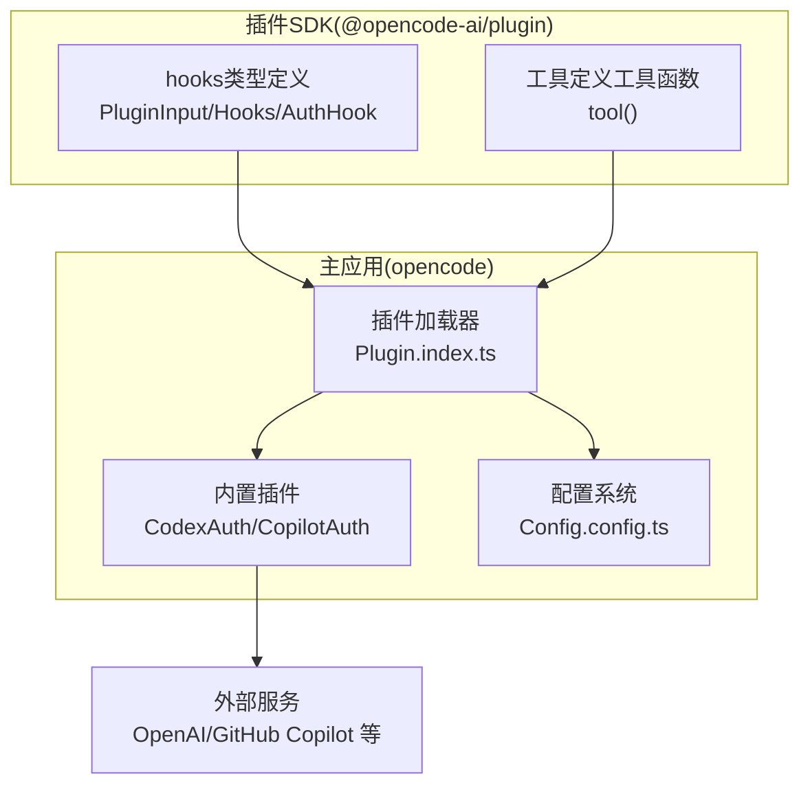
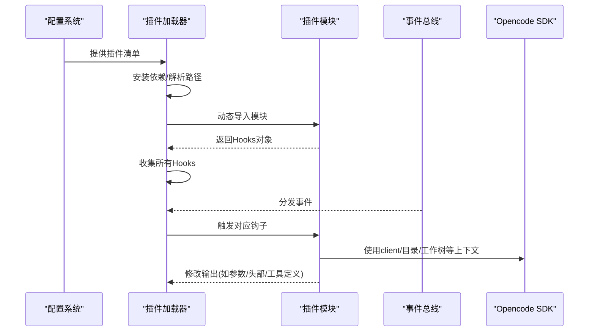
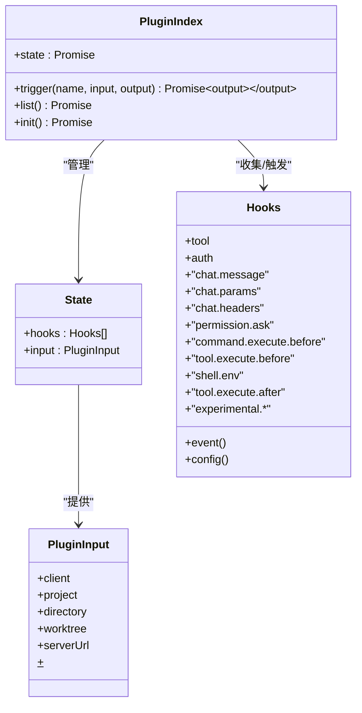
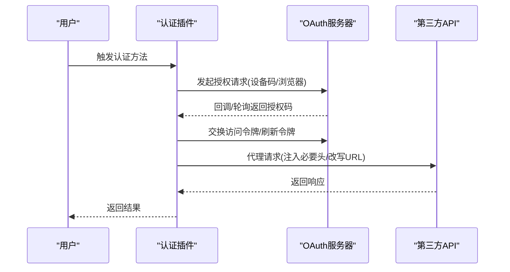
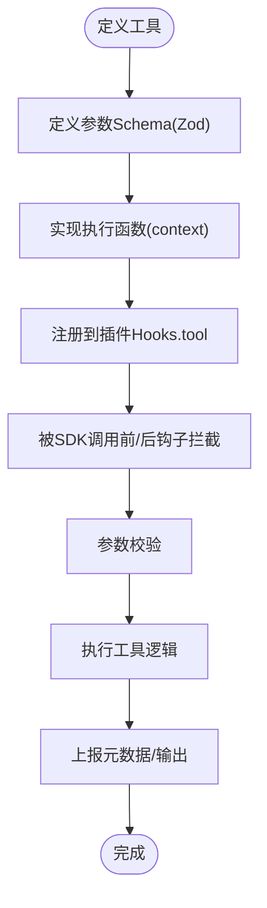
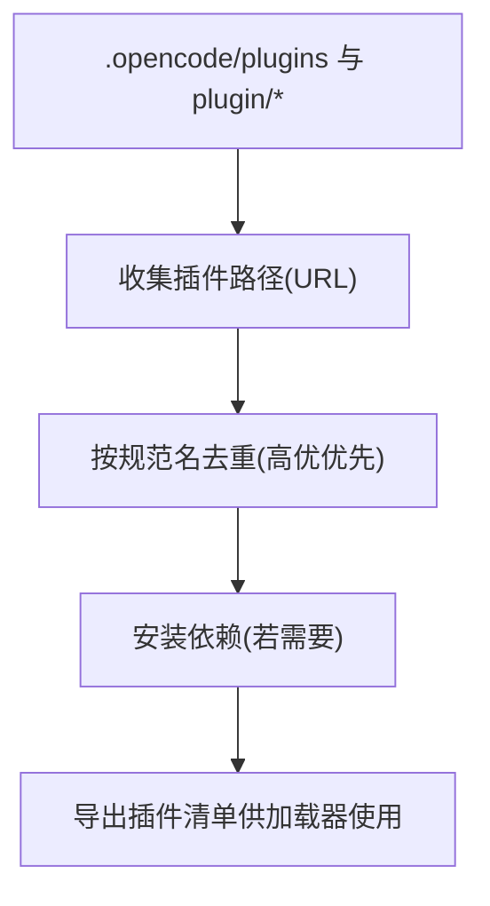
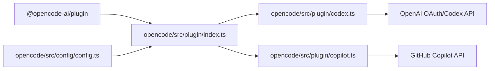

# 插件架构设计

<cite>
**本文档引用的文件**
- [packages/plugin/src/index.ts](file://packages/plugin/src/index.ts)
- [packages/plugin/src/tool.ts](file://packages/plugin/src/tool.ts)
- [packages/opencode/src/plugin/index.ts](file://packages/opencode/src/plugin/index.ts)
- [packages/opencode/src/plugin/codex.ts](file://packages/opencode/src/plugin/codex.ts)
- [packages/opencode/src/plugin/copilot.ts](file://packages/opencode/src/plugin/copilot.ts)
- [packages/opencode/src/config/config.ts](file://packages/opencode/src/config/config.ts)
</cite>

## 目录
1. [引言](#引言)
2. [项目结构](#项目结构)
3. [核心组件](#核心组件)
4. [架构总览](#架构总览)
5. [详细组件分析](#详细组件分析)
6. [依赖分析](#依赖分析)
7. [性能考虑](#性能考虑)
8. [故障排除指南](#故障排除指南)
9. [结论](#结论)

## 引言
本文件系统性阐述 OpenCode 插件架构的设计理念、实现方式与运行机制。重点覆盖以下方面：
- 插件系统整体架构模式与组件关系
- 插件生命周期管理、注册机制与依赖注入
- 插件与主系统的交互模式、事件驱动架构与通信协议
- 权限控制、安全模型与沙箱机制
- 架构决策的技术背景与权衡考量

## 项目结构
OpenCode 的插件体系由两部分组成：
- 插件 SDK（定义插件接口、钩子类型与工具定义）
- 主应用插件加载器（负责解析配置、安装/导入插件、触发钩子、分发事件）

**图表来源**
- [packages/plugin/src/index.ts:1-235](file://packages/plugin/src/index.ts#L1-L235)
- [packages/plugin/src/tool.ts:1-39](file://packages/plugin/src/tool.ts#L1-L39)
- [packages/opencode/src/plugin/index.ts:1-150](file://packages/opencode/src/plugin/index.ts#L1-L150)
- [packages/opencode/src/config/config.ts:497-509](file://packages/opencode/src/config/config.ts#L497-L509)

**章节来源**
- [packages/plugin/src/index.ts:1-235](file://packages/plugin/src/index.ts#L1-L235)
- [packages/plugin/src/tool.ts:1-39](file://packages/plugin/src/tool.ts#L1-L39)
- [packages/opencode/src/plugin/index.ts:1-150](file://packages/opencode/src/plugin/index.ts#L1-L150)
- [packages/opencode/src/config/config.ts:497-509](file://packages/opencode/src/config/config.ts#L497-L509)

## 核心组件
- 插件输入上下文（PluginInput）：向插件暴露客户端、项目信息、工作树路径、服务器 URL、Bun Shell 等运行时能力。
- 钩子接口（Hooks）：定义事件、配置、工具、认证、聊天参数/头部修改、命令/工具执行前后钩子等扩展点。
- 工具定义（tool()）：标准化工具描述、参数校验与执行上下文，支持元数据上报与权限询问。

这些抽象构成了插件生态的契约层，确保第三方插件可被统一加载、验证与调用。

**章节来源**
- [packages/plugin/src/index.ts:20-235](file://packages/plugin/src/index.ts#L20-L235)
- [packages/plugin/src/tool.ts:1-39](file://packages/plugin/src/tool.ts#L1-L39)

## 架构总览
OpenCode 插件采用“声明式钩子 + 动态加载”的架构模式：
- 配置驱动：通过配置系统收集插件清单，支持本地文件与 npm 包两种来源。
- 生命周期：初始化阶段安装依赖、导入模块、收集钩子；运行期通过事件总线分发事件并按序调用各插件钩子。
- 安全与权限：通过权限规则与“ask”钩子实现细粒度授权；内置认证插件对第三方服务进行 OAuth 设备码流程与令牌刷新。
- 通信协议：插件通过 SDK 暴露的钩子与主系统通信，同时可直接使用 Bun Shell 执行系统命令或发起网络请求。

**图表来源**
- [packages/opencode/src/plugin/index.ts:24-104](file://packages/opencode/src/plugin/index.ts#L24-L104)
- [packages/opencode/src/config/config.ts:497-509](file://packages/opencode/src/config/config.ts#L497-L509)

**章节来源**
- [packages/opencode/src/plugin/index.ts:1-150](file://packages/opencode/src/plugin/index.ts#L1-L150)
- [packages/opencode/src/config/config.ts:497-509](file://packages/opencode/src/config/config.ts#L497-L509)

## 详细组件分析

### 组件A：插件加载器（Plugin.index）
职责与行为：
- 初始化：构建 Opencode 客户端、获取项目/工作树/目录信息，准备 PluginInput。
- 内置插件：直接导入内置认证插件（Codex、Copilot、GitLab），立即初始化并收集其返回的 Hooks。
- 外部插件：根据配置解析插件清单，自动安装 npm 包或转换为 file:// URL，动态 import 并收集多个导出的插件函数。
- 事件与配置：在初始化完成后，订阅全局事件并通过 bus 分发给各插件；同时调用每个插件的 config 钩子传递配置。
- 钩子触发：提供统一的 trigger 方法，按顺序调用所有插件的指定钩子，并将输入/输出按约定传递。

**图表来源**
- [packages/opencode/src/plugin/index.ts:16-149](file://packages/opencode/src/plugin/index.ts#L16-L149)
- [packages/plugin/src/index.ts:20-235](file://packages/plugin/src/index.ts#L20-L235)

**章节来源**
- [packages/opencode/src/plugin/index.ts:1-150](file://packages/opencode/src/plugin/index.ts#L1-L150)

### 组件B：内置认证插件（CodexAuth/CopilotAuth）
职责与行为：
- CodexAuth：针对 OpenAI ChatGPT Codex 的认证与请求代理，实现 PKCE/OAuth 流程、设备码轮询、令牌刷新与请求头改写。
- CopilotAuth：针对 GitHub Copilot 的认证与请求代理，支持 GitHub.com 与 GitHub Enterprise，实现设备码授权、请求头注入与企业域名适配。

**图表来源**
- [packages/opencode/src/plugin/codex.ts:247-351](file://packages/opencode/src/plugin/codex.ts#L247-L351)
- [packages/opencode/src/plugin/copilot.ts:184-300](file://packages/opencode/src/plugin/copilot.ts#L184-L300)

**章节来源**
- [packages/opencode/src/plugin/codex.ts:1-628](file://packages/opencode/src/plugin/codex.ts#L1-L628)
- [packages/opencode/src/plugin/copilot.ts:1-347](file://packages/opencode/src/plugin/copilot.ts#L1-L347)

### 组件C：工具定义与执行（tool）
职责与行为：
- 工具定义：通过 tool() 函数声明工具描述、参数 Schema（基于 Zod）与执行函数。
- 执行上下文：提供会话/消息/代理/目录/工作树/AbortSignal 等上下文，支持元数据上报与权限询问。
- 类型安全：利用 Zod 对参数进行编译期/运行期校验，保证工具调用的健壮性。

**图表来源**
- [packages/plugin/src/tool.ts:29-39](file://packages/plugin/src/tool.ts#L29-L39)

**章节来源**
- [packages/plugin/src/tool.ts:1-39](file://packages/plugin/src/tool.ts#L1-L39)

### 组件D：配置系统与插件发现
职责与行为：
- 插件发现：扫描 .opencode/plugins 或项目内 plugin 文件夹，收集本地插件路径。
- 插件去重：按规范名去重，保留高优先级来源的最后一个条目。
- 依赖安装：为每个配置目录生成/更新 package.json 并安装 @opencode-ai/plugin 及其他依赖。

**图表来源**
- [packages/opencode/src/config/config.ts:497-509](file://packages/opencode/src/config/config.ts#L497-L509)
- [packages/opencode/src/config/config.ts:543-561](file://packages/opencode/src/config/config.ts#L543-L561)

**章节来源**
- [packages/opencode/src/config/config.ts:497-509](file://packages/opencode/src/config/config.ts#L497-L509)
- [packages/opencode/src/config/config.ts:543-561](file://packages/opencode/src/config/config.ts#L543-L561)

## 依赖分析
- 插件 SDK 与主应用的耦合点主要在 Hooks 类型与 PluginInput 接口，通过严格的类型约束降低运行时错误。
- 加载器对配置系统的依赖体现在插件清单与依赖安装流程；对事件总线的依赖体现在事件分发与钩子触发。
- 认证插件对第三方服务的依赖通过独立模块化实现，便于替换与扩展。

**图表来源**
- [packages/plugin/src/index.ts:1-18](file://packages/plugin/src/index.ts#L1-L18)
- [packages/opencode/src/plugin/index.ts:1-16](file://packages/opencode/src/plugin/index.ts#L1-L16)
- [packages/opencode/src/config/config.ts:497-509](file://packages/opencode/src/config/config.ts#L497-L509)

**章节来源**
- [packages/plugin/src/index.ts:1-18](file://packages/plugin/src/index.ts#L1-L18)
- [packages/opencode/src/plugin/index.ts:1-16](file://packages/opencode/src/plugin/index.ts#L1-L16)
- [packages/opencode/src/config/config.ts:497-509](file://packages/opencode/src/config/config.ts#L497-L509)

## 性能考虑
- 动态导入与去重：通过去重与按需安装减少重复加载与网络请求。
- 事件串行触发：钩子按顺序依次执行，避免并发竞争但可能带来延迟；可通过异步化与并行策略优化（需谨慎处理副作用）。
- 认证缓存与刷新：内置插件对令牌进行刷新与缓存，减少频繁授权开销。
- I/O 与锁：依赖安装使用写锁避免竞态，建议在 CI/离线场景禁用缓存以确保一致性。

## 故障排除指南
- 插件安装失败：检查网络与代理设置，确认包名与版本号正确；查看安装日志中的错误码与标准输出。
- 插件加载失败：确认导出的插件函数签名符合 Plugin 类型；避免默认导出与命名导出重复导致的重复初始化。
- 认证流程异常：核对 OAuth 回调地址、状态校验与 PKCE 参数；检查浏览器/设备码授权是否超时。
- 权限拒绝：确认权限规则配置与 ask 钩子返回值；检查工具执行前后的权限询问逻辑。

**章节来源**
- [packages/opencode/src/plugin/index.ts:70-103](file://packages/opencode/src/plugin/index.ts#L70-L103)
- [packages/opencode/src/plugin/codex.ts:247-351](file://packages/opencode/src/plugin/codex.ts#L247-L351)
- [packages/opencode/src/plugin/copilot.ts:184-300](file://packages/opencode/src/plugin/copilot.ts#L184-L300)

## 结论
OpenCode 插件架构以“类型安全的钩子 + 配置驱动的加载 + 事件驱动的协作”为核心，实现了高扩展性与强约束的平衡。通过内置认证插件与统一的工具定义，既保证了第三方集成的便利性，又维持了主系统的可控性与安全性。未来可在以下方向持续演进：
- 将钩子触发改为可选并行化，提升响应速度；
- 增强插件沙箱隔离与资源限制；
- 完善插件热重载与灰度发布机制；
- 扩展 MCP 等标准协议以增强互操作性。