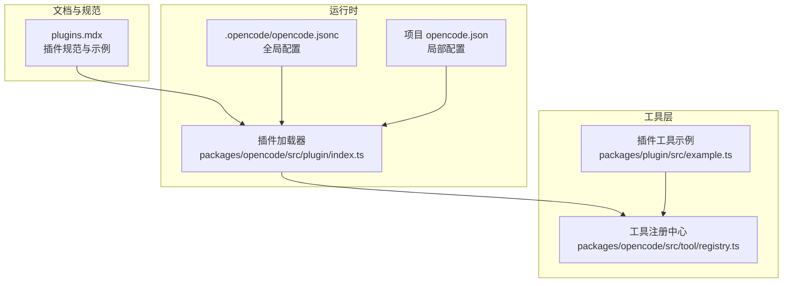
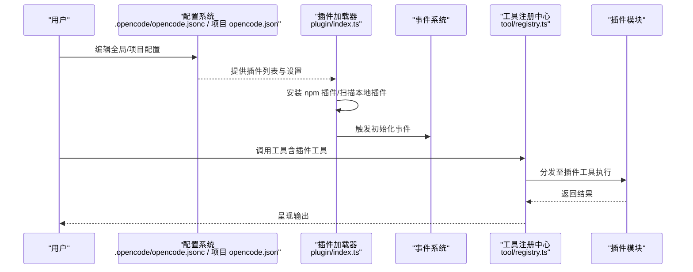
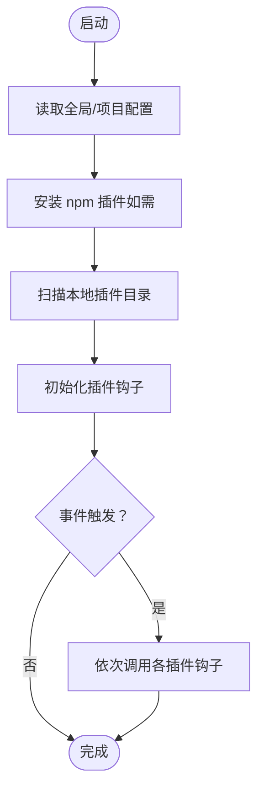
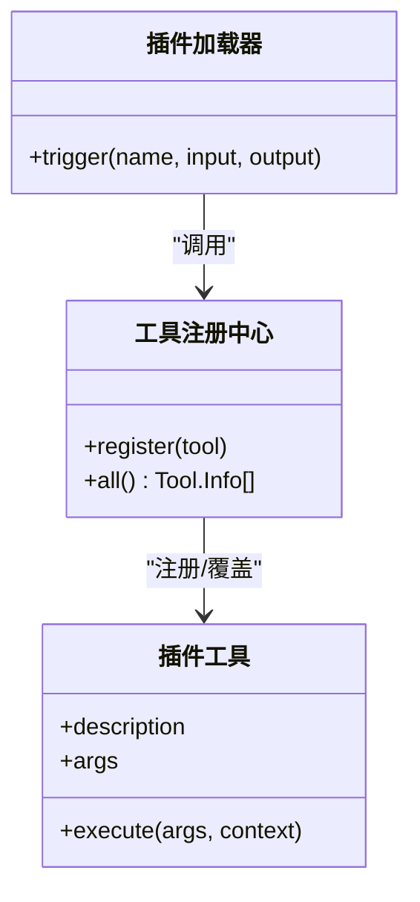
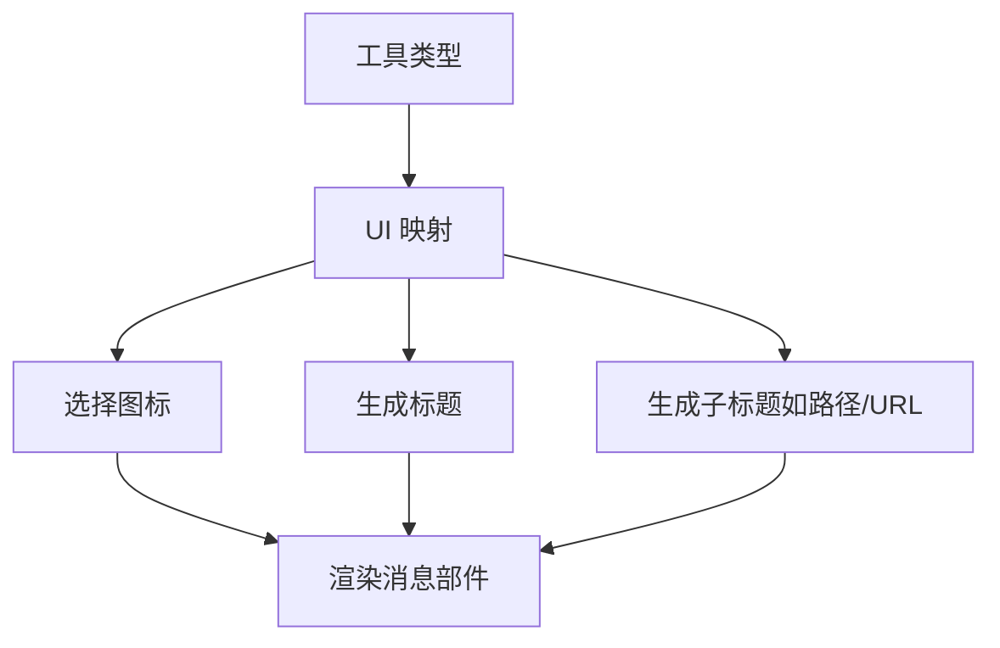
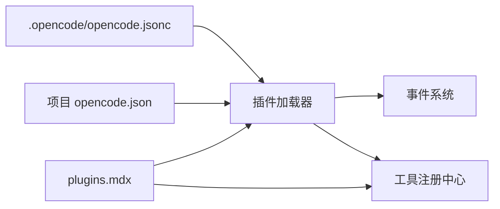

# 插件示例与最佳实践

<cite>
**本文引用的文件**
- [README.md](file://README.md)
- [.opencode/opencode.jsonc](file://.opencode/opencode.jsonc)
- [.opencode/env.d.ts](file://.opencode/env.d.ts)
- [packages/web/src/content/docs/plugins.mdx](file://packages/web/src/content/docs/plugins.mdx)
- [packages/opencode/src/plugin/index.ts](file://packages/opencode/src/plugin/index.ts)
- [packages/opencode/test/config/config.test.ts](file://packages/opencode/test/config/config.test.ts)
- [packages/opencode/src/tool/registry.ts](file://packages/opencode/src/tool/registry.ts)
- [packages/plugin/src/example.ts](file://packages/plugin/src/example.ts)
</cite>

## 目录
1. [简介](#简介)
2. [项目结构](#项目结构)
3. [核心组件](#核心组件)
4. [架构总览](#架构总览)
5. [详细组件分析](#详细组件分析)
6. [依赖分析](#依赖分析)
7. [性能考虑](#性能考虑)
8. [故障排查指南](#故障排查指南)
9. [结论](#结论)
10. [附录](#附录)

## 简介
本指南面向希望在 OpenCode 中编写与扩展插件的开发者，系统性地介绍插件体系的加载机制、事件钩子、工具扩展与 UI 扩展能力，并提供工具插件、代理插件与 UI 扩展插件的示例思路与最佳实践。文档同时覆盖测试、调试与发布流程，以及插件市场与分发策略建议。

## 项目结构
OpenCode 的插件生态由“文档规范”“运行时加载器”“工具注册中心”“示例与测试”等部分组成：
- 文档层：官方文档对插件的安装、加载顺序、事件钩子与示例进行说明
- 运行时：插件加载器负责解析全局与项目级配置、安装 npm 插件、扫描本地插件目录并触发事件钩子
- 工具层：插件可注册自定义工具，与内置工具统一纳入工具注册中心
- 示例与测试：提供最小可用示例与配置合并行为的测试用例

图表来源
- [packages/web/src/content/docs/plugins.mdx](file://packages/web/src/content/docs/plugins.mdx)
- [packages/opencode/src/plugin/index.ts](file://packages/opencode/src/plugin/index.ts)
- [packages/opencode/src/tool/registry.ts](file://packages/opencode/src/tool/registry.ts)
- [packages/plugin/src/example.ts](file://packages/plugin/src/example.ts)
- [.opencode/opencode.jsonc](file://.opencode/opencode.jsonc)

章节来源
- [README.md](file://README.md)
- [packages/web/src/content/docs/plugins.mdx](file://packages/web/src/content/docs/plugins.mdx)
- [.opencode/opencode.jsonc](file://.opencode/opencode.jsonc)

## 核心组件
- 插件加载器：负责按顺序加载全局与项目配置、安装 npm 插件、扫描本地插件目录，并触发事件钩子
- 事件钩子：插件通过导出的钩子函数订阅各类事件（命令、文件、会话、工具执行等）
- 工具注册中心：将插件注册的工具与内置工具统一管理，支持同名覆盖与优先级控制
- 示例与测试：提供最小可用插件示例与配置合并行为的测试用例

章节来源
- [packages/opencode/src/plugin/index.ts](file://packages/opencode/src/plugin/index.ts)
- [packages/opencode/src/tool/registry.ts](file://packages/opencode/src/tool/registry.ts)
- [packages/plugin/src/example.ts](file://packages/plugin/src/example.ts)
- [packages/opencode/test/config/config.test.ts](file://packages/opencode/test/config/config.test.ts)

## 架构总览
下图展示了从配置到插件加载、事件触发与工具执行的整体流程：

图表来源
- [packages/opencode/src/plugin/index.ts](file://packages/opencode/src/plugin/index.ts)
- [packages/opencode/src/tool/registry.ts](file://packages/opencode/src/tool/registry.ts)
- [.opencode/opencode.jsonc](file://.opencode/opencode.jsonc)

## 详细组件分析

### 组件A：插件加载器与事件系统
- 加载顺序：全局配置 → 项目配置 → 全局插件目录 → 项目插件目录；重复 npm 包去重，本地与 npm 同名插件可共存
- 错误处理：加载失败时记录错误并通过会话事件广播
- 事件触发：按名称触发钩子，支持多插件链式调用

图表来源
- [packages/opencode/src/plugin/index.ts](file://packages/opencode/src/plugin/index.ts)

章节来源
- [packages/opencode/src/plugin/index.ts](file://packages/opencode/src/plugin/index.ts)
- [packages/opencode/test/config/config.test.ts](file://packages/opencode/test/config/config.test.ts)

### 组件B：工具注册与插件工具
- 插件可通过工具注册接口向系统注入自定义工具
- 注册后与内置工具统一管理，支持同名覆盖
- 工具执行上下文包含工作目录与工作树路径等

图表来源
- [packages/opencode/src/tool/registry.ts](file://packages/opencode/src/tool/registry.ts)
- [packages/plugin/src/example.ts](file://packages/plugin/src/example.ts)

章节来源
- [packages/opencode/src/tool/registry.ts](file://packages/opencode/src/tool/registry.ts)
- [packages/plugin/src/example.ts](file://packages/plugin/src/example.ts)

### 组件C：UI 扩展与消息部件
- UI 层根据工具类型映射图标与标题，支持文件路径、URL 等子标题显示
- 可用于增强工具执行结果的可视化呈现

图表来源
- [packages/web/src/content/docs/plugins.mdx](file://packages/web/src/content/docs/plugins.mdx)

章节来源
- [packages/web/src/content/docs/plugins.mdx](file://packages/web/src/content/docs/plugins.mdx)

## 依赖分析
- 配置依赖：全局与项目配置共同决定插件列表与权限、工具开关等
- 运行时依赖：插件加载器依赖配置系统与事件总线；工具注册中心依赖配置与实例状态
- 文档依赖：官方文档提供事件清单、示例与最佳实践

图表来源
- [.opencode/opencode.jsonc](file://.opencode/opencode.jsonc)
- [packages/web/src/content/docs/plugins.mdx](file://packages/web/src/content/docs/plugins.mdx)
- [packages/opencode/src/plugin/index.ts](file://packages/opencode/src/plugin/index.ts)
- [packages/opencode/src/tool/registry.ts](file://packages/opencode/src/tool/registry.ts)

章节来源
- [.opencode/opencode.jsonc](file://.opencode/opencode.jsonc)
- [packages/web/src/content/docs/plugins.mdx](file://packages/web/src/content/docs/plugins.mdx)
- [packages/opencode/src/plugin/index.ts](file://packages/opencode/src/plugin/index.ts)
- [packages/opencode/src/tool/registry.ts](file://packages/opencode/src/tool/registry.ts)

## 性能考虑
- 插件加载顺序与去重：避免重复安装与多次初始化，减少启动时间
- 事件钩子链路：尽量短小精悍，避免阻塞主流程；必要时采用异步与超时控制
- 工具执行：对大输出进行截断与落盘，避免 UI 卡顿
- 本地插件依赖：通过项目内 package.json 管理依赖，减少全局缓存压力

## 故障排查指南
- 插件加载失败：检查错误日志与会话错误事件，确认包名、版本与权限配置
- 事件未触发：核对事件名称是否正确，确认插件导出的钩子函数已返回
- 工具未生效：确认工具已在注册中心注册且未被同名内置工具覆盖
- 配置合并异常：验证全局与项目配置中的数组合并逻辑，确保无重复项

章节来源
- [packages/opencode/src/plugin/index.ts](file://packages/opencode/src/plugin/index.ts)
- [packages/opencode/test/config/config.test.ts](file://packages/opencode/test/config/config.test.ts)

## 结论
OpenCode 的插件体系以“配置驱动 + 事件钩子 + 工具注册”为核心，既保证了灵活性，又维持了可维护性。通过本文提供的示例与最佳实践，开发者可以快速构建工具插件、代理插件与 UI 扩展插件，并在测试、调试与发布环节形成闭环。

## 附录

### 插件类型与示例思路
- 工具插件
  - 设计思路：通过工具注册接口注入自定义工具，提供描述、参数校验与执行逻辑
  - 实现要点：使用 Zod schema 校验参数；在执行中访问工作目录与工作树路径
  - 使用场景：封装复杂外部服务调用、批量文件处理、跨域数据检索
  - 参考路径
    - [packages/plugin/src/example.ts](file://packages/plugin/src/example.ts)
    - [packages/opencode/src/tool/registry.ts](file://packages/opencode/src/tool/registry.ts)
- 代理插件
  - 设计思路：订阅会话与工具执行事件，在执行前后注入环境变量、安全校验或上下文
  - 实现要点：利用 shell.env 与 tool.execute.before/after 钩子
  - 使用场景：环境隔离、敏感信息保护、上下文增强
  - 参考路径
    - [packages/web/src/content/docs/plugins.mdx](file://packages/web/src/content/docs/plugins.mdx)
- UI 扩展插件
  - 设计思路：基于工具类型映射图标与标题，增强消息部件的可读性
  - 实现要点：遵循工具信息结构，提供图标、标题与子标题
  - 使用场景：文件操作、网络请求、搜索结果的可视化
  - 参考路径
    - [packages/web/src/content/docs/plugins.mdx](file://packages/web/src/content/docs/plugins.mdx)

### 最佳实践
- 代码组织
  - 将插件拆分为功能模块，保持单一职责；导出命名清晰的插件函数
  - 使用 TypeScript 并引入插件类型，提升开发体验与可维护性
- 错误处理
  - 在钩子中捕获异常并上报；对不可恢复错误抛出明确错误对象
- 性能优化
  - 避免在钩子中执行耗时操作；必要时采用异步与节流
  - 对工具输出进行截断与缓存，减少 UI 压力
- 用户体验
  - 提供结构化日志与可读的提示信息；在 UI 中直观展示工具状态与结果

### 测试、调试与发布流程
- 测试
  - 利用配置合并测试用例验证全局与项目配置的行为一致性
  - 为插件钩子编写单元测试，覆盖正常与异常分支
- 调试
  - 使用客户端日志接口输出结构化日志；结合事件钩子定位问题
- 发布
  - 通过 npm 发布插件包；在文档中提供使用说明与示例
  - 提供最小可运行示例与变更日志，便于用户升级

章节来源
- [packages/opencode/test/config/config.test.ts](file://packages/opencode/test/config/config.test.ts)
- [packages/web/src/content/docs/plugins.mdx](file://packages/web/src/content/docs/plugins.mdx)

### 插件市场与分发策略
- 官方生态页面展示社区插件，鼓励开源与协作
- 通过 npm 生态分发，支持作用域包与私有仓库
- 提供示例模板与脚手架，降低上手成本

章节来源
- [packages/web/src/content/docs/plugins.mdx](file://packages/web/src/content/docs/plugins.mdx)