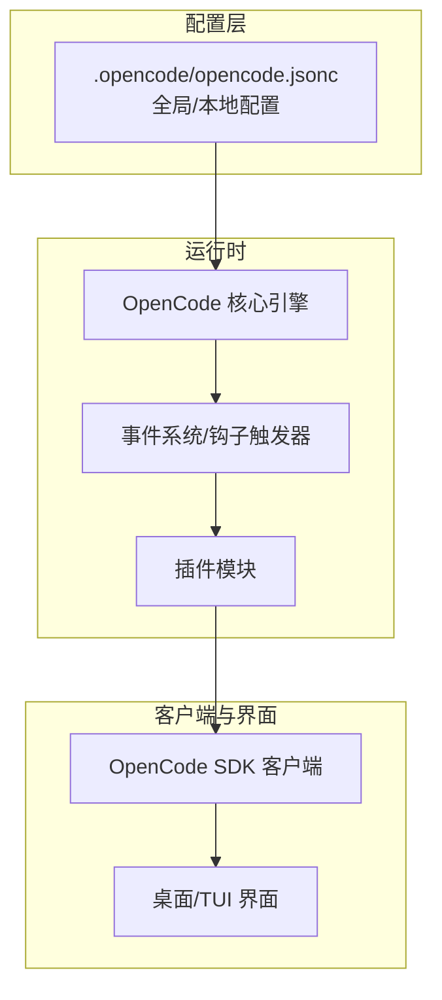
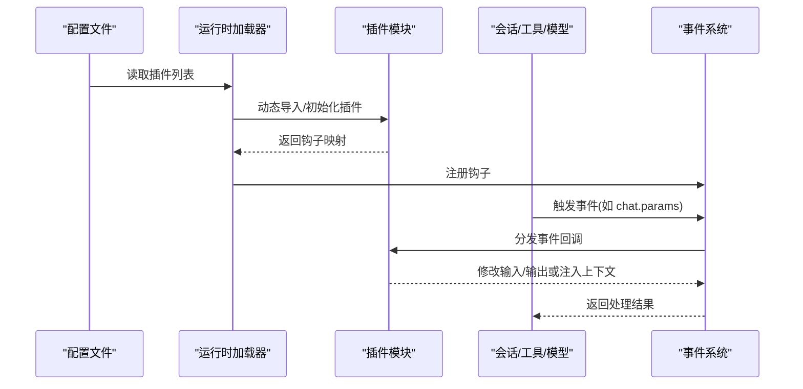
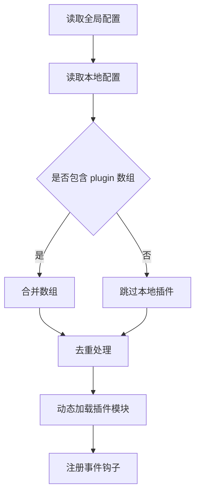
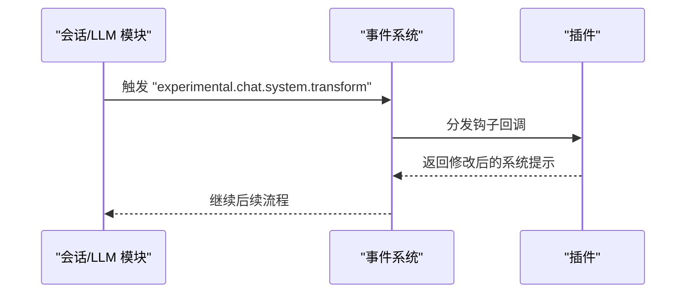
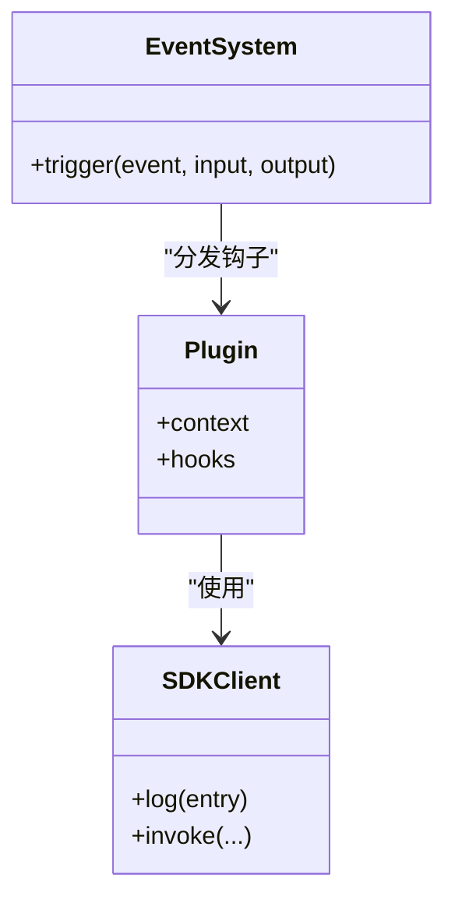

# 插件系统

<cite>
**本文引用的文件**
- [README.md](file://README.md)
- [.opencode/opencode.jsonc](file://.opencode/opencode.jsonc)
- [packages/opencode/test/config/config.test.ts](file://packages/opencode/test/config/config.test.ts)
- [packages/opencode/src/session/llm.ts](file://packages/opencode/src/session/llm.ts)
- [packages/opencode/src/provider/provider.ts](file://packages/opencode/src/provider/provider.ts)
- [packages/web/src/content/docs/plugins.mdx](file://packages/web/src/content/docs/plugins.mdx)
- [packages/web/src/content/docs/fr/plugins.mdx](file://packages/web/src/content/docs/fr/plugins.mdx)
- [packages/web/src/content/docs/da/plugins.mdx](file://packages/web/src/content/docs/da/plugins.mdx)
- [packages/web/src/content/docs/nb/plugins.mdx](file://packages/web/src/content/docs/nb/plugins.mdx)
- [packages/web/src/content/docs/bs/plugins.mdx](file://packages/web/src/content/docs/bs/plugins.mdx)
- [packages/web/src/content/docs/th/troubleshooting.mdx](file://packages/web/src/content/docs/th/troubleshooting.mdx)
- [packages/app/e2e/status/status-popover.spec.ts](file://packages/app/e2e/status/status-popover.spec.ts)
- [packages/app/src/i18n/en.ts](file://packages/app/src/i18n/en.ts)
- [packages/app/src/i18n/de.ts](file://packages/app/src/i18n/de.ts)
- [packages/app/src/i18n/fr.ts](file://packages/app/src/i18n/fr.ts)
- [packages/app/src/i18n/es.ts](file://packages/app/src/i18n/es.ts)
- [packages/app/src/i18n/ja.ts](file://packages/app/src/i18n/ja.ts)
- [packages/app/src/i18n/zh.ts](file://packages/app/src/i18n/zh.ts)
- [packages/desktop/src-tauri/src/lib.rs](file://packages/desktop/src-tauri/src/lib.rs)
- [packages/opencode/src/cli/cmd/tui/ui/dialog.tsx](file://packages/opencode/src/cli/cmd/tui/ui/dialog.tsx)
- [packages/strategy-service/internal/web/api.go](file://packages/strategy-service/internal/web/api.go)
- [packages/smartx-workflow/src/hooks.ts](file://packages/smartx-workflow/src/hooks.ts)
</cite>

## 目录
1. [简介](#简介)
2. [项目结构](#项目结构)
3. [核心组件](#核心组件)
4. [架构总览](#架构总览)
5. [详细组件分析](#详细组件分析)
6. [依赖关系分析](#依赖关系分析)
7. [性能考量](#性能考量)
8. [故障排查指南](#故障排查指南)
9. [结论](#结论)
10. [附录](#附录)

## 简介
本文件系统性解析 OpenCode 的插件体系：插件类型、生命周期与注册机制；插件与主系统的交互方式、事件系统与 API 接口；并提供从项目结构、配置文件、代码示例到测试方法的完整开发教程，覆盖打包、分发与版本管理策略，同时给出常用插件模板与最佳实践，以及调试与性能优化建议。

## 项目结构
OpenCode 插件生态围绕“配置驱动 + 事件钩子 + SDK 客户端”的模式组织，核心要点如下：
- 配置层：通过全局与本地配置文件声明启用的插件列表，并支持合并去重。
- 执行层：在会话、工具执行、模型参数等关键路径触发插件事件钩子。
- 开发生态：官方文档提供多语言插件开发指南与示例，涵盖 TypeScript 类型安全、依赖安装与日志上报。
- 用户界面：桌面端与 TUI 界面展示插件状态与空态文案，便于用户感知与排查。

图表来源
- [.opencode/opencode.jsonc:1-19](file://.opencode/opencode.jsonc#L1-L19)
- [packages/opencode/test/config/config.test.ts:852-887](file://packages/opencode/test/config/config.test.ts#L852-L887)
- [packages/opencode/src/session/llm.ts:82-120](file://packages/opencode/src/session/llm.ts#L82-L120)
- [packages/web/src/content/docs/plugins.mdx:87-143](file://packages/web/src/content/docs/plugins.mdx#L87-L143)
- [packages/app/e2e/status/status-popover.spec.ts:11-71](file://packages/app/e2e/status/status-popover.spec.ts#L11-L71)

章节来源
- [README.md:1-142](file://README.md#L1-L142)
- [.opencode/opencode.jsonc:1-19](file://.opencode/opencode.jsonc#L1-L19)
- [packages/opencode/test/config/config.test.ts:852-887](file://packages/opencode/test/config/config.test.ts#L852-L887)

## 核心组件
- 插件函数与上下文
  - 插件为导出的异步函数，接收上下文对象，返回事件钩子映射。
  - 上下文包含项目信息、工作目录、工作树、SDK 客户端与 shell 工具等。
- 事件钩子
  - 在会话、消息、文件、权限、工具执行、LSP 等场景触发，插件可订阅并注入行为。
- 配置与注册
  - 通过配置文件声明插件 ID 或路径，系统在启动时加载并注册。
  - 支持全局与本地配置合并，自动去重。
- SDK 客户端
  - 提供结构化日志、与 AI 服务交互等能力，插件通过它与主系统通信。

章节来源
- [packages/web/src/content/docs/plugins.mdx:64-143](file://packages/web/src/content/docs/plugins.mdx#L64-L143)
- [packages/web/src/content/docs/fr/plugins.mdx:64-117](file://packages/web/src/content/docs/fr/plugins.mdx#L64-L117)
- [packages/opencode/test/config/config.test.ts:852-887](file://packages/opencode/test/config/config.test.ts#L852-L887)
- [packages/opencode/test/config/config.test.ts:1011-1043](file://packages/opencode/test/config/config.test.ts#L1011-L1043)

## 架构总览
OpenCode 插件系统采用“配置驱动 + 事件钩子”架构。启动时读取配置，加载插件模块；在关键业务流程中触发事件钩子，插件按需响应并修改输入输出或注入上下文。

图表来源
- [.opencode/opencode.jsonc:1-19](file://.opencode/opencode.jsonc#L1-L19)
- [packages/opencode/test/config/config.test.ts:852-887](file://packages/opencode/test/config/config.test.ts#L852-L887)
- [packages/opencode/src/session/llm.ts:82-120](file://packages/opencode/src/session/llm.ts#L82-L120)

## 详细组件分析

### 配置与注册机制
- 配置项
  - 全局与本地配置均支持声明插件数组，系统会合并并去重。
- 合并与去重逻辑
  - 测试用例验证了“全局 + 本地”插件数组的合并与去重行为，确保最终插件集合不重复。
- 加载时机
  - 插件在实例初始化阶段被读取与加载，随后注册到事件系统。

图表来源
- [packages/opencode/test/config/config.test.ts:852-887](file://packages/opencode/test/config/config.test.ts#L852-L887)
- [packages/opencode/test/config/config.test.ts:1011-1043](file://packages/opencode/test/config/config.test.ts#L1011-L1043)

章节来源
- [packages/opencode/test/config/config.test.ts:852-887](file://packages/opencode/test/config/config.test.ts#L852-L887)
- [packages/opencode/test/config/config.test.ts:1011-1043](file://packages/opencode/test/config/config.test.ts#L1011-L1043)

### 事件系统与钩子
- 事件触发点
  - 在会话系统提示词转换、聊天参数生成等关键节点触发事件钩子，允许插件注入上下文或调整参数。
- 钩子类型
  - 文档示例覆盖命令、文件、安装、LSP、消息、权限、服务器、会话、Todo、Shell、工具、TUI 等事件类别，便于插件按需订阅。
- 实践建议
  - 使用类型安全的插件签名，确保钩子实现的健壮性与可维护性。

图表来源
- [packages/opencode/src/session/llm.ts:82-120](file://packages/opencode/src/session/llm.ts#L82-L120)
- [packages/web/src/content/docs/plugins.mdx:142-205](file://packages/web/src/content/docs/plugins.mdx#L142-L205)
- [packages/web/src/content/docs/da/plugins.mdx:142-205](file://packages/web/src/content/docs/da/plugins.mdx#L142-L205)
- [packages/web/src/content/docs/nb/plugins.mdx:142-205](file://packages/web/src/content/docs/nb/plugins.mdx#L142-L205)
- [packages/web/src/content/docs/bs/plugins.mdx:135-198](file://packages/web/src/content/docs/bs/plugins.mdx#L135-L198)

章节来源
- [packages/opencode/src/session/llm.ts:82-120](file://packages/opencode/src/session/llm.ts#L82-L120)
- [packages/web/src/content/docs/plugins.mdx:142-205](file://packages/web/src/content/docs/plugins.mdx#L142-L205)

### 插件与主系统的交互
- SDK 客户端
  - 插件通过 SDK 客户端进行结构化日志上报、与 AI 服务交互等。
- 日志与可观测性
  - 插件可调用客户端日志接口记录 debug/info/warn/error 等级别信息，便于问题定位与审计。
- 示例
  - 文档提供了使用客户端日志与工具执行前钩子的示例，展示如何安全地注入与修改行为。

图表来源
- [packages/web/src/content/docs/plugins.mdx:87-143](file://packages/web/src/content/docs/plugins.mdx#L87-L143)
- [packages/web/src/content/docs/fr/plugins.mdx:64-117](file://packages/web/src/content/docs/fr/plugins.mdx#L64-L117)
- [packages/smartx-workflow/src/hooks.ts:46-58](file://packages/smartx-workflow/src/hooks.ts#L46-L58)

章节来源
- [packages/web/src/content/docs/plugins.mdx:87-143](file://packages/web/src/content/docs/plugins.mdx#L87-L143)
- [packages/web/src/content/docs/fr/plugins.mdx:64-117](file://packages/web/src/content/docs/fr/plugins.mdx#L64-L117)
- [packages/smartx-workflow/src/hooks.ts:46-58](file://packages/smartx-workflow/src/hooks.ts#L46-L58)

### 插件开发教程（从零到一）
- 项目结构
  - 在用户配置目录下创建插件目录，编写插件入口文件。
- 配置文件
  - 在全局或本地配置中添加插件标识，系统启动时自动加载。
- 代码示例
  - 参考文档示例，实现基础结构、类型安全插件与事件钩子。
- 测试方法
  - 建议在本地配置中启用最小化插件集进行快速回归测试，结合日志定位问题。

章节来源
- [packages/web/src/content/docs/plugins.mdx:64-143](file://packages/web/src/content/docs/plugins.mdx#L64-L143)
- [packages/web/src/content/docs/fr/plugins.mdx:64-117](file://packages/web/src/content/docs/fr/plugins.mdx#L64-L117)
- [packages/opencode/test/config/config.test.ts:852-887](file://packages/opencode/test/config/config.test.ts#L852-L887)

### 打包、分发与版本管理
- 依赖管理
  - 插件可声明 npm 依赖，系统启动时执行安装以满足运行需求。
- 版本与兼容
  - 建议在插件中声明对 OpenCode 版本范围的要求，避免因核心 API 变更导致的破坏性升级。
- 分发建议
  - 优先通过 npm 发布，配合语义化版本与变更日志，便于用户升级与回滚。

章节来源
- [packages/web/src/content/docs/fr/plugins.mdx:73-86](file://packages/web/src/content/docs/fr/plugins.mdx#L73-L86)

### 常用插件模板与最佳实践
- 模板
  - 基础插件结构、类型安全插件、工具执行前后钩子、会话压缩钩子等。
- 最佳实践
  - 明确事件边界、避免阻塞主线程、使用结构化日志、保持幂等与可恢复性。

章节来源
- [packages/web/src/content/docs/plugins.mdx:104-143](file://packages/web/src/content/docs/plugins.mdx#L104-L143)
- [packages/web/src/content/docs/es/plugins.mdx:313-363](file://packages/web/src/content/docs/es/plugins.mdx#L313-L363)

## 依赖关系分析
- 配置与加载
  - 配置文件决定插件集合；测试用例验证合并与去重。
- 事件与钩子
  - 会话模块在关键路径触发事件，插件通过钩子参与流程。
- 客户端与界面
  - 插件通过 SDK 客户端与主系统交互；界面负责展示插件状态与空态文案。

图表来源
- [.opencode/opencode.jsonc:1-19](file://.opencode/opencode.jsonc#L1-L19)
- [packages/opencode/test/config/config.test.ts:852-887](file://packages/opencode/test/config/config.test.ts#L852-L887)
- [packages/opencode/src/session/llm.ts:82-120](file://packages/opencode/src/session/llm.ts#L82-L120)

章节来源
- [packages/opencode/test/config/config.test.ts:852-887](file://packages/opencode/test/config/config.test.ts#L852-L887)
- [packages/opencode/src/session/llm.ts:82-120](file://packages/opencode/src/session/llm.ts#L82-L120)

## 性能考量
- 避免阻塞
  - 钩子回调应尽量轻量，必要时使用异步处理与超时控制。
- 减少 IO
  - 尽可能复用已有的上下文数据，避免重复读取文件或网络请求。
- 事件粒度
  - 合理选择事件触发频率，避免在高频路径中做昂贵操作。
- 缓存与去重
  - 对重复输入进行缓存与去重，减少重复计算与日志风暴。

## 故障排查指南
- 禁用插件定位
  - 若桌面应用异常，可临时清空配置中的插件数组以排除插件影响。
- 日志与诊断
  - 使用插件客户端的日志接口记录关键路径输入输出，辅助定位问题。
- 界面状态
  - 检查界面“插件”标签页与空态文案，确认插件是否正确加载与显示。

章节来源
- [packages/web/src/content/docs/th/troubleshooting.mdx:52-74](file://packages/web/src/content/docs/th/troubleshooting.mdx#L52-L74)
- [packages/app/e2e/status/status-popover.spec.ts:11-71](file://packages/app/e2e/status/status-popover.spec.ts#L11-L71)
- [packages/app/src/i18n/en.ts](file://packages/app/src/i18n/en.ts#L599)
- [packages/app/src/i18n/de.ts](file://packages/app/src/i18n/de.ts#L508)
- [packages/app/src/i18n/fr.ts](file://packages/app/src/i18n/fr.ts#L505)
- [packages/app/src/i18n/es.ts](file://packages/app/src/i18n/es.ts#L559)
- [packages/app/src/i18n/ja.ts](file://packages/app/src/i18n/ja.ts#L497)
- [packages/app/src/i18n/zh.ts](file://packages/app/src/i18n/zh.ts#L272)

## 结论
OpenCode 的插件系统以配置驱动与事件钩子为核心，结合 SDK 客户端与多语言文档，形成一套可扩展、可观测且易维护的插件生态。通过规范化的开发流程、严格的测试与日志体系，开发者可以高效构建高质量插件，并在生产环境中稳定运行。

## 附录
- 相关实现参考
  - 会话模块事件触发点
  - 提供商加载器与自定义加载器
  - 桌面端插件与窗口状态插件
  - 界面国际化与插件标签文案
  - 服务端 API 与事件通道

章节来源
- [packages/opencode/src/session/llm.ts:82-120](file://packages/opencode/src/session/llm.ts#L82-L120)
- [packages/opencode/src/provider/provider.ts:1044-1076](file://packages/opencode/src/provider/provider.ts#L1044-L1076)
- [packages/desktop/src-tauri/src/lib.rs:317-349](file://packages/desktop/src-tauri/src/lib.rs#L317-L349)
- [packages/app/src/i18n/en.ts](file://packages/app/src/i18n/en.ts#L599)
- [packages/strategy-service/internal/web/api.go:95-128](file://packages/strategy-service/internal/web/api.go#L95-L128)