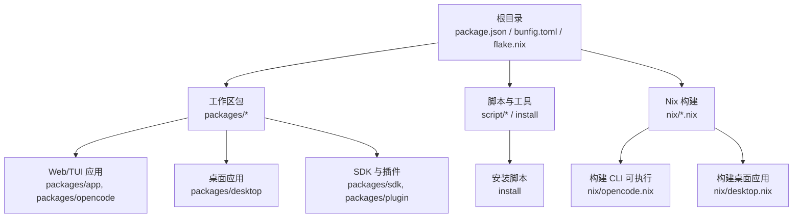
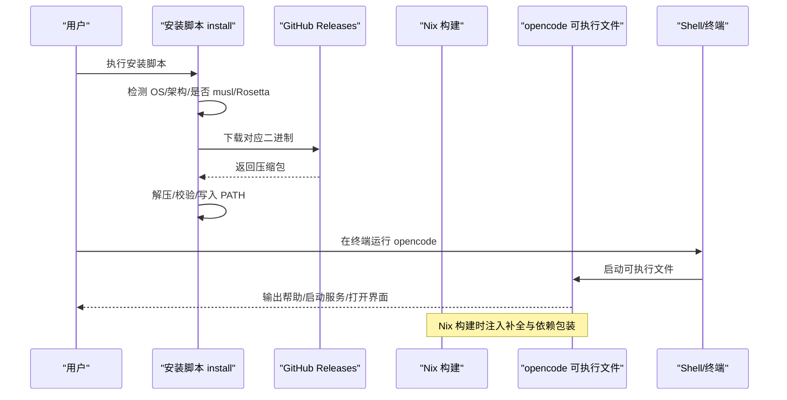
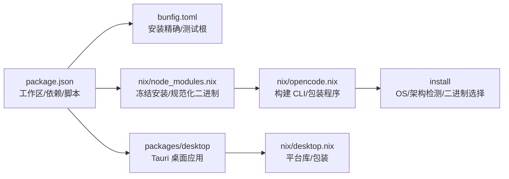

# 兼容性问题

<cite>
**本文引用的文件**
- [package.json](file://package.json)
- [README.md](file://README.md)
- [CONTRIBUTING.md](file://CONTRIBUTING.md)
- [bunfig.toml](file://bunfig.toml)
- [flake.nix](file://flake.nix)
- [flake.lock](file://flake.lock)
- [nix/opencode.nix](file://nix/opencode.nix)
- [nix/desktop.nix](file://nix/desktop.nix)
- [nix/node_modules.nix](file://nix/node_modules.nix)
- [install](file://install)
- [packages/opencode/src/tool/bash.ts](file://packages/opencode/src/tool/bash.ts)
- [packages/app/src/context/file/path.test.ts](file://packages/app/src/context/file/path.test.ts)
- [packages/opencode/src/lsp/server.ts](file://packages/opencode/src/lsp/server.ts)
- [packages/opencode/script/postinstall.mjs](file://packages/opencode/script/postinstall.mjs)
- [SECURITY.md](file://SECURITY.md)
</cite>

## 目录
1. [简介](#简介)
2. [项目结构](#项目结构)
3. [核心组件](#核心组件)
4. [架构总览](#架构总览)
5. [详细组件分析](#详细组件分析)
6. [依赖关系分析](#依赖关系分析)
7. [性能考量](#性能考量)
8. [故障排查指南](#故障排查指南)
9. [结论](#结论)
10. [附录](#附录)

## 简介
本指南聚焦于 OpenCode 在多操作系统与多运行时环境下的兼容性问题与解决方案，覆盖以下方面：
- 操作系统差异：Windows、macOS、Linux 的路径、权限、可执行文件命名与依赖差异
- Node.js/Bun 版本与工具链兼容性：包管理器、类型定义、打包与安装流程
- 依赖版本冲突与锁定策略：工作区、目录别名、覆盖与补丁
- 跨平台部署排查：路径分隔符、文件权限、环境变量、Shell 配置
- 不同 Shell 环境（bash、zsh、PowerShell）的兼容性要点
- 依赖更新导致的兼容性问题与回滚策略

## 项目结构
OpenCode 采用 Monorepo 结构，根目录通过包管理器与工作区统一管理依赖，并提供 Nix 构建与安装脚本以增强跨平台一致性。

图表来源
- [package.json:1-118](file://package.json#L1-L118)
- [flake.nix:1-77](file://flake.nix#L1-L77)
- [nix/opencode.nix:1-98](file://nix/opencode.nix#L1-L98)
- [nix/desktop.nix:1-101](file://nix/desktop.nix#L1-L101)

章节来源
- [package.json:1-118](file://package.json#L1-L118)
- [README.md:46-98](file://README.md#L46-L98)
- [flake.nix:1-77](file://flake.nix#L1-L77)

## 核心组件
- 包管理与版本锁定
  - 使用 Bun 作为包管理器与运行时，版本在根配置中固定，确保一致的安装与构建体验。
  - 工作区通过 catalog 统一管理常用依赖版本，减少冲突。
- Nix 构建与分发
  - 提供多平台可复现构建，自动注入补全、包装二进制、注入模型数据等。
- 安装脚本
  - 自动识别 OS/架构，选择对应二进制，支持 Rosetta、musl、基线 CPU 等场景。
- Shell 与路径处理
  - 跨平台路径编码与 URL 规范化，避免 Windows 反斜杠与大小写驱动器盘符问题。
  - LSP/外部工具在 Windows 上区分可执行文件后缀与脚本后缀。

章节来源
- [package.json:7-118](file://package.json#L7-L118)
- [bunfig.toml:1-7](file://bunfig.toml#L1-L7)
- [nix/opencode.nix:15-98](file://nix/opencode.nix#L15-L98)
- [nix/desktop.nix:26-101](file://nix/desktop.nix#L26-L101)
- [install:68-167](file://install#L68-L167)
- [packages/app/src/context/file/path.test.ts:161-231](file://packages/app/src/context/file/path.test.ts#L161-L231)
- [packages/opencode/src/lsp/server.ts:542-586](file://packages/opencode/src/lsp/server.ts#L542-L586)

## 架构总览
下图展示从安装到运行的关键流程，涵盖跨平台差异与环境适配点。

图表来源
- [install:68-167](file://install#L68-L167)
- [nix/opencode.nix:41-76](file://nix/opencode.nix#L41-L76)

章节来源
- [install:68-167](file://install#L68-L167)
- [nix/opencode.nix:41-76](file://nix/opencode.nix#L41-L76)

## 详细组件分析

### 操作系统与 Shell 兼容性
- Windows
  - 可执行文件命名与后缀：Windows 平台使用 .exe；LSP/脚本语言在 Windows 使用 .bat 或 .sh。
  - 权限与路径：安装脚本设置可执行位；路径编码需避免反斜杠与大小写驱动器盘符问题。
  - PowerShell 兼容：安装脚本检测 PowerShell/Pwsh 并查询 AVX2 支持。
- macOS
  - Rosetta 场景：若 x64 在 Apple Silicon 上经 Rosetta 运行，会切换为 arm64 二进制以提升性能。
  - 文件系统大小写不敏感：需注意大小写与路径规范化。
- Linux
  - musl 与 glibc：检测 musl 并选择相应二进制；部分发行版可能缺少 tar/unzip，安装脚本会提前校验。
  - 基线 CPU：若 CPU 不支持 AVX2，则使用“baseline”变体二进制。
- Shell 环境
  - bash/zsh/fish/sh 等：安装脚本根据当前 SHELL 推断配置文件位置并追加 PATH。
  - GitHub Actions：自动将安装目录写入 GITHUB_PATH。

章节来源
- [install:81-167](file://install#L81-L167)
- [install:380-439](file://install#L380-L439)
- [packages/opencode/src/lsp/server.ts:576-586](file://packages/opencode/src/lsp/server.ts#L576-L586)
- [packages/app/src/context/file/path.test.ts:161-231](file://packages/app/src/context/file/path.test.ts#L161-L231)

### Node.js 与 Bun 版本兼容性
- 包管理器与运行时
  - 根配置固定使用 Bun 作为包管理器与运行时，确保安装、构建与调试行为一致。
  - 类型定义通过 catalog 注入，避免与 Node 版本强绑定。
- 开发与测试
  - 测试根目录被显式限制，防止从根目录误运行测试。
  - Nix 开发 Shell 提供 Node.js 20 与 Bun，便于本地开发与交叉验证。

章节来源
- [package.json:7-118](file://package.json#L7-L118)
- [bunfig.toml:1-7](file://bunfig.toml#L1-L7)
- [flake.nix:21-31](file://flake.nix#L21-L31)

### 路径分隔符与文件权限
- 路径编码
  - 跨平台路径编码测试覆盖 Windows 反斜杠、驱动器盘符大小写、相对路径等场景，确保生成有效的 file:// URL。
- 文件权限
  - 安装脚本对二进制设置 755 权限；Nix 包装程序时设置可执行位并注入必要工具链。

章节来源
- [packages/app/src/context/file/path.test.ts:161-231](file://packages/app/src/context/file/path.test.ts#L161-L231)
- [install:343-345](file://install#L343-L345)
- [nix/opencode.nix:54-66](file://nix/opencode.nix#L54-L66)

### 依赖版本冲突与锁定策略
- 工作区与目录别名
  - 通过工作区与目录别名统一内部包版本，减少重复与冲突。
- 目录别名 catalog
  - 将常用依赖版本集中管理，降低因版本漂移引发的兼容性问题。
- 覆盖与补丁
  - 使用 overrides 对类型包进行覆盖；通过 patches 修复第三方依赖的已知问题。
- 锁定与一致性
  - Nix 构建阶段使用冻结锁文件与严格依赖，保证可复现性。

章节来源
- [package.json:21-72](file://package.json#L21-L72)
- [package.json:109-116](file://package.json#L109-L116)
- [nix/node_modules.nix:48-63](file://nix/node_modules.nix#L48-L63)

### 跨平台部署排查
- 安装与路径
  - 若 PATH 未包含安装目录，安装脚本会提示手动添加；在 GitHub Actions 中自动写入 GITHUB_PATH。
- 二进制选择
  - 安装脚本根据 OS/架构、musl、Rosetta 与 CPU 特性选择合适的二进制。
- 桌面应用
  - 桌面应用构建依赖 Rust 工具链与平台库；Linux 需要 GTK/WebKit 等依赖；Nix 构建会注入必要运行时。

章节来源
- [install:362-439](file://install#L362-L439)
- [install:68-167](file://install#L68-L167)
- [nix/desktop.nix:39-64](file://nix/desktop.nix#L39-L64)

### 依赖更新导致的兼容性问题与回滚策略
- 依赖更新风险
  - 新版本可能导致 API 变更、行为差异或运行时错误；建议在预发布环境先行验证。
- 回滚策略
  - 使用 Nix 构建时可利用锁定哈希快速回退到上一个稳定版本。
  - 通过安装脚本指定版本参数，直接下载历史版本二进制。
  - 利用工作区与 catalog 的版本控制，回退到受控版本范围。

章节来源
- [nix/node_modules.nix:74-76](file://nix/node_modules.nix#L74-L76)
- [install:183-204](file://install#L183-L204)
- [package.json:28-71](file://package.json#L28-L71)

## 依赖关系分析

图表来源
- [package.json:1-118](file://package.json#L1-L118)
- [bunfig.toml:1-7](file://bunfig.toml#L1-L7)
- [nix/node_modules.nix:1-85](file://nix/node_modules.nix#L1-L85)
- [nix/opencode.nix:1-98](file://nix/opencode.nix#L1-L98)
- [install:1-461](file://install#L1-L461)
- [nix/desktop.nix:1-101](file://nix/desktop.nix#L1-L101)

章节来源
- [package.json:1-118](file://package.json#L1-L118)
- [nix/node_modules.nix:1-85](file://nix/node_modules.nix#L1-L85)

## 性能考量
- CPU 特性与二进制选择
  - 安装脚本在 Linux/macOS/Windows 上检测 AVX2 支持，必要时选择“baseline”变体以避免崩溃。
- Rosetta 优化
  - macOS x64 在 Rosetta 环境下自动切换为 arm64 二进制，提升性能与稳定性。
- Nix 构建缓存
  - 使用临时缓存目录加速安装过程，减少网络与磁盘 IO。

章节来源
- [install:131-158](file://install#L131-L158)
- [install:95-100](file://install#L95-L100)
- [nix/node_modules.nix:50-59](file://nix/node_modules.nix#L50-L59)

## 故障排查指南
- 安装失败或找不到二进制
  - 检查 OS/架构是否受支持；确认 musl/glibc 环境；查看安装脚本输出的错误信息。
  - 使用 --version 参数指定历史版本进行回滚验证。
- PATH 未生效
  - 安装脚本会尝试写入当前 Shell 的配置文件；若未生效，请手动将安装目录加入 PATH。
- 路径与文件访问异常
  - 确认路径编码符合跨平台规范；Windows 驱动器盘符大小写与反斜杠会被正确处理。
- Shell 兼容性
  - bash/zsh/fish/sh 的 PATH 写入逻辑不同；如未自动写入，按提示手动添加。
- LSP/外部工具不可用
  - Windows 平台注意可执行文件后缀与脚本后缀的区别；检查 Python/Elm/Elixir 等工具的安装路径。
- 安全与权限
  - 服务器模式需设置认证；不要在不受信任环境中启用服务器模式。

章节来源
- [install:68-167](file://install#L68-L167)
- [install:362-439](file://install#L362-L439)
- [packages/app/src/context/file/path.test.ts:161-231](file://packages/app/src/context/file/path.test.ts#L161-L231)
- [packages/opencode/src/lsp/server.ts:542-586](file://packages/opencode/src/lsp/server.ts#L542-L586)
- [SECURITY.md:21-23](file://SECURITY.md#L21-L23)

## 结论
OpenCode 通过 Bun 与 Nix 的组合，在多平台提供一致的安装与运行体验。针对路径、权限、Shell 与 CPU 特性的差异，项目提供了完善的检测与适配机制。建议在升级依赖前先在预发布环境验证，并利用 Nix 锁定与安装脚本的版本参数实现快速回滚。

## 附录
- 快速对照表
  - 包管理器：Bun（固定版本）
  - 类型定义：catalog 统一管理
  - 工作区：packages/* 与子工作区
  - Nix：多平台可复现构建
  - 安装脚本：自动检测 OS/架构/权限/Shell
  - 路径编码：跨平台规范化
  - LSP/外部工具：Windows 区分 .exe 与 .sh/.bat