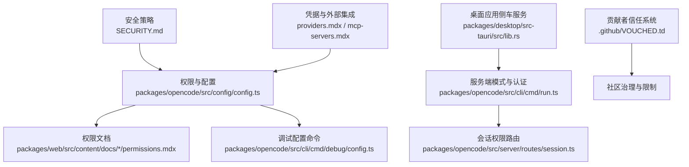
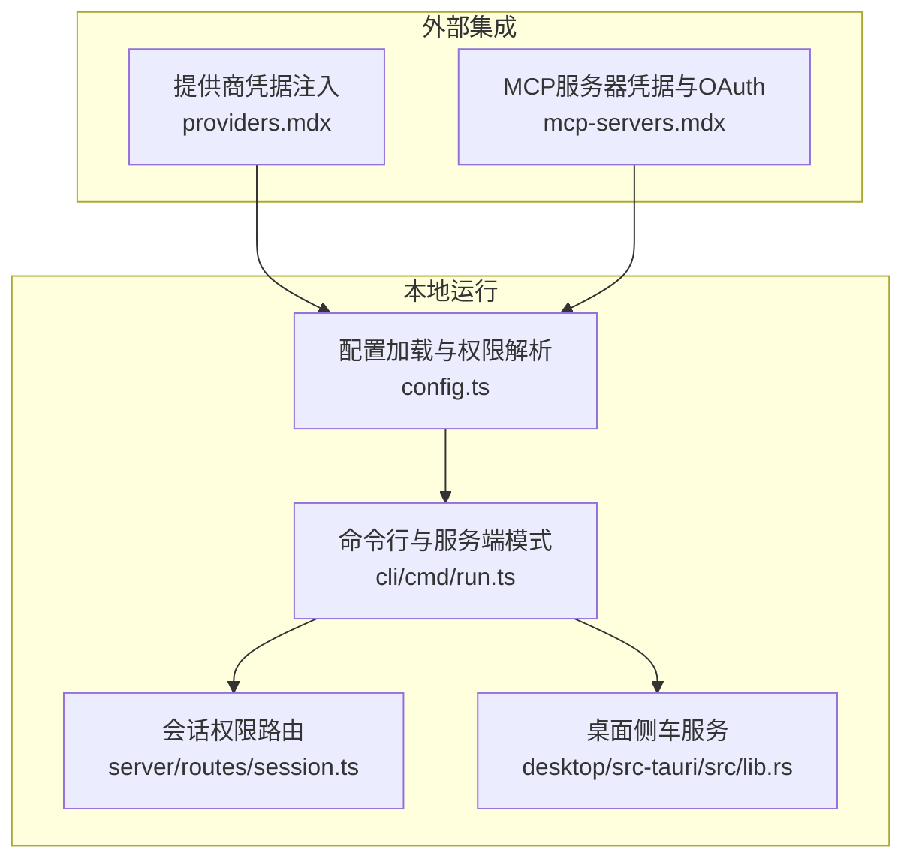
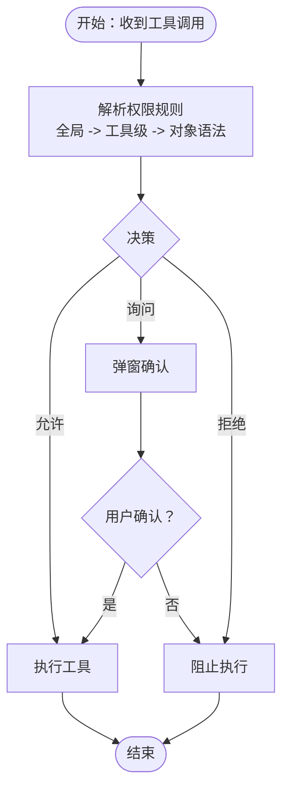
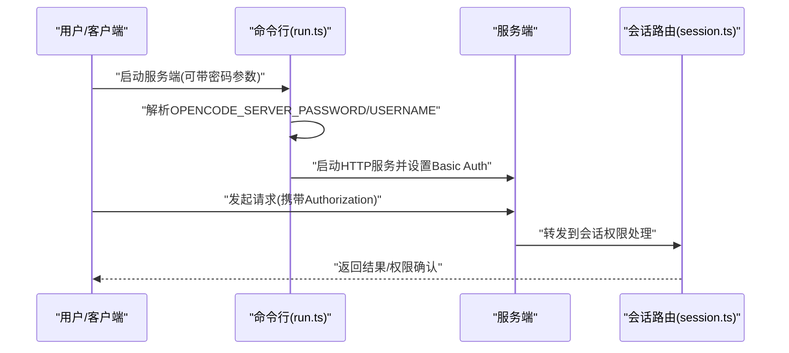
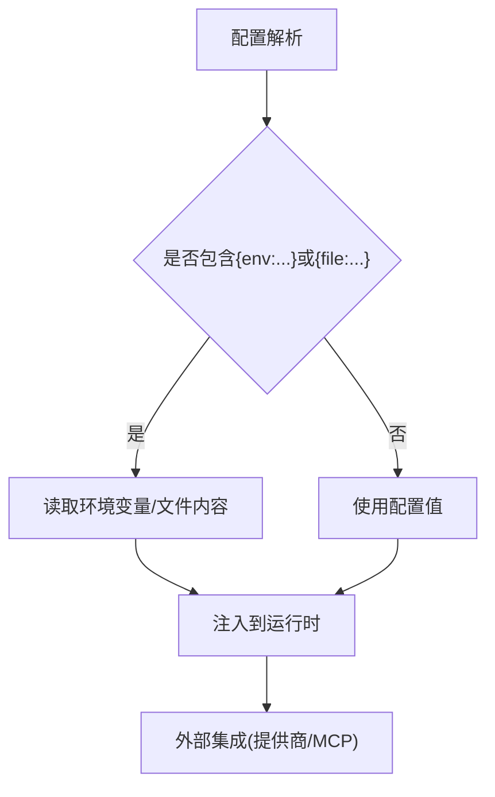
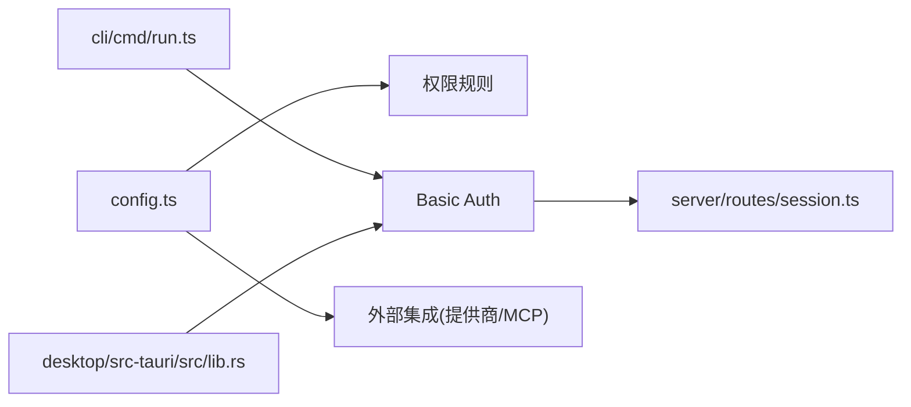

# 安全问题

<cite>
**本文引用的文件**
- [SECURITY.md](file://SECURITY.md)
- [CONTRIBUTING.md](file://CONTRIBUTING.md)
- [README.md](file://README.md)
- [packages/opencode/src/config/config.ts](file://packages/opencode/src/config/config.ts)
- [packages/opencode/src/cli/cmd/debug/config.ts](file://packages/opencode/src/cli/cmd/debug/config.ts)
- [packages/opencode/src/cli/cmd/run.ts](file://packages/opencode/src/cli/cmd/run.ts)
- [packages/opencode/src/server/routes/session.ts](file://packages/opencode/src/server/routes/session.ts)
- [packages/opencode/test/tool/write.test.ts](file://packages/opencode/test/tool/write.test.ts)
- [packages/web/src/content/docs/ko/config.mdx](file://packages/web/src/content/docs/ko/config.mdx)
- [packages/web/src/content/docs/it/permissions.mdx](file://packages/web/src/content/docs/it/permissions.mdx)
- [packages/web/src/content/docs/fr/permissions.mdx](file://packages/web/src/content/docs/fr/permissions.mdx)
- [packages/web/src/content/docs/pl/permissions.mdx](file://packages/web/src/content/docs/pl/permissions.mdx)
- [packages/web/src/content/docs/providers.mdx](file://packages/web/src/content/docs/providers.mdx)
- [packages/web/src/content/docs/mcp-servers.mdx](file://packages/web/src/content/docs/mcp-servers.mdx)
- [packages/web/src/content/docs/zh-cn/agents.mdx](file://packages/web/src/content/docs/zh-cn/agents.mdx)
- [packages/web/src/content/docs/de/agents.mdx](file://packages/web/src/content/docs/de/agents.mdx)
- [packages/web/src/content/docs/nb/agents.mdx](file://packages/web/src/content/docs/nb/agents.mdx)
- [packages/desktop/src-tauri/src/lib.rs](file://packages/desktop/src-tauri/src/lib.rs)
- [.github/VOUCHED.td](file://.github/VOUCHED.td)
</cite>

## 目录
1. [简介](#简介)
2. [项目结构](#项目结构)
3. [核心组件](#核心组件)
4. [架构总览](#架构总览)
5. [详细组件分析](#详细组件分析)
6. [依赖关系分析](#依赖关系分析)
7. [性能考虑](#性能考虑)
8. [故障排查指南](#故障排查指南)
9. [结论](#结论)
10. [附录](#附录)

## 简介
本指南面向OpenCode用户与维护者，聚焦于本地运行场景下的安全风险与防护实践。OpenCode是一个在本地运行的AI编码助手，具备强大的工具集（包括shell执行、文件操作、网络访问等），但其权限系统并非沙箱隔离。因此，安全防护的关键在于：合理配置权限、最小化暴露面、严格管理凭据与配置、建立审计与响应机制。

## 项目结构
围绕安全主题，本仓库中与安全直接相关的核心位置如下：
- 安全策略与披露流程：根目录安全文档
- 权限模型与配置：核心配置模块与多语言权限文档
- 服务端模式与认证：命令行参数、环境变量与路由实现
- 凭据与外部集成：提供商与MCP服务器配置文档
- 桌面应用内嵌服务：本地侧车进程与默认凭据生成
- 贡献者信任体系：vouch列表与治理规则

图表来源
- [SECURITY.md:1-48](file://SECURITY.md#L1-L48)
- [packages/opencode/src/config/config.ts:1-800](file://packages/opencode/src/config/config.ts#L1-L800)
- [packages/opencode/src/cli/cmd/debug/config.ts:1-17](file://packages/opencode/src/cli/cmd/debug/config.ts#L1-L17)
- [packages/opencode/src/cli/cmd/run.ts:248-676](file://packages/opencode/src/cli/cmd/run.ts#L248-L676)
- [packages/opencode/src/server/routes/session.ts:988-1023](file://packages/opencode/src/server/routes/session.ts#L988-L1023)
- [packages/web/src/content/docs/providers.mdx:220-254](file://packages/web/src/content/docs/providers.mdx#L220-L254)
- [packages/web/src/content/docs/mcp-servers.mdx:157-240](file://packages/web/src/content/docs/mcp-servers.mdx#L157-L240)
- [packages/desktop/src-tauri/src/lib.rs:430-462](file://packages/desktop/src-tauri/src/lib.rs#L430-L462)
- [.github/VOUCHED.td:1-24](file://.github/VOUCHED.td#L1-L24)

章节来源
- [SECURITY.md:1-48](file://SECURITY.md#L1-L48)
- [README.md:1-142](file://README.md#L1-L142)

## 核心组件
- 权限控制系统
  - 基于配置的权限规则，支持全局与逐工具粒度控制，支持“允许/询问/拒绝”三种动作。
  - 兼容旧版布尔工具开关，并自动迁移至新的权限字段。
- 服务端模式与HTTP基本认证
  - 可选启用服务端模式；若启用需设置密码环境变量以启用HTTP基本认证；否则将以未认证模式运行并给出警告。
- 外部集成凭据管理
  - 提供商与MCP服务器的凭据可通过配置文件与环境变量注入，支持从文件读取敏感内容。
- 桌面应用内嵌服务
  - 桌面应用启动本地侧车服务时自动生成临时密码，避免默认弱口令。
- 贡献者信任系统
  - 使用vouch机制对贡献者进行信任与限制，防止低质量或恶意贡献进入主干。

章节来源
- [packages/opencode/src/config/config.ts:626-799](file://packages/opencode/src/config/config.ts#L626-L799)
- [packages/opencode/src/cli/cmd/run.ts:657-662](file://packages/opencode/src/cli/cmd/run.ts#L657-L662)
- [packages/web/src/content/docs/ko/config.mdx:637-685](file://packages/web/src/content/docs/ko/config.mdx#L637-L685)
- [packages/web/src/content/docs/providers.mdx:220-254](file://packages/web/src/content/docs/providers.mdx#L220-L254)
- [packages/web/src/content/docs/mcp-servers.mdx:157-240](file://packages/web/src/content/docs/mcp-servers.mdx#L157-L240)
- [packages/desktop/src-tauri/src/lib.rs:430-462](file://packages/desktop/src-tauri/src/lib.rs#L430-L462)
- [.github/VOUCHED.td:1-24](file://.github/VOUCHED.td#L1-L24)

## 架构总览
下图展示OpenCode在本地运行时的安全相关交互路径：权限解析、服务端认证、外部集成凭据注入与桌面侧车服务。

图表来源
- [packages/opencode/src/config/config.ts:1-800](file://packages/opencode/src/config/config.ts#L1-L800)
- [packages/opencode/src/cli/cmd/run.ts:248-676](file://packages/opencode/src/cli/cmd/run.ts#L248-L676)
- [packages/opencode/src/server/routes/session.ts:988-1023](file://packages/opencode/src/server/routes/session.ts#L988-L1023)
- [packages/desktop/src-tauri/src/lib.rs:430-462](file://packages/desktop/src-tauri/src/lib.rs#L430-L462)
- [packages/web/src/content/docs/providers.mdx:220-254](file://packages/web/src/content/docs/providers.mdx#L220-L254)
- [packages/web/src/content/docs/mcp-servers.mdx:157-240](file://packages/web/src/content/docs/mcp-servers.mdx#L157-L240)

## 详细组件分析

### 权限控制系统工作原理与配置方法
- 规则层级
  - 全局规则：对所有工具生效的默认动作。
  - 工具级覆盖：针对特定工具（如bash、edit、webfetch等）设置独立动作。
  - 支持对象语法：按输入或上下文对同一工具设定差异化动作。
- 动作语义
  - 允许：直接执行，无需确认。
  - 询问：向用户弹窗确认后执行。
  - 拒绝：直接阻止执行。
- 迁移与兼容
  - 旧版布尔工具开关已弃用，系统会自动迁移到新的权限字段。
- 配置来源优先级
  - 远程.well-known配置、全局配置、自定义配置路径、项目配置、.opencode目录、内联配置、企业托管配置（最高优先级）。
- 实战建议
  - 默认采用“询问”，仅对可信工具（如bash）显式允许。
  - 对写入类工具（edit、write等）保持谨慎，默认拒绝。
  - 使用对象语法对工具进行细粒度控制，避免一刀切。

图表来源
- [packages/opencode/src/config/config.ts:626-799](file://packages/opencode/src/config/config.ts#L626-L799)
- [packages/web/src/content/docs/it/permissions.mdx:12-53](file://packages/web/src/content/docs/it/permissions.mdx#L12-L53)
- [packages/web/src/content/docs/fr/permissions.mdx:12-49](file://packages/web/src/content/docs/fr/permissions.mdx#L12-L49)
- [packages/web/src/content/docs/pl/permissions.mdx:12-55](file://packages/web/src/content/docs/pl/permissions.mdx#L12-L55)

章节来源
- [packages/opencode/src/config/config.ts:626-799](file://packages/opencode/src/config/config.ts#L626-L799)
- [packages/web/src/content/docs/it/permissions.mdx:12-53](file://packages/web/src/content/docs/it/permissions.mdx#L12-L53)
- [packages/web/src/content/docs/fr/permissions.mdx:12-49](file://packages/web/src/content/docs/fr/permissions.mdx#L12-L49)
- [packages/web/src/content/docs/pl/permissions.mdx:12-55](file://packages/web/src/content/docs/pl/permissions.mdx#L12-L55)

### 服务端模式与访问控制
- 启用条件
  - 服务端模式为可选；启用时必须设置密码环境变量以启用HTTP基本认证。
  - 未设置密码时将以未认证模式运行并提示风险。
- 认证流程
  - 命令行支持通过参数或环境变量设置用户名与密码。
  - 客户端连接时自动附加基础认证头。
- 最佳实践
  - 在受信网络内启用服务端模式；生产环境务必设置强密码并限制监听地址。
  - 结合防火墙与反向代理，避免直接暴露端口。

图表来源
- [packages/opencode/src/cli/cmd/run.ts:657-662](file://packages/opencode/src/cli/cmd/run.ts#L657-L662)
- [packages/opencode/src/server/routes/session.ts:988-1023](file://packages/opencode/src/server/routes/session.ts#L988-L1023)

章节来源
- [packages/opencode/src/cli/cmd/run.ts:657-662](file://packages/opencode/src/cli/cmd/run.ts#L657-L662)
- [SECURITY.md:21-23](file://SECURITY.md#L21-L23)

### 凭据泄露与外部集成安全
- 环境变量与文件注入
  - 配置支持从环境变量与文件读取敏感信息，避免将密钥硬编码在配置中。
- 提供商凭据
  - 支持多种AWS凭据方式（Access Keys、Profile、Bearer Token、Web Identity等）。
- MCP服务器OAuth
  - 自动处理OAuth流程，支持动态客户端注册与手动预注册。
- 最佳实践
  - 将API密钥存储在受控文件或环境变量中，不在配置文件中直接写入明文。
  - 对外部MCP服务器启用OAuth并定期轮换令牌。
  - 限制提供商凭据的作用域与有效期。

图表来源
- [packages/web/src/content/docs/ko/config.mdx:637-685](file://packages/web/src/content/docs/ko/config.mdx#L637-L685)
- [packages/web/src/content/docs/providers.mdx:220-254](file://packages/web/src/content/docs/providers.mdx#L220-L254)
- [packages/web/src/content/docs/mcp-servers.mdx:157-240](file://packages/web/src/content/docs/mcp-servers.mdx#L157-L240)

章节来源
- [packages/web/src/content/docs/ko/config.mdx:637-685](file://packages/web/src/content/docs/ko/config.mdx#L637-L685)
- [packages/web/src/content/docs/providers.mdx:220-254](file://packages/web/src/content/docs/providers.mdx#L220-L254)
- [packages/web/src/content/docs/mcp-servers.mdx:157-240](file://packages/web/src/content/docs/mcp-servers.mdx#L157-L240)

### 文件权限与访问控制
- 写入行为
  - 写入敏感数据后，系统会在非Windows平台设置合理的文件权限（示例测试覆盖了权限位）。
- 依赖安装与目录可写性
  - 配置加载时会检测目录可写性，避免在只读目录强制安装依赖导致失败。
- 最佳实践
  - 对包含敏感信息的文件设置最小必要权限（如仅属主可读写）。
  - 使用专用目录存放敏感文件，避免纳入版本控制。

章节来源
- [packages/opencode/test/tool/write.test.ts:150-175](file://packages/opencode/test/tool/write.test.ts#L150-L175)
- [packages/opencode/src/config/config.ts:326-368](file://packages/opencode/src/config/config.ts#L326-L368)

### 桌面应用侧车服务与默认凭据
- 侧车服务
  - 桌面应用启动时生成随机密码并立即提供给前端，避免使用默认弱口令。
- 最佳实践
  - 仅在本地开发或受信环境下启用侧车服务。
  - 如需远程访问，结合反向代理与TLS终止。

章节来源
- [packages/desktop/src-tauri/src/lib.rs:430-462](file://packages/desktop/src-tauri/src/lib.rs#L430-L462)

### 贡献者信任与社区治理
- vouch系统
  - 对贡献者进行信任标记与限制，防止低质量或恶意贡献进入主干。
- 最佳实践
  - 维护vouch列表，定期审查与清理。
  - 对可疑贡献采取降权或限制措施。

章节来源
- [.github/VOUCHED.td:1-24](file://.github/VOUCHED.td#L1-L24)
- [CONTRIBUTING.md:267-288](file://CONTRIBUTING.md#L267-L288)

## 依赖关系分析
- 权限解析依赖配置加载顺序与合并逻辑，最终形成统一的权限视图。
- 服务端模式依赖命令行参数与环境变量，路由层负责权限确认。
- 外部集成依赖配置中的凭据注入与MCP/OAuth流程。
- 桌面应用侧车服务与服务端模式共享认证与会话处理。

图表来源
- [packages/opencode/src/config/config.ts:1-800](file://packages/opencode/src/config/config.ts#L1-L800)
- [packages/opencode/src/cli/cmd/run.ts:248-676](file://packages/opencode/src/cli/cmd/run.ts#L248-L676)
- [packages/opencode/src/server/routes/session.ts:988-1023](file://packages/opencode/src/server/routes/session.ts#L988-L1023)
- [packages/desktop/src-tauri/src/lib.rs:430-462](file://packages/desktop/src-tauri/src/lib.rs#L430-L462)

章节来源
- [packages/opencode/src/config/config.ts:1-800](file://packages/opencode/src/config/config.ts#L1-L800)
- [packages/opencode/src/cli/cmd/run.ts:248-676](file://packages/opencode/src/cli/cmd/run.ts#L248-L676)
- [packages/opencode/src/server/routes/session.ts:988-1023](file://packages/opencode/src/server/routes/session.ts#L988-L1023)
- [packages/desktop/src-tauri/src/lib.rs:430-462](file://packages/desktop/src-tauri/src/lib.rs#L430-L462)

## 性能考虑
- 权限决策应尽量简洁，避免在高频路径上进行复杂匹配。
- 服务端模式下建议开启必要的缓存与连接池，减少外部调用延迟。
- 外部集成凭据注入应避免频繁IO，优先复用已解析值。

## 故障排查指南
- 权限相关问题
  - 使用调试命令查看最终生效配置，核对权限规则是否符合预期。
  - 若出现权限冲突，检查配置来源优先级与覆盖关系。
- 服务端认证问题
  - 确认是否设置了密码环境变量；检查用户名/密码是否正确。
  - 若未设置密码，服务端将以未认证模式运行并提示风险。
- 外部集成问题
  - 检查提供商凭据是否正确注入；MCP服务器OAuth是否成功完成。
- 桌面应用侧车服务
  - 若无法连接，确认侧车服务已启动且凭据有效。
- 安全事件响应
  - 发现漏洞或异常行为，遵循安全披露流程提交报告。

章节来源
- [packages/opencode/src/cli/cmd/debug/config.ts:1-17](file://packages/opencode/src/cli/cmd/debug/config.ts#L1-L17)
- [SECURITY.md:37-47](file://SECURITY.md#L37-L47)

## 结论
OpenCode的安全基线是“本地运行、用户自治”。通过严格的权限控制、最小化暴露面、妥善管理凭据与外部集成、以及完善的社区治理，可以在本地环境中显著降低安全风险。建议将“询问”作为默认策略，仅对必需工具显式允许；对外部集成采用最小权限与轮换机制；对服务端模式严格限制访问与监听范围。

## 附录

### 安全审计清单
- 配置文件检查
  - 是否存在明文API密钥或私有证书
  - 权限规则是否过度宽松
  - 是否启用了不必要的工具（如bash）
- 依赖包安全扫描
  - 定期扫描依赖中的已知高危漏洞
  - 关注供应链风险（构建脚本、插件）
- 敏感信息检测
  - 使用工具扫描历史提交与备份中的敏感信息
  - 确保日志不输出敏感数据

### 报告与披露流程
- 严禁提交AI生成的漏洞报告；请遵循项目披露流程。
- 通过GitHub安全咨询渠道提交漏洞详情。
- 若超过一定工作日未收到回复，可邮件联系指定邮箱。

章节来源
- [SECURITY.md:5-7](file://SECURITY.md#L5-L7)
- [SECURITY.md:37-47](file://SECURITY.md#L37-L47)