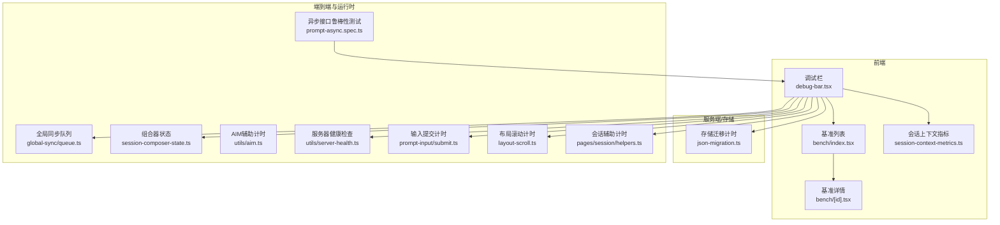
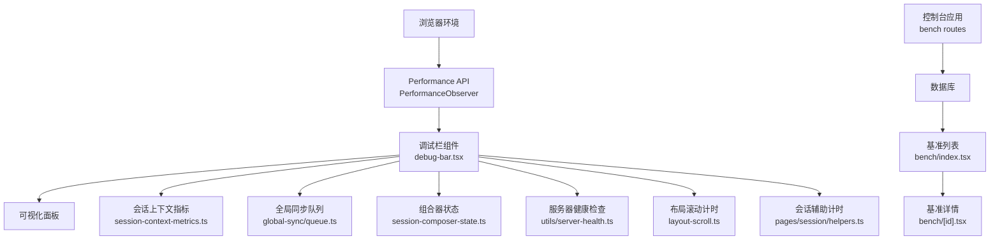
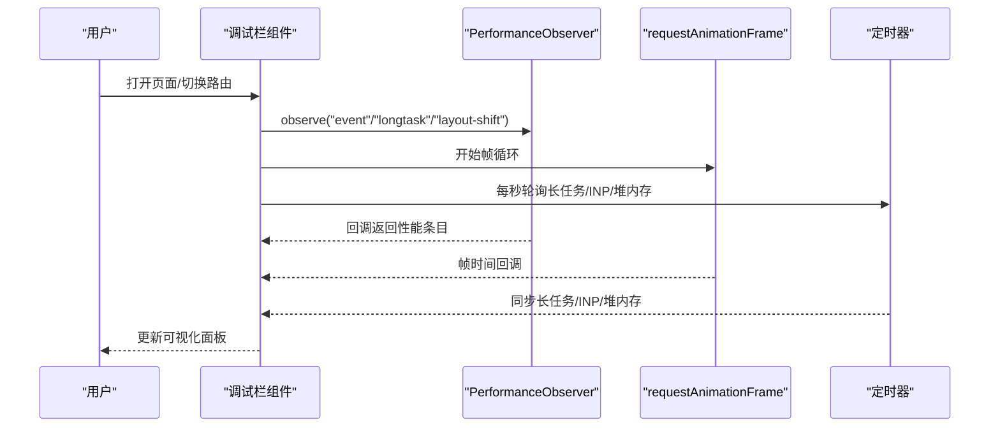
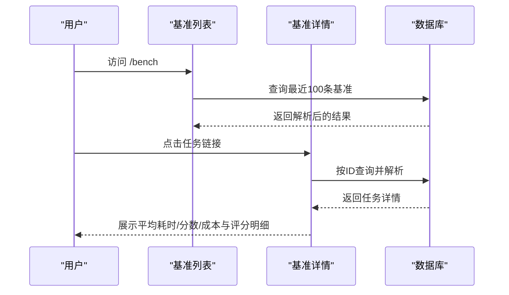
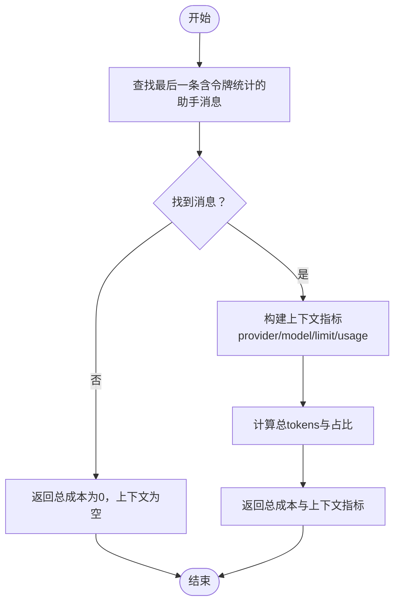
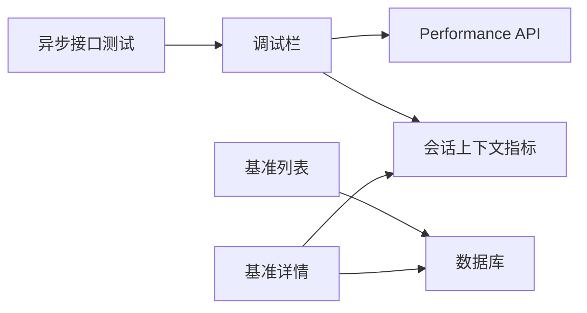

# 性能问题排查

<cite>
**本文引用的文件**
- [packages/app/src/components/debug-bar.tsx](file://packages/app/src/components/debug-bar.tsx)
- [packages/console/app/src/routes/bench/index.tsx](file://packages/console/app/src/routes/bench/index.tsx)
- [packages/console/app/src/routes/bench/[id].tsx](file://packages/console/app/src/routes/bench/[id].tsx)
- [packages/app/src/components/session/session-context-metrics.ts](file://packages/app/src/components/session/session-context-metrics.ts)
- [packages/opencode/src/storage/json-migration.ts](file://packages/opencode/src/storage/json-migration.ts)
- [packages/app/e2e/prompt/prompt-async.spec.ts](file://packages/app/e2e/prompt/prompt-async.spec.ts)
- [packages/app/src/context/global-sync/queue.ts](file://packages/app/src/context/global-sync/queue.ts)
- [packages/app/src/pages/session/composer/session-composer-state.ts](file://packages/app/src/pages/session/composer/session-composer-state.ts)
- [packages/app/src/utils/aim.ts](file://packages/app/src/utils/aim.ts)
- [packages/app/src/utils/server-health.ts](file://packages/app/src/utils/server-health.ts)
- [packages/app/src/components/prompt-input/submit.ts](file://packages/app/src/components/prompt-input/submit.ts)
- [packages/app/src/context/layout-scroll.ts](file://packages/app/src/context/layout-scroll.ts)
- [packages/app/src/pages/session/helpers.ts](file://packages/app/src/pages/session/helpers.ts)
</cite>

## 目录
1. [简介](#简介)
2. [项目结构](#项目结构)
3. [核心组件](#核心组件)
4. [架构总览](#架构总览)
5. [详细组件分析](#详细组件分析)
6. [依赖关系分析](#依赖关系分析)
7. [性能考量与优化建议](#性能考量与优化建议)
8. [故障排查指南](#故障排查指南)
9. [结论](#结论)
10. [附录：性能监控指标与工具](#附录性能监控指标与工具)

## 简介
本指南面向OpenCode使用者与维护者，聚焦于性能问题的系统化排查流程与实践方法。内容覆盖：
- 性能监控指标（CPU使用率、内存占用、磁盘I/O、网络延迟）的识别与测量
- 代理执行慢、内存泄漏、响应延迟等典型问题的诊断步骤
- 内置时间统计与可视化调试栏、外部性能监控工具的使用
- 性能瓶颈定位（模型调用、文件读写、网络请求）与优化建议
- 性能回归测试与基准测试方法

## 项目结构
OpenCode采用多包（monorepo）组织，前端性能监控与基准展示主要集中在以下模块：
- 前端调试与性能可视化：packages/app/src/components/debug-bar.tsx
- 基准测试结果展示：packages/console/app/src/routes/bench/*
- 会话上下文与成本度量：packages/app/src/components/session/session-context-metrics.ts
- 存储迁移过程中的性能观测：packages/opencode/src/storage/json-migration.ts
- 端到端场景对异步接口的鲁棒性验证：packages/app/e2e/prompt/prompt-async.spec.ts
- 全局同步队列与定时器调度：packages/app/src/context/global-sync/queue.ts
- 组合器状态与输入提交流程：packages/app/src/pages/session/composer/session-composer-state.ts、packages/app/src/components/prompt-input/submit.ts
- 服务器健康检查与超时控制：packages/app/src/utils/server-health.ts
- 布局滚动与辅助计时：packages/app/src/context/layout-scroll.ts、packages/app/src/pages/session/helpers.ts

图表来源
- [packages/app/src/components/debug-bar.tsx:1-448](file://packages/app/src/components/debug-bar.tsx#L1-L448)
- [packages/console/app/src/routes/bench/index.tsx:1-89](file://packages/console/app/src/routes/bench/index.tsx#L1-L89)
- [packages/console/app/src/routes/bench/[id].tsx:1-376](file://packages/console/app/src/routes/bench/[id].tsx#L1-L376)
- [packages/app/src/components/session/session-context-metrics.ts:1-83](file://packages/app/src/components/session/session-context-metrics.ts#L1-L83)
- [packages/opencode/src/storage/json-migration.ts:43](file://packages/opencode/src/storage/json-migration.ts#L43)
- [packages/opencode/src/storage/json-migration.ts:180](file://packages/opencode/src/storage/json-migration.ts#L180)
- [packages/opencode/src/storage/json-migration.ts:413](file://packages/opencode/src/storage/json-migration.ts#L413)
- [packages/app/e2e/prompt/prompt-async.spec.ts:1-32](file://packages/app/e2e/prompt/prompt-async.spec.ts#L1-L32)
- [packages/app/src/context/global-sync/queue.ts:10](file://packages/app/src/context/global-sync/queue.ts#L10)
- [packages/app/src/pages/session/composer/session-composer-state.ts:157](file://packages/app/src/pages/session/composer/session-composer-state.ts#L157)
- [packages/app/src/utils/aim.ts:113](file://packages/app/src/utils/aim.ts#L113)
- [packages/app/src/utils/server-health.ts:28](file://packages/app/src/utils/server-health.ts#L28)
- [packages/app/src/utils/server-health.ts:38](file://packages/app/src/utils/server-health.ts#L38)
- [packages/app/src/components/prompt-input/submit.ts:533](file://packages/app/src/components/prompt-input/submit.ts#L533)
- [packages/app/src/context/layout-scroll.ts:19](file://packages/app/src/context/layout-scroll.ts#L19)
- [packages/app/src/context/layout-scroll.ts:57](file://packages/app/src/context/layout-scroll.ts#L57)
- [packages/app/src/pages/session/helpers.ts:185](file://packages/app/src/pages/session/helpers.ts#L185)

章节来源
- [packages/app/src/components/debug-bar.tsx:1-448](file://packages/app/src/components/debug-bar.tsx#L1-L448)
- [packages/console/app/src/routes/bench/index.tsx:1-89](file://packages/console/app/src/routes/bench/index.tsx#L1-L89)
- [packages/console/app/src/routes/bench/[id].tsx:1-376](file://packages/console/app/src/routes/bench/[id].tsx#L1-L376)

## 核心组件
- 调试栏（DebugBar）：基于浏览器Performance API与PerformanceObserver，采集帧率、长任务、交互延迟、布局偏移、内存占用等指标，并以可视化面板呈现。
- 基准路由（Bench/BenchDetail）：从数据库加载历史基准结果，展示平均分、耗时、成本、评分细节，支持按任务维度钻取。
- 会话上下文指标（SessionContextMetrics）：计算会话中最后一条含令牌统计的助手消息的总消耗与上下文占比，辅助成本与上下文压力评估。
- 存储迁移计时（JsonMigration）：在大型数据迁移过程中记录开始/结束时间，便于评估I/O与CPU开销。

章节来源
- [packages/app/src/components/debug-bar.tsx:77-448](file://packages/app/src/components/debug-bar.tsx#L77-L448)
- [packages/console/app/src/routes/bench/index.tsx:13-34](file://packages/console/app/src/routes/bench/index.tsx#L13-L34)
- [packages/console/app/src/routes/bench/[id].tsx:79-90](file://packages/console/app/src/routes/bench/[id].tsx#L79-L90)
- [packages/app/src/components/session/session-context-metrics.ts:50-83](file://packages/app/src/components/session/session-context-metrics.ts#L50-L83)
- [packages/opencode/src/storage/json-migration.ts:43](file://packages/opencode/src/storage/json-migration.ts#L43)
- [packages/opencode/src/storage/json-migration.ts:180](file://packages/opencode/src/storage/json-migration.ts#L180)
- [packages/opencode/src/storage/json-migration.ts:413](file://packages/opencode/src/storage/json-migration.ts#L413)

## 架构总览
下图展示了前端性能监控与基准展示在系统中的位置与交互：

图表来源
- [packages/app/src/components/debug-bar.tsx:236-361](file://packages/app/src/components/debug-bar.tsx#L236-L361)
- [packages/console/app/src/routes/bench/index.tsx:13-34](file://packages/console/app/src/routes/bench/index.tsx#L13-L34)
- [packages/console/app/src/routes/bench/[id].tsx:79-90](file://packages/console/app/src/routes/bench/[id].tsx#L79-L90)

## 详细组件分析

### 调试栏（DebugBar）与性能指标采集
- 指标采集
  - 帧率（FPS）、最差帧时长、抖动（>32ms帧数）
  - 长任务（Long Tasks）累计阻塞时间与数量
  - 交互延迟（INP近似）与事件处理时长
  - 布局偏移累积（CLS）
  - JavaScript堆内存使用与限制（Chromium）
  - 路由导航耗时（从路由开始到首次稳定绘制）
- 数据来源
  - 使用PerformanceObserver监听“event”“longtask”“layout-shift”等条目类型
  - 使用requestAnimationFrame与定时轮询更新指标
  - 在页面可见性变化时暂停/恢复采集，避免后台浪费
- 可视化与阈值
  - 通过单元格颜色标识异常区间（如FPS过低、长任务阻塞、INP延迟高、内存占比超限）

图表来源
- [packages/app/src/components/debug-bar.tsx:236-361](file://packages/app/src/components/debug-bar.tsx#L236-L361)
- [packages/app/src/components/debug-bar.tsx:163-361](file://packages/app/src/components/debug-bar.tsx#L163-L361)

章节来源
- [packages/app/src/components/debug-bar.tsx:77-448](file://packages/app/src/components/debug-bar.tsx#L77-L448)

### 基准测试结果展示（Bench/BenchDetail）
- 列表页：按最近创建时间倒序列出基准记录，聚合各任务的平均分，支持跳转到任务详情
- 详情页：展示任务来源（仓库、起止提交）、提示词、平均耗时/分数/成本、评分细则与评审意见，支持展开查看评审理由

图表来源
- [packages/console/app/src/routes/bench/index.tsx:13-34](file://packages/console/app/src/routes/bench/index.tsx#L13-L34)
- [packages/console/app/src/routes/bench/[id].tsx:79-90](file://packages/console/app/src/routes/bench/[id].tsx#L79-L90)

章节来源
- [packages/console/app/src/routes/bench/index.tsx:1-89](file://packages/console/app/src/routes/bench/index.tsx#L1-L89)
- [packages/console/app/src/routes/bench/[id].tsx:1-376](file://packages/console/app/src/routes/bench/[id].tsx#L1-L376)

### 会话上下文指标（SessionContextMetrics）
- 功能：从会话消息中提取最后一条含令牌统计的助手消息，计算总成本与上下文占比（总tokens/上下文限制），并标注提供方与模型标签
- 应用：用于成本控制与上下文压力评估，辅助判断是否需要截断或改用更大上下文的模型

图表来源
- [packages/app/src/components/session/session-context-metrics.ts:50-83](file://packages/app/src/components/session/session-context-metrics.ts#L50-L83)

章节来源
- [packages/app/src/components/session/session-context-metrics.ts:1-83](file://packages/app/src/components/session/session-context-metrics.ts#L1-L83)

### 存储迁移计时（JsonMigration）
- 在迁移流程中记录开始时间与结束时间，计算总耗时，便于评估I/O与CPU占用
- 适用于大体量数据迁移场景的性能基线建立与回归对比

章节来源
- [packages/opencode/src/storage/json-migration.ts:43](file://packages/opencode/src/storage/json-migration.ts#L43)
- [packages/opencode/src/storage/json-migration.ts:180](file://packages/opencode/src/storage/json-migration.ts#L180)
- [packages/opencode/src/storage/json-migration.ts:413](file://packages/opencode/src/storage/json-migration.ts#L413)

### 端到端异步接口鲁棒性（prompt-async）
- 验证当同步消息接口不可达时，异步接口仍可正常返回结果，避免“连接失败”导致的交互中断
- 有助于发现代理执行慢、网络延迟高、连接被中间层中断等问题

章节来源
- [packages/app/e2e/prompt/prompt-async.spec.ts:1-32](file://packages/app/e2e/prompt/prompt-async.spec.ts#L1-L32)

### 运行时调度与计时点
- 全局同步队列：使用定时器进行微任务批处理，避免频繁渲染与阻塞
- 组合器状态：在某些交互后设置定时器触发刷新，需关注定时器堆积导致的卡顿
- 输入提交：在提交前设置定时器，确保界面状态稳定后再发起请求
- 服务器健康检查：通过超时控制避免长时间等待
- 布局滚动与会话辅助：在滚动与辅助逻辑中使用定时器，注意与动画帧的协调

章节来源
- [packages/app/src/context/global-sync/queue.ts:10](file://packages/app/src/context/global-sync/queue.ts#L10)
- [packages/app/src/pages/session/composer/session-composer-state.ts:157](file://packages/app/src/pages/session/composer/session-composer-state.ts#L157)
- [packages/app/src/components/prompt-input/submit.ts:533](file://packages/app/src/components/prompt-input/submit.ts#L533)
- [packages/app/src/utils/server-health.ts:28](file://packages/app/src/utils/server-health.ts#L28)
- [packages/app/src/utils/server-health.ts:38](file://packages/app/src/utils/server-health.ts#L38)
- [packages/app/src/context/layout-scroll.ts:19](file://packages/app/src/context/layout-scroll.ts#L19)
- [packages/app/src/context/layout-scroll.ts:57](file://packages/app/src/context/layout-scroll.ts#L57)
- [packages/app/src/pages/session/helpers.ts:185](file://packages/app/src/pages/session/helpers.ts#L185)

## 依赖关系分析
- 调试栏对浏览器性能API强依赖，需在支持的环境下启用；在非Chromium内核可能无法显示内存指标
- 基准路由依赖控制台数据库Schema与Drizzle ORM，数据结构包含任务维度与评分细节
- 会话上下文指标依赖SDK消息结构中的令牌统计字段
- 端到端测试依赖路由拦截与轮询机制，验证异步接口的可用性

图表来源
- [packages/app/src/components/debug-bar.tsx:236-361](file://packages/app/src/components/debug-bar.tsx#L236-L361)
- [packages/console/app/src/routes/bench/index.tsx:13-34](file://packages/console/app/src/routes/bench/index.tsx#L13-L34)
- [packages/console/app/src/routes/bench/[id].tsx:79-90](file://packages/console/app/src/routes/bench/[id].tsx#L79-L90)
- [packages/app/src/components/session/session-context-metrics.ts:50-83](file://packages/app/src/components/session/session-context-metrics.ts#L50-L83)
- [packages/app/e2e/prompt/prompt-async.spec.ts:1-32](file://packages/app/e2e/prompt/prompt-async.spec.ts#L1-L32)

## 性能考量与优化建议
- CPU使用率与帧率
  - 关注长任务（>50ms）数量与累计阻塞时间，优先拆分重任务、减少主线程阻塞
  - 控制帧循环频率与批量更新，避免在可见性为隐藏时继续轮询
- 内存占用
  - 监控堆内存使用占比，避免超过限制；清理未使用的观察者与定时器
  - 对大对象进行及时释放，避免闭包持有导致的泄漏
- 磁盘I/O
  - 大型迁移/缓存操作应分片处理与节流，记录耗时以便回归对比
- 网络延迟
  - 异步接口作为同步接口的后备，确保在不稳定网络下的可用性
  - 设置合理的超时与重试策略，避免长时间阻塞

[本节为通用指导，不直接分析具体文件]

## 故障排查指南
- 代理执行慢
  - 使用调试栏观察FPS、长任务、INP与路由导航耗时，定位是否存在主线程阻塞
  - 结合基准详情查看平均耗时与评分细节，确认是否为模型调用或评审环节耗时过高
  - 检查全局同步队列与组合器状态中的定时器堆积情况
- 内存泄漏
  - 在页面切换时确认PerformanceObserver与定时器是否正确断开
  - 观察堆内存占比趋势，若持续上升则检查事件监听与闭包引用
- 响应延迟
  - 使用异步接口测试验证在同步接口不可达时的降级行为
  - 检查服务器健康检查与超时配置，避免长时间等待
- 文件读写瓶颈
  - 在迁移/缓存场景下记录开始/结束时间，评估I/O与CPU占比

章节来源
- [packages/app/src/components/debug-bar.tsx:163-361](file://packages/app/src/components/debug-bar.tsx#L163-L361)
- [packages/console/app/src/routes/bench/[id].tsx:102-111](file://packages/console/app/src/routes/bench/[id].tsx#L102-L111)
- [packages/app/e2e/prompt/prompt-async.spec.ts:10-32](file://packages/app/e2e/prompt/prompt-async.spec.ts#L10-L32)
- [packages/app/src/utils/server-health.ts:28](file://packages/app/src/utils/server-health.ts#L28)
- [packages/app/src/utils/server-health.ts:38](file://packages/app/src/utils/server-health.ts#L38)
- [packages/opencode/src/storage/json-migration.ts:43](file://packages/opencode/src/storage/json-migration.ts#L43)
- [packages/opencode/src/storage/json-migration.ts:180](file://packages/opencode/src/storage/json-migration.ts#L180)

## 结论
通过调试栏的实时指标、基准测试的数据化对比、以及端到端异步接口的鲁棒性验证，可以系统地定位与缓解OpenCode在代理执行、内存管理、网络与I/O等方面的性能问题。建议在开发与发布流程中引入基准回归与性能基线，持续监控关键指标，确保用户体验稳定。

[本节为总结性内容，不直接分析具体文件]

## 附录：性能监控指标与工具
- 指标定义与阈值参考
  - FPS：帧率低于某阈值（如每秒帧数显著下降）视为异常
  - 长任务：阻塞时间累计或数量过多（如>200ms累计阻塞）
  - INP：交互处理时长过高（如>200ms）
  - CLS：布局偏移累积过大（如>0.1）
  - 堆内存：使用占比超过限制（如>80%）
  - 导航耗时：路由到稳定绘制耗时过高（如>400ms）
- 工具与方法
  - 浏览器开发者工具：Network、Performance、Memory、Rendering面板
  - PerformanceObserver与requestAnimationFrame：自定义指标采集
  - 基准测试：在受控环境中重复执行任务，记录平均耗时与分数
  - 端到端测试：模拟网络异常，验证异步接口降级能力

[本节为通用指导，不直接分析具体文件]