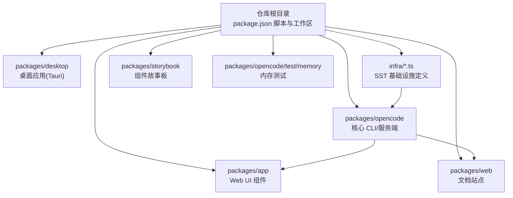
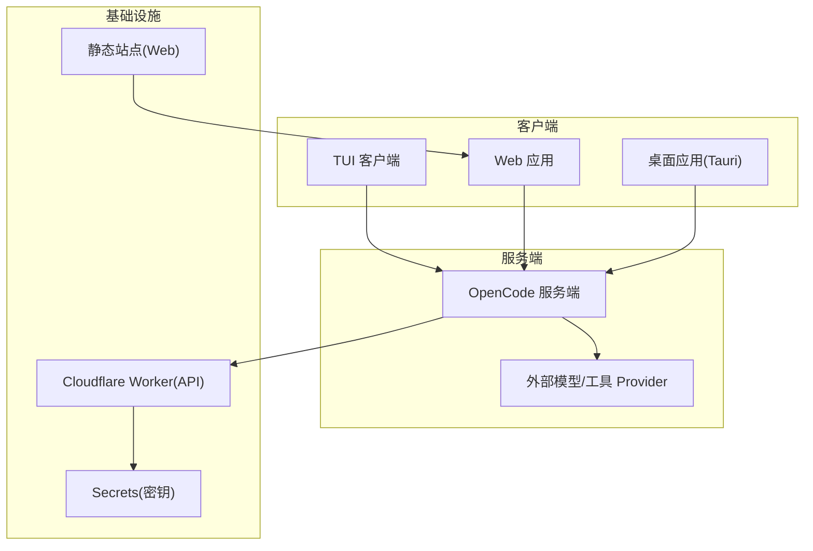
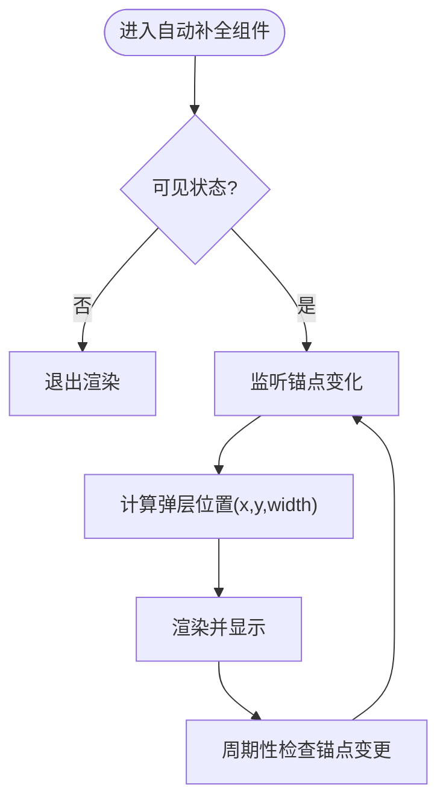
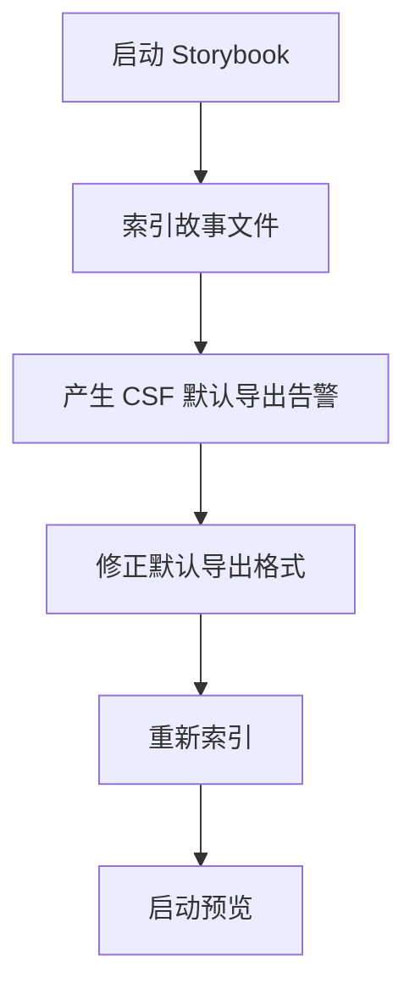
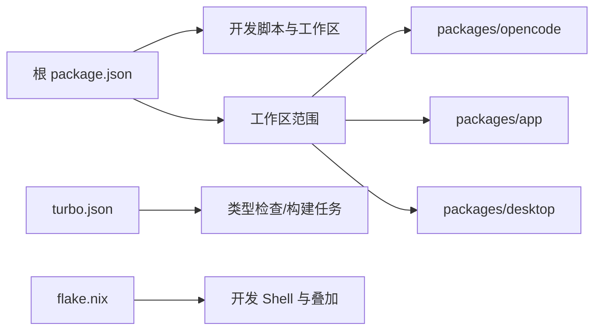

# 故障排除

<cite>
**本文引用的文件**
- [README.md](file://README.md)
- [SECURITY.md](file://SECURITY.md)
- [CONTRIBUTING.md](file://CONTRIBUTING.md)
- [package.json](file://package.json)
- [packages/opencode/package.json](file://packages/opencode/package.json)
- [sst.config.ts](file://sst.config.ts)
- [infra/app.ts](file://infra/app.ts)
- [packages/opencode/src/cli/cmd/tui/component/prompt/autocomplete.tsx](file://packages/opencode/src/cli/cmd/tui/component/prompt/autocomplete.tsx)
- [packages/app/src/components/debug-bar.tsx](file://packages/app/src/components/debug-bar.tsx)
- [packages/opencode/test/memory/abort-leak.test.ts](file://packages/opencode/test/memory/abort-leak.test.ts)
- [packages/web/src/content/docs/providers.mdx](file://packages/web/src/content/docs/providers.mdx)
- [packages/storybook/debug-storybook.log](file://packages/storybook/debug-storybook.log)
- [turbo.json](file://turbo.json)
- [flake.nix](file://flake.nix)
</cite>

## 目录
1. [简介](#简介)
2. [项目结构](#项目结构)
3. [核心组件](#核心组件)
4. [架构总览](#架构总览)
5. [详细组件分析](#详细组件分析)
6. [依赖关系分析](#依赖关系分析)
7. [性能考量](#性能考量)
8. [故障排除指南](#故障排除指南)
9. [结论](#结论)
10. [附录](#附录)

## 简介
本指南面向使用与维护 OpenCode 的用户与开发者，提供系统化的故障排除方法与问题诊断流程。内容覆盖常见错误类型、错误代码含义与解决步骤；日志分析方法、调试工具使用与问题定位技巧；性能问题诊断、内存泄漏检测与网络连接排查；系统兼容性问题、权限配置错误与依赖冲突的解决方案；以及安全问题报告、漏洞修复与应急响应流程，并给出社区支持与技术咨询渠道。

## 项目结构
OpenCode 采用多包工作区（monorepo）组织方式，核心 CLI 与服务端位于 packages/opencode，Web UI 与桌面应用分别在 packages/app 与 packages/desktop，基础设施通过 SST 部署到 Cloudflare Workers 与静态站点。根目录提供统一的开发脚本、类型检查与构建任务，便于跨包协作与一致性管理。

图表来源
- [package.json:1-118](file://package.json#L1-L118)
- [packages/opencode/package.json:1-146](file://packages/opencode/package.json#L1-L146)
- [sst.config.ts:1-24](file://sst.config.ts#L1-L24)
- [infra/app.ts:1-69](file://infra/app.ts#L1-L69)

章节来源
- [package.json:1-118](file://package.json#L1-L118)
- [packages/opencode/package.json:1-146](file://packages/opencode/package.json#L1-L146)
- [sst.config.ts:1-24](file://sst.config.ts#L1-L24)
- [infra/app.ts:1-69](file://infra/app.ts#L1-L69)

## 核心组件
- 核心 CLI 与服务端：提供命令行接口、服务器模式、会话与代理交互、文件与进程操作等能力。[参考路径:1-146](file://packages/opencode/package.json#L1-L146)
- Web UI 与桌面应用：基于 SolidJS 与 Tauri，提供浏览器与原生窗口两种运行形态。[参考路径](file://package.json:1-L118)
- 基础设施：通过 SST 在 Cloudflare Workers 上部署 API 与静态站点，使用 Secret 管理敏感配置。[参考路径:1-24](file://sst.config.ts#L1-L24), [参考路径:1-69](file://infra/app.ts#L1-L69)
- 文档与配置：提供提供商认证、环境变量与配置文件示例，便于快速上手与排错。[参考路径:171-254](file://packages/web/src/content/docs/providers.mdx#L171-L254)

章节来源
- [packages/opencode/package.json:1-146](file://packages/opencode/package.json#L1-L146)
- [package.json:1-118](file://package.json#L1-L118)
- [sst.config.ts:1-24](file://sst.config.ts#L1-L24)
- [infra/app.ts:1-69](file://infra/app.ts#L1-L69)
- [packages/web/src/content/docs/providers.mdx:171-254](file://packages/web/src/content/docs/providers.mdx#L171-L254)

## 架构总览
下图展示 OpenCode 的典型运行时拓扑：客户端（TUI/Web/桌面）与服务端通信，服务端通过 Provider 接入外部模型与工具，基础设施层负责 API 与静态资源托管。

图表来源
- [infra/app.ts:13-49](file://infra/app.ts#L13-L49)
- [packages/opencode/package.json:58-141](file://packages/opencode/package.json#L58-L141)

章节来源
- [infra/app.ts:13-49](file://infra/app.ts#L13-L49)
- [packages/opencode/package.json:58-141](file://packages/opencode/package.json#L58-L141)

## 详细组件分析

### 日志与调试工具
- 开发调试建议：推荐使用 Bun 的调试选项与 VSCode 配置进行断点调试，避免在 worker 环境中出现断点映射问题。[参考路径:158-190](file://CONTRIBUTING.md#L158-L190)
- 性能观测与内存监控：Web UI 提供调试栏，可采集 FPS、长帧、输入延迟与堆内存使用情况，辅助定位前端性能瓶颈。[参考路径:205-250](file://packages/app/src/components/debug-bar.tsx#L205-L250)
- 内存泄漏测试：提供内存增长回归测试样例，用于验证取消/清理逻辑是否导致内存泄漏。[参考路径:117-137](file://packages/opencode/test/memory/abort-leak.test.ts#L117-L137)

章节来源
- [CONTRIBUTING.md:158-190](file://CONTRIBUTING.md#L158-L190)
- [packages/app/src/components/debug-bar.tsx:205-250](file://packages/app/src/components/debug-bar.tsx#L205-L250)
- [packages/opencode/test/memory/abort-leak.test.ts:117-137](file://packages/opencode/test/memory/abort-leak.test.ts#L117-L137)

### 自动补全组件与输入焦点
自动补全组件通过锚点定位与尺寸计算实现弹出层布局，使用定时器与信号联动更新位置，确保与输入框保持同步。该组件常用于 TUI 输入场景，若出现布局错位或闪烁，可检查锚点变化频率与渲染节流策略。

图表来源
- [packages/opencode/src/cli/cmd/tui/component/prompt/autocomplete.tsx:83-127](file://packages/opencode/src/cli/cmd/tui/component/prompt/autocomplete.tsx#L83-L127)

章节来源
- [packages/opencode/src/cli/cmd/tui/component/prompt/autocomplete.tsx:83-127](file://packages/opencode/src/cli/cmd/tui/component/prompt/autocomplete.tsx#L83-L127)

### Storybook 构建错误定位
Storybook 启动日志显示大量“默认导出必须为对象”的告警，属于 CSF 规范错误，需逐一修正各组件故事文件的默认导出格式。建议按错误列表逐项修复并重新启动预览。

图表来源
- [packages/storybook/debug-storybook.log:1-307](file://packages/storybook/debug-storybook.log#L1-L307)

章节来源
- [packages/storybook/debug-storybook.log:1-307](file://packages/storybook/debug-storybook.log#L1-L307)

## 依赖关系分析
- 工作区与脚本：根 package.json 定义了统一的开发脚本与工作区范围，便于跨包执行与类型检查。[参考路径](file://package.json:1-L118)
- Turbo 任务：通过 turbo.json 配置类型检查与构建任务依赖，确保构建顺序与缓存策略一致。[参考路径:1-21](file://turbo.json#L1-L21)
- Nix 开发环境：flake.nix 提供跨平台开发 Shell 与包叠加，便于在不同系统上复现构建环境。[参考路径:1-77](file://flake.nix#L1-L77)

图表来源
- [package.json:1-118](file://package.json#L1-L118)
- [turbo.json:1-21](file://turbo.json#L1-L21)
- [flake.nix:1-77](file://flake.nix#L1-L77)

章节来源
- [package.json:1-118](file://package.json#L1-L118)
- [turbo.json:1-21](file://turbo.json#L1-L21)
- [flake.nix:1-77](file://flake.nix#L1-L77)

## 性能考量
- 前端性能观测：利用调试栏采集 FPS、长帧、输入延迟与堆内存指标，结合性能观察者 API 进行持续监控。[参考路径:205-250](file://packages/app/src/components/debug-bar.tsx#L205-L250)
- 内存泄漏检测：通过对比清理前后的堆内存使用量，验证异步任务与事件处理器的正确释放，避免定时器与控制器未清理导致的泄漏。[参考路径:117-137](file://packages/opencode/test/memory/abort-leak.test.ts#L117-L137)
- 构建与缓存：使用 Turbo 管理任务依赖与输出缓存，减少重复构建时间；Nix 提供稳定的依赖环境，降低因本地差异引发的性能波动。[参考路径:1-21](file://turbo.json#L1-L21), [参考路径:1-77](file://flake.nix#L1-L77)

章节来源
- [packages/app/src/components/debug-bar.tsx:205-250](file://packages/app/src/components/debug-bar.tsx#L205-L250)
- [packages/opencode/test/memory/abort-leak.test.ts:117-137](file://packages/opencode/test/memory/abort-leak.test.ts#L117-L137)
- [turbo.json:1-21](file://turbo.json#L1-L21)
- [flake.nix:1-77](file://flake.nix#L1-L77)

## 故障排除指南

### 常见错误类型与解决步骤
- 安装与运行失败
  - 症状：安装脚本或包管理器安装失败、命令不可用。
  - 排查：确认安装目录优先级与权限，检查 PATH 设置；参考安装说明与平台支持。[参考路径:46-98](file://README.md#L46-L98)
  - 解决：清理旧版本后重试；使用 Homebrew/Chocolatey/Scoop 等官方渠道安装；必要时指定 OPENCODE_INSTALL_DIR 或 XDG_BIN_DIR。[参考路径:85-98](file://README.md#L85-L98)
- 服务器模式访问异常
  - 症状：启用服务器模式后无认证或无法访问。
  - 排查：确认已设置 OPENCODE_SERVER_PASSWORD；未设置时为未认证运行，存在安全风险。[参考路径:21-23](file://SECURITY.md#L21-L23)
  - 解决：设置强密码并以 HTTPS 方式暴露；仅在受信网络内启用。
- Provider 认证失败
  - 症状：调用外部模型/工具时报认证错误。
  - 排查：核对环境变量与配置文件中的 Provider 参数；优先使用配置文件进行持久化配置。[参考路径:171-254](file://packages/web/src/content/docs/providers.mdx#L171-L254)
  - 解决：按文档示例设置 AWS_PROFILE/AWS_ACCESS_KEY_ID 等；或在项目根创建 opencode.json 并写入 provider 选项。[参考路径:196-221](file://packages/web/src/content/docs/providers.mdx#L196-L221)
- 桌面应用无法启动
  - 症状：桌面应用启动崩溃或黑屏。
  - 排查：确认 Tauri 先决条件（Rust 工具链、平台库）已安装；查看控制台输出与日志。[参考路径:124-151](file://CONTRIBUTING.md#L124-L151)
  - 解决：按 Tauri 官方要求安装依赖后重试；如仅需 Web 开发，先启动 Web 服务再打开桌面应用。[参考路径:124-141](file://CONTRIBUTING.md#L124-L141)
- Storybook 构建失败
  - 症状：启动时报“默认导出必须为对象”等 CSF 错误。
  - 排查：根据日志列出的故事文件逐一检查默认导出格式。[参考路径:1-307](file://packages/storybook/debug-storybook.log#L1-L307)
  - 解决：将故事文件的默认导出改为对象形式，保存后重启预览。[参考路径:5-150](file://packages/storybook/debug-storybook.log#L5-L150)

章节来源
- [README.md:46-98](file://README.md#L46-L98)
- [SECURITY.md:21-23](file://SECURITY.md#L21-L23)
- [packages/web/src/content/docs/providers.mdx:171-254](file://packages/web/src/content/docs/providers.mdx#L171-L254)
- [CONTRIBUTING.md:124-151](file://CONTRIBUTING.md#L124-L151)
- [packages/storybook/debug-storybook.log:1-307](file://packages/storybook/debug-storybook.log#L1-L307)

### 日志分析方法与调试工具
- 日志级别与来源
  - Web UI 调试栏：采集 FPS、长帧、输入延迟与堆内存，适合前端性能问题定位。[参考路径:205-250](file://packages/app/src/components/debug-bar.tsx#L205-L250)
  - Storybook 日志：包含 CSF 规范错误与索引失败信息，指导修复故事文件。[参考路径:1-307](file://packages/storybook/debug-storybook.log#L1-L307)
- 调试工具
  - Bun 调试：使用 --inspect/--inspect-brk 等选项附加调试器；在 worker 环境中优先使用 spawn 模式或分离调试服务端与 TUI。[参考路径:158-190](file://CONTRIBUTING.md#L158-L190)
  - VSCode 配置：参考示例 launch/settings 文件进行断点调试。[参考路径:179-188](file://CONTRIBUTING.md#L179-L188)

章节来源
- [packages/app/src/components/debug-bar.tsx:205-250](file://packages/app/src/components/debug-bar.tsx#L205-L250)
- [packages/storybook/debug-storybook.log:1-307](file://packages/storybook/debug-storybook.log#L1-L307)
- [CONTRIBUTING.md:158-190](file://CONTRIBUTING.md#L158-L190)

### 性能问题诊断
- 前端卡顿与掉帧
  - 使用调试栏观察 FPS 与长帧峰值，定位渲染热点；检查是否存在高频重渲染或阻塞主线程的操作。[参考路径:205-250](file://packages/app/src/components/debug-bar.tsx#L205-L250)
- 输入延迟与交互迟滞
  - 关注输入延迟指标，排查事件处理函数耗时过长或频繁触发的副作用。[参考路径:205-250](file://packages/app/src/components/debug-bar.tsx#L205-L250)
- 内存泄漏
  - 对比清理前后堆内存使用，确认定时器、事件监听器、控制器等资源是否正确释放；参考内存测试样例设计回归验证。[参考路径:117-137](file://packages/opencode/test/memory/abort-leak.test.ts#L117-L137)

章节来源
- [packages/app/src/components/debug-bar.tsx:205-250](file://packages/app/src/components/debug-bar.tsx#L205-L250)
- [packages/opencode/test/memory/abort-leak.test.ts:117-137](file://packages/opencode/test/memory/abort-leak.test.ts#L117-L137)

### 网络连接问题排查
- 服务器模式未认证
  - 若未设置 OPENCODE_SERVER_PASSWORD，服务将以未认证模式运行并发出警告，应立即设置密码并加固访问控制。[参考路径:21-23](file://SECURITY.md#L21-L23)
- Provider 端点与代理
  - 如使用 AWS Bedrock VPC 终端节点，请在配置文件中显式设置 endpoint/baseURL；确保网络可达且凭据有效。[参考路径:225-246](file://packages/web/src/content/docs/providers.mdx#L225-L246)

章节来源
- [SECURITY.md:21-23](file://SECURITY.md#L21-L23)
- [packages/web/src/content/docs/providers.mdx:225-246](file://packages/web/src/content/docs/providers.mdx#L225-L246)

### 系统兼容性与权限配置
- 安装目录优先级
  - 安装脚本遵循 OPENCODE_INSTALL_DIR → XDG_BIN_DIR → $HOME/bin → $HOME/.opencode/bin 的优先级；若无写权限，需提升权限或切换到可写路径。[参考路径:85-98](file://README.md#L85-L98)
- Nix 开发环境
  - 使用 flake.nix 提供的开发 Shell 与叠加，确保依赖版本一致，减少平台差异带来的问题。[参考路径:21-31](file://flake.nix#L21-L31)

章节来源
- [README.md:85-98](file://README.md#L85-L98)
- [flake.nix:21-31](file://flake.nix#L21-L31)

### 权限配置错误
- 代理权限提示
  - OpenCode 不提供沙箱隔离，权限系统仅为 UX 提示；如需严格隔离，应在容器或 VM 中运行。[参考路径:15-19](file://SECURITY.md#L15-L19)
- 服务器访问
  - 启用服务器模式后，API 访问属预期行为；请自行妥善保护访问入口。[参考路径:29-31](file://SECURITY.md#L29-L31)

章节来源
- [SECURITY.md:15-19](file://SECURITY.md#L15-L19)
- [SECURITY.md:29-31](file://SECURITY.md#L29-L31)

### 依赖冲突与版本问题
- 工作区与覆盖
  - 根 package.json 定义了 catalog 与 overrides，确保依赖版本一致性；如遇冲突，优先检查覆盖规则与工作区链接。[参考路径](file://package.json:21-L117)
- Turbo 缓存
  - 使用 turbo.json 的 outputs 与 dependsOn 控制构建缓存与依赖顺序，避免因缓存不一致导致的异常。[参考路径:5-19](file://turbo.json#L5-L19)

章节来源
- [package.json:21-117](file://package.json#L21-L117)
- [turbo.json:5-19](file://turbo.json#L5-L19)

### 安全问题报告与应急响应
- 报告渠道
  - 使用 GitHub Security Advisory 的“报告漏洞”功能提交；避免提交 AI 自动生成的报告，以免被封禁。[参考路径:41-47](file://SECURITY.md#L3-L8, file://SECURITY.md#L41-L47)
- 响应流程
  - 安全团队会在合理时间内回复并推进修复与公告；如超过 6 个工作日未收到回复，可通过邮件进一步联系。[参考路径:41-47](file://SECURITY.md#L41-L47)

章节来源
- [SECURITY.md:3-8](file://SECURITY.md#L3-L8)
- [SECURITY.md:41-47](file://SECURITY.md#L41-L47)

### 社区支持与技术咨询
- 社区渠道
  - Discord、GitHub Issues 与文档站提供交流与帮助；请遵循模板与规范提交问题。[参考路径:294-312](file://README.md#L141-L142, file://CONTRIBUTING.md#L294-L312)

章节来源
- [README.md:141-142](file://README.md#L141-L142)
- [CONTRIBUTING.md:294-312](file://CONTRIBUTING.md#L294-L312)

## 结论
通过本指南，用户可以系统化地定位与解决 OpenCode 在安装、运行、调试、性能与安全等方面的问题。建议在日常使用中结合调试栏与日志工具进行持续观测，并遵循安全与权限最佳实践，以获得稳定可靠的开发体验。

## 附录
- 快速参考
  - 安装与运行：参考安装说明与平台支持。[参考路径:46-98](file://README.md#L46-L98)
  - Provider 配置：参考配置文件与环境变量示例。[参考路径:171-254](file://packages/web/src/content/docs/providers.mdx#L171-L254)
  - 调试与断点：参考 Bun 与 VSCode 调试建议。[参考路径:158-190](file://CONTRIBUTING.md#L158-L190)
  - Storybook 修复：按日志修正默认导出格式。[参考路径:1-307](file://packages/storybook/debug-storybook.log#L1-L307)