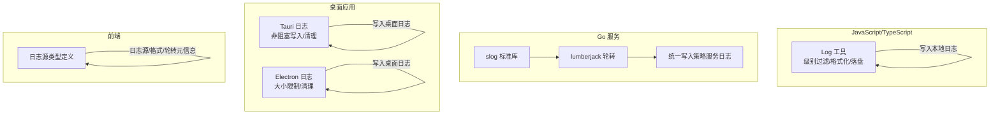
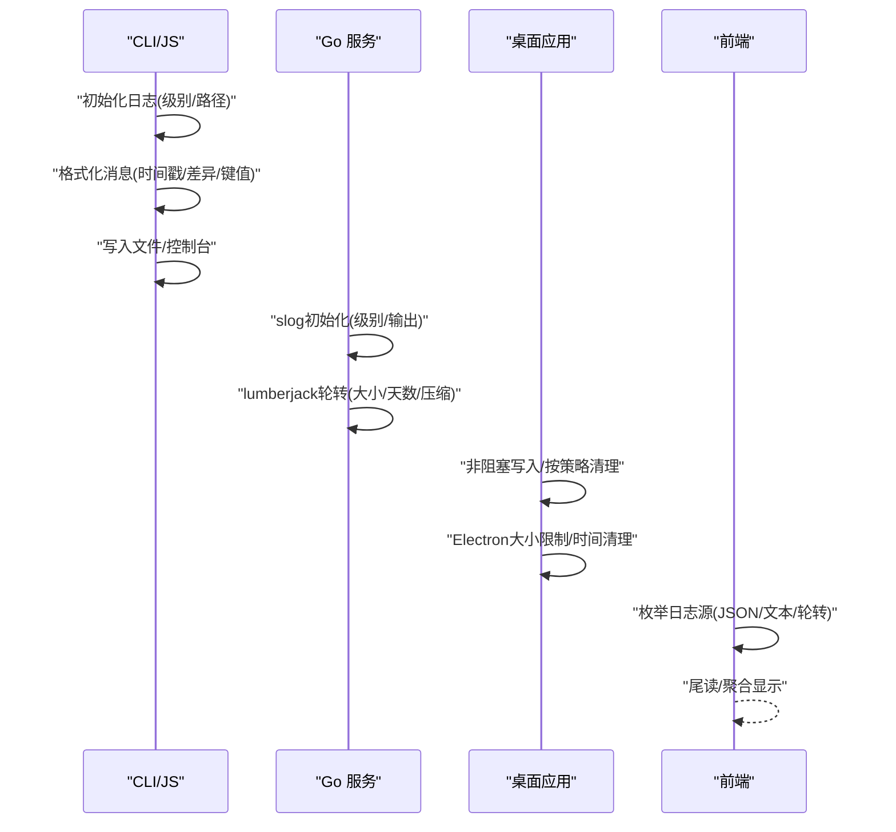
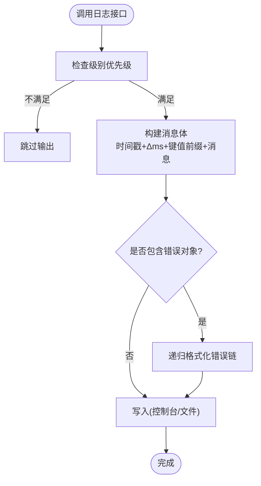
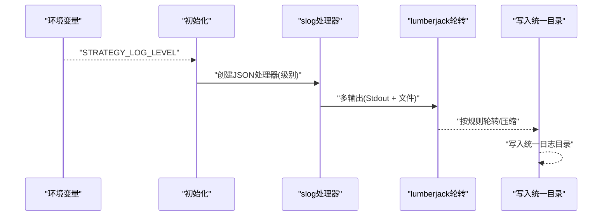
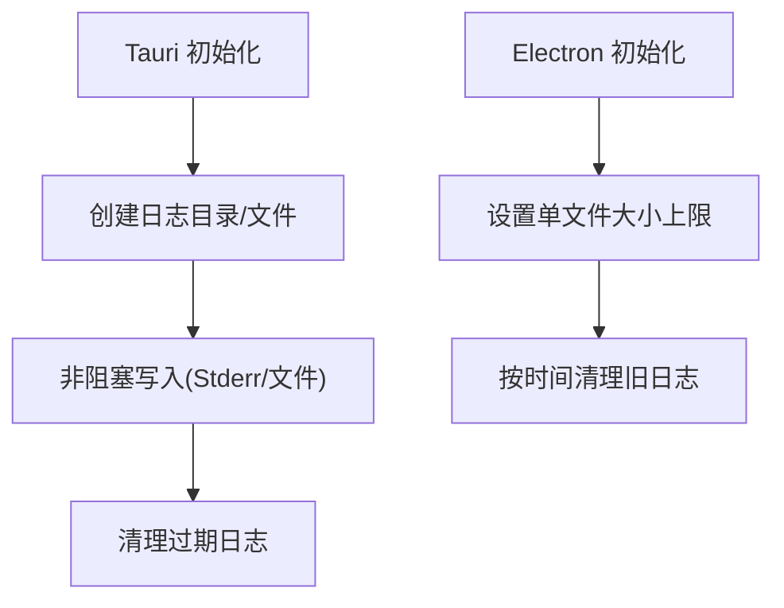
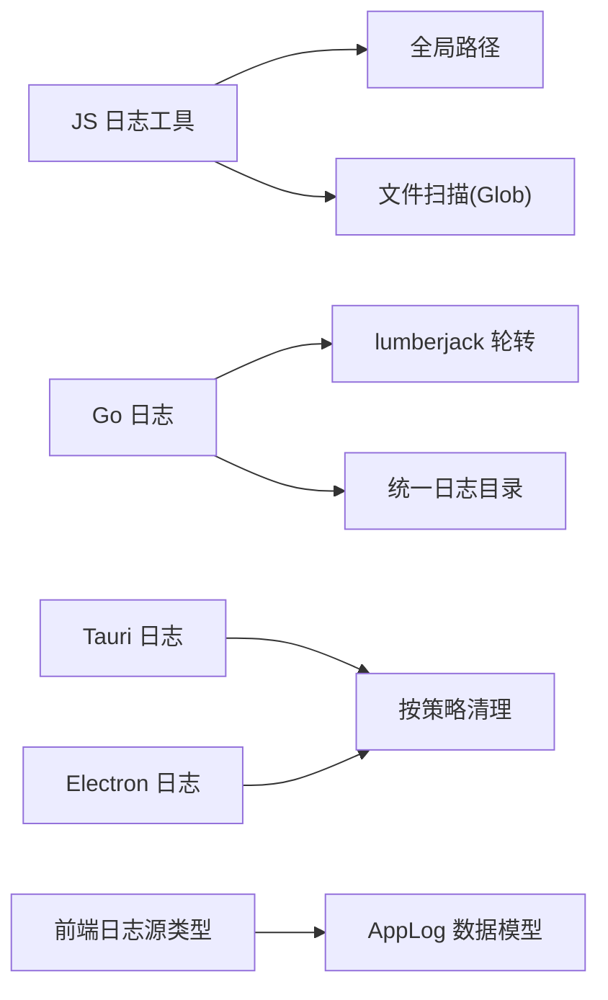

# 日志分析

<cite>
**本文引用的文件**
- [packages/opencode/src/util/log.ts](file://packages/opencode/src/util/log.ts)
- [packages/opencode/src/global/index.ts](file://packages/opencode/src/global/index.ts)
- [packages/web/src/content/docs/troubleshooting.mdx](file://packages/web/src/content/docs/troubleshooting.mdx)
- [packages/strategy-service/internal/logger/logger.go](file://packages/strategy-service/internal/logger/logger.go)
- [packages/strategy-service/internal/oprun/log.go](file://packages/strategy-service/internal/oprun/log.go)
- [packages/desktop/src-tauri/src/logging.rs](file://packages/desktop/src-tauri/src/logging.rs)
- [packages/desktop-electron/src/main/logging.ts](file://packages/desktop-electron/src/main/logging.ts)
- [packages/strategy-front/src/types/system.ts](file://packages/strategy-front/src/types/system.ts)
- [packages/sdk/js/src/v2/gen/types.gen.ts](file://packages/sdk/js/src/v2/gen/types.gen.ts)
- [packages/app/src/utils/server-errors.ts](file://packages/app/src/utils/server-errors.ts)
- [packages/strategy-service/internal/workbench/service.go](file://packages/strategy-service/internal/workbench/service.go)
</cite>

## 目录
1. [简介](#简介)
2. [项目结构](#项目结构)
3. [核心组件](#核心组件)
4. [架构总览](#架构总览)
5. [详细组件分析](#详细组件分析)
6. [依赖关系分析](#依赖关系分析)
7. [性能考量](#性能考量)
8. [故障排查指南](#故障排查指南)
9. [结论](#结论)
10. [附录](#附录)

## 简介
本指南面向OpenCode项目的使用者与维护者，系统性讲解日志体系：日志级别（DEBUG/INFO/WARN/ERROR）的语义与适用场景、日志格式与时间戳含义、如何启用详细日志、如何查看不同服务的日志输出、日志文件位置与清理策略、日志轮转机制、常见日志模式识别与错误追踪方法、以及如何从日志中提取关键信息进行问题诊断。

## 项目结构
OpenCode在多语言与多子系统中实现了统一的日志能力：
- JavaScript/TypeScript侧：内置日志模块负责格式化、级别过滤、文件落盘与清理。
- Go服务侧：通过标准库slog结合第三方lumberjack实现结构化日志与轮转。
- 桌面应用（Tauri/Electron）：分别以非阻塞方式写入日志并按策略清理。
- 前端UI：提供日志源管理与尾读能力，支持JSON/文本两种格式。
- SDK：定义了日志数据模型，便于跨服务传输与聚合。

**图表来源**
- [packages/opencode/src/util/log.ts:1-183](file://packages/opencode/src/util/log.ts#L1-L183)
- [packages/strategy-service/internal/logger/logger.go:1-61](file://packages/strategy-service/internal/logger/logger.go#L1-L61)
- [packages/strategy-service/internal/oprun/log.go:1-65](file://packages/strategy-service/internal/oprun/log.go#L1-L65)
- [packages/desktop/src-tauri/src/logging.rs:1-76](file://packages/desktop/src-tauri/src/logging.rs#L1-L76)
- [packages/desktop-electron/src/main/logging.ts:1-40](file://packages/desktop-electron/src/main/logging.ts#L1-L40)
- [packages/strategy-front/src/types/system.ts:15-35](file://packages/strategy-front/src/types/system.ts#L15-L35)

**章节来源**
- [packages/opencode/src/util/log.ts:1-183](file://packages/opencode/src/util/log.ts#L1-L183)
- [packages/strategy-service/internal/logger/logger.go:1-61](file://packages/strategy-service/internal/logger/logger.go#L1-L61)
- [packages/strategy-service/internal/oprun/log.go:1-65](file://packages/strategy-service/internal/oprun/log.go#L1-L65)
- [packages/desktop/src-tauri/src/logging.rs:1-76](file://packages/desktop/src-tauri/src/logging.rs#L1-L76)
- [packages/desktop-electron/src/main/logging.ts:1-40](file://packages/desktop-electron/src/main/logging.ts#L1-L40)
- [packages/strategy-front/src/types/system.ts:15-35](file://packages/strategy-front/src/types/system.ts#L15-L35)

## 核心组件
- JavaScript/TypeScript日志工具
  - 支持DEBUG/INFO/WARN/ERROR级别，按优先级过滤。
  - 自动格式化消息，包含ISO时间戳（去毫秒）、相对时间差、键值对前缀与消息体。
  - 可选文件落盘与清理，保留最近10个日志文件。
- Go服务日志
  - 使用slog，支持结构化JSON输出。
  - 结合lumberjack实现单文件最大50MB、最多保留30天、本地时区轮转与压缩。
- 桌面应用日志
  - Tauri：非阻塞写入stderr与文件；默认保留最近日志文件。
  - Electron：单文件最大5MB，按7天清理旧日志。
- 前端日志源
  - 定义日志源类型、格式（JSON/文本）、是否可监控、是否轮转等元信息。

**章节来源**
- [packages/opencode/src/util/log.ts:9-182](file://packages/opencode/src/util/log.ts#L9-L182)
- [packages/strategy-service/internal/logger/logger.go:19-41](file://packages/strategy-service/internal/logger/logger.go#L19-L41)
- [packages/desktop/src-tauri/src/logging.rs:12-76](file://packages/desktop/src-tauri/src/logging.rs#L12-L76)
- [packages/desktop-electron/src/main/logging.ts:1-40](file://packages/desktop-electron/src/main/logging.ts#L1-L40)
- [packages/strategy-front/src/types/system.ts:15-35](file://packages/strategy-front/src/types/system.ts#L15-L35)

## 架构总览
OpenCode的日志架构由“统一入口 + 多语言实现 + 前端聚合”构成，确保跨平台、跨服务的一致性与可观测性。

**图表来源**
- [packages/opencode/src/util/log.ts:60-90](file://packages/opencode/src/util/log.ts#L60-L90)
- [packages/strategy-service/internal/logger/logger.go:20-41](file://packages/strategy-service/internal/logger/logger.go#L20-L41)
- [packages/desktop/src-tauri/src/logging.rs:12-76](file://packages/desktop/src-tauri/src/logging.rs#L12-L76)
- [packages/desktop-electron/src/main/logging.ts:1-40](file://packages/desktop-electron/src/main/logging.ts#L1-L40)
- [packages/strategy-front/src/types/system.ts:15-35](file://packages/strategy-front/src/types/system.ts#L15-L35)

## 详细组件分析

### JavaScript/TypeScript日志模块
- 级别与优先级
  - DEBUG/INFO/WARN/ERROR按数值优先级过滤，仅输出不低于当前级别的日志。
- 格式化
  - 时间戳为ISO基础部分（去毫秒），随后是“+Δms”相对时间差，再跟键值对前缀，最后是消息体。
  - 错误对象会被递归格式化为“消息 + Caused by: …”链路。
- 文件与清理
  - 默认输出到stderr；当开启文件落盘时，按日期命名并追加写入。
  - 启动时清理过期日志，保留最近10个文件。
- 计时辅助
  - 提供time方法，自动输出“started/completed”状态及耗时。

**图表来源**
- [packages/opencode/src/util/log.ts:12-23](file://packages/opencode/src/util/log.ts#L12-L23)
- [packages/opencode/src/util/log.ts:111-127](file://packages/opencode/src/util/log.ts#L111-L127)
- [packages/opencode/src/util/log.ts:92-97](file://packages/opencode/src/util/log.ts#L92-L97)
- [packages/opencode/src/util/log.ts:60-90](file://packages/opencode/src/util/log.ts#L60-L90)

**章节来源**
- [packages/opencode/src/util/log.ts:9-182](file://packages/opencode/src/util/log.ts#L9-L182)

### Go服务日志与轮转
- 初始化
  - 从环境变量读取日志级别，创建slog实例，同时输出到stdout与文件。
  - 文件采用lumberjack轮转：单文件最大50MB、最多保留30天、压缩、本地时区。
- 写入策略
  - 通过oprun内部的writer按行写入，避免半行落盘，最终写入统一日志目录。

**图表来源**
- [packages/strategy-service/internal/logger/logger.go:20-41](file://packages/strategy-service/internal/logger/logger.go#L20-L41)
- [packages/strategy-service/internal/oprun/log.go:13-51](file://packages/strategy-service/internal/oprun/log.go#L13-L51)

**章节来源**
- [packages/strategy-service/internal/logger/logger.go:1-61](file://packages/strategy-service/internal/logger/logger.go#L1-L61)
- [packages/strategy-service/internal/oprun/log.go:1-65](file://packages/strategy-service/internal/oprun/log.go#L1-L65)

### 桌面应用日志
- Tauri
  - 非阻塞写入stderr与文件；启动时清理过期日志，默认保留最近日志文件。
  - 日志文件名包含时间戳，便于区分。
- Electron
  - 单文件最大5MB；按7天清理旧日志，避免磁盘占用过大。

**图表来源**
- [packages/desktop/src-tauri/src/logging.rs:12-76](file://packages/desktop/src-tauri/src/logging.rs#L12-L76)
- [packages/desktop-electron/src/main/logging.ts:1-40](file://packages/desktop-electron/src/main/logging.ts#L1-L40)

**章节来源**
- [packages/desktop/src-tauri/src/logging.rs:1-76](file://packages/desktop/src-tauri/src/logging.rs#L1-L76)
- [packages/desktop-electron/src/main/logging.ts:1-40](file://packages/desktop-electron/src/main/logging.ts#L1-L40)

### 前端日志源与查看
- 类型定义
  - 包含日志源标识、标签、类型（受管/子进程）、格式（JSON/文本）、路径、是否可监控、是否轮转、更新时间与大小等。
- 尾读与聚合
  - 前端可枚举日志源，按需尾读最近N行，支持JSON/文本两种格式，便于快速定位问题。

**章节来源**
- [packages/strategy-front/src/types/system.ts:15-35](file://packages/strategy-front/src/types/system.ts#L15-L35)

### 日志数据模型（SDK）
- AppLog数据结构
  - 包含service（服务名）、level（debug/info/error/warn）、message（消息）、extra（附加元数据）。
- 用途
  - 跨服务传输与聚合，便于统一检索与分析。

**章节来源**
- [packages/sdk/js/src/v2/gen/types.gen.ts:4818-4838](file://packages/sdk/js/src/v2/gen/types.gen.ts#L4818-L4838)

## 依赖关系分析
- JS日志模块依赖全局路径与文件扫描工具，用于清理过期日志。
- Go服务日志依赖lumberjack与统一日志目录，保证跨进程一致性。
- 桌面应用日志各自独立，但遵循统一的清理策略。
- 前端通过类型定义与SDK模型对接后端日志源。

**图表来源**
- [packages/opencode/src/util/log.ts:60-90](file://packages/opencode/src/util/log.ts#L60-L90)
- [packages/strategy-service/internal/logger/logger.go:20-41](file://packages/strategy-service/internal/logger/logger.go#L20-L41)
- [packages/desktop/src-tauri/src/logging.rs:60-76](file://packages/desktop/src-tauri/src/logging.rs#L60-L76)
- [packages/desktop-electron/src/main/logging.ts:25-40](file://packages/desktop-electron/src/main/logging.ts#L25-L40)
- [packages/strategy-front/src/types/system.ts:15-35](file://packages/strategy-front/src/types/system.ts#L15-L35)
- [packages/sdk/js/src/v2/gen/types.gen.ts:4818-4838](file://packages/sdk/js/src/v2/gen/types.gen.ts#L4818-L4838)

**章节来源**
- [packages/opencode/src/util/log.ts:60-90](file://packages/opencode/src/util/log.ts#L60-L90)
- [packages/strategy-service/internal/logger/logger.go:20-41](file://packages/strategy-service/internal/logger/logger.go#L20-L41)
- [packages/desktop/src-tauri/src/logging.rs:60-76](file://packages/desktop/src-tauri/src/logging.rs#L60-L76)
- [packages/desktop-electron/src/main/logging.ts:25-40](file://packages/desktop-electron/src/main/logging.ts#L25-L40)
- [packages/strategy-front/src/types/system.ts:15-35](file://packages/strategy-front/src/types/system.ts#L15-L35)
- [packages/sdk/js/src/v2/gen/types.gen.ts:4818-4838](file://packages/sdk/js/src/v2/gen/types.gen.ts#L4818-L4838)

## 性能考量
- 输出路径
  - JS侧默认输出到stderr，避免频繁IO；启用文件落盘时使用追加写入，减少随机访问。
- 轮转策略
  - Go侧单文件50MB、最多30天，兼顾存储与查询效率；压缩降低磁盘占用。
  - 桌面应用侧Tauri/Electron分别设置大小与时间阈值，避免长期运行导致磁盘膨胀。
- 前端尾读
  - 限制尾读行数，避免一次性加载过多日志影响UI性能。

[本节为通用建议，无需具体文件分析]

## 故障排查指南

### 如何启用详细日志
- CLI/JS
  - 使用命令行选项设置日志级别，以便获取更详细的调试信息。
- Go服务
  - 设置环境变量STRATEGY_LOG_LEVEL为debug/info/warn/error之一。
- LSP/其他子系统
  - 按文档示例设置相应环境变量或配置项以提升日志粒度。

**章节来源**
- [packages/web/src/content/docs/troubleshooting.mdx:17-20](file://packages/web/src/content/docs/troubleshooting.mdx#L17-L20)
- [packages/strategy-service/internal/oprun/log.go:54-65](file://packages/strategy-service/internal/oprun/log.go#L54-L65)

### 日志文件位置与查看
- 统一位置
  - macOS/Linux: ~/.local/share/opencode/log/
  - Windows: %USERPROFILE%\.local\share\opencode\log
- 文件命名
  - 采用时间戳命名（如2025-01-09T123456.log），保留最近10个文件。
- 查看方式
  - 控制台直接输出（默认）或文件落盘；前端可枚举日志源并尾读。

**章节来源**
- [packages/web/src/content/docs/troubleshooting.mdx:12-19](file://packages/web/src/content/docs/troubleshooting.mdx#L12-L19)
- [packages/opencode/src/util/log.ts:64-78](file://packages/opencode/src/util/log.ts#L64-L78)

### 清理策略与轮转机制
- JS侧
  - 启动时扫描匹配模式的日志文件，超过阈值则删除最旧的文件，保留最近10个。
- Go侧
  - lumberjack按大小与时间轮转，压缩历史文件，本地时区。
- 桌面应用
  - Tauri：清理过期日志。
  - Electron：按7天清理旧日志；单文件最大5MB。

**章节来源**
- [packages/opencode/src/util/log.ts:80-90](file://packages/opencode/src/util/log.ts#L80-L90)
- [packages/strategy-service/internal/logger/logger.go:26-32](file://packages/strategy-service/internal/logger/logger.go#L26-L32)
- [packages/desktop/src-tauri/src/logging.rs:60-76](file://packages/desktop/src-tauri/src/logging.rs#L60-L76)
- [packages/desktop-electron/src/main/logging.ts:5-40](file://packages/desktop-electron/src/main/logging.ts#L5-L40)

### 常见日志模式识别与错误追踪
- 模式识别
  - 成功/失败：关注“status=started/completed”与“duration”字段，定位耗时异常。
  - 错误链：出现“Caused by: …”时，逐层回溯根因。
  - 服务标记：通过“service=xxx”快速定位来源。
- 错误追踪
  - JS侧：错误对象被格式化为链式描述，便于串联上下文。
  - Go侧：结构化JSON日志，配合统一目录与轮转，利于批量检索。
  - 前端：根据日志源类型选择合适格式（JSON/文本），并结合tail行数进行快速定位。

**章节来源**
- [packages/opencode/src/util/log.ts:92-97](file://packages/opencode/src/util/log.ts#L92-L97)
- [packages/strategy-service/internal/logger/logger.go:35-38](file://packages/strategy-service/internal/logger/logger.go#L35-L38)
- [packages/strategy-front/src/types/system.ts:15-35](file://packages/strategy-front/src/types/system.ts#L15-L35)

### 从日志中提取关键信息进行诊断
- 快速定位
  - 使用“service=xxx”筛选目标服务。
  - 使用“level=error/warn”优先查看异常。
  - 使用“duration”识别性能瓶颈。
- 上下文关联
  - 结合会话ID、请求ID等上下文字段，串联前后文日志。
- 存储与备份
  - 依据文档所述存储位置，确认本地数据与日志一致性。

**章节来源**
- [packages/web/src/content/docs/troubleshooting.mdx:23-37](file://packages/web/src/content/docs/troubleshooting.mdx#L23-L37)

## 结论
OpenCode的日志体系在多语言与多形态（CLI、Go服务、桌面应用、前端）中保持一致的格式与策略，既满足日常运维的可观测性需求，也便于开发者在复杂场景中快速定位问题。通过合理设置日志级别、理解日志格式与轮转机制、掌握常见模式识别与提取技巧，可以高效完成问题诊断与性能优化。

## 附录

### 日志级别与使用场景
- DEBUG：开发调试、细粒度流程跟踪。
- INFO：常规运行状态、关键事件。
- WARN：潜在风险、异常但可恢复。
- ERROR：错误、异常、不可恢复问题。

**章节来源**
- [packages/opencode/src/util/log.ts:9-23](file://packages/opencode/src/util/log.ts#L9-L23)
- [packages/strategy-service/internal/oprun/log.go:54-65](file://packages/strategy-service/internal/oprun/log.go#L54-L65)

### 日志格式与时间戳含义
- 格式：时间戳 + Δms + 键值前缀 + 消息体
- 时间戳：ISO基础部分（去毫秒），Δms为自上次日志的相对时间差
- 错误链：使用“Caused by: …”串联上层异常

**章节来源**
- [packages/opencode/src/util/log.ts:111-127](file://packages/opencode/src/util/log.ts#L111-L127)
- [packages/opencode/src/util/log.ts:92-97](file://packages/opencode/src/util/log.ts#L92-L97)

### 日志文件位置与清理策略
- 位置：~/.local/share/opencode/log（各平台）
- 清理：JS侧保留最近10个文件；Go侧按大小/时间轮转；桌面应用按大小/时间清理

**章节来源**
- [packages/web/src/content/docs/troubleshooting.mdx:12-19](file://packages/web/src/content/docs/troubleshooting.mdx#L12-L19)
- [packages/opencode/src/util/log.ts:80-90](file://packages/opencode/src/util/log.ts#L80-L90)
- [packages/strategy-service/internal/logger/logger.go:26-32](file://packages/strategy-service/internal/logger/logger.go#L26-L32)
- [packages/desktop/src-tauri/src/logging.rs:60-76](file://packages/desktop/src-tauri/src/logging.rs#L60-L76)
- [packages/desktop-electron/src/main/logging.ts:25-40](file://packages/desktop-electron/src/main/logging.ts#L25-L40)

### 前端日志源与SDK模型
- 日志源类型：受管/子进程、JSON/文本、轮转、可监控等元信息
- SDK模型：AppLog包含service、level、message、extra

**章节来源**
- [packages/strategy-front/src/types/system.ts:15-35](file://packages/strategy-front/src/types/system.ts#L15-L35)
- [packages/sdk/js/src/v2/gen/types.gen.ts:4818-4838](file://packages/sdk/js/src/v2/gen/types.gen.ts#L4818-L4838)