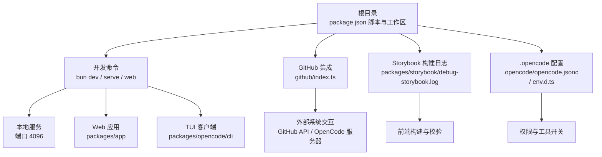
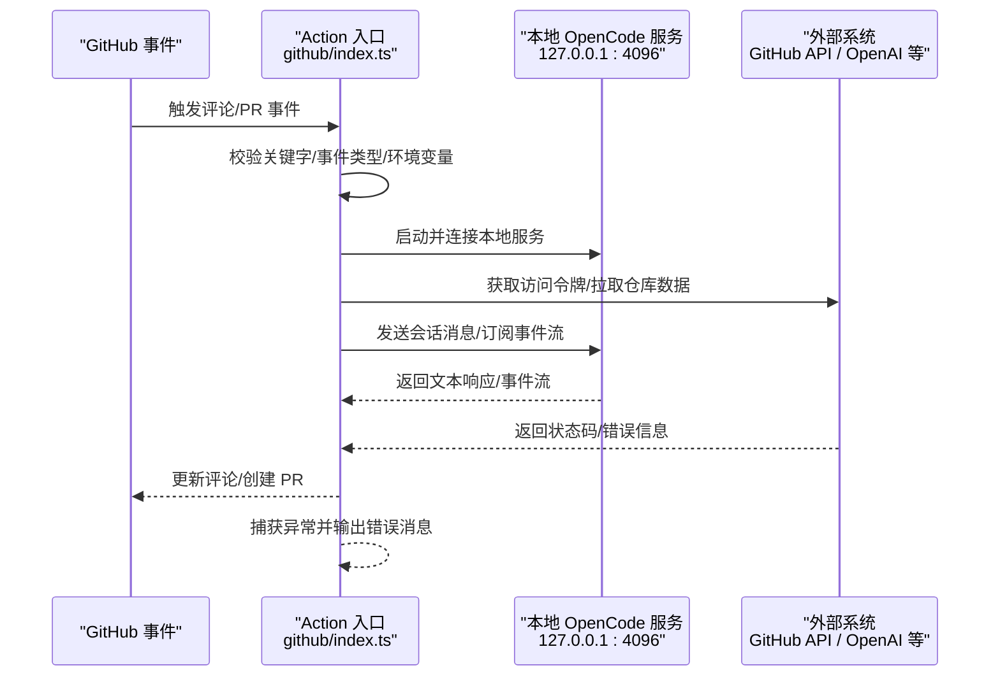
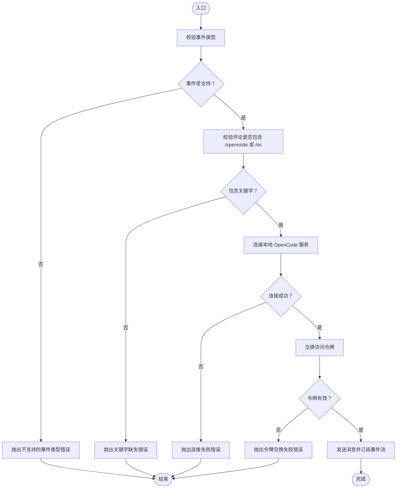
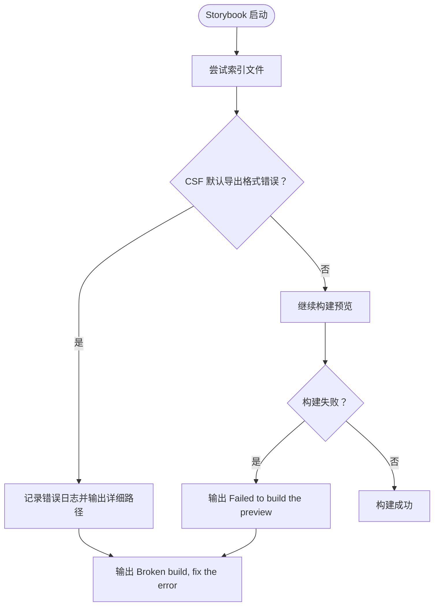
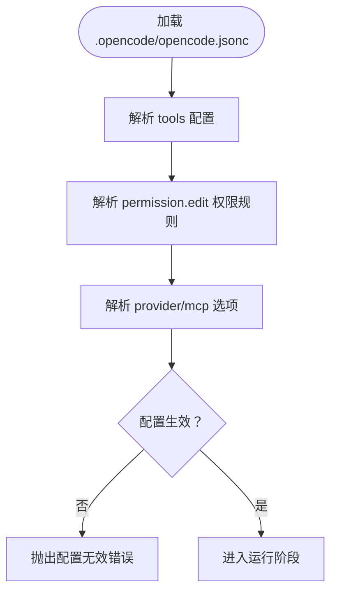
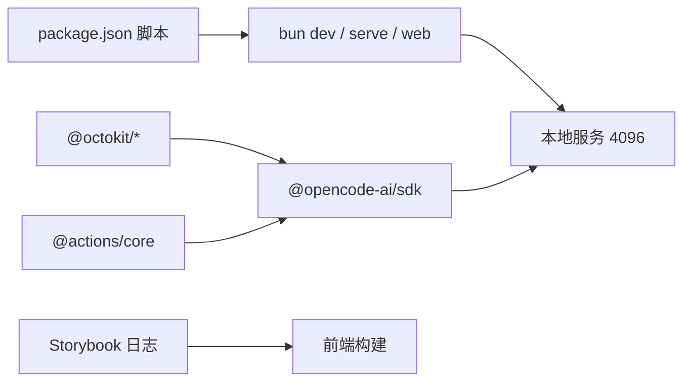

# 错误诊断

<cite>
**本文引用的文件**
- [README.md](file://README.md)
- [CONTRIBUTING.md](file://CONTRIBUTING.md)
- [package.json](file://package.json)
- [github/index.ts](file://github/index.ts)
- [packages/storybook/debug-storybook.log](file://packages/storybook/debug-storybook.log)
- [.opencode/opencode.jsonc](file://.opencode/opencode.jsonc)
- [.opencode/env.d.ts](file://.opencode/env.d.ts)
</cite>

## 目录
1. [简介](#简介)
2. [项目结构](#项目结构)
3. [核心组件](#核心组件)
4. [架构总览](#架构总览)
5. [详细组件分析](#详细组件分析)
6. [依赖分析](#依赖分析)
7. [性能考量](#性能考量)
8. [故障排查指南](#故障排查指南)
9. [结论](#结论)
10. [附录](#附录)

## 简介
本指南面向使用 OpenCode 的开发者与运维人员，系统化讲解如何进行错误诊断与恢复。内容覆盖错误类型分类（语法错误、运行时错误、配置错误、网络错误等）、错误代码与消息的解读方法、常见场景的诊断步骤（命令行参数错误、配置文件格式错误、权限不足等）、调试模式与日志级别的使用方式，并提供恢复策略与预防措施。文档同时结合仓库中的实际实现与日志样例，帮助快速定位问题并闭环修复。

## 项目结构
OpenCode 是一个多包工作区项目，围绕核心服务、CLI、Web/TUI、桌面应用以及工具链展开。与错误诊断直接相关的关键位置包括：
- 根级脚本与开发命令：用于启动服务、Web 界面与 TUI
- GitHub Action 集成：包含大量显式错误抛出与日志输出，便于定位外部交互问题
- Storybook 构建日志：展示前端构建期的典型错误形态
- 配置文件：.opencode 目录下的 JSONC 配置与类型声明，用于约束行为与权限

图表来源
- [package.json:1-118](file://package.json#L1-L118)
- [github/index.ts:1-1054](file://github/index.ts#L1-L1054)
- [packages/storybook/debug-storybook.log:1-307](file://packages/storybook/debug-storybook.log#L1-L307)
- [.opencode/opencode.jsonc:1-19](file://.opencode/opencode.jsonc#L1-L19)
- [.opencode/env.d.ts:1-5](file://.opencode/env.d.ts#L1-L5)

章节来源
- [package.json:1-118](file://package.json#L1-L118)
- [README.md:1-142](file://README.md#L1-L142)

## 核心组件
- 开发与运行命令
  - 本地服务：bun dev serve，默认监听端口 4096
  - Web 应用：bun run --cwd packages/app dev
  - TUI：bun dev <目录>
- GitHub Action 集成
  - 启动本地 OpenCode 服务并通过客户端连接
  - 对环境变量、事件类型、权限、网络请求等进行严格校验
  - 捕获 Shell 与 Error 并输出可读错误消息
- Storybook 构建日志
  - 展示前端构建期的默认导出规范错误与索引失败
- 配置与权限
  - .opencode/opencode.jsonc 提供 provider、permission、tools 等配置项
  - env.d.ts 声明模块类型，避免类型错误

章节来源
- [CONTRIBUTING.md:72-154](file://CONTRIBUTING.md#L72-L154)
- [github/index.ts:127-229](file://github/index.ts#L127-L229)
- [packages/storybook/debug-storybook.log:1-307](file://packages/storybook/debug-storybook.log#L1-L307)
- [.opencode/opencode.jsonc:1-19](file://.opencode/opencode.jsonc#L1-L19)
- [.opencode/env.d.ts:1-5](file://.opencode/env.d.ts#L1-L5)

## 架构总览
下图展示了 GitHub Action 触发后，本地 OpenCode 服务与外部系统的交互路径，以及错误在各环节的传播与处理方式。

图表来源
- [github/index.ts:127-229](file://github/index.ts#L127-L229)
- [github/index.ts:231-242](file://github/index.ts#L231-L242)
- [github/index.ts:270-291](file://github/index.ts#L270-L291)
- [github/index.ts:370-401](file://github/index.ts#L370-L401)
- [github/index.ts:494-575](file://github/index.ts#L494-L575)

## 详细组件分析

### 组件一：GitHub Action 错误处理与诊断
该组件负责将 GitHub 事件转化为 OpenCode 会话操作，并对多种输入与外部依赖进行严格校验。其错误处理策略包括：
- 显式抛出错误并记录可读消息
- 将 Shell 错误转换为可读 stderr
- 使用 core.setFailed 输出到 GitHub Actions 界面
- 在 finally 中清理资源，确保稳定退出

图表来源
- [github/index.ts:127-229](file://github/index.ts#L127-L229)
- [github/index.ts:244-250](file://github/index.ts#L244-L250)
- [github/index.ts:293-299](file://github/index.ts#L293-L299)
- [github/index.ts:270-291](file://github/index.ts#L270-L291)
- [github/index.ts:370-401](file://github/index.ts#L370-L401)
- [github/index.ts:494-575](file://github/index.ts#L494-L575)

章节来源
- [github/index.ts:127-229](file://github/index.ts#L127-L229)
- [github/index.ts:244-250](file://github/index.ts#L244-L250)
- [github/index.ts:293-299](file://github/index.ts#L293-L299)
- [github/index.ts:270-291](file://github/index.ts#L270-L291)
- [github/index.ts:370-401](file://github/index.ts#L370-L401)
- [github/index.ts:494-575](file://github/index.ts#L494-L575)

### 组件二：Storybook 构建期错误（前端构建）
该组件展示了前端构建阶段常见的错误形态，如默认导出必须为对象、索引构建失败等。这些错误属于“语法错误”范畴，通常由 Storybook 在解析组件故事时触发。

图表来源
- [packages/storybook/debug-storybook.log:1-307](file://packages/storybook/debug-storybook.log#L1-L307)

章节来源
- [packages/storybook/debug-storybook.log:1-307](file://packages/storybook/debug-storybook.log#L1-L307)

### 组件三：配置与权限（.opencode）
该组件定义了 OpenCode 的运行时配置与权限边界，错误通常表现为“配置错误”或“权限不足”。例如：
- tools 字段控制工具开关
- permission.edit 控制特定路径的编辑权限
- provider 与 mcp 空对象表示默认行为

图表来源
- [.opencode/opencode.jsonc:1-19](file://.opencode/opencode.jsonc#L1-L19)

章节来源
- [.opencode/opencode.jsonc:1-19](file://.opencode/opencode.jsonc#L1-L19)

## 依赖分析
- 开发与运行
  - 本地服务默认端口 4096，可通过脚本启动
  - Web 应用与 TUI 分别在不同工作区目录下开发
- 外部依赖
  - GitHub API 交互、OpenCode 服务器、模型提供商等
  - Action 使用 @actions/core 与 @octokit/* 进行上下文与请求处理
- 日志与诊断
  - Action 使用 console.error 与 core.setFailed 输出错误
  - Storybook 使用 [ERROR]/[WARN]/[INFO]/[DEBUG] 等级别输出

图表来源
- [package.json:1-118](file://package.json#L1-L118)
- [github/index.ts:1-12](file://github/index.ts#L1-L12)

章节来源
- [package.json:1-118](file://package.json#L1-L118)
- [github/index.ts:1-12](file://github/index.ts#L1-L12)

## 性能考量
- 本地服务与 Web/TUI 的分离有助于独立调试与资源占用控制
- GitHub Action 中对连接重试与超时控制可减少偶发性网络波动影响
- 前端构建阶段的错误应尽早暴露，避免后续流程浪费资源

## 故障排查指南

### 一、错误类型与解读
- 语法错误
  - 典型表现：前端构建失败、组件默认导出非对象
  - 参考日志：Storybook 报错明确指出文件路径与行号
- 运行时错误
  - 典型表现：Action 执行过程中抛出异常、Shell 命令失败
  - 参考实现：捕获 ShellError 并输出 stderr；统一 Error.message
- 配置错误
  - 典型表现：环境变量缺失、事件类型不受支持、权限不足
  - 参考实现：对 MODEL、GITHUB_RUN_ID、SHARE 等进行格式与存在性校验
- 网络错误
  - 典型表现：无法连接本地服务、令牌交换失败、无响应体
  - 参考实现：连接重试、HTTP 状态码与响应体检查、事件流读取异常处理

章节来源
- [packages/storybook/debug-storybook.log:1-307](file://packages/storybook/debug-storybook.log#L1-L307)
- [github/index.ts:127-229](file://github/index.ts#L127-L229)
- [github/index.ts:244-250](file://github/index.ts#L244-L250)
- [github/index.ts:293-299](file://github/index.ts#L293-L299)
- [github/index.ts:370-401](file://github/index.ts#L370-L401)
- [github/index.ts:510-511](file://github/index.ts#L510-L511)

### 二、常见场景诊断步骤
- 命令行参数错误
  - 步骤：确认 dev/serve/web 参数是否正确；检查端口占用与权限
  - 参考：本地服务默认端口 4096，可通过脚本指定
- 配置文件格式错误
  - 步骤：验证 .opencode/opencode.jsonc 的键名与值类型；关注 tools、permission、provider
  - 参考：tools 与 permission.edit 的字段语义
- 权限不足错误
  - 步骤：检查 GitHub 用户权限等级；确认是否使用 PAT；必要时撤销安装令牌
  - 参考：权限校验与撤销令牌流程
- 环境变量缺失或格式错误
  - 步骤：核对 MODEL、GITHUB_RUN_ID、SHARE 等变量；确保格式符合预期
  - 参考：环境变量校验与错误消息

章节来源
- [CONTRIBUTING.md:97-122](file://CONTRIBUTING.md#L97-L122)
- [.opencode/opencode.jsonc:1-19](file://.opencode/opencode.jsonc#L1-L19)
- [github/index.ts:301-332](file://github/index.ts#L301-L332)
- [github/index.ts:758-784](file://github/index.ts#L758-L784)
- [github/index.ts:1041-1053](file://github/index.ts#L1041-L1053)

### 三、调试模式与日志级别
- 调试模式
  - 使用 Bun 调试选项运行：参考贡献指南中的调试建议
  - 建议：优先使用 --inspect-wait 或 --inspect-brk，便于附加调试器
- 日志级别
  - Storybook：INFO/DEBUG/WARN/ERROR 等级别，便于区分问题严重程度
  - Action：统一输出错误消息至控制台与 GitHub Actions 界面

章节来源
- [CONTRIBUTING.md:158-178](file://CONTRIBUTING.md#L158-L178)
- [packages/storybook/debug-storybook.log:1-307](file://packages/storybook/debug-storybook.log#L1-L307)
- [github/index.ts:211-221](file://github/index.ts#L211-L221)

### 四、错误恢复策略与预防措施
- 恢复策略
  - 服务不可达：检查本地服务是否启动、端口是否被占用；必要时重启服务
  - 权限不足：提升用户权限或改用 PAT；撤销安装令牌后重试
  - 配置错误：修正 .opencode/opencode.jsonc；确保键名与值类型一致
  - 构建失败：根据 Storybook 日志修复组件默认导出；清理缓存后重试
- 预防措施
  - 在 CI 中加入环境变量校验与最小化权限原则
  - 对关键配置进行静态检查与类型校验
  - 前端组件遵循 Storybook 规范，避免默认导出格式错误

章节来源
- [github/index.ts:270-291](file://github/index.ts#L270-L291)
- [github/index.ts:758-784](file://github/index.ts#L758-L784)
- [github/index.ts:1041-1053](file://github/index.ts#L1041-L1053)
- [.opencode/opencode.jsonc:1-19](file://.opencode/opencode.jsonc#L1-L19)
- [packages/storybook/debug-storybook.log:1-307](file://packages/storybook/debug-storybook.log#L1-L307)

## 结论
通过对 GitHub Action、前端构建与配置文件的综合分析，OpenCode 的错误诊断体系具备清晰的分层与可观测性。建议在日常使用中：
- 优先启用调试模式并结合日志级别定位问题
- 严格校验环境变量与配置文件，避免“配置错误”
- 对外部依赖（网络、权限）进行重试与降级处理
- 在 CI 中引入静态检查与最小权限原则，降低运行时风险

## 附录
- 快速参考
  - 本地服务端口：4096
  - 关键环境变量：MODEL、GITHUB_RUN_ID、SHARE、TOKEN
  - 常见错误来源：事件类型不受支持、权限不足、令牌交换失败、前端组件默认导出格式错误