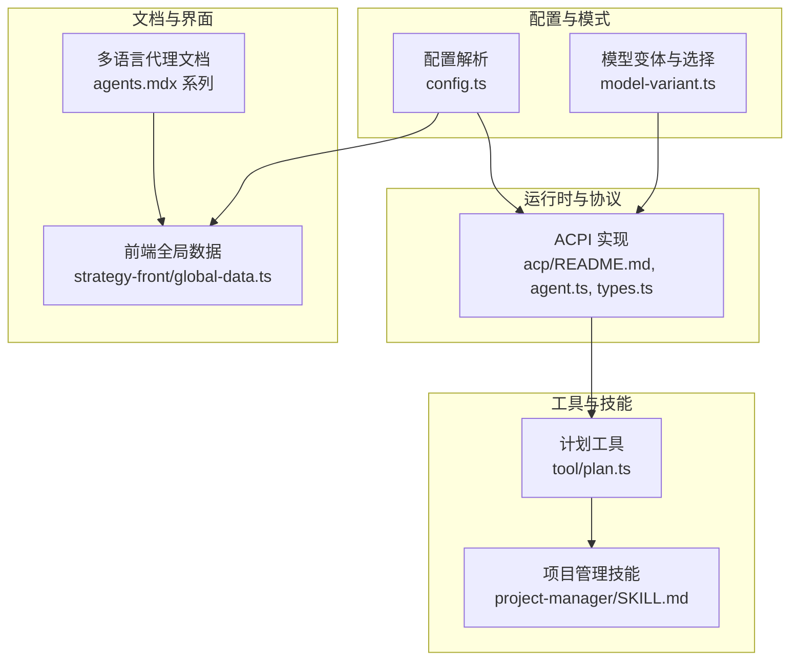
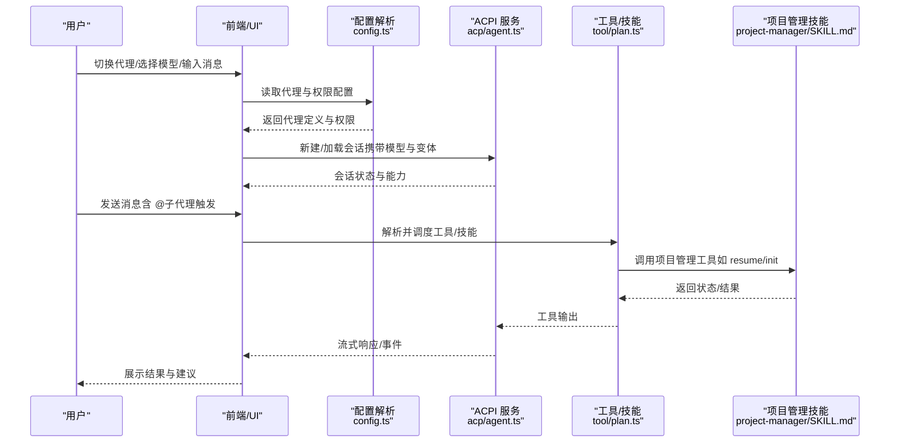
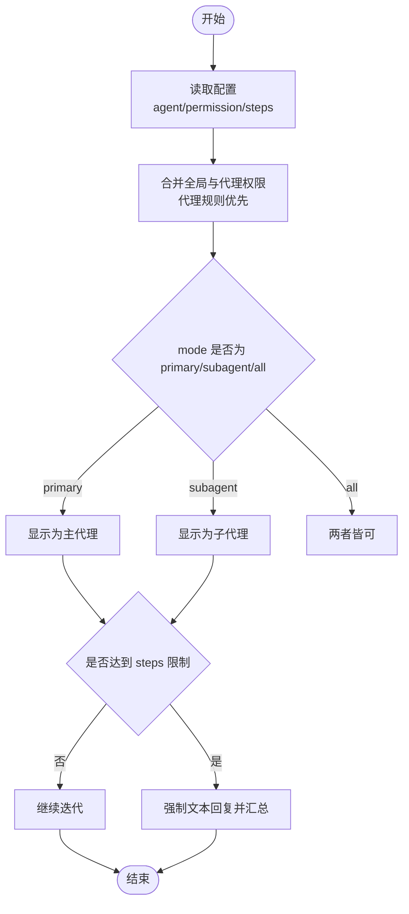
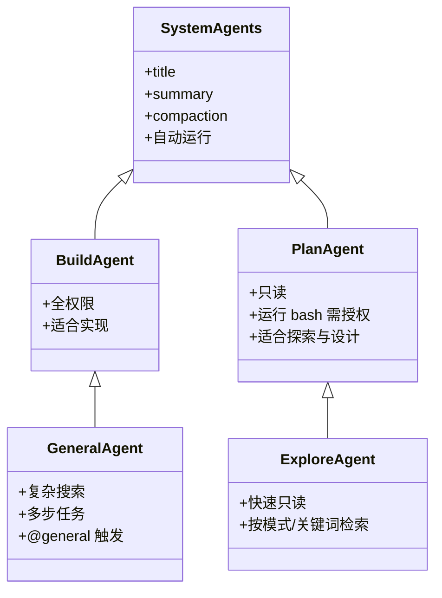
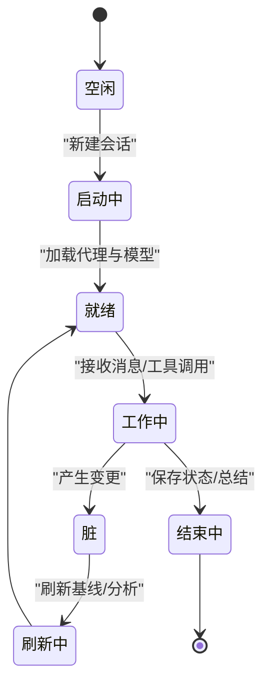
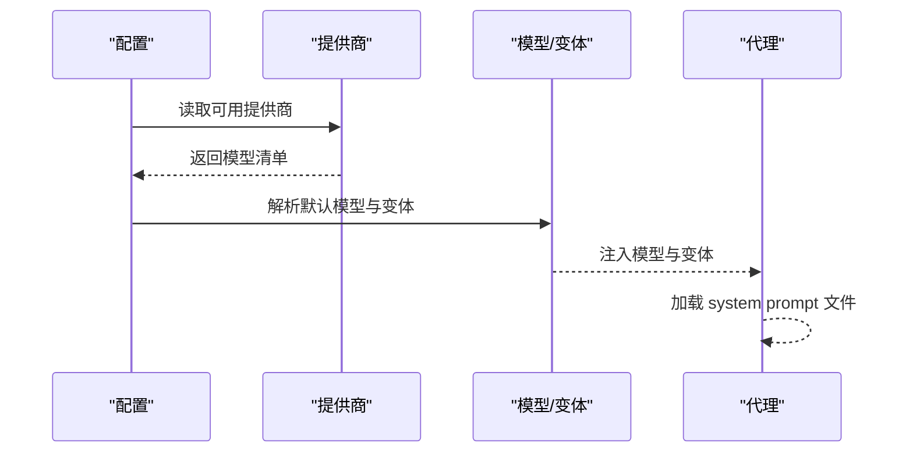
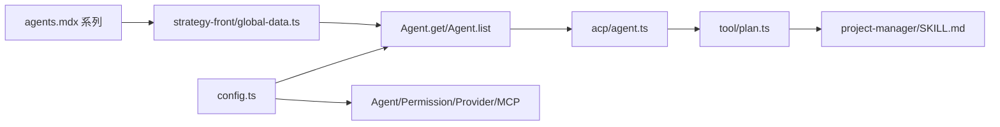

# AI代理系统

<cite>
**本文引用的文件**
- [README.md](file://README.md)
- [AGENTS.md](file://AGENTS.md)
- [packages/opencode/src/agent/generate.txt](file://packages/opencode/src/agent/generate.txt)
- [packages/opencode/src/acp/README.md](file://packages/opencode/src/acp/README.md)
- [packages/opencode/src/acp/types.ts](file://packages/opencode/src/acp/types.ts)
- [packages/opencode/src/acp/agent.ts](file://packages/opencode/src/acp/agent.ts)
- [packages/opencode/src/config/config.ts](file://packages/opencode/src/config/config.ts)
- [packages/opencode/test/agent/agent.test.ts](file://packages/opencode/test/agent/agent.test.ts)
- [packages/opencode/test/config/config.test.ts](file://packages/opencode/test/config/config.test.ts)
- [packages/opencode/src/tool/plan.ts](file://packages/opencode/src/tool/plan.ts)
- [packages/app/src/context/model-variant.ts](file://packages/app/src/context/model-variant.ts)
- [packages/web/src/content/docs/de/agents.mdx](file://packages/web/src/content/docs/de/agents.mdx)
- [packages/web/src/content/docs/es/agents.mdx](file://packages/web/src/content/docs/es/agents.mdx)
- [packages/web/src/content/docs/it/agents.mdx](file://packages/web/src/content/docs/it/agents.mdx)
- [packages/web/src/content/docs/pl/agents.mdx](file://packages/web/src/content/docs/pl/agents.mdx)
- [packages/web/src/content/docs/tr/agents.mdx](file://packages/web/src/content/docs/tr/agents.mdx)
- [packages/web/src/content/docs/bs/agents.mdx](file://packages/web/src/content/docs/bs/agents.mdx)
- [packages/web/src/content/docs/bs/permissions.mdx](file://packages/web/src/content/docs/bs/permissions.mdx)
- [packages/web/src/content/docs/ko/agents.mdx](file://packages/web/src/content/docs/ko/agents.mdx)
- [packages/web/src/content/docs/da/agents.mdx](file://packages/web/src/content/docs/da/agents.mdx)
- [packages/web/src/content/docs/it/server.mdx](file://packages/web/src/content/docs/it/server.mdx)
- [packages/strategy-front/src/data/global-data.ts](file://packages/strategy-front/src/data/global-data.ts)
- [packages/strategy-service/internal/asset/workspace/skills/project-manager/README.md](file://packages/strategy-service/internal/asset/workspace/skills/project-manager/README.md)
- [packages/strategy-service/internal/asset/workspace/skills/project-manager/SKILL.md](file://packages/strategy-service/internal/asset/workspace/skills/project-manager/SKILL.md)
- [docs/plans/2026-06-24-project-manager-smartx-workflow-enforcement.md](file://docs/plans/2026-06-24-project-manager-smartx-workflow-enforcement.md)
- [docs/plans/2026-04-12-workflow-session-agent-model-clarity.md](file://docs/plans/2026-04-12-workflow-session-agent-model-clarity.md)
</cite>

## 目录
1. [简介](#简介)
2. [项目结构](#项目结构)
3. [核心组件](#核心组件)
4. [架构总览](#架构总览)
5. [详细组件分析](#详细组件分析)
6. [依赖关系分析](#依赖关系分析)
7. [性能考量](#性能考量)
8. [故障排除指南](#故障排除指南)
9. [结论](#结论)
10. [附录](#附录)

## 简介
本文件系统化梳理 OpenCode 的 AI 代理系统，覆盖代理的核心概念、类型分类、工作机制、内置代理能力与配置、生命周期与权限控制、与模型提供商的集成、提示词模板与自定义代理创建流程，并提供调试、性能优化与故障排除的最佳实践。目标读者包括开发者、产品与运营人员，帮助快速上手并深度定制代理。

## 项目结构
OpenCode 将“代理”作为核心能力之一，贯穿配置层、运行时、工具与 UI 展示。关键位置如下：
- 配置与模式：通过配置文件定义代理、权限、模型与 MCP 等
- 运行时与协议：ACPI（Agent Client Protocol）实现，负责会话生命周期与消息处理
- 工具与技能：内置工具（如计划切换）、策略技能（如项目管理）
- 文档与本地化：多语言文档说明代理类型、权限与使用方式
- 前端与全局数据：代理列表、作用域与可见性管理

**图表来源**
- [packages/opencode/src/config/config.ts:1091-1138](file://packages/opencode/src/config/config.ts#L1091-L1138)
- [packages/app/src/context/model-variant.ts:1-41](file://packages/app/src/context/model-variant.ts#L1-L41)
- [packages/opencode/src/acp/README.md:1-63](file://packages/opencode/src/acp/README.md#L1-L63)
- [packages/opencode/src/acp/agent.ts:1124-1157](file://packages/opencode/src/acp/agent.ts#L1124-L1157)
- [packages/opencode/src/acp/types.ts:1-24](file://packages/opencode/src/acp/types.ts#L1-L24)
- [packages/opencode/src/tool/plan.ts:31-76](file://packages/opencode/src/tool/plan.ts#L31-L76)
- [packages/strategy-service/internal/asset/workspace/skills/project-manager/SKILL.md:1-61](file://packages/strategy-service/internal/asset/workspace/skills/project-manager/SKILL.md#L1-L61)
- [packages/web/src/content/docs/de/agents.mdx:62-105](file://packages/web/src/content/docs/de/agents.mdx#L62-L105)
- [packages/strategy-front/src/data/global-data.ts:118-181](file://packages/strategy-front/src/data/global-data.ts#L118-L181)

**章节来源**
- [README.md:100-114](file://README.md#L100-L114)
- [packages/opencode/src/config/config.ts:1091-1138](file://packages/opencode/src/config/config.ts#L1091-L1138)
- [packages/opencode/src/acp/README.md:1-63](file://packages/opencode/src/acp/README.md#L1-L63)

## 核心组件
- 代理类型与模式
  - 主代理（Primary）：直接交互、主对话循环，权限决定工具可用性
  - 子代理（Subagent）：面向特定任务的专家代理，可通过 @ 触发或由主代理自动调度
  - 内置代理：build（默认全权限）、plan（只读探索）、general/explore（复杂搜索与多步任务）、title/summary/compaction（系统隐藏代理）
- 权限控制
  - 支持对 edit、bash、webfetch 等工具的 ask/allow/deny 控制，支持按命令模式匹配
  - 全局权限与代理级权限合并，代理规则优先
- 模型与变体
  - 代理可绑定 provider/model，支持变体（variant）循环与选择
- 提示词与系统提示
  - 支持从文件加载 system prompt，支持 steps/maxSteps 控制迭代次数
- ACP 协议
  - 清晰的会话生命周期（new/load）、能力协商、消息分发与事件订阅

**章节来源**
- [README.md:100-114](file://README.md#L100-L114)
- [packages/web/src/content/docs/de/agents.mdx:62-105](file://packages/web/src/content/docs/de/agents.mdx#L62-L105)
- [packages/web/src/content/docs/it/agents.mdx:401-467](file://packages/web/src/content/docs/it/agents.mdx#L401-L467)
- [packages/opencode/src/config/config.ts:738-779](file://packages/opencode/src/config/config.ts#L738-L779)
- [packages/app/src/context/model-variant.ts:1-41](file://packages/app/src/context/model-variant.ts#L1-L41)
- [packages/opencode/src/acp/README.md:1-63](file://packages/opencode/src/acp/README.md#L1-L63)

## 架构总览
下图展示代理系统的关键交互：配置驱动代理定义与权限；ACPI 负责会话生命周期与消息处理；工具与技能在会话中被调用；UI 展示代理列表与变体选择。

**图表来源**
- [packages/opencode/src/config/config.ts:1091-1138](file://packages/opencode/src/config/config.ts#L1091-L1138)
- [packages/opencode/src/acp/agent.ts:1124-1157](file://packages/opencode/src/acp/agent.ts#L1124-L1157)
- [packages/opencode/src/tool/plan.ts:31-76](file://packages/opencode/src/tool/plan.ts#L31-L76)
- [packages/strategy-service/internal/asset/workspace/skills/project-manager/SKILL.md:1-61](file://packages/strategy-service/internal/asset/workspace/skills/project-manager/SKILL.md#L1-L61)

## 详细组件分析

### 组件A：代理配置与模式（Primary/Subagent）
- 配置入口
  - 顶层 agent 字段支持 build、plan、general、explore、title、summary、compaction 等
  - 兼容旧版 mode 字段（已弃用），新配置推荐使用 agent
- 模式与可见性
  - mode: primary/subagent/all 控制代理在 UI 中的呈现与可选范围
  - hidden: true 仅影响 UI 自动补全可见性，不影响模型通过 Task 工具调用
- 权限合并
  - 全局 permission 与代理级 permission 合并，代理规则优先
  - 支持 bash 命令级匹配（如 git diff、git log*、grep *）
- 步骤限制
  - steps 控制最大迭代次数；达到上限后强制文本回复并汇总剩余任务
  - maxSteps 已弃用，统一使用 steps

**图表来源**
- [packages/opencode/src/config/config.ts:738-779](file://packages/opencode/src/config/config.ts#L738-L779)
- [packages/web/src/content/docs/es/agents.mdx:281-329](file://packages/web/src/content/docs/es/agents.mdx#L281-L329)
- [packages/web/src/content/docs/bs/agents.mdx:513-573](file://packages/web/src/content/docs/bs/agents.mdx#L513-L573)

**章节来源**
- [packages/opencode/src/config/config.ts:1091-1138](file://packages/opencode/src/config/config.ts#L1091-L1138)
- [packages/web/src/content/docs/de/agents.mdx:62-105](file://packages/web/src/content/docs/de/agents.mdx#L62-L105)
- [packages/web/src/content/docs/bs/permissions.mdx:175-230](file://packages/web/src/content/docs/bs/permissions.mdx#L175-L230)
- [packages/web/src/content/docs/bs/agents.mdx:513-573](file://packages/web/src/content/docs/bs/agents.mdx#L513-L573)
- [packages/web/src/content/docs/it/agents.mdx:401-467](file://packages/web/src/content/docs/it/agents.mdx#L401-L467)

### 组件B：内置代理功能与使用场景
- build（默认全权限）
  - 场景：开发实现、文件编辑、命令执行
  - 特点：默认允许 edit/bash/webfetch；适合落地执行
- plan（只读探索）
  - 场景：分析代码、规划变更、避免误改
  - 特点：默认拒绝文件编辑；运行 bash 前需授权；适合探索与设计
- general（复杂搜索与多步任务）
  - 场景：跨模块检索、多步骤推理
  - 使用：在消息中以 @general 触发
- explore（快速只读探索）
  - 场景：按模式查找文件、关键词检索、回答代码库问题
- title/summary/compaction（系统隐藏代理）
  - 场景：自动生成标题、会话摘要、压缩长上下文
  - 特点：自动运行，不可在 UI 中选择

**图表来源**
- [README.md:100-114](file://README.md#L100-L114)
- [packages/web/src/content/docs/de/agents.mdx:62-105](file://packages/web/src/content/docs/de/agents.mdx#L62-L105)

**章节来源**
- [README.md:100-114](file://README.md#L100-L114)
- [packages/web/src/content/docs/de/agents.mdx:62-105](file://packages/web/src/content/docs/de/agents.mdx#L62-L105)

### 组件C：生命周期管理、状态转换与权限控制
- 生命周期
  - 初始化：根据工作目录与默认模型加载可用代理与变体
  - 会话加载：解析当前模式（modeId），设置默认代理
  - 消息处理：接收用户输入，路由至主代理或子代理；工具调用受权限控制
- 状态转换
  - idle → booting → ready → dirty → refreshing → finalizing（工作区基线状态）
  - 项目记忆协议：resume/init → 分析/保存 → 开发/调试 → 保存状态 → 总结交接
- 权限控制
  - 全局与代理级合并，代理规则优先
  - bash 命令支持通配匹配，精细控制危险命令

**图表来源**
- [docs/plans/2026-06-24-project-manager-smartx-workflow-enforcement.md:60-73](file://docs/plans/2026-06-24-project-manager-smartx-workflow-enforcement.md#L60-L73)
- [packages/strategy-service/internal/asset/workspace/skills/project-manager/SKILL.md:1-61](file://packages/strategy-service/internal/asset/workspace/skills/project-manager/SKILL.md#L1-L61)

**章节来源**
- [packages/opencode/src/acp/agent.ts:1124-1157](file://packages/opencode/src/acp/agent.ts#L1124-L1157)
- [docs/plans/2026-06-24-project-manager-smartx-workflow-enforcement.md:26-73](file://docs/plans/2026-06-24-project-manager-smartx-workflow-enforcement.md#L26-L73)
- [packages/strategy-service/internal/asset/workspace/skills/project-manager/SKILL.md:1-61](file://packages/strategy-service/internal/asset/workspace/skills/project-manager/SKILL.md#L1-L61)

### 组件D：与模型提供商的集成与提示词模板
- 模型提供商
  - 支持多提供商与模型，配置可覆盖默认模型
  - 变体（variant）与模型绑定，支持循环选择与配置保留
- 提示词模板
  - 支持从文件加载 system prompt（如 code-review.txt）
  - 生成器模板用于指导如何设计高性能代理配置（包含 whenToUse、systemPrompt 等字段）

**图表来源**
- [packages/opencode/src/config/config.ts:1091-1138](file://packages/opencode/src/config/config.ts#L1091-L1138)
- [packages/app/src/context/model-variant.ts:1-41](file://packages/app/src/context/model-variant.ts#L1-L41)
- [packages/opencode/src/agent/generate.txt:1-75](file://packages/opencode/src/agent/generate.txt#L1-L75)

**章节来源**
- [packages/opencode/src/config/config.ts:1091-1138](file://packages/opencode/src/config/config.ts#L1091-L1138)
- [packages/app/src/context/model-variant.ts:1-41](file://packages/app/src/context/model-variant.ts#L1-L41)
- [packages/opencode/src/agent/generate.txt:1-75](file://packages/opencode/src/agent/generate.txt#L1-L75)

### 组件E：自定义代理创建流程与最佳实践
- 创建步骤
  - 在配置中新增 agent 节点，指定 model、temperature、top_p、description、prompt 等
  - 使用 options 承载未知字段，确保扩展性
  - 通过 mode 控制可见性，hidden 控制 UI 可见性但不影响工具调用
- 最佳实践
  - 明确 whenToUse 与 systemPrompt，聚焦单一职责
  - 使用 steps 限制迭代，避免成本失控
  - 权限最小化原则，bash 命令使用通配匹配精确授权
  - 使用 @general/@explore 等子代理进行任务分解与协作

**章节来源**
- [packages/opencode/test/agent/agent.test.ts:108-397](file://packages/opencode/test/agent/agent.test.ts#L108-L397)
- [packages/opencode/test/config/config.test.ts:364-393](file://packages/opencode/test/config/config.test.ts#L364-L393)
- [packages/web/src/content/docs/bs/agents.mdx:513-573](file://packages/web/src/content/docs/bs/agents.mdx#L513-L573)
- [packages/web/src/content/docs/bs/permissions.mdx:175-230](file://packages/web/src/content/docs/bs/permissions.mdx#L175-L230)

## 依赖关系分析
- 配置层依赖
  - config.ts 定义 agent、permission、provider、mcp、formatter、lsp 等 schema
  - 生成器模板 generate.txt 为代理配置提供设计框架
- 运行时依赖
  - ACP 实现负责会话生命周期与消息处理，类型定义位于 types.ts
  - plan 工具在主代理与子代理之间切换，触发构建流程
- 前端与全局数据
  - strategy-front/global-data.ts 管理代理与技能目录、作用域与可见性
- 技能与工作流
  - project-manager 技能定义项目记忆协议，配合 workflow plan 明确执行顺序

**图表来源**
- [packages/opencode/src/config/config.ts:1091-1138](file://packages/opencode/src/config/config.ts#L1091-L1138)
- [packages/opencode/src/acp/agent.ts:1124-1157](file://packages/opencode/src/acp/agent.ts#L1124-L1157)
- [packages/opencode/src/tool/plan.ts:31-76](file://packages/opencode/src/tool/plan.ts#L31-L76)
- [packages/strategy-front/src/data/global-data.ts:118-181](file://packages/strategy-front/src/data/global-data.ts#L118-L181)
- [packages/strategy-service/internal/asset/workspace/skills/project-manager/SKILL.md:1-61](file://packages/strategy-service/internal/asset/workspace/skills/project-manager/SKILL.md#L1-L61)

**章节来源**
- [packages/opencode/src/config/config.ts:1091-1138](file://packages/opencode/src/config/config.ts#L1091-L1138)
- [packages/opencode/src/acp/agent.ts:1124-1157](file://packages/opencode/src/acp/agent.ts#L1124-L1157)
- [packages/strategy-front/src/data/global-data.ts:118-181](file://packages/strategy-front/src/data/global-data.ts#L118-L181)

## 性能考量
- 限制迭代次数：通过 steps/maxSteps 控制代理迭代，避免长对话导致延迟与成本上升
- 权限最小化：仅开放必要工具与命令，减少无效调用与失败重试
- 模型变体：合理选择模型与变体，平衡速度与质量
- 会话清理：定期使用 summary/compaction 降低上下文长度，提升响应速度
- 并行与批处理：在工具层面尽量合并操作，减少多次往返

[本节为通用建议，无需特定文件引用]

## 故障排除指南
- 配置错误
  - 严格 schema 校验：无效字段或非法 JSON 将抛出异常
  - 建议：逐项核对 agent/permission/provider/mcp 字段，确保类型与枚举值正确
- 代理不可见或无法调用
  - 检查 mode 与 hidden 设置；hidden 仅影响 UI 自动补全
  - 确认 permission.task 对子代理的授权规则
- 权限不足
  - bash 命令未授权：使用通配匹配精确授权（如 git diff、grep *）
  - edit/webfetch 被拒：确认全局与代理级权限合并逻辑
- 工作流与项目记忆
  - 未按顺序执行：检查 resume/init → 分析/保存 → 开发/调试 → 保存状态 → 总结交接
  - 未验证动作：确保项目管理技能暴露的 MCP 工具被调用与验证

**章节来源**
- [packages/opencode/test/config/config.test.ts:349-393](file://packages/opencode/test/config/config.test.ts#L349-L393)
- [packages/web/src/content/docs/bs/permissions.mdx:175-230](file://packages/web/src/content/docs/bs/permissions.mdx#L175-L230)
- [packages/web/src/content/docs/bs/agents.mdx:513-573](file://packages/web/src/content/docs/bs/agents.mdx#L513-L573)
- [docs/plans/2026-06-24-project-manager-smartx-workflow-enforcement.md:26-73](file://docs/plans/2026-06-24-project-manager-smartx-workflow-enforcement.md#L26-L73)

## 结论
OpenCode 的代理系统以“配置驱动 + ACP 协议 + 权限最小化”为核心，提供主/子代理双轨模式、精细化权限控制、可插拔模型与变体、以及与工作流/技能的强耦合。通过明确的生命周期与工作流规范（如项目记忆协议），系统在保证安全性的同时提升了工程效率。建议在生产环境中遵循“最小权限、明确职责、限制迭代、定期清理”的原则，并结合多语言文档与测试用例持续完善代理配置。

[本节为总结，无需特定文件引用]

## 附录

### 附录A：代理配置 schema 与参数说明
- agent 字段
  - build/plan/general/explore/title/summary/compaction 等内置代理
  - 自定义代理：name、model、variant、prompt、description、temperature、top_p、mode、hidden、color、steps、options、permission、disable、tools
- permission 字段
  - edit、bash、webfetch 的 ask/allow/deny 控制
  - bash 支持对象语法与通配匹配
- provider 字段
  - 自定义提供商配置与模型覆盖
- mcp 字段
  - MCP 服务器配置（本地/远程/开关）
- formatter/lsp/instructions/layout 等
  - 格式化器、LSP、附加指令与布局配置

**章节来源**
- [packages/opencode/src/config/config.ts:1091-1138](file://packages/opencode/src/config/config.ts#L1091-L1138)
- [packages/web/src/content/docs/it/agents.mdx:401-467](file://packages/web/src/content/docs/it/agents.mdx#L401-L467)

### 附录B：实际使用示例（路径指引）
- 自定义代理
  - 在配置中添加 agent 节点，参考测试用例路径
    - [packages/opencode/test/agent/agent.test.ts:122-149](file://packages/opencode/test/agent/agent.test.ts#L122-L149)
- 权限合并与覆盖
  - 全局与代理级权限合并，代理规则优先
    - [packages/opencode/test/agent/agent.test.ts:199-242](file://packages/opencode/test/agent/agent.test.ts#L199-L242)
- 步骤限制
  - steps/maxSteps 配置与行为
    - [packages/web/src/content/docs/es/agents.mdx:281-329](file://packages/web/src/content/docs/es/agents.mdx#L281-L329)
- 提示词模板
  - system prompt 文件加载
    - [packages/web/src/content/docs/da/agents.mdx:295-348](file://packages/web/src/content/docs/da/agents.mdx#L295-L348)
- ACP 事件订阅
  - 会话消息分发与事件处理
    - [packages/opencode/src/acp/agent.ts:1124-1157](file://packages/opencode/src/acp/agent.ts#L1124-L1157)

### 附录C：与工作流/技能的集成
- 工作流会话与代理模型清晰度
  - workflow chat 不应选择执行代理；节点级模型覆盖优先于工作区默认模型
  - 参考：workflow plan 设计与页面改造
- 项目管理技能
  - 明确 resume/init → 分析/保存 → 开发/调试 → 保存状态 → 总结交接的强制链路
  - 通过 MCP 工具验证动作执行

**章节来源**
- [docs/plans/2026-04-12-workflow-session-agent-model-clarity.md:31-67](file://docs/plans/2026-04-12-workflow-session-agent-model-clarity.md#L31-L67)
- [docs/plans/2026-06-24-project-manager-smartx-workflow-enforcement.md:26-73](file://docs/plans/2026-06-24-project-manager-smartx-workflow-enforcement.md#L26-L73)
- [packages/strategy-service/internal/asset/workspace/skills/project-manager/SKILL.md:1-61](file://packages/strategy-service/internal/asset/workspace/skills/project-manager/SKILL.md#L1-L61)