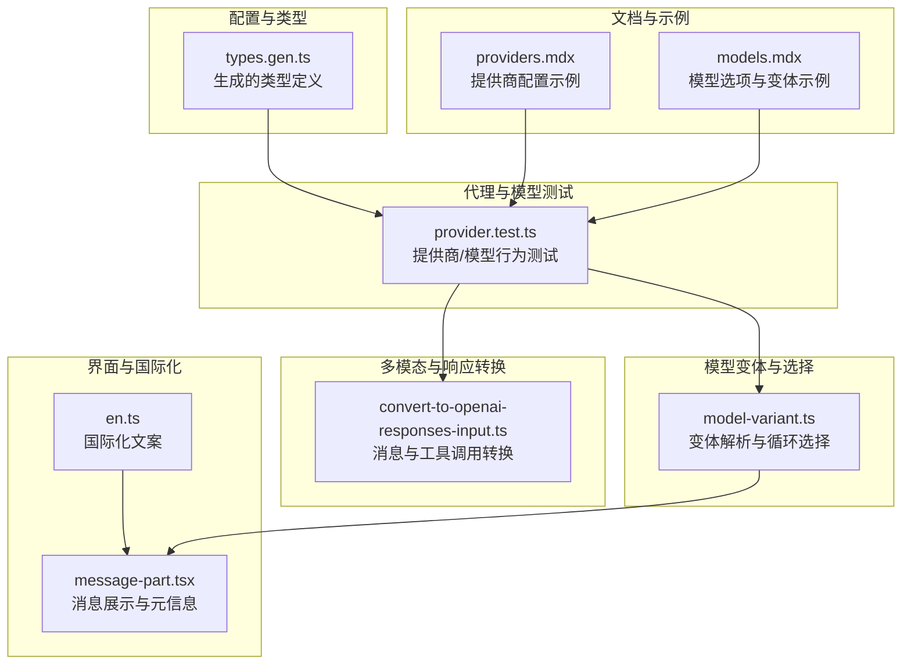
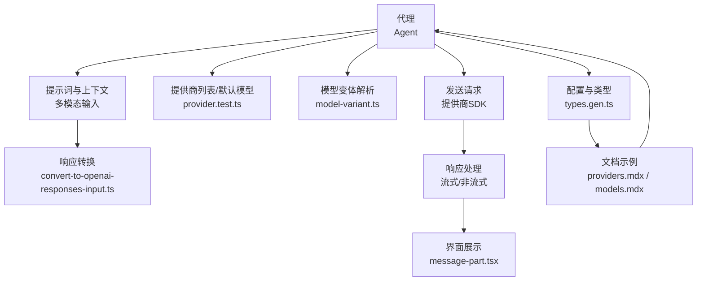
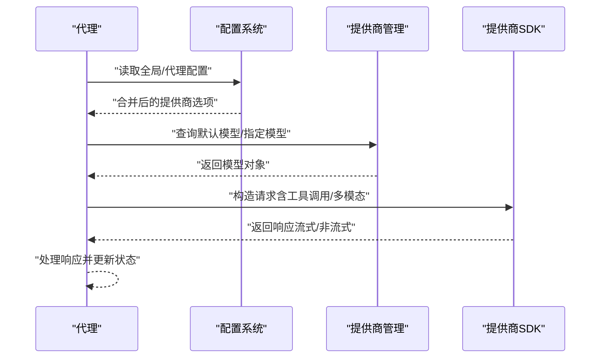
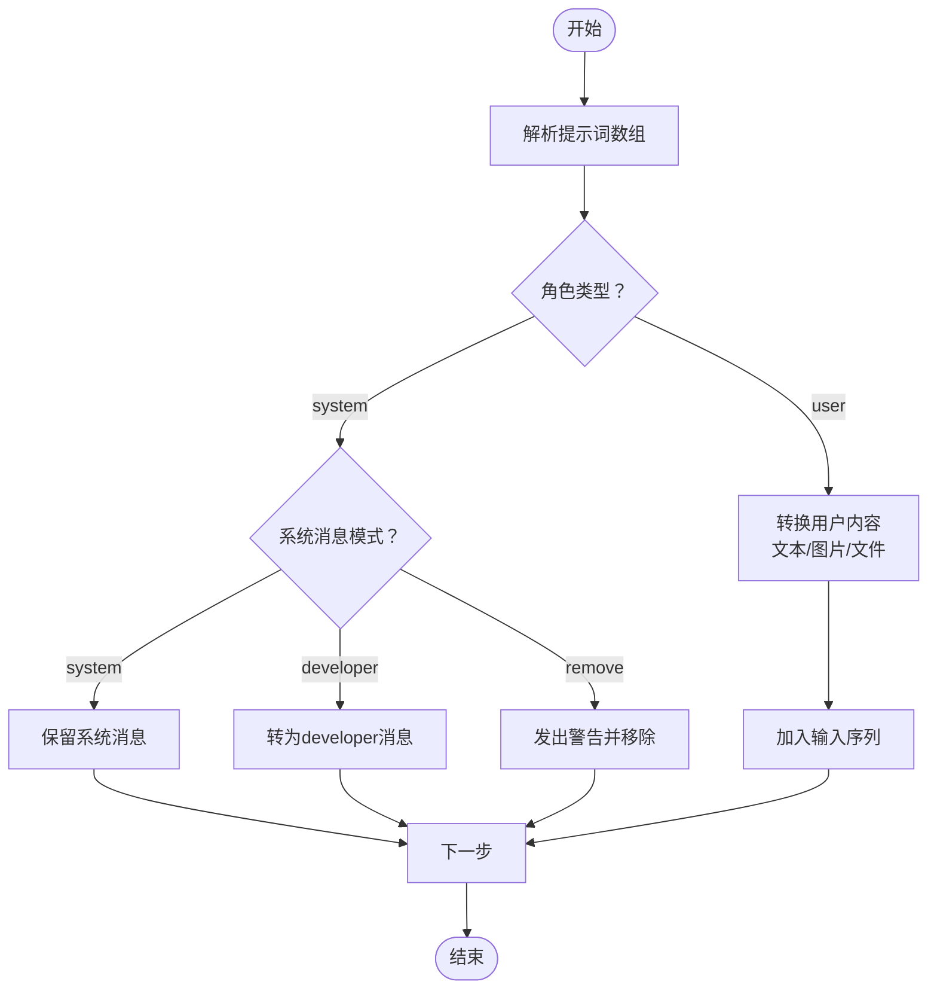
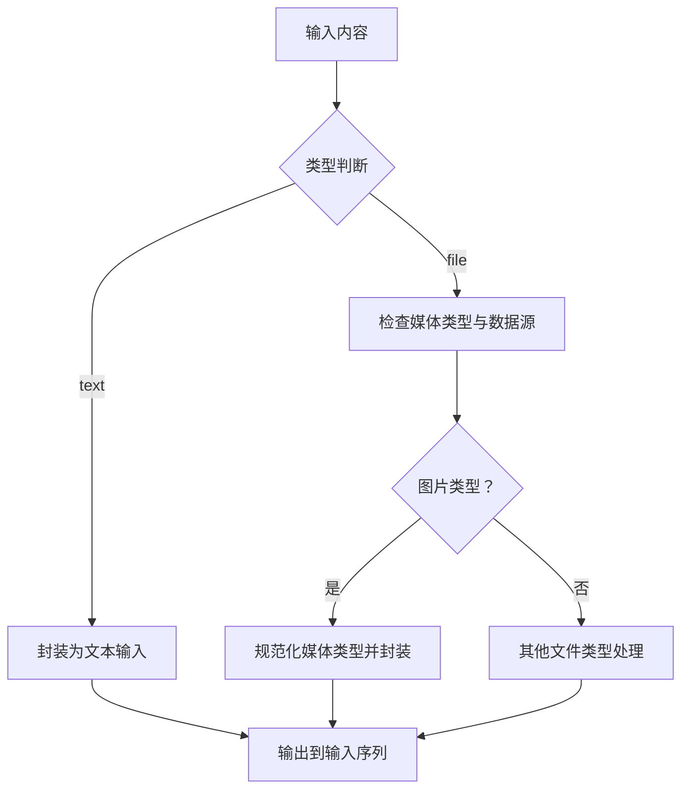
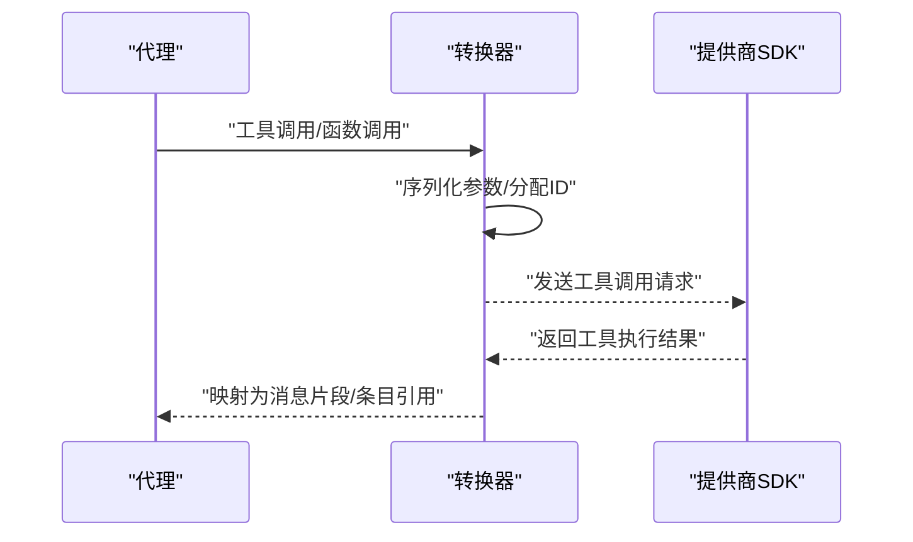
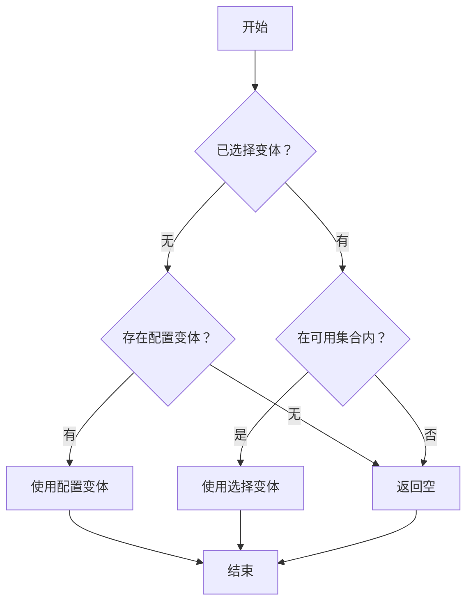
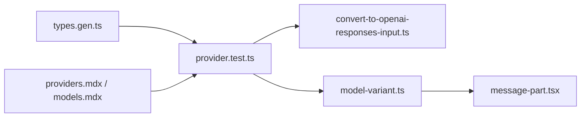

# 代理与模型集成

<cite>
**本文引用的文件**
- [README.md](file://README.md)
- [AGENTS.md](file://AGENTS.md)
- [provider.test.ts](file://packages/opencode/test/provider/provider.test.ts)
- [convert-to-openai-responses-input.ts](file://packages/opencode/src/provider/sdk/copilot/responses/convert-to-openai-responses-input.ts)
- [types.gen.ts](file://packages/sdk/js/src/gen/types.gen.ts)
- [model-variant.ts](file://packages/app/src/context/model-variant.ts)
- [providers.mdx](file://packages/web/src/content/docs/zh-tw/providers.mdx)
- [models.mdx](file://packages/web/src/content/docs/fr/models.mdx)
- [en.ts](file://packages/app/src/i18n/en.ts)
- [message-part.tsx](file://packages/ui/src/components/message-part.tsx)
</cite>

## 目录
1. [简介](#简介)
2. [项目结构](#项目结构)
3. [核心组件](#核心组件)
4. [架构总览](#架构总览)
5. [详细组件分析](#详细组件分析)
6. [依赖关系分析](#依赖关系分析)
7. [性能考量](#性能考量)
8. [故障排查指南](#故障排查指南)
9. [结论](#结论)
10. [附录](#附录)

## 简介
本文件面向“代理与模型集成”的主题，系统化阐述代理如何与不同AI模型提供商进行集成，覆盖模型选择、参数传递、结果处理、提示词模板、上下文管理、多模态数据处理、工具调用与函数调用、外部API集成、模型切换与负载均衡、错误处理策略，并提供自定义模型与工具扩展的开发指南。内容基于仓库中的配置、测试与实现文件进行归纳总结，帮助读者快速理解并扩展系统的模型与代理能力。

## 项目结构
本项目采用多包（monorepo）组织方式，与“代理与模型集成”直接相关的模块主要分布在以下位置：
- 配置与类型定义：packages/sdk/js/src/gen/types.gen.ts
- 提供商与模型测试：packages/opencode/test/provider/provider.test.ts
- 多模态与响应转换：packages/opencode/src/provider/sdk/copilot/responses/convert-to-openai-responses-input.ts
- 模型变体与选择：packages/app/src/context/model-variant.ts
- 文档与示例：packages/web/src/content/docs 下的 providers.mdx、models.mdx
- 国际化与界面展示：packages/app/src/i18n/en.ts、packages/ui/src/components/message-part.tsx
- 顶层说明与代理介绍：README.md、AGENTS.md

图表来源
- [types.gen.ts:1276-1333](file://packages/sdk/js/src/gen/types.gen.ts#L1276-L1333)
- [provider.test.ts:260-414](file://packages/opencode/test/provider/provider.test.ts#L260-L414)
- [convert-to-openai-responses-input.ts:39-81](file://packages/opencode/src/provider/sdk/copilot/responses/convert-to-openai-responses-input.ts#L39-L81)
- [model-variant.ts:21-41](file://packages/app/src/context/model-variant.ts#L21-L41)
- [providers.mdx:1890-1936](file://packages/web/src/content/docs/zh-tw/providers.mdx#L1890-L1936)
- [models.mdx:81-118](file://packages/web/src/content/docs/fr/models.mdx#L81-L118)
- [en.ts:273-298](file://packages/app/src/i18n/en.ts#L273-L298)
- [message-part.tsx:915-956](file://packages/ui/src/components/message-part.tsx#L915-L956)

章节来源
- [README.md:100-114](file://README.md#L100-L114)
- [AGENTS.md:1-129](file://AGENTS.md#L1-L129)

## 核心组件
- 配置与类型系统：通过生成的类型定义描述代理配置、提供商配置、MCP配置、格式化器与LSP等，为模型集成提供强类型约束。
- 提供商与模型管理：测试用例展示了提供商列表、默认模型、模型查询、提供商启用/禁用、自定义baseURL与请求头合并、工具调用开关等能力。
- 多模态与响应转换：将代理输入（文本、图片、文件等）转换为适配不同提供商的格式；支持工具调用与函数调用的映射。
- 模型变体与选择：提供变体解析、循环选择与配置生效逻辑，确保同一模型的不同参数组合可被正确应用。
- 文档与示例：提供多语言文档，包含提供商与模型配置示例，便于用户按需扩展。
- 界面与国际化：在消息展示中呈现代理与模型信息，配合国际化文案提升用户体验。

章节来源
- [types.gen.ts:1276-1333](file://packages/sdk/js/src/gen/types.gen.ts#L1276-L1333)
- [provider.test.ts:260-414](file://packages/opencode/test/provider/provider.test.ts#L260-L414)
- [convert-to-openai-responses-input.ts:39-81](file://packages/opencode/src/provider/sdk/copilot/responses/convert-to-openai-responses-input.ts#L39-L81)
- [model-variant.ts:21-41](file://packages/app/src/context/model-variant.ts#L21-L41)
- [providers.mdx:1890-1936](file://packages/web/src/content/docs/zh-tw/providers.mdx#L1890-L1936)
- [models.mdx:81-118](file://packages/web/src/content/docs/fr/models.mdx#L81-L118)
- [en.ts:273-298](file://packages/app/src/i18n/en.ts#L273-L298)
- [message-part.tsx:915-956](file://packages/ui/src/components/message-part.tsx#L915-L956)

## 架构总览
下图展示了从代理到模型提供商的整体流程：代理根据配置选择提供商与模型，构建提示词与上下文，进行多模态数据处理与工具调用准备，随后将请求发送至提供商SDK，接收流式或非流式的响应，并在界面层进行展示与交互。

图表来源
- [types.gen.ts:1276-1333](file://packages/sdk/js/src/gen/types.gen.ts#L1276-L1333)
- [provider.test.ts:260-414](file://packages/opencode/test/provider/provider.test.ts#L260-L414)
- [convert-to-openai-responses-input.ts:39-81](file://packages/opencode/src/provider/sdk/copilot/responses/convert-to-openai-responses-input.ts#L39-L81)
- [model-variant.ts:21-41](file://packages/app/src/context/model-variant.ts#L21-L41)
- [providers.mdx:1890-1936](file://packages/web/src/content/docs/zh-tw/providers.mdx#L1890-L1936)
- [models.mdx:81-118](file://packages/web/src/content/docs/fr/models.mdx#L81-L118)
- [message-part.tsx:915-956](file://packages/ui/src/components/message-part.tsx#L915-L956)

## 详细组件分析

### 组件A：提供商与模型管理
- 功能要点
  - 列举可用提供商并支持配置合并（如超时、分块超时、自定义请求头）。
  - 查询指定提供商下的模型，支持默认模型与显式配置优先级。
  - 支持启用/禁用提供商、自定义baseURL与npm包、工具调用开关、上下文/输出限制等。
- 关键流程
  - 配置加载与合并：读取全局与代理配置，合并提供商选项。
  - 模型解析：根据providerID与modelID获取具体模型对象。
  - 默认模型：若未显式配置，则回退到内置默认模型。
  - 工具调用控制：通过模型配置决定是否允许工具调用。
- 错误处理
  - 当提供商被显式禁用或未启用时，应避免返回该提供商。
  - 对于无效的模型ID或不匹配的提供商，应返回空或抛出明确错误以便上层处理。

图表来源
- [provider.test.ts:260-414](file://packages/opencode/test/provider/provider.test.ts#L260-L414)
- [provider.test.ts:1277-1298](file://packages/opencode/test/provider/provider.test.ts#L1277-L1298)
- [provider.test.ts:1300-1318](file://packages/opencode/test/provider/provider.test.ts#L1300-L1318)
- [provider.test.ts:1705-1734](file://packages/opencode/test/provider/provider.test.ts#L1705-L1734)

章节来源
- [provider.test.ts:260-414](file://packages/opencode/test/provider/provider.test.ts#L260-L414)
- [provider.test.ts:1277-1298](file://packages/opencode/test/provider/provider.test.ts#L1277-L1298)
- [provider.test.ts:1300-1318](file://packages/opencode/test/provider/provider.test.ts#L1300-L1318)
- [provider.test.ts:1705-1734](file://packages/opencode/test/provider/provider.test.ts#L1705-L1734)

### 组件B：提示词模板与上下文管理
- 功能要点
  - 支持系统消息模式（system/developer/remove），并根据模型要求进行适配。
  - 用户输入包含文本与多模态内容（如图片），需转换为对应提供商可识别的格式。
  - 对于不支持系统消息的模型，会发出警告并移除系统消息。
- 关键流程
  - 解析提示词数组，按角色与内容类型进行转换。
  - 多模态内容（如图片）需要设置媒体类型与数据源。
  - 警告收集与上报，确保用户了解上下文变化。

图表来源
- [convert-to-openai-responses-input.ts:39-81](file://packages/opencode/src/provider/sdk/copilot/responses/convert-to-openai-responses-input.ts#L39-L81)
- [convert-to-openai-responses-input.ts:142-176](file://packages/opencode/src/provider/sdk/copilot/responses/convert-to-openai-responses-input.ts#L142-L176)

章节来源
- [convert-to-openai-responses-input.ts:39-81](file://packages/opencode/src/provider/sdk/copilot/responses/convert-to-openai-responses-input.ts#L39-L81)
- [convert-to-openai-responses-input.ts:142-176](file://packages/opencode/src/provider/sdk/copilot/responses/convert-to-openai-responses-input.ts#L142-L176)

### 组件C：多模态数据处理
- 功能要点
  - 支持图片、PDF、文本等附件作为输入。
  - 图片媒体类型自动规范化（如通配符转具体类型）。
  - 文件数据可来自URL或二进制数据，需按提供商要求编码。
- 关键流程
  - 类型判断：text/file/image等。
  - 媒体类型与数据封装：确保符合提供商输入规范。
  - 结果映射：将工具执行结果映射为提供商可识别的条目引用或函数调用。

图表来源
- [convert-to-openai-responses-input.ts:67-81](file://packages/opencode/src/provider/sdk/copilot/responses/convert-to-openai-responses-input.ts#L67-L81)
- [convert-to-openai-responses-input.ts:142-176](file://packages/opencode/src/provider/sdk/copilot/responses/convert-to-openai-responses-input.ts#L142-L176)

章节来源
- [convert-to-openai-responses-input.ts:67-81](file://packages/opencode/src/provider/sdk/copilot/responses/convert-to-openai-responses-input.ts#L67-L81)
- [convert-to-openai-responses-input.ts:142-176](file://packages/opencode/src/provider/sdk/copilot/responses/convert-to-openai-responses-input.ts#L142-L176)

### 组件D：工具调用与函数调用
- 功能要点
  - 支持工具调用（tool-call）与函数调用（function-call）两种形式。
  - 工具执行结果可作为条目引用或直接嵌入响应。
  - 支持为工具调用分配唯一ID与项目ID，便于追踪。
- 关键流程
  - 将代理内部的工具调用转换为提供商可识别的格式。
  - 对于shell命令与函数参数，进行序列化与参数校验。
  - 结果回传时，区分本地执行与远程执行工具的结果。

图表来源
- [convert-to-openai-responses-input.ts:142-176](file://packages/opencode/src/provider/sdk/copilot/responses/convert-to-openai-responses-input.ts#L142-L176)

章节来源
- [convert-to-openai-responses-input.ts:142-176](file://packages/opencode/src/provider/sdk/copilot/responses/convert-to-openai-responses-input.ts#L142-L176)

### 组件E：模型变体与选择
- 功能要点
  - 支持为同一模型定义多种变体（如高/低推理强度、文本冗长度等）。
  - 变体解析：优先使用用户选择，其次使用配置项，最后回退到空。
  - 循环选择：在可用变体间循环切换，便于快速对比效果。
- 关键流程
  - 输入验证：确保变体名称存在于模型定义中且提供商/模型ID匹配。
  - 选择策略：空值优先级、配置优先级、默认回退。
  - 界面展示：在消息中显示所选变体，便于用户感知。

图表来源
- [model-variant.ts:21-41](file://packages/app/src/context/model-variant.ts#L21-L41)
- [message-part.tsx:915-956](file://packages/ui/src/components/message-part.tsx#L915-L956)

章节来源
- [model-variant.ts:21-41](file://packages/app/src/context/model-variant.ts#L21-L41)
- [message-part.tsx:915-956](file://packages/ui/src/components/message-part.tsx#L915-L956)

### 组件F：提供商配置与文档示例
- 功能要点
  - 支持通过配置文件定义提供商（名称、npm包、环境变量、baseURL、请求头、模型列表、上下文/输出限制等）。
  - 支持启用/禁用提供商、工具调用开关、自定义模型继承等高级特性。
  - 文档提供多语言示例，便于用户快速上手。
- 关键流程
  - 配置解析：读取配置文件并合并默认值。
  - 合并策略：用户配置覆盖默认配置，同时保留提供商特定字段。
  - 示例参考：依据文档示例进行自定义扩展。

章节来源
- [providers.mdx:1890-1936](file://packages/web/src/content/docs/zh-tw/providers.mdx#L1890-L1936)
- [models.mdx:81-118](file://packages/web/src/content/docs/fr/models.mdx#L81-L118)

## 依赖关系分析
- 类型与配置耦合：types.gen.ts定义的类型为提供商与模型配置提供约束，测试用例验证这些类型的使用场景。
- 测试驱动的行为：provider.test.ts覆盖了提供商列表、默认模型、工具调用、baseURL与请求头合并等关键路径。
- 转换器与SDK对接：convert-to-openai-responses-input.ts负责将代理输入转换为SDK可识别的格式，直接影响工具调用与多模态处理。
- 变体与界面联动：model-variant.ts与message-part.tsx共同决定变体的选择与展示。

图表来源
- [types.gen.ts:1276-1333](file://packages/sdk/js/src/gen/types.gen.ts#L1276-L1333)
- [provider.test.ts:260-414](file://packages/opencode/test/provider/provider.test.ts#L260-L414)
- [convert-to-openai-responses-input.ts:39-81](file://packages/opencode/src/provider/sdk/copilot/responses/convert-to-openai-responses-input.ts#L39-L81)
- [model-variant.ts:21-41](file://packages/app/src/context/model-variant.ts#L21-L41)
- [message-part.tsx:915-956](file://packages/ui/src/components/message-part.tsx#L915-L956)
- [providers.mdx:1890-1936](file://packages/web/src/content/docs/zh-tw/providers.mdx#L1890-L1936)
- [models.mdx:81-118](file://packages/web/src/content/docs/fr/models.mdx#L81-L118)

章节来源
- [types.gen.ts:1276-1333](file://packages/sdk/js/src/gen/types.gen.ts#L1276-L1333)
- [provider.test.ts:260-414](file://packages/opencode/test/provider/provider.test.ts#L260-L414)
- [convert-to-openai-responses-input.ts:39-81](file://packages/opencode/src/provider/sdk/copilot/responses/convert-to-openai-responses-input.ts#L39-L81)
- [model-variant.ts:21-41](file://packages/app/src/context/model-variant.ts#L21-L41)
- [message-part.tsx:915-956](file://packages/ui/src/components/message-part.tsx#L915-L956)
- [providers.mdx:1890-1936](file://packages/web/src/content/docs/zh-tw/providers.mdx#L1890-L1936)
- [models.mdx:81-118](file://packages/web/src/content/docs/fr/models.mdx#L81-L118)

## 性能考量
- 请求超时与分块超时：通过提供商选项配置整体超时与分块超时，避免长时间阻塞影响用户体验。
- 请求头合并：自定义请求头与提供商默认头共存，确保兼容性的同时减少重复请求。
- 上下文与输出限制：通过limit.context与limit.output控制令牌预算，有助于降低延迟与成本。
- 变体选择：在可用变体间循环切换时，建议缓存最近一次选择以减少频繁切换带来的开销。

## 故障排查指南
- 认证与凭据
  - 检查提供商的认证配置是否正确，可通过列出认证项确认。
  - 对于依赖环境变量的提供商，确认环境变量已正确设置。
- 自定义提供商
  - 确认提供商ID与配置文件中的ID一致。
  - 确认使用的npm包与提供商兼容（如OpenAI兼容提供商使用统一包）。
  - 校验baseURL端点地址是否正确。
- 工具调用与多模态
  - 若工具调用被禁用，确认模型配置中的工具调用开关。
  - 多模态输入需确保媒体类型与数据源正确，避免转换失败。
- 系统消息与上下文
  - 对于不支持系统消息的模型，系统会发出警告并移除系统消息，注意调整提示词结构。

章节来源
- [providers.mdx:1925-1936](file://packages/web/src/content/docs/zh-tw/providers.mdx#L1925-L1936)

## 结论
本项目通过强类型配置、完善的提供商与模型管理、灵活的提示词与上下文处理、多模态与工具调用支持，以及变体选择与界面展示，构建了可扩展、可维护的代理与模型集成体系。结合测试用例与文档示例，用户可以快速完成自定义模型与工具的集成与扩展。

## 附录
- 代理与模型概览：参见顶层说明与代理介绍。
- 开发与贡献：遵循风格指南与测试要求，确保新增功能通过测试覆盖。

章节来源
- [README.md:100-114](file://README.md#L100-L114)
- [AGENTS.md:1-129](file://AGENTS.md#L1-L129)