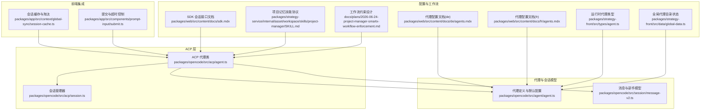
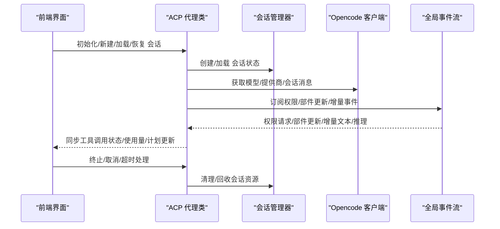
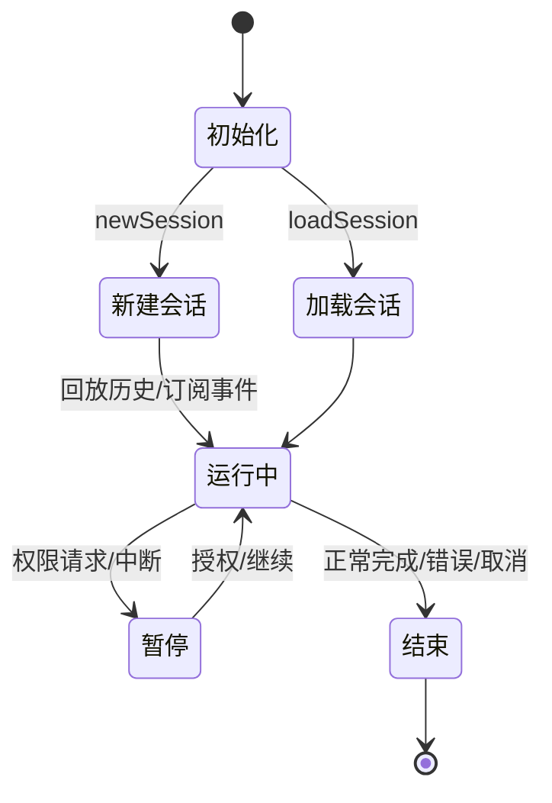
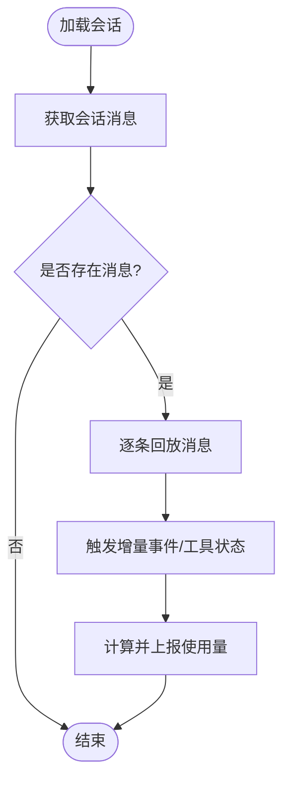
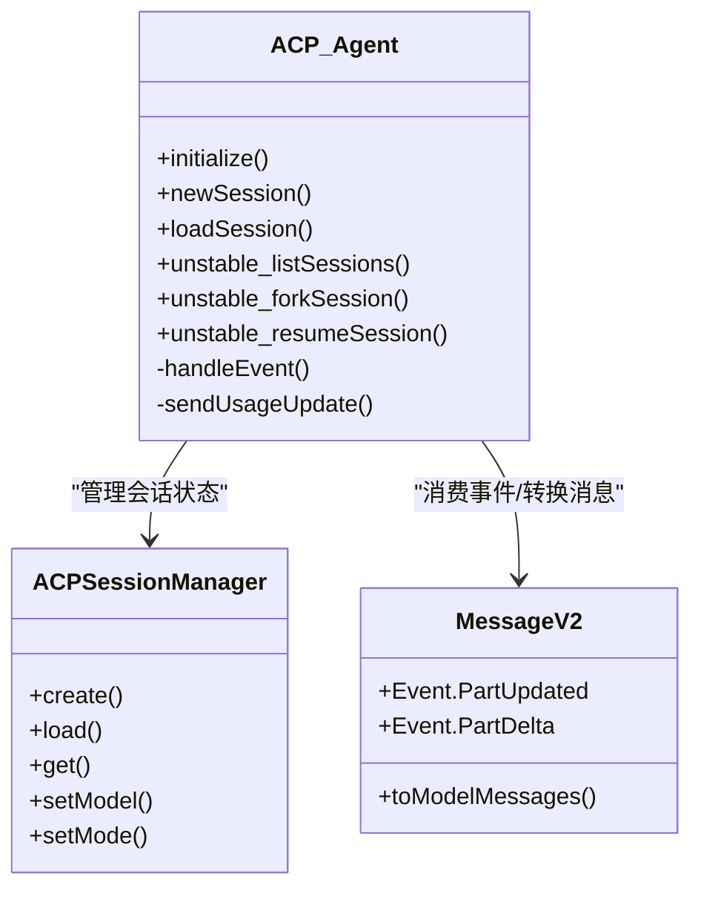
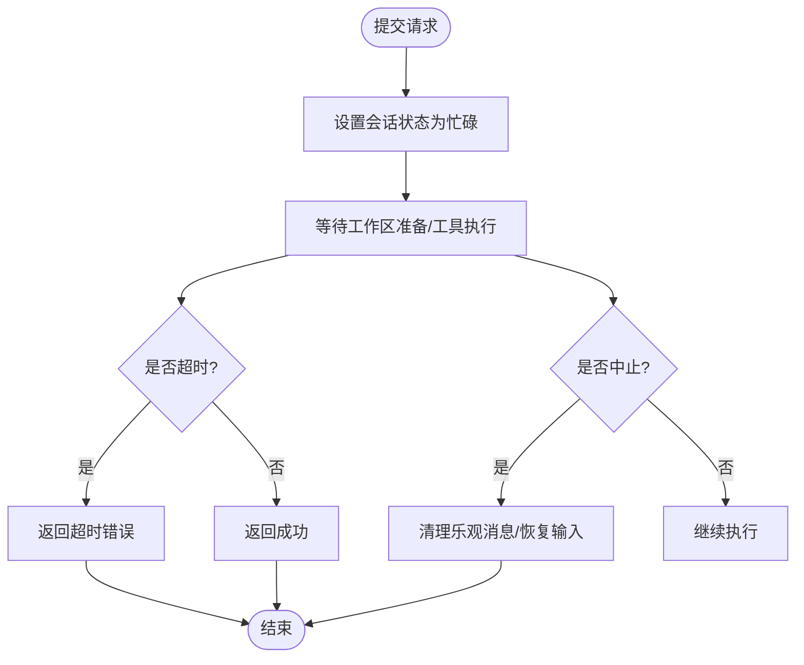
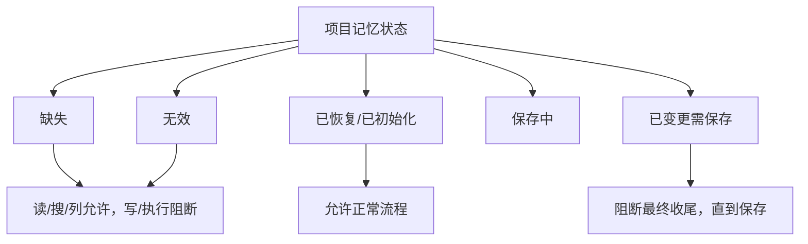
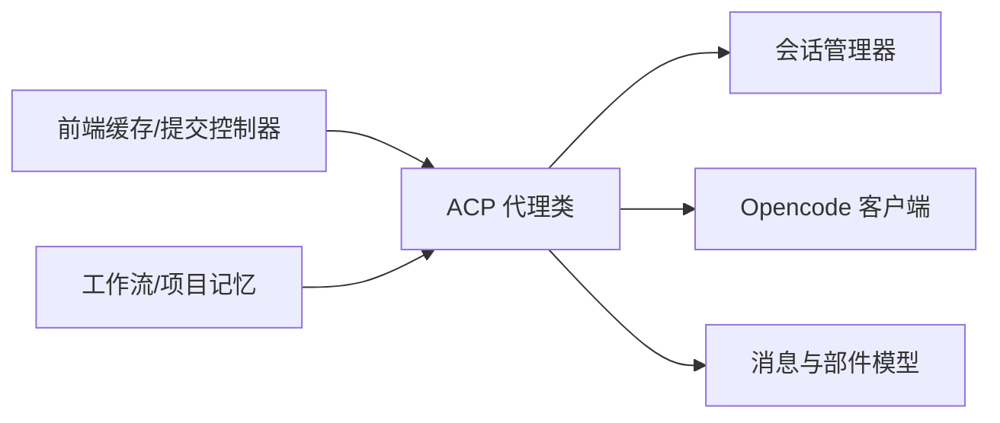

# 代理生命周期管理

<cite>
**本文引用的文件**
- [packages/opencode/src/acp/agent.ts](file://packages/opencode/src/acp/agent.ts)
- [packages/opencode/src/acp/session.ts](file://packages/opencode/src/acp/session.ts)
- [packages/opencode/src/agent/agent.ts](file://packages/opencode/src/agent/agent.ts)
- [packages/opencode/src/session/message-v2.ts](file://packages/opencode/src/session/message-v2.ts)
- [packages/app/src/context/global-sync/session-cache.ts](file://packages/app/src/context/global-sync/session-cache.ts)
- [packages/app/src/components/prompt-input/submit.ts](file://packages/app/src/components/prompt-input/submit.ts)
- [packages/web/src/content/docs/sdk.mdx](file://packages/web/src/content/docs/sdk.mdx)
- [packages/web/src/content/docs/de/agents.mdx](file://packages/web/src/content/docs/de/agents.mdx)
- [packages/web/src/content/docs/fr/agents.mdx](file://packages/web/src/content/docs/fr/agents.mdx)
- [packages/strategy-front/src/types/agent.ts](file://packages/strategy-front/src/types/agent.ts)
- [packages/strategy-front/src/data/global-data.ts](file://packages/strategy-front/src/data/global-data.ts)
- [packages/strategy-service/internal/asset/workspace/skills/project-manager/SKILL.md](file://packages/strategy-service/internal/asset/workspace/skills/project-manager/SKILL.md)
- [docs/plans/2026-06-24-project-manager-smartx-workflow-enforcement.md](file://docs/plans/2026-06-24-project-manager-smartx-workflow-enforcement.md)
</cite>

## 目录
1. [简介](#简介)
2. [项目结构](#项目结构)
3. [核心组件](#核心组件)
4. [架构总览](#架构总览)
5. [详细组件分析](#详细组件分析)
6. [依赖关系分析](#依赖关系分析)
7. [性能考量](#性能考量)
8. [故障排查指南](#故障排查指南)
9. [结论](#结论)
10. [附录](#附录)

## 简介
本文件系统性阐述代理生命周期管理：从创建、初始化、运行、暂停/恢复到销毁的全链路状态转换；代理状态管理机制、持久化策略与内存管理；代理与会话系统的集成、状态同步与数据共享；启动配置、运行时监控与异常处理策略，并给出最佳实践与性能优化建议。内容基于仓库中的 ACP 代理实现、会话消息模型、前端全局缓存与工作流约束等关键模块进行归纳与可视化。

## 项目结构
围绕代理生命周期的关键模块分布如下：
- ACP 代理与会话管理：负责代理实例创建、会话加载/恢复、事件订阅与工具调用状态同步
- 代理定义与默认配置：集中管理内置与用户自定义代理的元信息、权限与模式
- 会话消息模型：统一消息与部件的数据结构、错误类型与增量更新事件
- 前端会话缓存：限制与淘汰策略，保障 UI 性能与内存占用
- 启动配置与文档：提供步骤上限、禁用开关、提示词等配置入口
- 工作流与项目记忆：通过 MCP 工具协议确保项目上下文的恢复/保存/校验

**图表来源**
- [packages/opencode/src/acp/agent.ts:126-156](file://packages/opencode/src/acp/agent.ts#L126-L156)
- [packages/opencode/src/acp/session.ts:8-44](file://packages/opencode/src/acp/session.ts#L8-L44)
- [packages/opencode/src/agent/agent.ts:24-252](file://packages/opencode/src/agent/agent.ts#L24-L252)
- [packages/opencode/src/session/message-v2.ts:20-495](file://packages/opencode/src/session/message-v2.ts#L20-L495)
- [packages/app/src/context/global-sync/session-cache.ts:11-62](file://packages/app/src/context/global-sync/session-cache.ts#L11-L62)
- [packages/app/src/components/prompt-input/submit.ts:502-541](file://packages/app/src/components/prompt-input/submit.ts#L502-L541)
- [packages/web/src/content/docs/sdk.mdx:308-311](file://packages/web/src/content/docs/sdk.mdx#L308-L311)
- [packages/web/src/content/docs/de/agents.mdx:273-325](file://packages/web/src/content/docs/de/agents.mdx#L273-L325)
- [packages/web/src/content/docs/fr/agents.mdx:287-339](file://packages/web/src/content/docs/fr/agents.mdx#L287-L339)
- [packages/strategy-front/src/types/agent.ts:3-48](file://packages/strategy-front/src/types/agent.ts#L3-L48)
- [packages/strategy-front/src/data/global-data.ts:118-181](file://packages/strategy-front/src/data/global-data.ts#L118-L181)
- [packages/strategy-service/internal/asset/workspace/skills/project-manager/SKILL.md:1-61](file://packages/strategy-service/internal/asset/workspace/skills/project-manager/SKILL.md#L1-L61)
- [docs/plans/2026-06-24-project-manager-smartx-workflow-enforcement.md:26-119](file://docs/plans/2026-06-24-project-manager-smartx-workflow-enforcement.md#L26-L119)

**章节来源**
- [packages/opencode/src/acp/agent.ts:126-156](file://packages/opencode/src/acp/agent.ts#L126-L156)
- [packages/opencode/src/acp/session.ts:8-44](file://packages/opencode/src/acp/session.ts#L8-L44)
- [packages/opencode/src/agent/agent.ts:24-252](file://packages/opencode/src/agent/agent.ts#L24-L252)
- [packages/opencode/src/session/message-v2.ts:20-495](file://packages/opencode/src/session/message-v2.ts#L20-L495)
- [packages/app/src/context/global-sync/session-cache.ts:11-62](file://packages/app/src/context/global-sync/session-cache.ts#L11-L62)
- [packages/app/src/components/prompt-input/submit.ts:502-541](file://packages/app/src/components/prompt-input/submit.ts#L502-L541)
- [packages/web/src/content/docs/sdk.mdx:308-311](file://packages/web/src/content/docs/sdk.mdx#L308-L311)
- [packages/web/src/content/docs/de/agents.mdx:273-325](file://packages/web/src/content/docs/de/agents.mdx#L273-L325)
- [packages/web/src/content/docs/fr/agents.mdx:287-339](file://packages/web/src/content/docs/fr/agents.mdx#L287-L339)
- [packages/strategy-front/src/types/agent.ts:3-48](file://packages/strategy-front/src/types/agent.ts#L3-L48)
- [packages/strategy-front/src/data/global-data.ts:118-181](file://packages/strategy-front/src/data/global-data.ts#L118-L181)
- [packages/strategy-service/internal/asset/workspace/skills/project-manager/SKILL.md:1-61](file://packages/strategy-service/internal/asset/workspace/skills/project-manager/SKILL.md#L1-L61)
- [docs/plans/2026-06-24-project-manager-smartx-workflow-enforcement.md:26-119](file://docs/plans/2026-06-24-project-manager-smartx-workflow-enforcement.md#L26-L119)

## 核心组件
- ACP 代理类：封装代理生命周期方法（初始化、新建会话、加载会话、列出/克隆/恢复会话）、事件订阅与权限请求处理、工具调用状态同步与使用量上报
- 会话管理器：维护会话状态（ID、工作目录、MCP 服务器、模型与变体、创建时间），支持创建/加载、查询/设置模型与模式
- 代理定义：集中管理内置代理（如 build、plan、general、explore、compaction、title、summary）与用户自定义代理，合并权限规则与配置项
- 消息与部件模型：定义消息角色、部件类型（文本、推理、文件、工具、子任务、重试、压缩、快照、补丁、代理、步骤开始/结束等），并提供增量事件与错误类型
- 前端会话缓存：按会话维度缓存消息、部件、差异、待办、权限与问题请求，提供容量限制与淘汰策略
- 启动配置与文档：提供 steps 限制、禁用开关、自定义提示词等配置入口
- 工作流与项目记忆：通过 MCP 工具协议确保项目上下文的恢复/保存/校验，形成“恢复/保存”闭环

**章节来源**
- [packages/opencode/src/acp/agent.ts:134-156](file://packages/opencode/src/acp/agent.ts#L134-L156)
- [packages/opencode/src/acp/session.ts:8-116](file://packages/opencode/src/acp/session.ts#L8-L116)
- [packages/opencode/src/agent/agent.ts:24-252](file://packages/opencode/src/agent/agent.ts#L24-L252)
- [packages/opencode/src/session/message-v2.ts:20-495](file://packages/opencode/src/session/message-v2.ts#L20-L495)
- [packages/app/src/context/global-sync/session-cache.ts:11-62](file://packages/app/src/context/global-sync/session-cache.ts#L11-L62)
- [packages/web/src/content/docs/de/agents.mdx:273-325](file://packages/web/src/content/docs/de/agents.mdx#L273-L325)
- [packages/web/src/content/docs/fr/agents.mdx:287-339](file://packages/web/src/content/docs/fr/agents.mdx#L287-L339)
- [packages/strategy-service/internal/asset/workspace/skills/project-manager/SKILL.md:1-61](file://packages/strategy-service/internal/asset/workspace/skills/project-manager/SKILL.md#L1-L61)

## 架构总览
下图展示代理生命周期在 ACP 与会话层的交互路径，以及与前端缓存、工作流约束的关系：

**图表来源**
- [packages/opencode/src/acp/agent.ts:158-182](file://packages/opencode/src/acp/agent.ts#L158-L182)
- [packages/opencode/src/acp/agent.ts:520-667](file://packages/opencode/src/acp/agent.ts#L520-L667)
- [packages/opencode/src/acp/session.ts:20-75](file://packages/opencode/src/acp/session.ts#L20-L75)
- [packages/app/src/context/global-sync/session-cache.ts:23-41](file://packages/app/src/context/global-sync/session-cache.ts#L23-L41)

**章节来源**
- [packages/opencode/src/acp/agent.ts:158-182](file://packages/opencode/src/acp/agent.ts#L158-L182)
- [packages/opencode/src/acp/agent.ts:520-667](file://packages/opencode/src/acp/agent.ts#L520-L667)
- [packages/opencode/src/acp/session.ts:20-75](file://packages/opencode/src/acp/session.ts#L20-L75)
- [packages/app/src/context/global-sync/session-cache.ts:23-41](file://packages/app/src/context/global-sync/session-cache.ts#L23-L41)

## 详细组件分析

### ACP 代理生命周期与状态转换
- 创建阶段：newSession 创建会话并存储 ACP 会话状态，随后加载可用模型与模式选项
- 初始化阶段：initialize 返回代理能力与认证方法，支持终端认证能力
- 运行阶段：loadSession 加载历史消息并回放，发送增量文本/推理块与工具调用更新；unstable_listSessions/unstable_forkSession/unstable_resumeSession 支持列表、克隆与恢复
- 暂停/恢复：通过事件订阅与权限队列处理中断与恢复；前端提交控制器支持中止与清理
- 销毁阶段：事件订阅通过 AbortController 控制；会话管理器提供 get/tryGet/setModel/setMode 等操作，便于资源回收

**图表来源**
- [packages/opencode/src/acp/agent.ts:520-667](file://packages/opencode/src/acp/agent.ts#L520-L667)
- [packages/opencode/src/acp/agent.ts:158-182](file://packages/opencode/src/acp/agent.ts#L158-L182)
- [packages/app/src/components/prompt-input/submit.ts:505-541](file://packages/app/src/components/prompt-input/submit.ts#L505-L541)

**章节来源**
- [packages/opencode/src/acp/agent.ts:520-667](file://packages/opencode/src/acp/agent.ts#L520-L667)
- [packages/opencode/src/acp/agent.ts:158-182](file://packages/opencode/src/acp/agent.ts#L158-L182)
- [packages/app/src/components/prompt-input/submit.ts:505-541](file://packages/app/src/components/prompt-input/submit.ts#L505-L541)

### 会话状态管理与持久化
- 会话状态存储：会话管理器将会话 ID、工作目录、MCP 服务器、模型与变体、创建时间等写入内存映射，供代理读取与更新
- 历史回放：加载会话时拉取消息并逐条回放，触发增量事件与工具状态同步
- 使用量上报：根据最后一条助手消息的令牌与成本，向连接端发送使用更新
- 前端缓存：按会话维度缓存消息、部件、差异、待办、权限与问题请求，超过阈值时执行淘汰

**图表来源**
- [packages/opencode/src/acp/agent.ts:604-667](file://packages/opencode/src/acp/agent.ts#L604-L667)
- [packages/opencode/src/acp/agent.ts:76-124](file://packages/opencode/src/acp/agent.ts#L76-L124)
- [packages/opencode/src/acp/session.ts:46-75](file://packages/opencode/src/acp/session.ts#L46-L75)
- [packages/app/src/context/global-sync/session-cache.ts:11-62](file://packages/app/src/context/global-sync/session-cache.ts#L11-L62)

**章节来源**
- [packages/opencode/src/acp/agent.ts:604-667](file://packages/opencode/src/acp/agent.ts#L604-L667)
- [packages/opencode/src/acp/agent.ts:76-124](file://packages/opencode/src/acp/agent.ts#L76-L124)
- [packages/opencode/src/acp/session.ts:46-75](file://packages/opencode/src/acp/session.ts#L46-L75)
- [packages/app/src/context/global-sync/session-cache.ts:11-62](file://packages/app/src/context/global-sync/session-cache.ts#L11-L62)

### 代理与会话系统的集成、状态同步与数据共享
- 集成点：ACP 代理通过 SDK 访问会话、消息与部件，同时订阅全局事件以获得权限请求与部件更新
- 状态同步：消息增量事件（文本/推理/部件）与工具调用状态（pending/running/completed/error）实时同步至连接端
- 数据共享：消息与部件模型统一了数据结构，支持不同模型与提供商之间的互操作；媒体附件在不支持的提供商上被注入为用户消息

**图表来源**
- [packages/opencode/src/acp/agent.ts:134-156](file://packages/opencode/src/acp/agent.ts#L134-L156)
- [packages/opencode/src/acp/session.ts:8-116](file://packages/opencode/src/acp/session.ts#L8-L116)
- [packages/opencode/src/session/message-v2.ts:451-495](file://packages/opencode/src/session/message-v2.ts#L451-L495)

**章节来源**
- [packages/opencode/src/acp/agent.ts:134-156](file://packages/opencode/src/acp/agent.ts#L134-L156)
- [packages/opencode/src/acp/session.ts:8-116](file://packages/opencode/src/acp/session.ts#L8-L116)
- [packages/opencode/src/session/message-v2.ts:451-495](file://packages/opencode/src/session/message-v2.ts#L451-L495)

### 启动配置、运行时监控与异常处理
- 启动配置：支持 steps 限制（达到上限后触发特殊系统提示）、禁用开关、自定义提示词等
- 运行时监控：前端提交控制器设置超时与中止信号，UI 根据会话状态切换忙碌/空闲
- 异常处理：消息模型定义多种错误类型（鉴权、API、上下文溢出、输出长度、结构化输出、中止），ACP 代理捕获并转换为请求错误或抛出

**图表来源**
- [packages/app/src/components/prompt-input/submit.ts:502-541](file://packages/app/src/components/prompt-input/submit.ts#L502-L541)
- [packages/web/src/content/docs/de/agents.mdx:273-325](file://packages/web/src/content/docs/de/agents.mdx#L273-L325)
- [packages/web/src/content/docs/fr/agents.mdx:287-339](file://packages/web/src/content/docs/fr/agents.mdx#L287-L339)
- [packages/opencode/src/session/message-v2.ts:20-56](file://packages/opencode/src/session/message-v2.ts#L20-L56)

**章节来源**
- [packages/app/src/components/prompt-input/submit.ts:502-541](file://packages/app/src/components/prompt-input/submit.ts#L502-L541)
- [packages/web/src/content/docs/de/agents.mdx:273-325](file://packages/web/src/content/docs/de/agents.mdx#L273-L325)
- [packages/web/src/content/docs/fr/agents.mdx:287-339](file://packages/web/src/content/docs/fr/agents.mdx#L287-L339)
- [packages/opencode/src/session/message-v2.ts:20-56](file://packages/opencode/src/session/message-v2.ts#L20-L56)

### 代理状态管理机制与内存管理
- 内存管理：会话管理器以内存映射存储会话状态；前端会话缓存采用容量限制与淘汰策略，避免无界增长
- 状态一致性：事件驱动的消息增量与工具状态更新保证 UI 与后端一致；权限队列串行处理，避免竞态
- 资源回收：事件订阅通过 AbortController 控制；会话结束时清理映射与缓存

**章节来源**
- [packages/opencode/src/acp/session.ts:8-116](file://packages/opencode/src/acp/session.ts#L8-L116)
- [packages/app/src/context/global-sync/session-cache.ts:11-62](file://packages/app/src/context/global-sync/session-cache.ts#L11-L62)
- [packages/opencode/src/acp/agent.ts:158-182](file://packages/opencode/src/acp/agent.ts#L158-L182)

### 代理与工作流/项目记忆的集成
- 项目记忆协议：通过 MCP 工具确保“恢复/保存”链路可验证，避免仅凭提示词约定导致的绕过
- 工作流约束：将项目记忆状态与工作区基线状态分离，形成三轴约束（会话顺序、工作区基线、项目记忆）

**图表来源**
- [packages/strategy-service/internal/asset/workspace/skills/project-manager/SKILL.md:1-61](file://packages/strategy-service/internal/asset/workspace/skills/project-manager/SKILL.md#L1-L61)
- [docs/plans/2026-06-24-project-manager-smartx-workflow-enforcement.md:75-104](file://docs/plans/2026-06-24-project-manager-smartx-workflow-enforcement.md#L75-L104)

**章节来源**
- [packages/strategy-service/internal/asset/workspace/skills/project-manager/SKILL.md:1-61](file://packages/strategy-service/internal/asset/workspace/skills/project-manager/SKILL.md#L1-L61)
- [docs/plans/2026-06-24-project-manager-smartx-workflow-enforcement.md:75-104](file://docs/plans/2026-06-24-project-manager-smartx-workflow-enforcement.md#L75-L104)

## 依赖关系分析
- 组件耦合：ACP 代理强依赖会话管理器与 SDK；消息模型为事件与状态同步提供统一契约
- 外部依赖：SDK 提供会话、消息、部件与事件访问；前端缓存与 UI 控制器参与运行时监控
- 循环依赖：当前实现未见循环依赖迹象

**图表来源**
- [packages/opencode/src/acp/agent.ts:134-156](file://packages/opencode/src/acp/agent.ts#L134-L156)
- [packages/opencode/src/acp/session.ts:8-116](file://packages/opencode/src/acp/session.ts#L8-L116)
- [packages/opencode/src/session/message-v2.ts:451-495](file://packages/opencode/src/session/message-v2.ts#L451-L495)
- [packages/app/src/context/global-sync/session-cache.ts:11-62](file://packages/app/src/context/global-sync/session-cache.ts#L11-L62)
- [packages/strategy-service/internal/asset/workspace/skills/project-manager/SKILL.md:1-61](file://packages/strategy-service/internal/asset/workspace/skills/project-manager/SKILL.md#L1-L61)

**章节来源**
- [packages/opencode/src/acp/agent.ts:134-156](file://packages/opencode/src/acp/agent.ts#L134-L156)
- [packages/opencode/src/acp/session.ts:8-116](file://packages/opencode/src/acp/session.ts#L8-L116)
- [packages/opencode/src/session/message-v2.ts:451-495](file://packages/opencode/src/session/message-v2.ts#L451-L495)
- [packages/app/src/context/global-sync/session-cache.ts:11-62](file://packages/app/src/context/global-sync/session-cache.ts#L11-L62)
- [packages/strategy-service/internal/asset/workspace/skills/project-manager/SKILL.md:1-61](file://packages/strategy-service/internal/asset/workspace/skills/project-manager/SKILL.md#L1-L61)

## 性能考量
- 事件驱动的增量更新：通过消息增量事件减少全量渲染开销
- 会话缓存容量限制：避免内存膨胀，结合淘汰策略保持 UI 流畅
- 工具调用状态去抖：对 bash 输出进行快照哈希对比，避免重复上报
- 使用量上报：仅在必要时计算上下文大小与累计成本，降低计算负担

[本节为通用指导，无需具体文件分析]

## 故障排查指南
- 鉴权失败：ACP 代理在加载会话时将特定错误转换为认证所需错误，前端应引导用户登录
- 上下文溢出：消息模型定义了上下文溢出错误，需缩短上下文或调整分段策略
- 中止与超时：前端提交控制器提供中止与超时处理，确保资源及时回收
- 权限请求堆积：权限队列串行处理，若长时间无响应，检查客户端授权流程

**章节来源**
- [packages/opencode/src/acp/agent.ts:593-602](file://packages/opencode/src/acp/agent.ts#L593-L602)
- [packages/opencode/src/session/message-v2.ts:20-56](file://packages/opencode/src/session/message-v2.ts#L20-L56)
- [packages/app/src/components/prompt-input/submit.ts:505-541](file://packages/app/src/components/prompt-input/submit.ts#L505-L541)

## 结论
该代理生命周期管理方案以 ACP 代理为核心，结合会话管理器、消息模型与前端缓存，实现了从创建到销毁的全链路可观测与可控。通过事件驱动的状态同步、严格的权限队列与容量受限的缓存策略，既保证了运行时性能，也确保了状态一致性与安全性。工作流与项目记忆协议进一步强化了持续任务的上下文完整性与可验证性。

[本节为总结，无需具体文件分析]

## 附录
- SDK 会话接口：提供会话更新、初始化、中止与分享等能力
- 代理配置参考：steps 限制、禁用开关、自定义提示词等

**章节来源**
- [packages/web/src/content/docs/sdk.mdx:308-311](file://packages/web/src/content/docs/sdk.mdx#L308-L311)
- [packages/web/src/content/docs/de/agents.mdx:273-325](file://packages/web/src/content/docs/de/agents.mdx#L273-L325)
- [packages/web/src/content/docs/fr/agents.mdx:287-339](file://packages/web/src/content/docs/fr/agents.mdx#L287-L339)