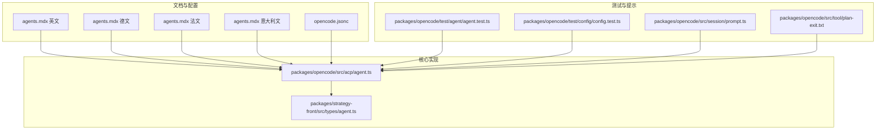
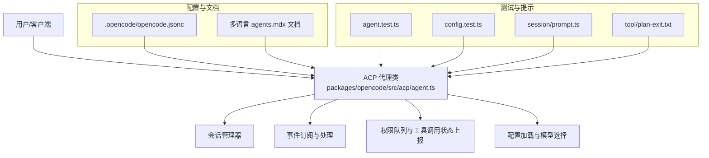
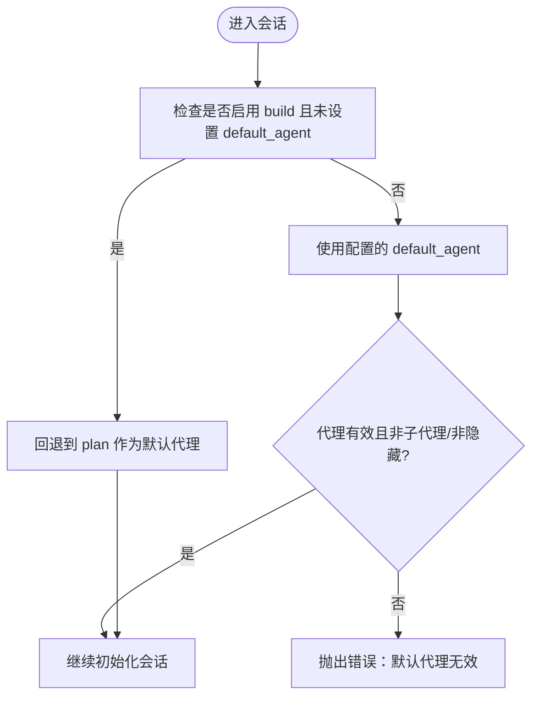
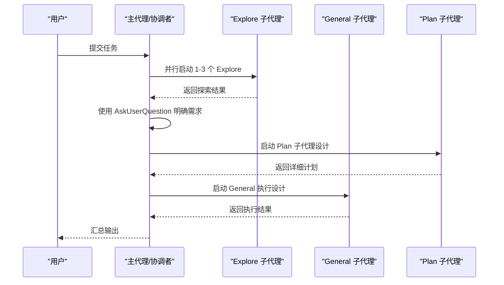
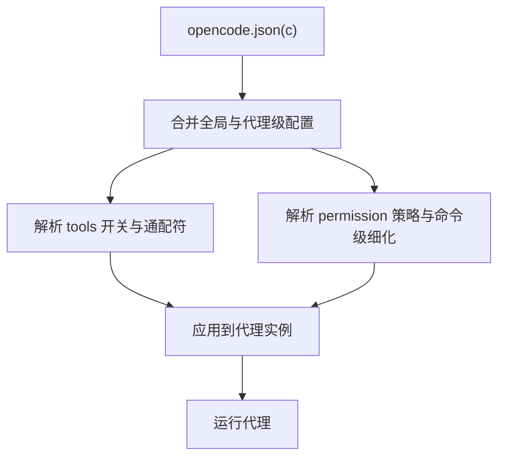
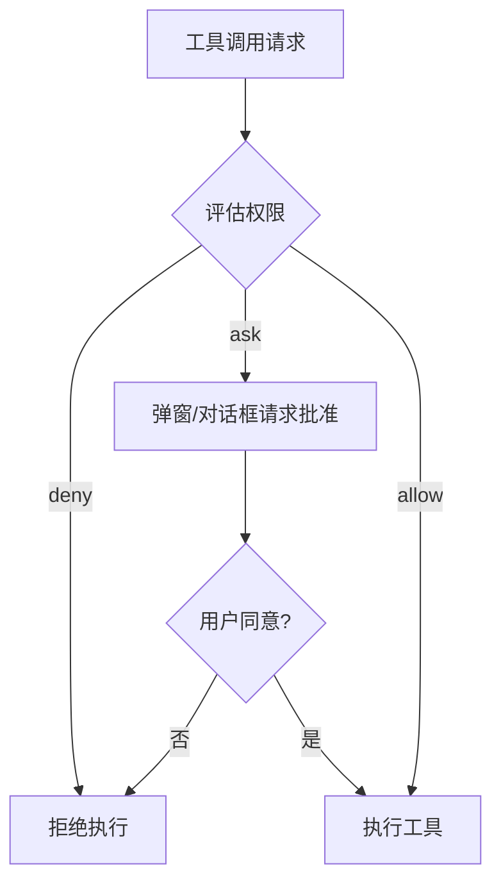
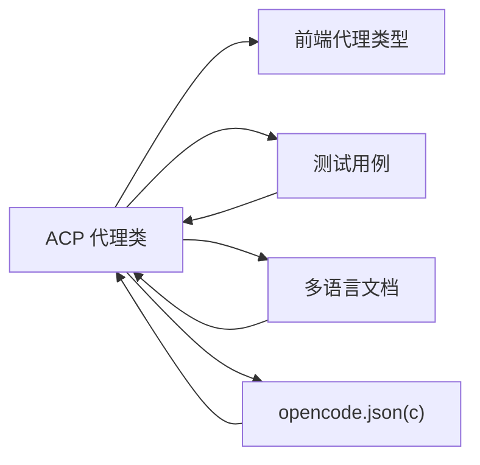

# 代理类型与分类

<cite>
**本文引用的文件**
- [README.md](file://README.md)
- [AGENTS.md](file://AGENTS.md)
- [opencode.jsonc](file://.opencode/opencode.jsonc)
- [agent.ts](file://packages/opencode/src/acp/agent.ts)
- [agent.ts（前端类型）](file://packages/strategy-front/src/types/agent.ts)
- [agent.test.ts](file://packages/opencode/test/agent/agent.test.ts)
- [config.test.ts](file://packages/opencode/test/config/config.test.ts)
- [prompt.ts](file://packages/opencode/src/session/prompt.ts)
- [plan-exit.txt](file://packages/opencode/src/tool/plan-exit.txt)
- [agents.mdx（英文）](file://packages/web/src/content/docs/agents.mdx)
- [agents.mdx（德文）](file://packages/web/src/content/docs/de/agents.mdx)
- [agents.mdx（法文）](file://packages/web/src/content/docs/fr/agents.mdx)
- [agents.mdx（意大利文）](file://packages/web/src/content/docs/it/agents.mdx)
- [agents.mdx（波斯语）](file://packages/web/src/content/docs/fa/agents.mdx)
- [agents.mdx（土耳其语）](file://packages/web/src/content/docs/tr/agents.mdx)
- [config.mdx（土耳其语）](file://packages/web/src/content/docs/tr/config.mdx)
</cite>

## 目录
1. [简介](#简介)
2. [项目结构](#项目结构)
3. [核心组件](#核心组件)
4. [架构总览](#架构总览)
5. [详细组件分析](#详细组件分析)
6. [依赖分析](#依赖分析)
7. [性能考虑](#性能考虑)
8. [故障排查指南](#故障排查指南)
9. [结论](#结论)
10. [附录](#附录)

## 简介
本文件系统性梳理 OpenCode 中的“代理类型与分类”，覆盖内置主代理（Build、Plan）、子代理（General、Explore 等）以及自定义代理的配置与协作模式。内容基于仓库内官方文档、测试用例与核心实现源码，帮助用户理解各代理的设计目标、工作原理、权限与工具控制、配置 schema、使用限制与最佳实践，并提供代理选择与组合使用的指导。

## 项目结构
围绕代理主题的关键位置与文件如下：
- 官方文档：多语言 agents 文档，涵盖代理类型、工具与权限配置示例
- 核心实现：ACP 代理类负责会话管理、事件订阅、工具调用状态上报与权限请求
- 配置样例：全局与项目级 opencode.json(c) 的 agent 段落
- 测试用例：验证默认代理、权限合并、禁用代理、步骤配置等行为
- 会话提示：指导在不同阶段如何使用 Explore/General/Plan 等代理

**图表来源**
- [agents.mdx（英文）:1-746](file://packages/web/src/content/docs/agents.mdx#L1-L746)
- [agents.mdx（德文）:31-68](file://packages/web/src/content/docs/de/agents.mdx#L31-L68)
- [agents.mdx（法文）:331-426](file://packages/web/src/content/docs/fr/agents.mdx#L331-L426)
- [agents.mdx（意大利文）:401-467](file://packages/web/src/content/docs/it/agents.mdx#L401-L467)
- [opencode.jsonc:1-19](file://.opencode/opencode.jsonc#L1-L19)
- [agent.ts:1-800](file://packages/opencode/src/acp/agent.ts#L1-L800)
- [agent.ts（前端类型）:1-48](file://packages/strategy-front/src/types/agent.ts#L1-L48)
- [agent.test.ts:146-247](file://packages/opencode/test/agent/agent.test.ts#L146-L247)
- [config.test.ts:364-393](file://packages/opencode/test/config/config.test.ts#L364-L393)
- [prompt.ts:1406-1426](file://packages/opencode/src/session/prompt.ts#L1406-L1426)
- [plan-exit.txt:1-13](file://packages/opencode/src/tool/plan-exit.txt#L1-L13)

**章节来源**
- [README.md:100-114](file://README.md#L100-L114)
- [AGENTS.md:1-129](file://AGENTS.md#L1-L129)
- [opencode.jsonc:1-19](file://.opencode/opencode.jsonc#L1-L19)
- [agent.ts:1-800](file://packages/opencode/src/acp/agent.ts#L1-L800)
- [agent.ts（前端类型）:1-48](file://packages/strategy-front/src/types/agent.ts#L1-L48)
- [agent.test.ts:146-247](file://packages/opencode/test/agent/agent.test.ts#L146-L247)
- [config.test.ts:364-393](file://packages/opencode/test/config/config.test.ts#L364-L393)
- [prompt.ts:1406-1426](file://packages/opencode/src/session/prompt.ts#L1406-L1426)
- [plan-exit.txt:1-13](file://packages/opencode/src/tool/plan-exit.txt#L1-L13)
- [agents.mdx（英文）:1-746](file://packages/web/src/content/docs/agents.mdx#L1-L746)
- [agents.mdx（德文）:31-68](file://packages/web/src/content/docs/de/agents.mdx#L31-L68)
- [agents.mdx（法文）:331-426](file://packages/web/src/content/docs/fr/agents.mdx#L331-L426)
- [agents.mdx（意大利文）:401-467](file://packages/web/src/content/docs/it/agents.mdx#L401-L467)

## 核心组件
- 主代理（Primary Agents）
  - Build：默认全量工具可用，适合开发实现
  - Plan：受限代理，禁止文件编辑，默认询问运行 bash 命令，适合分析与规划
- 子代理（Subagents）
  - General：通用搜索与多步任务，可按需启用工具，支持并行执行
  - Explore：探索型子代理，用于并行探索代码库
- 自定义代理（Custom Agents）
  - 可通过 JSON 配置或 Markdown 文件定义，支持描述、模型、工具、权限、隐藏与步骤等属性

**章节来源**
- [README.md:100-114](file://README.md#L100-L114)
- [agents.mdx（英文）:16-68](file://packages/web/src/content/docs/agents.mdx#L16-L68)
- [agents.mdx（德文）:31-68](file://packages/web/src/content/docs/de/agents.mdx#L31-L68)
- [agents.mdx（法文）:331-426](file://packages/web/src/content/docs/fr/agents.mdx#L331-L426)
- [agents.mdx（意大利文）:401-467](file://packages/web/src/content/docs/it/agents.mdx#L401-L467)
- [agent.ts（前端类型）:1-48](file://packages/strategy-front/src/types/agent.ts#L1-L48)
- [agent.test.ts:146-247](file://packages/opencode/test/agent/agent.test.ts#L146-L247)

## 架构总览
OpenCode 的代理体系由“文档/配置层”、“核心实现层”和“测试与提示层”组成。ACP 代理类负责与客户端协议交互、会话生命周期管理、工具调用状态上报与权限请求；前端类型定义了运行时代理的结构；测试用例验证默认代理策略、权限合并与禁用行为；会话提示指导在不同阶段如何使用 Explore/General/Plan 等代理。

**图表来源**
- [agent.ts:1-800](file://packages/opencode/src/acp/agent.ts#L1-L800)
- [opencode.jsonc:1-19](file://.opencode/opencode.jsonc#L1-L19)
- [agents.mdx（英文）:1-746](file://packages/web/src/content/docs/agents.mdx#L1-L746)
- [agent.test.ts:146-247](file://packages/opencode/test/agent/agent.test.ts#L146-L247)
- [config.test.ts:364-393](file://packages/opencode/test/config/config.test.ts#L364-L393)
- [prompt.ts:1406-1426](file://packages/opencode/src/session/prompt.ts#L1406-L1426)
- [plan-exit.txt:1-13](file://packages/opencode/src/tool/plan-exit.txt#L1-L13)

## 详细组件分析

### 主代理：Build 与 Plan
- 设计目标
  - Build：面向开发实现，提供全量工具访问，适合需要文件写入与系统命令的场景
  - Plan：面向分析与规划，限制文件编辑与 bash 默认为“询问”，降低误操作风险
- 工作原理
  - 权限系统：对 edit、bash、webfetch 等工具支持 ask/allow/deny 三种权限策略
  - 工具控制：通过 tools 字段启用/禁用工具；支持通配符批量控制 MCP 工具
  - 会话集成：支持 fork/list/resume 等会话能力，历史消息回放与用量更新
- 使用限制
  - 默认代理策略：当 build 被禁用且未设置 default_agent 时，可能回退到 plan
  - 默认代理不可指向子代理或隐藏代理，否则抛出错误
- 配置要点
  - 全局 permission 与 agent 段落的权限合并规则
  - 支持为特定命令设置细粒度权限（如 bash 的 git diff、grep 等）

**图表来源**
- [agent.test.ts:613-655](file://packages/opencode/test/agent/agent.test.ts#L613-L655)

**章节来源**
- [README.md:100-114](file://README.md#L100-L114)
- [agents.mdx（英文）:416-473](file://packages/web/src/content/docs/agents.mdx#L416-L473)
- [agents.mdx（德文）:37-54](file://packages/web/src/content/docs/de/agents.mdx#L37-L54)
- [agents.mdx（法文）:413-426](file://packages/web/src/content/docs/fr/agents.mdx#L413-L426)
- [agents.mdx（意大利文）:411-467](file://packages/web/src/content/docs/it/agents.mdx#L411-L467)
- [agent.test.ts:613-655](file://packages/opencode/test/agent/agent.test.ts#L613-L655)

### 子代理：General 与 Explore
- General
  - 用途：复杂问题检索与多步任务；具备完整工具访问（除 todo），必要时可进行文件变更
  - 并行：支持矩阵并行执行多个工作单元
- Explore
  - 用途：并行探索代码库，单条消息触发多次工具调用
  - 规模：最多 3 个代理并行，通常以 1 个为先决条件，按不同焦点分配任务
- 协作流程
  - 探索阶段：Launch Explore agents 并行收集上下文
  - 明确阶段：使用 AskUserQuestion 工具澄清用户请求
  - 设计阶段：启动 Plan 子代理生成方案
  - 合成阶段：汇总结果并准备实施

**图表来源**
- [prompt.ts:1406-1426](file://packages/opencode/src/session/prompt.ts#L1406-L1426)
- [plan-exit.txt:1-13](file://packages/opencode/src/tool/plan-exit.txt#L1-L13)

**章节来源**
- [agents.mdx（英文）:57-68](file://packages/web/src/content/docs/agents.mdx#L57-L68)
- [agents.mdx（德文）:65-68](file://packages/web/src/content/docs/de/agents.mdx#L65-L68)
- [agents.mdx（法文）:331-369](file://packages/web/src/content/docs/fr/agents.mdx#L331-L369)
- [agents.mdx（意大利文）:401-467](file://packages/web/src/content/docs/it/agents.mdx#L401-L467)
- [prompt.ts:1406-1426](file://packages/opencode/src/session/prompt.ts#L1406-L1426)
- [plan-exit.txt:1-13](file://packages/opencode/src/tool/plan-exit.txt#L1-L13)

### 自定义代理：配置与模式
- 配置方式
  - JSON：在 opencode.json 中通过 agent 段落定义
  - Markdown：在 ~/.config/opencode/agents/ 或 .opencode/agents/ 下定义
- 关键字段
  - description：代理描述
  - model：覆盖模型
  - tools：工具开关（布尔或通配符）
  - permission：权限策略（ask/allow/deny，支持命令级细化）
  - disable：禁用该代理
  - steps/maxSteps：限制步骤数
  - hidden：隐藏代理
  - color/name：外观与标识
- 合并规则
  - agent 段落优先于全局 permission
  - 通配符可用于批量控制 MCP 工具
  - 全局 permission 对所有代理生效，可在 agent 内覆盖

**图表来源**
- [opencode.jsonc:1-19](file://.opencode/opencode.jsonc#L1-L19)
- [agents.mdx（英文）:356-409](file://packages/web/src/content/docs/agents.mdx#L356-L409)
- [agents.mdx（法文）:370-407](file://packages/web/src/content/docs/fr/agents.mdx#L370-L407)
- [agents.mdx（意大利文）:419-444](file://packages/web/src/content/docs/it/agents.mdx#L419-L444)
- [config.mdx（土耳其语）:321-338](file://packages/web/src/content/docs/tr/config.mdx#L321-L338)
- [agent.test.ts:151-177](file://packages/opencode/test/agent/agent.test.ts#L151-L177)
- [config.test.ts:364-393](file://packages/opencode/test/config/config.test.ts#L364-L393)

**章节来源**
- [opencode.jsonc:1-19](file://.opencode/opencode.jsonc#L1-L19)
- [agents.mdx（英文）:356-409](file://packages/web/src/content/docs/agents.mdx#L356-L409)
- [agents.mdx（法文）:370-407](file://packages/web/src/content/docs/fr/agents.mdx#L370-L407)
- [agents.mdx（意大利文）:419-444](file://packages/web/src/content/docs/it/agents.mdx#L419-L444)
- [config.mdx（土耳其语）:321-338](file://packages/web/src/content/docs/tr/config.mdx#L321-L338)
- [agent.test.ts:151-177](file://packages/opencode/test/agent/agent.test.ts#L151-L177)
- [config.test.ts:364-393](file://packages/opencode/test/config/config.test.ts#L364-L393)

### 权限与工具控制
- 权限级别
  - ask：执行前询问
  - allow：无审批直接允许
  - deny：完全禁用
- 支持工具
  - edit：文件写入/修改
  - bash：系统命令
  - webfetch：网络抓取
- 命令级细化
  - 支持对特定 bash 命令设置 allow/ask（如 git diff、git log*、grep *）
  - 通配符可用于批量控制 MCP 工具

**图表来源**
- [agents.mdx（英文）:416-473](file://packages/web/src/content/docs/agents.mdx#L416-L473)
- [agents.mdx（意大利文）:411-467](file://packages/web/src/content/docs/it/agents.mdx#L411-L467)
- [agent.ts:184-265](file://packages/opencode/src/acp/agent.ts#L184-L265)

**章节来源**
- [agents.mdx（英文）:416-473](file://packages/web/src/content/docs/agents.mdx#L416-L473)
- [agents.mdx（意大利文）:411-467](file://packages/web/src/content/docs/it/agents.mdx#L411-L467)
- [agent.ts:184-265](file://packages/opencode/src/acp/agent.ts#L184-L265)

## 依赖分析
- 组件耦合
  - ACP 代理类依赖会话管理器、SDK、配置与工具链，承担事件订阅与工具调用状态上报职责
  - 前端类型定义为运行时代理提供结构化契约
  - 测试用例覆盖默认代理策略、权限合并与禁用逻辑
- 外部依赖
  - 官方文档与多语言翻译确保配置与使用的一致性
  - 会话提示与工具说明指导代理协作流程

**图表来源**
- [agent.ts:1-800](file://packages/opencode/src/acp/agent.ts#L1-L800)
- [agent.ts（前端类型）:1-48](file://packages/strategy-front/src/types/agent.ts#L1-L48)
- [agent.test.ts:146-247](file://packages/opencode/test/agent/agent.test.ts#L146-L247)
- [agents.mdx（英文）:1-746](file://packages/web/src/content/docs/agents.mdx#L1-L746)
- [opencode.jsonc:1-19](file://.opencode/opencode.jsonc#L1-L19)

**章节来源**
- [agent.ts:1-800](file://packages/opencode/src/acp/agent.ts#L1-L800)
- [agent.ts（前端类型）:1-48](file://packages/strategy-front/src/types/agent.ts#L1-L48)
- [agent.test.ts:146-247](file://packages/opencode/test/agent/agent.test.ts#L146-L247)
- [agents.mdx（英文）:1-746](file://packages/web/src/content/docs/agents.mdx#L1-L746)
- [opencode.jsonc:1-19](file://.opencode/opencode.jsonc#L1-L19)

## 性能考虑
- 并行探索：Explore 子代理最多 3 个并行，建议优先使用最少必要数量，避免资源争用
- 工具调用：权限询问与状态上报会带来额外开销，合理配置 tools 与 permission 可减少不必要的交互
- 会话复用：利用 fork/list/resume 能力减少重复初始化成本

## 故障排查指南
- 默认代理错误
  - 当 default_agent 指向子代理或隐藏代理时，初始化会失败
  - 当 build 被禁用且未设置 default_agent 时，可能回退到 plan
- 权限冲突
  - 全局 permission 与 agent 段落合并时，后者优先
  - 特定命令权限可覆盖全局策略
- 工具不可用
  - 检查 tools 配置与通配符是否正确
  - 确认 MCP 服务器与工具可用性

**章节来源**
- [agent.test.ts:613-655](file://packages/opencode/test/agent/agent.test.ts#L613-L655)
- [agent.test.ts:179-242](file://packages/opencode/test/agent/agent.test.ts#L179-L242)
- [agents.mdx（英文）:356-409](file://packages/web/src/content/docs/agents.mdx#L356-L409)

## 结论
OpenCode 的代理体系通过“主代理 + 子代理 + 自定义代理”的分层设计，结合灵活的工具与权限控制，满足从分析规划到开发实现的全链路需求。建议在生产环境中优先采用 Plan 进行分析与规划，再切换至 Build 实施；对于复杂任务，配合 Explore 与 General 子代理实现高效并行探索与执行。通过合理的配置与权限策略，既能提升效率，又能保障安全可控。

## 附录
- 代理选择指南
  - 分析与规划：Plan
  - 开发实现：Build
  - 复杂检索与多步任务：General
  - 并行探索代码库：Explore
  - 自定义任务：JSON/Markdown 定义的自定义代理
- 配置 schema 速览
  - agent.*.model：覆盖模型
  - agent.*.tools：工具开关（布尔/通配符）
  - agent.*.permission：权限策略（ask/allow/deny，支持命令级细化）
  - agent.*.disable：禁用代理
  - agent.*.steps/maxSteps：步骤限制
  - agent.*.hidden：隐藏代理
  - agent.*.color/name：外观与标识

**章节来源**
- [agents.mdx（英文）:356-409](file://packages/web/src/content/docs/agents.mdx#L356-L409)
- [agents.mdx（法文）:331-426](file://packages/web/src/content/docs/fr/agents.mdx#L331-L426)
- [agents.mdx（意大利文）:401-467](file://packages/web/src/content/docs/it/agents.mdx#L401-L467)
- [config.mdx（土耳其语）:321-338](file://packages/web/src/content/docs/tr/config.mdx#L321-L338)
- [opencode.jsonc:1-19](file://.opencode/opencode.jsonc#L1-L19)