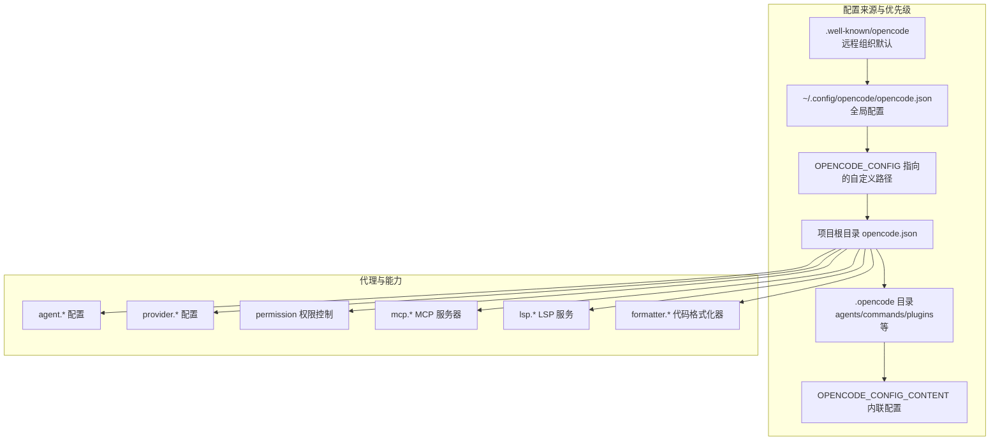
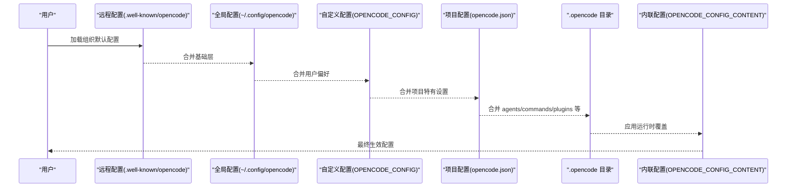
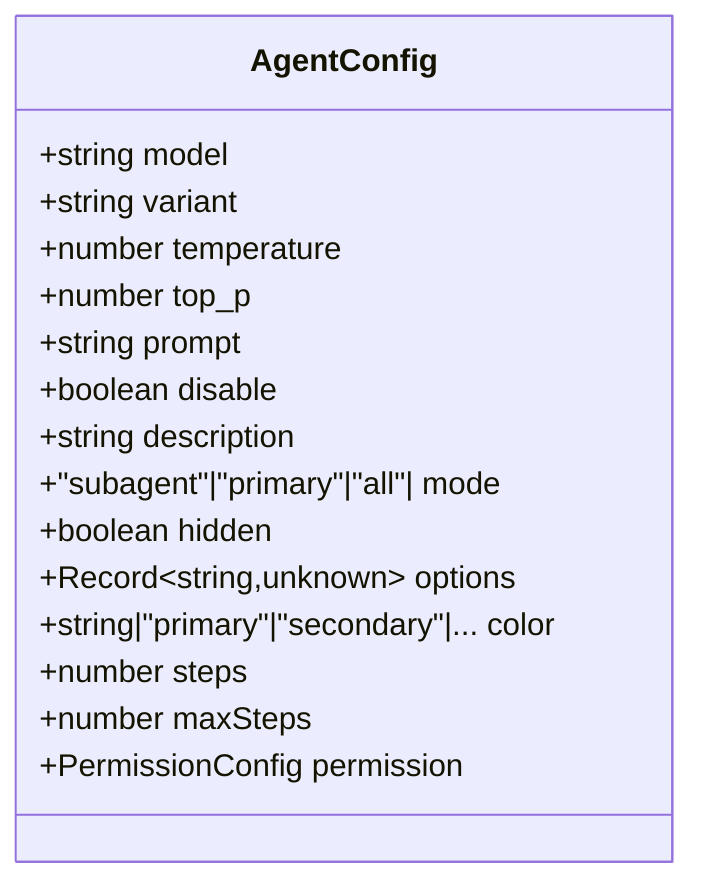
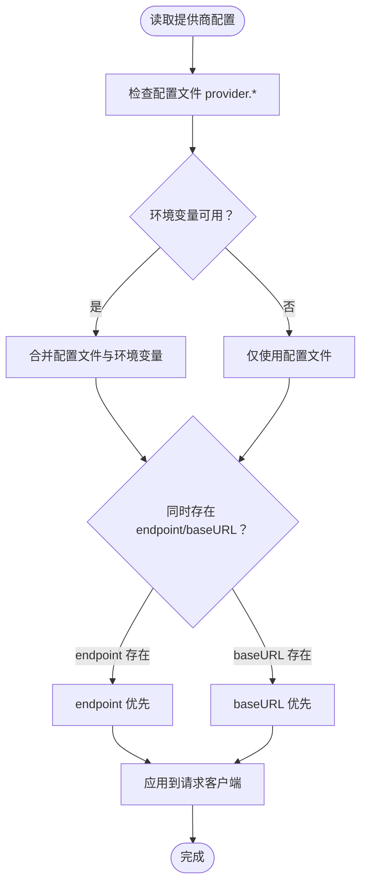
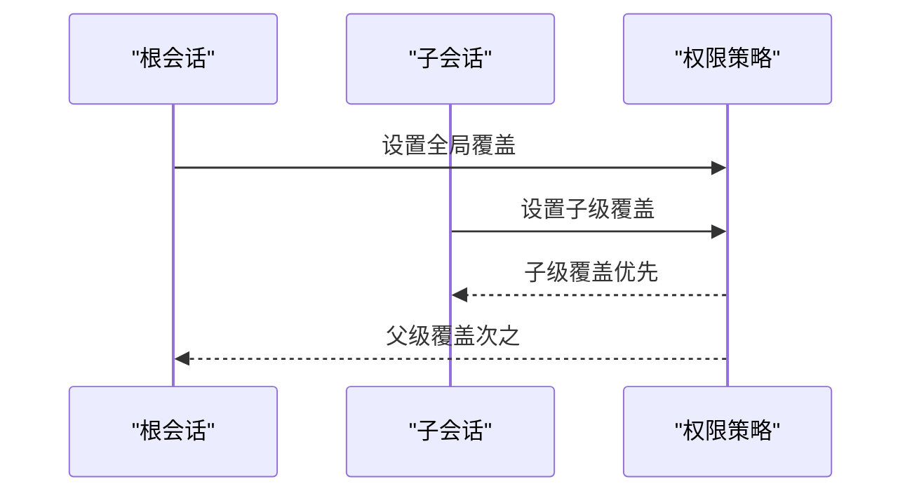
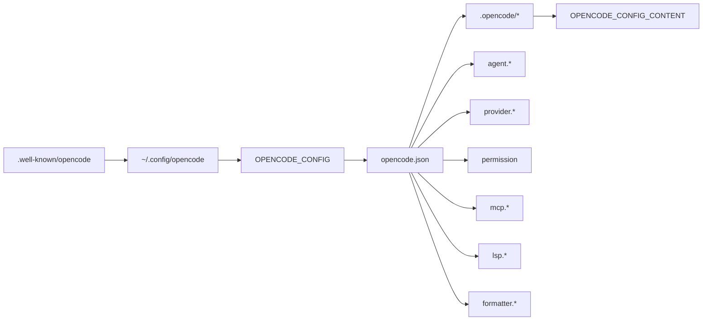

# 代理配置与参数

<cite>
**本文引用的文件**
- [.opencode/opencode.jsonc](file://.opencode/opencode.jsonc)
- [packages/web/src/content/docs/config.mdx](file://packages/web/src/content/docs/config.mdx)
- [packages/web/src/content/docs/providers.mdx](file://packages/web/src/content/docs/providers.mdx)
- [packages/web/src/content/docs/es/config.mdx](file://packages/web/src/content/docs/es/config.mdx)
- [packages/web/src/content/docs/it/permissions.mdx](file://packages/web/src/content/docs/it/permissions.mdx)
- [packages/web/src/content/docs/de/permissions.mdx](file://packages/web/src/content/docs/de/permissions.mdx)
- [packages/web/src/content/docs/fr/config.mdx](file://packages/web/src/content/docs/fr/config.mdx)
- [packages/web/src/content/docs/zh-cn/mcp-servers.mdx](file://packages/web/src/content/docs/zh-cn/mcp-servers.mdx)
- [packages/web/src/content/docs/mcp-servers.mdx](file://packages/web/src/content/docs/mcp-servers.mdx)
- [packages/web/src/content/docs/bs/mcp-servers.mdx](file://packages/web/src/content/docs/bs/mcp-servers.mdx)
- [packages/web/src/content/docs/th/sdk.mdx](file://packages/web/src/content/docs/th/sdk.mdx)
- [packages/web/src/content/docs/bs/sdk.mdx](file://packages/web/src/content/docs/bs/sdk.mdx)
- [packages/web/public/theme.json](file://packages/web/public/theme.json)
- [packages/console/app/public/theme.json](file://packages/console/app/public/theme.json)
- [packages/opencode/test/config/tui.test.ts](file://packages/opencode/test/config/tui.test.ts)
- [packages/opencode/test/provider/amazon-bedrock.test.ts](file://packages/opencode/test/provider/amazon-bedrock.test.ts)
- [packages/app/src/i18n/en.ts](file://packages/app/src/i18n/en.ts)
- [packages/app/src/i18n/fr.ts](file://packages/app/src/i18n/fr.ts)
- [packages/app/src/i18n/zh.ts](file://packages/app/src/i18n/zh.ts)
- [packages/app/src/utils/server-errors.ts](file://packages/app/src/utils/server-errors.ts)
- [packages/app/src/context/permission-auto-respond.test.ts](file://packages/app/src/context/permission-auto-respond.test.ts)
- [packages/smartx-workflow/src/.../workflow.ts](file://packages/smartx-workflow/src/.../workflow.ts)
</cite>

## 目录
1. [简介](#简介)
2. [项目结构](#项目结构)
3. [核心组件](#核心组件)
4. [架构总览](#架构总览)
5. [详细组件分析](#详细组件分析)
6. [依赖关系分析](#依赖关系分析)
7. [性能考量](#性能考量)
8. [故障排除指南](#故障排除指南)
9. [结论](#结论)
10. [附录](#附录)

## 简介
本文件系统性梳理代理配置与参数，涵盖配置文件结构、字段定义、验证规则、继承与覆盖优先级、动态更新与热重载机制、以及最佳实践与常见场景解决方案。内容基于仓库中的配置文档、类型定义与测试用例，确保技术细节可追溯至实际源码。

## 项目结构
- 配置入口与优先级：远程组织默认配置、全局用户配置、自定义路径配置、项目级配置、.opencode 目录、内联运行时配置。
- 代理配置主体：通过 agent 字段定义不同角色的代理；通过 provider 定义模型与提供商选项；通过 permission 控制工具与操作权限；通过 mcp/lsp/formatter 等扩展能力。
- 类型与校验：通过 JSON Schema 校验配置合法性；支持变量替换（环境变量与文件内容）。

图表来源
- [packages/web/src/content/docs/config.mdx:42-57](file://packages/web/src/content/docs/config.mdx#L42-L57)
- [packages/web/src/content/docs/config.mdx:107-120](file://packages/web/src/content/docs/config.mdx#L107-L120)

章节来源
- [packages/web/src/content/docs/config.mdx:27-120](file://packages/web/src/content/docs/config.mdx#L27-L120)

## 核心组件
- 代理配置（AgentConfig）
  - 关键字段：model、variant、temperature、top_p、prompt、tools（已弃用）、disable、description、mode、hidden、options、color、steps/maxSteps、permission。
  - 作用：定义不同任务场景下的代理行为、模型选择、权限策略与迭代步数限制。
- 提供商配置（ProviderConfig）
  - 关键字段：options（如 timeout、chunkTimeout、setCacheKey、baseURL、enterpriseUrl、setCacheKey 等），支持特定提供商的额外选项（如 AWS Bedrock 的 region/profile/endpoint）。
  - 作用：统一管理模型提供商的认证、超时与连接参数。
- 权限配置（PermissionConfig）
  - 支持全局 "*" 与细粒度工具级别规则；兼容旧版 tools 布尔配置。
  - 作用：控制编辑、bash、webfetch、外部目录等操作是否自动执行、询问或拒绝。
- MCP/LSP/Formatter
  - MCP：支持本地与远程服务器配置，可启用/禁用、设置命令、环境变量与超时。
  - LSP：支持命令、扩展名过滤、初始化参数与环境变量。
  - Formatter：支持禁用、命令、环境变量与扩展名映射。

章节来源
- [packages/sdks/js/src/gen/types.gen.ts:975-1030](file://packages/sdks/js/src/gen/types.gen.ts#L975-L1030)
- [packages/sdks/js/src/v2/gen/types.gen.ts:1075-1141](file://packages/sdks/js/src/v2/gen/types.gen.ts#L1075-L1141)
- [packages/sdks/js/src/gen/types.gen.ts:1072-1131](file://packages/sdks/js/src/gen/types.gen.ts#L1072-L1131)
- [packages/web/src/content/docs/providers.mdx:276-304](file://packages/web/src/content/docs/providers.mdx#L276-L304)
- [packages/web/src/content/docs/it/permissions.mdx:1-53](file://packages/web/src/content/docs/it/permissions.mdx#L1-L53)
- [packages/web/src/content/docs/de/permissions.mdx:1-50](file://packages/web/src/content/docs/de/permissions.mdx#L1-L50)

## 架构总览
下图展示配置加载与合并的总体流程，以及代理配置在系统中的位置与交互。

图表来源
- [packages/web/src/content/docs/config.mdx:42-57](file://packages/web/src/content/docs/config.mdx#L42-L57)
- [packages/web/src/content/docs/config.mdx:107-120](file://packages/web/src/content/docs/config.mdx#L107-L120)

## 详细组件分析

### 代理配置（AgentConfig）与字段详解
- 字段与含义
  - model：代理使用的模型标识符。
  - variant：代理默认模型变体（仅当使用代理配置的模型时生效）。
  - temperature/top_p：采样温度与核采样概率，影响输出多样性。
  - prompt：注入的提示词模板。
  - tools（已弃用）：布尔开关，现由 permission 统一管理。
  - disable：禁用该代理。
  - description：使用场景描述。
  - mode：模式，支持 subagent、primary、all。
  - hidden：在 @ 自动补全菜单中隐藏子代理。
  - options：任意键值对扩展参数。
  - color：十六进制颜色或主题色（primary/secondary/accent/success/warning/error/info）。
  - steps/maxSteps：最大代理迭代步数，超过后强制文本响应。
  - permission：细粒度权限控制对象。
- 取值范围与默认值
  - temperature/top_p：数值范围取决于具体提供商；未显式设置时采用提供商默认。
  - steps：默认值通常为系统预设，超出则回退文本模式。
  - color：支持十六进制或主题色枚举。
- 继承与覆盖
  - 代理配置可被项目级 agent.* 覆盖；全局 .opencode/agents 与项目 .opencode/agents 可作为补充或替代。
  - mode 与 hidden 仅对 subagent 生效；primary 代理作为默认入口。

图表来源
- [packages/sdks/js/src/v2/gen/types.gen.ts:1075-1141](file://packages/sdks/js/src/v2/gen/types.gen.ts#L1075-L1141)
- [packages/sdks/js/src/gen/types.gen.ts:975-1030](file://packages/sdks/js/src/gen/types.gen.ts#L975-L1030)

章节来源
- [packages/sdks/js/src/v2/gen/types.gen.ts:1075-1141](file://packages/sdks/js/src/v2/gen/types.gen.ts#L1075-L1141)
- [packages/sdks/js/src/gen/types.gen.ts:975-1030](file://packages/sdks/js/src/gen/types.gen.ts#L975-L1030)

### 提供商配置（ProviderConfig）与模型选项
- 通用选项
  - timeout：请求超时（毫秒），可设为 false 关闭。
  - chunkTimeout：流式响应分片超时，超时则中断。
  - setCacheKey：确保为提供商设置缓存键。
  - baseURL：通用基础地址。
  - enterpriseUrl：GitHub Enterprise Copilot 认证 URL。
- 特定提供商
  - Amazon Bedrock：region、profile、endpoint（别名 baseURL）。
- 优先级与覆盖
  - 配置文件选项优先于环境变量；endpoint 与 baseURL 同时存在时 endpoint 优先。

图表来源
- [packages/web/src/content/docs/providers.mdx:196-254](file://packages/web/src/content/docs/providers.mdx#L196-L254)
- [packages/web/src/content/docs/providers.mdx:276-304](file://packages/web/src/content/docs/providers.mdx#L276-L304)

章节来源
- [packages/web/src/content/docs/providers.mdx:196-304](file://packages/web/src/content/docs/providers.mdx#L196-L304)
- [packages/opencode/test/provider/amazon-bedrock.test.ts:137-179](file://packages/opencode/test/provider/amazon-bedrock.test.ts#L137-L179)

### 权限配置（PermissionConfig）与继承规则
- 动态继承与覆盖
  - 全局 "*" 默认策略；针对具体工具可单独覆盖。
  - 子会话可继承父会话的权限覆盖，但子会话的覆盖优先于父会话。
  - 旧版 tools 布尔配置仍兼容，建议迁移至 permission。
- 错误与诊断
  - 配置无效时抛出 ConfigInvalidError，包含路径与问题列表，便于定位。

图表来源
- [packages/app/src/context/permission-auto-respond.test.ts:43-62](file://packages/app/src/context/permission-auto-respond.test.ts#L43-L62)

章节来源
- [packages/web/src/content/docs/it/permissions.mdx:1-53](file://packages/web/src/content/docs/it/permissions.mdx#L1-L53)
- [packages/web/src/content/docs/de/permissions.mdx:1-50](file://packages/web/src/content/docs/de/permissions.mdx#L1-L50)
- [packages/app/src/context/permission-auto-respond.test.ts:32-62](file://packages/app/src/context/permission-auto-respond.test.ts#L32-L62)
- [packages/app/src/utils/server-errors.ts:49-65](file://packages/app/src/utils/server-errors.ts#L49-L65)

### MCP/LSP/Formatter 配置
- MCP
  - 远程：type=remote，url 指定服务器，enabled=false 为默认禁用，可在本地启用。
  - 本地：type=local，command 指定启动命令，environment 注入环境变量，timeout 指定获取工具超时。
- LSP
  - 支持 command、extensions、disabled、env、initialization 等。
- Formatter
  - 支持禁用、command、environment、extensions。

章节来源
- [packages/web/src/content/docs/mcp-servers.mdx:44-92](file://packages/web/src/content/docs/mcp-servers.mdx#L44-L92)
- [packages/web/src/content/docs/zh-cn/mcp-servers.mdx:44-92](file://packages/web/src/content/docs/zh-cn/mcp-servers.mdx#L44-L92)
- [packages/web/src/content/docs/bs/mcp-servers.mdx:40-82](file://packages/web/src/content/docs/bs/mcp-servers.mdx#L40-L82)
- [packages/sdks/js/src/gen/types.gen.ts:1101-1131](file://packages/sdks/js/src/gen/types.gen.ts#L1101-L1131)

### 配置模板与示例
- 基础模板（opencode.jsonc）
  - 包含 $schema、model、server.port 等字段示例。
- 代理模板（opencode.jsonc）
  - 在 agent.* 下定义专用代理，设置 description、model、prompt、tools/disable 等。
- 权限模板（opencode.json）
  - 使用 permission 对 edit/bash/webfetch 等进行 ask/allow/deny 控制。
- MCP 模板（opencode.json）
  - 远程与本地 MCP 示例，包含 enabled/command/environment/timeout。
- 变量替换模板（opencode.json）
  - 使用 {env:VAR} 与 {file:/path} 引用环境变量与文件内容。

章节来源
- [packages/web/src/content/docs/config.mdx:14-23](file://packages/web/src/content/docs/config.mdx#L14-L23)
- [packages/web/src/content/docs/config.mdx:326-342](file://packages/web/src/content/docs/config.mdx#L326-L342)
- [packages/web/src/content/docs/config.mdx:475-483](file://packages/web/src/content/docs/config.mdx#L475-L483)
- [packages/web/src/content/docs/mcp-servers.mdx:53-92](file://packages/web/src/content/docs/mcp-servers.mdx#L53-L92)
- [packages/web/src/content/docs/es/config.mdx:639-685](file://packages/web/src/content/docs/es/config.mdx#L639-L685)

### 验证与热重载机制
- 验证
  - 通过 JSON Schema 校验配置合法性；支持变量替换（{env:...}/{file:...}）。
  - 配置无效时返回结构化错误，包含路径与问题列表，便于定位。
- 热重载
  - TUI 配置支持从多个来源加载并合并，项目级 tui.json 优先于 OPENCODE_TUI_CONFIG；键绑定等可跨层级合并。
  - 服务器配置遵循相同“合并而非替换”的原则，后加载配置仅覆盖冲突键。

章节来源
- [packages/web/src/content/docs/config.mdx:152-182](file://packages/web/src/content/docs/config.mdx#L152-L182)
- [packages/web/src/content/docs/config.mdx:32-39](file://packages/web/src/content/docs/config.mdx#L32-L39)
- [packages/opencode/test/config/tui.test.ts:325-382](file://packages/opencode/test/config/tui.test.ts#L325-L382)
- [packages/app/src/utils/server-errors.ts:49-65](file://packages/app/src/utils/server-errors.ts#L49-L65)

## 依赖关系分析
- 配置来源依赖
  - 远程组织默认配置为基底，后续配置逐层覆盖。
  - .opencode 与 ~/.config/opencode 目录使用复数命名（agents/commands/plugins 等），兼容单数名称。
- 代理与能力耦合
  - agent.* 依赖 provider.* 与 permission.*；MCP/LSP/Formatter 独立扩展，可按需启用。
- 错误传播
  - 配置解析失败通过 ConfigInvalidError 抛出，UI 层根据语言包渲染可读错误信息。

图表来源
- [packages/web/src/content/docs/config.mdx:42-57](file://packages/web/src/content/docs/config.mdx#L42-L57)
- [packages/web/src/content/docs/config.mdx:55-57](file://packages/web/src/content/docs/config.mdx#L55-L57)

章节来源
- [packages/web/src/content/docs/config.mdx:42-57](file://packages/web/src/content/docs/config.mdx#L42-L57)

## 性能考量
- 代理步数限制：通过 steps/maxSteps 控制最大迭代次数，避免长链路导致资源耗尽。
- 超时与分片：合理设置 provider.timeout 与 chunkTimeout，平衡响应质量与延迟。
- 权限预判：在高风险操作前通过 permission.ask 减少不必要的阻塞与重试。
- MCP/LSP 启动：本地 MCP 建议设置合理的 timeout，避免长时间等待影响交互体验。

## 故障排除指南
- 配置无效
  - 现象：出现 ConfigInvalidError，包含路径与问题列表。
  - 处理：根据错误消息定位字段，修正 JSON 结构或字段类型；确认 $schema 与字段命名正确。
- 权限相关
  - 现象：编辑/脚本/网络抓取等操作被阻断或反复询问。
  - 处理：检查 permission 配置；确认子会话覆盖优先于父会话；必要时将 tools 迁移至 permission。
- MCP/LSP 启动失败
  - 现象：MCP 服务器不可用或 LSP 初始化异常。
  - 处理：检查 command、environment、timeout；确认 enabled=true；查看远程默认是否禁用。
- 提供商认证失败
  - 现象：Amazon Bedrock 等提供商认证失败。
  - 处理：确认 region/profile/endpoint 设置；若同时设置 endpoint 与 baseURL，endpoint 优先；检查环境变量优先级。

章节来源
- [packages/app/src/utils/server-errors.ts:49-65](file://packages/app/src/utils/server-errors.ts#L49-L65)
- [packages/app/src/i18n/en.ts:503-504](file://packages/app/src/i18n/en.ts#L503-L504)
- [packages/app/src/i18n/fr.ts:433-440](file://packages/app/src/i18n/fr.ts#L433-L440)
- [packages/app/src/i18n/zh.ts:483-484](file://packages/app/src/i18n/zh.ts#L483-L484)
- [packages/web/src/content/docs/providers.mdx:299-301](file://packages/web/src/content/docs/providers.mdx#L299-L301)
- [packages/web/src/content/docs/mcp-servers.mdx:44-92](file://packages/web/src/content/docs/mcp-servers.mdx#L44-L92)

## 结论
本文件基于仓库中的配置文档、类型定义与测试用例，系统梳理了代理配置与参数的结构、字段、验证与覆盖规则，并结合 MCP/LSP/Formatter 等扩展能力给出最佳实践与故障排除建议。遵循“合并而非替换”的优先级原则，配合 JSON Schema 校验与变量替换，可实现灵活、安全且可维护的代理配置体系。

## 附录
- 配置优先级（从低到高）
  - 远程组织默认 → 全局用户配置 → 自定义路径配置 → 项目配置 → .opencode 目录 → 内联运行时配置
- 常用字段速查
  - agent.*：model、variant、temperature、top_p、prompt、mode、steps、permission
  - provider.*：options.timeout、options.chunkTimeout、options.setCacheKey、options.baseURL、options.enterpriseUrl、amazon-bedrock.options.region/profile/endpoint
  - permission：全局 "*" 与工具级覆盖
  - mcp.*：type=remote/local、url/command/environment/timeout/enabled
  - lsp.*：command/extensions/disabled/env/initialization
  - formatter.*：disabled/command/environment/extensions