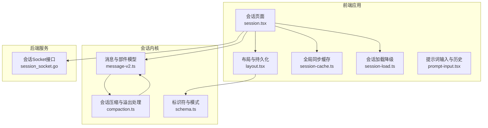
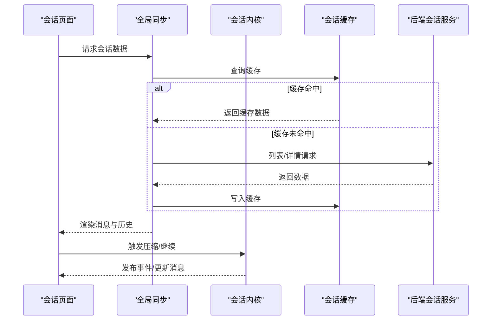
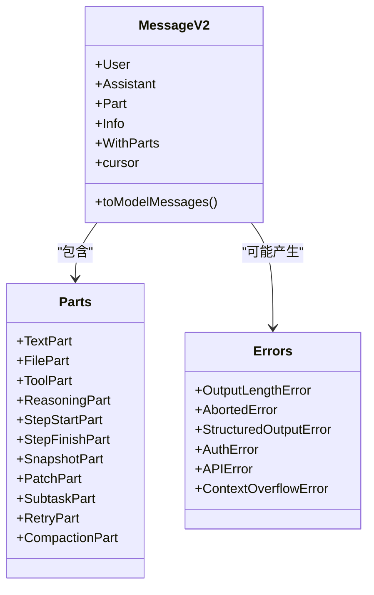
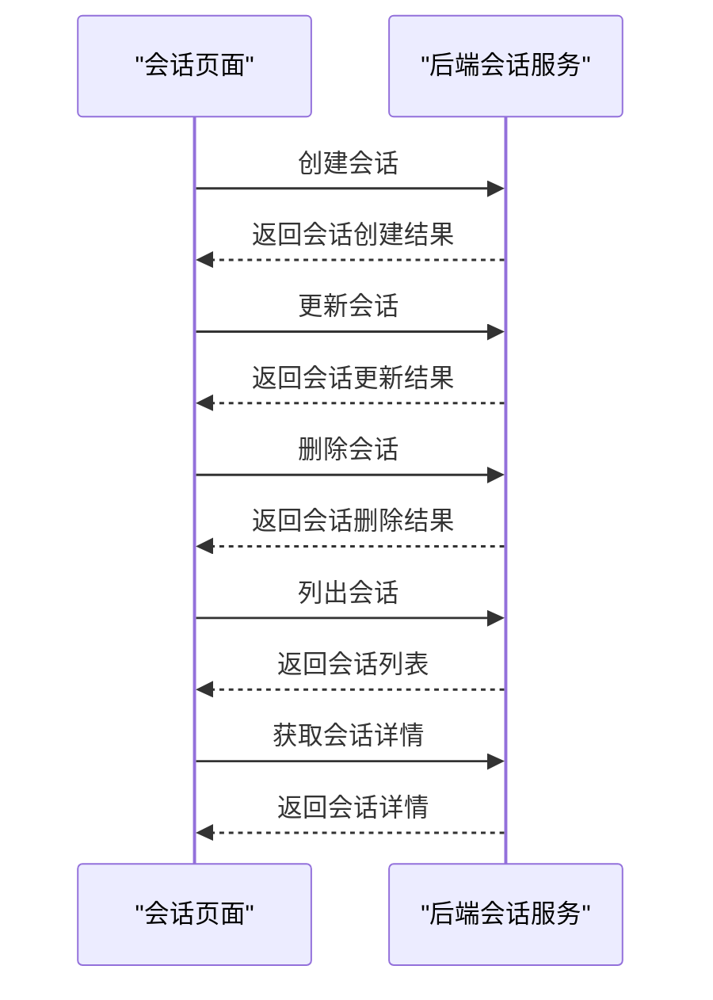
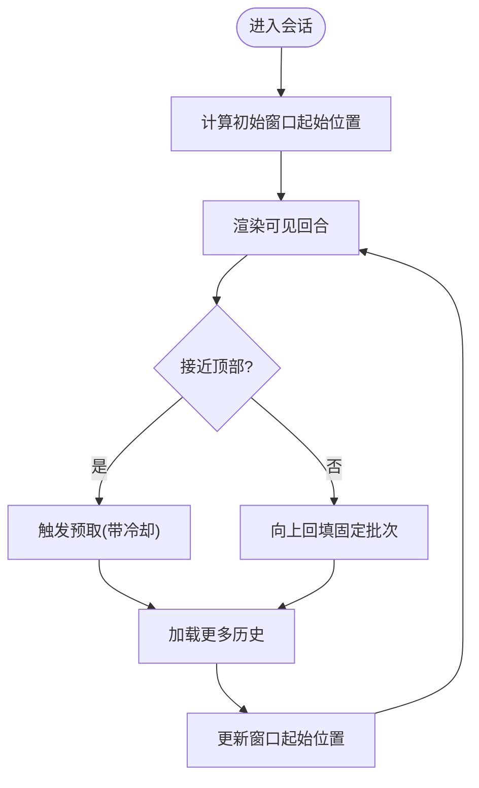
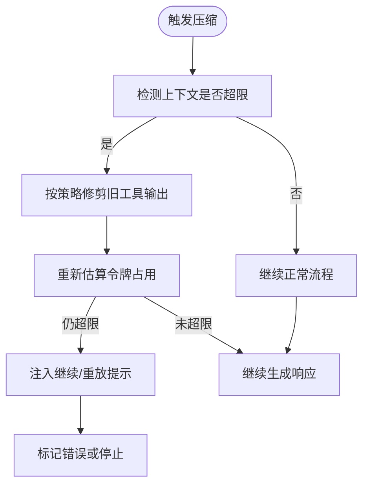
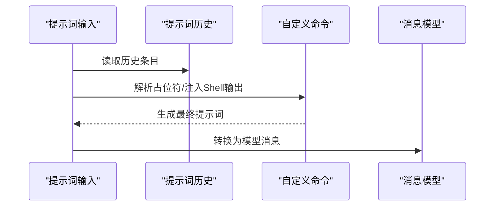
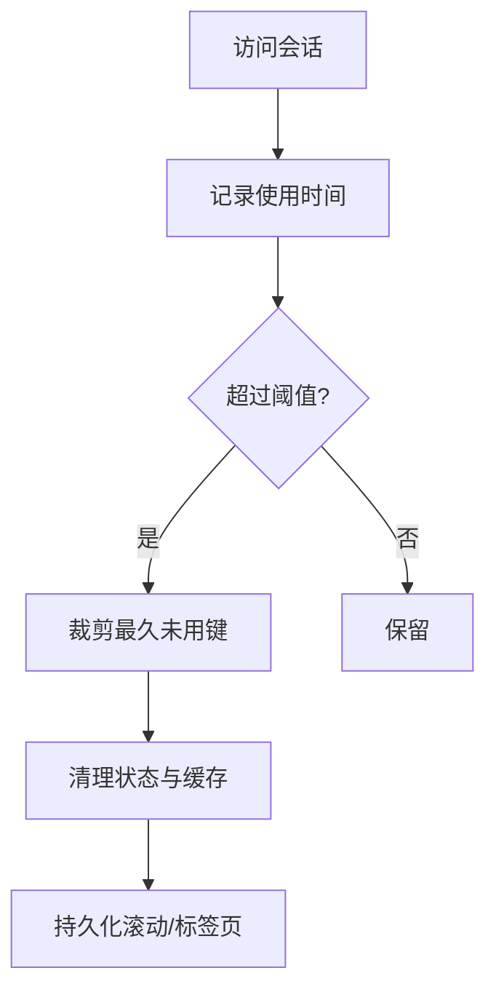
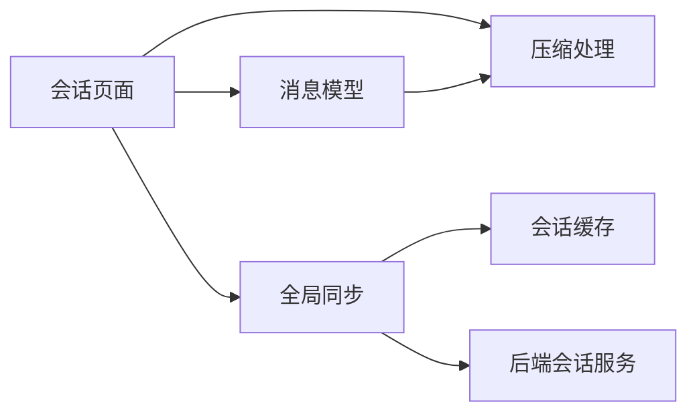

# 会话管理系统

<cite>
**本文引用的文件**
- [packages/opencode/src/session/compaction.ts](file://packages/opencode/src/session/compaction.ts)
- [packages/opencode/src/session/message-v2.ts](file://packages/opencode/src/session/message-v2.ts)
- [packages/opencode/src/session/schema.ts](file://packages/opencode/src/session/schema.ts)
- [packages/app/src/context/layout.tsx](file://packages/app/src/context/layout.tsx)
- [packages/app/src/pages/session.tsx](file://packages/app/src/pages/session.tsx)
- [packages/app/src/context/global-sync/session-cache.ts](file://packages/app/src/context/global-sync/session-cache.ts)
- [packages/app/src/context/global-sync/session-load.ts](file://packages/app/src/context/global-sync/session-load.ts)
- [packages/strategy-service/internal/web/session_socket.go](file://packages/strategy-service/internal/web/session_socket.go)
- [packages/web/src/content/docs/pl/commands.mdx](file://packages/web/src/content/docs/pl/commands.mdx)
- [packages/web/src/content/docs/commands.mdx](file://packages/web/src/content/docs/commands.mdx)
- [docs/plans/2026-04-12-workflow-session-agent-model-clarity.md](file://docs/plans/2026-04-12-workflow-session-agent-model-clarity.md)
- [docs/plans/2026-06-24-project-manager-smartx-workflow-enforcement.md](file://docs/plans/2026-06-24-project-manager-smartx-workflow-enforcement.md)
- [packages/app/src/components/prompt-input.tsx](file://packages/app/src/components/prompt-input.tsx)
- [packages/app/e2e/session/session-model-persistence.spec.ts](file://packages/app/e2e/session/session-model-persistence.spec.ts)
- [packages/app/e2e/session/session.spec.ts](file://packages/app/e2e/session/session.spec.ts)
</cite>

## 目录
1. [简介](#简介)
2. [项目结构](#项目结构)
3. [核心组件](#核心组件)
4. [架构总览](#架构总览)
5. [详细组件分析](#详细组件分析)
6. [依赖关系分析](#依赖关系分析)
7. [性能考量](#性能考量)
8. [故障排查指南](#故障排查指南)
9. [结论](#结论)
10. [附录](#附录)

## 简介
本文件系统性梳理会话管理系统的概念、生命周期与状态管理机制，覆盖会话数据结构、消息格式与上下文保持策略；阐述会话持久化、恢复与清理机制；说明会话配置选项、超时与并发控制；解释系统提示词（System Prompt）的作用机制、动态生成与个性化定制；并提供调试工具、性能监控与数据迁移方案，辅以实际使用示例与最佳实践建议。

## 项目结构
会话管理横跨前端应用层、全局同步层与后端服务层，核心模块包括：
- 前端页面与布局：会话页面渲染、历史窗口管理、标签页与滚动持久化
- 全局同步与缓存：会话数据缓存、批量加载与清理
- 会话内核：消息与部件的数据模型、压缩与上下文溢出处理
- 后端服务：会话的创建、更新、删除、列表与详情接口

**图表来源**
- [packages/app/src/pages/session.tsx:1-800](file://packages/app/src/pages/session.tsx#L1-L800)
- [packages/app/src/context/layout.tsx:1-800](file://packages/app/src/context/layout.tsx#L1-L800)
- [packages/app/src/context/global-sync/session-cache.ts:1-63](file://packages/app/src/context/global-sync/session-cache.ts#L1-L63)
- [packages/app/src/context/global-sync/session-load.ts:1-26](file://packages/app/src/context/global-sync/session-load.ts#L1-L26)
- [packages/opencode/src/session/message-v2.ts:1-800](file://packages/opencode/src/session/message-v2.ts#L1-L800)
- [packages/opencode/src/session/compaction.ts:1-330](file://packages/opencode/src/session/compaction.ts#L1-L330)
- [packages/opencode/src/session/schema.ts:1-39](file://packages/opencode/src/session/schema.ts#L1-L39)
- [packages/strategy-service/internal/web/session_socket.go:1-100](file://packages/strategy-service/internal/web/session_socket.go#L1-L100)

**章节来源**
- [packages/app/src/pages/session.tsx:1-800](file://packages/app/src/pages/session.tsx#L1-L800)
- [packages/app/src/context/layout.tsx:1-800](file://packages/app/src/context/layout.tsx#L1-L800)
- [packages/opencode/src/session/message-v2.ts:1-800](file://packages/opencode/src/session/message-v2.ts#L1-L800)
- [packages/opencode/src/session/compaction.ts:1-330](file://packages/opencode/src/session/compaction.ts#L1-L330)
- [packages/strategy-service/internal/web/session_socket.go:1-100](file://packages/strategy-service/internal/web/session_socket.go#L1-L100)

## 核心组件
- 会话标识与消息标识：通过统一的标识生成器确保时间序与唯一性，支持降序/升序排列，保障消息回放与排序一致性。
- 消息与部件模型：定义用户/助手消息、文本/文件/工具/推理等部件类型，支持输出格式、令牌统计、成本与错误信息。
- 会话压缩与上下文溢出处理：自动检测上下文是否超出模型限制，必要时进行压缩或继续流程，并在需要时注入“继续”提示。
- 历史窗口与滚动持久化：按回合分批加载历史，滚动阈值触发预取，同时维护每个会话的滚动位置与标签页状态。
- 全局缓存与降级加载：对会话相关数据进行缓存与淘汰，提供根目录会话列表的降级加载策略，提升可用性。
- 后端会话接口：提供创建、更新、删除、列表与详情的Socket事件处理，返回标准化结果与错误。

**章节来源**
- [packages/opencode/src/session/schema.ts:1-39](file://packages/opencode/src/session/schema.ts#L1-L39)
- [packages/opencode/src/session/message-v2.ts:1-800](file://packages/opencode/src/session/message-v2.ts#L1-L800)
- [packages/opencode/src/session/compaction.ts:1-330](file://packages/opencode/src/session/compaction.ts#L1-L330)
- [packages/app/src/context/layout.tsx:264-350](file://packages/app/src/context/layout.tsx#L264-L350)
- [packages/app/src/context/global-sync/session-cache.ts:1-63](file://packages/app/src/context/global-sync/session-cache.ts#L1-L63)
- [packages/app/src/context/global-sync/session-load.ts:1-26](file://packages/app/src/context/global-sync/session-load.ts#L1-L26)
- [packages/strategy-service/internal/web/session_socket.go:1-100](file://packages/strategy-service/internal/web/session_socket.go#L1-L100)

## 架构总览
会话系统采用“前端渲染 + 内核处理 + 后端服务”的分层设计：
- 前端负责UI交互、历史窗口管理、滚动与标签页持久化、提示词历史与占位符替换。
- 内核负责消息与部件模型转换、上下文压缩、溢出处理与事件发布。
- 后端提供会话生命周期管理的Socket接口，保证数据一致性与可扩展性。

**图表来源**
- [packages/app/src/pages/session.tsx:430-471](file://packages/app/src/pages/session.tsx#L430-L471)
- [packages/app/src/context/global-sync/session-cache.ts:1-63](file://packages/app/src/context/global-sync/session-cache.ts#L1-L63)
- [packages/strategy-service/internal/web/session_socket.go:69-83](file://packages/strategy-service/internal/web/session_socket.go#L69-L83)

## 详细组件分析

### 会话数据模型与消息格式
- 标识体系：会话ID、消息ID、部件ID均基于统一标识生成器，支持升序/降序，确保时间序与唯一性。
- 消息角色：用户消息与助手消息分别承载时间戳、代理、模型、系统提示、工具与变体等元信息。
- 部件类型：文本、文件、工具调用、推理、步骤开始/结束、快照、补丁、子任务、重试、压缩等，覆盖多模态与工具执行场景。
- 输出格式：支持纯文本与JSON Schema两种输出格式，便于结构化产物生成。
- 错误与状态：内置多种错误类型（认证、API、上下文溢出、中止等），并在消息中携带完成时间、令牌统计与成本。

**图表来源**
- [packages/opencode/src/session/message-v2.ts:20-495](file://packages/opencode/src/session/message-v2.ts#L20-L495)

**章节来源**
- [packages/opencode/src/session/message-v2.ts:1-800](file://packages/opencode/src/session/message-v2.ts#L1-L800)
- [packages/opencode/src/session/schema.ts:1-39](file://packages/opencode/src/session/schema.ts#L1-L39)

### 会话生命周期与状态管理
- 创建与更新：前端通过全局同步触发后端会话接口，返回创建/更新结果；失败时携带工作区路径与错误信息。
- 删除与列表：支持按条件删除与列出，列表接口提供降级能力，避免根目录枚举失败导致的不可用。
- 详情与同步：详情接口返回单个会话的完整信息；前端在路由切换时触发同步，必要时强制刷新。

**图表来源**
- [packages/strategy-service/internal/web/session_socket.go:16-99](file://packages/strategy-service/internal/web/session_socket.go#L16-L99)

**章节来源**
- [packages/strategy-service/internal/web/session_socket.go:1-100](file://packages/strategy-service/internal/web/session_socket.go#L1-L100)
- [packages/app/src/context/global-sync/session-load.ts:1-26](file://packages/app/src/context/global-sync/session-load.ts#L1-L26)

### 上下文保持与历史窗口
- 历史窗口：初始仅渲染最近若干回合，向上滚动时按批次回填，顶部附近触发预取，减少首屏压力。
- 滚动与标签页：为每个会话维护滚动位置与标签页集合，离开页面或隐藏时持久化，恢复时自动还原。
- 预取与冷却：预取存在冷却时间与无增长上限，避免频繁请求；当可见回合增长时清零无增长计数。

**图表来源**
- [packages/app/src/pages/session.tsx:78-298](file://packages/app/src/pages/session.tsx#L78-L298)
- [packages/app/src/context/layout.tsx:333-348](file://packages/app/src/context/layout.tsx#L333-L348)

**章节来源**
- [packages/app/src/pages/session.tsx:1-800](file://packages/app/src/pages/session.tsx#L1-L800)
- [packages/app/src/context/layout.tsx:264-350](file://packages/app/src/context/layout.tsx#L264-L350)

### 会话压缩与上下文溢出处理
- 自动检测：根据模型上下文限制与保留缓冲，估算已用令牌，判断是否需要压缩或继续。
- 压缩策略：优先清理旧工具调用输出，保护关键工具与近期内容；支持按需剥离媒体以降低上下文。
- 继续流程：若上下文仍超限，注入“继续”提示或重放原始用户消息，确保对话连续性；必要时标记错误并停止后续处理。
- 插件扩展：允许插件注入自定义压缩提示与上下文，实现多智能体会话的摘要策略。

**图表来源**
- [packages/opencode/src/session/compaction.ts:33-295](file://packages/opencode/src/session/compaction.ts#L33-L295)

**章节来源**
- [packages/opencode/src/session/compaction.ts:1-330](file://packages/opencode/src/session/compaction.ts#L1-L330)

### 提示词系统与个性化定制
- 提示词占位符：命令与自定义命令支持参数占位符与Shell输出注入，便于动态拼接提示词。
- 提示词历史：前端维护全局与Shell两类提示词历史，支持从历史中选择与复用。
- 系统提示词作用：在消息模型转换阶段，系统提示词作为上下文的一部分参与模型输入；在工作流场景中，节点代理与工作区默认模型共同决定执行行为。

**图表来源**
- [packages/app/src/components/prompt-input.tsx:292-333](file://packages/app/src/components/prompt-input.tsx#L292-L333)
- [packages/web/src/content/docs/commands.mdx:101-167](file://packages/web/src/content/docs/commands.mdx#L101-L167)
- [packages/web/src/content/docs/pl/commands.mdx:363-385](file://packages/web/src/content/docs/pl/commands.mdx#L363-L385)

**章节来源**
- [packages/app/src/components/prompt-input.tsx:292-333](file://packages/app/src/components/prompt-input.tsx#L292-L333)
- [packages/web/src/content/docs/commands.mdx:101-167](file://packages/web/src/content/docs/commands.mdx#L101-L167)
- [packages/web/src/content/docs/pl/commands.mdx:363-385](file://packages/web/src/content/docs/pl/commands.mdx#L363-L385)
- [docs/plans/2026-04-12-workflow-session-agent-model-clarity.md:23-50](file://docs/plans/2026-04-12-workflow-session-agent-model-clarity.md#L23-L50)

### 会话持久化、恢复与清理
- 持久化键：会话状态键包括提示词、终端与文件视图等，支持工作区与会话维度；清理时同时移除新旧版本键。
- 恢复策略：页面可见性变化与页面卸载时触发持久化；滚动位置与标签页状态在恢复时自动还原。
- 清理机制：基于使用频次与最大键数量进行裁剪，移除不活跃会话的状态与缓存；提供显式清理入口。

**图表来源**
- [packages/app/src/context/layout.tsx:264-350](file://packages/app/src/context/layout.tsx#L264-L350)
- [packages/app/src/context/global-sync/session-cache.ts:23-62](file://packages/app/src/context/global-sync/session-cache.ts#L23-L62)

**章节来源**
- [packages/app/src/context/layout.tsx:264-350](file://packages/app/src/context/layout.tsx#L264-L350)
- [packages/app/src/context/global-sync/session-cache.ts:1-63](file://packages/app/src/context/global-sync/session-cache.ts#L1-L63)

### 会话配置选项、超时设置与并发控制
- 配置项：压缩保留缓冲、自动压缩开关、修剪开关、最小/保护修剪阈值等，影响上下文溢出检测与压缩策略。
- 超时与并发：会话历史加载具备冷却与无增长上限控制，避免过度请求；滚动手势窗口用于抑制频繁滚动触发。
- 工作流与模型绑定：工作流会话的代理与模型遵循“节点代理优先、工作区默认模型回退”的规则，变更模型不影响历史会话。

**章节来源**
- [packages/opencode/src/session/compaction.ts:31-100](file://packages/opencode/src/session/compaction.ts#L31-L100)
- [packages/app/src/pages/session.tsx:676-725](file://packages/app/src/pages/session.tsx#L676-L725)
- [docs/plans/2026-04-12-workflow-session-agent-model-clarity.md:33-50](file://docs/plans/2026-04-12-workflow-session-agent-model-clarity.md#L33-L50)

## 依赖关系分析
- 前端到内核：会话页面依赖消息模型与压缩逻辑，通过事件与状态驱动UI更新。
- 前端到后端：通过Socket接口进行会话生命周期管理，失败时返回标准化错误。
- 前端到全局同步：使用缓存与降级加载策略，提升可用性与性能。

**图表来源**
- [packages/app/src/pages/session.tsx:1-800](file://packages/app/src/pages/session.tsx#L1-L800)
- [packages/opencode/src/session/message-v2.ts:1-800](file://packages/opencode/src/session/message-v2.ts#L1-L800)
- [packages/opencode/src/session/compaction.ts:1-330](file://packages/opencode/src/session/compaction.ts#L1-L330)
- [packages/app/src/context/global-sync/session-cache.ts:1-63](file://packages/app/src/context/global-sync/session-cache.ts#L1-L63)
- [packages/strategy-service/internal/web/session_socket.go:1-100](file://packages/strategy-service/internal/web/session_socket.go#L1-L100)

**章节来源**
- [packages/app/src/pages/session.tsx:1-800](file://packages/app/src/pages/session.tsx#L1-L800)
- [packages/opencode/src/session/message-v2.ts:1-800](file://packages/opencode/src/session/message-v2.ts#L1-L800)
- [packages/opencode/src/session/compaction.ts:1-330](file://packages/opencode/src/session/compaction.ts#L1-L330)
- [packages/app/src/context/global-sync/session-cache.ts:1-63](file://packages/app/src/context/global-sync/session-cache.ts#L1-L63)
- [packages/strategy-service/internal/web/session_socket.go:1-100](file://packages/strategy-service/internal/web/session_socket.go#L1-L100)

## 性能考量
- 分页与预取：历史窗口采用分页与预取策略，减少一次性加载大量消息带来的内存与渲染压力。
- 缓存与淘汰：会话相关数据按会话维度缓存，结合LRU式淘汰与显式清理，平衡内存占用与访问延迟。
- 压缩与修剪：在上下文接近上限前主动修剪旧工具输出，避免频繁溢出导致的失败重试。
- 滚动与标签页持久化：在页面卸载与可见性变化时持久化状态，减少重复计算与滚动抖动。

[本节为通用性能指导，无需具体文件分析]

## 故障排查指南
- 上下文溢出：当压缩后仍超限，系统会记录错误并停止后续处理；检查压缩策略与媒体剥离设置。
- 会话加载失败：根目录会话列表提供降级加载，若失败则回退到不带限制的查询；确认后端服务可用性。
- 模型与代理不一致：工作流会话的代理与模型遵循节点优先与工作区回退规则；变更模型不会影响历史会话，但会影响后续运行。
- 提示词历史异常：检查提示词历史存储与迁移逻辑，确保键名与版本兼容。

**章节来源**
- [packages/opencode/src/session/compaction.ts:225-234](file://packages/opencode/src/session/compaction.ts#L225-L234)
- [packages/app/src/context/global-sync/session-load.ts:3-18](file://packages/app/src/context/global-sync/session-load.ts#L3-L18)
- [docs/plans/2026-04-12-workflow-session-agent-model-clarity.md:33-50](file://docs/plans/2026-04-12-workflow-session-agent-model-clarity.md#L33-L50)

## 结论
该会话管理系统通过清晰的分层设计与完善的内核能力，实现了高可用的历史窗口管理、稳健的上下文压缩与溢出处理、可靠的持久化与恢复机制。配合工作流与模型绑定规则，系统在复杂多智能体协作场景中保持语义正确与用户体验稳定。建议在生产环境中结合监控指标与日志，持续优化压缩策略与缓存命中率。

[本节为总结性内容，无需具体文件分析]

## 附录

### 实际使用示例与最佳实践
- 使用提示词历史与占位符：利用历史记录与Shell输出注入，快速构建个性化提示词模板。
- 控制上下文大小：在大文件或多媒体场景中启用媒体剥离与工具输出修剪，避免频繁溢出。
- 管理会话数量：合理设置最大会话键数量与清理阈值，避免内存占用过高。
- 工作流模型绑定：在工作流绑定时明确默认模型与变体，后续运行中仅在节点层面覆盖代理与模型。

**章节来源**
- [packages/app/src/components/prompt-input.tsx:292-333](file://packages/app/src/components/prompt-input.tsx#L292-L333)
- [packages/web/src/content/docs/commands.mdx:101-167](file://packages/web/src/content/docs/commands.mdx#L101-L167)
- [packages/opencode/src/session/compaction.ts:31-100](file://packages/opencode/src/session/compaction.ts#L31-L100)
- [packages/app/src/context/layout.tsx:264-350](file://packages/app/src/context/layout.tsx#L264-L350)
- [docs/plans/2026-04-12-workflow-session-agent-model-clarity.md:33-50](file://docs/plans/2026-04-12-workflow-session-agent-model-clarity.md#L33-L50)