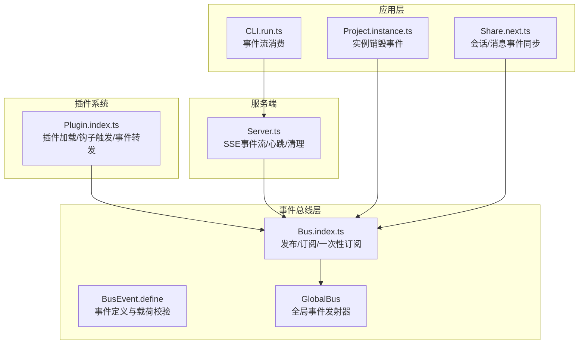
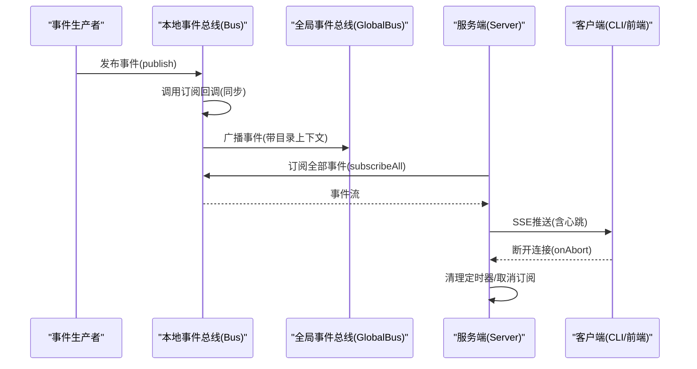
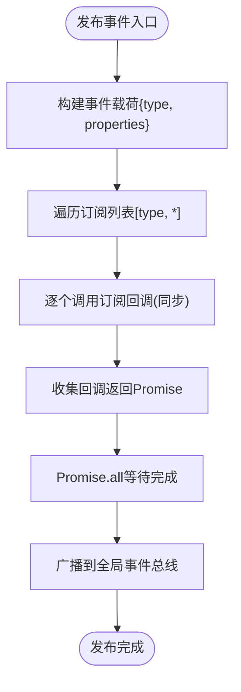
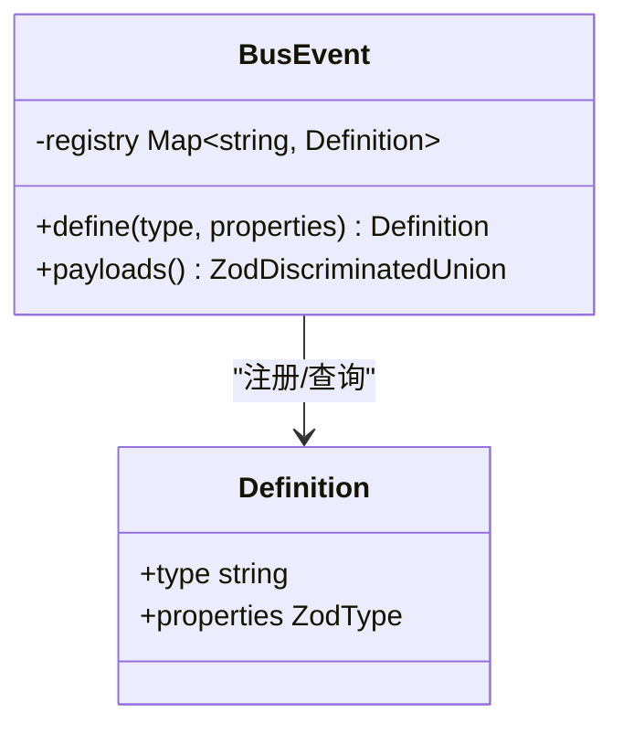
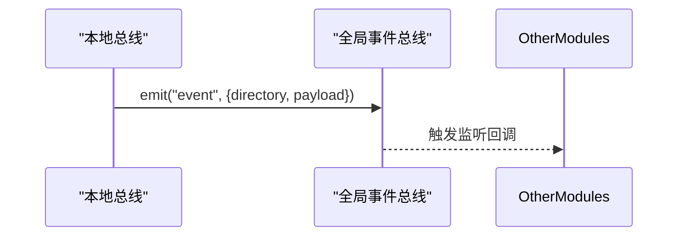
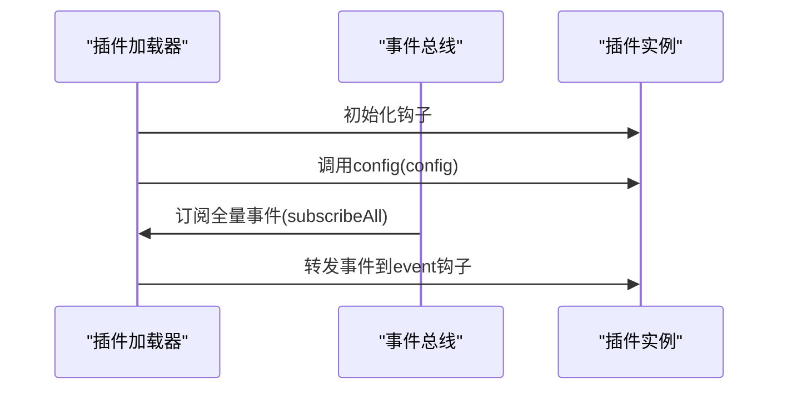
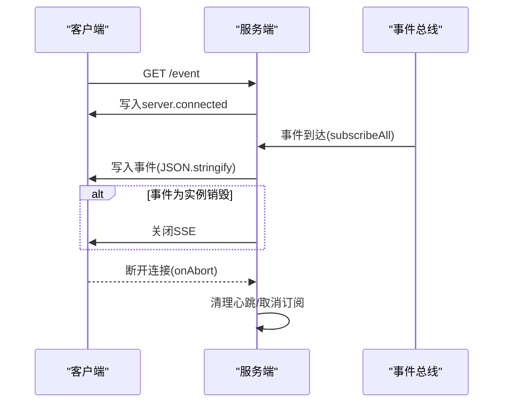
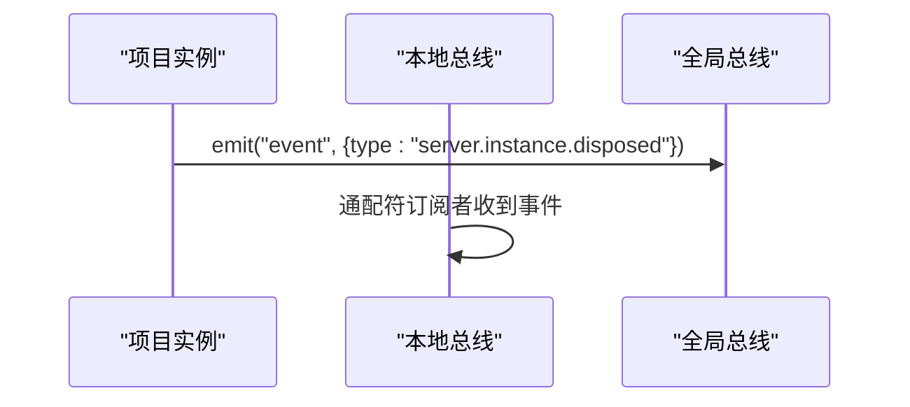
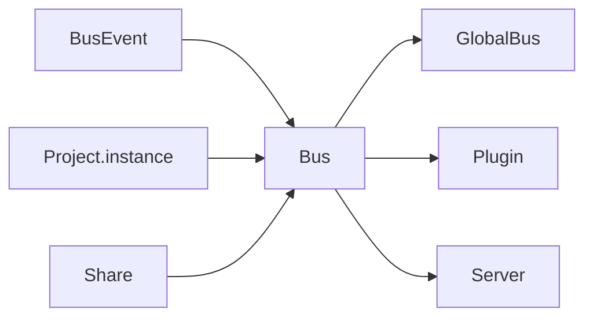
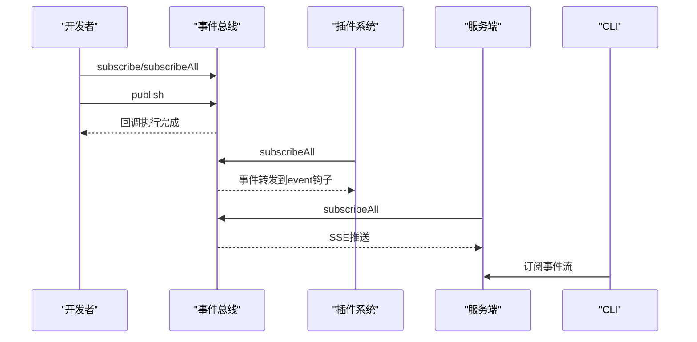

# 事件钩子系统

<cite>
**本文档引用的文件**
- [packages/opencode/src/bus/index.ts](file://packages/opencode/src/bus/index.ts)
- [packages/opencode/src/bus/bus-event.ts](file://packages/opencode/src/bus/bus-event.ts)
- [packages/opencode/src/bus/global.ts](file://packages/opencode/src/bus/global.ts)
- [packages/opencode/src/plugin/index.ts](file://packages/opencode/src/plugin/index.ts)
- [packages/opencode/src/server/server.ts](file://packages/opencode/src/server/server.ts)
- [packages/opencode/src/project/instance.ts](file://packages/opencode/src/project/instance.ts)
- [packages/opencode/src/share/share-next.ts](file://packages/opencode/src/share/share-next.ts)
- [packages/opencode/src/cli/cmd/run.ts](file://packages/opencode/src/cli/cmd/run.ts)
- [packages/smartx-workflow/test/state.test.ts](file://packages/smartx-workflow/test/state.test.ts)
- [packages/opencode/src/util/log.ts](file://packages/opencode/src/util/log.ts)
- [packages/web/src/content/docs/plugins.mdx](file://packages/web/src/content/docs/plugins.mdx)
- [packages/smartx-workflow/test/state.test.ts](file://packages/smartx-workflow/test/state.test.ts)
- [packages/opencode/src/util/queue.ts](file://packages/opencode/src/util/queue.ts)
</cite>

## 目录
1. [简介](#简介)
2. [项目结构](#项目结构)
3. [核心组件](#核心组件)
4. [架构总览](#架构总览)
5. [详细组件分析](#详细组件分析)
6. [依赖关系分析](#依赖关系分析)
7. [性能考虑](#性能考虑)
8. [故障排查指南](#故障排查指南)
9. [结论](#结论)
10. [附录](#附录)

## 简介
本文件系统性梳理事件钩子系统的设计与实现，涵盖事件驱动架构原理、事件类型分类、传播机制、钩子注册/触发/监听流程，以及同步/异步处理差异、优先级与执行顺序控制、事件上下文与参数传递、返回值处理、订阅示例、钩子编写规范、错误处理、调试工具、性能监控与内存泄漏防护等。

## 项目结构
事件钩子系统主要分布在以下模块：
- 事件总线与事件定义：packages/opencode/src/bus/*
- 插件钩子系统：packages/opencode/src/plugin/index.ts
- 服务器事件流：packages/opencode/src/server/server.ts
- 全局事件总线：packages/opencode/src/bus/global.ts
- 事件实例生命周期：packages/opencode/src/project/instance.ts
- 事件共享与同步：packages/opencode/src/share/share-next.ts
- CLI 事件订阅：packages/opencode/src/cli/cmd/run.ts
- 文档与事件清单：packages/web/src/content/docs/plugins.mdx

**图表来源**
- [packages/opencode/src/bus/index.ts:1-106](file://packages/opencode/src/bus/index.ts#L1-L106)
- [packages/opencode/src/bus/bus-event.ts:1-44](file://packages/opencode/src/bus/bus-event.ts#L1-L44)
- [packages/opencode/src/bus/global.ts:1-11](file://packages/opencode/src/bus/global.ts#L1-L11)
- [packages/opencode/src/plugin/index.ts:1-150](file://packages/opencode/src/plugin/index.ts#L1-L150)
- [packages/opencode/src/server/server.ts:500-639](file://packages/opencode/src/server/server.ts#L500-L639)
- [packages/opencode/src/project/instance.ts:1-48](file://packages/opencode/src/project/instance.ts#L1-L48)
- [packages/opencode/src/share/share-next.ts:39-83](file://packages/opencode/src/share/share-next.ts#L39-L83)
- [packages/opencode/src/cli/cmd/run.ts:427-465](file://packages/opencode/src/cli/cmd/run.ts#L427-L465)

**章节来源**
- [packages/opencode/src/bus/index.ts:1-106](file://packages/opencode/src/bus/index.ts#L1-L106)
- [packages/opencode/src/bus/bus-event.ts:1-44](file://packages/opencode/src/bus/bus-event.ts#L1-L44)
- [packages/opencode/src/bus/global.ts:1-11](file://packages/opencode/src/bus/global.ts#L1-L11)
- [packages/opencode/src/plugin/index.ts:1-150](file://packages/opencode/src/plugin/index.ts#L1-L150)
- [packages/opencode/src/server/server.ts:500-639](file://packages/opencode/src/server/server.ts#L500-L639)
- [packages/opencode/src/project/instance.ts:1-48](file://packages/opencode/src/project/instance.ts#L1-L48)
- [packages/opencode/src/share/share-next.ts:39-83](file://packages/opencode/src/share/share-next.ts#L39-L83)
- [packages/opencode/src/cli/cmd/run.ts:427-465](file://packages/opencode/src/cli/cmd/run.ts#L427-L465)

## 核心组件
- 事件总线 Bus：提供事件发布、订阅、一次性订阅与通配符订阅能力，并通过全局事件总线进行跨进程/模块广播。
- 事件定义 BusEvent：集中管理事件类型与载荷的 Zod 校验定义，生成统一的 discriminated union 类型。
- 全局事件总线 GlobalBus：基于 Node EventEmitter 的全局事件发射器，承载目录级上下文与事件载荷。
- 插件系统 Plugin：负责插件加载、钩子触发、事件转发到所有插件的 event 钩子。
- 服务器 Server：提供 SSE 事件流接口，向客户端推送事件并发送心跳，支持实例销毁时关闭流。
- 事件生命周期：Project.instance 在实例销毁时触发 server.instance.disposed 事件，用于通知订阅者释放资源。
- 事件共享：Share.next 将会话/消息事件同步到外部系统。
- CLI 订阅：CLI 通过 SDK 订阅事件流，实时输出事件。

**章节来源**
- [packages/opencode/src/bus/index.ts:41-104](file://packages/opencode/src/bus/index.ts#L41-L104)
- [packages/opencode/src/bus/bus-event.ts:12-42](file://packages/opencode/src/bus/bus-event.ts#L12-L42)
- [packages/opencode/src/bus/global.ts:3-10](file://packages/opencode/src/bus/global.ts#L3-L10)
- [packages/opencode/src/plugin/index.ts:112-149](file://packages/opencode/src/plugin/index.ts#L112-L149)
- [packages/opencode/src/server/server.ts:516-555](file://packages/opencode/src/server/server.ts#L516-L555)
- [packages/opencode/src/project/instance.ts:23-33](file://packages/opencode/src/project/instance.ts#L23-L33)
- [packages/opencode/src/share/share-next.ts:66-83](file://packages/opencode/src/share/share-next.ts#L66-L83)
- [packages/opencode/src/cli/cmd/run.ts:441-465](file://packages/opencode/src/cli/cmd/run.ts#L441-L465)

## 架构总览
事件驱动架构采用“事件定义 → 本地总线 → 全局总线 → 外部流”的分层设计。事件在本地总线完成同步分发，同时通过全局总线广播到其他进程或模块；服务端通过 SSE 将事件推送给客户端，客户端可选择订阅或消费事件。

**图表来源**
- [packages/opencode/src/bus/index.ts:41-64](file://packages/opencode/src/bus/index.ts#L41-L64)
- [packages/opencode/src/bus/global.ts:59-62](file://packages/opencode/src/bus/global.ts#L59-L62)
- [packages/opencode/src/server/server.ts:527-554](file://packages/opencode/src/server/server.ts#L527-L554)

## 详细组件分析

### 事件总线 Bus
- 功能要点
  - 定义事件：使用 BusEvent.define 注册事件类型与 Zod 校验定义。
  - 发布事件：publish 支持按类型与通配符(*)分发，返回 Promise.all 结果以等待所有订阅回调完成。
  - 订阅事件：subscribe 支持按类型订阅；once 提供一次性订阅；subscribeAll 订阅所有事件。
  - 实例销毁：当项目实例销毁时，自动向通配符订阅者广播 server.instance.disposed 事件。
- 同步与异步
  - 订阅回调在发布时被依次调用，返回值收集到 pending 数组后通过 Promise.all 等待完成，确保发布方能感知所有订阅处理结束。
- 执行顺序
  - 订阅列表为数组，按添加顺序执行；未指定优先级，遵循“先订阅先执行”的顺序。
- 上下文与参数
  - 发布时携带事件类型与属性；订阅回调接收标准化的 { type, properties } 结构。
- 返回值处理
  - 发布返回 Promise.all(pending)，便于上层等待所有订阅处理完成。

**图表来源**
- [packages/opencode/src/bus/index.ts:41-64](file://packages/opencode/src/bus/index.ts#L41-L64)

**章节来源**
- [packages/opencode/src/bus/index.ts:11-104](file://packages/opencode/src/bus/index.ts#L11-L104)

### 事件定义 BusEvent
- 功能要点
  - define(type, properties) 注册事件定义，内部维护 Map 映射。
  - payloads() 生成 discriminated union 类型，用于服务端 SSE 校验与序列化。
- 数据结构
  - Definition：包含 type 与 properties(Zod 类型)。
  - registry：Map<string, Definition>，键为事件类型字符串。
- 复杂度
  - 注册与查询均为 O(1)。

**图表来源**
- [packages/opencode/src/bus/bus-event.ts:12-42](file://packages/opencode/src/bus/bus-event.ts#L12-L42)

**章节来源**
- [packages/opencode/src/bus/bus-event.ts:1-44](file://packages/opencode/src/bus/bus-event.ts#L1-L44)

### 全局事件总线 GlobalBus
- 功能要点
  - 基于 Node EventEmitter 的全局发射器，承载 { directory?, payload } 结构。
  - 本地总线在发布时同步广播到全局总线，便于跨模块/进程共享事件。
- 使用场景
  - 插件系统、CLI、桌面端等多进程/模块间共享事件。

**图表来源**
- [packages/opencode/src/bus/global.ts:3-10](file://packages/opencode/src/bus/global.ts#L3-L10)
- [packages/opencode/src/bus/index.ts:59-62](file://packages/opencode/src/bus/index.ts#L59-L62)

**章节来源**
- [packages/opencode/src/bus/global.ts:1-11](file://packages/opencode/src/bus/global.ts#L1-L11)

### 插件系统 Plugin
- 功能要点
  - 加载内置与外部插件，收集钩子函数。
  - trigger(name, input, output) 顺序调用各插件对应钩子，支持同步执行。
  - init() 中为每个插件调用 config 配置钩子，并订阅 Bus 全量事件，转发给插件的 event 钩子。
- 钩子类型
  - 包含 auth、event、tool 等保留钩子，其余钩子由插件自定义。
- 错误处理
  - 插件加载失败时记录日志并通过 Session.Event.Error 发布错误事件。

**图表来源**
- [packages/opencode/src/plugin/index.ts:133-149](file://packages/opencode/src/plugin/index.ts#L133-L149)

**章节来源**
- [packages/opencode/src/plugin/index.ts:1-150](file://packages/opencode/src/plugin/index.ts#L1-L150)

### 服务器事件流 Server
- 功能要点
  - 提供 /event SSE 接口，向客户端推送事件。
  - 首次连接发送 server.connected 事件，随后持续推送业务事件。
  - 每 10 秒发送一次 server.heartbeat 心跳，防止代理超时。
  - 当收到 server.instance.disposed 事件时主动关闭流。
  - 断开连接时清理心跳定时器与订阅。
- 流程控制
  - 使用 streamSSE 写入事件数据，支持 onAbort 回调清理资源。

**图表来源**
- [packages/opencode/src/server/server.ts:516-555](file://packages/opencode/src/server/server.ts#L516-L555)

**章节来源**
- [packages/opencode/src/server/server.ts:500-639](file://packages/opencode/src/server/server.ts#L500-L639)

### 事件生命周期与实例销毁
- 功能要点
  - Project.instance 在销毁时通过 GlobalBus.emit("event", { type: "server.instance.disposed", ... }) 广播实例销毁事件。
  - 本地总线在实例状态变更时向通配符订阅者广播相同事件，确保清理逻辑执行。

**图表来源**
- [packages/opencode/src/project/instance.ts:23-33](file://packages/opencode/src/project/instance.ts#L23-L33)
- [packages/opencode/src/bus/index.ts:26-38](file://packages/opencode/src/bus/index.ts#L26-L38)

**章节来源**
- [packages/opencode/src/project/instance.ts:1-48](file://packages/opencode/src/project/instance.ts#L1-L48)
- [packages/opencode/src/bus/index.ts:18-39](file://packages/opencode/src/bus/index.ts#L18-L39)

### 事件共享与同步 Share
- 功能要点
  - 订阅 Session.Event.Updated 与 MessageV2.Event.Updated，将会话/消息变化同步到外部系统。
  - 通过 Bus.subscribe 统一订阅，保证事件一致性。

**章节来源**
- [packages/opencode/src/share/share-next.ts:66-83](file://packages/opencode/src/share/share-next.ts#L66-L83)

### CLI 事件订阅
- 功能要点
  - 通过 SDK.event.subscribe 获取事件流，循环消费事件。
  - 根据事件类型进行差异化处理（如消息更新、工具使用等），支持 JSON/非 JSON 输出格式切换。
  - 通过 UI 组件实时展示事件内容。

**章节来源**
- [packages/opencode/src/cli/cmd/run.ts:427-465](file://packages/opencode/src/cli/cmd/run.ts#L427-L465)

## 依赖关系分析
- 模块耦合
  - Bus 与 BusEvent 强耦合：事件定义与发布/订阅紧密关联。
  - Bus 与 GlobalBus 松耦合：通过 emit 进行广播，便于扩展。
  - Plugin 依赖 Bus：通过 subscribeAll 接收全量事件并转发给插件 event 钩子。
  - Server 依赖 Bus：通过 subscribeAll 推送事件到客户端。
  - Project.instance 依赖 Bus：在实例销毁时触发 server.instance.disposed。
- 外部依赖
  - Node EventEmitter 用于全局事件总线。
  - Zod 用于事件载荷的类型校验与 discriminated union 生成。
  - Bun/SSE 工具用于服务端流式推送。

**图表来源**
- [packages/opencode/src/bus/bus-event.ts:12-42](file://packages/opencode/src/bus/bus-event.ts#L12-L42)
- [packages/opencode/src/bus/index.ts:1-106](file://packages/opencode/src/bus/index.ts#L1-L106)
- [packages/opencode/src/bus/global.ts:1-11](file://packages/opencode/src/bus/global.ts#L1-L11)
- [packages/opencode/src/plugin/index.ts:1-150](file://packages/opencode/src/plugin/index.ts#L1-L150)
- [packages/opencode/src/server/server.ts:500-639](file://packages/opencode/src/server/server.ts#L500-L639)
- [packages/opencode/src/project/instance.ts:1-48](file://packages/opencode/src/project/instance.ts#L1-L48)
- [packages/opencode/src/share/share-next.ts:39-83](file://packages/opencode/src/share/share-next.ts#L39-L83)

**章节来源**
- [packages/opencode/src/bus/index.ts:1-106](file://packages/opencode/src/bus/index.ts#L1-L106)
- [packages/opencode/src/plugin/index.ts:1-150](file://packages/opencode/src/plugin/index.ts#L1-L150)
- [packages/opencode/src/server/server.ts:500-639](file://packages/opencode/src/server/server.ts#L500-L639)

## 性能考虑
- 发布性能
  - 订阅回调同步执行，发布方通过 Promise.all 等待，适合轻量回调；若回调耗时较长，建议在回调内异步处理并尽快返回 Promise。
- 并发与队列
  - 可参考 AsyncQueue 与并发工作池模式，对高吞吐事件进行限流与并发控制，避免阻塞主线程。
- SSE 心跳
  - 服务端每 10 秒发送心跳，防止代理超时；断开连接时及时清理定时器与订阅，避免资源泄露。
- 日志与可观测性
  - 使用 Log.create 创建带标签的日志器，结合 time 方法统计关键路径耗时，便于性能分析。

**章节来源**
- [packages/opencode/src/util/queue.ts:1-32](file://packages/opencode/src/util/queue.ts#L1-L32)
- [packages/opencode/src/server/server.ts:536-544](file://packages/opencode/src/server/server.ts#L536-L544)
- [packages/opencode/src/util/log.ts:100-182](file://packages/opencode/src/util/log.ts#L100-L182)

## 故障排查指南
- 事件未到达订阅者
  - 检查订阅是否正确绑定事件类型；确认 subscribeAll 是否被调用；检查通配符订阅是否在实例销毁前建立。
- SSE 连接异常
  - 查看服务端日志与 onAbort 回调是否触发；确认心跳定时器是否清理；检查断开连接时的清理逻辑。
- 插件加载失败
  - 查看插件初始化日志；确认安装/导入流程是否抛出异常；关注 Session.Event.Error 事件中的错误详情。
- 性能问题
  - 使用 Log.time 统计关键路径耗时；评估订阅回调是否阻塞；必要时引入异步处理与并发限制。
- 内存泄漏
  - 确保每次订阅都有对应的取消函数调用；断开连接时清理定时器与订阅；避免在回调中持有长生命周期对象的强引用。

**章节来源**
- [packages/opencode/src/plugin/index.ts:95-104](file://packages/opencode/src/plugin/index.ts#L95-L104)
- [packages/opencode/src/server/server.ts:546-554](file://packages/opencode/src/server/server.ts#L546-L554)
- [packages/opencode/src/util/log.ts:157-173](file://packages/opencode/src/util/log.ts#L157-L173)

## 结论
该事件钩子系统通过“事件定义 + 本地总线 + 全局总线 + 服务端流”的分层设计，实现了事件驱动架构的高内聚低耦合。其同步发布模型简单可靠，配合插件系统与 SSE 事件流，满足多进程/多模块协作需求。通过 Zod 类型校验与严格的日志/清理机制，系统具备良好的可维护性与可观测性。

## 附录

### 事件类型分类与示例
- 系统事件
  - server.connected：服务端连接成功
  - server.instance.disposed：项目实例销毁
  - server.heartbeat：心跳事件
- 业务事件
  - session.*：会话创建/更新/删除/差异/错误/空闲/状态等
  - message.*：消息更新/移除/部件更新/移除
  - file.*：文件编辑/监视器更新
  - permission.*：权限请求/回复
  - tool.execute.*：工具执行前后事件
  - tui.*：TUI 提示/命令执行/提示框显示
  - pty.*：伪终端创建/更新/退出/删除
  - installation.*：安装更新/可用更新
  - lsp.*：语言服务器诊断/更新
  - todo.*：待办事项更新
  - command.executed：命令执行完成
  - vcs.branch.updated：版本控制分支更新
- 生命周期事件
  - server.instance.disposed：实例销毁触发

**章节来源**
- [packages/web/src/content/docs/plugins.mdx:142-210](file://packages/web/src/content/docs/plugins.mdx#L142-L210)
- [packages/smartx-workflow/test/state.test.ts:44-79](file://packages/smartx-workflow/test/state.test.ts#L44-L79)

### 钩子注册、触发与监听流程
- 注册
  - 使用 Bus.subscribe 或 Bus.subscribeAll 订阅事件。
  - 插件通过 Plugin.init 订阅 Bus 全量事件并转发给插件 event 钩子。
- 触发
  - 使用 Bus.publish 发布事件，回调同步执行并收集结果。
  - 插件通过 Plugin.trigger 顺序调用各插件钩子。
- 监听
  - 服务端通过 SSE 推送事件；CLI 通过 SDK 订阅事件流。
  - 实例销毁时通过通配符订阅者收到 server.instance.disposed 事件。

**图表来源**
- [packages/opencode/src/bus/index.ts:66-87](file://packages/opencode/src/bus/index.ts#L66-L87)
- [packages/opencode/src/plugin/index.ts:133-149](file://packages/opencode/src/plugin/index.ts#L133-L149)
- [packages/opencode/src/server/server.ts:527-554](file://packages/opencode/src/server/server.ts#L527-L554)
- [packages/opencode/src/cli/cmd/run.ts:441-465](file://packages/opencode/src/cli/cmd/run.ts#L441-L465)

### 同步与异步事件处理差异
- 同步事件
  - 发布时回调同步执行，发布方等待 Promise.all 完成，适合轻量、快速的处理逻辑。
- 异步事件
  - 若回调需要长时间 IO 或计算，应在回调内部异步处理并尽快返回 Promise；避免阻塞发布方。
- 建议
  - 对耗时操作使用后台任务队列或 Worker；对外部系统调用使用超时与重试策略。

**章节来源**
- [packages/opencode/src/bus/index.ts:52-64](file://packages/opencode/src/bus/index.ts#L52-L64)

### 事件优先级与执行顺序控制
- 默认顺序
  - 订阅列表按添加顺序执行，未提供显式优先级设置。
- 控制策略
  - 在单个订阅回调内串行化多个处理步骤；
  - 对多订阅场景，可通过插件内部的顺序钩子或外部调度器控制执行顺序。

**章节来源**
- [packages/opencode/src/bus/index.ts:92-104](file://packages/opencode/src/bus/index.ts#L92-L104)

### 事件上下文传递、参数传递与返回值处理
- 上下文
  - 全局事件总线携带 directory 字段，便于区分不同项目实例的事件。
- 参数
  - 发布时携带 type 与 properties；订阅回调接收标准化结构。
- 返回值
  - 发布返回 Promise.all(pending)，等待所有订阅处理完成；插件触发返回 output，便于链式处理。

**章节来源**
- [packages/opencode/src/bus/global.ts:5-9](file://packages/opencode/src/bus/global.ts#L5-L9)
- [packages/opencode/src/bus/index.ts:41-64](file://packages/opencode/src/bus/index.ts#L41-L64)
- [packages/opencode/src/plugin/index.ts:112-127](file://packages/opencode/src/plugin/index.ts#L112-L127)

### 事件订阅示例与钩子编写规范
- 订阅示例
  - 服务端：Server.subscribeAll 订阅全量事件并写入 SSE。
  - CLI：sdk.event.subscribe 获取事件流并消费。
  - 插件：Plugin.init 中订阅 Bus 全量事件并转发到插件 event 钩子。
- 编写规范
  - 使用 BusEvent.define 定义事件类型与 Zod 校验；
  - 在回调中处理异常并记录日志；
  - 订阅完成后提供取消函数，断开连接时清理资源；
  - 对耗时操作采用异步处理与并发限制。

**章节来源**
- [packages/opencode/src/server/server.ts:527-554](file://packages/opencode/src/server/server.ts#L527-L554)
- [packages/opencode/src/cli/cmd/run.ts:441-465](file://packages/opencode/src/cli/cmd/run.ts#L441-L465)
- [packages/opencode/src/plugin/index.ts:133-149](file://packages/opencode/src/plugin/index.ts#L133-L149)

### 错误处理机制
- 插件加载失败
  - 记录错误日志并通过 Session.Event.Error 发布错误事件。
- 事件流异常
  - 服务端 onAbort 回调清理定时器与订阅；
  - 客户端断开连接时停止事件消费。
- 建议
  - 在回调中捕获异常并记录堆栈信息；
  - 对外部依赖增加超时与重试策略。

**章节来源**
- [packages/opencode/src/plugin/index.ts:95-104](file://packages/opencode/src/plugin/index.ts#L95-L104)
- [packages/opencode/src/server/server.ts:546-554](file://packages/opencode/src/server/server.ts#L546-L554)

### 事件调试工具与性能监控
- 调试工具
  - 使用 Log.create 创建带标签的日志器，记录事件发布/订阅/回调执行；
  - 使用 Log.time 统计关键路径耗时。
- 性能监控
  - SSE 心跳与断开清理保障流稳定性；
  - 对高吞吐事件引入并发队列与限流策略。

**章节来源**
- [packages/opencode/src/util/log.ts:100-182](file://packages/opencode/src/util/log.ts#L100-L182)
- [packages/opencode/src/server/server.ts:536-554](file://packages/opencode/src/server/server.ts#L536-L554)
- [packages/opencode/src/util/queue.ts:21-32](file://packages/opencode/src/util/queue.ts#L21-L32)