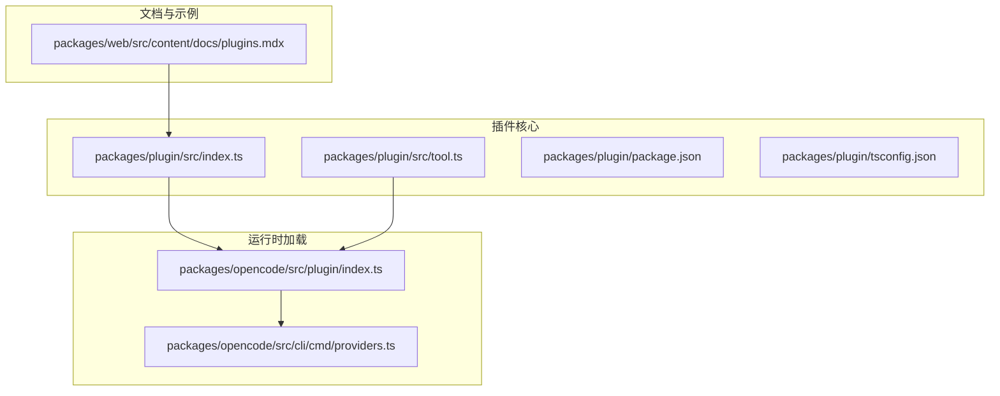
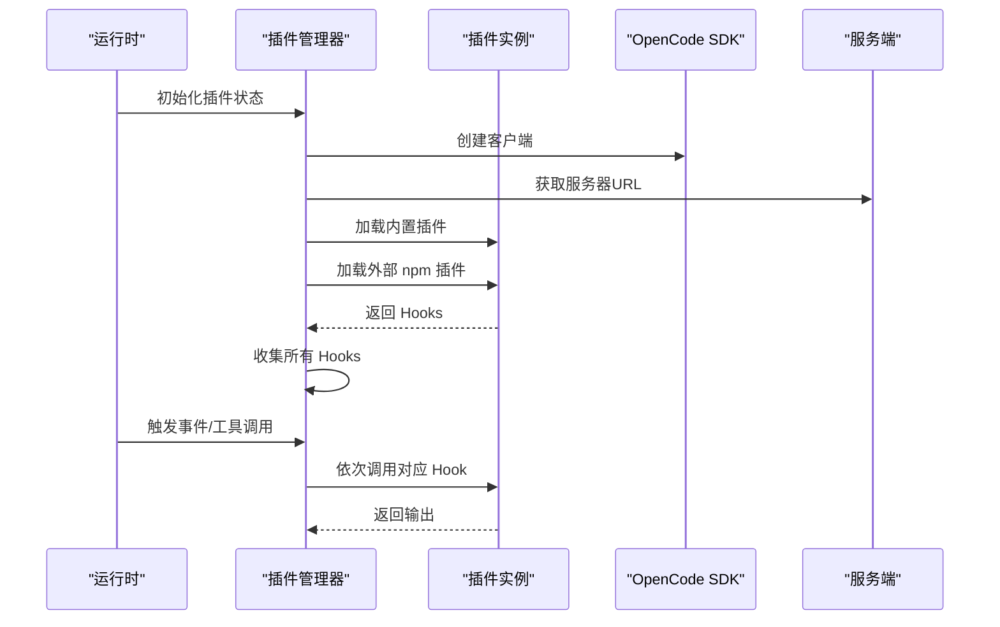
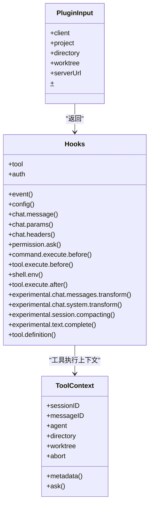
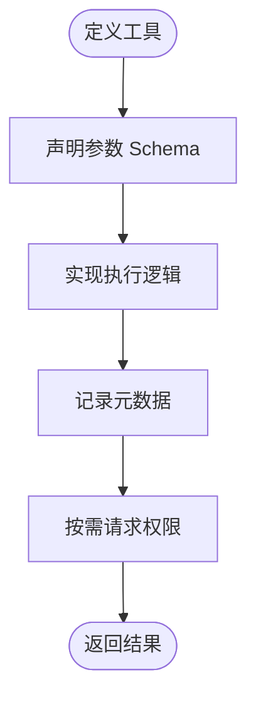
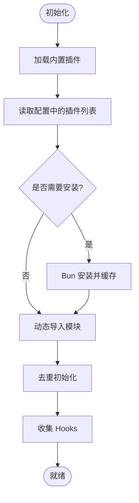
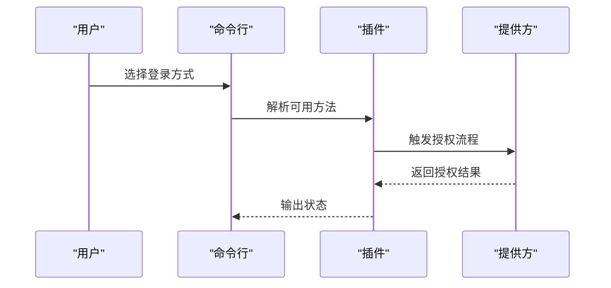
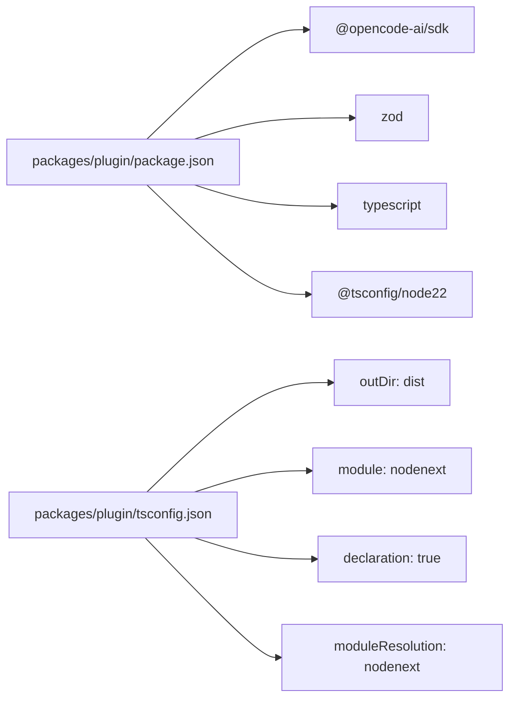
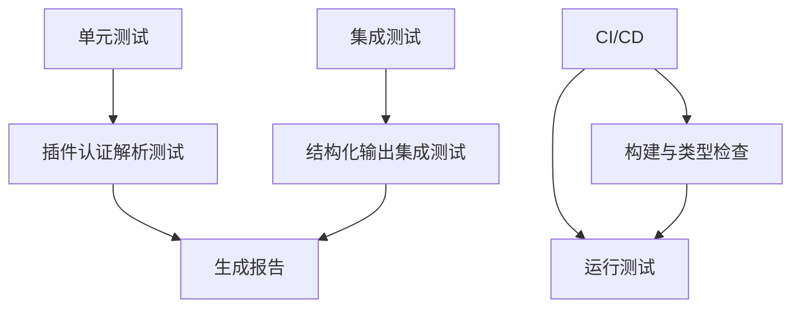

# 插件开发指南

<cite>
**本文档引用的文件**
- [README.md](file://README.md)
- [packages/plugin/src/index.ts](file://packages/plugin/src/index.ts)
- [packages/plugin/src/tool.ts](file://packages/plugin/src/tool.ts)
- [packages/plugin/package.json](file://packages/plugin/package.json)
- [packages/plugin/tsconfig.json](file://packages/plugin/tsconfig.json)
- [packages/opencode/src/plugin/index.ts](file://packages/opencode/src/plugin/index.ts)
- [packages/opencode/src/cli/cmd/providers.ts](file://packages/opencode/src/cli/cmd/providers.ts)
- [packages/opencode/test/cli/plugin-auth-picker.test.ts](file://packages/opencode/test/cli/plugin-auth-picker.test.ts)
- [packages/opencode/test/session/structured-output-integration.test.ts](file://packages/opencode/test/session/structured-output-integration.test.ts)
- [turbo.json](file://turbo.json)
- [sdks/vscode/esbuild.js](file://sdks/vscode/esbuild.js)
- [packages/web/src/content/docs/plugins.mdx](file://packages/web/src/content/docs/plugins.mdx)
</cite>

## 目录
1. [简介](#简介)
2. [项目结构](#项目结构)
3. [核心组件](#核心组件)
4. [架构总览](#架构总览)
5. [详细组件分析](#详细组件分析)
6. [依赖关系分析](#依赖关系分析)
7. [性能考虑](#性能考虑)
8. [测试策略](#测试策略)
9. [打包与分发](#打包与分发)
10. [开发工具链与调试](#开发工具链与调试)
11. [常见开发模式与最佳实践](#常见开发模式与最佳实践)
12. [故障排除指南](#故障排除指南)
13. [结论](#结论)

## 简介
本指南面向希望基于 OpenCode 开发插件的开发者，提供从零开始的完整流程、项目结构、配置与构建、API 使用、测试策略、打包分发、工具链与调试技巧，以及性能优化与并发处理建议。OpenCode 的插件体系通过钩子（Hooks）机制扩展行为，支持事件订阅、工具定义、认证流程与会话参数定制等能力。

## 项目结构
OpenCode 采用多包（monorepo）结构，插件核心位于 packages/plugin，运行时加载逻辑在 packages/opencode 中实现，官方文档示例位于 packages/web/src/content/docs。

**图表来源**
- [packages/plugin/src/index.ts:1-235](file://packages/plugin/src/index.ts#L1-L235)
- [packages/plugin/src/tool.ts:1-39](file://packages/plugin/src/tool.ts#L1-L39)
- [packages/opencode/src/plugin/index.ts:1-150](file://packages/opencode/src/plugin/index.ts#L1-L150)
- [packages/opencode/src/cli/cmd/providers.ts:1-37](file://packages/opencode/src/cli/cmd/providers.ts#L1-L37)
- [packages/web/src/content/docs/plugins.mdx:1-49](file://packages/web/src/content/docs/plugins.mdx#L1-L49)

**章节来源**
- [packages/plugin/src/index.ts:1-235](file://packages/plugin/src/index.ts#L1-L235)
- [packages/plugin/src/tool.ts:1-39](file://packages/plugin/src/tool.ts#L1-L39)
- [packages/plugin/package.json:1-29](file://packages/plugin/package.json#L1-L29)
- [packages/plugin/tsconfig.json:1-13](file://packages/plugin/tsconfig.json#L1-L13)
- [packages/opencode/src/plugin/index.ts:1-150](file://packages/opencode/src/plugin/index.ts#L1-L150)
- [packages/opencode/src/cli/cmd/providers.ts:1-37](file://packages/opencode/src/cli/cmd/providers.ts#L1-L37)
- [packages/web/src/content/docs/plugins.mdx:1-49](file://packages/web/src/content/docs/plugins.mdx#L1-L49)

## 核心组件
- 插件类型与输入
  - PluginInput 提供客户端、项目上下文、工作目录、工作树根路径、服务器 URL 与 Bun Shell 能力。
  - Plugin 是一个异步工厂函数，返回 Hooks 对象。
- 钩子（Hooks）
  - 事件钩子：event、config、chat.*、permission.*、command.*、tool.*、shell.env、experimental.* 等。
  - 工具钩子：tool 定义映射，用于注册自定义工具。
  - 认证钩子：auth，支持 OAuth 与 API 两种授权方式，可定义提示与校验。
- 工具定义
  - tool 函数用于声明工具描述、参数 Schema（Zod）与执行逻辑，返回 ToolDefinition。
  - ToolContext 提供会话 ID、消息 ID、代理、目录、工作树、AbortSignal 与交互能力。

**章节来源**
- [packages/plugin/src/index.ts:20-235](file://packages/plugin/src/index.ts#L20-L235)
- [packages/plugin/src/tool.ts:1-39](file://packages/plugin/src/tool.ts#L1-L39)

## 架构总览
OpenCode 在启动时初始化插件系统，加载内置与外部插件，收集 Hooks 并在运行时触发相应事件。

**图表来源**
- [packages/opencode/src/plugin/index.ts:24-110](file://packages/opencode/src/plugin/index.ts#L24-L110)
- [packages/plugin/src/index.ts:35-36](file://packages/plugin/src/index.ts#L35-L36)

**章节来源**
- [packages/opencode/src/plugin/index.ts:1-150](file://packages/opencode/src/plugin/index.ts#L1-L150)

## 详细组件分析

### 插件类型与钩子体系
- 类型安全的钩子接口覆盖事件、配置、聊天参数与头部、权限请求、命令与工具执行前后、Shell 环境注入、实验性功能与工具定义修改等。
- 认证钩子支持多种授权方式，允许动态提示用户输入并校验条件。

**图表来源**
- [packages/plugin/src/index.ts:20-235](file://packages/plugin/src/index.ts#L20-L235)
- [packages/plugin/src/tool.ts:3-20](file://packages/plugin/src/tool.ts#L3-L20)

**章节来源**
- [packages/plugin/src/index.ts:148-235](file://packages/plugin/src/index.ts#L148-L235)
- [packages/plugin/src/tool.ts:1-39](file://packages/plugin/src/tool.ts#L1-L39)

### 工具定义与参数校验
- 使用 Zod Schema 声明工具参数，确保输入校验与类型安全。
- 执行前可注入元数据与权限请求，执行后可返回标题、输出与元数据。

**图表来源**
- [packages/plugin/src/tool.ts:29-39](file://packages/plugin/src/tool.ts#L29-L39)

**章节来源**
- [packages/plugin/src/tool.ts:1-39](file://packages/plugin/src/tool.ts#L1-L39)

### 插件加载与安装流程
- 内置插件直接导入；外部插件通过 npm 包名与版本解析，使用 Bun 进行安装与缓存。
- 插件导出多个命名函数时去重初始化，避免重复执行。

**图表来源**
- [packages/opencode/src/plugin/index.ts:56-104](file://packages/opencode/src/plugin/index.ts#L56-L104)

**章节来源**
- [packages/opencode/src/plugin/index.ts:1-150](file://packages/opencode/src/plugin/index.ts#L1-L150)

### 认证流程与选择器
- CLI 提供插件认证方法选择，支持多方法与条件提示。
- 单元测试覆盖插件提供者解析与去重逻辑。

**图表来源**
- [packages/opencode/src/cli/cmd/providers.ts:19-37](file://packages/opencode/src/cli/cmd/providers.ts#L19-L37)
- [packages/opencode/test/cli/plugin-auth-picker.test.ts:18-49](file://packages/opencode/test/cli/plugin-auth-picker.test.ts#L18-L49)

**章节来源**
- [packages/opencode/src/cli/cmd/providers.ts:1-37](file://packages/opencode/src/cli/cmd/providers.ts#L1-L37)
- [packages/opencode/test/cli/plugin-auth-picker.test.ts:1-49](file://packages/opencode/test/cli/plugin-auth-picker.test.ts#L1-L49)

## 依赖关系分析
- 插件包依赖 OpenCode SDK 与 Zod，导出入口包括主入口与工具入口。
- 运行时通过 Turbo 管理构建与测试任务，插件包配置了声明文件输出与模块解析策略。

**图表来源**
- [packages/plugin/package.json:1-29](file://packages/plugin/package.json#L1-L29)
- [packages/plugin/tsconfig.json:1-13](file://packages/plugin/tsconfig.json#L1-L13)

**章节来源**
- [packages/plugin/package.json:1-29](file://packages/plugin/package.json#L1-L29)
- [packages/plugin/tsconfig.json:1-13](file://packages/plugin/tsconfig.json#L1-L13)
- [turbo.json:1-21](file://turbo.json#L1-L21)

## 性能考虑
- 插件初始化与加载
  - 使用状态缓存避免重复初始化，优先级与去重策略减少重复工作。
  - 外部插件安装采用 Bun 缓存，降低重复安装成本。
- 事件与钩子调用
  - 顺序串行调用，保持一致性；如需并发可在插件内部自行管理。
- 工具执行
  - 使用 AbortSignal 控制长耗时任务；合理拆分工具以避免阻塞。
- 日志与诊断
  - 使用结构化日志定位问题，避免频繁 I/O。

[本节为通用指导，无需特定文件来源]

## 测试策略
- 单元测试
  - 针对插件提供者解析与去重逻辑进行断言，覆盖边界情况。
- 集成测试
  - 基于会话与结构化输出的集成测试，验证与模型交互的稳定性。
- 测试运行
  - 使用 Bun 测试运行器，结合 Turbo 管理任务依赖。

**图表来源**
- [packages/opencode/test/cli/plugin-auth-picker.test.ts:1-49](file://packages/opencode/test/cli/plugin-auth-picker.test.ts#L1-L49)
- [packages/opencode/test/session/structured-output-integration.test.ts:1-42](file://packages/opencode/test/session/structured-output-integration.test.ts#L1-L42)

**章节来源**
- [packages/opencode/test/cli/plugin-auth-picker.test.ts:1-49](file://packages/opencode/test/cli/plugin-auth-picker.test.ts#L1-L49)
- [packages/opencode/test/session/structured-output-integration.test.ts:1-42](file://packages/opencode/test/session/structured-output-integration.test.ts#L1-L42)

## 打包与分发
- 构建产物
  - 插件包通过 TypeScript 编译输出到 dist 目录，包含声明文件。
- 分发渠道
  - 通过 npm 发布，支持作用域包与常规包。
- 文档与示例
  - 官方文档提供插件使用、事件列表与示例，便于快速上手。

**章节来源**
- [packages/plugin/package.json:15-17](file://packages/plugin/package.json#L15-L17)
- [packages/plugin/tsconfig.json:4-10](file://packages/plugin/tsconfig.json#L4-L10)
- [packages/web/src/content/docs/plugins.mdx:1-49](file://packages/web/src/content/docs/plugins.mdx#L1-L49)

## 开发工具链与调试
- 构建与打包
  - 使用 esbuild 为 VS Code 扩展提供快速打包与监听能力。
- IDE 配置
  - 使用 TypeScript 与 NodeNext 模块解析，启用声明文件输出。
- 调试技巧
  - 利用结构化日志与错误格式化输出定位问题。
  - 在本地开发模式下提升日志级别以便排查。

**章节来源**
- [sdks/vscode/esbuild.js:1-54](file://sdks/vscode/esbuild.js#L1-L54)
- [packages/plugin/tsconfig.json:1-13](file://packages/plugin/tsconfig.json#L1-L13)
- [packages/opencode/src/index.ts:58-86](file://packages/opencode/src/index.ts#L58-L86)

## 常见开发模式与最佳实践
- 事件驱动
  - 通过事件钩子响应会话状态变化，避免侵入核心逻辑。
- 工具优先
  - 将复杂任务拆分为独立工具，使用 Zod Schema 明确参数约束。
- 权限最小化
  - 在工具执行前请求必要权限，避免越权操作。
- 实验性功能
  - 使用 experimental.* 钩子探索新能力，注意兼容性与回退策略。
- 文档与示例
  - 参考官方文档示例，遵循一致的插件结构与命名约定。

[本节为通用指导，无需特定文件来源]

## 故障排除指南
- 插件加载失败
  - 检查 npm 包安装与缓存路径，确认版本解析正确。
- 认证流程异常
  - 核对 auth 方法定义与提示逻辑，确保条件与校验函数正确。
- 工具执行超时
  - 引入 AbortSignal 控制生命周期，合理设置超时与重试。
- 日志定位
  - 查看结构化日志输出，结合错误格式化信息定位根因。

**章节来源**
- [packages/opencode/src/plugin/index.ts:66-104](file://packages/opencode/src/plugin/index.ts#L66-L104)
- [packages/opencode/src/cli/cmd/providers.ts:19-37](file://packages/opencode/src/cli/cmd/providers.ts#L19-L37)
- [packages/opencode/src/index.ts:170-206](file://packages/opencode/src/index.ts#L170-L206)

## 结论
通过本文档，开发者可以基于 OpenCode 的插件体系完成从项目搭建、API 使用、测试到打包分发的全流程实践。建议在实际开发中遵循事件驱动、工具优先与权限最小化的原则，并充分利用官方文档与测试用例作为参考与保障。