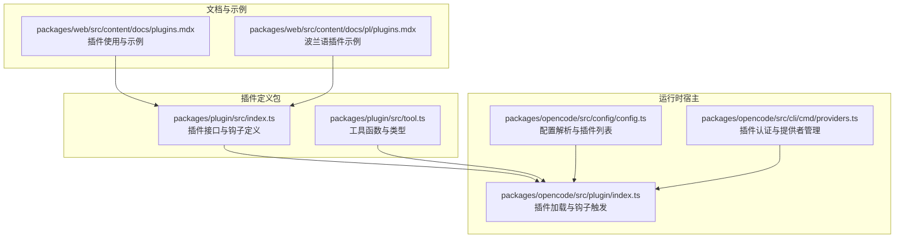
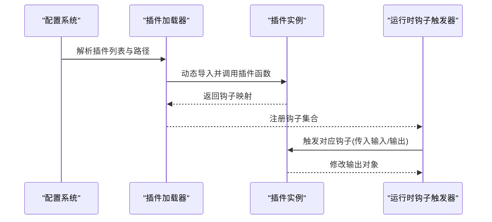
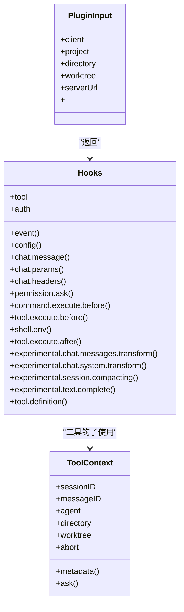
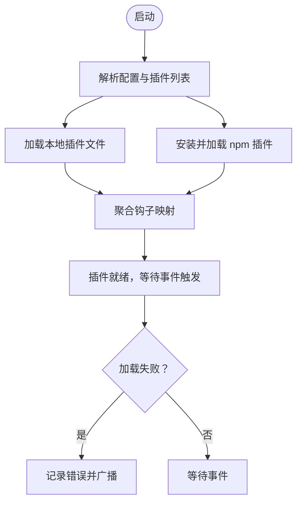
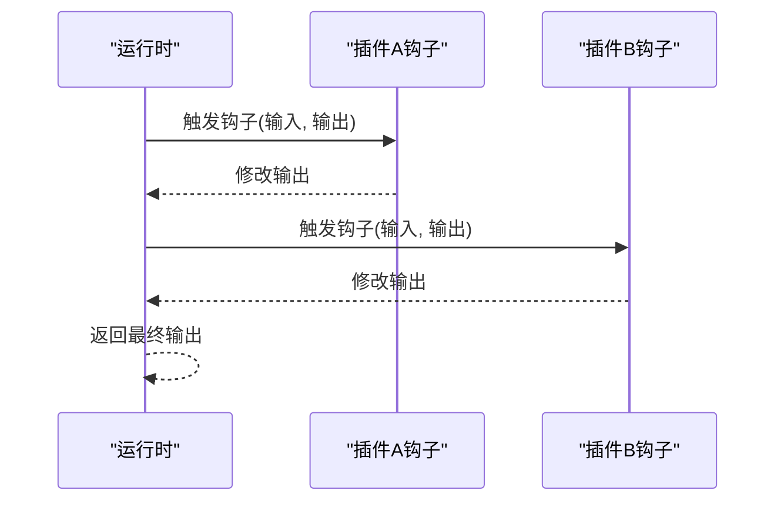
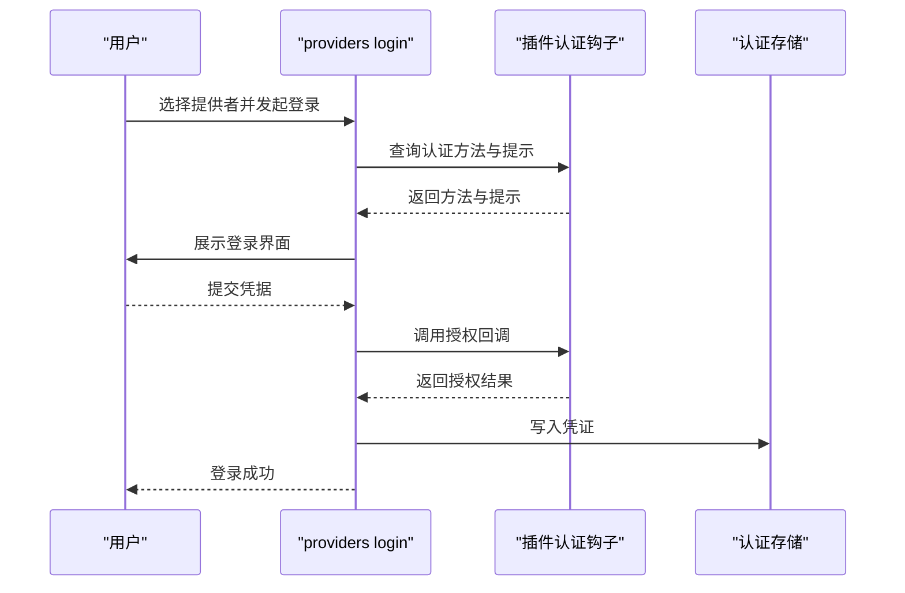
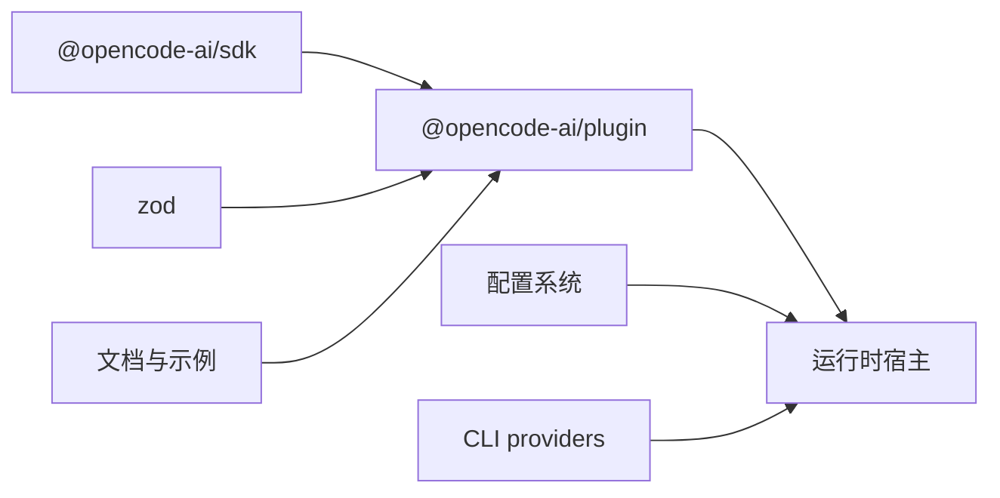

# 插件架构设计

<cite>
**本文档引用的文件**
- [packages/plugin/src/index.ts](file://packages/plugin/src/index.ts)
- [packages/plugin/src/tool.ts](file://packages/plugin/src/tool.ts)
- [packages/opencode/src/plugin/index.ts](file://packages/opencode/src/plugin/index.ts)
- [packages/opencode/src/cli/cmd/providers.ts](file://packages/opencode/src/cli/cmd/providers.ts)
- [packages/opencode/src/config/config.ts](file://packages/opencode/src/config/config.ts)
- [packages/web/src/content/docs/plugins.mdx](file://packages/web/src/content/docs/plugins.mdx)
- [packages/web/src/content/docs/pl/plugins.mdx](file://packages/web/src/content/docs/pl/plugins.mdx)
- [packages/app/e2e/status/status-popover.spec.ts](file://packages/app/e2e/status/status-popover.spec.ts)
</cite>

## 目录
1. [引言](#引言)
2. [项目结构](#项目结构)
3. [核心组件](#核心组件)
4. [架构总览](#架构总览)
5. [详细组件分析](#详细组件分析)
6. [依赖关系分析](#依赖关系分析)
7. [性能考虑](#性能考虑)
8. [故障排除指南](#故障排除指南)
9. [结论](#结论)
10. [附录](#附录)

## 引言
本文件系统性阐述 OpenCode 插件架构的设计理念、整体架构、扩展机制与实现细节。重点覆盖插件生命周期、加载机制、依赖管理、事件驱动与钩子系统、插件间通信、脚本引擎集成、动态加载与热重载能力、开发规范与最佳实践、调试与发布流程，以及常见问题与性能优化建议。目标是帮助开发者快速理解并高效构建高质量的 OpenCode 插件。

## 项目结构
OpenCode 的插件体系由“插件定义包”和“运行时宿主”两部分组成：
- 插件定义包：提供类型安全的插件接口、钩子定义、工具函数等，位于 packages/plugin。
- 运行时宿主：负责插件发现、加载、生命周期管理、事件分发与钩子触发，位于 packages/opencode。

**图表来源**
- [packages/plugin/src/index.ts:1-235](file://packages/plugin/src/index.ts#L1-L235)
- [packages/plugin/src/tool.ts:1-39](file://packages/plugin/src/tool.ts#L1-L39)
- [packages/opencode/src/plugin/index.ts:89-132](file://packages/opencode/src/plugin/index.ts#L89-L132)
- [packages/opencode/src/config/config.ts:164-496](file://packages/opencode/src/config/config.ts#L164-L496)
- [packages/opencode/src/cli/cmd/providers.ts:1-476](file://packages/opencode/src/cli/cmd/providers.ts#L1-L476)
- [packages/web/src/content/docs/plugins.mdx:1-49](file://packages/web/src/content/docs/plugins.mdx#L1-L49)

**章节来源**
- [packages/plugin/src/index.ts:1-235](file://packages/plugin/src/index.ts#L1-L235)
- [packages/plugin/src/tool.ts:1-39](file://packages/plugin/src/tool.ts#L1-L39)
- [packages/opencode/src/plugin/index.ts:89-132](file://packages/opencode/src/plugin/index.ts#L89-L132)
- [packages/opencode/src/config/config.ts:164-496](file://packages/opencode/src/config/config.ts#L164-L496)
- [packages/opencode/src/cli/cmd/providers.ts:1-476](file://packages/opencode/src/cli/cmd/providers.ts#L1-L476)
- [packages/web/src/content/docs/plugins.mdx:1-49](file://packages/web/src/content/docs/plugins.mdx#L1-L49)

## 核心组件
- 插件接口与钩子定义：定义了插件的输入上下文、认证钩子、事件钩子（如 chat.message、chat.params 等）、工具钩子、实验性钩子等，确保类型安全与可扩展性。
- 工具函数：提供工具定义、参数校验、执行上下文（会话、消息、工作树、中止信号、权限请求等）。
- 插件加载器：负责从本地与全局目录、npm 包加载插件模块，聚合钩子并处理加载异常。
- 钩子触发器：在运行时按序遍历所有已加载插件的对应钩子，传递输入输出对象，实现事件驱动的扩展点。
- 认证与提供者：CLI 提供插件认证入口，支持 OAuth 与 API Key 两种方式，并与运行时认证存储交互。
- 配置与安装：通过配置文件声明插件列表，启动时自动安装 npm 插件并缓存依赖。

**章节来源**
- [packages/plugin/src/index.ts:26-235](file://packages/plugin/src/index.ts#L26-L235)
- [packages/plugin/src/tool.ts:3-39](file://packages/plugin/src/tool.ts#L3-L39)
- [packages/opencode/src/plugin/index.ts:89-132](file://packages/opencode/src/plugin/index.ts#L89-L132)
- [packages/opencode/src/cli/cmd/providers.ts:19-166](file://packages/opencode/src/cli/cmd/providers.ts#L19-L166)
- [packages/opencode/src/config/config.ts:164-496](file://packages/opencode/src/config/config.ts#L164-L496)

## 架构总览
OpenCode 插件架构采用“声明式钩子 + 事件驱动”的设计。插件以函数形式导出，接收统一的输入上下文，返回钩子映射。运行时在关键事件发生时调用相应钩子，允许插件对行为进行拦截、修改或扩展。

**图表来源**
- [packages/opencode/src/config/config.ts:164-496](file://packages/opencode/src/config/config.ts#L164-L496)
- [packages/opencode/src/plugin/index.ts:89-132](file://packages/opencode/src/plugin/index.ts#L89-L132)

## 详细组件分析

### 插件接口与钩子系统
- 输入上下文：包含客户端、项目信息、工作目录、服务器地址、Bun Shell 环境等，为插件提供一致的运行环境。
- 钩子类型：
  - 事件钩子：订阅系统事件（如 chat.message、permission.ask、tool.execute.before/after 等）。
  - 参数钩子：修改 LLM 调用参数（温度、采样策略、头部信息等）。
  - 工具钩子：注册工具描述与执行逻辑，支持参数校验与执行上下文。
  - 实验性钩子：提供未来特性（如会话压缩提示定制、文本补全、消息转换等）。
  - 认证钩子：声明提供者 ID 与登录方式（OAuth 或 API Key），支持条件提示与回调。

**图表来源**
- [packages/plugin/src/index.ts:26-235](file://packages/plugin/src/index.ts#L26-L235)
- [packages/plugin/src/tool.ts:3-39](file://packages/plugin/src/tool.ts#L3-L39)

**章节来源**
- [packages/plugin/src/index.ts:26-235](file://packages/plugin/src/index.ts#L26-L235)
- [packages/plugin/src/tool.ts:3-39](file://packages/plugin/src/tool.ts#L3-L39)

### 插件加载与生命周期
- 发现与加载：
  - 本地文件：从项目级与全局插件目录自动加载。
  - npm 包：在配置中声明后，启动时使用 Bun 自动安装并缓存依赖。
- 生命周期：
  - 初始化：插件函数被调用，返回钩子映射。
  - 运行期：根据事件触发钩子，按注册顺序执行。
  - 错误处理：加载失败时记录错误并通过事件总线广播。

**图表来源**
- [packages/opencode/src/config/config.ts:164-496](file://packages/opencode/src/config/config.ts#L164-L496)
- [packages/opencode/src/plugin/index.ts:89-132](file://packages/opencode/src/plugin/index.ts#L89-L132)

**章节来源**
- [packages/opencode/src/config/config.ts:164-496](file://packages/opencode/src/config/config.ts#L164-L496)
- [packages/opencode/src/plugin/index.ts:89-132](file://packages/opencode/src/plugin/index.ts#L89-L132)

### 事件驱动与钩子触发
- 触发机制：运行时维护钩子集合，当特定事件发生时，按序调用每个插件的对应钩子，允许插件修改输出对象。
- 并发与顺序：按插件注册顺序依次执行，确保行为可预测。
- 类型安全：通过 TypeScript 定义钩子签名，保证输入输出结构正确。

**图表来源**
- [packages/opencode/src/plugin/index.ts:112-127](file://packages/opencode/src/plugin/index.ts#L112-L127)

**章节来源**
- [packages/opencode/src/plugin/index.ts:112-127](file://packages/opencode/src/plugin/index.ts#L112-L127)

### 认证与提供者管理
- 插件认证钩子：声明提供者 ID 与多种登录方式（OAuth、API Key），支持条件提示与回调。
- CLI 集成：命令行提供 providers 子命令，支持列出、登录、登出凭证；自动识别插件提供的认证方式。
- 凭证存储：登录成功后写入认证存储，后续请求可复用。

**图表来源**
- [packages/opencode/src/cli/cmd/providers.ts:19-166](file://packages/opencode/src/cli/cmd/providers.ts#L19-L166)

**章节来源**
- [packages/opencode/src/cli/cmd/providers.ts:19-166](file://packages/opencode/src/cli/cmd/providers.ts#L19-L166)

### 工具系统与参数校验
- 工具定义：通过工具函数声明描述、参数 Schema 与执行逻辑，支持 Zod 参数校验。
- 执行上下文：提供会话、消息、代理、工作目录、工作树、中止信号、元数据与权限请求等能力。
- 钩子配合：工具执行前后可被钩子拦截，用于参数修改、输出增强与元数据收集。

**章节来源**
- [packages/plugin/src/tool.ts:3-39](file://packages/plugin/src/tool.ts#L3-L39)
- [packages/plugin/src/index.ts:151-153](file://packages/plugin/src/index.ts#L151-L153)

### 实验性特性与扩展点
- 会话压缩定制：允许插件替换默认压缩提示或追加上下文。
- 文本补全与消息/系统提示转换：为高级场景提供更细粒度的控制。
- 工具定义增强：允许插件修改工具描述与参数结构，影响 LLM 对工具的认知。

**章节来源**
- [packages/plugin/src/index.ts:200-234](file://packages/plugin/src/index.ts#L200-L234)

## 依赖关系分析
- 插件定义包依赖 SDK 与 Zod，提供类型与参数校验能力。
- 运行时宿主依赖配置系统、事件总线、认证模块与 CLI 子系统。
- 文档与示例为插件生态提供使用指导与最佳实践参考。

**图表来源**
- [packages/plugin/src/index.ts:1-13](file://packages/plugin/src/index.ts#L1-L13)
- [packages/plugin/src/tool.ts:1-1](file://packages/plugin/src/tool.ts#L1-L1)
- [packages/opencode/src/config/config.ts:164-496](file://packages/opencode/src/config/config.ts#L164-L496)
- [packages/opencode/src/cli/cmd/providers.ts:1-14](file://packages/opencode/src/cli/cmd/providers.ts#L1-L14)

**章节来源**
- [packages/plugin/src/index.ts:1-13](file://packages/plugin/src/index.ts#L1-L13)
- [packages/plugin/src/tool.ts:1-1](file://packages/plugin/src/tool.ts#L1-L1)
- [packages/opencode/src/config/config.ts:164-496](file://packages/opencode/src/config/config.ts#L164-L496)
- [packages/opencode/src/cli/cmd/providers.ts:1-14](file://packages/opencode/src/cli/cmd/providers.ts#L1-L14)

## 性能考虑
- 插件加载：优先使用缓存的 npm 依赖，减少启动时间；避免在钩子中执行阻塞操作。
- 钩子执行：保持钩子轻量，避免长耗时计算；必要时使用异步与中止信号。
- 工具执行：合理设置超时与中止，防止长时间占用资源。
- 事件风暴：对高频事件（如消息更新）进行节流或去抖，降低插件负担。

## 故障排除指南
- 插件加载失败：检查插件路径与权限，确认依赖安装完成；查看错误日志并通过事件总线定位问题。
- 认证失败：核对插件认证方法与提示配置，确认回调逻辑正确；检查凭证存储状态。
- 钩子无响应：确认插件已正确注册钩子；检查事件名称与签名匹配。
- CLI 无法识别插件提供者：确认插件返回的认证钩子 provider 字段与配置一致。

**章节来源**
- [packages/opencode/src/plugin/index.ts:95-103](file://packages/opencode/src/plugin/index.ts#L95-L103)
- [packages/opencode/src/cli/cmd/providers.ts:19-166](file://packages/opencode/src/cli/cmd/providers.ts#L19-L166)

## 结论
OpenCode 插件架构以类型安全的钩子系统为核心，结合事件驱动与认证扩展，提供了强大的可扩展性与可控性。通过清晰的生命周期管理、健壮的错误处理与完善的 CLI 支持，开发者可以高效地构建与维护高质量插件，满足多样化的业务需求。

## 附录

### 插件开发规范与最佳实践
- 使用类型安全的钩子签名，确保输入输出结构一致。
- 将复杂逻辑拆分为多个小钩子，便于组合与测试。
- 在工具执行前后钩子中谨慎修改参数与输出，避免破坏默认行为。
- 为认证钩子提供清晰的提示与条件判断，提升用户体验。
- 编写单元测试与端到端测试，验证插件在不同事件下的行为。

### API 接口概览
- 插件函数：接收统一输入上下文，返回钩子映射。
- 钩子类型：事件、参数、工具、认证、实验性等。
- 工具函数：描述、Schema、执行逻辑与上下文能力。

**章节来源**
- [packages/plugin/src/index.ts:35-235](file://packages/plugin/src/index.ts#L35-L235)
- [packages/plugin/src/tool.ts:29-39](file://packages/plugin/src/tool.ts#L29-L39)

### 开发工具链与调试
- 使用 Bun 作为脚本引擎与包管理器，支持热重载与快速迭代。
- 通过 CLI providers 命令调试认证流程与提供者配置。
- 利用文档示例快速上手，参考多语言文档与社区插件。

**章节来源**
- [packages/opencode/src/cli/cmd/providers.ts:250-449](file://packages/opencode/src/cli/cmd/providers.ts#L250-L449)
- [packages/web/src/content/docs/plugins.mdx:1-49](file://packages/web/src/content/docs/plugins.mdx#L1-L49)

### 发布流程
- 在配置文件中声明插件依赖，启动时自动安装与缓存。
- 通过 CI/CD 流水线进行打包与测试，确保兼容性与稳定性。
- 维护插件版本与变更日志，遵循语义化版本管理。

**章节来源**
- [packages/opencode/src/config/config.ts:164-496](file://packages/opencode/src/config/config.ts#L164-L496)

### 实际插件示例
- 会话压缩定制：通过实验性钩子替换或补充压缩提示。
- 通知发送：订阅消息事件，在合适时机推送通知。
- 权限请求：在工具执行前弹出权限对话框，确保合规使用。

**章节来源**
- [packages/web/src/content/docs/plugins.mdx:212-219](file://packages/web/src/content/docs/plugins.mdx#L212-L219)
- [packages/web/src/content/docs/pl/plugins.mdx:363-382](file://packages/web/src/content/docs/pl/plugins.mdx#L363-L382)

### 常见问题与解决方案
- 插件未生效：确认插件路径与配置，检查钩子名称与签名。
- 认证流程中断：检查回调逻辑与网络连通性，确保凭证正确写入。
- 钩子冲突：避免多个插件对同一事件做相互矛盾的修改，采用明确的优先级策略。

**章节来源**
- [packages/opencode/src/plugin/index.ts:112-127](file://packages/opencode/src/plugin/index.ts#L112-L127)
- [packages/opencode/src/cli/cmd/providers.ts:19-166](file://packages/opencode/src/cli/cmd/providers.ts#L19-L166)