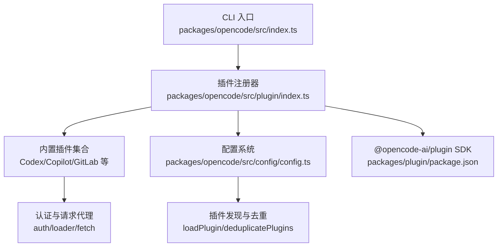
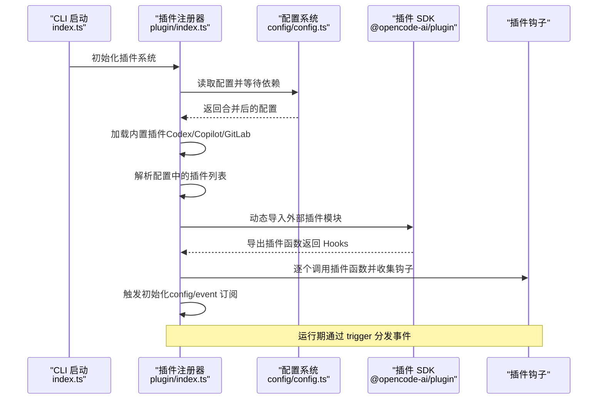
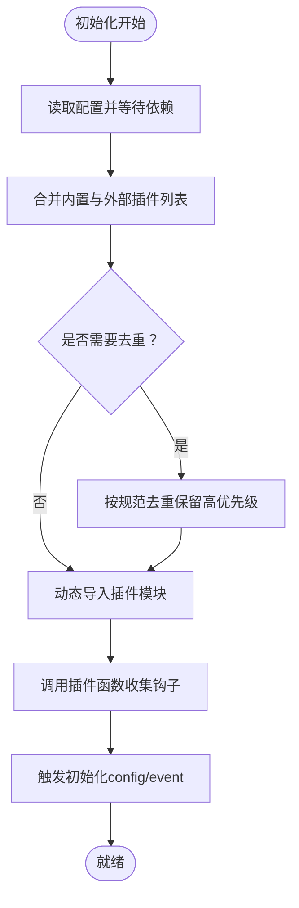
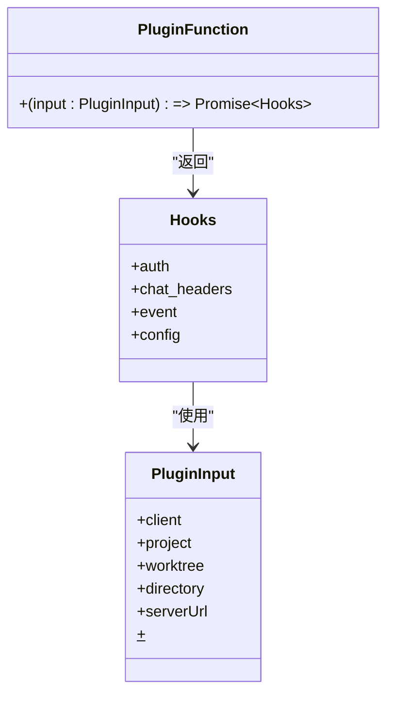
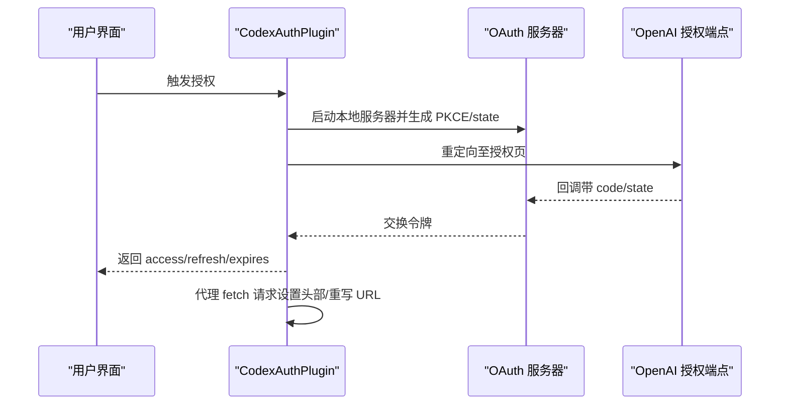
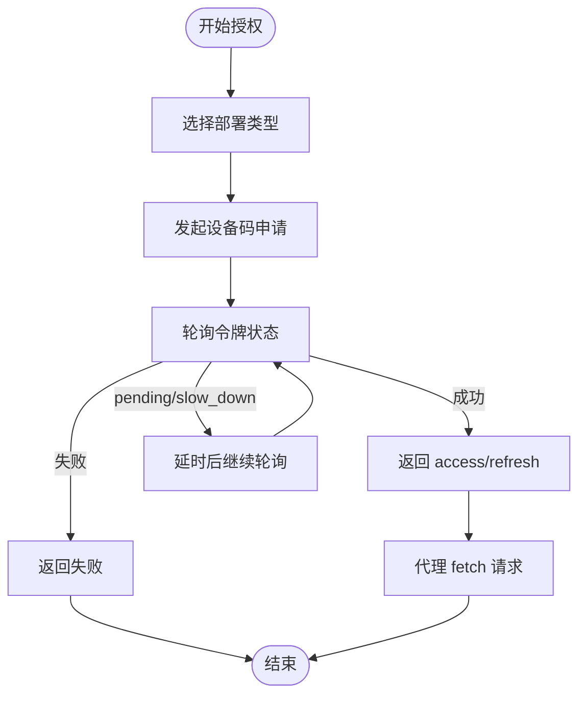
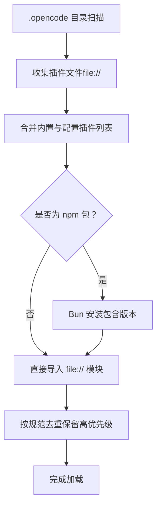
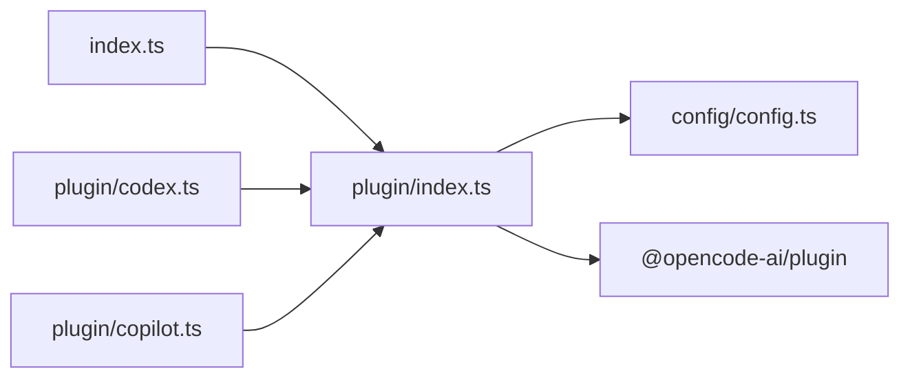

# 插件系统设计

<cite>
**本文档引用的文件**
- [packages/opencode/src/plugin/index.ts](file://packages/opencode/src/plugin/index.ts)
- [packages/opencode/src/plugin/codex.ts](file://packages/opencode/src/plugin/codex.ts)
- [packages/opencode/src/plugin/copilot.ts](file://packages/opencode/src/plugin/copilot.ts)
- [packages/opencode/src/config/config.ts](file://packages/opencode/src/config/config.ts)
- [packages/opencode/src/index.ts](file://packages/opencode/src/index.ts)
- [packages/plugin/package.json](file://packages/plugin/package.json)
</cite>

## 目录
1. [引言](#引言)
2. [项目结构](#项目结构)
3. [核心组件](#核心组件)
4. [架构总览](#架构总览)
5. [详细组件分析](#详细组件分析)
6. [依赖分析](#依赖分析)
7. [性能考虑](#性能考虑)
8. [故障排除指南](#故障排除指南)
9. [结论](#结论)
10. [附录](#附录)

## 引言
本文件系统性阐述 OpenCode 插件系统的设计理念、架构边界与组件关系，覆盖插件注册机制、生命周期管理、依赖注入、接口规范与扩展点、分类体系与权限控制、发现算法、版本兼容与冲突解决策略，并提供架构图、组件交互流程与时序图等可视化内容。目标是帮助开发者在理解现有实现的基础上进行扩展与维护。

## 项目结构
OpenCode 的插件系统主要由以下模块构成：
- 插件运行时与注册器：负责加载内置与外部插件、收集钩子、触发事件与初始化配置。
- 内置插件示例：提供认证与请求代理能力（如 Codex 与 Copilot 插件）。
- 配置系统：解析多源配置，合并插件列表，处理依赖安装与去重。
- CLI 入口：应用启动时初始化插件系统。

**图表来源**
- [packages/opencode/src/index.ts:1-214](file://packages/opencode/src/index.ts#L1-L214)
- [packages/opencode/src/plugin/index.ts:1-150](file://packages/opencode/src/plugin/index.ts#L1-L150)
- [packages/opencode/src/config/config.ts:497-561](file://packages/opencode/src/config/config.ts#L497-L561)
- [packages/plugin/package.json:1-29](file://packages/plugin/package.json#L1-L29)

**章节来源**
- [packages/opencode/src/index.ts:1-214](file://packages/opencode/src/index.ts#L1-L214)
- [packages/opencode/src/plugin/index.ts:1-150](file://packages/opencode/src/plugin/index.ts#L1-L150)
- [packages/opencode/src/config/config.ts:497-561](file://packages/opencode/src/config/config.ts#L497-L561)
- [packages/plugin/package.json:1-29](file://packages/plugin/package.json#L1-L29)

## 核心组件
- 插件注册器（Plugin Namespace）
  - 负责构建 PluginInput 输入上下文，加载内置与外部插件，收集钩子数组，提供触发器与初始化方法。
  - 支持默认内置插件列表与可配置插件列表的合并与去重。
- 内置插件
  - CodexAuthPlugin：提供 OpenAI ChatGPT Pro/Plus 的 OAuth 授权与请求代理。
  - CopilotAuthPlugin：提供 GitHub Copilot（含企业版）的设备码授权与请求代理。
- 配置系统（Config）
  - 多源配置合并（远程 .well-known、全局、项目、.opencode 目录、内联），并支持插件列表的去重与依赖安装。
- SDK 包（@opencode-ai/plugin）
  - 定义插件接口规范（Hooks、PluginInput）与导出入口，供插件实现遵循。

**章节来源**
- [packages/opencode/src/plugin/index.ts:16-150](file://packages/opencode/src/plugin/index.ts#L16-L150)
- [packages/opencode/src/plugin/codex.ts:353-628](file://packages/opencode/src/plugin/codex.ts#L353-L628)
- [packages/opencode/src/plugin/copilot.ts:21-347](file://packages/opencode/src/plugin/copilot.ts#L21-L347)
- [packages/opencode/src/config/config.ts:497-561](file://packages/opencode/src/config/config.ts#L497-L561)
- [packages/plugin/package.json:11-14](file://packages/plugin/package.json#L11-L14)

## 架构总览
插件系统采用“运行时注册 + 钩子分发”的模式。启动阶段通过配置系统读取插件列表，按优先级合并内置与外部插件；运行阶段通过统一触发器向所有已注册钩子广播事件或调用特定钩子。

**图表来源**
- [packages/opencode/src/index.ts:1-214](file://packages/opencode/src/index.ts#L1-L214)
- [packages/opencode/src/plugin/index.ts:24-110](file://packages/opencode/src/plugin/index.ts#L24-L110)
- [packages/opencode/src/config/config.ts:78-266](file://packages/opencode/src/config/config.ts#L78-L266)
- [packages/plugin/package.json:11-14](file://packages/plugin/package.json#L11-L14)

## 详细组件分析

### 插件注册器与生命周期
- 输入上下文（PluginInput）
  - 提供客户端、项目路径、工作树、目录、服务器 URL、Bun 工具等运行时依赖。
- 生命周期
  - 初始化：收集钩子、订阅事件总线、调用各钩子的 config 回调。
  - 运行期：trigger 按名称分发事件给所有钩子，支持链式输入输出传递。
- 冲突解决
  - 对外部插件模块使用 Set 去重函数引用，避免同名导出重复初始化。

**图表来源**
- [packages/opencode/src/plugin/index.ts:24-110](file://packages/opencode/src/plugin/index.ts#L24-L110)
- [packages/opencode/src/config/config.ts:543-561](file://packages/opencode/src/config/config.ts#L543-L561)

**章节来源**
- [packages/opencode/src/plugin/index.ts:24-110](file://packages/opencode/src/plugin/index.ts#L24-L110)
- [packages/opencode/src/config/config.ts:543-561](file://packages/opencode/src/config/config.ts#L543-L561)

### 插件接口规范与扩展点
- 插件函数签名
  - 接收 PluginInput 并返回 Hooks 对象。
- 钩子类型
  - auth：提供认证方式与请求代理逻辑。
  - chat.headers：修改聊天请求头。
  - event：订阅全局事件。
  - config：接收配置对象。
- 扩展点
  - 可通过导出多个命名函数以支持同一模块同时暴露多个插件实例（注册器内部去重）。

**图表来源**
- [packages/opencode/src/plugin/index.ts:1-150](file://packages/opencode/src/plugin/index.ts#L1-L150)
- [packages/plugin/package.json:11-14](file://packages/plugin/package.json#L11-L14)

**章节来源**
- [packages/opencode/src/plugin/index.ts:1-150](file://packages/opencode/src/plugin/index.ts#L1-L150)
- [packages/plugin/package.json:11-14](file://packages/plugin/package.json#L11-L14)

### 内置插件：CodexAuthPlugin
- 认证方式
  - 支持浏览器自动授权与无头设备码授权两种方式。
  - 使用 PKCE/OAuth 流程获取访问令牌与刷新令牌。
- 请求代理
  - 在 auth.loader 中为 provider 模型过滤与增强能力。
  - 在 fetch 中移除占位密钥、设置 Bearer 令牌与组织标识、重写到 Codex API 端点。
- 会话与回调
  - 内置本地 OAuth 服务器处理回调、超时与错误页面。

**图表来源**
- [packages/opencode/src/plugin/codex.ts:353-628](file://packages/opencode/src/plugin/codex.ts#L353-L628)

**章节来源**
- [packages/opencode/src/plugin/codex.ts:353-628](file://packages/opencode/src/plugin/codex.ts#L353-L628)

### 内置插件：CopilotAuthPlugin
- 认证方式
  - 支持 GitHub.com 与 GitHub Enterprise 两种部署类型。
  - 设备码授权流程，轮询获取访问令牌。
- 请求代理
  - 根据消息内容判断视觉/代理场景，设置相应请求头。
  - 自适应 Copilot API 基础 URL（企业版域名）。
- 会话识别
  - 通过查询会话信息识别子代理场景，标记 x-initiator。

**图表来源**
- [packages/opencode/src/plugin/copilot.ts:21-347](file://packages/opencode/src/plugin/copilot.ts#L21-L347)

**章节来源**
- [packages/opencode/src/plugin/copilot.ts:21-347](file://packages/opencode/src/plugin/copilot.ts#L21-L347)

### 插件发现与版本兼容
- 发现算法
  - 从 .opencode 目录扫描 {plugin,plugins} 下的 TypeScript/JavaScript 文件，转换为 file:// URL 列表。
- 版本与安装
  - 外部插件支持 npm 包名与版本号（@ 后缀），通过 Bun 安装；若未显式指定版本则使用 latest。
- 冲突解决
  - 基于规范化的插件名进行去重，后出现的条目优先（高优先级）。

**图表来源**
- [packages/opencode/src/config/config.ts:497-509](file://packages/opencode/src/config/config.ts#L497-L509)
- [packages/opencode/src/config/config.ts:511-561](file://packages/opencode/src/config/config.ts#L511-L561)
- [packages/opencode/src/plugin/index.ts:62-104](file://packages/opencode/src/plugin/index.ts#L62-L104)

**章节来源**
- [packages/opencode/src/config/config.ts:497-509](file://packages/opencode/src/config/config.ts#L497-L509)
- [packages/opencode/src/config/config.ts:511-561](file://packages/opencode/src/config/config.ts#L511-L561)
- [packages/opencode/src/plugin/index.ts:62-104](file://packages/opencode/src/plugin/index.ts#L62-L104)

### 权限控制机制
- 配置驱动的权限规则
  - 支持对 read/edit/glob/grep/list/bash/task/external_directory/webfetch/websearch/codesearch/lsp/skill 等操作定义 ask/allow/deny。
  - 支持字符串简写与对象映射，保持原始键顺序。
- 与插件的关系
  - 插件可通过钩子暴露能力（如工具调用），但具体执行需经权限系统判定。
- 建议实践
  - 将敏感操作封装为插件工具并通过权限系统集中管控。

**章节来源**
- [packages/opencode/src/config/config.ts:626-692](file://packages/opencode/src/config/config.ts#L626-L692)

## 依赖分析
- 组件耦合
  - 插件注册器依赖配置系统与 SDK；内置插件依赖注册器提供的 PluginInput。
- 外部依赖
  - @opencode-ai/plugin 提供插件接口定义与导出入口。
  - Bun 用于动态安装与运行外部插件。
- 循环依赖
  - 当前实现中未见循环依赖迹象；注册器仅单向依赖配置与 SDK。

**图表来源**
- [packages/opencode/src/index.ts:1-214](file://packages/opencode/src/index.ts#L1-L214)
- [packages/opencode/src/plugin/index.ts:1-150](file://packages/opencode/src/plugin/index.ts#L1-L150)
- [packages/opencode/src/config/config.ts:1-800](file://packages/opencode/src/config/config.ts#L1-L800)
- [packages/plugin/package.json:1-29](file://packages/plugin/package.json#L1-L29)

**章节来源**
- [packages/opencode/src/index.ts:1-214](file://packages/opencode/src/index.ts#L1-L214)
- [packages/opencode/src/plugin/index.ts:1-150](file://packages/opencode/src/plugin/index.ts#L1-L150)
- [packages/opencode/src/config/config.ts:1-800](file://packages/opencode/src/config/config.ts#L1-L800)
- [packages/plugin/package.json:1-29](file://packages/plugin/package.json#L1-L29)

## 性能考虑
- 插件加载
  - 外部插件通过 Bun 安装与动态导入，建议在 CI 或首次启动时预热缓存以减少延迟。
- 并发与去重
  - 注册器对模块导出函数使用 Set 去重，避免重复初始化带来的开销。
- 事件分发
  - trigger 串行遍历钩子，若存在大量钩子应关注单次调用的耗时；必要时可引入异步并行与超时控制。

## 故障排除指南
- 插件安装失败
  - 现象：外部插件安装报错并发布错误事件。
  - 处理：检查网络、代理与包名版本；查看日志定位具体原因。
- 插件加载失败
  - 现象：动态导入抛错并记录错误。
  - 处理：确认模块导出符合规范（返回 Hooks 函数）；检查路径与权限。
- 认证流程异常
  - Codex：检查本地 OAuth 服务器端口占用与回调参数；确保 PKCE/state 一致。
  - Copilot：检查设备码轮询间隔与企业域名解析。

**章节来源**
- [packages/opencode/src/plugin/index.ts:70-103](file://packages/opencode/src/plugin/index.ts#L70-L103)
- [packages/opencode/src/plugin/codex.ts:247-351](file://packages/opencode/src/plugin/codex.ts#L247-L351)
- [packages/opencode/src/plugin/copilot.ts:198-298](file://packages/opencode/src/plugin/copilot.ts#L198-L298)

## 结论
OpenCode 插件系统以清晰的接口规范、灵活的注册与去重机制、完善的配置驱动与权限控制为基础，提供了可扩展的认证与请求代理能力。通过内置插件示例与 SDK 规范，开发者可以快速实现第三方服务集成与定制化扩展。未来可在事件分发并发化、插件热更新与沙箱隔离等方面进一步演进。

## 附录

### 插件分类体系
- 内置插件
  - 直接打包在应用中，无需额外安装，具备最高优先级与稳定性保障。
- 第三方插件
  - 通过 npm 包形式安装，支持版本约束与自动更新。
- 用户自定义插件
  - 存放于 .opencode 目录下，便于团队共享与版本管理。

**章节来源**
- [packages/opencode/src/plugin/index.ts:19-22](file://packages/opencode/src/plugin/index.ts#L19-L22)
- [packages/opencode/src/config/config.ts:497-509](file://packages/opencode/src/config/config.ts#L497-L509)

### API 设计原则与扩展点
- 原则
  - 最小接口：仅暴露必要的钩子与输入字段。
  - 明确职责：认证与请求代理分离，避免过度耦合。
  - 可测试性：通过输入上下文注入依赖，便于单元测试。
- 扩展点
  - 新增钩子类型（如 tool、event）需同步更新 SDK 与注册器分发逻辑。

**章节来源**
- [packages/opencode/src/plugin/index.ts:1-150](file://packages/opencode/src/plugin/index.ts#L1-L150)
- [packages/plugin/package.json:11-14](file://packages/plugin/package.json#L11-L14)