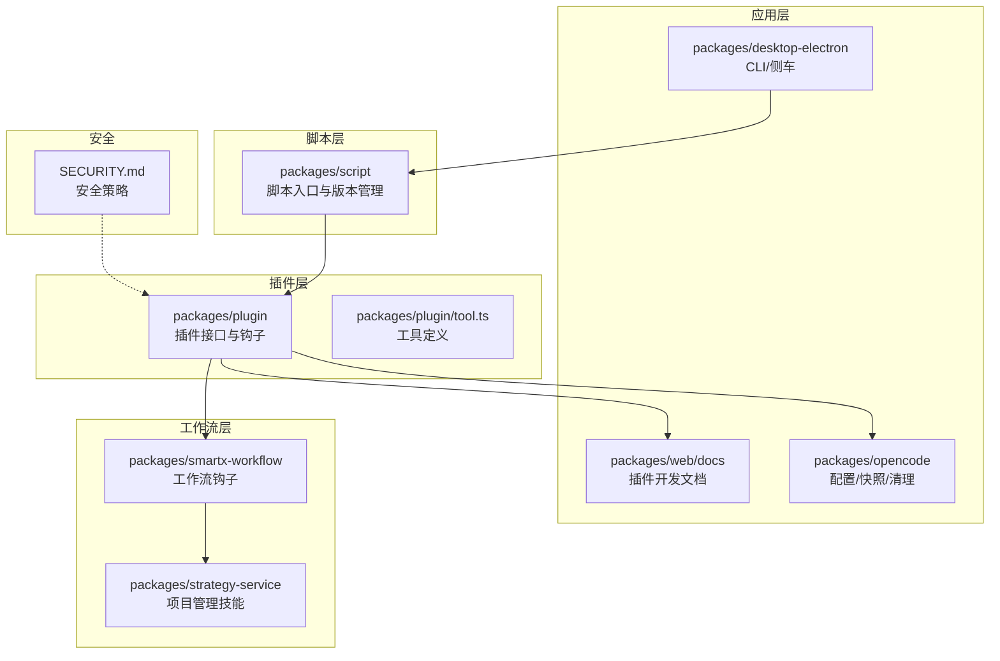
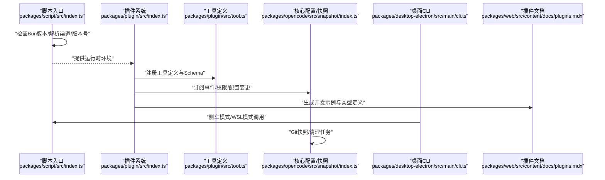
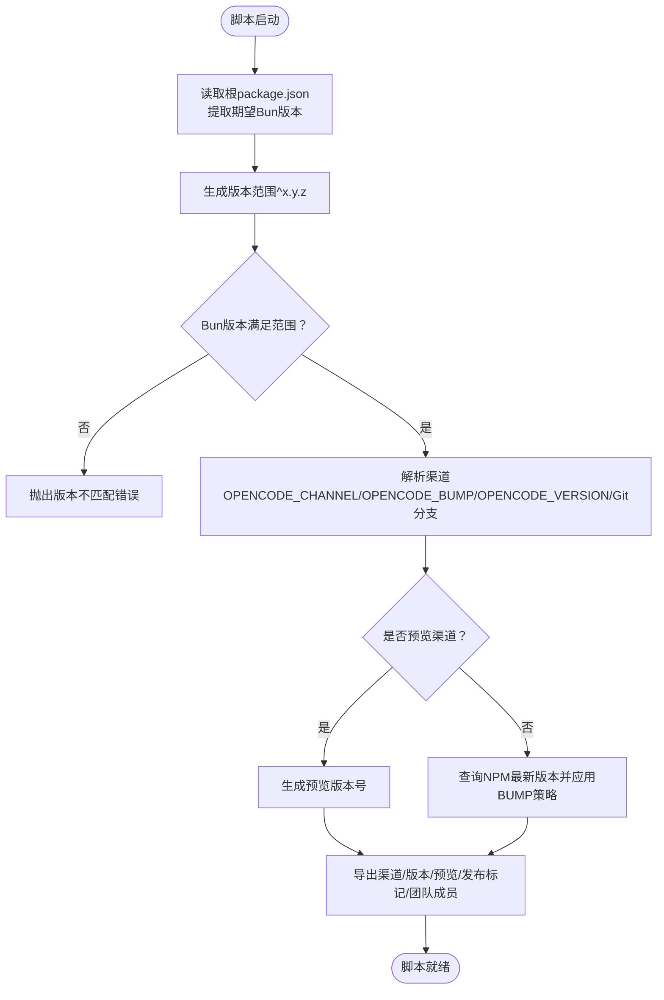
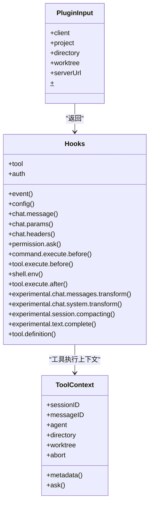
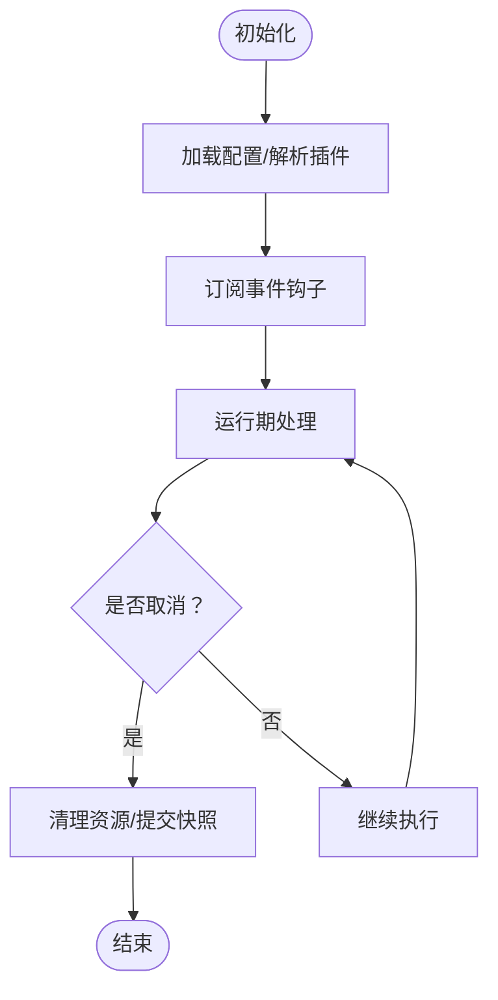
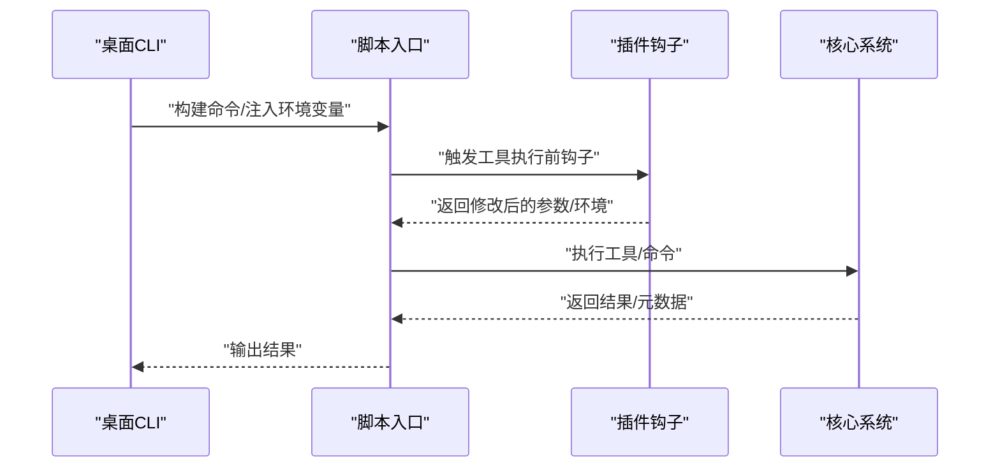
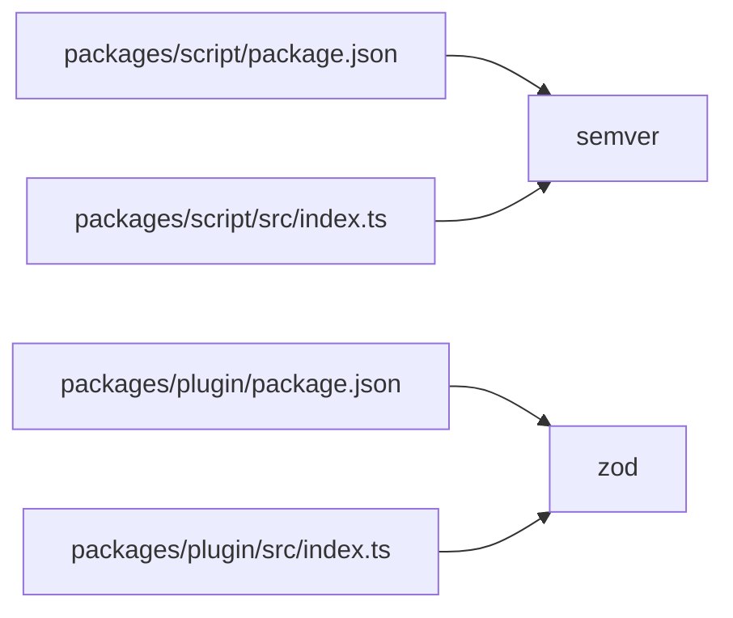

# 脚本引擎集成

<cite>
**本文档引用的文件**
- [packages/script/src/index.ts](file://packages/script/src/index.ts)
- [packages/script/package.json](file://packages/script/package.json)
- [packages/plugin/src/index.ts](file://packages/plugin/src/index.ts)
- [packages/plugin/src/tool.ts](file://packages/plugin/src/tool.ts)
- [packages/plugin/package.json](file://packages/plugin/package.json)
- [packages/web/src/content/docs/plugins.mdx](file://packages/web/src/content/docs/plugins.mdx)
- [packages/opencode/test/config/config.test.ts](file://packages/opencode/test/config/config.test.ts)
- [SECURITY.md](file://SECURITY.md)
- [packages/desktop-electron/src/main/cli.ts](file://packages/desktop-electron/src/main/cli.ts)
- [packages/opencode/src/snapshot/index.ts](file://packages/opencode/src/snapshot/index.ts)
- [packages/web/src/content/docs/permissions.mdx](file://packages/web/src/content/docs/permissions.mdx)
- [packages/web/src/content/docs/agents.mdx](file://packages/web/src/content/docs/agents.mdx)
- [packages/smartx-workflow/src/hooks.ts](file://packages/smartx-workflow/src/hooks.ts)
- [packages/smartx-workflow/src/workspace.ts](file://packages/smartx-workflow/src/workspace.ts)
- [packages/strategy-service/internal/asset/workspace/skills/project-manager/SKILL.md](file://packages/strategy-service/internal/asset/workspace/skills/project-manager/SKILL.md)
- [packages/smartx-workflow/test/analysis.test.ts](file://packages/smartx-workflow/test/analysis.test.ts)
</cite>

## 目录
1. [简介](#简介)
2. [项目结构](#项目结构)
3. [核心组件](#核心组件)
4. [架构总览](#架构总览)
5. [详细组件分析](#详细组件分析)
6. [依赖关系分析](#依赖关系分析)
7. [性能考虑](#性能考虑)
8. [故障排除指南](#故障排除指南)
9. [结论](#结论)
10. [附录](#附录)

## 简介
本文件面向脚本引擎与插件系统的集成，系统性阐述以下主题：
- 插件系统架构与钩子机制
- 脚本执行环境、沙箱隔离与安全控制
- 多语言支持与编译/运行时管理（以Bun为主）
- 脚本生命周期、内存与资源清理
- 插件API交互、数据序列化与反序列化
- 开发示例、调试工具与性能优化
- 安全审计、权限控制与恶意代码防护

## 项目结构
本仓库采用Monorepo组织，脚本引擎与插件系统主要分布在以下包：
- packages/script：脚本版本与渠道管理、Bun版本约束、预览发布逻辑
- packages/plugin：插件接口定义、钩子类型、工具定义与认证模型
- packages/web/docs：插件开发文档与示例
- packages/opencode：配置加载、快照与清理逻辑
- packages/desktop-electron：CLI与侧车模式集成
- packages/smartx-workflow：工作流与项目管理技能集成
- SECURITY.md：安全策略与威胁模型

**图表来源**
- [packages/script/src/index.ts:1-78](file://packages/script/src/index.ts#L1-L78)
- [packages/plugin/src/index.ts:1-235](file://packages/plugin/src/index.ts#L1-L235)
- [packages/plugin/src/tool.ts:1-39](file://packages/plugin/src/tool.ts#L1-L39)
- [packages/web/src/content/docs/plugins.mdx:87-143](file://packages/web/src/content/docs/plugins.mdx#L87-L143)
- [packages/opencode/src/snapshot/index.ts:42-80](file://packages/opencode/src/snapshot/index.ts#L42-L80)
- [packages/desktop-electron/src/main/cli.ts:205-243](file://packages/desktop-electron/src/main/cli.ts#L205-L243)
- [packages/smartx-workflow/src/hooks.ts:29-59](file://packages/smartx-workflow/src/hooks.ts#L29-L59)
- [packages/strategy-service/internal/asset/workspace/skills/project-manager/SKILL.md:1-61](file://packages/strategy-service/internal/asset/workspace/skills/project-manager/SKILL.md#L1-L61)
- [SECURITY.md:1-23](file://SECURITY.md#L1-L23)

**章节来源**
- [packages/script/src/index.ts:1-78](file://packages/script/src/index.ts#L1-L78)
- [packages/plugin/src/index.ts:1-235](file://packages/plugin/src/index.ts#L1-L235)
- [packages/plugin/src/tool.ts:1-39](file://packages/plugin/src/tool.ts#L1-L39)
- [packages/web/src/content/docs/plugins.mdx:87-143](file://packages/web/src/content/docs/plugins.mdx#L87-L143)
- [packages/opencode/src/snapshot/index.ts:42-80](file://packages/opencode/src/snapshot/index.ts#L42-L80)
- [packages/desktop-electron/src/main/cli.ts:205-243](file://packages/desktop-electron/src/main/cli.ts#L205-L243)
- [packages/smartx-workflow/src/hooks.ts:29-59](file://packages/smartx-workflow/src/hooks.ts#L29-L59)
- [packages/strategy-service/internal/asset/workspace/skills/project-manager/SKILL.md:1-61](file://packages/strategy-service/internal/asset/workspace/skills/project-manager/SKILL.md#L1-L61)
- [SECURITY.md:1-23](file://SECURITY.md#L1-L23)

## 核心组件
- 脚本引擎入口与版本管理
  - 通过根package.json中的packageManager字段推导期望的Bun版本范围，并在启动时进行版本校验
  - 支持从环境变量解析渠道（latest/preview）与版本号，支持预览分支版本生成
  - 提供团队成员名单与发布标记
  - 参考路径：[packages/script/src/index.ts:1-78](file://packages/script/src/index.ts#L1-L78)

- 插件接口与钩子系统
  - 定义PluginInput输入上下文（客户端、项目信息、目录、工作树、服务器URL、Bun Shell）
  - 定义Hooks接口，覆盖事件、配置、聊天参数、权限询问、命令/工具执行前后钩子、Shell环境注入、实验性功能等
  - 提供工具定义工具函数，支持参数Schema校验与执行上下文（会话ID、消息ID、代理、目录、工作树、AbortSignal、元数据回调、权限询问）
  - 参考路径：
    - [packages/plugin/src/index.ts:26-35](file://packages/plugin/src/index.ts#L26-L35)
    - [packages/plugin/src/index.ts:148-234](file://packages/plugin/src/index.ts#L148-L234)
    - [packages/plugin/src/tool.ts:1-39](file://packages/plugin/src/tool.ts#L1-L39)

- 配置与插件加载
  - 测试用例展示了全局与本地.opencode配置合并插件数组的行为
  - 参考路径：[packages/opencode/test/config/config.test.ts:852-887](file://packages/opencode/test/config/config.test.ts#L852-L887)

- 权限与安全
  - 文档定义了权限级别（allow/ask/deny），支持按工具与命令粒度配置
  - 安全文档明确无沙箱设计，建议通过容器/VM实现强隔离
  - 参考路径：
    - [packages/web/src/content/docs/permissions.mdx:1-59](file://packages/web/src/content/docs/permissions.mdx#L1-L59)
    - [SECURITY.md:13-23](file://SECURITY.md#L13-L23)

**章节来源**
- [packages/script/src/index.ts:1-78](file://packages/script/src/index.ts#L1-L78)
- [packages/plugin/src/index.ts:26-35](file://packages/plugin/src/index.ts#L26-L35)
- [packages/plugin/src/index.ts:148-234](file://packages/plugin/src/index.ts#L148-L234)
- [packages/plugin/src/tool.ts:1-39](file://packages/plugin/src/tool.ts#L1-L39)
- [packages/opencode/test/config/config.test.ts:852-887](file://packages/opencode/test/config/config.test.ts#L852-L887)
- [packages/web/src/content/docs/permissions.mdx:1-59](file://packages/web/src/content/docs/permissions.mdx#L1-L59)
- [SECURITY.md:13-23](file://SECURITY.md#L13-L23)

## 架构总览
下图展示脚本引擎与插件系统的交互关系：脚本入口负责版本与渠道管理，插件通过钩子接入系统事件与工具执行，工作流模块基于插件钩子实现项目状态管理与强制链路。

**图表来源**
- [packages/script/src/index.ts:1-78](file://packages/script/src/index.ts#L1-L78)
- [packages/plugin/src/index.ts:148-234](file://packages/plugin/src/index.ts#L148-L234)
- [packages/plugin/src/tool.ts:1-39](file://packages/plugin/src/tool.ts#L1-L39)
- [packages/opencode/src/snapshot/index.ts:42-80](file://packages/opencode/src/snapshot/index.ts#L42-L80)
- [packages/desktop-electron/src/main/cli.ts:205-243](file://packages/desktop-electron/src/main/cli.ts#L205-L243)
- [packages/web/src/content/docs/plugins.mdx:87-143](file://packages/web/src/content/docs/plugins.mdx#L87-L143)

## 详细组件分析

### 脚本引擎与执行环境
- 版本与渠道管理
  - 从根package.json读取期望Bun版本，生成语义化版本范围进行满足性校验
  - 渠道解析优先级：OPENCODE_CHANNEL > OPENCODE_BUMP > OPENCODE_VERSION > Git分支
  - 预览版本命名规则：0.0.0-{channel}-{timestamp}
  - 发布版本号：根据NPM最新版本与OPENCODE_BUMP（major/minor/patch）计算
  - 团队成员列表来源于本地TEAM_MEMBERS文件
  - 参考路径：[packages/script/src/index.ts:5-78](file://packages/script/src/index.ts#L5-L78)

- 执行环境隔离与安全
  - 无内置沙箱，权限系统仅作为UX提醒，不提供安全隔离
  - 建议在容器/VM中运行以获得强隔离
  - 参考路径：[SECURITY.md:13-23](file://SECURITY.md#L13-L23)

**图表来源**
- [packages/script/src/index.ts:5-78](file://packages/script/src/index.ts#L5-L78)
- [SECURITY.md:13-23](file://SECURITY.md#L13-L23)

**章节来源**
- [packages/script/src/index.ts:5-78](file://packages/script/src/index.ts#L5-L78)
- [SECURITY.md:13-23](file://SECURITY.md#L13-L23)

### 插件系统与钩子机制
- 插件输入上下文
  - 包含opencode客户端、项目信息、工作目录、工作树、服务器URL、Bun Shell
  - 参考路径：[packages/plugin/src/index.ts:26-35](file://packages/plugin/src/index.ts#L26-L35)

- 钩子类型与职责
  - 事件、配置、聊天参数与头部、权限询问、命令/工具执行前后、Shell环境注入、工具定义增强、实验性功能等
  - 参考路径：[packages/plugin/src/index.ts:148-234](file://packages/plugin/src/index.ts#L148-L234)

- 工具定义与Schema
  - 使用Zod Schema对工具参数进行校验
  - 执行上下文提供会话/消息/代理/目录/工作树/AbortSignal/元数据回调/权限询问
  - 参考路径：[packages/plugin/src/tool.ts:1-39](file://packages/plugin/src/tool.ts#L1-L39)

**图表来源**
- [packages/plugin/src/index.ts:26-35](file://packages/plugin/src/index.ts#L26-L35)
- [packages/plugin/src/index.ts:148-234](file://packages/plugin/src/index.ts#L148-L234)
- [packages/plugin/src/tool.ts:1-39](file://packages/plugin/src/tool.ts#L1-L39)

**章节来源**
- [packages/plugin/src/index.ts:26-35](file://packages/plugin/src/index.ts#L26-L35)
- [packages/plugin/src/index.ts:148-234](file://packages/plugin/src/index.ts#L148-L234)
- [packages/plugin/src/tool.ts:1-39](file://packages/plugin/src/tool.ts#L1-L39)

### 脚本生命周期、内存与资源清理
- 生命周期阶段
  - 初始化：加载配置、解析插件、建立客户端连接
  - 运行期：订阅事件钩子、处理工具调用、响应权限询问
  - 关闭：清理临时资源、提交快照、执行清理任务
  - 参考路径：[packages/opencode/src/snapshot/index.ts:42-80](file://packages/opencode/src/snapshot/index.ts#L42-L80)

- 内存与资源管理
  - 使用AbortSignal在工具执行中支持取消
  - 工具上下文提供metadata回调，便于记录输出与元数据
  - 参考路径：[packages/plugin/src/tool.ts:1-39](file://packages/plugin/src/tool.ts#L1-L39)

- 快照与清理
  - 初始化Git仓库（禁用换行符转换、长路径、符号链接、文件系统监控）
  - 写入树并跟踪变更
  - 清理失败时记录日志但不中断
  - 参考路径：[packages/opencode/src/snapshot/index.ts:42-80](file://packages/opencode/src/snapshot/index.ts#L42-L80)

**图表来源**
- [packages/opencode/src/snapshot/index.ts:42-80](file://packages/opencode/src/snapshot/index.ts#L42-L80)
- [packages/plugin/src/tool.ts:1-39](file://packages/plugin/src/tool.ts#L1-L39)

**章节来源**
- [packages/opencode/src/snapshot/index.ts:42-80](file://packages/opencode/src/snapshot/index.ts#L42-L80)
- [packages/plugin/src/tool.ts:1-39](file://packages/plugin/src/tool.ts#L1-L39)

### 插件API交互、数据序列化与反序列化
- 数据契约
  - 插件通过Hooks接口声明事件处理函数，输入/输出参数遵循严格类型定义
  - 工具定义使用Zod Schema进行参数校验，确保输入一致性
  - 参考路径：
    - [packages/plugin/src/index.ts:148-234](file://packages/plugin/src/index.ts#L148-L234)
    - [packages/plugin/src/tool.ts:1-39](file://packages/plugin/src/tool.ts#L1-L39)

- 序列化与反序列化
  - 插件与核心之间通过事件与钩子传递JSON可序列化对象
  - 权限配置与聊天参数通过对象结构传递，避免直接执行字符串
  - 参考路径：
    - [packages/web/src/content/docs/permissions.mdx:1-59](file://packages/web/src/content/docs/permissions.mdx#L1-L59)
    - [packages/web/src/content/docs/agents.mdx:405-473](file://packages/web/src/content/docs/agents.mdx#L405-L473)

**章节来源**
- [packages/plugin/src/index.ts:148-234](file://packages/plugin/src/index.ts#L148-L234)
- [packages/plugin/src/tool.ts:1-39](file://packages/plugin/src/tool.ts#L1-L39)
- [packages/web/src/content/docs/permissions.mdx:1-59](file://packages/web/src/content/docs/permissions.mdx#L1-L59)
- [packages/web/src/content/docs/agents.mdx:405-473](file://packages/web/src/content/docs/agents.mdx#L405-L473)

### 脚本与插件API的交互方式
- 入口与集成
  - 脚本入口通过Bun Shell执行命令，桌面端CLI支持Windows WSL与Unix侧车模式
  - 插件通过钩子接入系统事件，如“tool.execute.before”、“permission.ask”等
  - 参考路径：
    - [packages/script/src/index.ts:1-78](file://packages/script/src/index.ts#L1-L78)
    - [packages/desktop-electron/src/main/cli.ts:205-243](file://packages/desktop-electron/src/main/cli.ts#L205-L243)
    - [packages/plugin/src/index.ts:148-234](file://packages/plugin/src/index.ts#L148-L234)

- 示例与类型
  - 插件文档提供了TypeScript与JavaScript示例，展示如何在钩子中修改参数、注入环境变量、执行工具前后处理
  - 参考路径：[packages/web/src/content/docs/plugins.mdx:87-143](file://packages/web/src/content/docs/plugins.mdx#L87-L143)

**图表来源**
- [packages/desktop-electron/src/main/cli.ts:205-243](file://packages/desktop-electron/src/main/cli.ts#L205-L243)
- [packages/script/src/index.ts:1-78](file://packages/script/src/index.ts#L1-L78)
- [packages/plugin/src/index.ts:148-234](file://packages/plugin/src/index.ts#L148-L234)

**章节来源**
- [packages/script/src/index.ts:1-78](file://packages/script/src/index.ts#L1-L78)
- [packages/desktop-electron/src/main/cli.ts:205-243](file://packages/desktop-electron/src/main/cli.ts#L205-L243)
- [packages/plugin/src/index.ts:148-234](file://packages/plugin/src/index.ts#L148-L234)
- [packages/web/src/content/docs/plugins.mdx:87-143](file://packages/web/src/content/docs/plugins.mdx#L87-L143)

### 脚本语言支持与编译/运行时管理
- 语言与运行时
  - 以Bun为主要运行时，脚本入口读取Bun版本并进行校验
  - 插件开发支持TypeScript，使用Zod进行Schema校验
  - 参考路径：
    - [packages/script/src/index.ts:1-78](file://packages/script/src/index.ts#L1-L78)
    - [packages/plugin/package.json:1-29](file://packages/plugin/package.json#L1-L29)
    - [packages/plugin/src/tool.ts:1-39](file://packages/plugin/src/tool.ts#L1-L39)

- 编译与打包
  - 插件包使用TypeScript编译，导出模块入口
  - 参考路径：[packages/plugin/package.json:7-10](file://packages/plugin/package.json#L7-L10)

**章节来源**
- [packages/script/src/index.ts:1-78](file://packages/script/src/index.ts#L1-L78)
- [packages/plugin/package.json:1-29](file://packages/plugin/package.json#L1-L29)
- [packages/plugin/src/tool.ts:1-39](file://packages/plugin/src/tool.ts#L1-L39)

### 脚本开发示例与调试工具
- 开发示例
  - 插件文档提供了TypeScript与JavaScript示例，展示如何在钩子中修改参数、注入环境变量、执行工具前后处理
  - 参考路径：[packages/web/src/content/docs/plugins.mdx:87-143](file://packages/web/src/content/docs/plugins.mdx#L87-L143)

- 调试工具
  - 使用Bun Shell执行命令，结合AbortSignal实现取消
  - 在工作流模块中，通过日志写入统一记录插件内部事件
  - 参考路径：
    - [packages/plugin/src/tool.ts:1-39](file://packages/plugin/src/tool.ts#L1-L39)
    - [packages/smartx-workflow/src/hooks.ts:46-58](file://packages/smartx-workflow/src/hooks.ts#L46-L58)

**章节来源**
- [packages/web/src/content/docs/plugins.mdx:87-143](file://packages/web/src/content/docs/plugins.mdx#L87-L143)
- [packages/plugin/src/tool.ts:1-39](file://packages/plugin/src/tool.ts#L1-L39)
- [packages/smartx-workflow/src/hooks.ts:46-58](file://packages/smartx-workflow/src/hooks.ts#L46-L58)

### 性能优化技巧
- 事件与钩子最小化
  - 仅在必要钩子中进行昂贵操作，避免在高频事件（如tool.execute.before）中执行阻塞逻辑
- 并发与批处理
  - 对多个工具调用使用并发执行，结合AbortSignal进行快速取消
- 缓存与快照
  - 利用Git快照减少重复计算，清理失败时记录日志但不中断主流程
- 参考路径：
  - [packages/opencode/src/snapshot/index.ts:42-80](file://packages/opencode/src/snapshot/index.ts#L42-L80)

**章节来源**
- [packages/opencode/src/snapshot/index.ts:42-80](file://packages/opencode/src/snapshot/index.ts#L42-L80)

### 安全审计、权限控制与恶意代码防护
- 权限控制
  - 支持全局与按工具粒度的权限配置（allow/ask/deny），并可在Agent层面覆盖
  - 参考路径：[packages/web/src/content/docs/permissions.mdx:1-59](file://packages/web/src/content/docs/permissions.mdx#L1-L59)

- 安全审计代理
  - 提供专用Agent进行安全审计，聚焦输入验证、认证授权、数据暴露、依赖漏洞与配置问题
  - 参考路径：[packages/web/src/content/docs/agents.mdx:726-746](file://packages/web/src/content/docs/agents.mdx#L726-L746)

- 恶意代码防护
  - 无沙箱设计，建议通过容器/VM实现强隔离
  - Server模式需设置密码以启用HTTP Basic Auth
  - 参考路径：[SECURITY.md:13-23](file://SECURITY.md#L13-L23)

**章节来源**
- [packages/web/src/content/docs/permissions.mdx:1-59](file://packages/web/src/content/docs/permissions.mdx#L1-L59)
- [packages/web/src/content/docs/agents.mdx:726-746](file://packages/web/src/content/docs/agents.mdx#L726-L746)
- [SECURITY.md:13-23](file://SECURITY.md#L13-L23)

## 依赖关系分析
- 组件耦合
  - 脚本入口依赖Bun版本与环境变量，向插件提供统一执行环境
  - 插件系统依赖SDK客户端与Bun Shell，通过钩子与核心交互
  - 工作流模块依赖插件钩子实现项目状态管理与强制链路
- 外部依赖
  - semver用于版本满足性校验
  - Zod用于工具参数Schema校验
  - 参考路径：
    - [packages/script/package.json:5-7](file://packages/script/package.json#L5-L7)
    - [packages/plugin/package.json:18-21](file://packages/plugin/package.json#L18-L21)

**图表来源**
- [packages/script/package.json:5-7](file://packages/script/package.json#L5-L7)
- [packages/plugin/package.json:18-21](file://packages/plugin/package.json#L18-L21)
- [packages/script/src/index.ts:1-78](file://packages/script/src/index.ts#L1-L78)
- [packages/plugin/src/index.ts:1-235](file://packages/plugin/src/index.ts#L1-L235)

**章节来源**
- [packages/script/package.json:5-7](file://packages/script/package.json#L5-L7)
- [packages/plugin/package.json:18-21](file://packages/plugin/package.json#L18-L21)
- [packages/script/src/index.ts:1-78](file://packages/script/src/index.ts#L1-L78)
- [packages/plugin/src/index.ts:1-235](file://packages/plugin/src/index.ts#L1-L235)

## 性能考虑
- 避免在高频钩子中执行阻塞IO
- 合理使用并发与取消信号
- 利用快照与缓存减少重复计算
- 参考路径：
  - [packages/opencode/src/snapshot/index.ts:42-80](file://packages/opencode/src/snapshot/index.ts#L42-L80)

**章节来源**
- [packages/opencode/src/snapshot/index.ts:42-80](file://packages/opencode/src/snapshot/index.ts#L42-L80)

## 故障排除指南
- 版本不匹配
  - 症状：启动时报错提示Bun版本不满足期望范围
  - 处理：安装与根package.json中packageManager指定的Bun版本一致
  - 参考路径：[packages/script/src/index.ts:16-18](file://packages/script/src/index.ts#L16-L18)

- 渠道与版本解析异常
  - 症状：预览版本号不符合预期
  - 处理：检查OPENCODE_CHANNEL/OPENCODE_BUMP/OPENCODE_VERSION环境变量
  - 参考路径：[packages/script/src/index.ts:26-48](file://packages/script/src/index.ts#L26-L48)

- 权限被拒绝
  - 症状：工具执行被阻止或需要确认
  - 处理：调整opencode.json中的permission配置或在Agent层面覆盖
  - 参考路径：[packages/web/src/content/docs/permissions.mdx:1-59](file://packages/web/src/content/docs/permissions.mdx#L1-L59)

- 快照清理失败
  - 症状：清理任务失败但不影响主流程
  - 处理：查看日志输出，确认Git配置与工作树状态
  - 参考路径：[packages/opencode/src/snapshot/index.ts:42-54](file://packages/opencode/src/snapshot/index.ts#L42-L54)

**章节来源**
- [packages/script/src/index.ts:16-18](file://packages/script/src/index.ts#L16-L18)
- [packages/script/src/index.ts:26-48](file://packages/script/src/index.ts#L26-L48)
- [packages/web/src/content/docs/permissions.mdx:1-59](file://packages/web/src/content/docs/permissions.mdx#L1-L59)
- [packages/opencode/src/snapshot/index.ts:42-54](file://packages/opencode/src/snapshot/index.ts#L42-L54)

## 结论
本集成方案以Bun为运行时，通过严格的版本校验与渠道管理确保脚本引擎稳定性；插件系统以钩子为核心，提供事件驱动的扩展能力；配合权限控制与安全策略，形成从开发到生产的完整闭环。建议在生产环境中采用容器/VM实现强隔离，并通过快照与缓存提升性能与可靠性。

## 附录
- 插件开发示例与类型参考：[packages/web/src/content/docs/plugins.mdx:87-143](file://packages/web/src/content/docs/plugins.mdx#L87-L143)
- 配置合并测试用例：[packages/opencode/test/config/config.test.ts:852-887](file://packages/opencode/test/config/config.test.ts#L852-L887)
- 工作流与项目管理技能：[packages/smartx-workflow/src/hooks.ts:29-59](file://packages/smartx-workflow/src/hooks.ts#L29-L59)、[packages/strategy-service/internal/asset/workspace/skills/project-manager/SKILL.md:1-61](file://packages/strategy-service/internal/asset/workspace/skills/project-manager/SKILL.md#L1-L61)
- 权限与Agent文档：[packages/web/src/content/docs/permissions.mdx:1-59](file://packages/web/src/content/docs/permissions.mdx#L1-L59)、[packages/web/src/content/docs/agents.mdx:405-473](file://packages/web/src/content/docs/agents.mdx#L405-L473)