# 数据模型与Schema

<cite>
**本文档引用的文件**
- [packages/opencode/src/util/schema.ts](file://packages/opencode/src/util/schema.ts)
- [packages/opencode/src/util/fn.ts](file://packages/opencode/src/util/fn.ts)
- [packages/opencode/src/provider/schema.ts](file://packages/opencode/src/provider/schema.ts)
- [packages/opencode/src/account/schema.ts](file://packages/opencode/src/account/schema.ts)
- [packages/opencode/src/session/schema.ts](file://packages/opencode/src/session/schema.ts)
- [packages/opencode/src/project/schema.ts](file://packages/opencode/src/project/schema.ts)
- [packages/opencode/src/control-plane/schema.ts](file://packages/opencode/src/control-plane/schema.ts)
- [packages/opencode/src/tool/schema.ts](file://packages/opencode/src/tool/schema.ts)
- [packages/opencode/src/permission/schema.ts](file://packages/opencode/src/permission/schema.ts)
- [packages/opencode/src/storage/schema.ts](file://packages/opencode/src/storage/schema.ts)
- [packages/opencode/test/util/effect-zod.test.ts](file://packages/opencode/test/util/effect-zod.test.ts)
- [packages/opencode/test/provider/provider.test.ts](file://packages/opencode/test/provider/provider.test.ts)
- [packages/opencode/test/provider/transform.test.ts](file://packages/opencode/test/provider/transform.test.ts)
- [packages/web/src/content/docs/sdk.mdx](file://packages/web/src/content/docs/sdk.mdx)
- [packages/web/src/content/docs/providers.mdx](file://packages/web/src/content/docs/providers.mdx)
- [.opencode/opencode.jsonc](file://.opencode/opencode.jsonc)
</cite>

## 目录
1. [简介](#简介)
2. [项目结构](#项目结构)
3. [核心组件](#核心组件)
4. [架构总览](#架构总览)
5. [详细组件分析](#详细组件分析)
6. [依赖分析](#依赖分析)
7. [性能考虑](#性能考虑)
8. [故障排除指南](#故障排除指南)
9. [结论](#结论)
10. [附录](#附录)

## 简介
本文件系统性梳理项目中的数据模型与Schema设计，覆盖以下方面：
- 核心数据结构与类型定义：Effect Schema与Zod并用的双轨模式
- 字段约束与验证机制：品牌类型、新类型封装、静态方法扩展
- 配置文件结构、代理定义与模型提供商Schema
- 数据模型间的关系、引用与继承机制
- 序列化/反序列化与版本兼容性处理
- 使用示例、验证错误处理与数据迁移策略
- 实际代码示例路径与最佳实践建议

## 项目结构
本项目采用“按功能域分层 + 双Schema框架”的组织方式：
- 功能域：账户(Account)、会话(Session)、项目(Project)、控制平面(Control Plane)、工具(Tool)、权限(Permission)、提供商(Provider)
- Schema框架：Effect Schema用于强类型建模与运行时编解码；Zod用于输入校验与中间件集成
- 工具模块：withStatics与Newtype等工具函数为Schema增强静态方法与品牌类型

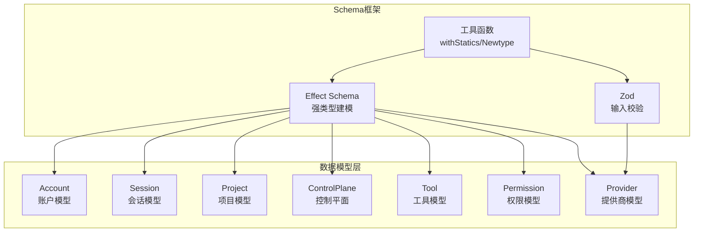

**图表来源**
- [packages/opencode/src/account/schema.ts:41-92](file://packages/opencode/src/account/schema.ts#L41-L92)
- [packages/opencode/src/session/schema.ts:7-39](file://packages/opencode/src/session/schema.ts#L7-L39)
- [packages/opencode/src/project/schema.ts:6-17](file://packages/opencode/src/project/schema.ts#L6-L17)
- [packages/opencode/src/control-plane/schema.ts:7-18](file://packages/opencode/src/control-plane/schema.ts#L7-L18)
- [packages/opencode/src/tool/schema.ts:7-18](file://packages/opencode/src/tool/schema.ts#L7-L18)
- [packages/opencode/src/permission/schema.ts:7-18](file://packages/opencode/src/permission/schema.ts#L7-L18)
- [packages/opencode/src/provider/schema.ts:6-39](file://packages/opencode/src/provider/schema.ts#L6-L39)
- [packages/opencode/src/util/schema.ts:14-54](file://packages/opencode/src/util/schema.ts#L14-L54)

**章节来源**
- [packages/opencode/src/util/schema.ts:1-54](file://packages/opencode/src/util/schema.ts#L1-L54)
- [packages/opencode/src/util/fn.ts:1-19](file://packages/opencode/src/util/fn.ts#L1-L19)
- [packages/opencode/src/provider/schema.ts:1-39](file://packages/opencode/src/provider/schema.ts#L1-L39)
- [packages/opencode/src/account/schema.ts:1-92](file://packages/opencode/src/account/schema.ts#L1-L92)
- [packages/opencode/src/session/schema.ts:1-39](file://packages/opencode/src/session/schema.ts#L1-L39)
- [packages/opencode/src/project/schema.ts:1-17](file://packages/opencode/src/project/schema.ts#L1-L17)
- [packages/opencode/src/control-plane/schema.ts:1-18](file://packages/opencode/src/control-plane/schema.ts#L1-L18)
- [packages/opencode/src/tool/schema.ts:1-18](file://packages/opencode/src/tool/schema.ts#L1-L18)
- [packages/opencode/src/permission/schema.ts:1-18](file://packages/opencode/src/permission/schema.ts#L1-L18)
- [packages/opencode/src/storage/schema.ts:1-6](file://packages/opencode/src/storage/schema.ts#L1-L6)

## 核心组件
本节概述各领域模型与Schema的关键特性，包括品牌类型、静态方法、Zod映射与约束。

- Effect Schema与品牌类型
  - 使用Schema.brand与Schema.Class定义领域ID与实体类，确保类型安全与语义清晰
  - 通过withStatics为Schema附加静态工厂方法与Zod映射
- Newtype封装
  - Newtype作为标称类型包装器，提供makeUnsafe与Zod类型约束
- Zod集成
  - 在工具函数与错误结构中使用Zod进行输入校验与错误消息提取
- 关系与继承
  - 模型间通过ID字段建立引用关系（如Account.active_org_id -> Org.id）
  - 类型通过Schema.Union组合形成枚举式结果类型

**章节来源**
- [packages/opencode/src/util/schema.ts:14-54](file://packages/opencode/src/util/schema.ts#L14-L54)
- [packages/opencode/src/account/schema.ts:41-92](file://packages/opencode/src/account/schema.ts#L41-L92)
- [packages/opencode/src/session/schema.ts:7-39](file://packages/opencode/src/session/schema.ts#L7-L39)
- [packages/opencode/src/project/schema.ts:6-17](file://packages/opencode/src/project/schema.ts#L6-L17)
- [packages/opencode/src/control-plane/schema.ts:7-18](file://packages/opencode/src/control-plane/schema.ts#L7-L18)
- [packages/opencode/src/tool/schema.ts:7-18](file://packages/opencode/src/tool/schema.ts#L7-L18)
- [packages/opencode/src/permission/schema.ts:7-18](file://packages/opencode/src/permission/schema.ts#L7-L18)
- [packages/opencode/src/provider/schema.ts:6-39](file://packages/opencode/src/provider/schema.ts#L6-L39)

## 架构总览
下图展示数据模型与Schema框架的整体交互关系，以及配置文件对提供商与模型的影响。

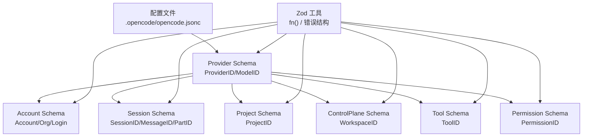

**图表来源**
- [.opencode/opencode.jsonc:1-19](file://.opencode/opencode.jsonc#L1-L19)
- [packages/opencode/src/provider/schema.ts:6-39](file://packages/opencode/src/provider/schema.ts#L6-L39)
- [packages/opencode/src/account/schema.ts:41-92](file://packages/opencode/src/account/schema.ts#L41-L92)
- [packages/opencode/src/session/schema.ts:7-39](file://packages/opencode/src/session/schema.ts#L7-L39)
- [packages/opencode/src/project/schema.ts:6-17](file://packages/opencode/src/project/schema.ts#L6-L17)
- [packages/opencode/src/control-plane/schema.ts:7-18](file://packages/opencode/src/control-plane/schema.ts#L7-L18)
- [packages/opencode/src/tool/schema.ts:7-18](file://packages/opencode/src/tool/schema.ts#L7-L18)
- [packages/opencode/src/permission/schema.ts:7-18](file://packages/opencode/src/permission/schema.ts#L7-L18)
- [packages/opencode/src/util/fn.ts:3-18](file://packages/opencode/src/util/fn.ts#L3-L18)

## 详细组件分析

### Effect Schema 工具与品牌类型
- withStatics：为Schema对象注入静态方法，便于统一工厂方法与Zod映射
- Newtype：标称类型封装器，提供makeUnsafe与Zod类型约束，避免原始类型滥用
- 使用场景：所有领域ID（如AccountID、ProjectID、SessionID等）均通过brand或Newtype封装

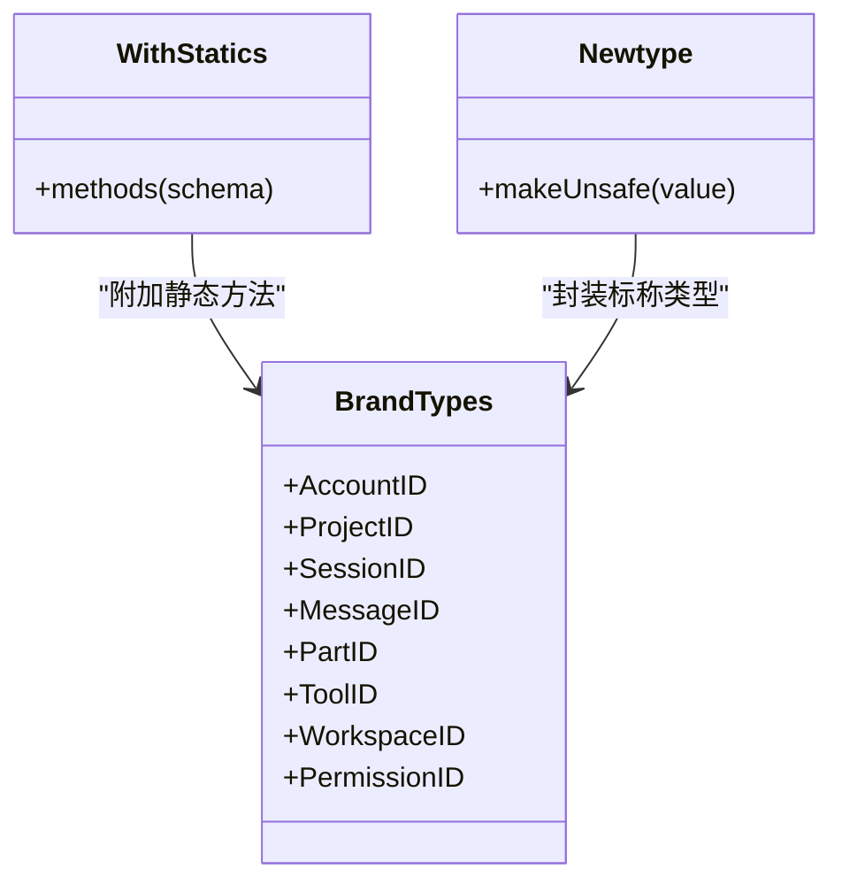

**图表来源**
- [packages/opencode/src/util/schema.ts:14-54](file://packages/opencode/src/util/schema.ts#L14-L54)
- [packages/opencode/src/account/schema.ts:5-27](file://packages/opencode/src/account/schema.ts#L5-L27)
- [packages/opencode/src/project/schema.ts:6-16](file://packages/opencode/src/project/schema.ts#L6-L16)
- [packages/opencode/src/session/schema.ts:7-39](file://packages/opencode/src/session/schema.ts#L7-L39)
- [packages/opencode/src/tool/schema.ts:7-18](file://packages/opencode/src/tool/schema.ts#L7-L18)
- [packages/opencode/src/control-plane/schema.ts:7-18](file://packages/opencode/src/control-plane/schema.ts#L7-L18)
- [packages/opencode/src/permission/schema.ts:7-17](file://packages/opencode/src/permission/schema.ts#L7-L17)

**章节来源**
- [packages/opencode/src/util/schema.ts:1-54](file://packages/opencode/src/util/schema.ts#L1-L54)
- [packages/opencode/src/account/schema.ts:5-27](file://packages/opencode/src/account/schema.ts#L5-L27)
- [packages/opencode/src/project/schema.ts:6-16](file://packages/opencode/src/project/schema.ts#L6-L16)
- [packages/opencode/src/session/schema.ts:7-39](file://packages/opencode/src/session/schema.ts#L7-L39)
- [packages/opencode/src/tool/schema.ts:7-18](file://packages/opencode/src/tool/schema.ts#L7-L18)
- [packages/opencode/src/control-plane/schema.ts:7-18](file://packages/opencode/src/control-plane/schema.ts#L7-L18)
- [packages/opencode/src/permission/schema.ts:7-17](file://packages/opencode/src/permission/schema.ts#L7-L17)

### 账户与组织模型
- Account：包含用户标识、邮箱、URL及当前组织ID（可空）
- Org：组织标识与名称
- 登录流程相关类型：DeviceCode、UserCode、Login、轮询状态（PollSuccess/Pending/Slow/Expired/Denied/Error）

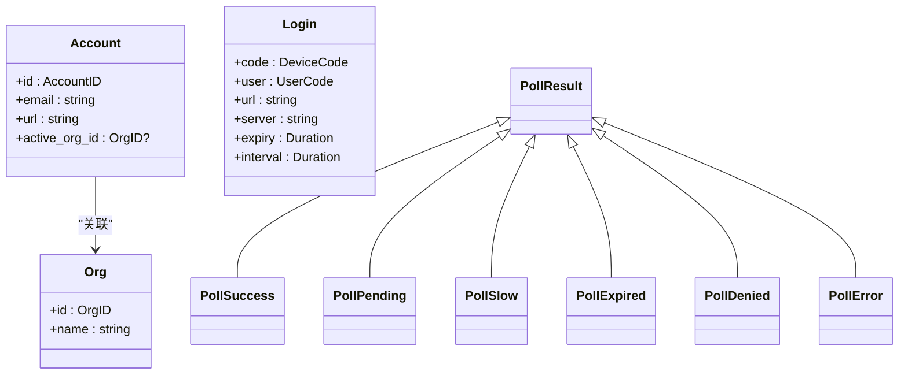

**图表来源**
- [packages/opencode/src/account/schema.ts:41-92](file://packages/opencode/src/account/schema.ts#L41-L92)

**章节来源**
- [packages/opencode/src/account/schema.ts:41-92](file://packages/opencode/src/account/schema.ts#L41-L92)

### 会话与消息模型
- SessionID/MessageID/PartID：通过标识符生成器构造，支持升序/降序排序
- Zod映射：结合Identifier.schema与z.custom实现类型安全的解析

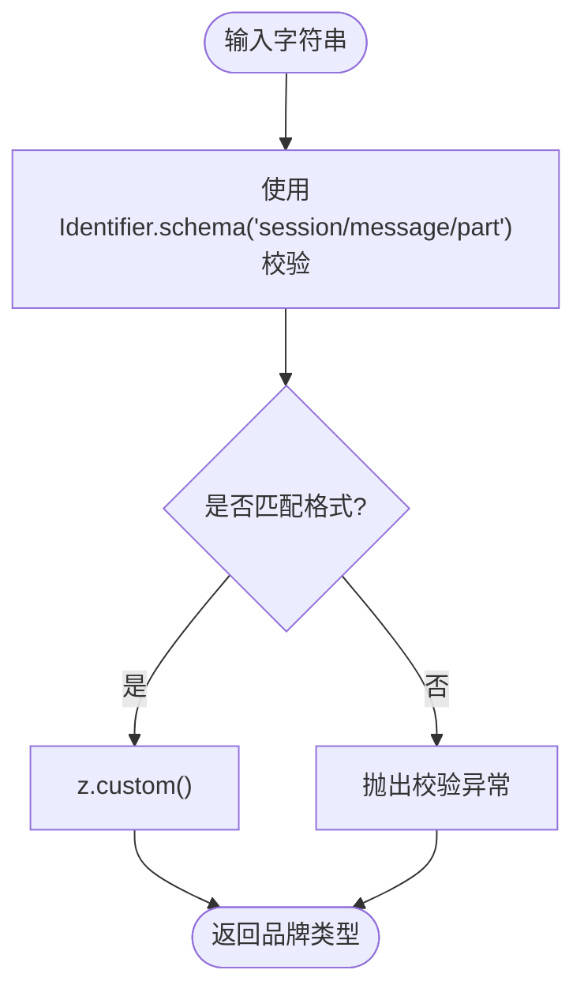

**图表来源**
- [packages/opencode/src/session/schema.ts:7-39](file://packages/opencode/src/session/schema.ts#L7-L39)

**章节来源**
- [packages/opencode/src/session/schema.ts:1-39](file://packages/opencode/src/session/schema.ts#L1-L39)

### 项目与工作空间模型
- ProjectID：全局项目ID常量与工厂方法
- WorkspaceID：工作空间ID，支持升序排序与Zod映射

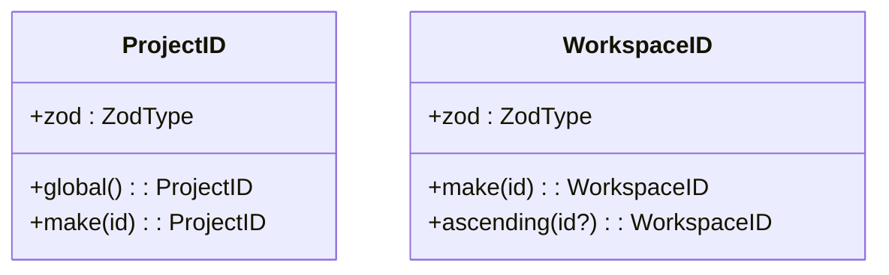

**图表来源**
- [packages/opencode/src/project/schema.ts:6-17](file://packages/opencode/src/project/schema.ts#L6-L17)
- [packages/opencode/src/control-plane/schema.ts:7-18](file://packages/opencode/src/control-plane/schema.ts#L7-L18)

**章节来源**
- [packages/opencode/src/project/schema.ts:1-17](file://packages/opencode/src/project/schema.ts#L1-L17)
- [packages/opencode/src/control-plane/schema.ts:1-18](file://packages/opencode/src/control-plane/schema.ts#L1-L18)

### 权限与工具模型
- PermissionID：基于Newtype的权限标识，支持升序排序与Zod映射
- ToolID：工具标识，支持升序排序与Zod映射

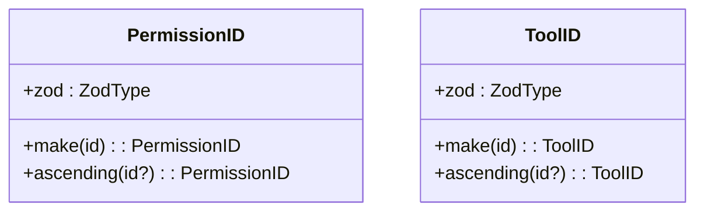

**图表来源**
- [packages/opencode/src/permission/schema.ts:7-18](file://packages/opencode/src/permission/schema.ts#L7-L18)
- [packages/opencode/src/tool/schema.ts:7-18](file://packages/opencode/src/tool/schema.ts#L7-L18)

**章节来源**
- [packages/opencode/src/permission/schema.ts:1-18](file://packages/opencode/src/permission/schema.ts#L1-L18)
- [packages/opencode/src/tool/schema.ts:1-18](file://packages/opencode/src/tool/schema.ts#L1-L18)

### 提供商与模型Schema
- ProviderID/ModelID：品牌类型，内置常用提供商常量
- Zod映射：z.custom结合withStatics提供类型安全的解析
- 配置文件影响：opencode.jsonc中的provider配置决定可用提供商与模型

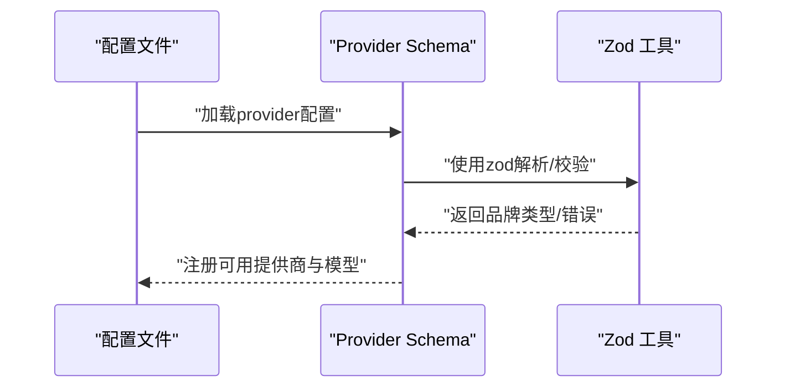

**图表来源**
- [.opencode/opencode.jsonc:1-19](file://.opencode/opencode.jsonc#L1-L19)
- [packages/opencode/src/provider/schema.ts:6-39](file://packages/opencode/src/provider/schema.ts#L6-L39)
- [packages/opencode/src/util/fn.ts:3-18](file://packages/opencode/src/util/fn.ts#L3-L18)

**章节来源**
- [packages/opencode/src/provider/schema.ts:1-39](file://packages/opencode/src/provider/schema.ts#L1-L39)
- [.opencode/opencode.jsonc:1-19](file://.opencode/opencode.jsonc#L1-L19)

### Zod Schema 使用与错误处理
- 工具函数fn：封装schema.parse，提供force与schema属性，便于调试与重试
- 错误结构：OpenAI兼容错误响应的Zod模式与错误到消息的映射
- 测试验证：effect-zod转换器对Effect Schema的Zod转换，覆盖可选字段、数组与记录

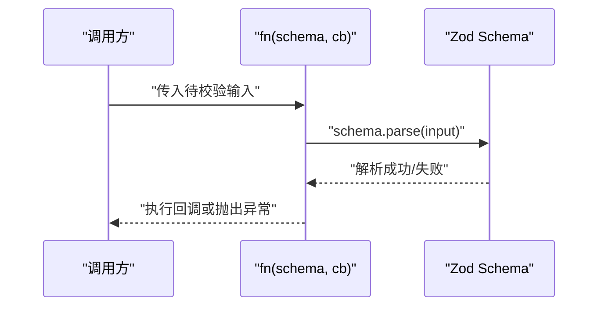

**图表来源**
- [packages/opencode/src/util/fn.ts:3-18](file://packages/opencode/src/util/fn.ts#L3-L18)
- [packages/opencode/test/util/effect-zod.test.ts:7-25](file://packages/opencode/test/util/effect-zod.test.ts#L7-L25)

**章节来源**
- [packages/opencode/src/util/fn.ts:1-19](file://packages/opencode/src/util/fn.ts#L1-L19)
- [packages/opencode/test/util/effect-zod.test.ts:1-61](file://packages/opencode/test/util/effect-zod.test.ts#L1-L61)

### 配置文件结构与提供商定义
- 配置文件opencode.jsonc：$schema指向官方配置模式，provider定义提供商与模型
- 提供商字段：name、npm、api、env、models、options等
- 模型字段：name、tool_call、limit（context/output）、options合并与环境变量优先级

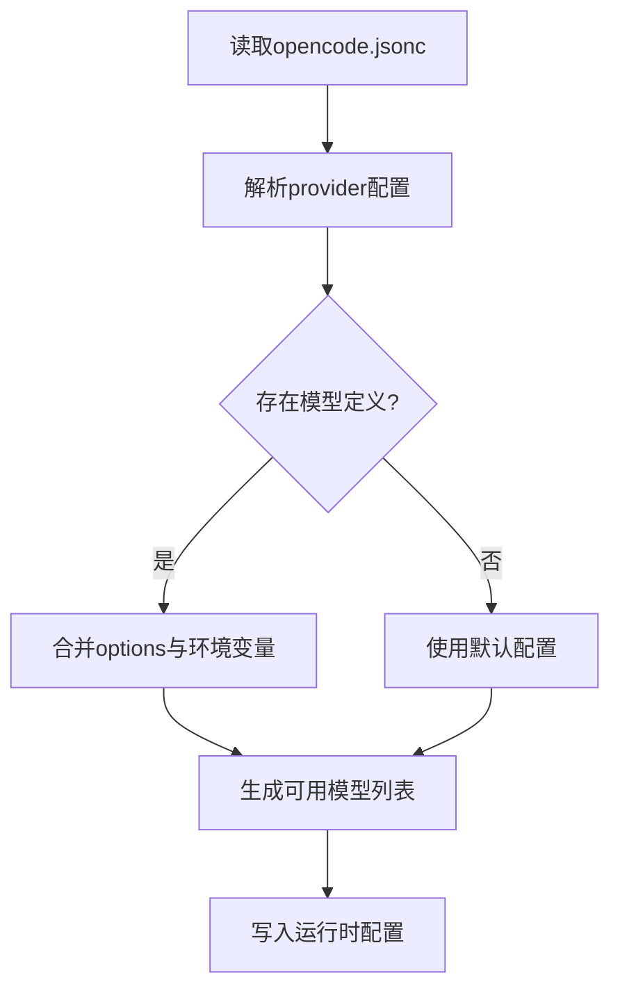

**图表来源**
- [packages/opencode/test/provider/provider.test.ts:254-251](file://packages/opencode/test/provider/provider.test.ts#L254-L251)
- [packages/web/src/content/docs/providers.mdx:1828-1869](file://packages/web/src/content/docs/providers.mdx#L1828-L1869)

**章节来源**
- [packages/opencode/test/provider/provider.test.ts:219-251](file://packages/opencode/test/provider/provider.test.ts#L219-L251)
- [packages/opencode/test/provider/provider.test.ts:648-680](file://packages/opencode/test/provider/provider.test.ts#L648-L680)
- [packages/opencode/test/provider/provider.test.ts:1705-1734](file://packages/opencode/test/provider/provider.test.ts#L1705-L1734)
- [packages/web/src/content/docs/providers.mdx:1828-1869](file://packages/web/src/content/docs/providers.mdx#L1828-L1869)
- [.opencode/opencode.jsonc:1-19](file://.opencode/opencode.jsonc#L1-L19)

### 数据模型关系与引用
- 引用关系：Account.active_org_id -> Org.id
- 继承机制：Effect Schema通过Schema.Union组合不同轮询状态
- ID生成：通过Identifier.ascending/Identifier.descending保证排序一致性

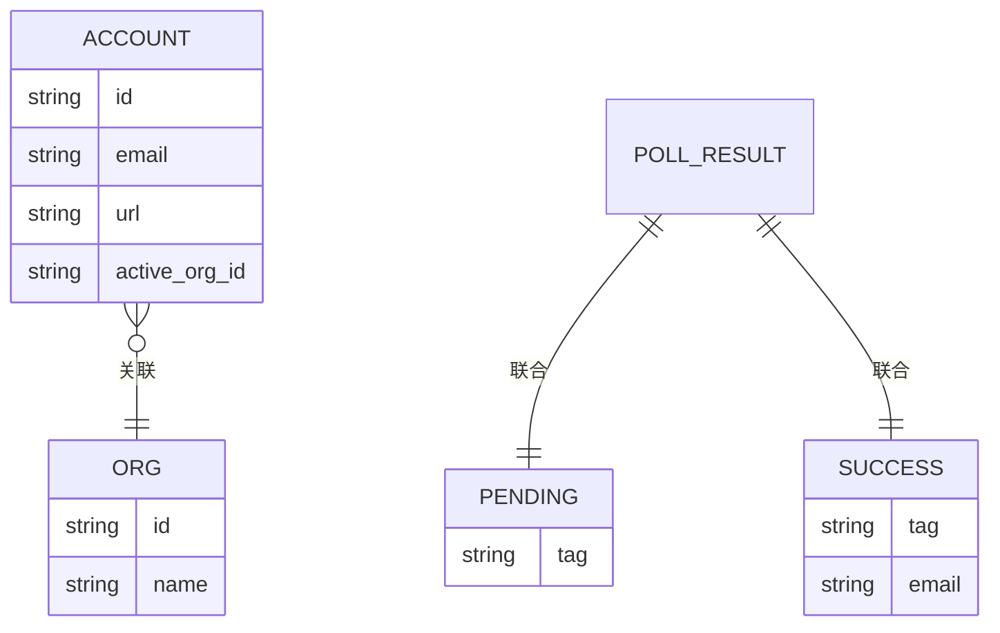

**图表来源**
- [packages/opencode/src/account/schema.ts:41-92](file://packages/opencode/src/account/schema.ts#L41-L92)
- [packages/opencode/src/session/schema.ts:7-39](file://packages/opencode/src/session/schema.ts#L7-L39)

**章节来源**
- [packages/opencode/src/account/schema.ts:41-92](file://packages/opencode/src/account/schema.ts#L41-L92)
- [packages/opencode/src/session/schema.ts:7-39](file://packages/opencode/src/session/schema.ts#L7-L39)

### 数据序列化、反序列化与版本兼容
- Effect Schema：提供decode/decodeEffect等编解码能力，适合服务端与持久化层
- Zod：用于HTTP输入校验与中间件，配合错误结构统一错误消息
- 版本兼容：通过配置文件的$version/$schema与ProviderTransform对不同提供商的Schema适配

**章节来源**
- [packages/opencode/src/util/schema.ts:1-54](file://packages/opencode/src/util/schema.ts#L1-L54)
- [packages/opencode/src/util/fn.ts:1-19](file://packages/opencode/src/util/fn.ts#L1-L19)
- [packages/opencode/test/provider/transform.test.ts:377-413](file://packages/opencode/test/provider/transform.test.ts#L377-L413)

## 依赖分析
- 内聚性：各领域Schema内聚良好，通过ID与静态方法形成清晰边界
- 耦合度：Schema之间低耦合，仅在Account-Org与Session-ID等必要处建立引用
- 外部依赖：Effect与Zod双框架并行，工具函数与测试用例验证转换与兼容性

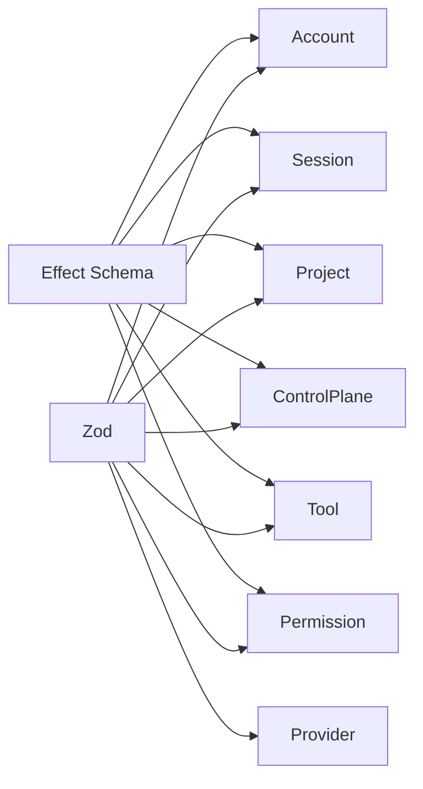

**图表来源**
- [packages/opencode/src/account/schema.ts:41-92](file://packages/opencode/src/account/schema.ts#L41-L92)
- [packages/opencode/src/session/schema.ts:7-39](file://packages/opencode/src/session/schema.ts#L7-L39)
- [packages/opencode/src/project/schema.ts:6-17](file://packages/opencode/src/project/schema.ts#L6-L17)
- [packages/opencode/src/control-plane/schema.ts:7-18](file://packages/opencode/src/control-plane/schema.ts#L7-L18)
- [packages/opencode/src/tool/schema.ts:7-18](file://packages/opencode/src/tool/schema.ts#L7-L18)
- [packages/opencode/src/permission/schema.ts:7-18](file://packages/opencode/src/permission/schema.ts#L7-L18)
- [packages/opencode/src/provider/schema.ts:6-39](file://packages/opencode/src/provider/schema.ts#L6-L39)
- [packages/opencode/src/util/schema.ts:14-54](file://packages/opencode/src/util/schema.ts#L14-L54)

**章节来源**
- [packages/opencode/src/util/schema.ts:1-54](file://packages/opencode/src/util/schema.ts#L1-L54)
- [packages/opencode/src/provider/schema.ts:1-39](file://packages/opencode/src/provider/schema.ts#L1-L39)

## 性能考虑
- 编解码性能：Effect Schema在服务端具备高性能编解码能力，适合高频数据流
- 校验开销：Zod在边缘层进行快速校验，减少无效请求进入后端
- ID生成：使用Identifier生成器避免随机字符串带来的索引碎片化
- 缓存策略：对频繁访问的模型与配置进行缓存，降低重复解析成本

## 故障排除指南
- 校验失败：使用fn工具函数捕获异常并打印堆栈，定位输入问题
- 错误消息：通过ProviderErrorStructure与defaultOpenAICompatibleErrorStructure提取统一错误消息
- 配置冲突：检查opencode.jsonc中provider.options与环境变量的合并顺序与优先级
- Schema转换：参考effect-zod测试用例，确认Effect Schema到Zod的转换是否支持所需类型

**章节来源**
- [packages/opencode/src/util/fn.ts:3-18](file://packages/opencode/src/util/fn.ts#L3-L18)
- [packages/opencode/test/util/effect-zod.test.ts:58-61](file://packages/opencode/test/util/effect-zod.test.ts#L58-L61)
- [packages/opencode/test/provider/provider.test.ts:253-251](file://packages/opencode/test/provider/provider.test.ts#L253-L251)

## 结论
本项目通过Effect Schema与Zod双轨Schema体系，实现了强类型、可维护且高性能的数据模型设计。品牌类型与Newtype封装确保了ID的语义正确性；withStatics与静态方法增强了Schema的可用性；配置文件驱动的提供商与模型定义提供了灵活的扩展能力。整体架构在保证类型安全的同时，兼顾了开发效率与运行时性能。

## 附录
- 使用示例路径
  - Effect Schema到Zod转换：[packages/opencode/test/util/effect-zod.test.ts:13-25](file://packages/opencode/test/util/effect-zod.test.ts#L13-L25)
  - Provider配置加载与合并：[packages/opencode/test/provider/provider.test.ts:254-251](file://packages/opencode/test/provider/provider.test.ts#L254-L251)
  - Structured Output错误处理：[packages/web/src/content/docs/sdk.mdx:174-181](file://packages/web/src/content/docs/sdk.mdx#L174-L181)
- 最佳实践
  - 为每个领域ID使用品牌类型或Newtype封装
  - 在输入层使用Zod进行快速校验，在业务层使用Effect Schema进行强类型编解码
  - 将配置文件作为单一可信源，明确环境变量优先级与合并策略
  - 对复杂嵌套Schema设置合理的retryCount，并提供清晰的字段描述