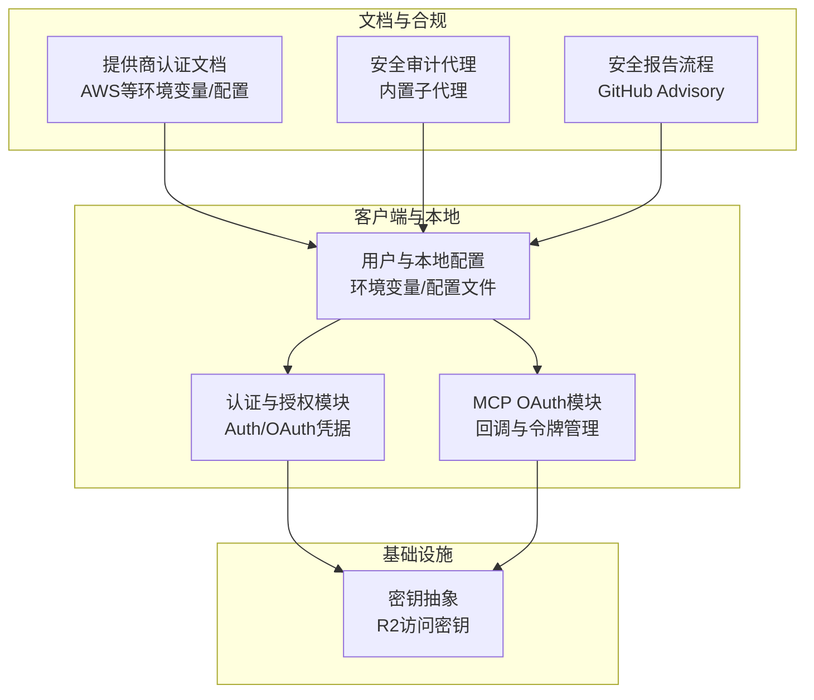
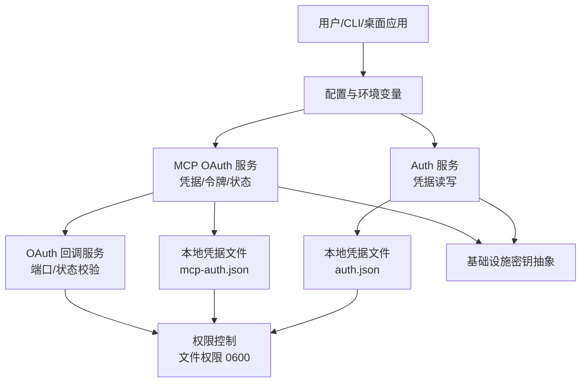
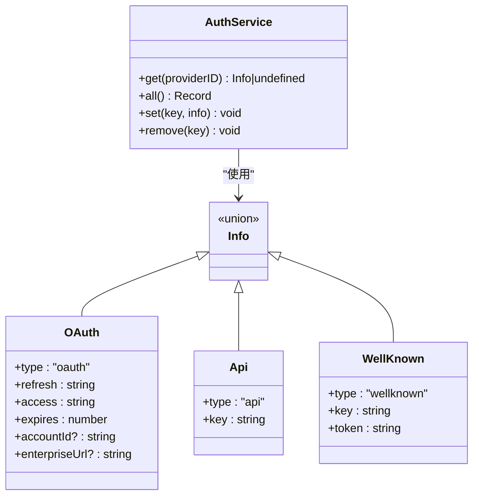
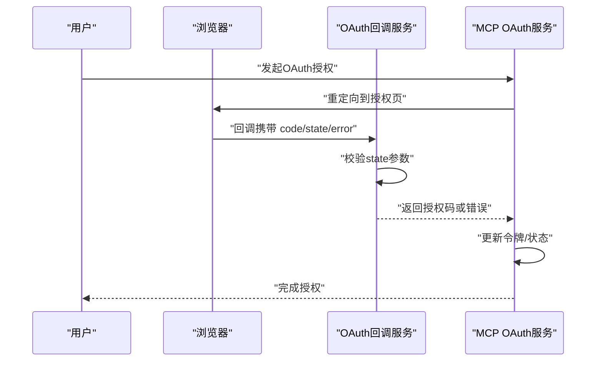
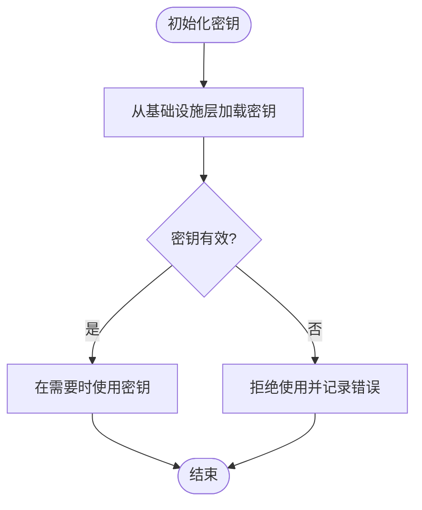
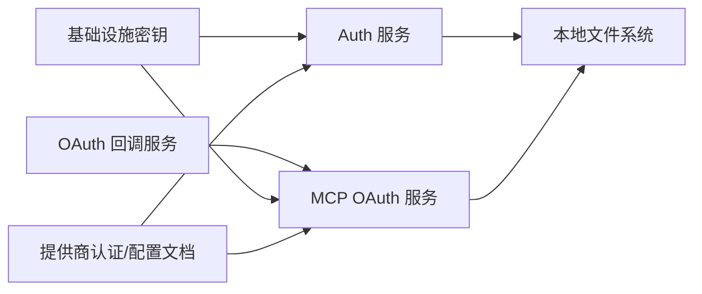

# 安全策略

<cite>
**本文引用的文件**
- [SECURITY.md](file://SECURITY.md)
- [README.md](file://README.md)
- [packages/opencode/src/auth/index.ts](file://packages/opencode/src/auth/index.ts)
- [packages/opencode/src/auth/service.ts](file://packages/opencode/src/auth/service.ts)
- [packages/opencode/src/mcp/auth.ts](file://packages/opencode/src/mcp/auth.ts)
- [packages/opencode/src/mcp/oauth-callback.ts](file://packages/opencode/src/mcp/oauth-callback.ts)
- [infra/secret.ts](file://infra/secret.ts)
- [packages/console/core/src/schema/auth.sql.ts](file://packages/console/core/src/schema/auth.sql.ts)
- [packages/web/src/content/docs/providers.mdx](file://packages/web/src/content/docs/providers.mdx)
- [packages/web/src/content/docs/es/config.mdx](file://packages/web/src/content/docs/es/config.mdx)
- [packages/web/src/content/docs/zh-cn/agents.mdx](file://packages/web/src/content/docs/zh-cn/agents.mdx)
</cite>

## 目录
1. [简介](#简介)
2. [项目结构](#项目结构)
3. [核心组件](#核心组件)
4. [架构总览](#架构总览)
5. [详细组件分析](#详细组件分析)
6. [依赖关系分析](#依赖关系分析)
7. [性能考虑](#性能考虑)
8. [故障排查指南](#故障排查指南)
9. [结论](#结论)
10. [附录](#附录)

## 简介
本文件为 OpenCode 的安全策略综合文档，围绕访问控制、数据保护、安全审计与合规、威胁防护与响应、加密与密钥管理、安全通信协议、安全配置与风险评估等方面进行系统化梳理。OpenCode 是一款本地运行的 AI 编码助手，具备代理系统与工具能力（包括 Shell 执行、文件操作与网络访问），但其权限系统并非沙箱隔离；服务端模式需显式启用并通过环境变量进行基本认证。本文在不展示具体代码内容的前提下，基于仓库中现有文件进行结构化分析与可视化呈现。

## 项目结构
从安全视角看，OpenCode 的安全相关实现主要分布在以下模块：
- 认证与授权：本地凭据存储与 MCP OAuth 凭据管理
- 基础设施与密钥：部署层密钥抽象
- 文档与配置：提供商认证方式与配置注入
- 安全审计与合规：内置安全审计代理与安全报告流程

**图表来源**
- [packages/opencode/src/auth/service.ts:36-78](file://packages/opencode/src/auth/service.ts#L36-L78)
- [packages/opencode/src/mcp/auth.ts:32-67](file://packages/opencode/src/mcp/auth.ts#L32-L67)
- [infra/secret.ts:1-5](file://infra/secret.ts#L1-L5)
- [packages/web/src/content/docs/providers.mdx:171-254](file://packages/web/src/content/docs/providers.mdx#L171-L254)
- [packages/web/src/content/docs/zh-cn/agents.mdx:722-746](file://packages/web/src/content/docs/zh-cn/agents.mdx#L722-L746)
- [SECURITY.md:37-47](file://SECURITY.md#L37-L47)

**章节来源**
- [README.md:100-113](file://README.md#L100-L113)
- [SECURITY.md:9-34](file://SECURITY.md#L9-L34)

## 核心组件
- 本地认证与凭据存储：提供 OAuth、API Key、Well-Known 三种认证类型的数据模型与读写接口，凭据以 JSON 形式存储于受控权限的文件中。
- MCP OAuth 凭据与回调：维护外部 MCP 服务器的 OAuth 凭据、令牌与状态参数，提供回调端口监听与状态校验，防止 CSRF 攻击。
- 基础设施密钥：通过基础设施层抽象 R2 访问密钥，用于云端资源访问。
- 提供商认证与配置注入：通过环境变量与配置文件支持多种提供商认证方式，强调配置优先级与敏感信息分离。
- 安全审计代理：内置安全审计子代理，聚焦输入验证、鉴权授权、数据暴露、依赖与配置安全问题。
- 安全报告流程：提供负责任披露渠道与升级路径，明确非接受 AI 自动生成的漏洞报告。

**章节来源**
- [packages/opencode/src/auth/index.ts:12-57](file://packages/opencode/src/auth/index.ts#L12-L57)
- [packages/opencode/src/auth/service.ts:8-29](file://packages/opencode/src/auth/service.ts#L8-L29)
- [packages/opencode/src/mcp/auth.ts:6-31](file://packages/opencode/src/mcp/auth.ts#L6-L31)
- [packages/opencode/src/mcp/oauth-callback.ts:54-151](file://packages/opencode/src/mcp/oauth-callback.ts#L54-L151)
- [infra/secret.ts:1-5](file://infra/secret.ts#L1-L5)
- [packages/web/src/content/docs/providers.mdx:171-254](file://packages/web/src/content/docs/providers.mdx#L171-L254)
- [packages/web/src/content/docs/zh-cn/agents.mdx:722-746](file://packages/web/src/content/docs/zh-cn/agents.mdx#L722-L746)
- [SECURITY.md:37-47](file://SECURITY.md#L37-L47)

## 架构总览
下图展示了本地凭据与 MCP OAuth 的交互关系，以及基础设施密钥在其中的作用位置。

**图表来源**
- [packages/opencode/src/auth/service.ts:36-78](file://packages/opencode/src/auth/service.ts#L36-L78)
- [packages/opencode/src/mcp/auth.ts:32-67](file://packages/opencode/src/mcp/auth.ts#L32-L67)
- [packages/opencode/src/mcp/oauth-callback.ts:69-135](file://packages/opencode/src/mcp/oauth-callback.ts#L69-L135)
- [infra/secret.ts:1-5](file://infra/secret.ts#L1-L5)

## 详细组件分析

### 组件A：认证与凭据存储（Auth）
- 数据模型：定义 OAuth、API Key、Well-Known 三类认证信息的结构与类型。
- 存储与权限：凭据以 JSON 文件形式保存，写入时设置严格权限，确保本地最小暴露面。
- 接口能力：支持按提供商标识获取、列出全部、新增与删除凭据。
- 错误处理：统一错误类型封装，便于上层捕获与日志记录。

**图表来源**
- [packages/opencode/src/auth/service.ts:8-29](file://packages/opencode/src/auth/service.ts#L8-L29)
- [packages/opencode/src/auth/service.ts:40-47](file://packages/opencode/src/auth/service.ts#L40-L47)
- [packages/opencode/src/auth/index.ts:12-41](file://packages/opencode/src/auth/index.ts#L12-L41)

**章节来源**
- [packages/opencode/src/auth/index.ts:12-57](file://packages/opencode/src/auth/index.ts#L12-L57)
- [packages/opencode/src/auth/service.ts:36-98](file://packages/opencode/src/auth/service.ts#L36-L98)

### 组件B：MCP OAuth 凭据与回调（McpAuth/McpOAuthCallback）
- 凭据管理：维护每个 MCP 的令牌、客户端信息、授权状态与 code_verifier，支持按 URL 校验凭据有效性。
- 回调服务：启动本地 HTTP 服务器监听 OAuth 回调，强制校验 state 参数，防止 CSRF；超时与取消逻辑完善。
- 令牌过期判断：根据过期时间戳判断令牌是否过期，保障后续请求的健壮性。

**图表来源**
- [packages/opencode/src/mcp/oauth-callback.ts:69-135](file://packages/opencode/src/mcp/oauth-callback.ts#L69-L135)
- [packages/opencode/src/mcp/oauth-callback.ts:140-151](file://packages/opencode/src/mcp/oauth-callback.ts#L140-L151)
- [packages/opencode/src/mcp/auth.ts:75-85](file://packages/opencode/src/mcp/auth.ts#L75-L85)

**章节来源**
- [packages/opencode/src/mcp/auth.ts:34-129](file://packages/opencode/src/mcp/auth.ts#L34-L129)
- [packages/opencode/src/mcp/oauth-callback.ts:54-151](file://packages/opencode/src/mcp/oauth-callback.ts#L54-L151)

### 组件C：基础设施密钥（Infrastructure Secret）
- 抽象层：通过基础设施层定义 R2 访问密钥，便于在部署环境中集中管理与注入。
- 安全建议：密钥应仅在受信环境中加载，避免硬编码与泄露。

**图表来源**
- [infra/secret.ts:1-5](file://infra/secret.ts#L1-L5)

**章节来源**
- [infra/secret.ts:1-5](file://infra/secret.ts#L1-L5)

### 组件D：提供商认证与配置注入（Providers/Config）
- 环境变量与配置文件：支持多种提供商认证方式（如 AWS 访问密钥、配置文件、Bearer Token 等），并强调配置文件优先级。
- 敏感信息分离：通过文件占位符与环境变量占位符，将密钥与敏感内容分离到独立文件，降低泄露风险。
- 配置示例：提供 AWS Bedrock 等场景的配置示例与最佳实践。

**章节来源**
- [packages/web/src/content/docs/providers.mdx:171-254](file://packages/web/src/content/docs/providers.mdx#L171-L254)
- [packages/web/src/content/docs/es/config.mdx:635-685](file://packages/web/src/content/docs/es/config.mdx#L635-L685)

### 组件E：安全审计代理（Security Auditor Agent）
- 角色定位：内置安全审计子代理，专注于识别潜在安全问题（输入验证、鉴权授权、数据暴露、依赖与配置安全）。
- 使用建议：在探索未知代码库或规划变更前，优先运行安全审计代理以发现风险点。

**章节来源**
- [packages/web/src/content/docs/zh-cn/agents.mdx:722-746](file://packages/web/src/content/docs/zh-cn/agents.mdx#L722-L746)

## 依赖关系分析
- 认证服务依赖本地文件系统进行凭据持久化，写入时设置严格权限，降低本地泄露风险。
- MCP OAuth 服务依赖认证服务提供的凭据与回调服务，形成“凭据—令牌—状态”的闭环。
- 基础设施密钥为云资源访问提供凭证，应与本地凭据分层管理。
- 文档与配置层提供安全实践指导，约束环境变量与配置文件的使用方式。

**图表来源**
- [packages/opencode/src/auth/service.ts:36-78](file://packages/opencode/src/auth/service.ts#L36-L78)
- [packages/opencode/src/mcp/auth.ts:32-67](file://packages/opencode/src/mcp/auth.ts#L32-L67)
- [packages/opencode/src/mcp/oauth-callback.ts:69-135](file://packages/opencode/src/mcp/oauth-callback.ts#L69-L135)
- [infra/secret.ts:1-5](file://infra/secret.ts#L1-L5)
- [packages/web/src/content/docs/providers.mdx:171-254](file://packages/web/src/content/docs/providers.mdx#L171-L254)

**章节来源**
- [packages/opencode/src/auth/service.ts:36-98](file://packages/opencode/src/auth/service.ts#L36-L98)
- [packages/opencode/src/mcp/auth.ts:32-129](file://packages/opencode/src/mcp/auth.ts#L32-L129)
- [packages/web/src/content/docs/providers.mdx:171-254](file://packages/web/src/content/docs/providers.mdx#L171-L254)

## 性能考虑
- 凭据读写：采用惰性读取与缓存策略，减少频繁 IO；写入时批量合并，避免碎片化。
- 回调服务：本地端口占用检测与复用，避免重复启动带来的资源浪费。
- 令牌过期判断：基于时间戳快速判定，避免无效请求链路。

[本节为通用建议，无需特定文件来源]

## 故障排查指南
- OAuth 回调失败
  - 检查回调端口是否被占用，确认状态参数存在且未过期。
  - 查看回调服务日志，定位缺失状态或无效状态的错误原因。
- 凭据无法读取或写入
  - 核对凭据文件权限与路径，确保写入时权限正确设置。
  - 检查凭据 JSON 结构是否符合模型定义。
- MCP 凭据失效
  - 若服务器 URL 发生变化，旧凭据会被视为无效；重新授权并更新凭据。
  - 使用调试命令查看当前认证状态与连接情况。

**章节来源**
- [packages/opencode/src/mcp/oauth-callback.ts:162-173](file://packages/opencode/src/mcp/oauth-callback.ts#L162-L173)
- [packages/opencode/src/mcp/oauth-callback.ts:175-187](file://packages/opencode/src/mcp/oauth-callback.ts#L175-L187)
- [packages/opencode/src/mcp/auth.ts:43-54](file://packages/opencode/src/mcp/auth.ts#L43-L54)
- [packages/web/src/content/docs/da/mcp-servers.mdx:276-288](file://packages/web/src/content/docs/da/mcp-servers.mdx#L276-L288)

## 结论
OpenCode 在本地运行与工具执行方面提供了基础的访问控制提示与最小权限原则，但其权限系统并非沙箱隔离；服务端模式需显式启用并通过环境变量进行基本认证。认证与凭据管理通过本地文件与严格的权限控制实现，MCP OAuth 流程包含状态校验与回调服务，基础设施层提供密钥抽象。安全审计代理与安全报告流程进一步完善了安全运营闭环。建议在生产环境中结合容器或虚拟机隔离、严格的密钥管理与最小权限原则，持续进行安全审计与风险评估。

[本节为总结性内容，无需特定文件来源]

## 附录

### 安全威胁与防护要点
- 本地权限与隔离：无沙箱设计，建议在容器或 VM 中运行以获得更强隔离。
- 服务端模式：需设置密码并谨慎暴露网络接口。
- 外部 MCP 信任边界：外部 MCP 不在信任范围内，需严格限制与验证。
- 配置与凭据：避免在配置中直接暴露敏感信息，优先使用文件占位符与环境变量。

**章节来源**
- [SECURITY.md:15-33](file://SECURITY.md#L15-L33)

### 加密策略与密钥管理
- 本地凭据：凭据文件写入时设置严格权限，降低本地泄露风险。
- 基础设施密钥：通过基础设施层抽象密钥，避免硬编码与扩散。
- 传输安全：服务端模式需配合 HTTPS 与强认证；MCP OAuth 回调在本地端口运行，注意防火墙与网络隔离。

**章节来源**
- [packages/opencode/src/auth/service.ts:74-76](file://packages/opencode/src/auth/service.ts#L74-L76)
- [infra/secret.ts:1-5](file://infra/secret.ts#L1-L5)
- [SECURITY.md:21-23](file://SECURITY.md#L21-L23)

### 安全配置选项与合规要求
- 环境变量与配置文件：优先使用配置文件，敏感信息通过文件占位符注入。
- 提供商认证：遵循各提供商的认证规范与合规要求。
- 安全审计：定期运行安全审计代理，识别输入验证、鉴权授权、数据暴露与配置安全问题。

**章节来源**
- [packages/web/src/content/docs/providers.mdx:171-254](file://packages/web/src/content/docs/providers.mdx#L171-L254)
- [packages/web/src/content/docs/es/config.mdx:635-685](file://packages/web/src/content/docs/es/config.mdx#L635-L685)
- [packages/web/src/content/docs/zh-cn/agents.mdx:722-746](file://packages/web/src/content/docs/zh-cn/agents.mdx#L722-L746)

### 风险评估与应急响应
- 风险评估：基于威胁模型识别本地权限滥用、服务端未授权访问、外部 MCP 行为不可控等风险。
- 应急响应：建立安全事件上报与升级机制，遵循负责任披露流程，必要时采取隔离与回滚措施。

**章节来源**
- [SECURITY.md:9-34](file://SECURITY.md#L9-L34)
- [SECURITY.md:37-47](file://SECURITY.md#L37-L47)