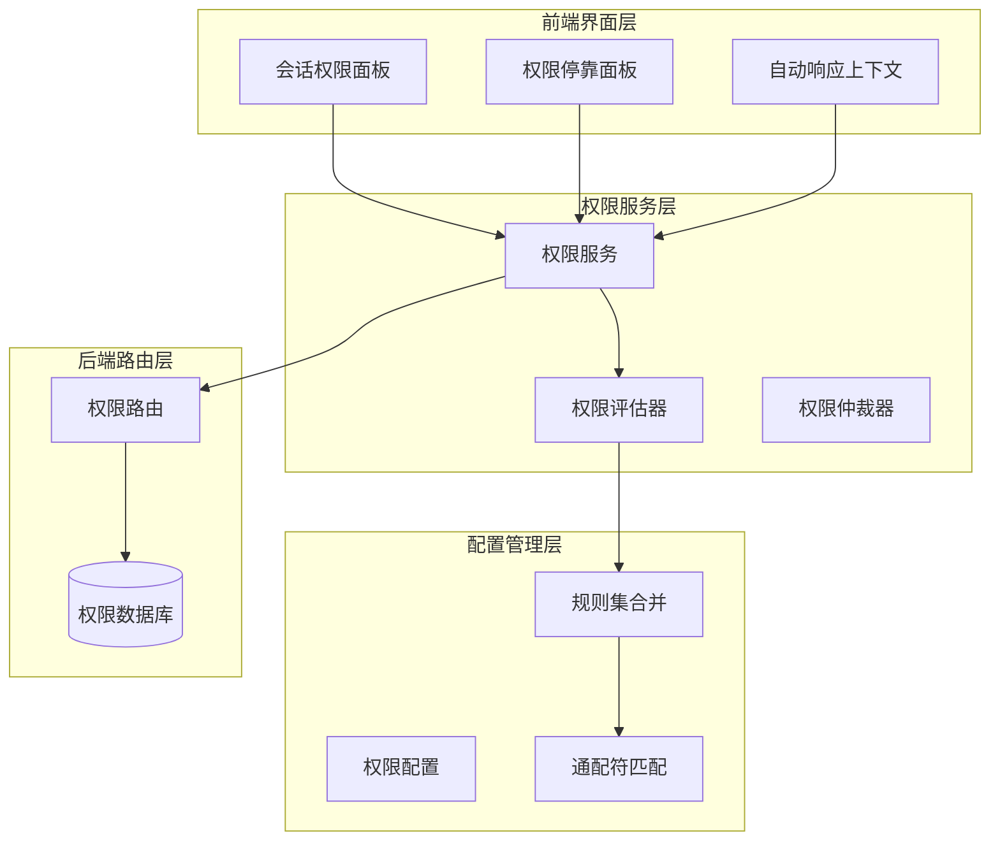
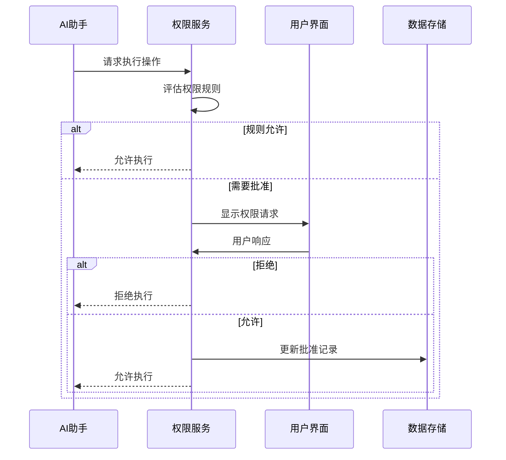
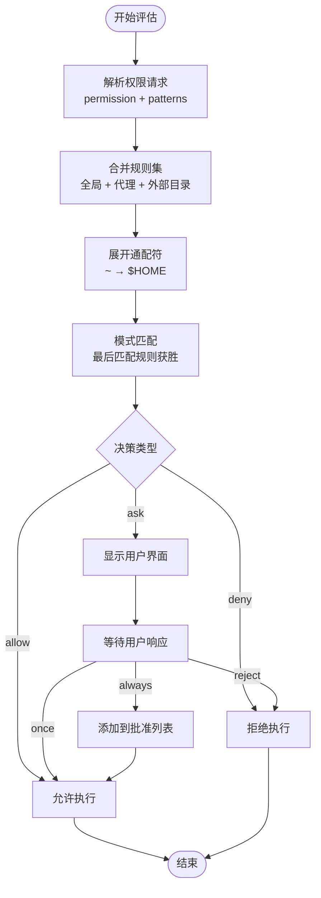
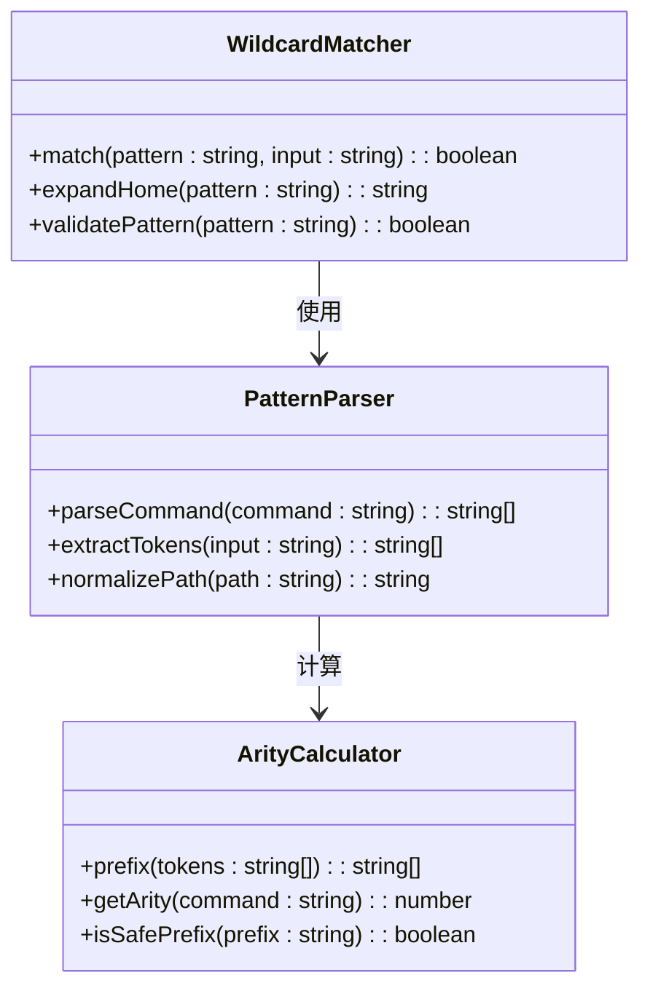
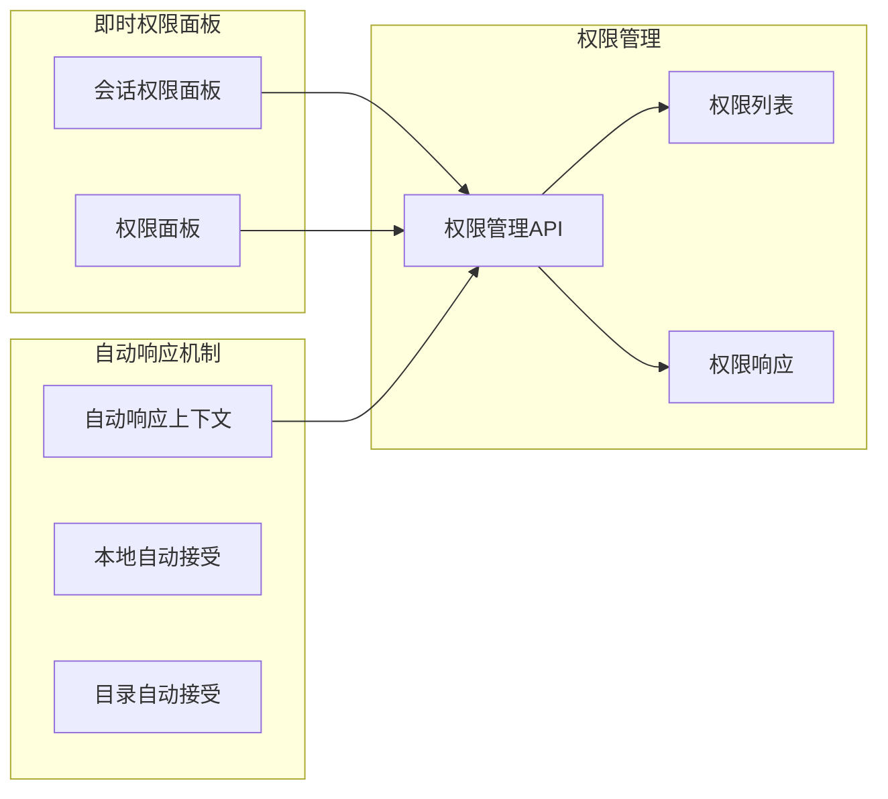
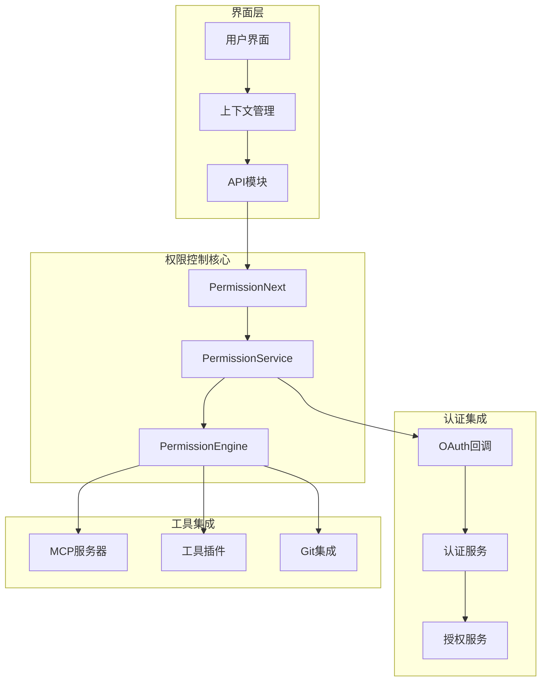
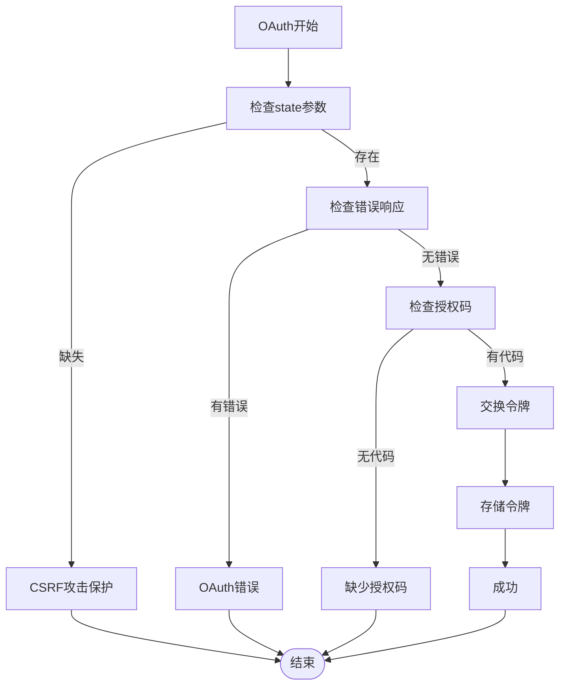

# 权限控制系统

<cite>
**本文档引用的文件**
- [packages/web/src/content/docs/permissions.mdx](file://packages/web/src/content/docs/permissions.mdx)
- [packages/opencode/src/permission/next.ts](file://packages/opencode/src/permission/next.ts)
- [packages/opencode/src/permission/service.ts](file://packages/opencode/src/permission/service.ts)
- [packages/opencode/src/permission/schema.ts](file://packages/opencode/src/permission/schema.ts)
- [packages/opencode/src/permission/arity.ts](file://packages/opencode/src/permission/arity.ts)
- [packages/opencode/src/server/routes/permission.ts](file://packages/opencode/src/server/routes/permission.ts)
- [packages/strategy-front/src/api/modules/permission.ts](file://packages/strategy-front/src/api/modules/permission.ts)
- [packages/app/src/context/permission.tsx](file://packages/app/src/context/permission.tsx)
- [packages/app/src/context/permission-auto-respond.ts](file://packages/app/src/context/permission-auto-respond.ts)
- [packages/app/src/pages/session/composer/session-permission-dock.tsx](file://packages/app/src/pages/session/composer/session-permission-dock.tsx)
- [packages/strategy-front/src/components/chat/permission-panel.tsx](file://packages/strategy-front/src/components/chat/permission-panel.tsx)
- [packages/opencode/src/mcp/oauth-callback.ts](file://packages/opencode/src/mcp/oauth-callback.ts)
- [packages/web/src/content/docs/mcp-servers.mdx](file://packages/web/src/content/docs/mcp-servers.mdx)
</cite>

## 目录
1. [简介](#简介)
2. [项目结构](#项目结构)
3. [核心组件](#核心组件)
4. [架构概览](#架构概览)
5. [详细组件分析](#详细组件分析)
6. [依赖分析](#依赖分析)
7. [性能考虑](#性能考虑)
8. [故障排除指南](#故障排除指南)
9. [结论](#结论)
10. [附录](#附录)

## 简介

OpenCode权限控制系统是一个基于规则的动态权限管理框架，旨在为AI助手的各种操作提供细粒度的安全控制。该系统采用"PermissionNext"权限模型，通过配置化的规则集来决定何时需要用户批准、何时允许自动执行、何时完全阻止。

系统的核心设计理念是"最小权限原则"和"透明控制"，通过可配置的权限规则、灵活的模式匹配和智能的自动响应机制，为用户提供既安全又便捷的开发体验。

## 项目结构

权限控制系统分布在多个包中，形成了完整的权限管理生态：



**图表来源**
- [packages/app/src/context/permission.tsx:47-278](file://packages/app/src/context/permission.tsx#L47-L278)
- [packages/opencode/src/permission/service.ts:130-256](file://packages/opencode/src/permission/service.ts#L130-L256)
- [packages/opencode/src/server/routes/permission.ts:9-70](file://packages/opencode/src/server/routes/permission.ts#L9-L70)

**章节来源**
- [packages/app/src/context/permission.tsx:1-278](file://packages/app/src/context/permission.tsx#L1-L278)
- [packages/opencode/src/permission/service.ts:1-266](file://packages/opencode/src/permission/service.ts#L1-L266)

## 核心组件

### 权限模型架构

PermissionNext权限模型采用分层设计，包含以下核心层次：

1. **配置层**：定义权限规则和默认行为
2. **评估层**：执行规则匹配和决策逻辑
3. **服务层**：管理权限请求生命周期
4. **界面层**：提供用户交互和反馈

### 权限类型定义

系统支持多种权限类型，每种都有特定的应用场景：

| 权限类型 | 功能描述 | 应用场景 | 默认行为 |
|---------|----------|----------|----------|
| `read` | 文件读取权限 | 代码浏览、文档查看 | 允许（除敏感文件外） |
| `edit` | 文件编辑权限 | 代码修改、文件创建 | 询问（高风险操作） |
| `bash` | Shell命令执行 | 构建脚本、系统操作 | 询问（潜在危险） |
| `webfetch` | 网络请求 | API调用、数据获取 | 询问（网络访问） |
| `task` | 子代理调用 | 任务委派、功能扩展 | 询问（代理权限） |
| `skill` | 技能加载 | 功能模块启用 | 询问（功能权限） |

**章节来源**
- [packages/web/src/content/docs/permissions.mdx:128-146](file://packages/web/src/content/docs/permissions.mdx#L128-L146)
- [packages/opencode/src/permission/service.ts:17-36](file://packages/opencode/src/permission/service.ts#L17-L36)

## 架构概览

权限控制系统采用事件驱动的异步架构，通过消息总线实现组件间的解耦：



**图表来源**
- [packages/opencode/src/permission/service.ts:148-183](file://packages/opencode/src/permission/service.ts#L148-L183)
- [packages/app/src/context/permission.tsx:120-171](file://packages/app/src/context/permission.tsx#L120-L171)

**章节来源**
- [packages/opencode/src/permission/service.ts:122-256](file://packages/opencode/src/permission/service.ts#L122-L256)

## 详细组件分析

### 权限评估引擎

权限评估引擎是系统的核心，负责将配置规则转换为可执行的决策逻辑：



**图表来源**
- [packages/opencode/src/permission/next.ts:77-79](file://packages/opencode/src/permission/next.ts#L77-L79)
- [packages/opencode/src/permission/service.ts:258-265](file://packages/opencode/src/permission/service.ts#L258-L265)

#### 权限规则合并机制

系统支持多层级规则合并，遵循"最近优先"原则：

1. **全局规则**：适用于所有操作的基础策略
2. **代理规则**：针对特定代理的定制化权限
3. **外部目录规则**：专门处理跨工作区访问

**章节来源**
- [packages/opencode/src/permission/next.ts:65-67](file://packages/opencode/src/permission/next.ts#L65-L67)
- [packages/web/src/content/docs/permissions.mdx:184-190](file://packages/web/src/content/docs/permissions.mdx#L184-L190)

### 模式匹配系统

系统采用灵活的通配符匹配机制，支持复杂的路径和命令模式：



**图表来源**
- [packages/opencode/src/permission/next.ts:18-24](file://packages/opencode/src/permission/next.ts#L18-L24)
- [packages/opencode/src/permission/arity.ts:1-164](file://packages/opencode/src/permission/arity.ts#L1-L164)

#### Bash命令复杂度计算

对于bash权限，系统实现了智能的命令前缀识别：

| 命令前缀 | 词元数量 | 示例命令 | 安全级别 |
|---------|---------|----------|----------|
| git | 2 | git checkout main | 中等 |
| npm run | 3 | npm run dev | 高 |
| docker compose | 3 | docker compose up | 高 |
| kubectl rollout | 3 | kubectl rollout restart | 高 |
| terraform workspace | 3 | terraform workspace select | 中等 |

**章节来源**
- [packages/opencode/src/permission/arity.ts:25-162](file://packages/opencode/src/permission/arity.ts#L25-L162)

### 用户界面集成

系统提供了多层次的用户交互界面：



**图表来源**
- [packages/app/src/pages/session/composer/session-permission-dock.tsx:1-75](file://packages/app/src/pages/session/composer/session-permission-dock.tsx#L1-L75)
- [packages/strategy-front/src/components/chat/permission-panel.tsx:1-67](file://packages/strategy-front/src/components/chat/permission-panel.tsx#L1-L67)
- [packages/app/src/context/permission.tsx:141-171](file://packages/app/src/context/permission.tsx#L141-L171)

**章节来源**
- [packages/app/src/context/permission.tsx:1-278](file://packages/app/src/context/permission.tsx#L1-L278)

## 依赖分析

权限控制系统与其他模块的依赖关系如下：



**图表来源**
- [packages/opencode/src/mcp/oauth-callback.ts:73-109](file://packages/opencode/src/mcp/oauth-callback.ts#L73-L109)
- [packages/strategy-front/src/api/modules/permission.ts:1-16](file://packages/strategy-front/src/api/modules/permission.ts#L1-L16)

**章节来源**
- [packages/opencode/src/server/routes/permission.ts:1-70](file://packages/opencode/src/server/routes/permission.ts#L1-L70)

## 性能考虑

### 规则评估优化

系统采用了多项性能优化策略：

1. **规则缓存**：已评估的规则结果进行缓存
2. **增量更新**：只重新评估受影响的规则
3. **并行处理**：多个权限请求的并发处理
4. **内存管理**：定期清理过期的权限状态

### 内存使用优化

- 最大响应缓存条目：1000个
- 响应TTL：60分钟
- 自动清理机制：定期移除过期条目

## 故障排除指南

### 常见权限问题

| 问题类型 | 症状 | 解决方案 |
|---------|------|----------|
| 权限循环 | 同一操作反复被拒绝 | 检查`doom_loop`规则 |
| 路径访问失败 | 外部目录无法访问 | 配置`external_directory`规则 |
| Bash命令被阻止 | 常用命令无法执行 | 添加安全命令前缀规则 |
| 代理权限冲突 | 子代理调用失败 | 检查`permission.task`配置 |

### OAuth集成问题



**图表来源**
- [packages/opencode/src/mcp/oauth-callback.ts:85-109](file://packages/opencode/src/mcp/oauth-callback.ts#L85-L109)

**章节来源**
- [packages/opencode/src/mcp/oauth-callback.ts:73-109](file://packages/opencode/src/mcp/oauth-callback.ts#L73-L109)

## 结论

OpenCode权限控制系统通过其精心设计的PermissionNext模型，为AI助手的各类操作提供了全面而灵活的安全控制。系统的核心优势包括：

1. **多层次权限控制**：从全局到具体的细粒度控制
2. **智能模式匹配**：支持复杂的路径和命令模式
3. **透明的用户交互**：清晰的权限请求和响应流程
4. **强大的扩展性**：支持自定义权限类型和规则

该系统在保证安全性的同时，最大程度地减少了对用户工作流的干扰，是现代AI开发环境中不可或缺的安全基础设施。

## 附录

### 权限配置示例

完整的权限配置示例展示了各种权限类型的组合使用：

```json
{
  "$schema": "https://opencode.ai/config.json",
  "permission": {
    "*": "ask",
    "bash": {
      "*": "deny",
      "git status": "allow",
      "git commit": "ask",
      "docker *": "deny"
    },
    "edit": {
      "*.env": "deny",
      "packages/web/src/**": "allow"
    },
    "external_directory": {
      "~/projects/personal/**": "allow"
    }
  }
}
```

### 安全最佳实践

1. **最小权限原则**：始终使用最严格的权限配置
2. **定期审查**：定期检查和更新权限规则
3. **监控日志**：启用权限使用日志进行审计
4. **备份配置**：定期备份权限配置以防丢失