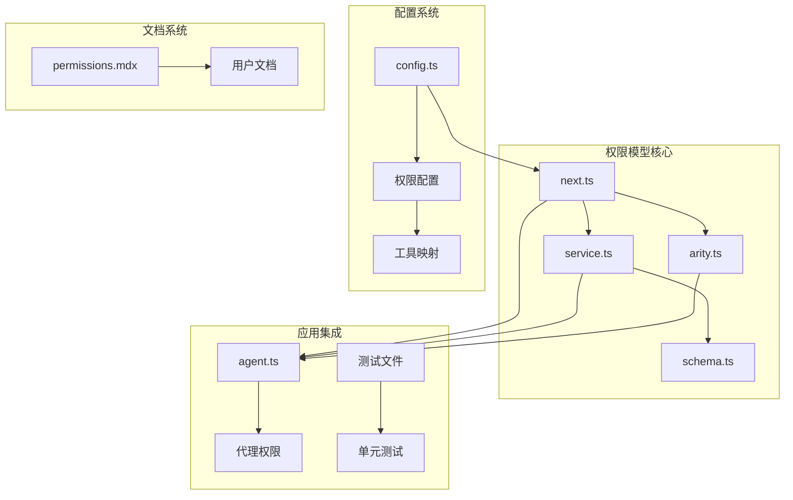
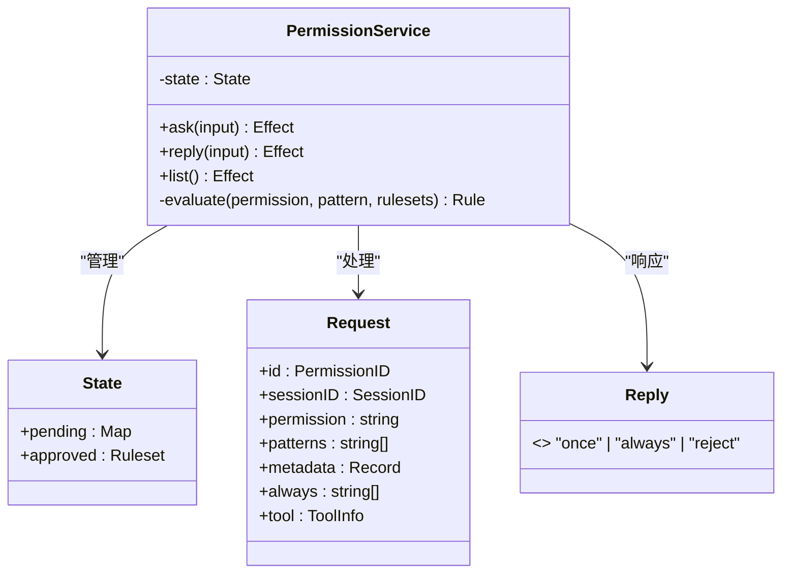
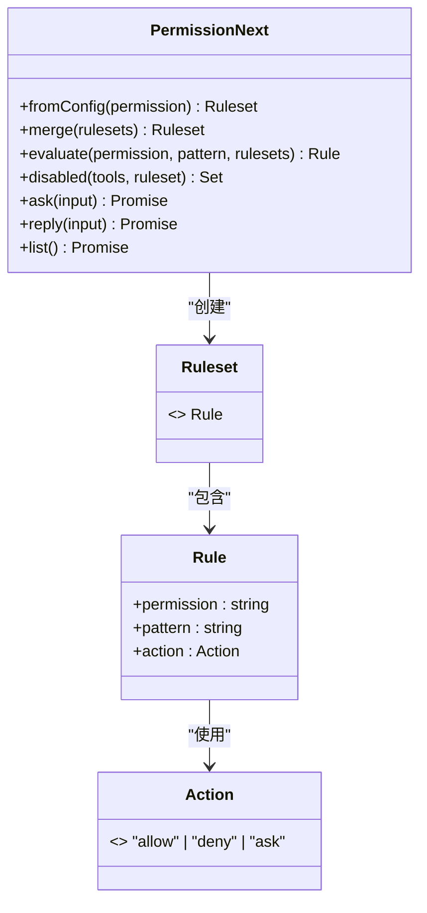
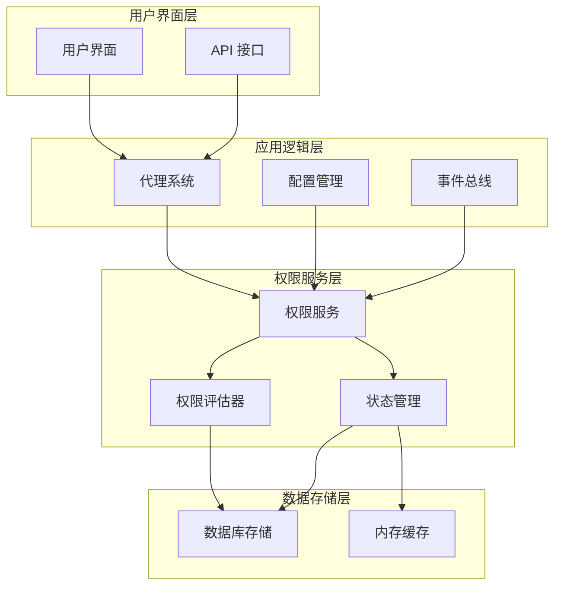
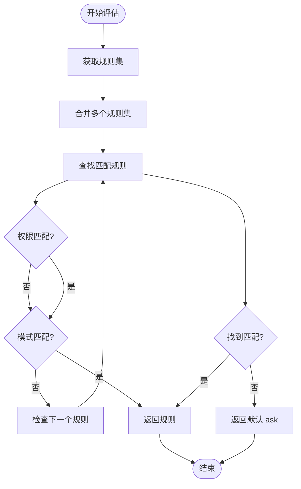
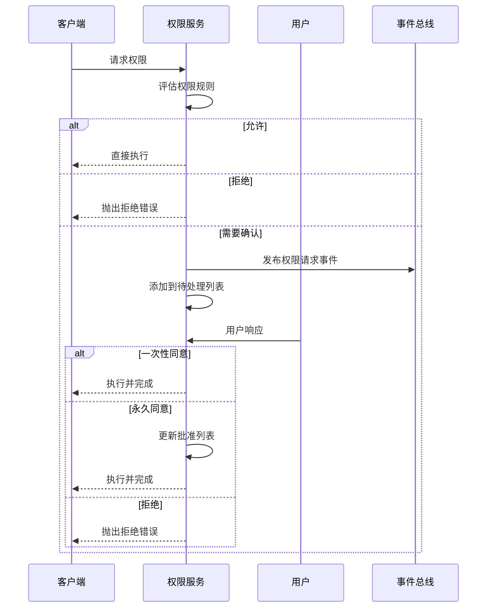
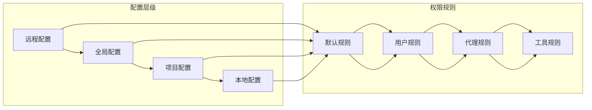
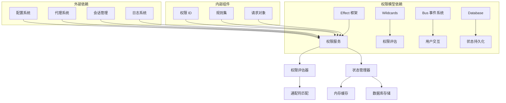
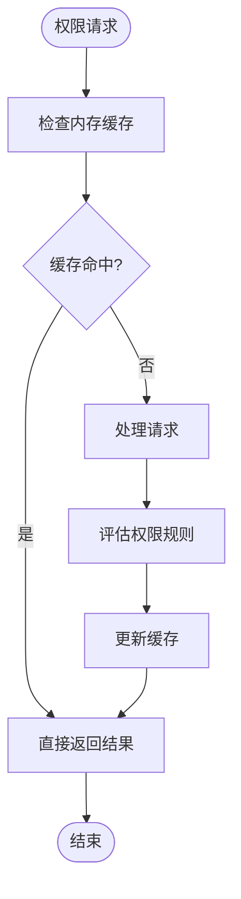

# 权限模型设计

<cite>
**本文档引用的文件**
- [packages/opencode/src/permission/next.ts](file://packages/opencode/src/permission/next.ts)
- [packages/opencode/src/permission/service.ts](file://packages/opencode/src/permission/service.ts)
- [packages/opencode/src/permission/schema.ts](file://packages/opencode/src/permission/schema.ts)
- [packages/opencode/src/permission/arity.ts](file://packages/opencode/src/permission/arity.ts)
- [packages/opencode/src/agent/agent.ts](file://packages/opencode/src/agent/agent.ts)
- [packages/opencode/src/config/config.ts](file://packages/opencode/src/config/config.ts)
- [packages/opencode/test/permission/next.test.ts](file://packages/opencode/test/permission/next.test.ts)
- [packages/opencode/test/permission/arity.test.ts](file://packages/opencode/test/permission/arity.test.ts)
- [packages/web/src/content/docs/zh/permissions.mdx](file://packages/web/src/content/docs/zh/permissions.mdx)
</cite>

## 目录
1. [简介](#简介)
2. [项目结构](#项目结构)
3. [核心组件](#核心组件)
4. [架构概览](#架构概览)
5. [详细组件分析](#详细组件分析)
6. [依赖关系分析](#依赖关系分析)
7. [性能考虑](#性能考虑)
8. [故障排除指南](#故障排除指南)
9. [结论](#结论)
10. [附录](#附录)

## 简介

PermissionNext 是 OpenCode 项目中的核心权限管理模型，它提供了一个灵活且可扩展的权限控制系统，支持多种工具类型的权限控制、动态评估算法和用户交互流程。该模型采用规则驱动的设计理念，通过配置化的权限规则来控制不同工具的使用行为。

该权限模型的主要特点包括：
- 多层次权限控制：支持全局、工具级别和具体模式的权限控制
- 动态评估算法：基于通配符匹配的智能权限评估
- 用户交互机制：支持一次性授权、永久授权和拒绝操作
- 配置灵活性：支持 JSON 配置文件和运行时动态配置
- 性能优化：采用缓存和延迟加载机制提升系统性能

## 项目结构

PermissionNext 权限模型在代码库中的组织结构如下：



**图表来源**
- [packages/opencode/src/permission/next.ts:1-94](file://packages/opencode/src/permission/next.ts#L1-L94)
- [packages/opencode/src/permission/service.ts:1-266](file://packages/opencode/src/permission/service.ts#L1-L266)
- [packages/opencode/src/config/config.ts:626-692](file://packages/opencode/src/config/config.ts#L626-L692)

**章节来源**
- [packages/opencode/src/permission/next.ts:1-94](file://packages/opencode/src/permission/next.ts#L1-L94)
- [packages/opencode/src/permission/service.ts:1-266](file://packages/opencode/src/permission/service.ts#L1-L266)
- [packages/opencode/src/config/config.ts:626-692](file://packages/opencode/src/config/config.ts#L626-L692)

## 核心组件

### 权限服务层

权限服务层是 PermissionNext 的核心执行引擎，负责处理权限请求、管理用户交互和维护权限状态。



**图表来源**
- [packages/opencode/src/permission/service.ts:107-128](file://packages/opencode/src/permission/service.ts#L107-L128)

### 规则集管理层

规则集管理层负责权限规则的解析、合并和评估，支持复杂的权限组合逻辑。



**图表来源**
- [packages/opencode/src/permission/next.ts:47-92](file://packages/opencode/src/permission/next.ts#L47-L92)

**章节来源**
- [packages/opencode/src/permission/service.ts:122-256](file://packages/opencode/src/permission/service.ts#L122-L256)
- [packages/opencode/src/permission/next.ts:17-94](file://packages/opencode/src/permission/next.ts#L17-L94)

## 架构概览

PermissionNext 采用分层架构设计，将权限控制逻辑与业务逻辑分离，提供了清晰的职责划分和良好的扩展性。



**图表来源**
- [packages/opencode/src/permission/service.ts:130-256](file://packages/opencode/src/permission/service.ts#L130-L256)
- [packages/opencode/src/agent/agent.ts:52-252](file://packages/opencode/src/agent/agent.ts#L52-L252)

## 详细组件分析

### 权限评估算法

PermissionNext 的权限评估算法是整个系统的核心，它实现了基于通配符匹配的智能权限判断机制。



**图表来源**
- [packages/opencode/src/permission/service.ts:258-265](file://packages/opencode/src/permission/service.ts#L258-L265)

#### 评估算法特性

1. **最后匹配规则获胜原则**：当存在多个匹配规则时，最后一个匹配的规则具有最高优先级
2. **通配符支持**：支持 `*` 和 `?` 通配符进行灵活的模式匹配
3. **权限优先级**：特定权限规则优先于通用规则
4. **性能优化**：使用 `findLast` 方法从后向前查找，确保最后匹配规则获胜

**章节来源**
- [packages/opencode/src/permission/service.ts:258-265](file://packages/opencode/src/permission/service.ts#L258-L265)
- [packages/opencode/test/permission/next.test.ts:192-370](file://packages/opencode/test/permission/next.test.ts#L192-L370)

### 用户交互流程

PermissionNext 实现了完整的用户交互流程，包括权限请求、用户响应和状态更新。



**图表来源**
- [packages/opencode/src/permission/service.ts:148-246](file://packages/opencode/src/permission/service.ts#L148-L246)

**章节来源**
- [packages/opencode/src/permission/service.ts:148-246](file://packages/opencode/src/permission/service.ts#L148-L246)
- [packages/opencode/test/permission/next.test.ts:481-790](file://packages/opencode/test/permission/next.test.ts#L481-L790)

### 工具类型权限体系

PermissionNext 支持多种工具类型的权限控制，每种工具都有其特定的权限定义和使用场景。

#### 核心工具类型

| 工具类型 | 权限键 | 默认行为 | 使用场景 |
|---------|--------|----------|----------|
| Bash 命令 | `bash` | ask | 执行系统命令 |
| 文件编辑 | `edit` | allow | 编辑文件内容 |
| 文件读取 | `read` | allow | 读取文件内容 |
| 任务调度 | `task` | allow | 调度子任务 |
| 外部目录 | `external_directory` | ask | 访问外部目录 |

**章节来源**
- [packages/opencode/src/config/config.ts:661-692](file://packages/opencode/src/config/config.ts#L661-L692)
- [packages/opencode/src/agent/agent.ts:57-74](file://packages/opencode/src/agent/agent.ts#L57-L74)

### 配置系统集成

PermissionNext 与配置系统深度集成，支持多层级的权限配置覆盖。



**图表来源**
- [packages/opencode/src/config/config.ts:78-266](file://packages/opencode/src/config/config.ts#L78-L266)

**章节来源**
- [packages/opencode/src/config/config.ts:78-266](file://packages/opencode/src/config/config.ts#L78-L266)
- [packages/opencode/src/agent/agent.ts:52-252](file://packages/opencode/src/agent/agent.ts#L52-L252)

## 依赖关系分析

PermissionNext 权限模型与其他系统组件的依赖关系如下：



**图表来源**
- [packages/opencode/src/permission/service.ts:1-15](file://packages/opencode/src/permission/service.ts#L1-L15)
- [packages/opencode/src/permission/next.ts:1-8](file://packages/opencode/src/permission/next.ts#L1-L8)

**章节来源**
- [packages/opencode/src/permission/service.ts:1-15](file://packages/opencode/src/permission/service.ts#L1-L15)
- [packages/opencode/src/permission/next.ts:1-8](file://packages/opencode/src/permission/next.ts#L1-L8)

## 性能考虑

PermissionNext 在设计时充分考虑了性能优化，采用了多种策略来提升系统的响应速度和资源利用率。

### 缓存策略

1. **内存缓存**：权限状态和规则集存储在内存中，避免频繁的磁盘访问
2. **延迟加载**：配置文件按需加载，减少启动时间
3. **规则集合并**：预合并多个规则集，避免重复计算

### 优化技术



**图表来源**
- [packages/opencode/src/permission/service.ts:136-146](file://packages/opencode/src/permission/service.ts#L136-L146)

### 性能监控

系统提供了详细的性能监控机制，包括：
- 权限评估耗时统计
- 内存使用情况监控
- 数据库查询性能分析
- 用户交互响应时间

## 故障排除指南

### 常见问题及解决方案

#### 权限评估不生效

**问题描述**：权限规则设置后未生效

**可能原因**：
1. 规则优先级问题
2. 通配符匹配错误
3. 规则集合并顺序问题

**解决步骤**：
1. 检查规则的优先级顺序
2. 验证通配符表达式的正确性
3. 确认规则集的合并顺序

#### 用户交互异常

**问题描述**：用户无法正常响应权限请求

**可能原因**：
1. 事件总线通信问题
2. 状态同步失败
3. 异步操作超时

**解决步骤**：
1. 检查事件总线连接状态
2. 验证状态同步机制
3. 调整异步操作超时时间

**章节来源**
- [packages/opencode/src/permission/service.ts:102-110](file://packages/opencode/src/permission/service.ts#L102-L110)
- [packages/opencode/test/permission/next.test.ts:481-790](file://packages/opencode/test/permission/next.test.ts#L481-L790)

## 结论

PermissionNext 权限模型是一个设计精良、功能完善的权限控制系统。它通过以下关键特性实现了高效的权限管理：

1. **模块化设计**：清晰的分层架构便于维护和扩展
2. **智能评估**：基于通配符匹配的灵活权限判断
3. **用户友好**：完整的用户交互流程和反馈机制
4. **性能优化**：多层缓存和延迟加载策略
5. **配置灵活**：支持多层级的权限配置覆盖

该模型为 OpenCode 项目提供了强大的权限控制能力，能够满足从简单到复杂的各种权限管理需求。

## 附录

### 配置示例

#### 基础权限配置
```json
{
  "permission": {
    "*": "ask",
    "bash": "allow",
    "edit": "deny"
  }
}
```

#### 高级权限配置
```json
{
  "permission": {
    "bash": {
      "*": "ask",
      "rm": "deny",
      "ls": "allow"
    },
    "edit": {
      "src/*": "allow",
      "src/secret/*": "deny"
    }
  }
}
```

### 最佳实践

1. **最小权限原则**：为每个工具设置最小必要的权限
2. **分层配置**：使用多层级配置实现灵活的权限控制
3. **定期审查**：定期审查和更新权限配置
4. **监控告警**：建立权限使用情况的监控机制

### 设计模式

1. **规则模式**：使用规则集管理复杂的权限逻辑
2. **观察者模式**：通过事件总线实现用户交互
3. **策略模式**：支持不同的权限评估策略
4. **工厂模式**：动态创建权限服务实例