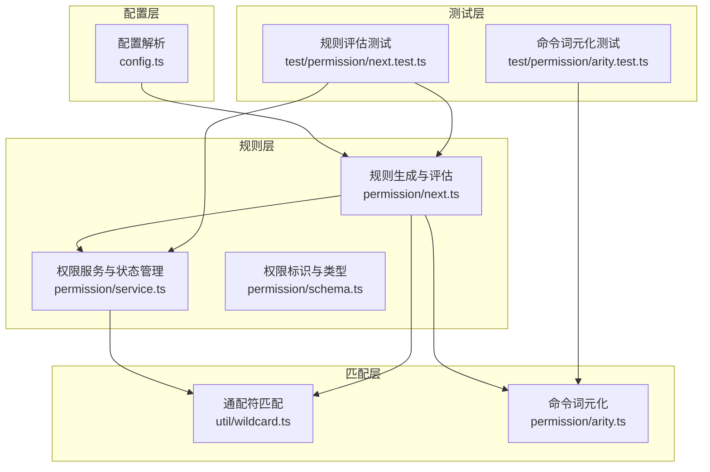
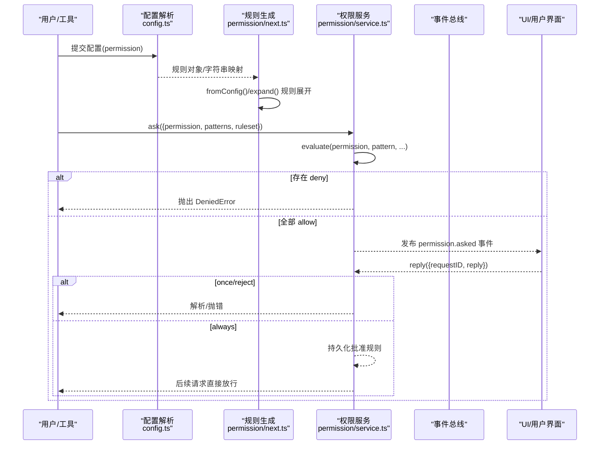
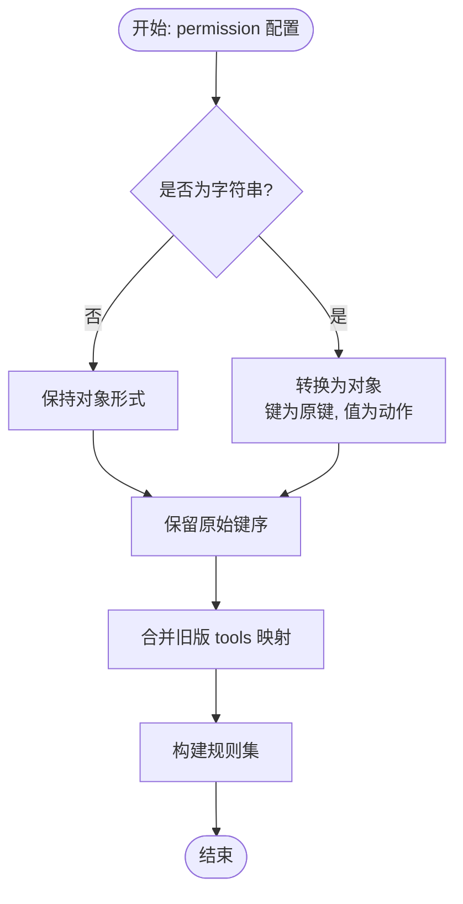
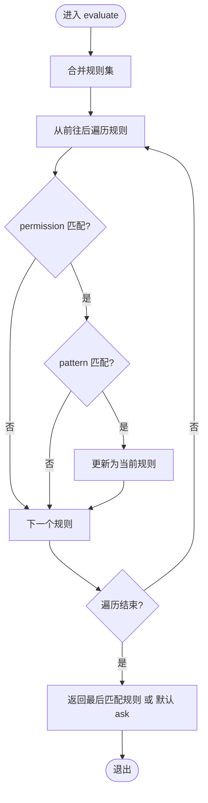
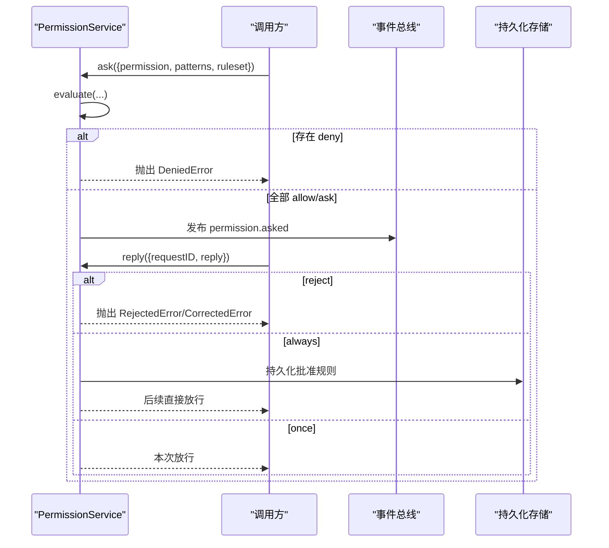
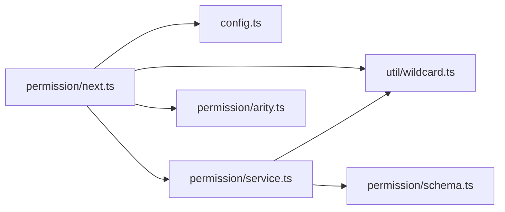

# 权限规则配置

<cite>
**本文档引用的文件**
- [packages/opencode/src/permission/next.ts](file://packages/opencode/src/permission/next.ts)
- [packages/opencode/src/permission/service.ts](file://packages/opencode/src/permission/service.ts)
- [packages/opencode/src/permission/schema.ts](file://packages/opencode/src/permission/schema.ts)
- [packages/opencode/src/permission/arity.ts](file://packages/opencode/src/permission/arity.ts)
- [packages/opencode/src/util/wildcard.ts](file://packages/opencode/src/util/wildcard.ts)
- [packages/opencode/src/config/config.ts](file://packages/opencode/src/config/config.ts)
- [packages/opencode/test/permission/next.test.ts](file://packages/opencode/test/permission/next.test.ts)
- [packages/opencode/test/permission/arity.test.ts](file://packages/opencode/test/permission/arity.test.ts)
- [packages/web/src/content/docs/zh/permissions.mdx](file://packages/web/src/content/docs/zh/permissions.mdx)
</cite>

## 目录
1. [简介](#简介)
2. [项目结构](#项目结构)
3. [核心组件](#核心组件)
4. [架构总览](#架构总览)
5. [详细组件分析](#详细组件分析)
6. [依赖关系分析](#依赖关系分析)
7. [性能考虑](#性能考虑)
8. [故障排除指南](#故障排除指南)
9. [结论](#结论)
10. [附录](#附录)

## 简介
本文件系统性地阐述 OpenCode 的权限规则配置体系，包括语法规则、配置格式、验证机制、模式匹配算法、通配符使用、路径规则定义、规则继承与优先级处理、内置权限规则、自定义规则开发与测试方法，并提供丰富的配置示例与常见问题排查建议。目标读者既包括需要快速上手的使用者，也包括希望深入理解实现细节的开发者。

## 项目结构
权限规则相关的核心代码主要分布在以下模块：
- 配置解析与规则生成：config.ts 中的 Permission 定义与预处理逻辑
- 规则评估与服务：permission/next.ts 与 permission/service.ts
- 模式匹配：util/wildcard.ts 提供通配符匹配与序列匹配
- 工具命令词元化：permission/arity.ts 用于识别 bash 命令的“人类可理解”前缀
- 测试用例：permission 相关的单元测试与集成测试

**图表来源**
- [packages/opencode/src/config/config.ts:661-692](file://packages/opencode/src/config/config.ts#L661-L692)
- [packages/opencode/src/permission/next.ts:47-94](file://packages/opencode/src/permission/next.ts#L47-L94)
- [packages/opencode/src/permission/service.ts:122-256](file://packages/opencode/src/permission/service.ts#L122-L256)
- [packages/opencode/src/util/wildcard.ts:1-60](file://packages/opencode/src/util/wildcard.ts#L1-L60)
- [packages/opencode/src/permission/arity.ts:1-164](file://packages/opencode/src/permission/arity.ts#L1-L164)
- [packages/opencode/test/permission/next.test.ts:1-1039](file://packages/opencode/test/permission/next.test.ts#L1-L1039)
- [packages/opencode/test/permission/arity.test.ts:1-34](file://packages/opencode/test/permission/arity.test.ts#L1-L34)

**章节来源**
- [packages/opencode/src/config/config.ts:661-692](file://packages/opencode/src/config/config.ts#L661-L692)
- [packages/opencode/src/permission/next.ts:47-94](file://packages/opencode/src/permission/next.ts#L47-L94)
- [packages/opencode/src/permission/service.ts:122-256](file://packages/opencode/src/permission/service.ts#L122-L256)
- [packages/opencode/src/util/wildcard.ts:1-60](file://packages/opencode/src/util/wildcard.ts#L1-L60)
- [packages/opencode/src/permission/arity.ts:1-164](file://packages/opencode/src/permission/arity.ts#L1-L164)
- [packages/opencode/test/permission/next.test.ts:1-1039](file://packages/opencode/test/permission/next.test.ts#L1-L1039)
- [packages/opencode/test/permission/arity.test.ts:1-34](file://packages/opencode/test/permission/arity.test.ts#L1-L34)

## 核心组件
- 权限动作(Action)：允许(allow)、询问(ask)、拒绝(deny)
- 规则(Rule)：包含 permission、pattern、action 三个字段
- 规则集(Ruleset)：规则数组，支持多规则集合并
- 请求(Request)：权限请求对象，包含会话ID、权限名、模式列表等
- 服务(PermissionService)：负责权限请求的询问、回复、持久化与事件发布
- 评估函数(evaluate)：基于通配符匹配与规则顺序决定最终动作
- 工具函数(fromConfig、merge、disabled)：从配置生成规则集、合并规则集、检测被禁用工具

**章节来源**
- [packages/opencode/src/permission/service.ts:17-60](file://packages/opencode/src/permission/service.ts#L17-L60)
- [packages/opencode/src/permission/service.ts:258-265](file://packages/opencode/src/permission/service.ts#L258-L265)
- [packages/opencode/src/permission/next.ts:47-94](file://packages/opencode/src/permission/next.ts#L47-L94)

## 架构总览
权限系统采用“配置解析 → 规则生成 → 服务评估 → 用户交互 → 结果持久化”的流水线式设计。配置层将用户提供的 permission 字段转换为规则集；服务层对每个请求进行评估并根据结果决定是否弹出询问或直接放行；用户通过回复完成决策，服务层将结果持久化到会话状态中。

**图表来源**
- [packages/opencode/src/config/config.ts:661-692](file://packages/opencode/src/config/config.ts#L661-L692)
- [packages/opencode/src/permission/next.ts:47-94](file://packages/opencode/src/permission/next.ts#L47-L94)
- [packages/opencode/src/permission/service.ts:148-251](file://packages/opencode/src/permission/service.ts#L148-L251)

## 详细组件分析

### 配置格式与验证
- 支持两种配置形式：
  - 动作字符串：如 "bash": "allow" 等价于 "bash": { "*": "allow" }
  - 对象形式：键为模式(pattern)，值为动作(action)
- 预处理与变换：
  - 保留原始键序，确保规则顺序稳定
  - 将顶层字符串映射为带 "__originalKeys" 的对象，再通过 transform 重建为有序映射
- 兼容旧版 tools 字段：自动迁移写入 edit、webfetch、question 等权限
- 内置权限键：read、edit、glob、grep、list、bash、task、external_directory、todowrite、todoread、question、webfetch、websearch、codesearch、lsp、doom_loop、skill 等

**图表来源**
- [packages/opencode/src/config/config.ts:642-689](file://packages/opencode/src/config/config.ts#L642-L689)

**章节来源**
- [packages/opencode/src/config/config.ts:626-692](file://packages/opencode/src/config/config.ts#L626-L692)
- [packages/opencode/src/config/config.ts:226-242](file://packages/opencode/src/config/config.ts#L226-L242)

### 规则生成与展开
- fromConfig：遍历配置对象，将字符串值转换为通配模式 "*"，并对路径模式进行展开
- 展开规则：
  - ~ 与 ~/ 前缀展开为用户主目录
  - $HOME 与 $HOME/ 前缀展开为主目录
- merge：简单拼接多个规则集，不进行去重或排序，保持调用顺序

**章节来源**
- [packages/opencode/src/permission/next.ts:47-67](file://packages/opencode/src/permission/next.ts#L47-L67)

### 评估算法与优先级
- 评估流程：
  - 合并所有规则集为一个扁平列表
  - 使用通配符匹配 permission 与 pattern
  - 选择最后一个匹配的规则作为结果
  - 若无匹配，返回默认动作 ask
- 优先级规则：
  - 最后匹配的规则获胜（后出现的规则覆盖先前规则）
  - 允许、拒绝、询问三种动作按此顺序影响最终决策
  - 未知权限或空规则集返回 ask

**图表来源**
- [packages/opencode/src/permission/service.ts:258-265](file://packages/opencode/src/permission/service.ts#L258-L265)

**章节来源**
- [packages/opencode/src/permission/service.ts:258-265](file://packages/opencode/src/permission/service.ts#L258-L265)
- [packages/opencode/test/permission/next.test.ts:194-261](file://packages/opencode/test/permission/next.test.ts#L194-L261)

### 通配符与路径规则
- 通配符匹配：
  - 支持 *（任意字符序列）、?（单个字符）
  - 自动转义正则特殊字符
  - Windows 平台使用大小写不敏感标志
  - 特殊优化：当模式以 " *" 结尾时，使尾随部分可选，便于匹配 "ls" 与 "ls -la"
- 序列匹配：
  - 用于命令行参数场景，支持按词元匹配
- 路径展开：
  - fromConfig 中对 ~、~/、$HOME、$HOME/ 进行展开
  - 测试覆盖了多种展开场景

**章节来源**
- [packages/opencode/src/util/wildcard.ts:1-60](file://packages/opencode/src/util/wildcard.ts#L1-L60)
- [packages/opencode/src/permission/next.ts:18-24](file://packages/opencode/src/permission/next.ts#L18-L24)
- [packages/opencode/test/permission/next.test.ts:65-100](file://packages/opencode/test/permission/next.test.ts#L65-L100)

### 命令词元化（Bash Arity）
- 作用：从输入命令中提取“人类可理解”的命令前缀，避免将长命令拆分为多个片段
- 策略：
  - 优先最长匹配
  - 只统计子命令，忽略选项
  - 内置大量常用命令及其词元长度
- 测试覆盖了常见命令与嵌套前缀

**章节来源**
- [packages/opencode/src/permission/arity.ts:1-164](file://packages/opencode/src/permission/arity.ts#L1-L164)
- [packages/opencode/test/permission/arity.test.ts:1-34](file://packages/opencode/test/permission/arity.test.ts#L1-L34)

### 服务与事件
- ask：对每个请求评估规则，若存在 deny 则立即抛出错误；否则发布 permission.asked 事件并等待回复
- reply：处理 once/reject/always 三类回复
  - once：仅本次放行
  - reject：拒绝并可附带反馈信息
  - always：持久化批准规则，后续相同模式直接放行
- list：列出当前挂起的请求
- 事件：permission.asked 与 permission.replied

**图表来源**
- [packages/opencode/src/permission/service.ts:148-251](file://packages/opencode/src/permission/service.ts#L148-L251)

**章节来源**
- [packages/opencode/src/permission/service.ts:148-251](file://packages/opencode/src/permission/service.ts#L148-L251)

### 工具禁用检测
- disabled：检测给定工具集合中哪些工具被完全禁用
- 规则：
  - 当 permission:* 且 pattern:* 且 action:deny 时，禁用对应工具
  - edit/write/patch/multiedit 统一映射到 edit 权限
  - 仅当整条规则为 "*/*" 且动作为 "deny" 时才禁用

**章节来源**
- [packages/opencode/src/permission/next.ts:83-92](file://packages/opencode/src/permission/next.ts#L83-L92)
- [packages/opencode/test/permission/next.test.ts:374-466](file://packages/opencode/test/permission/next.test.ts#L374-L466)

## 依赖关系分析
- next.ts 依赖：
  - config.ts 的 Permission 类型与 fromConfig
  - util/wildcard.ts 的通配符匹配
  - permission/service.ts 的评估与服务接口
- service.ts 依赖：
  - util/wildcard.ts 的匹配
  - bus 事件总线与数据库存储
  - permission/schema.ts 的标识类型
- wildcard.ts 与 arity.ts 独立性强，分别服务于规则匹配与命令解析

**图表来源**
- [packages/opencode/src/permission/next.ts:1-8](file://packages/opencode/src/permission/next.ts#L1-L8)
- [packages/opencode/src/permission/service.ts:1-11](file://packages/opencode/src/permission/service.ts#L1-L11)
- [packages/opencode/src/util/wildcard.ts:1-2](file://packages/opencode/src/util/wildcard.ts#L1-L2)
- [packages/opencode/src/permission/schema.ts:1-17](file://packages/opencode/src/permission/schema.ts#L1-L17)

**章节来源**
- [packages/opencode/src/permission/next.ts:1-8](file://packages/opencode/src/permission/next.ts#L1-L8)
- [packages/opencode/src/permission/service.ts:1-11](file://packages/opencode/src/permission/service.ts#L1-L11)
- [packages/opencode/src/util/wildcard.ts:1-2](file://packages/opencode/src/util/wildcard.ts#L1-L2)
- [packages/opencode/src/permission/schema.ts:1-17](file://packages/opencode/src/permission/schema.ts#L1-L17)

## 性能考虑
- 规则评估复杂度：O(N) 遍历规则集，N 为规则总数
- 通配符匹配：每次匹配为 O(M)（M 为字符串长度），整体为 O(N×M)
- 建议：
  - 合理组织规则顺序，将高频匹配规则置于前部
  - 使用更精确的模式减少回溯
  - 对于大规模规则集，考虑分层缓存或索引策略（当前未实现）

[本节为通用指导，无需特定文件来源]

## 故障排除指南
- 问题：请求被拒绝
  - 检查是否存在 deny 规则匹配该 permission 与 pattern
  - 确认规则顺序，后出现的规则会覆盖先前规则
  - 参考测试用例中的 deny 场景
- 问题：请求一直等待询问
  - 确认 UI 是否已收到 permission.asked 事件
  - 检查 reply 是否正确发送 once/always/reject
- 问题：路径规则不生效
  - 确认 fromConfig 是否正确展开 ~ 与 $HOME
  - 检查通配符是否符合预期（Windows 平台大小写不敏感）
- 问题：工具被意外禁用
  - 检查 edit/write/patch/multiedit 是否映射到 edit
  - 确认是否存在 "*/*" 且 action:deny 的规则

**章节来源**
- [packages/opencode/test/permission/next.test.ts:501-518](file://packages/opencode/test/permission/next.test.ts#L501-L518)
- [packages/opencode/test/permission/next.test.ts:580-616](file://packages/opencode/test/permission/next.test.ts#L580-L616)
- [packages/opencode/test/permission/next.test.ts:618-745](file://packages/opencode/test/permission/next.test.ts#L618-L745)
- [packages/opencode/test/permission/next.test.ts:915-927](file://packages/opencode/test/permission/next.test.ts#L915-L927)

## 结论
OpenCode 的权限规则配置以简洁的配置语法与强大的通配符匹配为核心，结合明确的优先级规则与完善的事件驱动服务模型，实现了灵活而可控的权限管理。通过 fromConfig、evaluate、ask/reply 等关键流程，用户可以快速建立从全局到细粒度的权限策略，并在需要时进行交互确认或永久授权。

[本节为总结性内容，无需特定文件来源]

## 附录

### 配置示例与最佳实践
- 全局默认 ask，针对特定工具覆盖：
  - 示例路径：[packages/web/src/content/docs/zh/permissions.mdx](file://packages/web/src/content/docs/zh/permissions.mdx)
- 一次性设置所有权限：
  - 示例路径：[packages/web/src/content/docs/zh/permissions.mdx](file://packages/web/src/content/docs/zh/permissions.mdx)
- 常见配置模式：
  - 仅允许特定命令：bash: { "ls": "allow", "cat": "allow" }
  - 拒绝危险命令：bash: { "rm -rf *": "deny" }
  - 外部目录访问：external_directory: { "~/projects/*": "allow" }

**章节来源**
- [packages/web/src/content/docs/zh/permissions.mdx:26-44](file://packages/web/src/content/docs/zh/permissions.mdx#L26-L44)

### 自定义规则开发与测试
- 开发步骤：
  - 在配置中添加新的 permission 键或扩展现有键的对象形式
  - 使用 fromConfig 生成规则集
  - 编写测试用例验证 evaluate 行为与 ask/reply 流程
- 测试要点：
  - 覆盖 exact match、wildcard、glob、通配符尾随空格等场景
  - 验证 last-wins 优先级与 unknown permission 的默认行为
  - 测试 disabled 的边界条件（ask、部分 deny、全局 deny）

**章节来源**
- [packages/opencode/test/permission/next.test.ts:33-100](file://packages/opencode/test/permission/next.test.ts#L33-L100)
- [packages/opencode/test/permission/next.test.ts:194-370](file://packages/opencode/test/permission/next.test.ts#L194-L370)
- [packages/opencode/test/permission/next.test.ts:372-480](file://packages/opencode/test/permission/next.test.ts#L372-L480)
- [packages/opencode/test/permission/next.test.ts:800-869](file://packages/opencode/test/permission/next.test.ts#L800-L869)