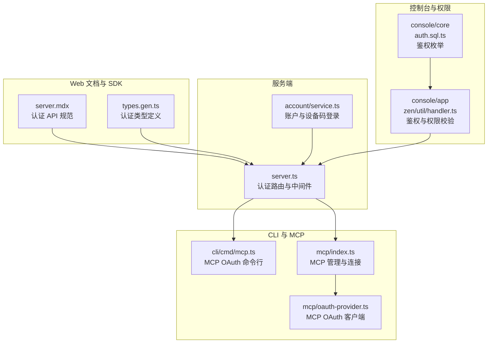
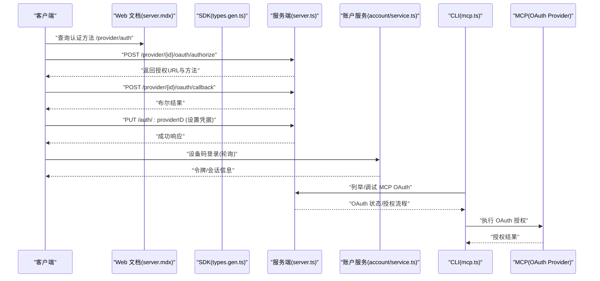
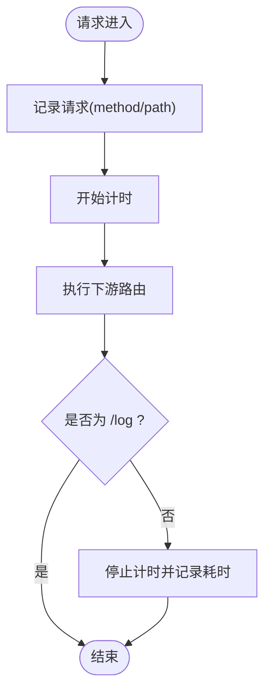
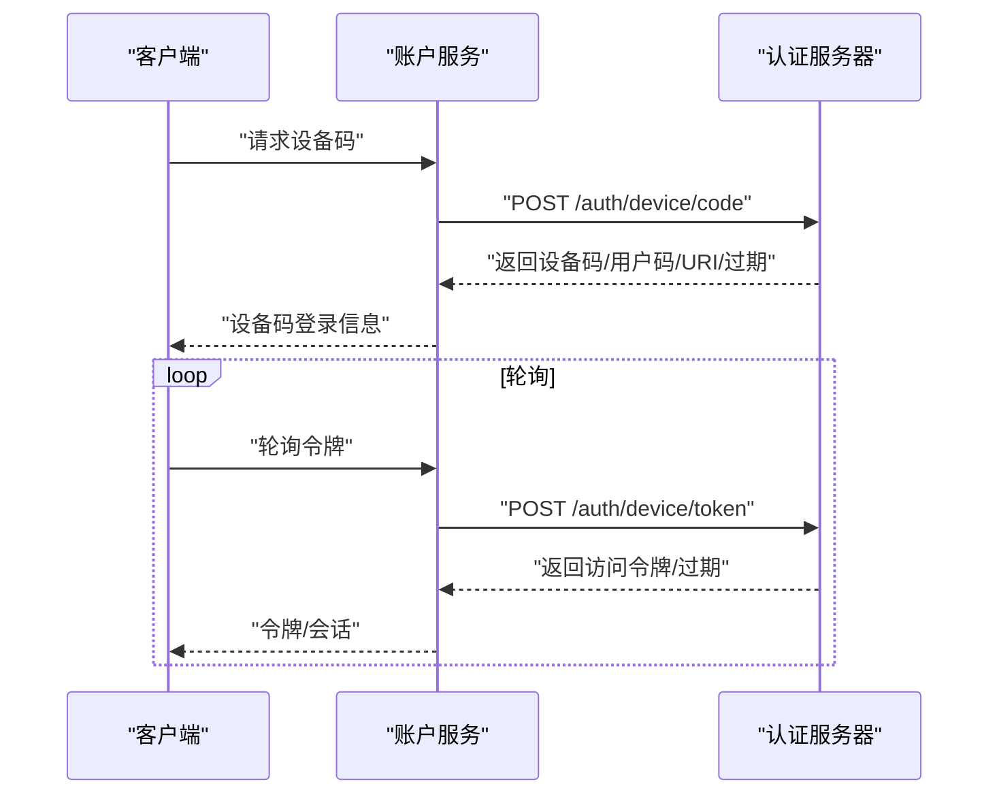
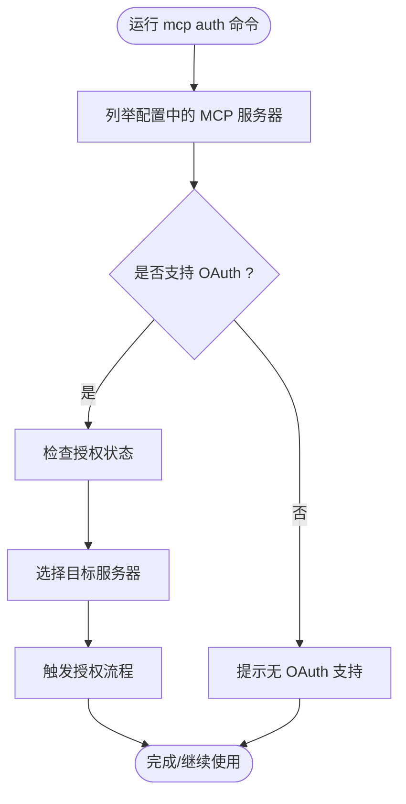
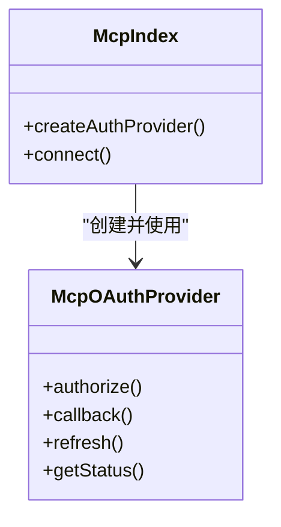
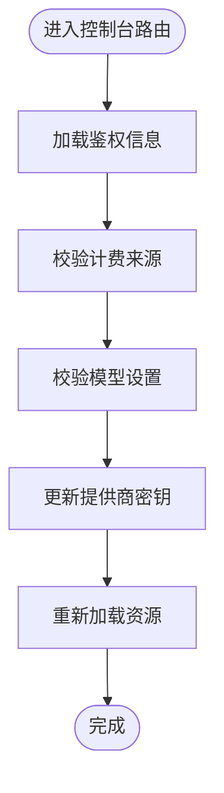
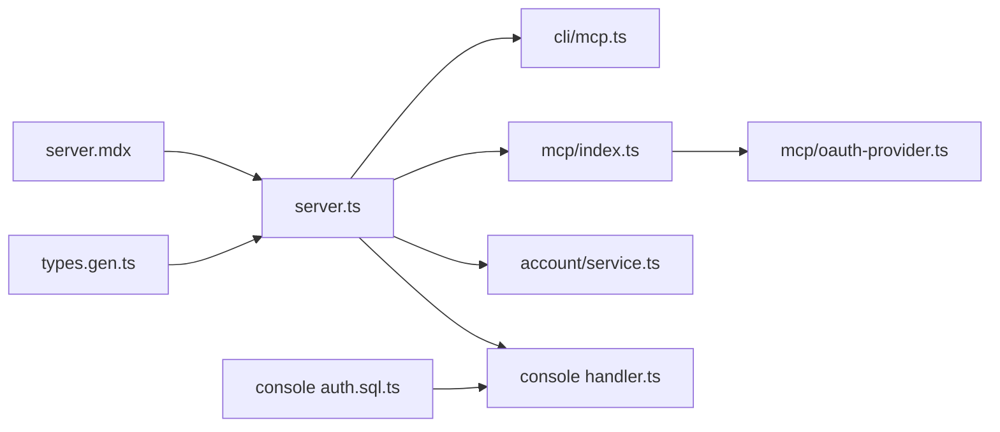

# 认证集成

<cite>
**本文档引用的文件**
- [packages/web/src/content/docs/server.mdx](file://packages/web/src/content/docs/server.mdx)
- [packages/sdk/js/src/gen/types.gen.ts](file://packages/sdk/js/src/gen/types.gen.ts)
- [packages/opencode/src/server/server.ts](file://packages/opencode/src/server/server.ts)
- [packages/opencode/src/account/service.ts](file://packages/opencode/src/account/service.ts)
- [packages/opencode/src/cli/cmd/mcp.ts](file://packages/opencode/src/cli/cmd/mcp.ts)
- [packages/opencode/src/mcp/oauth-provider.ts](file://packages/opencode/src/mcp/oauth-provider.ts)
- [packages/opencode/src/mcp/index.ts](file://packages/opencode/src/mcp/index.ts)
- [packages/opencode/src/acp/agent.ts](file://packages/opencode/src/acp/agent.ts)
- [packages/console/core/src/schema/auth.sql.ts](file://packages/console/core/src/schema/auth.sql.ts)
- [packages/console/app/src/routes/zen/util/handler.ts](file://packages/console/app/src/routes/zen/util/handler.ts)
</cite>

## 目录
1. [简介](#简介)
2. [项目结构](#项目结构)
3. [核心组件](#核心组件)
4. [架构总览](#架构总览)
5. [详细组件分析](#详细组件分析)
6. [依赖关系分析](#依赖关系分析)
7. [性能考虑](#性能考虑)
8. [故障排除指南](#故障排除指南)
9. [结论](#结论)
10. [附录](#附录)

## 简介
本文件系统性梳理 OpenCode 的认证集成方案，覆盖用户认证流程、OAuth 集成机制、第三方身份提供商支持、认证令牌管理、会话维护与安全策略，并提供认证中间件、权限绑定与安全审计的实现要点。文档同时给出多类认证方式（用户名密码、OAuth、API 密钥等）的配置与使用指南、集成步骤与安全最佳实践。

## 项目结构
OpenCode 的认证能力由多个包协同实现：
- Web 文档定义了认证相关的 API 端点与交互规范
- SDK 定义了认证与会话的类型契约
- 服务端路由负责认证凭据设置、OAuth 授权与回调处理
- CLI 提供 MCP（Model Context Provider）OAuth 认证工具链
- MCP OAuth 提供者封装第三方 OAuth 流程
- 账户服务支持设备码登录等现代认证流程
- 控制平面代理中间件保障请求在受控环境下的转发
- 控制台核心与前端路由包含鉴权校验与计费/模型权限验证

**图表来源**
- [packages/web/src/content/docs/server.mdx:138-150](file://packages/web/src/content/docs/server.mdx#L138-L150)
- [packages/sdk/js/src/gen/types.gen.ts:3042-3113](file://packages/sdk/js/src/gen/types.gen.ts#L3042-L3113)
- [packages/opencode/src/server/server.ts:88-174](file://packages/opencode/src/server/server.ts#L88-L174)
- [packages/opencode/src/account/service.ts:275-310](file://packages/opencode/src/account/service.ts#L275-L310)
- [packages/opencode/src/cli/cmd/mcp.ts:151-187](file://packages/opencode/src/cli/cmd/mcp.ts#L151-L187)
- [packages/opencode/src/mcp/index.ts:344-347](file://packages/opencode/src/mcp/index.ts#L344-L347)
- [packages/opencode/src/mcp/oauth-provider.ts:25](file://packages/opencode/src/mcp/oauth-provider.ts#L25)
- [packages/console/core/src/schema/auth.sql.ts:3-10](file://packages/console/core/src/schema/auth.sql.ts#L3-L10)
- [packages/console/app/src/routes/zen/util/handler.ts:66-993](file://packages/console/app/src/routes/zen/util/handler.ts#L66-L993)

**章节来源**
- [packages/web/src/content/docs/server.mdx:138-150](file://packages/web/src/content/docs/server.mdx#L138-L150)
- [packages/sdk/js/src/gen/types.gen.ts:3042-3113](file://packages/sdk/js/src/gen/types.gen.ts#L3042-L3113)
- [packages/opencode/src/server/server.ts:88-174](file://packages/opencode/src/server/server.ts#L88-L174)

## 核心组件
- 认证 API 与类型契约：Web 文档与 SDK 类型共同定义了认证方法查询、OAuth 授权与回调、会话管理等接口规范。
- 服务端认证路由：提供凭据设置、删除与跨域策略配置；内置日志与性能计时中间件。
- 设备码登录与轮询：账户服务支持设备码授权流程，便于无浏览器环境或受限终端的认证。
- CLI MCP OAuth：命令行工具可列出远程 MCP 服务器，检测 OAuth 支持状态并引导完成授权。
- MCP OAuth 客户端：封装第三方 OAuth 客户端协议，支持自动连接与状态管理。
- 控制台鉴权与权限：控制台核心定义鉴权提供方枚举，前端路由对计费与模型权限进行校验。
- 会话与消息：会话管理与消息流中包含认证错误映射与权限提示。

**章节来源**
- [packages/opencode/src/account/service.ts:275-310](file://packages/opencode/src/account/service.ts#L275-L310)
- [packages/opencode/src/cli/cmd/mcp.ts:151-187](file://packages/opencode/src/cli/cmd/mcp.ts#L151-L187)
- [packages/opencode/src/mcp/oauth-provider.ts:25](file://packages/opencode/src/mcp/oauth-provider.ts#L25)
- [packages/console/core/src/schema/auth.sql.ts:3-10](file://packages/console/core/src/schema/auth.sql.ts#L3-L10)
- [packages/console/app/src/routes/zen/util/handler.ts:66-993](file://packages/console/app/src/routes/zen/util/handler.ts#L66-L993)

## 架构总览
下图展示认证从客户端到服务端的关键交互路径，包括 OAuth 授权、回调处理、凭据存储与会话维护。

**图表来源**
- [packages/web/src/content/docs/server.mdx:138-150](file://packages/web/src/content/docs/server.mdx#L138-L150)
- [packages/sdk/js/src/gen/types.gen.ts:3042-3113](file://packages/sdk/js/src/gen/types.gen.ts#L3042-L3113)
- [packages/opencode/src/server/server.ts:131-174](file://packages/opencode/src/server/server.ts#L131-L174)
- [packages/opencode/src/account/service.ts:275-310](file://packages/opencode/src/account/service.ts#L275-L310)
- [packages/opencode/src/cli/cmd/mcp.ts:151-187](file://packages/opencode/src/cli/cmd/mcp.ts#L151-L187)
- [packages/opencode/src/mcp/oauth-provider.ts:25](file://packages/opencode/src/mcp/oauth-provider.ts#L25)

## 详细组件分析

### 认证 API 与类型契约
- 提供商认证方法查询：GET /provider/auth 返回各提供商支持的认证方法列表。
- OAuth 授权与回调：POST /provider/{id}/oauth/authorize 返回授权 URL 与方法；POST /provider/{id}/oauth/callback 处理回调。
- 凭据设置与删除：PUT /auth/:providerID 设置凭据；DELETE /auth/:providerID 删除凭据。
- 会话管理：GET /session 列出会话；POST /session 创建会话。

这些端点由 Web 文档与 SDK 类型共同定义，确保前后端一致的契约。

**章节来源**
- [packages/web/src/content/docs/server.mdx:138-150](file://packages/web/src/content/docs/server.mdx#L138-L150)
- [packages/sdk/js/src/gen/types.gen.ts:3042-3113](file://packages/sdk/js/src/gen/types.gen.ts#L3042-L3113)

### 服务端认证路由与中间件
- 中间件层：统一日志记录与性能计时；CORS 策略仅允许受信来源（本地开发、Tauri 本地域、opencode.ai 子域等）。
- 认证路由：
  - PUT /auth/:providerID：接收凭据并持久化。
  - DELETE /auth/:providerID：移除指定提供商的认证凭据。
- 跨域与来源校验：严格限制 CORS 来源，避免 CSRF 与跨站风险。

**图表来源**
- [packages/opencode/src/server/server.ts:88-103](file://packages/opencode/src/server/server.ts#L88-L103)

**章节来源**
- [packages/opencode/src/server/server.ts:88-174](file://packages/opencode/src/server/server.ts#L88-L174)

### 设备码登录与令牌轮询
- 设备码流程：服务端发起设备授权码请求，返回设备码、用户码、验证 URI 与过期时间。
- 轮询获取令牌：客户端按间隔轮询令牌端点，直到授权完成或超时。
- 错误映射：对解码失败等异常进行统一错误映射，便于上层处理。

**图表来源**
- [packages/opencode/src/account/service.ts:275-310](file://packages/opencode/src/account/service.ts#L275-L310)

**章节来源**
- [packages/opencode/src/account/service.ts:275-310](file://packages/opencode/src/account/service.ts#L275-L310)

### CLI MCP OAuth 工具链
- 自动发现：扫描配置中的远程 MCP 服务器，过滤支持 OAuth 的实例。
- 授权状态：显示每个服务器的认证状态图标与文本，便于用户快速判断。
- 引导授权：支持选择服务器并触发授权流程，必要时提供手动输入 API Key 的选项。
- 调试能力：提供列出 OAuth 服务器与调试连接的能力，辅助诊断问题。

**图表来源**
- [packages/opencode/src/cli/cmd/mcp.ts:151-187](file://packages/opencode/src/cli/cmd/mcp.ts#L151-L187)

**章节来源**
- [packages/opencode/src/cli/cmd/mcp.ts:151-187](file://packages/opencode/src/cli/cmd/mcp.ts#L151-L187)

### MCP OAuth 客户端与自动连接
- OAuth 客户端提供者：封装第三方 OAuth 客户端协议，支持自动连接与状态管理。
- 连接管理：在 MCP 管理入口中创建 OAuth 提供者实例，用于后续授权与令牌刷新。
- 自动重连：在连接断开或令牌失效时，通过 OAuth 提供者进行自动重连。

**图表来源**
- [packages/opencode/src/mcp/oauth-provider.ts:25](file://packages/opencode/src/mcp/oauth-provider.ts#L25)
- [packages/opencode/src/mcp/index.ts:344-347](file://packages/opencode/src/mcp/index.ts#L344-L347)

**章节来源**
- [packages/opencode/src/mcp/oauth-provider.ts:25](file://packages/opencode/src/mcp/oauth-provider.ts#L25)
- [packages/opencode/src/mcp/index.ts:344-347](file://packages/opencode/src/mcp/index.ts#L344-L347)

### 控制台鉴权与权限校验
- 鉴权提供方枚举：定义支持的鉴权提供方（如邮箱、GitHub、Google），用于数据库与前端一致性。
- 前端路由校验：在控制台路由中对计费来源与模型设置进行鉴权校验，更新提供商密钥并加载资源。
- 加载失败处理：当加载 API Key 失败时，转换为认证所需错误，驱动上层提示用户补全凭据。

**图表来源**
- [packages/console/core/src/schema/auth.sql.ts:3-10](file://packages/console/core/src/schema/auth.sql.ts#L3-L10)
- [packages/console/app/src/routes/zen/util/handler.ts:66-993](file://packages/console/app/src/routes/zen/util/handler.ts#L66-L993)

**章节来源**
- [packages/console/core/src/schema/auth.sql.ts:3-10](file://packages/console/core/src/schema/auth.sql.ts#L3-L10)
- [packages/console/app/src/routes/zen/util/handler.ts:66-993](file://packages/console/app/src/routes/zen/util/handler.ts#L66-L993)

### 会话与消息中的认证错误处理
- 消息处理：在会话消息处理过程中，若检测到加载 API Key 失败，转换为认证所需的错误类型，促使上层提示用户进行认证。
- 权限提示：在运行时根据事件类型提示用户授权，确保最小权限原则与透明审计。

**章节来源**
- [packages/opencode/src/acp/agent.ts:790-829](file://packages/opencode/src/acp/agent.ts#L790-L829)

## 依赖关系分析
- Web 文档与 SDK 类型为服务端路由提供契约约束，保证端点行为一致。
- 服务端路由依赖 CLI 与 MCP 组件以支持外部系统的 OAuth 集成。
- 控制台前端依赖后端认证与会话接口，实现权限与计费的前端校验。
- 账户服务独立于前端，提供设备码登录等通用认证能力。

**图表来源**
- [packages/web/src/content/docs/server.mdx:138-150](file://packages/web/src/content/docs/server.mdx#L138-L150)
- [packages/sdk/js/src/gen/types.gen.ts:3042-3113](file://packages/sdk/js/src/gen/types.gen.ts#L3042-L3113)
- [packages/opencode/src/server/server.ts:131-174](file://packages/opencode/src/server/server.ts#L131-L174)
- [packages/opencode/src/cli/cmd/mcp.ts:151-187](file://packages/opencode/src/cli/cmd/mcp.ts#L151-L187)
- [packages/opencode/src/mcp/index.ts:344-347](file://packages/opencode/src/mcp/index.ts#L344-L347)
- [packages/opencode/src/mcp/oauth-provider.ts:25](file://packages/opencode/src/mcp/oauth-provider.ts#L25)
- [packages/opencode/src/account/service.ts:275-310](file://packages/opencode/src/account/service.ts#L275-L310)
- [packages/console/core/src/schema/auth.sql.ts:3-10](file://packages/console/core/src/schema/auth.sql.ts#L3-L10)
- [packages/console/app/src/routes/zen/util/handler.ts:66-993](file://packages/console/app/src/routes/zen/util/handler.ts#L66-L993)

**章节来源**
- [packages/opencode/src/server/server.ts:131-174](file://packages/opencode/src/server/server.ts#L131-L174)
- [packages/opencode/src/cli/cmd/mcp.ts:151-187](file://packages/opencode/src/cli/cmd/mcp.ts#L151-L187)
- [packages/opencode/src/mcp/index.ts:344-347](file://packages/opencode/src/mcp/index.ts#L344-L347)

## 性能考虑
- 请求计时与日志：服务端中间件对非 /log 路径进行统一计时与日志记录，便于定位慢请求。
- CORS 白名单：严格限制来源，减少不必要的预检与跨域风险。
- 设备码轮询：合理设置轮询间隔与超时，避免频繁请求导致服务压力。
- 前端权限校验：在控制台路由中尽早进行鉴权与计费校验，减少无效渲染与请求。

[本节为通用指导，无需具体文件分析]

## 故障排除指南
- OAuth 授权失败：使用 CLI 的调试命令列出 OAuth 服务器并检查授权状态，确认授权 URL 与回调参数正确。
- 凭据缺失：当加载 API Key 失败时，系统会抛出认证所需错误，需在前端或 CLI 补充凭据。
- 跨域问题：确认请求来源在 CORS 白名单内，本地开发使用 localhost/127.0.0.1 或 tauri 本地域。
- 设备码登录：若轮询无响应，检查设备码与用户码是否正确，以及服务端令牌端点可达性。

**章节来源**
- [packages/opencode/src/cli/cmd/mcp.ts:151-187](file://packages/opencode/src/cli/cmd/mcp.ts#L151-L187)
- [packages/opencode/src/acp/agent.ts:790-829](file://packages/opencode/src/acp/agent.ts#L790-L829)
- [packages/opencode/src/server/server.ts:105-129](file://packages/opencode/src/server/server.ts#L105-L129)

## 结论
OpenCode 的认证体系通过明确的 API 契约、严格的中间件策略与完善的 CLI/MCP 工具链，实现了对多种认证方式的支持与统一管理。结合控制台的权限校验与会话机制，系统在安全性与可用性之间取得平衡。建议在生产环境中遵循最小权限原则、定期轮换密钥与令牌，并启用审计日志以便追踪认证活动。

[本节为总结，无需具体文件分析]

## 附录

### 认证方式与配置示例
- 用户名密码：通过设置凭据端点 PUT /auth/:providerID 配置提供商用户名与密码。
- OAuth：使用 GET /provider/auth 查询支持的方法，再通过 POST /provider/{id}/oauth/authorize 获取授权 URL 并在回调端点完成授权。
- 设备码登录：在账户服务中发起设备码请求并按间隔轮询令牌端点。
- API 密钥：在 CLI 中选择手动输入 API Key 的选项，或在控制台路由中更新提供商密钥。

**章节来源**
- [packages/web/src/content/docs/server.mdx:138-150](file://packages/web/src/content/docs/server.mdx#L138-L150)
- [packages/sdk/js/src/gen/types.gen.ts:3042-3113](file://packages/sdk/js/src/gen/types.gen.ts#L3042-L3113)
- [packages/opencode/src/account/service.ts:275-310](file://packages/opencode/src/account/service.ts#L275-L310)
- [packages/opencode/src/cli/cmd/mcp.ts:151-187](file://packages/opencode/src/cli/cmd/mcp.ts#L151-L187)
- [packages/console/app/src/routes/zen/util/handler.ts:66-993](file://packages/console/app/src/routes/zen/util/handler.ts#L66-L993)

### 集成指南
- 在配置文件中声明远程 MCP 服务器并启用 OAuth（默认启用）。
- 使用 CLI 命令列举并调试 OAuth 服务器，完成授权流程。
- 在服务端路由中设置/删除提供商凭据，确保凭据安全存储。
- 在控制台路由中进行鉴权与权限校验，必要时更新提供商密钥。

**章节来源**
- [packages/opencode/src/cli/cmd/mcp.ts:151-187](file://packages/opencode/src/cli/cmd/mcp.ts#L151-L187)
- [packages/opencode/src/server/server.ts:131-174](file://packages/opencode/src/server/server.ts#L131-L174)
- [packages/console/app/src/routes/zen/util/handler.ts:66-993](file://packages/console/app/src/routes/zen/util/handler.ts#L66-L993)

### 安全最佳实践
- 严格限制 CORS 来源，仅允许受信域名。
- 对敏感凭据进行加密存储与传输，定期轮换。
- 启用审计日志，记录认证与授权关键事件。
- 使用最小权限原则，按会话与工具粒度授予权限。
- 对设备码登录与 OAuth 回调进行超时与重试控制，防止资源泄露。

[本节为通用指导，无需具体文件分析]