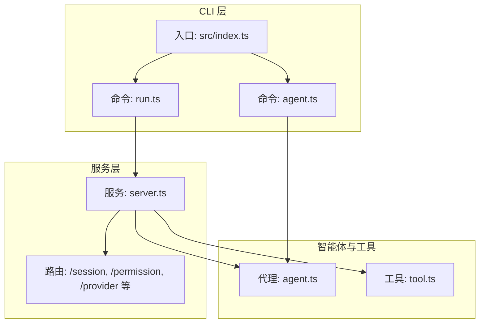
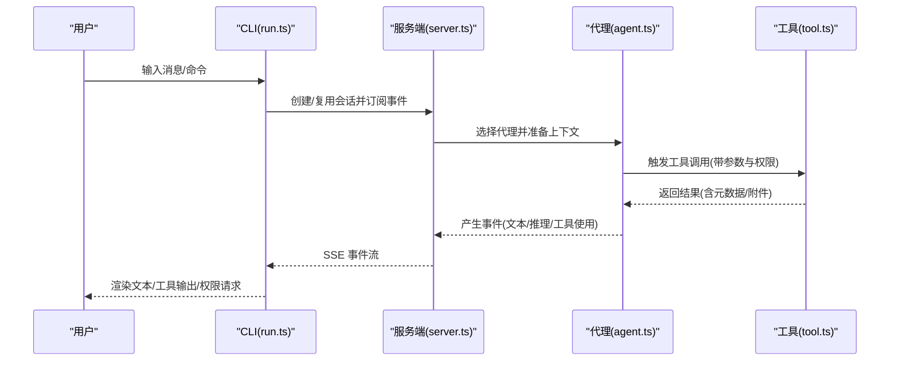
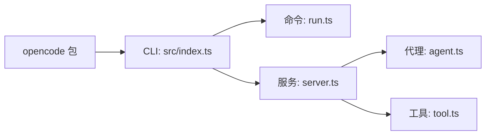

# 核心概念

<cite>
**本文引用的文件**
- [README.md](file://README.md)
- [packages/opencode/src/index.ts](file://packages/opencode/src/index.ts)
- [packages/opencode/src/cli/cmd/run.ts](file://packages/opencode/src/cli/cmd/run.ts)
- [packages/opencode/src/cli/cmd/agent.ts](file://packages/opencode/src/cli/cmd/agent.ts)
- [packages/opencode/src/agent/agent.ts](file://packages/opencode/src/agent/agent.ts)
- [packages/opencode/src/tool/tool.ts](file://packages/opencode/src/tool/tool.ts)
- [packages/opencode/src/server/server.ts](file://packages/opencode/src/server/server.ts)
- [packages/opencode/package.json](file://packages/opencode/package.json)
</cite>

## 目录
1. [引言](#引言)
2. [项目结构](#项目结构)
3. [核心组件](#核心组件)
4. [架构总览](#架构总览)
5. [详细组件分析](#详细组件分析)
6. [依赖关系分析](#依赖关系分析)
7. [性能考量](#性能考量)
8. [故障排查指南](#故障排查指南)
9. [结论](#结论)
10. [附录](#附录)

## 引言
本文件面向希望深入理解 OpenCode 的开发者与使用者，系统性阐述其核心概念与设计理念：AI 代理系统的工作原理、代理类型与权限控制机制；会话管理、消息传递与工具系统的设计思路；插件架构、事件驱动机制与扩展点设计。文档通过分层讲解与图示化表达，帮助读者把握从命令行入口到服务端、再到代理与工具链的整体运行逻辑，并提供可操作的最佳实践与排障建议。

## 项目结构
OpenCode 采用多包（monorepo）组织方式，核心 CLI 与服务端位于 packages/opencode 中，配合 SDK、工具集、权限与代理模块协同工作。CLI 入口负责解析参数、引导启动流程与事件订阅；服务端提供 OpenAPI/SSE 接口、路由与中间件；代理与工具定义了行为边界与执行能力；权限系统贯穿代理配置与运行时决策。

**图示来源**
- [packages/opencode/src/index.ts:1-214](file://packages/opencode/src/index.ts#L1-L214)
- [packages/opencode/src/cli/cmd/run.ts:1-677](file://packages/opencode/src/cli/cmd/run.ts#L1-L677)
- [packages/opencode/src/cli/cmd/agent.ts:1-258](file://packages/opencode/src/cli/cmd/agent.ts#L1-L258)
- [packages/opencode/src/server/server.ts:1-639](file://packages/opencode/src/server/server.ts#L1-L639)
- [packages/opencode/src/agent/agent.ts:1-341](file://packages/opencode/src/agent/agent.ts#L1-L341)
- [packages/opencode/src/tool/tool.ts:1-91](file://packages/opencode/src/tool/tool.ts#L1-L91)

**章节来源**
- [packages/opencode/src/index.ts:1-214](file://packages/opencode/src/index.ts#L1-L214)
- [packages/opencode/src/cli/cmd/run.ts:1-677](file://packages/opencode/src/cli/cmd/run.ts#L1-L677)
- [packages/opencode/src/cli/cmd/agent.ts:1-258](file://packages/opencode/src/cli/cmd/agent.ts#L1-L258)
- [packages/opencode/src/server/server.ts:1-639](file://packages/opencode/src/server/server.ts#L1-L639)
- [packages/opencode/src/agent/agent.ts:1-341](file://packages/opencode/src/agent/agent.ts#L1-L341)
- [packages/opencode/src/tool/tool.ts:1-91](file://packages/opencode/src/tool/tool.ts#L1-L91)

## 核心组件
- 命令行入口与生命周期
  - CLI 使用 yargs 解析参数，初始化日志、数据库迁移与全局环境变量，注册大量子命令（如 run、agent、serve、session 等），并在异常时统一格式化输出与错误码。
  - 参考路径：[packages/opencode/src/index.ts:1-214](file://packages/opencode/src/index.ts#L1-L214)

- 会话与消息流
  - run 命令负责创建/复用会话、订阅事件流（SSE）、渲染文本与工具调用结果、处理权限请求与错误传播。
  - 参考路径：[packages/opencode/src/cli/cmd/run.ts:306-677](file://packages/opencode/src/cli/cmd/run.ts#L306-L677)

- 代理系统
  - 内置多种代理（如 build、plan、explore、general 等），支持主代理与子代理两种角色；代理具备名称、描述、模式、温度、提示词、默认模型、权限规则等属性。
  - 参考路径：[packages/opencode/src/agent/agent.ts:24-341](file://packages/opencode/src/agent/agent.ts#L24-L341)

- 工具系统
  - 工具接口定义了参数校验、上下文注入、元数据回调与输出截断策略；工具在执行前进行参数验证，在执行后自动应用输出截断以避免超限。
  - 参考路径：[packages/opencode/src/tool/tool.ts:8-91](file://packages/opencode/src/tool/tool.ts#L8-L91)

- 服务端与事件驱动
  - 服务端基于 Hono 提供 OpenAPI/SSE 路由，暴露代理列表、权限、会话、提供方等接口；事件通过 SSE 广播，客户端按事件类型渲染 UI 或记录日志。
  - 参考路径：[packages/opencode/src/server/server.ts:1-639](file://packages/opencode/src/server/server.ts#L1-L639)

**章节来源**
- [packages/opencode/src/index.ts:1-214](file://packages/opencode/src/index.ts#L1-L214)
- [packages/opencode/src/cli/cmd/run.ts:306-677](file://packages/opencode/src/cli/cmd/run.ts#L306-L677)
- [packages/opencode/src/agent/agent.ts:24-341](file://packages/opencode/src/agent/agent.ts#L24-L341)
- [packages/opencode/src/tool/tool.ts:8-91](file://packages/opencode/src/tool/tool.ts#L8-L91)
- [packages/opencode/src/server/server.ts:1-639](file://packages/opencode/src/server/server.ts#L1-L639)

## 架构总览
OpenCode 的运行时由“CLI → 本地服务 → 代理/工具/权限”三层构成。CLI 负责用户交互与事件订阅；本地服务承载 OpenAPI 与 SSE；代理决定行为策略，工具实现具体动作，权限控制访问范围。

**图示来源**
- [packages/opencode/src/cli/cmd/run.ts:306-677](file://packages/opencode/src/cli/cmd/run.ts#L306-L677)
- [packages/opencode/src/server/server.ts:1-639](file://packages/opencode/src/server/server.ts#L1-L639)
- [packages/opencode/src/agent/agent.ts:24-341](file://packages/opencode/src/agent/agent.ts#L24-L341)
- [packages/opencode/src/tool/tool.ts:8-91](file://packages/opencode/src/tool/tool.ts#L8-L91)

## 详细组件分析

### 命令行入口与生命周期
- 参数解析与中间件
  - 初始化日志级别与打印开关，首次运行执行 SQLite 迁移，确保数据一致性。
  - 注册大量子命令，覆盖运行、调试、会话、导出导入、提供方、模型、统计等。
- 错误处理
  - 捕获未处理拒绝与未捕获异常，统一格式化输出并退出码设置。
- 参考路径
  - [packages/opencode/src/index.ts:1-214](file://packages/opencode/src/index.ts#L1-L214)

**章节来源**
- [packages/opencode/src/index.ts:1-214](file://packages/opencode/src/index.ts#L1-L214)

### 会话管理与消息传递
- 会话创建/复用/派生
  - 支持继续上次会话、指定会话 ID、或基于标题创建新会话；可选 fork 行为用于隔离后续修改。
- 权限控制
  - 默认对“提问/计划进入/计划退出”等敏感权限进行限制；当服务端返回权限请求时，CLI 自动拒绝以保障安全。
- 事件订阅与渲染
  - 订阅 SSE 事件流，按事件类型渲染文本、推理块、工具使用、任务状态与错误信息；支持 JSON 输出模式。
- 参考路径
  - [packages/opencode/src/cli/cmd/run.ts:381-677](file://packages/opencode/src/cli/cmd/run.ts#L381-L677)

**章节来源**
- [packages/opencode/src/cli/cmd/run.ts:381-677](file://packages/opencode/src/cli/cmd/run.ts#L381-L677)

### 代理系统：类型、策略与权限
- 代理类型
  - 主代理（primary）：可直接对外执行工具；
  - 子代理（subagent）：被其他代理调用，适合拆分复杂任务；
  - all：同时具备两类能力。
- 内置代理
  - build：默认代理，具备完整权限；
  - plan：只读型代理，禁止编辑类工具；
  - explore/general：探索与通用任务代理。
- 权限规则
  - 基于 PermissionNext 的规则合并策略，支持通配符、白名单目录、敏感文件（如 .env）询问授权等。
- 参考路径
  - [packages/opencode/src/agent/agent.ts:24-341](file://packages/opencode/src/agent/agent.ts#L24-L341)

**章节来源**
- [packages/opencode/src/agent/agent.ts:24-341](file://packages/opencode/src/agent/agent.ts#L24-L341)

### 工具系统：定义、校验与输出截断
- 工具接口
  - 定义工具 ID、参数 Schema、执行函数、元数据回调与可选的参数校验错误格式化。
- 执行流程
  - 执行前参数校验，失败时抛出可读错误；
  - 执行后自动应用输出截断策略，避免超长输出影响性能与稳定性。
- 参考路径
  - [packages/opencode/src/tool/tool.ts:8-91](file://packages/opencode/src/tool/tool.ts#L8-L91)

**章节来源**
- [packages/opencode/src/tool/tool.ts:8-91](file://packages/opencode/src/tool/tool.ts#L8-L91)

### 服务端与事件驱动机制
- OpenAPI/SSE
  - 提供代理列表、权限、会话、提供方、LSP、格式化器等查询接口；事件通过 SSE 广播，心跳保活，实例销毁时关闭流。
- 中间件与安全
  - 基础认证（可选）、CORS 白名单、请求计时与日志、跨工作区/目录上下文注入。
- 参考路径
  - [packages/opencode/src/server/server.ts:1-639](file://packages/opencode/src/server/server.ts#L1-L639)

**章节来源**
- [packages/opencode/src/server/server.ts:1-639](file://packages/opencode/src/server/server.ts#L1-L639)

### 插件架构与扩展点
- 插件触发点
  - 在代理生成过程中触发实验性聊天系统提示转换钩子，允许外部扩展调整系统提示。
- 参考路径
  - [packages/opencode/src/agent/agent.ts:284-341](file://packages/opencode/src/agent/agent.ts#L284-L341)

**章节来源**
- [packages/opencode/src/agent/agent.ts:284-341](file://packages/opencode/src/agent/agent.ts#L284-L341)

### 使用模式与最佳实践
- 选择代理
  - 使用内置代理（build/plan/explore/general）或通过 agent 命令创建自定义代理，指定工具集合与模式。
  - 参考路径：[packages/opencode/src/cli/cmd/agent.ts:1-258](file://packages/opencode/src/cli/cmd/agent.ts#L1-L258)
- 运行与观察
  - 使用 run 命令发送消息或命令，结合 --thinking 查看推理过程，使用 --format=json 获取原始事件流便于集成。
  - 参考路径：[packages/opencode/src/cli/cmd/run.ts:221-677](file://packages/opencode/src/cli/cmd/run.ts#L221-L677)
- 权限与安全
  - 遵循默认权限策略，避免对敏感文件与外部目录的直接访问；必要时通过 ask 流程获得授权。
  - 参考路径：[packages/opencode/src/agent/agent.ts:52-252](file://packages/opencode/src/agent/agent.ts#L52-L252)

**章节来源**
- [packages/opencode/src/cli/cmd/agent.ts:1-258](file://packages/opencode/src/cli/cmd/agent.ts#L1-L258)
- [packages/opencode/src/cli/cmd/run.ts:221-677](file://packages/opencode/src/cli/cmd/run.ts#L221-L677)
- [packages/opencode/src/agent/agent.ts:52-252](file://packages/opencode/src/agent/agent.ts#L52-L252)

## 依赖关系分析
- 包与脚本
  - opencode 包导出 CLI 二进制与内部模块，依赖大量 AI SDK、Hono、Bun 生态组件与工具库。
- 外部依赖概览
  - AI 提供商适配（OpenAI、Anthropic、Google、Bedrock 等）、Hono Web 框架、事件总线、格式化与 LSP 支持、SQLite ORM 等。
- 参考路径
  - [packages/opencode/package.json:1-146](file://packages/opencode/package.json#L1-L146)

**图示来源**
- [packages/opencode/package.json:1-146](file://packages/opencode/package.json#L1-L146)
- [packages/opencode/src/index.ts:1-214](file://packages/opencode/src/index.ts#L1-L214)
- [packages/opencode/src/cli/cmd/run.ts:1-677](file://packages/opencode/src/cli/cmd/run.ts#L1-L677)
- [packages/opencode/src/server/server.ts:1-639](file://packages/opencode/src/server/server.ts#L1-L639)
- [packages/opencode/src/agent/agent.ts:1-341](file://packages/opencode/src/agent/agent.ts#L1-L341)
- [packages/opencode/src/tool/tool.ts:1-91](file://packages/opencode/src/tool/tool.ts#L1-L91)

**章节来源**
- [packages/opencode/package.json:1-146](file://packages/opencode/package.json#L1-L146)

## 性能考量
- 输出截断
  - 工具执行后自动应用输出截断策略，避免超长内容影响渲染与网络传输。
  - 参考路径：[packages/opencode/src/tool/tool.ts:72-85](file://packages/opencode/src/tool/tool.ts#L72-L85)
- 事件流与心跳
  - SSE 事件流每 10 秒发送心跳，防止代理/反向代理导致的连接停滞。
  - 参考路径：[packages/opencode/src/server/server.ts:536-544](file://packages/opencode/src/server/server.ts#L536-L544)
- 数据库迁移
  - 首次运行执行 SQLite 迁移，进度可视化，避免阻塞交互。
  - 参考路径：[packages/opencode/src/index.ts:87-122](file://packages/opencode/src/index.ts#L87-L122)

**章节来源**
- [packages/opencode/src/tool/tool.ts:72-85](file://packages/opencode/src/tool/tool.ts#L72-L85)
- [packages/opencode/src/server/server.ts:536-544](file://packages/opencode/src/server/server.ts#L536-L544)
- [packages/opencode/src/index.ts:87-122](file://packages/opencode/src/index.ts#L87-L122)

## 故障排查指南
- CLI 异常与日志
  - 未处理拒绝与未捕获异常会被格式化输出并写入日志文件，便于定位问题。
  - 参考路径：[packages/opencode/src/index.ts:38-48](file://packages/opencode/src/index.ts#L38-L48)
- 事件流断连
  - 若事件流中断，检查服务端心跳与网络代理配置；确认 SSE 订阅是否仍在进行。
  - 参考路径：[packages/opencode/src/server/server.ts:516-555](file://packages/opencode/src/server/server.ts#L516-L555)
- 权限被拒
  - 当代理尝试超出权限范围的操作时，服务端会发出权限请求事件；CLI 默认自动拒绝，可在需要时手动授权。
  - 参考路径：[packages/opencode/src/cli/cmd/run.ts:544-557](file://packages/opencode/src/cli/cmd/run.ts#L544-L557)
- 代理不可用
  - 列出可用代理并确认目标代理存在且非子代理；若默认代理配置不合法，服务端会返回相应错误。
  - 参考路径：[packages/opencode/src/cli/cmd/agent.ts:228-250](file://packages/opencode/src/cli/cmd/agent.ts#L228-L250)

**章节来源**
- [packages/opencode/src/index.ts:38-48](file://packages/opencode/src/index.ts#L38-L48)
- [packages/opencode/src/server/server.ts:516-555](file://packages/opencode/src/server/server.ts#L516-L555)
- [packages/opencode/src/cli/cmd/run.ts:544-557](file://packages/opencode/src/cli/cmd/run.ts#L544-L557)
- [packages/opencode/src/cli/cmd/agent.ts:228-250](file://packages/opencode/src/cli/cmd/agent.ts#L228-L250)

## 结论
OpenCode 将“代理—工具—权限—事件”的理念内核化，通过 CLI 与本地服务形成稳定运行时，借助插件扩展点与可组合的工具体系支撑多样化开发场景。内置代理与权限策略在保证安全的同时提供灵活的可扩展性，SSE 事件流使交互体验与可观测性兼顾。遵循本文档的使用模式与最佳实践，可快速上手并构建更复杂的自动化工作流。

## 附录
- 快速参考
  - 启动与运行：使用 run 命令发送消息或命令，查看推理与工具输出。
  - 代理管理：使用 agent 命令创建/列出代理，选择合适的工具集与模式。
  - 权限控制：默认限制敏感操作，必要时通过 ask 流程授权。
  - 事件订阅：通过 SSE 订阅事件流，或使用 --format=json 获取原始事件。