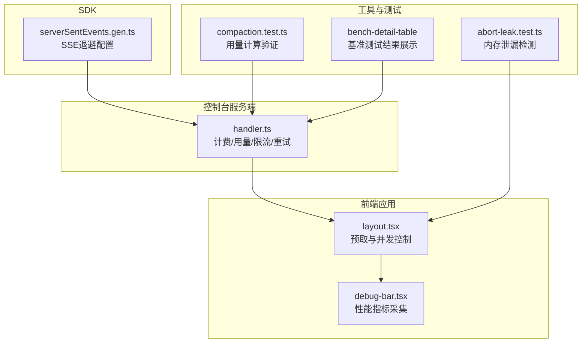
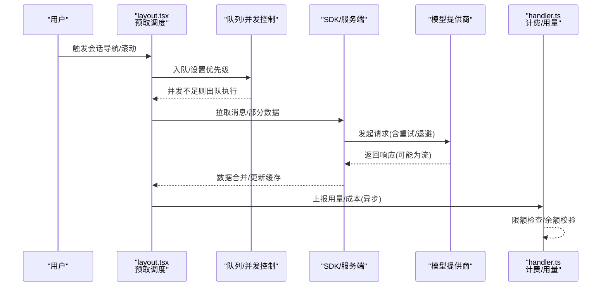
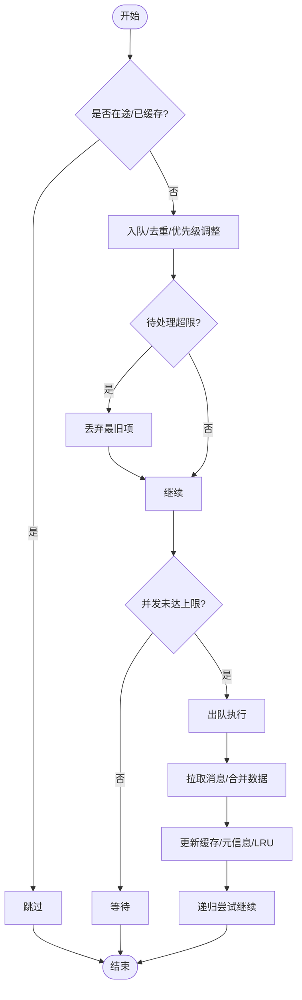
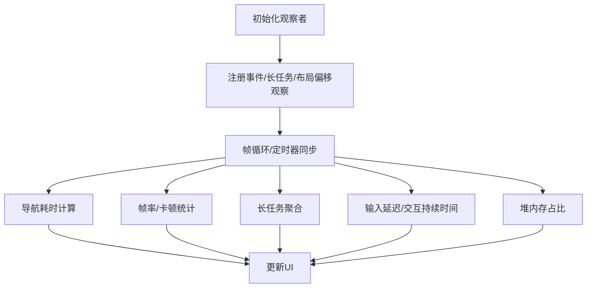
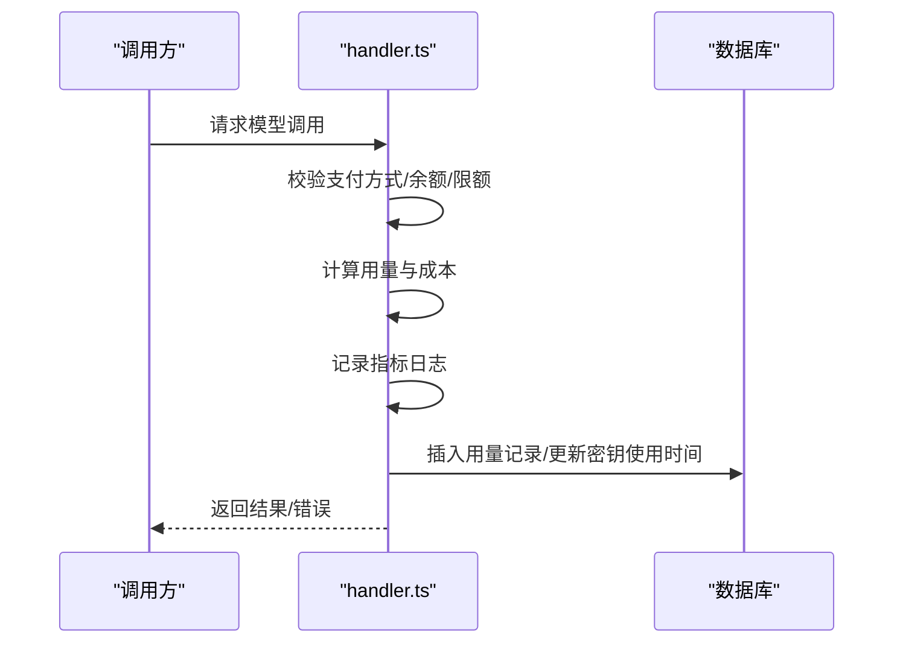
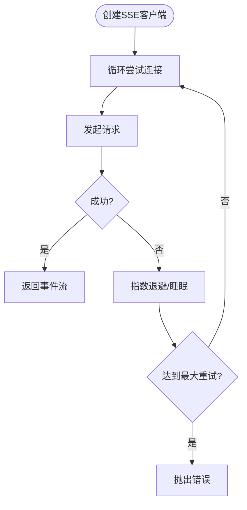
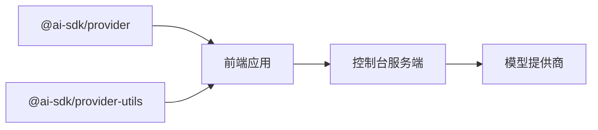

# 性能优化与监控

<cite>
**本文档引用的文件**
- [layout.tsx](file://packages/app/src/pages/layout.tsx)
- [debug-bar.tsx](file://packages/app/src/components/debug-bar.tsx)
- [handler.ts](file://packages/console/app/src/routes/zen/util/handler.ts)
- [serverSentEvents.gen.ts](file://packages/sdk/js/src/gen/core/serverSentEvents.gen.ts)
- [package.json](file://packages/opencode/node_modules/@ai-sdk/provider/package.json)
- [package.json](file://packages/opencode/node_modules/@ai-sdk/provider-utils/package.json)
- [abort-leak.test.ts](file://packages/opencode/test/memory/abort-leak.test.ts)
- [compaction.test.ts](file://packages/opencode/test/session/compaction.test.ts)
- [bench-detail-table](file://packages/console/app/src/routes/bench/[id].tsx)
</cite>

## 目录
1. [简介](#简介)
2. [项目结构](#项目结构)
3. [核心组件](#核心组件)
4. [架构总览](#架构总览)
5. [详细组件分析](#详细组件分析)
6. [依赖关系分析](#依赖关系分析)
7. [性能考量](#性能考量)
8. [故障排查指南](#故障排查指南)
9. [结论](#结论)
10. [附录](#附录)

## 简介
本文件聚焦于模型提供商在本项目中的性能优化策略与监控方法，涵盖请求速率限制、并发控制与队列管理、缓存与预取、连接池与重试退避、性能指标采集与延迟跟踪、成本控制与资源利用率优化，并提供基准测试与瓶颈分析建议。内容基于仓库中实际实现与测试用例进行归纳总结。

## 项目结构
围绕性能优化的关键模块主要分布在前端应用与控制台服务端：
- 前端应用层：会话消息预取与并发控制、调试面板性能指标展示
- 控制台服务端：计费与用量统计、限流与重试退避、指标上报
- SDK 层：SSE 流式事件客户端与退避配置
- 工具与测试：内存泄漏检测、会话使用量计算验证

**图表来源**
- [layout.tsx:673-920](file://packages/app/src/pages/layout.tsx#L673-L920)
- [debug-bar.tsx:163-361](file://packages/app/src/components/debug-bar.tsx#L163-L361)
- [handler.ts:756-763](file://packages/console/app/src/routes/zen/util/handler.ts#L756-L763)
- [serverSentEvents.gen.ts:66-87](file://packages/sdk/js/src/gen/core/serverSentEvents.gen.ts#L66-L87)
- [abort-leak.test.ts:117-137](file://packages/opencode/test/memory/abort-leak.test.ts#L117-L137)
- [compaction.test.ts:353-390](file://packages/opencode/test/session/compaction.test.ts#L353-L390)
- [bench-detail-table:224-248](file://packages/console/app/src/routes/bench/[id].tsx#L224-L248)

**章节来源**
- [layout.tsx:673-920](file://packages/app/src/pages/layout.tsx#L673-L920)
- [debug-bar.tsx:163-361](file://packages/app/src/components/debug-bar.tsx#L163-L361)
- [handler.ts:756-763](file://packages/console/app/src/routes/zen/util/handler.ts#L756-L763)
- [serverSentEvents.gen.ts:66-87](file://packages/sdk/js/src/gen/core/serverSentEvents.gen.ts#L66-L87)
- [abort-leak.test.ts:117-137](file://packages/opencode/test/memory/abort-leak.test.ts#L117-L137)
- [compaction.test.ts:353-390](file://packages/opencode/test/session/compaction.test.ts#L353-L390)
- [bench-detail-table:224-248](file://packages/console/app/src/routes/bench/[id].tsx#L224-L248)

## 核心组件
- 预取与并发控制（前端）：通过目录维度的队列与并发上限、待处理队列长度限制、LRU 缓存淘汰，结合优先级调度与批量拉取，降低渲染抖动与网络开销。
- 调试面板（前端）：基于 PerformanceObserver 采集 FPS、长任务、布局偏移、输入延迟、堆内存占比等指标，用于实时性能诊断。
- 计费与用量统计（服务端）：按模型与提供商维度统计输入/输出/推理/缓存读写令牌用量与费用，支持月度限额与余额检查，记录指标日志并持久化。
- SSE 客户端与退避（SDK）：支持默认/最大重试延迟、指数退避与可插拔睡眠函数，提升流式响应稳定性。
- 内存与资源检测（测试）：通过 GC 与堆内存测量评估异步清理与绑定模式对内存增长的影响；会话用量计算测试覆盖多提供商场景。
- 基准测试（控制台）：展示每次运行的得分与成本，便于对比不同配置或模型的性能表现。

**章节来源**
- [layout.tsx:673-920](file://packages/app/src/pages/layout.tsx#L673-L920)
- [debug-bar.tsx:163-361](file://packages/app/src/components/debug-bar.tsx#L163-L361)
- [handler.ts:765-846](file://packages/console/app/src/routes/zen/util/handler.ts#L765-L846)
- [serverSentEvents.gen.ts:66-87](file://packages/sdk/js/src/gen/core/serverSentEvents.gen.ts#L66-L87)
- [abort-leak.test.ts:117-137](file://packages/opencode/test/memory/abort-leak.test.ts#L117-L137)
- [compaction.test.ts:353-390](file://packages/opencode/test/session/compaction.test.ts#L353-L390)
- [bench-detail-table:224-248](file://packages/console/app/src/routes/bench/[id].tsx#L224-L248)

## 架构总览
下图展示了从前端到服务端的关键路径：用户交互触发预取，预取受并发与队列限制；服务端在调用模型提供商时执行限流与重试；同时记录用量与成本指标；前端通过调试面板持续观测性能。

**图表来源**
- [layout.tsx:832-894](file://packages/app/src/pages/layout.tsx#L832-L894)
- [handler.ts:756-763](file://packages/console/app/src/routes/zen/util/handler.ts#L756-L763)
- [serverSentEvents.gen.ts:66-87](file://packages/sdk/js/src/gen/core/serverSentEvents.gen.ts#L66-L87)

## 详细组件分析

### 组件A：预取与并发控制（layout.tsx）
- 关键参数
  - 并发上限：每目录最多同时进行的预取任务数
  - 待处理队列长度：超过阈值丢弃最旧项
  - 批量大小：单次拉取的消息数量
  - 预取窗口：当前会话前后若干会话的预取范围
  - LRU 容量：每目录保留的会话集合上限
- 运行机制
  - 将待处理会话加入队列并去重；若正在处理或已缓存则跳过
  - 当并发未达上限时从队列取出执行；完成后递归尝试继续
  - 合并消息与部件数据，更新预取元信息，必要时清理过期缓存
  - 支持高/低优先级入队，以及根据可见会话列表动态清理无效队列

**图表来源**
- [layout.tsx:832-894](file://packages/app/src/pages/layout.tsx#L832-L894)
- [layout.tsx:673-747](file://packages/app/src/pages/layout.tsx#L673-L747)

**章节来源**
- [layout.tsx:673-920](file://packages/app/src/pages/layout.tsx#L673-L920)

### 组件B：调试面板性能指标（debug-bar.tsx）
- 采集类型
  - 导航耗时：基于路由切换帧时机估算
  - 帧率与卡顿：5 秒滑窗内统计
  - 长任务：累计阻塞时间与最长任务
  - 输入延迟与交互持续时间：基于 PerformanceObserver 的 event 条目
  - 布局偏移（CLS）：非近期输入导致的布局位移
  - 堆内存使用占比：JS 堆使用/限制
- 可视化与阈值
  - 使用告警样式标识异常指标
  - 在页面不可见时停止轮询以节省资源

**图表来源**
- [debug-bar.tsx:163-361](file://packages/app/src/components/debug-bar.tsx#L163-L361)

**章节来源**
- [debug-bar.tsx:163-361](file://packages/app/src/components/debug-bar.tsx#L163-L361)

### 组件C：计费与用量统计（handler.ts）
- 用量与成本
  - 支持输入/输出/推理/缓存读写多种令牌类型
  - 根据模型定价表计算成本，区分不同计费来源（余额/订阅等）
- 限额与余额
  - 用户/工作区月度限额检查与更新时间窗口
  - 余额不足抛出错误，引导充值
- 指标上报与持久化
  - 记录令牌与成本指标至日志系统
  - 写入数据库并更新密钥使用时间

**图表来源**
- [handler.ts:703-744](file://packages/console/app/src/routes/zen/util/handler.ts#L703-L744)
- [handler.ts:765-846](file://packages/console/app/src/routes/zen/util/handler.ts#L765-L846)

**章节来源**
- [handler.ts:703-744](file://packages/console/app/src/routes/zen/util/handler.ts#L703-L744)
- [handler.ts:765-846](file://packages/console/app/src/routes/zen/util/handler.ts#L765-L846)

### 组件D：SSE 客户端与退避（serverSentEvents.gen.ts）
- 退避策略
  - 默认/最大重试延迟可配置
  - 指数退避与可插拔睡眠函数
  - 支持事件 ID 与信号中断
- 适用场景
  - 流式响应、断线重连、服务端推送

**图表来源**
- [serverSentEvents.gen.ts:66-87](file://packages/sdk/js/src/gen/core/serverSentEvents.gen.ts#L66-L87)

**章节来源**
- [serverSentEvents.gen.ts:66-87](file://packages/sdk/js/src/gen/core/serverSentEvents.gen.ts#L66-L87)

### 组件E：内存与资源检测（测试）
- 内存泄漏检测
  - 对比不同绑定模式下的堆内存增长，验证清理逻辑
- 用量计算验证
  - 多提供商场景下用量与成本计算正确性

**章节来源**
- [abort-leak.test.ts:117-137](file://packages/opencode/test/memory/abort-leak.test.ts#L117-L137)
- [compaction.test.ts:353-390](file://packages/opencode/test/session/compaction.test.ts#L353-L390)

## 依赖关系分析
- AI SDK 提供者生态
  - 提供者包与工具包版本信息表明项目依赖统一的 AI SDK 生态，便于跨提供商的一致化接入与优化
- 前后端耦合点
  - 前端预取与服务端 SSE/重试策略共同决定端到端延迟与吞吐
  - 计费与用量统计贯穿服务端链路，作为成本控制与资源利用评估依据

**图表来源**
- [package.json:1-56](file://packages/opencode/node_modules/@ai-sdk/provider/package.json#L1-L56)
- [package.json:1-74](file://packages/opencode/node_modules/@ai-sdk/provider-utils/package.json#L1-L74)

**章节来源**
- [package.json:1-56](file://packages/opencode/node_modules/@ai-sdk/provider/package.json#L1-L56)
- [package.json:1-74](file://packages/opencode/node_modules/@ai-sdk/provider-utils/package.json#L1-L74)

## 性能考量
- 请求速率限制与重试退避
  - 服务端对 429 场景采用指数退避重试，避免雪崩效应
  - SSE 客户端支持默认/最大重试延迟，提升流式稳定性
- 并发控制与队列管理
  - 前端按目录维护独立队列，限制并发与待处理长度，结合 LRU 淘汰，平衡内存占用与命中率
  - 预取窗口与优先级调度减少首屏与滚动抖动
- 缓存与预取
  - 合并消息与部件数据，避免重复渲染
  - 预取元信息与游标推进，支持增量刷新
- 指标监控与延迟跟踪
  - 调试面板提供 FPS、长任务、输入延迟、堆内存等关键指标
  - 服务端记录令牌与成本指标，支撑成本控制与资源利用率分析
- 错误率统计
  - 通过 429/限额/余额等错误分类统计，辅助定位异常与限流热点
- 成本控制与资源利用率
  - 月度限额与余额检查，防止超额使用
  - 基准测试页面展示每次运行的成本与得分，便于对比优化效果

**章节来源**
- [handler.ts:756-763](file://packages/console/app/src/routes/zen/util/handler.ts#L756-L763)
- [serverSentEvents.gen.ts:66-87](file://packages/sdk/js/src/gen/core/serverSentEvents.gen.ts#L66-L87)
- [layout.tsx:673-920](file://packages/app/src/pages/layout.tsx#L673-L920)
- [debug-bar.tsx:163-361](file://packages/app/src/components/debug-bar.tsx#L163-L361)
- [bench-detail-table:224-248](file://packages/console/app/src/routes/bench/[id].tsx#L224-L248)

## 故障排查指南
- 预取未生效或卡顿
  - 检查并发上限与待处理队列长度是否被触发
  - 确认优先级调度是否正确，是否存在大量重复入队
- 高延迟与卡顿
  - 查看调试面板的 FPS、长任务、输入延迟与堆内存占比
  - 关注导航耗时与布局偏移，定位渲染瓶颈
- 429 限流与重试失败
  - 检查指数退避参数与最大重试次数
  - 确认服务端限流策略与客户端退避是否匹配
- 用量与成本异常
  - 对照用量计算测试用例，核对令牌类型与计费来源
  - 检查限额与余额状态，确认是否触发了限制

**章节来源**
- [layout.tsx:673-920](file://packages/app/src/pages/layout.tsx#L673-L920)
- [debug-bar.tsx:163-361](file://packages/app/src/components/debug-bar.tsx#L163-L361)
- [handler.ts:703-744](file://packages/console/app/src/routes/zen/util/handler.ts#L703-L744)
- [compaction.test.ts:353-390](file://packages/opencode/test/session/compaction.test.ts#L353-L390)

## 结论
本项目在前端实现了精细化的预取与并发控制，在服务端提供了完善的计费与用量统计，并通过调试面板与基准测试形成闭环的性能监控体系。结合 SSE 退避与限流策略，整体具备良好的稳定性与可观测性。建议在生产环境中进一步完善分布式限流、故障转移与降级策略，并持续优化预取窗口与缓存淘汰策略以提升资源利用率。

## 附录
- 性能基线与对比
  - 基准测试页面展示每次运行的得分与成本，可用于对比不同配置或模型的效果
- 术语
  - 令牌：输入/输出/推理/缓存读写等计量单位
  - 用量：一次调用产生的各类令牌总量
  - 成本：按模型定价计算的费用，以分为单位

**章节来源**
- [bench-detail-table:224-248](file://packages/console/app/src/routes/bench/[id].tsx#L224-L248)