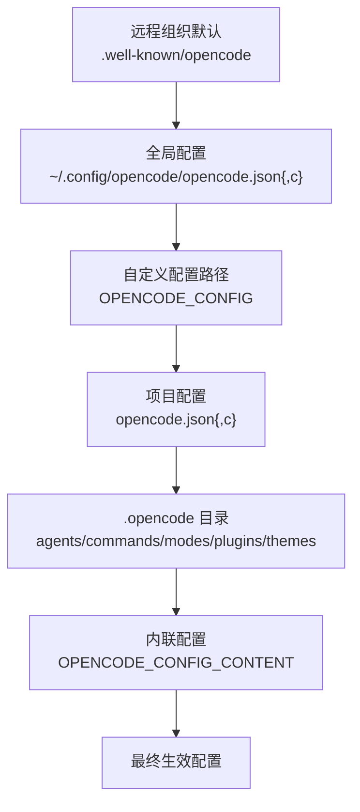
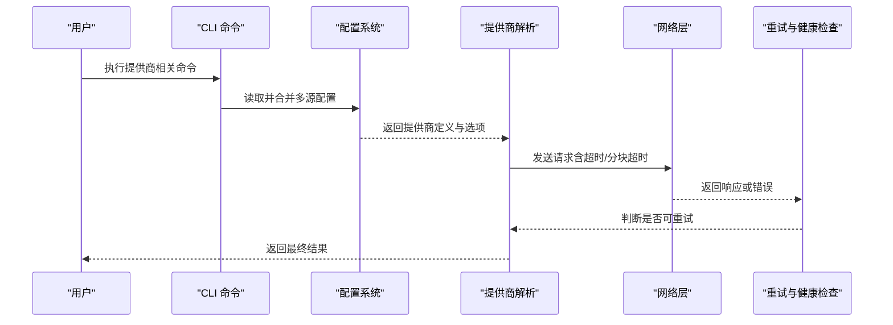
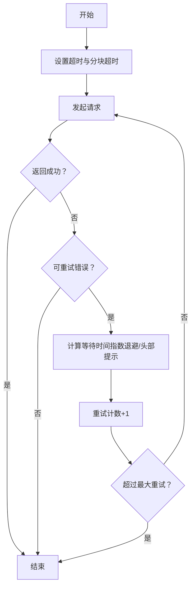

# 提供商配置

<cite>
**本文引用的文件**
- [opencode.jsonc](file://.opencode/opencode.jsonc)
- [env.d.ts](file://.opencode/env.d.ts)
- [providers.mdx](file://packages/web/src/content/docs/providers.mdx)
- [config.mdx](file://packages/web/src/content/docs/config.mdx)
- [config.ts](file://packages/opencode/src/config/config.ts)
- [provider.test.ts](file://packages/opencode/test/provider/provider.test.ts)
- [providers.ts](file://packages/opencode/src/cli/cmd/providers.ts)
- [retry.ts](file://packages/util/src/retry.ts)
- [server-health.ts](file://packages/app/src/utils/server-health.ts)
- [retry.test.ts](file://packages/opencode/test/session/retry.test.ts)
</cite>

## 目录
1. [简介](#简介)
2. [项目结构](#项目结构)
3. [核心组件](#核心组件)
4. [架构总览](#架构总览)
5. [详细组件分析](#详细组件分析)
6. [依赖关系分析](#依赖关系分析)
7. [性能考量](#性能考量)
8. [故障排查指南](#故障排查指南)
9. [结论](#结论)
10. [附录](#附录)

## 简介
本章节系统性说明 OpenCode 中“模型提供商”的配置方法，覆盖配置文件结构、参数设置、环境变量使用、不同环境（开发/测试/生产）的差异化配置策略、配置验证与错误检查、调试技巧，以及批量配置与模板化的最佳实践。内容基于仓库内实际文档与源码实现进行提炼，确保可操作与可落地。

## 项目结构
OpenCode 的配置体系以 JSON/JSONC 配置文件为核心，支持多级来源合并与优先级叠加。针对“提供商”配置，主要涉及以下位置与文件：
- 全局配置：用户主目录下的全局配置文件
- 项目配置：项目根目录的配置文件
- 远程组织默认：通过认证后从组织提供的远程端点加载
- 自定义路径/目录：通过环境变量指定的自定义配置路径或目录
- 内联配置：通过环境变量注入的运行时配置片段
- .opencode 目录：用于存放 agents/commands/modes/plugins 等扩展资源的目录

图表来源
- [config.mdx:42-53](file://packages/web/src/content/docs/config.mdx#L42-L53)
- [config.ts:81-178](file://packages/opencode/src/config/config.ts#L81-L178)

章节来源
- [config.mdx:27-57](file://packages/web/src/content/docs/config.mdx#L27-L57)
- [config.ts:81-178](file://packages/opencode/src/config/config.ts#L81-L178)

## 核心组件
- 提供商配置对象：位于顶层 provider 字段下，每个子键代表一个提供商 ID；每个提供商可包含 npm 包名、显示名称、选项（如 baseURL、apiKey、headers）、模型列表及其限制等。
- 通用选项字段：timeout、chunkTimeout、setCacheKey、apiKey、baseURL、enterpriseUrl 等。
- 环境变量语法：在配置中使用形如 {env:VARNAME} 的占位符，启动时由配置系统解析为进程环境变量值。
- CLI 提供商命令：提供登录/登出、列出可用提供商等交互式能力，便于在终端中完成认证与配置引导。

章节来源
- [providers.mdx:1885-1945](file://packages/web/src/content/docs/providers.mdx#L1885-L1945)
- [config.ts:1000-1035](file://packages/opencode/src/config/config.ts#L1000-L1035)
- [providers.ts:418-457](file://packages/opencode/src/cli/cmd/providers.ts#L418-L457)

## 架构总览
下图展示“配置加载—提供商解析—请求发送—重试与健康检查”的整体流程：

图表来源
- [config.ts:81-200](file://packages/opencode/src/config/config.ts#L81-L200)
- [providers.ts:418-457](file://packages/opencode/src/cli/cmd/providers.ts#L418-L457)
- [retry.ts:26-41](file://packages/util/src/retry.ts#L26-L41)
- [server-health.ts:59-73](file://packages/app/src/utils/server-health.ts#L59-L73)

## 详细组件分析

### 配置文件结构与字段说明
- provider 子树：按提供商 ID 维度组织，每个提供商可包含：
  - npm：指定使用的 AI SDK 包（如 openai-compatible 或特定厂商包）
  - name：UI 展示名称
  - options：通用与特定提供商选项
  - models：模型白名单/别名/限制
- options 常用字段：
  - baseURL：API 端点
  - apiKey：API 密钥（建议通过 {env:VARNAME} 引用环境变量）
  - headers：随请求发送的自定义头部
  - timeout：请求超时（毫秒），false 表示禁用
  - chunkTimeout：流式响应分块超时（毫秒）
  - setCacheKey：为该提供商强制设置缓存键
  - enterpriseUrl：企业版 Copilot 认证所需的 GitHub Enterprise URL
- 模型限制（models.*.limit）：
  - context：最大输入 token 数
  - output：最大输出 token 数

章节来源
- [providers.mdx:1885-1945](file://packages/web/src/content/docs/providers.mdx#L1885-L1945)
- [config.ts:1000-1035](file://packages/opencode/src/config/config.ts#L1000-L1035)

### 环境变量使用与解析
- 在配置中使用 {env:VARNAME} 占位符，配置系统会在启动时解析为进程环境变量值。
- 支持在全局/项目/远程/内联配置中混用环境变量，最终以合并后的配置为准。
- CLI 登录流程会提示输入密钥，并写入认证存储，供后续提供商调用使用。

章节来源
- [providers.mdx:1906-1936](file://packages/web/src/content/docs/providers.mdx#L1906-L1936)
- [config.ts:180-200](file://packages/opencode/src/config/config.ts#L180-L200)
- [providers.ts:436-447](file://packages/opencode/src/cli/cmd/providers.ts#L436-L447)

### 不同环境的配置策略
- 开发环境：
  - 使用本地/沙箱 API 端点（baseURL）
  - 适当降低 timeout，便于快速反馈
  - 可开启更宽松的 headers（如调试令牌）
- 测试环境：
  - 使用测试专用密钥与端点
  - 合理设置 chunkTimeout，避免长连接导致的误判
  - 可启用 setCacheKey 保证缓存一致性
- 生产环境：
  - 使用官方/生产端点与密钥
  - 明确设置超时与分块超时，避免长时间阻塞
  - 对于高并发场景，结合重试与健康检查策略

章节来源
- [config.mdx:246-295](file://packages/web/src/content/docs/config.mdx#L246-L295)
- [providers.mdx:1950-1962](file://packages/web/src/content/docs/providers.mdx#L1950-L1962)

### 代理服务器与企业网络
- 通过企业版 Copilot 认证的 enterpriseUrl 字段配置 GitHub Enterprise URL
- 通用网络代理可通过系统环境变量或网络层代理工具配合使用（具体取决于运行环境）

章节来源
- [config.ts:1004](file://packages/opencode/src/config/config.ts#L1004)

### 超时参数与重试机制
- 超时参数：
  - timeout：请求整体超时（毫秒，默认 300000，可设为 false 关闭）
  - chunkTimeout：流式响应分块等待超时（毫秒）
- 重试策略：
  - 基础重试：指数退避、最大尝试次数、最大延迟
  - 会话级重试：根据 HTTP 头部 retry-after 动态计算等待时间
  - 健康检查：对网络异常、超时、连接错误等进行可重试判定

图表来源
- [config.mdx:246-295](file://packages/web/src/content/docs/config.mdx#L246-L295)
- [retry.ts:26-41](file://packages/util/src/retry.ts#L26-L41)
- [retry.test.ts:32-104](file://packages/opencode/test/session/retry.test.ts#L32-L104)
- [server-health.ts:51-57](file://packages/app/src/utils/server-health.ts#L51-L57)

### 配置验证与错误检查
- 配置加载顺序与合并规则明确，冲突键后者覆盖前者，非冲突键保留
- 远程组织默认配置优先加载，随后被全局/项目配置覆盖
- CLI 提供 auth list 等命令帮助核验认证状态
- 文档提供了常见问题排查清单（认证、包名、端点等）

章节来源
- [config.mdx:42-53](file://packages/web/src/content/docs/config.mdx#L42-L53)
- [config.ts:81-178](file://packages/opencode/src/config/config.ts#L81-L178)
- [providers.ts:418-457](file://packages/opencode/src/cli/cmd/providers.ts#L418-L457)
- [providers.mdx:1949-1962](file://packages/web/src/content/docs/providers.mdx#L1949-L1962)

### 调试技巧
- 使用 CLI 命令查看认证状态与提供商列表
- 在请求前打印 URL 与请求体，定位参数与头部问题
- 结合日志与健康检查，识别网络波动与服务过载
- 对于流式响应，关注 chunkTimeout 设置，避免误判超时

章节来源
- [providers.ts:418-457](file://packages/opencode/src/cli/cmd/providers.ts#L418-L457)
- [server-health.ts:59-73](file://packages/app/src/utils/server-health.ts#L59-L73)

### 批量配置与模板化最佳实践
- 使用 .opencode 目录集中管理 agents/commands/modes/plugins 等资源，便于团队复用
- 通过 OPENCODE_CONFIG_DIR 指定统一的配置目录，实现跨项目共享
- 将敏感信息（如 API 密钥）全部使用 {env:VARNAME} 引用，避免硬编码
- 为不同环境准备独立的配置片段，通过 OPENCODE_CONFIG 或 OPENCODE_CONFIG_CONTENT 注入
- 使用 models.limit 字段标准化上下文与输出限制，提升跨模型的一致性体验

章节来源
- [config.mdx:136-149](file://packages/web/src/content/docs/config.mdx#L136-L149)
- [providers.mdx:1906-1936](file://packages/web/src/content/docs/providers.mdx#L1906-L1936)

## 依赖关系分析
- 配置系统负责加载与合并多源配置，输出标准化的提供商定义
- CLI 命令依赖配置系统与认证模块，提供交互式配置引导
- 网络层与重试模块共同决定请求的稳定性与可靠性
- 健康检查模块辅助判断瞬时网络错误并触发重试

图表来源
- [config.ts:81-200](file://packages/opencode/src/config/config.ts#L81-L200)
- [providers.ts:418-457](file://packages/opencode/src/cli/cmd/providers.ts#L418-L457)
- [retry.ts:26-41](file://packages/util/src/retry.ts#L26-L41)
- [server-health.ts:59-73](file://packages/app/src/utils/server-health.ts#L59-L73)

## 性能考量
- 合理设置 timeout 与 chunkTimeout，避免过长阻塞影响用户体验
- 对高并发场景启用 setCacheKey，减少重复请求
- 使用流式响应时，适当放宽 chunkTimeout，避免频繁中断
- 结合重试策略与健康检查，提升整体吞吐与稳定性

## 故障排查指南
- 认证问题：执行认证列表命令核验凭据是否存在
- 包名与端点：确认提供商 npm 包与 baseURL 正确
- 环境变量：检查 {env:VARNAME} 是否解析为预期值
- 超时与重试：根据网络状况调整 timeout/chunkTimeout，观察重试行为
- 健康检查：对网络波动与服务过载进行识别与缓解

章节来源
- [providers.ts:418-457](file://packages/opencode/src/cli/cmd/providers.ts#L418-L457)
- [providers.mdx:1949-1962](file://packages/web/src/content/docs/providers.mdx#L1949-L1962)
- [retry.test.ts:32-104](file://packages/opencode/test/session/retry.test.ts#L32-L104)

## 结论
OpenCode 的提供商配置以 JSON/JSONC 为中心，通过多源合并与严格的优先级规则实现灵活可控的配置管理。结合环境变量、CLI 引导、超时与重试策略，可在不同环境下稳定地接入多种模型提供商。建议在团队内推广模板化与批量配置实践，统一密钥管理与端点规范，持续优化超时与重试参数，以获得更好的性能与可靠性。

## 附录

### 完整配置示例（路径引用）
- 基础提供商配置示例（包含 npm、name、options、models）：
  - 示例路径：[providers.mdx 示例:1906-1936](file://packages/web/src/content/docs/providers.mdx#L1906-L1936)
- 通用选项示例（timeout、chunkTimeout、setCacheKey）：
  - 示例路径：[config.mdx 选项示例:246-262](file://packages/web/src/content/docs/config.mdx#L246-L262)
- Amazon Bedrock 特定选项示例（region/profile/endpoint）：
  - 示例路径：[config.mdx Bedrock 示例:276-293](file://packages/web/src/content/docs/config.mdx#L276-L293)

### 环境变量声明类型
- 类型声明文件（用于 TypeScript 项目）：
  - 文件路径：[env.d.ts](file://.opencode/env.d.ts)

### 配置验证与测试参考
- 配置加载与环境变量替换测试：
  - 测试路径：[config.test.ts:181-208](file://packages/opencode/test/config/config.test.ts#L181-L208)
- 提供商加载与过滤测试（启用/禁用、白名单/黑名单、别名）：
  - 测试路径：[provider.test.ts:10-2285](file://packages/opencode/test/provider/provider.test.ts#L10-2285)