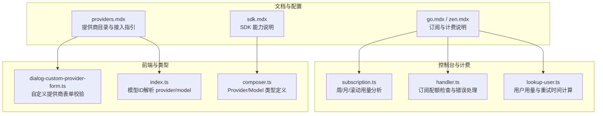
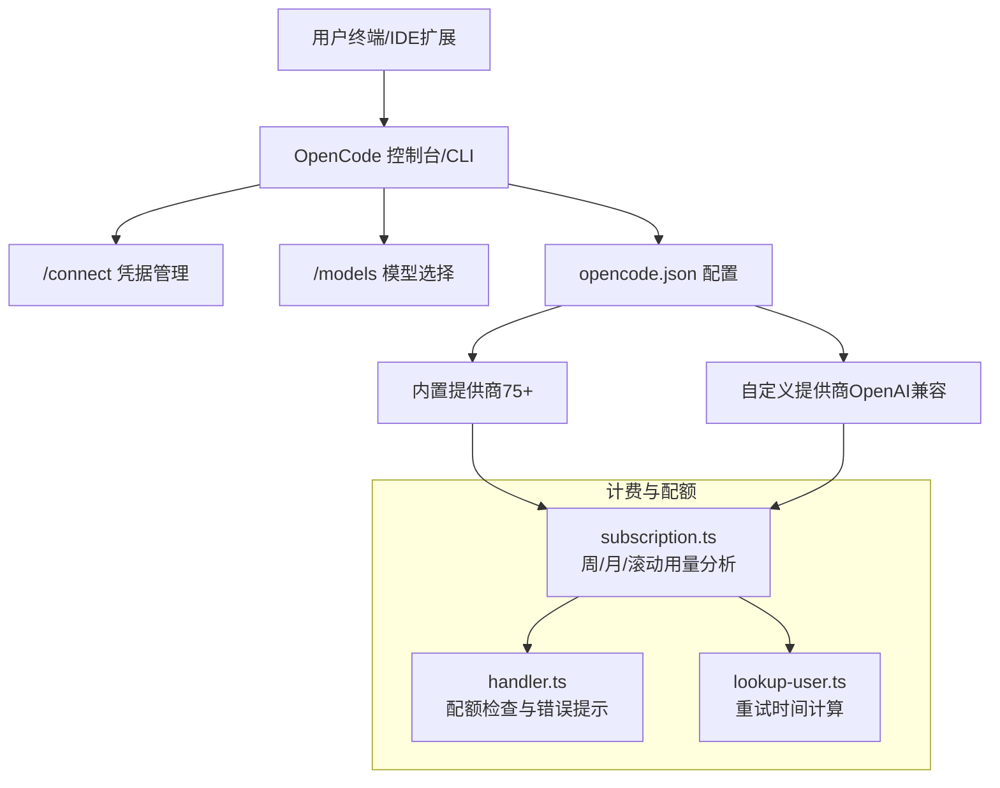
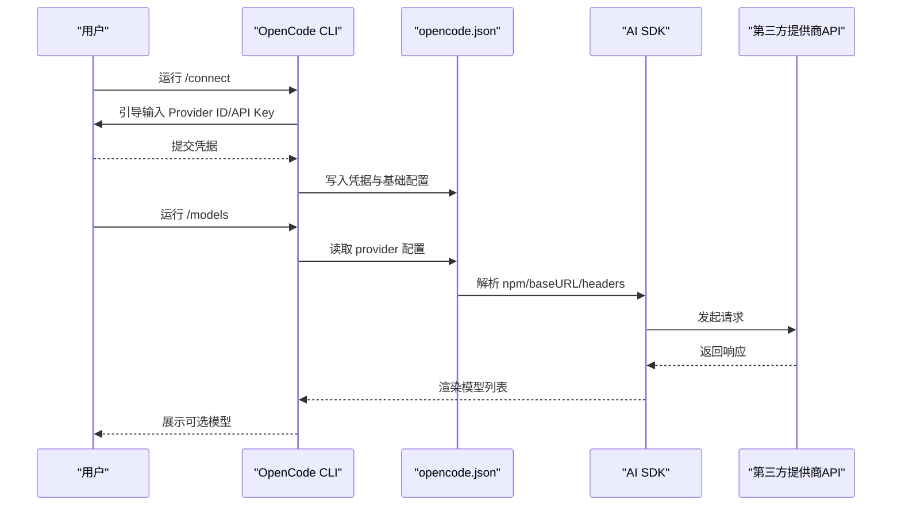
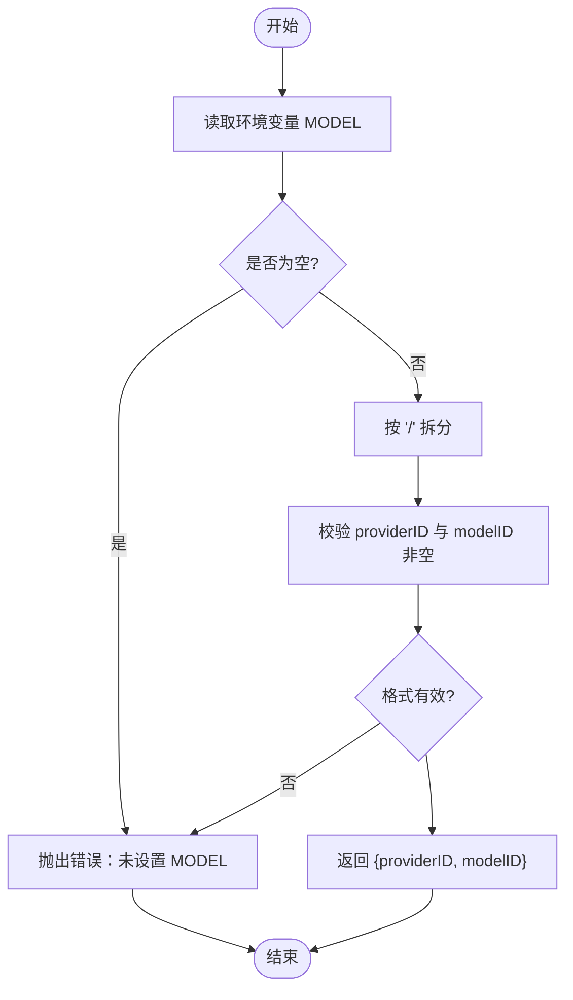
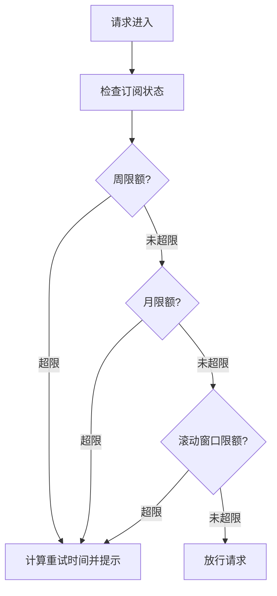
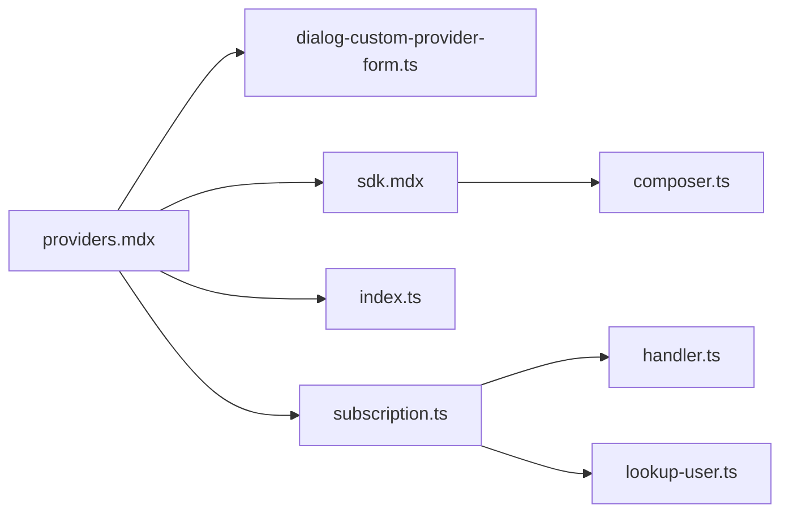

# 支持的模型提供商

<cite>
**本文引用的文件**
- [providers.mdx](file://packages/web/src/content/docs/providers.mdx)
- [dialog-custom-provider-form.ts](file://packages/app/src/components/dialog-custom-provider-form.ts)
- [index.ts](file://github/index.ts)
- [sdk.mdx](file://packages/web/src/content/docs/sdk.mdx)
- [composer.ts](file://packages/strategy-front/src/types/composer.ts)
- [go.mdx](file://packages/web/src/content/docs/go.mdx)
- [zen.mdx](file://packages/web/src/content/docs/zen.mdx)
- [subscription.ts](file://packages/console/core/src/subscription.ts)
- [handler.ts](file://packages/console/app/src/routes/zen/util/handler.ts)
- [lookup-user.ts](file://packages/console/core/script/lookup-user.ts)
</cite>

## 目录
1. [简介](#简介)
2. [项目结构](#项目结构)
3. [核心组件](#核心组件)
4. [架构总览](#架构总览)
5. [详细组件分析](#详细组件分析)
6. [依赖关系分析](#依赖关系分析)
7. [性能考量](#性能考量)
8. [故障排查指南](#故障排查指南)
9. [结论](#结论)
10. [附录](#附录)

## 简介
本文件面向需要在 OpenCode 中选择和使用 LLM 模型提供商的用户，系统梳理项目内已支持的 75+ 个提供商，覆盖开源与商业两类路径，并提供按类型分组的清单、基本信息、支持的模型与版本、官方站点、定价与使用限制、以及快速筛选与对比方法。同时给出与 OpenCode 集成的关键流程与配置要点，帮助用户高效完成接入与使用。

## 项目结构
OpenCode 通过 AI SDK 与 Models.dev 协作，实现对多家 LLM 提供商的支持；同时允许用户通过“自定义提供商”对接任意 OpenAI 兼容接口。文档与实现层面的关键位置如下：
- 提供商目录与接入指引：packages/web/src/content/docs/providers.mdx
- 自定义提供商表单校验逻辑：packages/app/src/components/dialog-custom-provider-form.ts
- 模型 ID 格式解析（provider/model）：github/index.ts
- SDK 对外能力（含 provider 列表查询）：packages/web/src/content/docs/sdk.mdx
- 前端类型定义（Provider/Model 关联）：packages/strategy-front/src/types/composer.ts
- 计费与配额（Go/ Zen）：packages/web/src/content/docs/go.mdx、packages/web/src/content/docs/zen.mdx
- 订阅与用量分析（周/月/滚动窗口）：packages/console/core/src/subscription.ts
- 订阅配额检查与错误处理：packages/console/app/src/routes/zen/util/handler.ts、packages/console/core/script/lookup-user.ts

图表来源
- [providers.mdx](file://packages/web/src/content/docs/providers.mdx)
- [dialog-custom-provider-form.ts](file://packages/app/src/components/dialog-custom-provider-form.ts)
- [index.ts](file://github/index.ts)
- [sdk.mdx](file://packages/web/src/content/docs/sdk.mdx)
- [composer.ts](file://packages/strategy-front/src/types/composer.ts)
- [go.mdx](file://packages/web/src/content/docs/go.mdx)
- [zen.mdx](file://packages/web/src/content/docs/zen.mdx)
- [subscription.ts](file://packages/console/core/src/subscription.ts)
- [handler.ts](file://packages/console/app/src/routes/zen/util/handler.ts)
- [lookup-user.ts](file://packages/console/core/script/lookup-user.ts)

章节来源
- [providers.mdx](file://packages/web/src/content/docs/providers.mdx)
- [dialog-custom-provider-form.ts](file://packages/app/src/components/dialog-custom-provider-form.ts)
- [index.ts](file://github/index.ts)
- [sdk.mdx](file://packages/web/src/content/docs/sdk.mdx)
- [composer.ts](file://packages/strategy-front/src/types/composer.ts)
- [go.mdx](file://packages/web/src/content/docs/go.mdx)
- [zen.mdx](file://packages/web/src/content/docs/zen.mdx)
- [subscription.ts](file://packages/console/core/src/subscription.ts)
- [handler.ts](file://packages/console/app/src/routes/zen/util/handler.ts)
- [lookup-user.ts](file://packages/console/core/script/lookup-user.ts)

## 核心组件
- 提供商目录与接入流程
  - 文档明确支持 75+ 提供商，涵盖 OpenAI、Anthropic、Google、Amazon Bedrock、Azure、Hugging Face、OpenRouter、Vercel AI Gateway、xAI、Z.AI、Cloudflare AI Gateway、GitLab Duo、GitHub Copilot、SAP AI Core、OVHcloud、Scaleway、Together AI、Venice AI、Nebius、IO.NET、Moonshot AI、MiniMax、Cortecs、DeepSeek、Deep Infra、Firmware、Fireworks AI、Baseten、Cerebras、Helicone、Ollama/Ollama Cloud、llama.cpp、本地模型等。
  - 接入步骤统一为：/connect 添加凭据；/models 选择模型；必要时在 opencode.json 中补充配置（baseURL、npm 包、自定义模型与 limit 等）。
- 自定义提供商
  - 支持任意 OpenAI 兼容接口；通过表单校验确保 providerID、baseURL、模型 ID 唯一性与格式正确；可通过 npm 字段指定 @ai-sdk/openai-compatible 或特定 SDK 包。
- 模型 ID 规范
  - 统一采用 provider/model 格式，便于路由与分享卡片生成。
- SDK 能力
  - 提供 config.providers() 查询可用提供商与默认模型的能力，便于集成与自动化管理。
- 订阅与计费
  - OpenCode Go 与 OpenCode Zen 提供订阅与按量计费两种模式，支持周/月/滚动窗口用量分析与配额限制，保障稳定访问与成本可控。

章节来源
- [providers.mdx](file://packages/web/src/content/docs/providers.mdx)
- [dialog-custom-provider-form.ts](file://packages/app/src/components/dialog-custom-provider-form.ts)
- [index.ts](file://github/index.ts)
- [sdk.mdx](file://packages/web/src/content/docs/sdk.mdx)
- [go.mdx](file://packages/web/src/content/docs/go.mdx)
- [zen.mdx](file://packages/web/src/content/docs/zen.mdx)
- [subscription.ts](file://packages/console/core/src/subscription.ts)

## 架构总览
下图展示 OpenCode 与提供商生态的交互关系：用户通过 /connect 与 /models 完成接入与选择，配置可扩展至自定义提供商；控制台侧负责订阅与用量分析，确保稳定与合规。

图表来源
- [providers.mdx](file://packages/web/src/content/docs/providers.mdx)
- [dialog-custom-provider-form.ts](file://packages/app/src/components/dialog-custom-provider-form.ts)
- [subscription.ts](file://packages/console/core/src/subscription.ts)
- [handler.ts](file://packages/console/app/src/routes/zen/util/handler.ts)
- [lookup-user.ts](file://packages/console/core/script/lookup-user.ts)

## 详细组件分析

### 提供商类型与清单（按类别）
- 开源/社区类
  - Hugging Face Inference Providers：访问 17+ 提供商支持的开源模型。
  - IO.NET：提供 17 个优化模型。
  - Moonshot AI：Kimi K2 系列。
  - MiniMax：M2.1/M2.5 等系列。
  - Cortecs：Kimi K2 Instruct 等。
  - DeepSeek：DeepSeek Reasoner 等。
  - Deep Infra：多模型支持。
  - Firmware：基础模型。
  - Fireworks AI：Kimi K2 Instruct 等。
  - Baseten：多模型支持。
  - Cerebras：Qwen 3 Coder 480B 等。
  - Helicone：通过网关聚合多家提供商，支持缓存与会话追踪。
  - Ollama/Ollama Cloud：本地与云端模型。
  - llama.cpp：本地模型。
  - 本地模型：LM Studio、自定义 OpenAI 兼容接口。
- 商业/企业类
  - OpenAI：ChatGPT Plus/Pro 订阅或 API Key。
  - Anthropic：Claude Pro/Max/Sonnet/Opus 等。
  - Google Vertex AI：多区域部署与认证。
  - Azure OpenAI/Azure Cognitive Services：资源名与部署名匹配。
  - Amazon Bedrock：多种认证方式（AK/SK、配置文件、Bearer Token、WebIdentity）。
  - Vercel AI Gateway：统一入口，按列表价格收费。
  - xAI：Grok Beta。
  - Z.AI：GLM 编码计划。
  - Cloudflare AI Gateway：统一账单，无需多 Key。
  - OpenCode Zen/OpenCode Go：精选模型与订阅计划。
  - SAP AI Core：统一平台接入多家提供商。
  - STACKIT：欧洲主权托管环境。
  - OVHcloud AI Endpoints：AI Endpoints API Key。
  - Scaleway：Generative APIs。
  - Together AI：Kimi K2 Instruct 等。
  - Venice AI：Llama 3.3 70B 等。
  - Nebius Token Factory：Kimi K2 Instruct 等。
  - GitLab Duo：GitLab Anthropic 代理，支持 OAuth 与个人访问令牌。
  - GitHub Copilot：设备授权流程。
  - Groq：高性能推理。

说明
- 上述列表来源于 providers.mdx 的“Directory”章节与各提供商条目，覆盖开源与商业两大路径。
- “OpenCode Zen/OpenCode Go”属于平台提供的订阅与精选模型服务，非单一外部提供商，但作为可选接入路径纳入清单。

章节来源
- [providers.mdx](file://packages/web/src/content/docs/providers.mdx)

### 自定义提供商接入流程

图表来源
- [providers.mdx](file://packages/web/src/content/docs/providers.mdx)
- [dialog-custom-provider-form.ts](file://packages/app/src/components/dialog-custom-provider-form.ts)

章节来源
- [providers.mdx](file://packages/web/src/content/docs/providers.mdx)
- [dialog-custom-provider-form.ts](file://packages/app/src/components/dialog-custom-provider-form.ts)

### 模型 ID 规范与解析
- 统一格式：provider/model
- 解析逻辑：从环境变量 MODEL 中读取，拆分为 providerID 与 modelID，并进行格式校验
- 分享卡片：基于 providerID/modelID 生成社交卡片链接

图表来源
- [index.ts](file://github/index.ts)

章节来源
- [index.ts](file://github/index.ts)

### SDK 能力与 Provider 列表
- config.providers()：返回可用提供商列表与默认模型映射，便于自动化与前端展示
- 与前端类型 composer.ts 的 Provider/Model 关联一致，支撑“目录—选择—连接”的闭环

章节来源
- [sdk.mdx](file://packages/web/src/content/docs/sdk.mdx)
- [composer.ts](file://packages/strategy-front/src/types/composer.ts)

### 订阅与计费（Go/ Zen）
- OpenCode Go：首月 $5，之后 $10/月，包含 GLM-5、Kimi K2.5、MiniMax M2.5 等，支持周/月/滚动窗口用量分析与自动充值。
- OpenCode Zen：按量计费，支持缓存与会话追踪，提供订阅配额检查与错误提示。
- 计费侧通过 subscription.ts 的周/月/滚动用量分析，结合 handler.ts 与 lookup-user.ts 的配额检查与重试时间计算，确保稳定访问。

图表来源
- [subscription.ts](file://packages/console/core/src/subscription.ts)
- [handler.ts](file://packages/console/app/src/routes/zen/util/handler.ts)
- [lookup-user.ts](file://packages/console/core/script/lookup-user.ts)

章节来源
- [go.mdx](file://packages/web/src/content/docs/go.mdx)
- [zen.mdx](file://packages/web/src/content/docs/zen.mdx)
- [subscription.ts](file://packages/console/core/src/subscription.ts)
- [handler.ts](file://packages/console/app/src/routes/zen/util/handler.ts)
- [lookup-user.ts](file://packages/console/core/script/lookup-user.ts)

## 依赖关系分析
- 组件耦合
  - providers.mdx 为用户提供接入与配置参考，与 dialog-custom-provider-form.ts 的校验规则强关联。
  - index.ts 的模型 ID 解析贯穿 CLI 流程，影响分享卡片与路由行为。
  - subscription.ts 与 handler.ts/lookup-user.ts 形成“用量分析—配额检查—错误处理”的闭环。
- 外部依赖
  - AI SDK 与 Models.dev 提供统一的提供商与模型发现机制。
  - 第三方提供商（OpenAI、Anthropic、Google、Azure、Bedrock、GitLab、GitHub Copilot 等）通过各自认证与 API 端点接入。

图表来源
- [providers.mdx](file://packages/web/src/content/docs/providers.mdx)
- [dialog-custom-provider-form.ts](file://packages/app/src/components/dialog-custom-provider-form.ts)
- [sdk.mdx](file://packages/web/src/content/docs/sdk.mdx)
- [composer.ts](file://packages/strategy-front/src/types/composer.ts)
- [index.ts](file://github/index.ts)
- [subscription.ts](file://packages/console/core/src/subscription.ts)
- [handler.ts](file://packages/console/app/src/routes/zen/util/handler.ts)
- [lookup-user.ts](file://packages/console/core/script/lookup-user.ts)

章节来源
- [providers.mdx](file://packages/web/src/content/docs/providers.mdx)
- [dialog-custom-provider-form.ts](file://packages/app/src/components/dialog-custom-provider-form.ts)
- [sdk.mdx](file://packages/web/src/content/docs/sdk.mdx)
- [composer.ts](file://packages/strategy-front/src/types/composer.ts)
- [index.ts](file://github/index.ts)
- [subscription.ts](file://packages/console/core/src/subscription.ts)
- [handler.ts](file://packages/console/app/src/routes/zen/util/handler.ts)
- [lookup-user.ts](file://packages/console/core/script/lookup-user.ts)

## 性能考量
- 选择合适的提供商
  - 对于低延迟与高吞吐：优先考虑 Cloudflare/Vercel AI Gateway、Groq、OpenCode Go/Zen 等。
  - 对于多模型聚合与可观测性：Helicone 提供统一网关与缓存/会话追踪能力。
- 本地模型
  - Ollama/LM Studio/llama.cpp 适合隐私敏感与离线场景，注意上下文长度与工具调用支持。
- 订阅与配额
  - 合理设置周/月/滚动窗口限额，避免突发流量触发限流；Go/ Zen 支持自动充值与余额切换。

## 故障排查指南
- 凭据与认证
  - 使用 opencode auth list 检查凭据是否已写入 auth.json；Amazon Bedrock 等提供商需检查环境变量或配置文件优先级。
- 自定义提供商
  - 确认 providerID 与 opencode.json 中一致；npm 包选择正确（@ai-sdk/openai-compatible 或特定 SDK 包）；baseURL 正确。
- 订阅与配额
  - 当触发配额限制时，查看 handler.ts/lookup-user.ts 的重试时间与错误提示；必要时启用余额切换或降低并发。
- 模型 ID
  - 确保 MODEL 环境变量格式为 provider/model；解析失败将抛错。

章节来源
- [providers.mdx](file://packages/web/src/content/docs/providers.mdx)
- [handler.ts](file://packages/console/app/src/routes/zen/util/handler.ts)
- [lookup-user.ts](file://packages/console/core/script/lookup-user.ts)
- [index.ts](file://github/index.ts)

## 结论
OpenCode 通过统一的提供商目录、标准化的接入流程与灵活的自定义能力，覆盖 75+ 提供商与本地模型路径。结合订阅与用量分析机制，既能满足多样化的业务需求，又能保障访问稳定性与成本可控。建议用户先从 OpenCode Zen/OpenCode Go 入手，再根据场景选择开源或商业提供商，并通过自定义提供商对接私有化或兼容接口。

## 附录

### 快速筛选与比较方法
- 场景导向
  - 低延迟/高吞吐：Groq、Cloudflare/Vercel AI Gateway、OpenCode Go/Zen
  - 多模型聚合：OpenRouter、Helicone、Vercel AI Gateway
  - 企业合规：Azure/Google Vertex/AWS Bedrock、SAP AI Core、STACKIT、OVHcloud、Scaleway
  - 开源模型：Hugging Face、IO.NET、Moonshot AI、MiniMax、Cortecs、DeepSeek、Deep Infra、Firmware、Fireworks AI、Baseten、Cerebras
  - 本地与隐私：Ollama/LM Studio/llama.cpp、自定义 OpenAI 兼容
- 评估维度
  - 官方网站与定价：参考各提供商条目中的链接与计费说明
  - 模型与版本：通过 /models 选择并核对模型 ID
  - 认证与部署：按提供商要求配置 API Key/Token/证书/区域
  - 限流与配额：结合 subscription.ts 的分析策略与 handler.ts 的错误提示

章节来源
- [providers.mdx](file://packages/web/src/content/docs/providers.mdx)
- [subscription.ts](file://packages/console/core/src/subscription.ts)
- [handler.ts](file://packages/console/app/src/routes/zen/util/handler.ts)