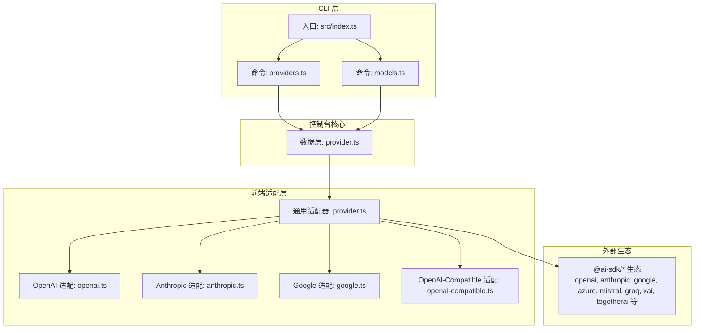
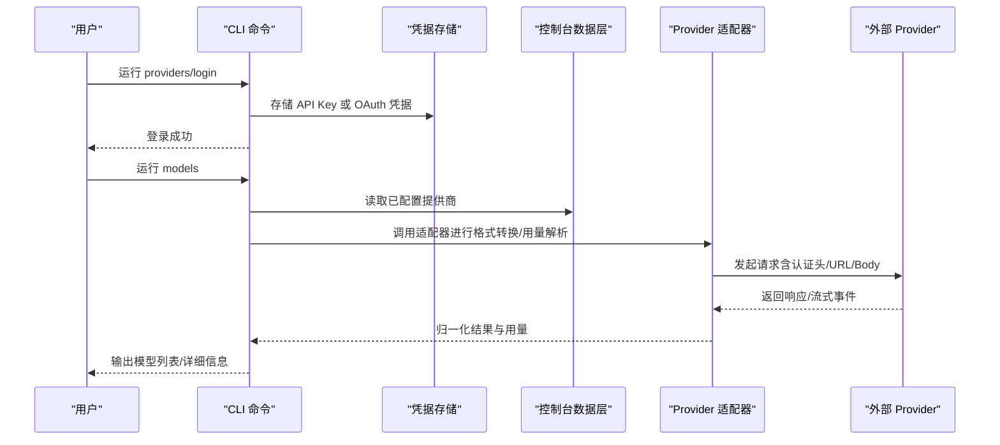
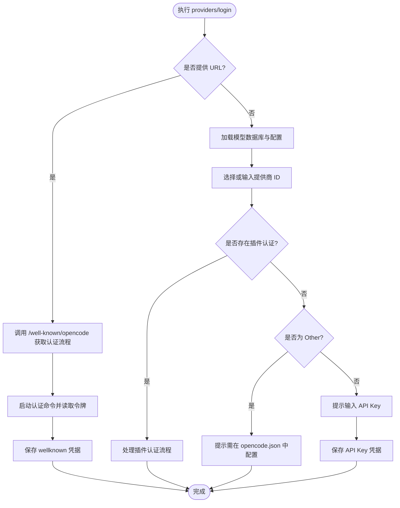
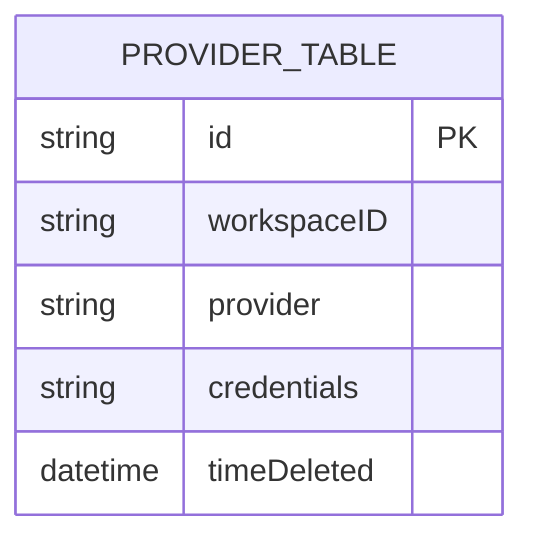
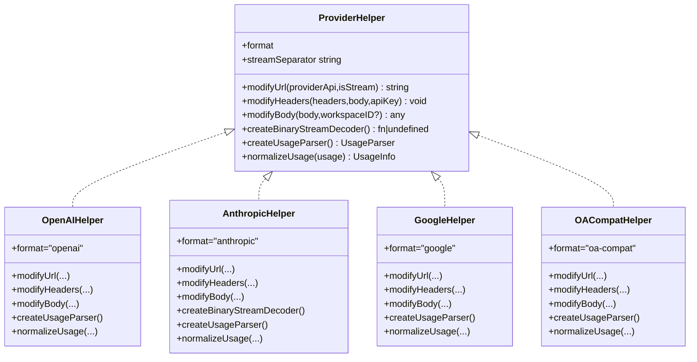
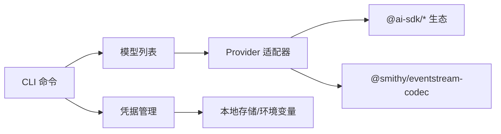

# 模型提供商集成

<cite>
**本文档引用的文件**
- [packages/opencode/src/index.ts](file://packages/opencode/src/index.ts)
- [packages/opencode/package.json](file://packages/opencode/package.json)
- [packages/opencode/src/cli/cmd/providers.ts](file://packages/opencode/src/cli/cmd/providers.ts)
- [packages/opencode/src/cli/cmd/models.ts](file://packages/opencode/src/cli/cmd/models.ts)
- [packages/console/core/src/provider.ts](file://packages/console/core/src/provider.ts)
- [packages/console/app/src/route/zen/util/provider/provider.ts](file://packages/console/app/src/route/zen/util/provider/provider.ts)
- [packages/console/app/src/route/zen/util/provider/openai.ts](file://packages/console/app/src/route/zen/util/provider/openai.ts)
- [packages/console/app/src/route/zen/util/provider/anthropic.ts](file://packages/console/app/src/route/zen/util/provider/anthropic.ts)
- [packages/console/app/src/route/zen/util/provider/google.ts](file://packages/console/app/src/route/zen/util/provider/google.ts)
- [packages/console/app/src/route/zen/util/provider/openai-compatible.ts](file://packages/console/app/src/route/zen/util/provider/openai-compatible.ts)
- [packages/web/src/content/docs/providers.mdx](file://packages/web/src/content/docs/providers.mdx)
</cite>

## 目录
1. [简介](#简介)
2. [项目结构](#项目结构)
3. [核心组件](#核心组件)
4. [架构总览](#架构总览)
5. [详细组件分析](#详细组件分析)
6. [依赖关系分析](#依赖关系分析)
7. [性能考量](#性能考量)
8. [故障排查指南](#故障排查指南)
9. [结论](#结论)
10. [附录](#附录)

## 简介
本文件系统性介绍 OpenCode 的 AI 模型提供商集成能力，覆盖以下方面：
- 支持的提供商与模型生态（基于 AI SDK Provider 生态与内置适配器）
- 各提供商的特性、认证方式与使用限制
- 配置步骤、认证方法与 API 密钥管理
- 模型切换、负载均衡与故障转移机制
- 性能对比、成本优化与最佳实践
- 自定义模型提供商集成的开发指南与示例

## 项目结构
OpenCode 在 CLI 层提供统一入口，在控制台前端通过 Provider Helper 实现多厂商协议适配，并通过 AI SDK Provider 生态实现对多家 LLM 提供商的接入。

图表来源
- [packages/opencode/src/index.ts:50-147](file://packages/opencode/src/index.ts#L50-L147)
- [packages/opencode/src/cli/cmd/providers.ts:195-202](file://packages/opencode/src/cli/cmd/providers.ts#L195-L202)
- [packages/opencode/src/cli/cmd/models.ts:10-78](file://packages/opencode/src/cli/cmd/models.ts#L10-L78)
- [packages/console/core/src/provider.ts:8-57](file://packages/console/core/src/provider.ts#L8-L57)
- [packages/console/app/src/route/zen/util/provider/provider.ts:165-211](file://packages/console/app/src/route/zen/util/provider/provider.ts#L165-L211)

章节来源
- [packages/opencode/src/index.ts:50-147](file://packages/opencode/src/index.ts#L50-L147)
- [packages/opencode/src/cli/cmd/providers.ts:195-202](file://packages/opencode/src/cli/cmd/providers.ts#L195-L202)
- [packages/opencode/src/cli/cmd/models.ts:10-78](file://packages/opencode/src/cli/cmd/models.ts#L10-L78)
- [packages/console/core/src/provider.ts:8-57](file://packages/console/core/src/provider.ts#L8-L57)

## 核心组件
- CLI 命令体系
  - providers/list：列出已配置的提供商与凭据类型
  - providers/login/logout：登录与登出提供商，支持插件认证与自定义提供商
  - models：列出可用模型，支持刷新缓存与详细输出
- 控制台数据层
  - Provider.list/create/remove：工作区维度的提供商与凭据持久化
- 前端通用适配器
  - ProviderHelper 接口：统一格式转换、URL/Headers/body 修改、流解析与用量归一化
  - 内置适配器：OpenAI、Anthropic、Google、OpenAI-Compatible

章节来源
- [packages/opencode/src/cli/cmd/providers.ts:204-248](file://packages/opencode/src/cli/cmd/providers.ts#L204-L248)
- [packages/opencode/src/cli/cmd/providers.ts:250-450](file://packages/opencode/src/cli/cmd/providers.ts#L250-L450)
- [packages/opencode/src/cli/cmd/providers.ts:452-475](file://packages/opencode/src/cli/cmd/providers.ts#L452-L475)
- [packages/opencode/src/cli/cmd/models.ts:29-78](file://packages/opencode/src/cli/cmd/models.ts#L29-L78)
- [packages/console/core/src/provider.ts:8-57](file://packages/console/core/src/provider.ts#L8-L57)
- [packages/console/app/src/route/zen/util/provider/provider.ts:36-49](file://packages/console/app/src/route/zen/util/provider/provider.ts#L36-L49)

## 架构总览
OpenCode 通过“CLI + 控制台 + 适配器 + 外部 Provider”的分层架构实现多提供商统一接入。CLI 负责用户交互与凭据管理；控制台负责持久化与模型清单；适配器负责协议转换与用量统计；外部 Provider 由 @ai-sdk/* 生态提供。

图表来源
- [packages/opencode/src/cli/cmd/providers.ts:250-450](file://packages/opencode/src/cli/cmd/providers.ts#L250-L450)
- [packages/opencode/src/cli/cmd/models.ts:29-78](file://packages/opencode/src/cli/cmd/models.ts#L29-L78)
- [packages/console/app/src/route/zen/util/provider/provider.ts:165-211](file://packages/console/app/src/route/zen/util/provider/provider.ts#L165-L211)

## 详细组件分析

### CLI 命令：providers 与 models
- providers
  - list：展示凭据与环境变量状态
  - login：支持插件认证、Well-Known 流程、自定义提供商 ID 与提示信息
  - logout：按提供商移除凭据
- models
  - 列出所有可用模型，支持按提供商过滤与刷新缓存
  - verbose 输出包含模型元数据（如成本等）

图表来源
- [packages/opencode/src/cli/cmd/providers.ts:250-450](file://packages/opencode/src/cli/cmd/providers.ts#L250-L450)

章节来源
- [packages/opencode/src/cli/cmd/providers.ts:204-248](file://packages/opencode/src/cli/cmd/providers.ts#L204-L248)
- [packages/opencode/src/cli/cmd/providers.ts:250-450](file://packages/opencode/src/cli/cmd/providers.ts#L250-L450)
- [packages/opencode/src/cli/cmd/providers.ts:452-475](file://packages/opencode/src/cli/cmd/providers.ts#L452-L475)
- [packages/opencode/src/cli/cmd/models.ts:29-78](file://packages/opencode/src/cli/cmd/models.ts#L29-L78)

### 控制台数据层：Provider 持久化
- list：查询当前工作区未删除的提供商
- create：插入或更新提供商凭据
- remove：按提供商 ID 删除（软删除）

图表来源
- [packages/console/core/src/provider.ts:8-57](file://packages/console/core/src/provider.ts#L8-L57)

章节来源
- [packages/console/core/src/provider.ts:8-57](file://packages/console/core/src/provider.ts#L8-L57)

### 通用适配器与多提供商协议
- ProviderHelper 接口
  - format：协议格式标识
  - modifyUrl/modifyHeaders/modifyBody：请求级适配
  - createBinaryStreamDecoder/streamSeparator：流式解码与分隔符
  - createUsageParser/normalizeUsage：用量解析与归一化
- 内置适配器
  - OpenAI：支持安全标识、SSE 流、用量解析
  - Anthropic：支持 Bedrock 与原生接口、二进制事件流解码、用量归一化
  - Google：Gemini 协议、SSE 流、用量归一化
  - OpenAI-Compatible：通用兼容协议、流式 include_usage

图表来源
- [packages/console/app/src/route/zen/util/provider/provider.ts:36-49](file://packages/console/app/src/route/zen/util/provider/provider.ts#L36-L49)
- [packages/console/app/src/route/zen/util/provider/openai.ts:15-64](file://packages/console/app/src/route/zen/util/provider/openai.ts#L15-L64)
- [packages/console/app/src/route/zen/util/provider/anthropic.ts:19-182](file://packages/console/app/src/route/zen/util/provider/anthropic.ts#L19-L182)
- [packages/console/app/src/route/zen/util/provider/google.ts:29-76](file://packages/console/app/src/route/zen/util/provider/google.ts#L29-L76)
- [packages/console/app/src/route/zen/util/provider/openai-compatible.ts:24-74](file://packages/console/app/src/route/zen/util/provider/openai-compatible.ts#L24-L74)

章节来源
- [packages/console/app/src/route/zen/util/provider/provider.ts:165-211](file://packages/console/app/src/route/zen/util/provider/provider.ts#L165-L211)
- [packages/console/app/src/route/zen/util/provider/openai.ts:15-64](file://packages/console/app/src/route/zen/util/provider/openai.ts#L15-L64)
- [packages/console/app/src/route/zen/util/provider/anthropic.ts:19-182](file://packages/console/app/src/route/zen/util/provider/anthropic.ts#L19-L182)
- [packages/console/app/src/route/zen/util/provider/google.ts:29-76](file://packages/console/app/src/route/zen/util/provider/google.ts#L29-L76)
- [packages/console/app/src/route/zen/util/provider/openai-compatible.ts:24-74](file://packages/console/app/src/route/zen/util/provider/openai-compatible.ts#L24-L74)

### 支持的提供商与特性概览
- 基于 @ai-sdk/* 生态的提供商（节选）
  - OpenAI、Anthropic、Google、Azure、Mistral、Groq、xAI、TogetherAI、Cerebras、Perplexity、Vercel、Amazon Bedrock、GitLab AI Provider 等
- 内置适配器覆盖的协议族
  - OpenAI 协议、Anthropic 协议、Google Gemini 协议、OpenAI 兼容协议
- 特性与限制
  - 流式传输：各适配器均支持 SSE/事件流，部分提供商（如 Bedrock）使用二进制事件流解码
  - 用量统计：统一归一化 input/output/cache/reasoning tokens
  - 认证方式：API Key、OAuth、环境变量（如 AWS 凭证链、Cloudflare 环境变量）
  - 使用限制：可通过模型 limit 字段声明 context/output 上限，用于上下文管理

章节来源
- [packages/opencode/package.json:62-81](file://packages/opencode/package.json#L62-L81)
- [packages/console/app/src/route/zen/util/provider/openai.ts:15-64](file://packages/console/app/src/route/zen/util/provider/openai.ts#L15-L64)
- [packages/console/app/src/route/zen/util/provider/anthropic.ts:19-182](file://packages/console/app/src/route/zen/util/provider/anthropic.ts#L19-L182)
- [packages/console/app/src/route/zen/util/provider/google.ts:29-76](file://packages/console/app/src/route/zen/util/provider/google.ts#L29-L76)
- [packages/console/app/src/route/zen/util/provider/openai-compatible.ts:24-74](file://packages/console/app/src/route/zen/util/provider/openai-compatible.ts#L24-L74)

### 配置步骤、认证与 API 密钥管理
- CLI 配置流程
  - providers/login：选择提供商、插件认证或自定义 ID、输入 API Key
  - providers/list：查看凭据与环境变量
  - models：列出模型并可刷新缓存
- 自定义提供商
  - 在 opencode.json 中配置 npm 包、baseURL、apiKey、headers、models 与 limit
  - 使用 /models 命令验证模型可见性
- 环境变量认证
  - Amazon Bedrock：支持 AWS 凭证链（profile、access keys、IAM 角色、EKS IRSA）
  - Cloudflare：支持 CLOUDFLARE_GATEWAY_ID、ACCOUNT_ID、API_TOKEN 等环境变量

章节来源
- [packages/opencode/src/cli/cmd/providers.ts:250-450](file://packages/opencode/src/cli/cmd/providers.ts#L250-L450)
- [packages/opencode/src/cli/cmd/models.ts:29-78](file://packages/opencode/src/cli/cmd/models.ts#L29-L78)
- [packages/web/src/content/docs/providers.mdx:1885-1928](file://packages/web/src/content/docs/providers.mdx#L1885-L1928)

### 模型切换、负载均衡与故障转移
- 模型切换
  - 通过 models 命令查看与筛选模型，CLI 与前端均支持按提供商过滤
- 负载均衡与故障转移
  - 适配器层支持多提供商并行/轮询策略（由上层调度决定）
  - 流式错误重试与用量聚合由适配器统一处理
- 用量与成本
  - 通过 createUsageParser 与 normalizeUsage 统一归一化 token 统计，便于成本追踪

章节来源
- [packages/opencode/src/cli/cmd/models.ts:29-78](file://packages/opencode/src/cli/cmd/models.ts#L29-L78)
- [packages/console/app/src/route/zen/util/provider/provider.ts:43-48](file://packages/console/app/src/route/zen/util/provider/provider.ts#L43-L48)

### 性能对比、成本优化与最佳实践
- 性能对比要点
  - 流式传输：SSE vs 事件流 vs 二进制事件流（Bedrock）
  - 用量统计：统一归一化后便于横向比较
- 成本优化建议
  - 使用 limit.context 与 limit.output 控制上下文长度
  - 合理设置 temperature/top_p 降低 token 生成量
  - 利用缓存读取 tokens（如 Google/Anthropic）减少重复计算
- 最佳实践
  - 优先使用 OpenAI 兼容协议以获得更广泛的模型覆盖
  - 对高延迟提供商启用超时与重试策略
  - 将敏感凭据存储在环境变量或 wellknown 凭据中

[本节为通用指导，无需特定文件引用]

### 自定义模型提供商集成指南
- 开发步骤
  - 选择适配协议：OpenAI、Anthropic、Google、OpenAI-Compatible
  - 实现 ProviderHelper：修改 URL/Headers/Body、流解码、用量解析与归一化
  - 在 opencode.json 中注册 npm 包与 baseURL、apiKey、headers、models、limit
  - 使用 /models 验证模型可用性
- 示例参考
  - OpenAI 兼容协议适配器提供了完整的请求/响应/流转换与用量解析模板
  - 可参考该模式扩展至其他兼容协议

章节来源
- [packages/console/app/src/route/zen/util/provider/openai-compatible.ts:76-214](file://packages/console/app/src/route/zen/util/provider/openai-compatible.ts#L76-L214)
- [packages/web/src/content/docs/providers.mdx:1885-1928](file://packages/web/src/content/docs/providers.mdx#L1885-L1928)

## 依赖关系分析
- CLI 依赖
  - yargs：命令解析与帮助
  - @clack/prompts：交互式 UI
  - @opencode-ai/*：工具库与插件生态
- 控制台依赖
  - 数据库 ORM：drizzle-orm
  - Zod：Schema 校验
- 适配器依赖
  - @ai-sdk/*：多提供商 SDK
  - @smithy/eventstream-codec：Bedrock 二进制事件流解码
- 外部生态
  - Azure、Mistral、Groq、xAI、TogetherAI、Cerebras、Perplexity、Vercel、Amazon Bedrock、GitLab AI Provider

图表来源
- [packages/opencode/src/index.ts:50-147](file://packages/opencode/src/index.ts#L50-L147)
- [packages/opencode/package.json:62-81](file://packages/opencode/package.json#L62-L81)
- [packages/console/app/src/route/zen/util/provider/anthropic.ts:1-4](file://packages/console/app/src/route/zen/util/provider/anthropic.ts#L1-L4)

章节来源
- [packages/opencode/src/index.ts:50-147](file://packages/opencode/src/index.ts#L50-L147)
- [packages/opencode/package.json:62-81](file://packages/opencode/package.json#L62-L81)

## 性能考量
- 流式传输
  - SSE 事件流：低延迟、易于解析
  - 二进制事件流（Bedrock）：需要解码器，但吞吐更高
- 用量统计
  - 统一归一化后可进行跨提供商的成本对比与优化
- 缓存与上下文
  - 合理利用缓存读取 tokens，避免重复计算
  - 通过 limit.context 与 limit.output 控制上下文长度

[本节为通用指导，无需特定文件引用]

## 故障排查指南
- 认证问题
  - 使用 providers/list 检查凭据类型与环境变量
  - Amazon Bedrock：检查 AWS 凭证链与区域配置
  - Cloudflare：检查网关 ID、账户 ID、API Token
- 自定义提供商
  - 确认 npm 包与 baseURL 正确
  - 确认 opencode.json 中的模型与 limit 配置
- 模型不可见
  - 执行 models --refresh 刷新缓存
  - 使用 models --verbose 查看模型元数据

章节来源
- [packages/opencode/src/cli/cmd/providers.ts:204-248](file://packages/opencode/src/cli/cmd/providers.ts#L204-L248)
- [packages/opencode/src/cli/cmd/providers.ts:412-434](file://packages/opencode/src/cli/cmd/providers.ts#L412-L434)
- [packages/opencode/src/cli/cmd/models.ts:29-78](file://packages/opencode/src/cli/cmd/models.ts#L29-L78)
- [packages/web/src/content/docs/providers.mdx:1925-1936](file://packages/web/src/content/docs/providers.mdx#L1925-L1936)

## 结论
OpenCode 通过统一的 CLI、控制台与适配器层，实现了对超过 75 家 LLM 提供商的高效接入。其核心优势包括：
- 协议抽象与多提供商适配
- 统一的用量统计与成本归一化
- 灵活的认证与配置方式（API Key、OAuth、环境变量）
- 易于扩展的自定义提供商集成路径

建议在生产环境中结合 limit 配置、流式传输与用量监控，持续优化性能与成本。

[本节为总结，无需特定文件引用]

## 附录
- 关键命令速览
  - providers list：查看凭据
  - providers login/logout：添加/移除凭据
  - models：列出模型并可刷新缓存
- 常用环境变量
  - AWS_*：Amazon Bedrock 凭证链
  - CLOUDFLARE_*：Cloudflare AI Gateway
  - 其他提供商的 API Key/Token

[本节为补充信息，无需特定文件引用]