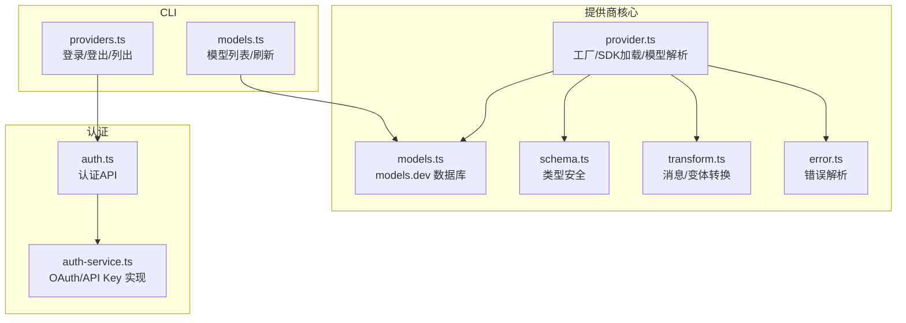
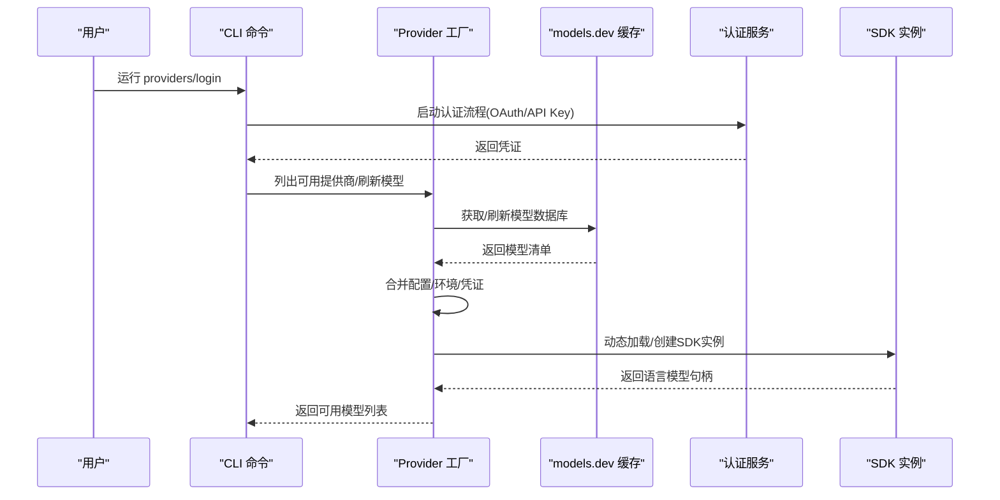
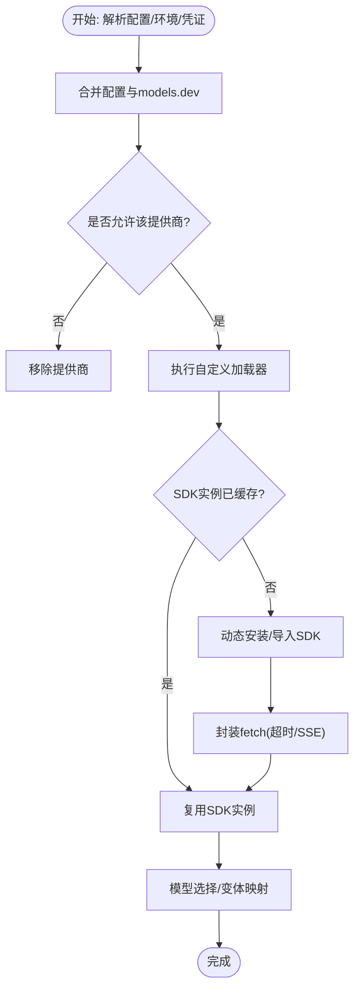
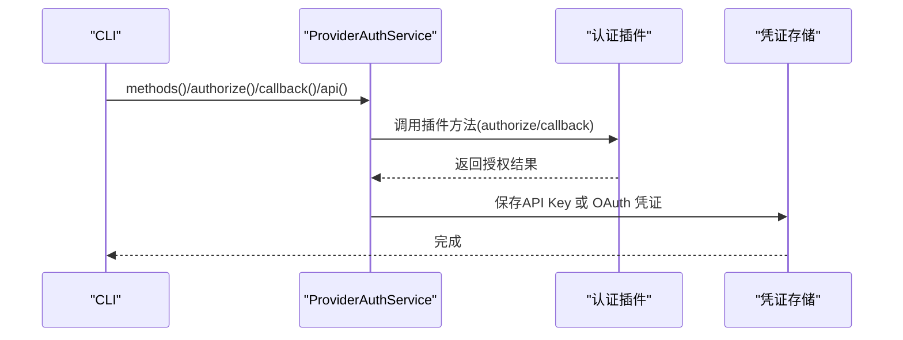
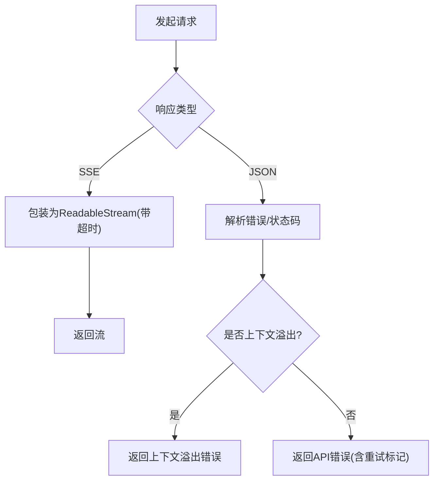
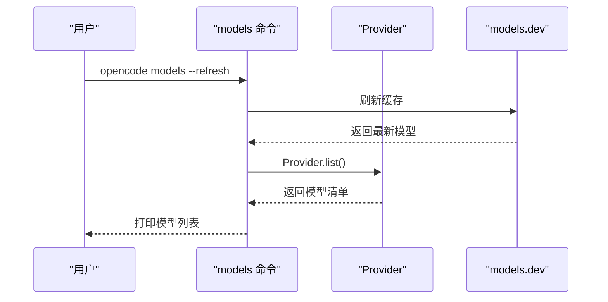
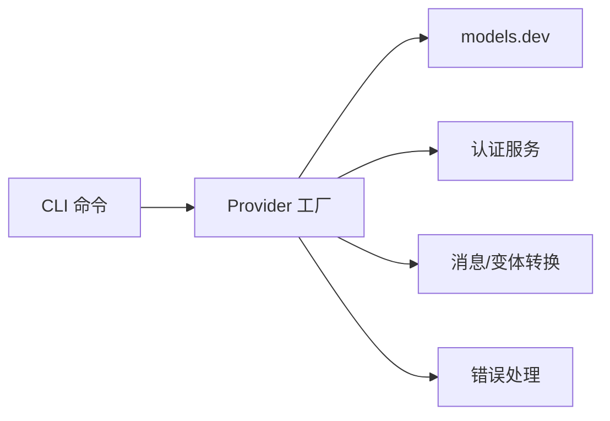

# 自定义提供商集成

<cite>
**本文档引用的文件**
- [packages/opencode/src/provider/provider.ts](file://packages/opencode/src/provider/provider.ts)
- [packages/opencode/src/provider/auth.ts](file://packages/opencode/src/provider/auth.ts)
- [packages/opencode/src/provider/auth-service.ts](file://packages/opencode/src/provider/auth-service.ts)
- [packages/opencode/src/provider/models.ts](file://packages/opencode/src/provider/models.ts)
- [packages/opencode/src/provider/schema.ts](file://packages/opencode/src/provider/schema.ts)
- [packages/opencode/src/provider/error.ts](file://packages/opencode/src/provider/error.ts)
- [packages/opencode/src/provider/transform.ts](file://packages/opencode/src/provider/transform.ts)
- [packages/opencode/src/cli/cmd/providers.ts](file://packages/opencode/src/cli/cmd/providers.ts)
- [packages/opencode/src/cli/cmd/models.ts](file://packages/opencode/src/cli/cmd/models.ts)
- [packages/opencode/test/provider/provider.test.ts](file://packages/opencode/test/provider/provider.test.ts)
- [packages/opencode/test/session/llm.test.ts](file://packages/opencode/test/session/llm.test.ts)
- [packages/web/src/content/docs/providers.mdx](file://packages/web/src/content/docs/providers.mdx)
</cite>

## 目录
1. [简介](#简介)
2. [项目结构](#项目结构)
3. [核心组件](#核心组件)
4. [架构总览](#架构总览)
5. [详细组件分析](#详细组件分析)
6. [依赖关系分析](#依赖关系分析)
7. [性能考虑](#性能考虑)
8. [故障排除指南](#故障排除指南)
9. [结论](#结论)
10. [附录](#附录)

## 简介
本指南面向希望在系统中集成自定义AI模型提供商的开发者，涵盖提供商接口实现、认证处理与请求响应格式、工厂模式与注册机制、动态加载流程、测试策略、兼容性验证、文档编写要求、最佳实践、常见陷阱与调试技巧，以及社区贡献与发布流程。

## 项目结构
围绕提供商集成的核心模块位于 `packages/opencode/src/provider/` 目录，主要职责如下：
- provider.ts：提供商工厂、模型解析、SDK动态加载、环境变量与配置合并、模型变体与选项管理
- auth.ts / auth-service.ts：认证服务抽象与OAuth/API Key流程封装
- models.ts：models.dev 模型数据库快照、刷新与缓存
- schema.ts：ProviderID/ModelID 类型安全封装
- error.ts：错误解析与流式错误分类
- transform.ts：消息转换、模态过滤、推理变体映射、默认参数适配
- CLI命令：providers/models 命令行工具，支持登录、列出、刷新模型列表
- 测试：覆盖配置合并、环境变量优先级、禁用/启用列表、白名单/黑名单、变体继承等场景

**图表来源**
- [packages/opencode/src/provider/provider.ts:1148-1544](file://packages/opencode/src/provider/provider.ts#L1148-L1544)
- [packages/opencode/src/provider/models.ts:101-133](file://packages/opencode/src/provider/models.ts#L101-L133)
- [packages/opencode/src/provider/auth.ts:17-57](file://packages/opencode/src/provider/auth.ts#L17-L57)
- [packages/opencode/src/provider/auth-service.ts:75-169](file://packages/opencode/src/provider/auth-service.ts#L75-L169)
- [packages/opencode/src/cli/cmd/providers.ts:195-476](file://packages/opencode/src/cli/cmd/providers.ts#L195-L476)
- [packages/opencode/src/cli/cmd/models.ts:1-41](file://packages/opencode/src/cli/cmd/models.ts#L1-L41)

**章节来源**
- [packages/opencode/src/provider/provider.ts:1148-1544](file://packages/opencode/src/provider/provider.ts#L1148-L1544)
- [packages/opencode/src/provider/models.ts:101-133](file://packages/opencode/src/provider/models.ts#L101-L133)
- [packages/opencode/src/provider/auth.ts:17-57](file://packages/opencode/src/provider/auth.ts#L17-L57)
- [packages/opencode/src/provider/auth-service.ts:75-169](file://packages/opencode/src/provider/auth-service.ts#L75-L169)
- [packages/opencode/src/cli/cmd/providers.ts:195-476](file://packages/opencode/src/cli/cmd/providers.ts#L195-L476)
- [packages/opencode/src/cli/cmd/models.ts:1-41](file://packages/opencode/src/cli/cmd/models.ts#L1-L41)

## 核心组件
- 提供商工厂与SDK加载
  - 内置提供商映射与动态加载：通过 `BUNDLED_PROVIDERS` 映射 npm 包到创建函数；若未内置则动态安装并导入
  - SDK实例缓存：基于 providerID/npm/options 的哈希缓存，避免重复初始化
  - 自定义加载器：针对特定提供商（如 anthropic、openai、azure、amazon-bedrock 等）注入 headers、模型选择逻辑、变量替换
- 模型数据库与配置合并
  - models.dev 快照/远程获取与定时刷新
  - 配置优先级：环境变量 > 已保存凭证 > 插件注入 > models.dev 默认
  - 支持禁用/启用列表、白名单/黑名单、模型别名与变体继承
- 认证与授权
  - 统一认证服务：支持 OAuth 与 API Key 两种方式
  - 插件化认证：通过插件钩子暴露 providerID、方法列表、提示与回调
- 错误处理与流式解析
  - 上下文溢出检测、状态码映射、HTML错误页友好提示
  - SSE分块超时包装、超时控制与取消信号组合
- 消息与变体转换
  - 不同提供商的消息规范适配（空内容过滤、工具调用ID规范化）
  - 推理变体映射（reasoningEffort/thinkingConfig 等）按模型与SDK包自动映射

**章节来源**
- [packages/opencode/src/provider/provider.ts:109-132](file://packages/opencode/src/provider/provider.ts#L109-L132)
- [packages/opencode/src/provider/provider.ts:147-671](file://packages/opencode/src/provider/provider.ts#L147-L671)
- [packages/opencode/src/provider/provider.ts:855-1146](file://packages/opencode/src/provider/provider.ts#L855-L1146)
- [packages/opencode/src/provider/models.ts:88-133](file://packages/opencode/src/provider/models.ts#L88-L133)
- [packages/opencode/src/provider/auth-service.ts:75-169](file://packages/opencode/src/provider/auth-service.ts#L75-L169)
- [packages/opencode/src/provider/error.ts:6-192](file://packages/opencode/src/provider/error.ts#L6-L192)
- [packages/opencode/src/provider/transform.ts:20-290](file://packages/opencode/src/provider/transform.ts#L20-L290)

## 架构总览
下图展示了从配置/环境到SDK实例与模型选择的整体流程：

**图表来源**
- [packages/opencode/src/cli/cmd/providers.ts:250-476](file://packages/opencode/src/cli/cmd/providers.ts#L250-L476)
- [packages/opencode/src/provider/provider.ts:855-1146](file://packages/opencode/src/provider/provider.ts#L855-L1146)
- [packages/opencode/src/provider/models.ts:101-133](file://packages/opencode/src/provider/models.ts#L101-L133)
- [packages/opencode/src/provider/auth-service.ts:75-169](file://packages/opencode/src/provider/auth-service.ts#L75-L169)

## 详细组件分析

### 提供商工厂与动态加载
- 工厂模式与注册机制
  - 内置提供商映射：通过 `BUNDLED_PROVIDERS` 将 npm 包名映射到创建函数
  - 自定义加载器：通过 `CUSTOM_LOADERS` 注册特定提供商的选项、模型选择逻辑与变量注入
  - 插件注入：扫描插件导出的认证与加载器，按 providerID 合并配置
- 动态加载流程
  - SDK缓存键：基于 providerID/npm/options 哈希，避免重复初始化
  - 变量替换：支持 `${VAR}` 与 `{env:VAR}` 占位符解析
  - 自定义fetch封装：统一超时、SSE分块超时、AbortController组合
- 模型选择与变体
  - 模型能力与变体映射：根据 npm 包与模型ID自动映射推理变体
  - 变体继承：支持从 models.dev 与配置中继承并合并变体

**图表来源**
- [packages/opencode/src/provider/provider.ts:855-1146](file://packages/opencode/src/provider/provider.ts#L855-L1146)
- [packages/opencode/src/provider/provider.ts:1223-1354](file://packages/opencode/src/provider/provider.ts#L1223-L1354)
- [packages/opencode/src/provider/transform.ts:332-712](file://packages/opencode/src/provider/transform.ts#L332-L712)

**章节来源**
- [packages/opencode/src/provider/provider.ts:109-132](file://packages/opencode/src/provider/provider.ts#L109-L132)
- [packages/opencode/src/provider/provider.ts:147-671](file://packages/opencode/src/provider/provider.ts#L147-L671)
- [packages/opencode/src/provider/provider.ts:855-1146](file://packages/opencode/src/provider/provider.ts#L855-L1146)
- [packages/opencode/src/provider/provider.ts:1223-1354](file://packages/opencode/src/provider/provider.ts#L1223-L1354)
- [packages/opencode/src/provider/transform.ts:332-712](file://packages/opencode/src/provider/transform.ts#L332-L712)

### 认证处理与授权流程
- 认证服务
  - 方法枚举：每个提供商支持的方法（OAuth/API Key）
  - OAuth流程：启动授权、等待回调、保存刷新令牌或API Key
  - API Key直连：直接保存API Key
- 插件化认证
  - 插件暴露 providerID、方法列表、提示与回调
  - CLI层自动识别并调用插件认证

**图表来源**
- [packages/opencode/src/provider/auth.ts:17-57](file://packages/opencode/src/provider/auth.ts#L17-L57)
- [packages/opencode/src/provider/auth-service.ts:75-169](file://packages/opencode/src/provider/auth-service.ts#L75-L169)
- [packages/opencode/src/cli/cmd/providers.ts:19-166](file://packages/opencode/src/cli/cmd/providers.ts#L19-L166)

**章节来源**
- [packages/opencode/src/provider/auth.ts:17-57](file://packages/opencode/src/provider/auth.ts#L17-L57)
- [packages/opencode/src/provider/auth-service.ts:75-169](file://packages/opencode/src/provider/auth-service.ts#L75-L169)
- [packages/opencode/src/cli/cmd/providers.ts:19-166](file://packages/opencode/src/cli/cmd/providers.ts#L19-L166)

### 请求响应格式与错误处理
- SSE分块超时与包装
  - 对 text/event-stream 响应进行分块读取与超时控制
  - 组合自定义fetch与超时信号，确保及时取消
- 错误解析
  - 上下文溢出检测：正则匹配与状态码判断
  - HTML错误页友好提示：对网关/代理返回的HTML进行人性化解读
  - 流式错误分类：将错误映射为上下文溢出或API错误两类

**图表来源**
- [packages/opencode/src/provider/provider.ts:61-107](file://packages/opencode/src/provider/provider.ts#L61-L107)
- [packages/opencode/src/provider/error.ts:168-190](file://packages/opencode/src/provider/error.ts#L168-L190)

**章节来源**
- [packages/opencode/src/provider/provider.ts:61-107](file://packages/opencode/src/provider/provider.ts#L61-L107)
- [packages/opencode/src/provider/error.ts:6-192](file://packages/opencode/src/provider/error.ts#L6-L192)

### 模型发现与CLI交互
- 模型发现
  - 支持传入 baseURL/apiKey/headers，自动拼接 /models 并解析返回数据
  - 兼容多种响应结构（数组、data 字段、models 字段）
- CLI命令
  - providers/login：支持插件认证、OAuth自动/手动、API Key直连
  - providers/list/logout：列出/移除凭证
  - models：列出模型、刷新缓存

**图表来源**
- [packages/opencode/src/cli/cmd/models.ts:1-41](file://packages/opencode/src/cli/cmd/models.ts#L1-L41)
- [packages/opencode/src/provider/provider.ts:1148-1221](file://packages/opencode/src/provider/provider.ts#L1148-L1221)
- [packages/opencode/src/provider/models.ts:106-121](file://packages/opencode/src/provider/models.ts#L106-L121)

**章节来源**
- [packages/opencode/src/cli/cmd/models.ts:1-41](file://packages/opencode/src/cli/cmd/models.ts#L1-L41)
- [packages/opencode/src/provider/provider.ts:1152-1221](file://packages/opencode/src/provider/provider.ts#L1152-L1221)
- [packages/opencode/src/provider/models.ts:106-121](file://packages/opencode/src/provider/models.ts#L106-L121)

## 依赖关系分析
- 组件耦合
  - provider.ts 依赖 models.ts（模型数据库）、auth-service.ts（凭证）、schema.ts（类型）、transform.ts（消息/变体）
  - CLI 命令依赖 provider.ts 与 auth-service.ts
- 外部依赖
  - AI SDK 生态（@ai-sdk/*、@openrouter/ai-sdk-provider 等）
  - 插件系统（通过 Plugin.list() 注入认证与加载器）

**图表来源**
- [packages/opencode/src/provider/provider.ts:1-48](file://packages/opencode/src/provider/provider.ts#L1-L48)
- [packages/opencode/src/cli/cmd/providers.ts:1-16](file://packages/opencode/src/cli/cmd/providers.ts#L1-L16)

**章节来源**
- [packages/opencode/src/provider/provider.ts:1-48](file://packages/opencode/src/provider/provider.ts#L1-L48)
- [packages/opencode/src/cli/cmd/providers.ts:1-16](file://packages/opencode/src/cli/cmd/providers.ts#L1-L16)

## 性能考虑
- SDK实例缓存：避免重复初始化，显著降低冷启动开销
- SSE分块超时：防止长时间无数据导致的阻塞
- fetch封装：统一超时与信号组合，减少重复逻辑
- 模型变体预计算：在初始化阶段完成变体映射，运行时直接使用

[本节为通用指导，无需具体文件分析]

## 故障排除指南
- 上下文溢出
  - 现象：出现“输入超出上下文窗口”类错误
  - 处理：检查模型限制、消息长度、是否启用推理变体
- 认证失败
  - 现象：401/403 或网关/代理返回HTML
  - 处理：重新运行 `opencode auth login`，确认令牌有效
- SSE超时
  - 现象：长时间无数据返回
  - 处理：调整 chunkTimeout 或整体超时设置
- 模型不可用
  - 现象：NoSuchModelError 或模型被禁用/黑名单
  - 处理：检查 enabled_providers/disabled_providers/blacklist/whitelist 配置

**章节来源**
- [packages/opencode/src/provider/error.ts:168-190](file://packages/opencode/src/provider/error.ts#L168-L190)
- [packages/opencode/src/provider/provider.ts:61-107](file://packages/opencode/src/provider/provider.ts#L61-L107)
- [packages/opencode/src/provider/provider.ts:1389-1404](file://packages/opencode/src/provider/provider.ts#L1389-L1404)

## 结论
通过工厂模式与动态加载机制，系统实现了对多提供商的统一接入与扩展。结合认证服务、模型数据库与消息转换层，开发者可以以最小成本集成新提供商，并获得一致的体验与可观测性。建议遵循本文档的最佳实践与测试策略，在发布前完成兼容性验证与文档完善。

[本节为总结，无需具体文件分析]

## 附录

### 集成新提供商的步骤
- 定义提供商ID与环境变量
  - 在配置中声明 provider.id 与 env 数组
  - 若需OAuth，确保插件暴露认证钩子
- 实现自定义加载器
  - 在 CUSTOM_LOADERS 中注册提供商的 options/getModel/vars
  - 处理API Key、baseURL、headers、模型选择逻辑
- 配置模型与变体
  - 在 models.dev 或本地配置中声明模型能力与变体
  - 如需继承，参考 fromModelsDevModel 与 ProviderTransform.variants
- 编写测试
  - 使用 provider.test.ts 中的断言模式验证配置合并、禁用/启用、白名单/黑名单
  - 使用 llm.test.ts 的事件流构造器模拟SSE响应
- 文档与CLI
  - 更新 providers.mdx 文档，提供连接与模型选择指引
  - CLI 中补充 providers/login 与 models 命令的交互说明

**章节来源**
- [packages/opencode/src/provider/provider.ts:147-671](file://packages/opencode/src/provider/provider.ts#L147-L671)
- [packages/opencode/src/provider/provider.ts:777-842](file://packages/opencode/src/provider/provider.ts#L777-L842)
- [packages/opencode/src/provider/transform.ts:332-712](file://packages/opencode/src/provider/transform.ts#L332-L712)
- [packages/opencode/test/provider/provider.test.ts:1-200](file://packages/opencode/test/provider/provider.test.ts#L1-L200)
- [packages/opencode/test/session/llm.test.ts:189-224](file://packages/opencode/test/session/llm.test.ts#L189-L224)
- [packages/web/src/content/docs/providers.mdx:653-715](file://packages/web/src/content/docs/providers.mdx#L653-L715)

### 测试策略与兼容性验证
- 配置合并与优先级
  - 验证环境变量、配置文件、插件注入的合并顺序与覆盖规则
- 禁用/启用与黑白名单
  - 确认 enabled_providers/disabled_providers/blacklist/whitelist 生效
- 变体继承与自定义模型
  - 验证自定义模型继承 models.dev 的 npm/baseURL 与变体
- SSE与错误处理
  - 使用事件流构造器模拟不同响应，验证超时与错误分类

**章节来源**
- [packages/opencode/test/provider/provider.test.ts:10-200](file://packages/opencode/test/provider/provider.test.ts#L10-L200)
- [packages/opencode/test/session/llm.test.ts:189-224](file://packages/opencode/test/session/llm.test.ts#L189-L224)

### 最佳实践与常见陷阱
- 最佳实践
  - 明确提供商ID命名规范，避免与内置ID冲突
  - 优先使用插件化认证，减少重复实现
  - 在 CUSTOM_LOADERS 中集中处理 headers/baseURL/模型选择
  - 为新模型提供合理的默认变体与能力描述
- 常见陷阱
  - 忘记设置 chunkTimeout 导致长时间无响应
  - 混淆 providerID 与模型ID，导致 NoSuchModelError
  - 忽略 models.dev 的 status/deprecated 字段，导致模型不可用
  - 在 openai 兼容API中未正确设置 store=false，影响追踪

**章节来源**
- [packages/opencode/src/provider/provider.ts:1223-1354](file://packages/opencode/src/provider/provider.ts#L1223-L1354)
- [packages/opencode/src/provider/provider.ts:1389-1404](file://packages/opencode/src/provider/provider.ts#L1389-L1404)
- [packages/opencode/src/provider/transform.ts:714-800](file://packages/opencode/src/provider/transform.ts#L714-L800)

### 调试技巧
- 使用 CLI 查看当前凭证与环境变量
  - opencode providers list
  - opencode providers login --provider <id>
- 手动触发 models.dev 刷新
  - opencode models --refresh
- 检查SDK实例缓存与变量替换
  - 在 getSDK 中观察 baseURL 与 headers 的最终值
- 观察错误分类
  - 使用 ProviderError.parseAPICallError 与 parseStreamError 分析上下文溢出与API错误

**章节来源**
- [packages/opencode/src/cli/cmd/providers.ts:204-248](file://packages/opencode/src/cli/cmd/providers.ts#L204-L248)
- [packages/opencode/src/cli/cmd/models.ts:29-41](file://packages/opencode/src/cli/cmd/models.ts#L29-L41)
- [packages/opencode/src/provider/error.ts:168-190](file://packages/opencode/src/provider/error.ts#L168-L190)

### 社区贡献与发布流程
- 贡献流程
  - Fork 仓库，创建功能分支，提交 PR
  - 补充单元测试与集成测试，更新文档
- 发布流程
  - 更新版本号与变更日志
  - 运行脚本进行格式化、构建与发布

[本节为通用指导，无需具体文件分析]