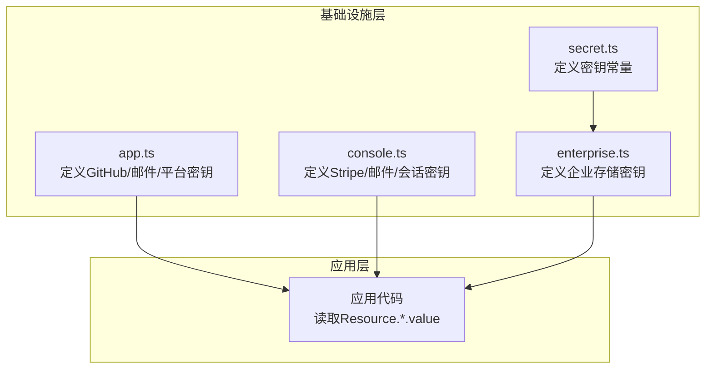
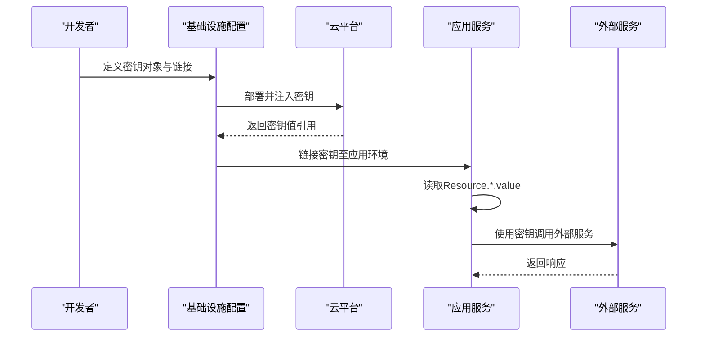
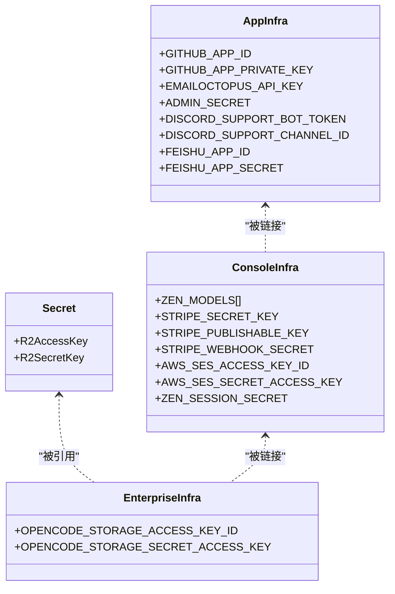
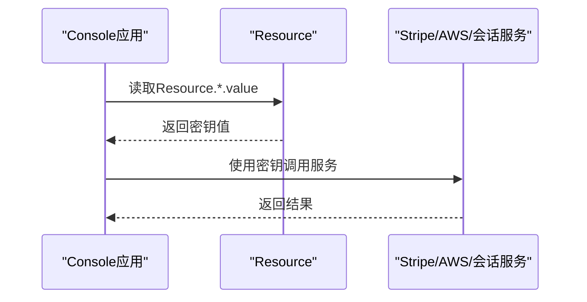
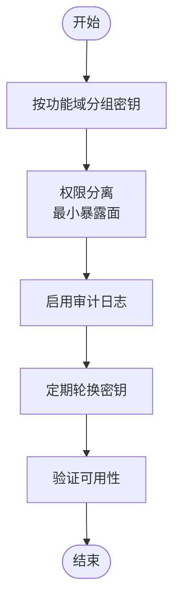
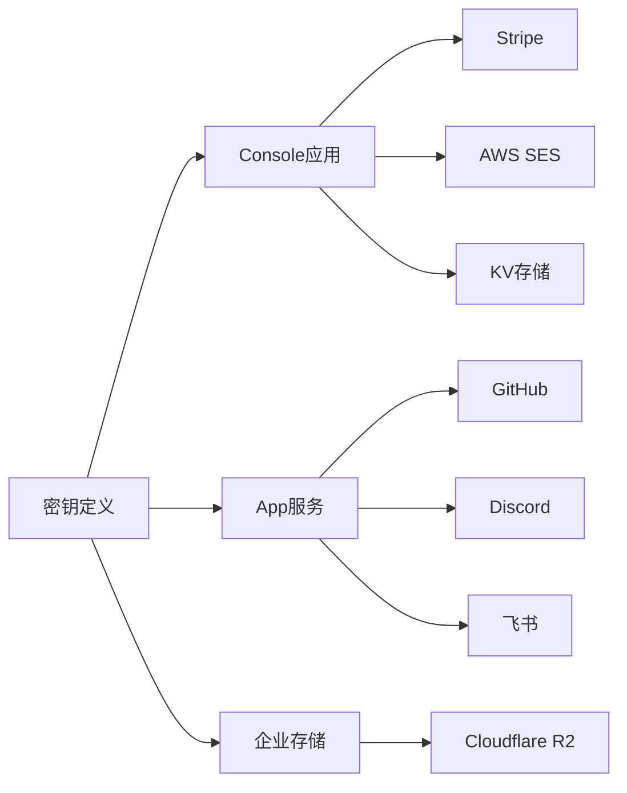

# 认证与密钥管理

<cite>
**本文档引用的文件**
- [SECURITY.md](file://SECURITY.md)
- [infra/secret.ts](file://infra/secret.ts)
- [infra/app.ts](file://infra/app.ts)
- [infra/console.ts](file://infra/console.ts)
- [infra/enterprise.ts](file://infra/enterprise.ts)
- [packages/console/app/src/context/auth.ts](file://packages/console/app/src/context/auth.ts)
- [packages/console/app/src/routes/stripe/webhook.ts](file://packages/console/app/src/routes/stripe/webhook.ts)
- [packages/console/core/src/aws.ts](file://packages/console/core/src/aws.ts)
- [packages/console/core/src/billing.ts](file://packages/console/core/src/billing.ts)
- [packages/console/app/src/config.ts](file://packages/console/app/src/config.ts)
- [.opencode/opencode.jsonc](file://.opencode/.opencode.jsonc)
</cite>

## 目录
1. [简介](#简介)
2. [项目结构](#项目结构)
3. [核心组件](#核心组件)
4. [架构总览](#架构总览)
5. [详细组件分析](#详细组件分析)
6. [依赖关系分析](#依赖关系分析)
7. [性能考虑](#性能考虑)
8. [故障排除指南](#故障排除指南)
9. [结论](#结论)
10. [附录](#附录)

## 简介
本指南聚焦于模型提供商认证与密钥管理，覆盖API密钥的获取、存储、轮换与安全使用流程；解释安全存储机制、加密方法与访问控制策略；提供多提供商密钥管理的最佳实践（密钥分组、权限分离、审计日志）；说明环境变量配置、配置文件加密与安全传输方法；并给出密钥泄露应急响应与恢复流程。  
本项目通过基础设施即代码（Infrastructure as Code）在部署层统一管理敏感密钥，并在应用层以受控方式读取与使用。

## 项目结构
本项目的密钥与认证相关逻辑主要分布在以下位置：
- 基础设施层：集中定义与链接密钥，确保密钥不直接出现在源码中
- 应用层：按需读取密钥，执行业务逻辑（如鉴权、支付、邮件等）
- 安全策略：通过安全文档明确威胁模型与报告流程

图表来源
- [infra/secret.ts:1-5](file://infra/secret.ts#L1-L5)
- [infra/app.ts:1-69](file://infra/app.ts#L1-L69)
- [infra/console.ts:1-252](file://infra/console.ts#L1-L252)
- [infra/enterprise.ts:1-18](file://infra/enterprise.ts#L1-L18)

章节来源
- [infra/secret.ts:1-5](file://infra/secret.ts#L1-L5)
- [infra/app.ts:1-69](file://infra/app.ts#L1-L69)
- [infra/console.ts:1-252](file://infra/console.ts#L1-L252)
- [infra/enterprise.ts:1-18](file://infra/enterprise.ts#L1-L18)

## 核心组件
- 密钥定义与集中管理
  - 在基础设施文件中使用受管密钥对象进行声明，避免硬编码到源码或配置文件
  - 示例路径：[infra/secret.ts:1-5](file://infra/secret.ts#L1-L5)、[infra/app.ts:3-10](file://infra/app.ts#L3-L10)、[infra/console.ts:152-183](file://infra/console.ts#L152-L183)、[infra/enterprise.ts:12-14](file://infra/enterprise.ts#L12-L14)
- 应用侧读取与使用
  - 应用通过资源值读取密钥，仅在运行时可见，降低泄露风险
  - 示例路径：[packages/console/app/src/context/auth.ts](file://packages/console/app/src/context/auth.ts#L29)、[packages/console/app/src/routes/stripe/webhook.ts](file://packages/console/app/src/routes/stripe/webhook.ts#L15)、[packages/console/core/src/aws.ts](file://packages/console/core/src/aws.ts#L12)、[packages/console/core/src/billing.ts](file://packages/console/core/src/billing.ts#L21)
- 安全策略与报告
  - 明确威胁模型、服务器访问控制、数据处理边界与漏洞上报流程
  - 示例路径：[SECURITY.md:9-47](file://SECURITY.md#L9-L47)

章节来源
- [infra/secret.ts:1-5](file://infra/secret.ts#L1-L5)
- [infra/app.ts:3-10](file://infra/app.ts#L3-L10)
- [infra/console.ts:152-183](file://infra/console.ts#L152-L183)
- [infra/enterprise.ts:12-14](file://infra/enterprise.ts#L12-L14)
- [packages/console/app/src/context/auth.ts:29](file://packages/console/app/src/context/auth.ts#L29)
- [packages/console/app/src/routes/stripe/webhook.ts:15](file://packages/console/app/src/routes/stripe/webhook.ts#L15)
- [packages/console/core/src/aws.ts:12](file://packages/console/core/src/aws.ts#L12)
- [packages/console/core/src/billing.ts:21](file://packages/console/core/src/billing.ts#L21)
- [SECURITY.md:9-47](file://SECURITY.md#L9-L47)

## 架构总览
下图展示密钥从基础设施定义到应用使用的端到端流程，以及与外部服务（支付、邮件、存储）的交互。

图表来源
- [infra/app.ts:20-29](file://infra/app.ts#L20-L29)
- [infra/console.ts:212-234](file://infra/console.ts#L212-L234)
- [infra/enterprise.ts:10-17](file://infra/enterprise.ts#L10-L17)
- [packages/console/app/src/context/auth.ts:29](file://packages/console/app/src/context/auth.ts#L29)
- [packages/console/app/src/routes/stripe/webhook.ts:15](file://packages/console/app/src/routes/stripe/webhook.ts#L15)
- [packages/console/core/src/aws.ts:12](file://packages/console/core/src/aws.ts#L12)
- [packages/console/core/src/billing.ts:21](file://packages/console/core/src/billing.ts#L21)

## 详细组件分析

### 组件A：密钥定义与集中管理
- 设计要点
  - 将所有密钥集中定义在基础设施层，避免散落于应用代码或配置文件
  - 使用受管密钥对象，确保密钥值仅在运行时可访问
- 关键实现路径
  - [infra/secret.ts:1-5](file://infra/secret.ts#L1-L5)：企业存储密钥常量
  - [infra/app.ts:3-10](file://infra/app.ts#L3-L10)：第三方平台与邮件密钥
  - [infra/console.ts:152-183](file://infra/console.ts#L152-L183)：多模型提供商密钥数组
  - [infra/console.ts:184-191](file://infra/console.ts#L184-L191)：支付与会话密钥
  - [infra/enterprise.ts:12-14](file://infra/enterprise.ts#L12-L14)：企业存储密钥注入

图表来源
- [infra/secret.ts:1-5](file://infra/secret.ts#L1-L5)
- [infra/app.ts:3-10](file://infra/app.ts#L3-L10)
- [infra/console.ts:152-191](file://infra/console.ts#L152-L191)
- [infra/enterprise.ts:12-14](file://infra/enterprise.ts#L12-L14)

章节来源
- [infra/secret.ts:1-5](file://infra/secret.ts#L1-L5)
- [infra/app.ts:3-10](file://infra/app.ts#L3-L10)
- [infra/console.ts:152-191](file://infra/console.ts#L152-L191)
- [infra/enterprise.ts:12-14](file://infra/enterprise.ts#L12-L14)

### 组件B：应用侧密钥读取与使用
- 设计要点
  - 应用仅在需要时读取密钥，避免长期驻留内存
  - 对外接口（如Webhook、鉴权）使用专用密钥，降低影响面
- 关键实现路径
  - [packages/console/app/src/context/auth.ts:29](file://packages/console/app/src/context/auth.ts#L29)：会话密钥读取
  - [packages/console/app/src/routes/stripe/webhook.ts:15](file://packages/console/app/src/routes/stripe/webhook.ts#L15)：支付Webhook密钥读取
  - [packages/console/core/src/aws.ts:12](file://packages/console/core/src/aws.ts#L12)：邮件服务密钥读取
  - [packages/console/core/src/billing.ts:21](file://packages/console/core/src/billing.ts#L21)：支付密钥初始化

图表来源
- [packages/console/app/src/context/auth.ts:29](file://packages/console/app/src/context/auth.ts#L29)
- [packages/console/app/src/routes/stripe/webhook.ts:15](file://packages/console/app/src/routes/stripe/webhook.ts#L15)
- [packages/console/core/src/aws.ts:12](file://packages/console/core/src/aws.ts#L12)
- [packages/console/core/src/billing.ts:21](file://packages/console/core/src/billing.ts#L21)

章节来源
- [packages/console/app/src/context/auth.ts:29](file://packages/console/app/src/context/auth.ts#L29)
- [packages/console/app/src/routes/stripe/webhook.ts:15](file://packages/console/app/src/routes/stripe/webhook.ts#L15)
- [packages/console/core/src/aws.ts:12](file://packages/console/core/src/aws.ts#L12)
- [packages/console/core/src/billing.ts:21](file://packages/console/core/src/billing.ts#L21)

### 组件C：多提供商密钥管理最佳实践
- 密钥分组
  - 按功能域分组：鉴权、支付、邮件、存储、第三方平台
  - 多模型提供商密钥采用数组形式集中管理，便于轮换与监控
- 权限分离
  - 不同服务使用独立密钥，最小化泄露影响范围
  - Webhook与常规API使用不同密钥
- 审计日志
  - 利用平台日志能力记录密钥使用事件（如Tail Workers），便于审计
- 关键实现路径
  - [infra/console.ts:152-183](file://infra/console/console.ts#L152-L183)：多模型密钥数组
  - [infra/console.ts:204-207](file://infra/console/console.ts#L204-L207)：日志处理Worker
  - [infra/console.ts:246](file://infra/console/console.ts#L246)：Tail消费者配置

图表来源
- [infra/console.ts:152-183](file://infra/console/console.ts#L152-L183)
- [infra/console.ts:204-207](file://infra/console/console.ts#L204-L207)
- [infra/console.ts:246](file://infra/console/console.ts#L246)

章节来源
- [infra/console.ts:152-183](file://infra/console/console.ts#L152-L183)
- [infra/console.ts:204-207](file://infra/console/console.ts#L204-L207)
- [infra/console.ts:246](file://infra/console/console.ts#L246)

### 组件D：环境变量配置与安全传输
- 环境变量配置
  - 通过基础设施层注入环境变量，避免硬编码
  - 示例：企业存储适配器参数在部署时注入
- 配置文件加密
  - 本地配置文件建议采用加密存储与传输
- 安全传输
  - 使用受信网络与TLS通道，限制明文传输
- 关键实现路径
  - [infra/enterprise.ts:10-17](file://infra/enterprise.ts#L10-L17)：环境变量注入
  - [SECURITY.md:21-23](file://SECURITY.md#L21-L23)：服务器访问控制与传输安全

章节来源
- [infra/enterprise.ts:10-17](file://infra/enterprise.ts#L10-L17)
- [SECURITY.md:21-23](file://SECURITY.md#L21-L23)

### 组件E：密钥泄露应急响应与恢复
- 应急响应
  - 立即轮换受影响的密钥
  - 回收旧密钥，撤销授权
  - 启用审计日志追踪异常行为
- 恢复流程
  - 更新基础设施中的密钥定义
  - 重新部署应用以加载新密钥
  - 验证服务可用性与功能完整性
- 关键实现路径
  - [SECURITY.md:37-47](file://SECURITY.md#L37-L47)：漏洞上报与沟通流程

章节来源
- [SECURITY.md:37-47](file://SECURITY.md#L37-L47)

## 依赖关系分析
- 耦合与内聚
  - 密钥定义与应用使用解耦：基础设施负责密钥生命周期，应用仅读取
  - 外部服务依赖通过受控接口暴露，减少横向扩散
- 外部依赖
  - 支付：Stripe密钥
  - 邮件：AWS SES密钥
  - 存储：R2密钥
  - 平台：GitHub/GitLab/飞书等平台密钥
- 关键实现路径
  - [infra/console.ts:212-234](file://infra/console.ts#L212-L234)：应用链接多个密钥
  - [infra/app.ts:20-29](file://infra/app.ts#L20-L29)：平台密钥链接
  - [infra/enterprise.ts:12-14](file://infra/enterprise.ts#L12-L14)：存储密钥注入

图表来源
- [infra/console.ts:212-234](file://infra/console.ts#L212-L234)
- [infra/app.ts:20-29](file://infra/app.ts#L20-L29)
- [infra/enterprise.ts:12-14](file://infra/enterprise.ts#L12-L14)

章节来源
- [infra/console.ts:212-234](file://infra/console.ts#L212-L234)
- [infra/app.ts:20-29](file://infra/app.ts#L20-L29)
- [infra/enterprise.ts:12-14](file://infra/enterprise.ts#L12-L14)

## 性能考虑
- 密钥读取开销
  - 应用启动时一次性读取，避免频繁IO
- 缓存策略
  - 对于短期有效的令牌或会话密钥，可在进程内缓存以减少重复读取
- 日志与监控
  - 启用Tail与日志聚合，降低排查成本

## 故障排除指南
- 常见问题
  - 密钥未生效：检查基础设施是否正确链接与注入
  - 权限不足：确认密钥所属作用域与权限范围
  - 环境变量缺失：核对部署阶段的环境变量注入
- 关键实现路径
  - [packages/console/app/src/context/auth.ts:29](file://packages/console/app/src/context/auth.ts#L29)：会话密钥读取失败排查
  - [packages/console/app/src/routes/stripe/webhook.ts:15](file://packages/console/app/src/routes/stripe/webhook.ts#L15)：Webhook密钥校验
  - [packages/console/core/src/aws.ts:12](file://packages/console/core/src/aws.ts#L12)：邮件服务密钥校验
  - [packages/console/core/src/billing.ts:21](file://packages/console/core/src/billing.ts#L21)：支付密钥初始化失败

章节来源
- [packages/console/app/src/context/auth.ts:29](file://packages/console/app/src/context/auth.ts#L29)
- [packages/console/app/src/routes/stripe/webhook.ts:15](file://packages/console/app/src/routes/stripe/webhook.ts#L15)
- [packages/console/core/src/aws.ts:12](file://packages/console/core/src/aws.ts#L12)
- [packages/console/core/src/billing.ts:21](file://packages/console/core/src/billing.ts#L21)

## 结论
本项目通过基础设施层集中管理密钥，结合应用层受控读取与最小权限原则，形成完整的密钥生命周期管理体系。配合审计日志与应急响应流程，能够有效降低密钥泄露风险并快速恢复。建议持续优化密钥轮换策略与权限治理，确保系统长期安全稳定运行。

## 附录
- 相关配置参考
  - [packages/console/app/src/config.ts:1-30](file://packages/console/app/src/config.ts#L1-L30)：应用基础配置
  - [.opencode/opencode.jsonc:1-19](file://.opencode/.opencode.jsonc#L1-L19)：本地配置示例

章节来源
- [packages/console/app/src/config.ts:1-30](file://packages/console/app/src/config.ts#L1-L30)
- [.opencode/opencode.jsonc:1-19](file://.opencode/.opencode.jsonc#L1-L19)