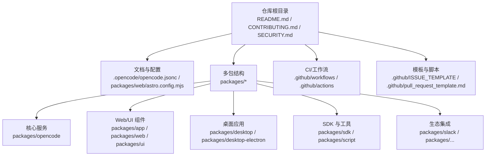
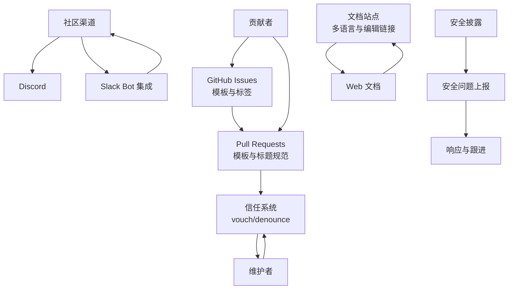
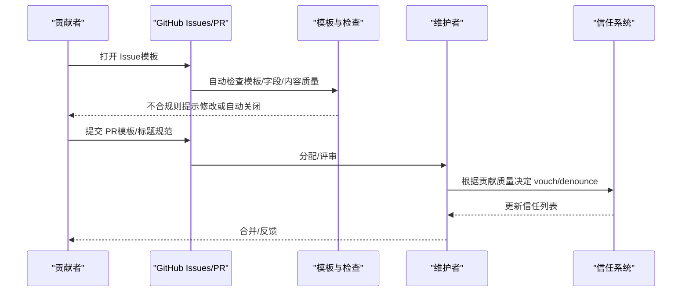
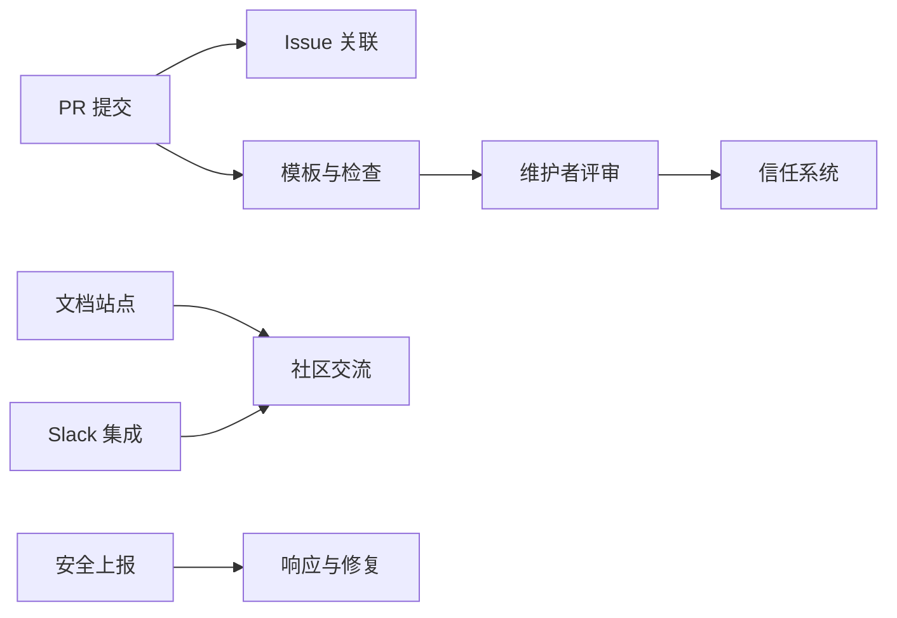

# 社区与贡献

<cite>
**本文引用的文件**
- [CONTRIBUTING.md](file://CONTRIBUTING.md)
- [README.md](file://README.md)
- [.github/pull_request_template.md](file://.github/pull_request_template.md)
- [SECURITY.md](file://SECURITY.md)
- [AGENTS.md](file://AGENTS.md)
- [STATS.md](file://STATS.md)
- [.opencode/opencode.jsonc](file://.opencode/opencode.jsonc)
- [packages/slack/README.md](file://packages/slack/README.md)
- [packages/web/astro.config.mjs](file://packages/web/astro.config.mjs)
</cite>

## 目录
1. [简介](#简介)
2. [项目结构](#项目结构)
3. [核心组件](#核心组件)
4. [架构总览](#架构总览)
5. [详细组件分析](#详细组件分析)
6. [依赖关系分析](#依赖关系分析)
7. [性能考虑](#性能考虑)
8. [故障排查指南](#故障排查指南)
9. [结论](#结论)
10. [附录](#附录)

## 简介
本章节面向希望参与 OpenCode 社区与贡献的开发者，系统性介绍社区生态、交流渠道、学习资料、贡献流程、代码规范与行为准则，并提供问题报告模板、功能请求流程、PR 提交指南、版本发布与里程碑规划、路线图参考、社区活动与成功案例、以及翻译与文档改进等机会与方法。

## 项目结构
OpenCode 是一个以多包（monorepo）形式组织的开源项目，围绕“AI 编码代理”这一核心能力构建，提供终端界面（TUI）、Web 界面、桌面应用、SDK、插件与生态集成（如 Slack）等模块。社区资源主要分布在仓库根目录的贡献文档、安全策略、配置文件与各包内的 README/配置中；交流渠道包括 Discord、GitHub Issues/PR、Slack 集成等。

图表来源
- [README.md:1-142](file://README.md#L1-L142)
- [.opencode/opencode.jsonc:1-19](file://.opencode/opencode.jsonc#L1-L19)
- [packages/web/astro.config.mjs:160-208](file://packages/web/astro.config.mjs#L160-L208)

章节来源
- [README.md:1-142](file://README.md#L1-L142)
- [.opencode/opencode.jsonc:1-19](file://.opencode/opencode.jsonc#L1-L19)
- [packages/web/astro.config.mjs:160-208](file://packages/web/astro.config.mjs#L160-L208)

## 核心组件
- 贡献与行为准则：定义可接受的变更类型、PR 前置要求、Issue 模板、信任与担保机制（vouch/denounce）。
- 开发与调试：本地开发命令、服务器与 Web 应用运行方式、桌面应用打包与调试建议。
- 代码风格与测试：函数拆分、命名、控制流、类型检查、测试策略与类型检查位置。
- 安全披露：明确不接受 AI 自动生成的安全报告、威胁模型、服务器模式安全注意事项、上报流程与升级路径。
- 社区与交流：Discord、GitHub Issues/PR、Slack 集成、文档站点与编辑链接。
- 下载统计与传播：下载量统计文件，反映社区活跃度与传播情况。

章节来源
- [CONTRIBUTING.md:1-312](file://CONTRIBUTING.md#L1-L312)
- [AGENTS.md:1-129](file://AGENTS.md#L1-L129)
- [SECURITY.md:1-48](file://SECURITY.md#L1-L48)
- [README.md:115-142](file://README.md#L115-L142)
- [STATS.md:1-218](file://STATS.md#L1-L218)

## 架构总览
下图展示社区与贡献相关的关键交互点：贡献者通过 Issue/PR 参与，遵循贡献指南与模板；维护者使用 vouch 系统管理信任；Slack 集成提供社区沟通入口；文档站点支持多语言与在线编辑；安全问题通过专用流程处理。

图表来源
- [CONTRIBUTING.md:190-312](file://CONTRIBUTING.md#L190-L312)
- [.github/pull_request_template.md:1-30](file://.github/pull_request_template.md#L1-L30)
- [packages/slack/README.md:1-28](file://packages/slack/README.md#L1-L28)
- [packages/web/astro.config.mjs:160-208](file://packages/web/astro.config.mjs#L160-L208)
- [SECURITY.md:37-48](file://SECURITY.md#L37-L48)

## 详细组件分析

### 社区资源与交流渠道
- 主要交流渠道
  - Discord：官方社区聊天与讨论。
  - GitHub Issues/PR：问题报告、功能请求、代码贡献。
  - Slack 集成：通过 Slack Bot 创建线程化会话，便于社区协作。
- 文档与学习资料
  - 官方文档站点支持多语言导航与在线编辑。
  - README 提供安装、平台与常见问题说明。
- 社区活动与成功案例
  - 仓库未提供专门的活动日历或案例集，但可通过 Issues/PR 与 Discord 了解社区动态与用户实践。

章节来源
- [README.md:115-142](file://README.md#L115-L142)
- [packages/slack/README.md:1-28](file://packages/slack/README.md#L1-L28)
- [packages/web/astro.config.mjs:160-208](file://packages/web/astro.config.mjs#L160-L208)

### 贡献流程与 PR 规范
- Issue 首先策略：所有 PR 必须关联现有 Issue，Issue 必须使用模板，避免空白或 AI 生成长文。
- PR 模板与标题规范：使用约定式提交标题（feat/fix/docs/chore/refactor/test），可选作用域限定到具体包。
- UI 变更：需提供截图或录屏以便快速评审。
- 逻辑变更：需说明验证方法与复现步骤。
- 信任与担保（vouch/denounce）：维护者可对作者或特定用户进行 vouch/denounce/unvouch 操作，Denouncement 仅用于恶意重复贡献等严重情形。

图表来源
- [CONTRIBUTING.md:190-312](file://CONTRIBUTING.md#L190-L312)
- [.github/pull_request_template.md:1-30](file://.github/pull_request_template.md#L1-L30)

章节来源
- [CONTRIBUTING.md:190-312](file://CONTRIBUTING.md#L190-L312)
- [.github/pull_request_template.md:1-30](file://.github/pull_request_template.md#L1-L30)

### 代码规范与行为准则
- 可接受的变更类型：修复、新增 LSP/格式化器、LLM 性能优化、新提供商支持、环境特定问题修复、缺失标准行为、文档改进等。
- UI 或核心产品特性变更需经设计评审。
- 代码风格要点：保持函数内聚、避免 else、优先使用单字母变量名、避免 any 类型、优先使用 Bun API、减少解构、测试真实实现、从包目录运行类型检查。
- 测试与类型检查：避免 mock，测试实际实现；类型检查在包目录执行。

章节来源
- [CONTRIBUTING.md:3-25](file://CONTRIBUTING.md#L3-L25)
- [AGENTS.md:7-129](file://AGENTS.md#L7-L129)

### 问题报告模板与功能请求流程
- 问题模板：必须使用 Issue 模板（Bug 报告、功能请求、提问），禁止空白 Issue。
- 功能请求：先发起设计讨论，描述问题、建议方案与为何适合 OpenCode，等待核心团队评估后再推进。
- 评审与关闭：若不符合模板或内容质量，将在时限内提示修改，否则自动关闭。

章节来源
- [CONTRIBUTING.md:294-312](file://CONTRIBUTING.md#L294-L312)
- [CONTRIBUTING.md:263-266](file://CONTRIBUTING.md#L263-L266)

### 版本发布周期、里程碑规划与路线图
- 发布与工作流：仓库包含发布相关的 GitHub Actions 工作流，表明存在自动化发布流程。
- 里程碑与路线图：仓库未提供公开的里程碑或路线图文件，建议关注 Issues/PR 的标签与讨论，或通过社区渠道（如 Discord）获取最新计划。

章节来源
- [README.md:115-118](file://README.md#L115-L118)

### 社区活动、开发者故事与成功案例
- 仓库未提供专门的活动日历、开发者故事或成功案例集合。
- 建议通过 Issues/PR 的讨论记录、文档站点与社区聊天了解用户实践与最佳实践。

### 翻译贡献、文档改进与社区建设
- 多语言文档：README 提供多语言导航，表明项目重视国际化。
- 在线编辑：文档站点提供编辑链接，便于直接在网页上修改文档。
- 社区建设：通过 Slack 集成、Discord、Issue/PR 讨论等方式参与社区建设。

章节来源
- [README.md:18-40](file://README.md#L18-L40)
- [packages/web/astro.config.mjs:160-208](file://packages/web/astro.config.mjs#L160-L208)
- [packages/slack/README.md:1-28](file://packages/slack/README.md#L1-L28)

## 依赖关系分析
- 贡献与评审依赖：PR 必须关联 Issue，且受模板与标题规范约束；维护者使用 vouch 系统管理信任。
- 文档与社区依赖：文档站点支持多语言与在线编辑，Slack Bot 提供社区沟通入口。
- 安全依赖：安全问题通过专用流程上报，服务器模式需正确配置认证。

图表来源
- [CONTRIBUTING.md:190-312](file://CONTRIBUTING.md#L190-L312)
- [packages/web/astro.config.mjs:160-208](file://packages/web/astro.config.mjs#L160-L208)
- [packages/slack/README.md:1-28](file://packages/slack/README.md#L1-L28)
- [SECURITY.md:37-48](file://SECURITY.md#L37-L48)

章节来源
- [CONTRIBUTING.md:190-312](file://CONTRIBUTING.md#L190-L312)
- [packages/web/astro.config.mjs:160-208](file://packages/web/astro.config.mjs#L160-L208)
- [packages/slack/README.md:1-28](file://packages/slack/README.md#L1-L28)
- [SECURITY.md:37-48](file://SECURITY.md#L37-L48)

## 性能考虑
- 贡献效率：遵循小而聚焦的 PR、提供清晰的验证方法与截图/录屏，有助于快速评审与合并。
- 开发体验：使用提供的调试建议与示例配置，减少断点映射错误与调试成本。
- 文档与沟通：利用在线编辑与模板，降低沟通成本与歧义。

## 故障排查指南
- 安全问题：严禁提交 AI 自动生成的安全报告；按流程通过 GitHub Security Advisory 上报，必要时邮件联系安全团队。
- 服务器模式：启用时设置密码以启用 HTTP Basic Auth，确保访问安全。
- 信任问题：若被 denounce，可通过 Discord 联系维护者申请解除。

章节来源
- [SECURITY.md:1-48](file://SECURITY.md#L1-L48)
- [CONTRIBUTING.md:267-293](file://CONTRIBUTING.md#L267-L293)

## 结论
OpenCode 社区以清晰的贡献流程、模板与信任系统为核心，辅以多语言文档、Slack 集成与 Discord 交流渠道，形成完整的协作生态。建议贡献者遵循 Issue/PR 模板、约定式提交与代码风格，积极参与评审与讨论，共同推动项目演进。

## 附录
- 下载统计：可参考下载量统计文件，了解社区传播与活跃趋势。
- 配置参考：.opencode 配置文件展示了权限与工具开关等配置项，便于理解默认行为与安全边界。

章节来源
- [STATS.md:1-218](file://STATS.md#L1-L218)
- [.opencode/opencode.jsonc:1-19](file://.opencode/opencode.jsonc#L1-L19)