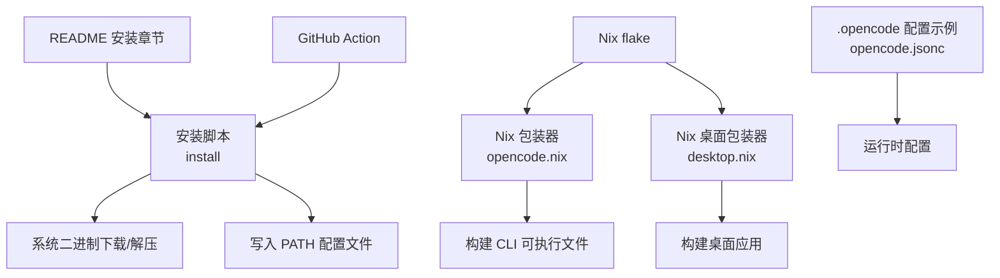
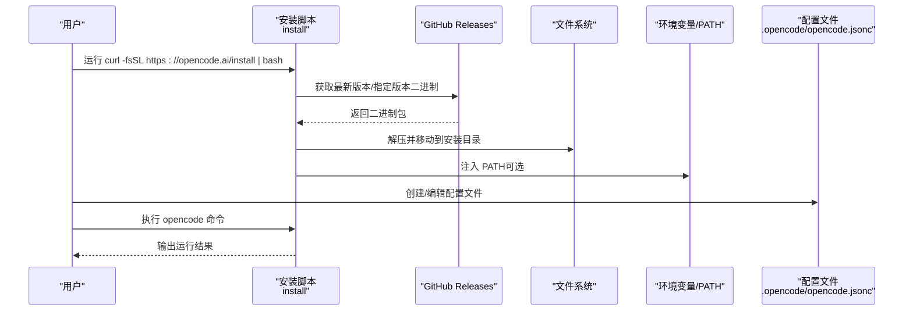
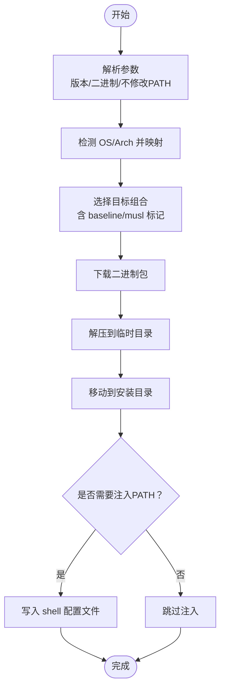
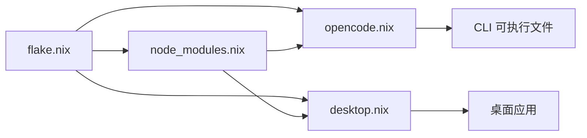
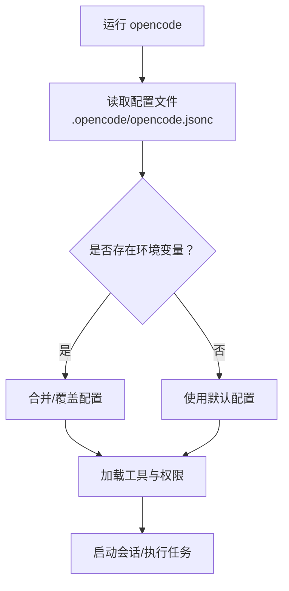
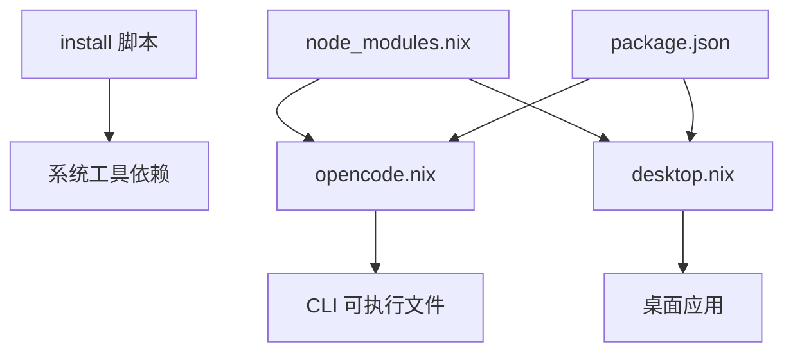

# 安装与配置

<cite>
**本文引用的文件**
- [install 脚本](file://install)
- [README 安装章节](file://README.md)
- [Nix 包装器 opencode.nix](file://nix/opencode.nix)
- [Nix 桌面包装器 desktop.nix](file://nix/desktop.nix)
- [Nix flake](file://flake.nix)
- [Nix node_modules 构建](file://nix/node_modules.nix)
- [.opencode 配置示例](file://.opencode/opencode.jsonc)
- [GitHub Action 工作流片段](file://github/action.yml)
- [包管理器入口 package.json](file://package.json)
</cite>

## 目录
1. [简介](#简介)
2. [项目结构](#项目结构)
3. [核心组件](#核心组件)
4. [架构总览](#架构总览)
5. [详细组件分析](#详细组件分析)
6. [依赖分析](#依赖分析)
7. [性能考虑](#性能考虑)
8. [故障排除指南](#故障排除指南)
9. [结论](#结论)
10. [附录](#附录)

## 简介
本指南面向首次接触 OpenCode 的用户，提供从零开始的安装与配置说明。内容覆盖以下安装方式：
- 在线一键安装脚本（curl）
- 多种包管理器安装（npm、Homebrew、Scoop、Chocolatey、Pacman、Mise、Nix）
- 桌面应用安装（macOS、Windows、Linux）
- 自定义安装路径与安装目录选择逻辑
- 基本配置项与环境变量设置
- 不同操作系统下的安装验证方法
- 常见问题与最佳实践

## 项目结构
OpenCode 仓库中与安装相关的关键位置如下：
- 安装脚本：根目录的 install 文件，支持在线下载二进制或本地二进制安装，并自动注入到 PATH
- 文档与安装说明：根目录 README.md 的“Installation”章节
- Nix 打包：nix 目录下包含 opencode.nix、desktop.nix、flake.nix、node_modules.nix 等，用于在 Nix 生态中构建与安装
- 配置示例：.opencode 目录下的 opencode.jsonc 提供默认配置模板
- GitHub Action：github/action.yml 展示了在 CI 中安装与运行 OpenCode 的流程

图表来源
- [install 脚本](file://install)
- [README 安装章节](file://README.md)
- [Nix 包装器 opencode.nix](file://nix/opencode.nix)
- [Nix 桌面包装器 desktop.nix](file://nix/desktop.nix)
- [Nix flake](file://flake.nix)
- [GitHub Action 工作流片段](file://github/action.yml)
- [.opencode 配置示例](file://.opencode/opencode.jsonc)

章节来源
- [install 脚本](file://install)
- [README 安装章节](file://README.md)
- [Nix 包装器 opencode.nix](file://nix/opencode.nix)
- [Nix 桌面包装器 desktop.nix](file://nix/desktop.nix)
- [Nix flake](file://flake.nix)
- [GitHub Action 工作流片段](file://github/action.yml)
- [.opencode 配置示例](file://.opencode/opencode.jsonc)

## 核心组件
- 在线安装脚本：负责检测平台与架构、选择合适的二进制包、下载与解压、写入 PATH、输出安装结果
- 包管理器入口：通过 package.json 暴露脚本与工作区，便于在不同包管理器生态中使用
- Nix 打包：提供稳定的构建与安装流程，支持 shell 补全与版本检查
- 配置系统：.opencode 目录下的 opencode.jsonc 提供默认配置，支持环境变量与文件占位符替换
- GitHub Action：封装安装、缓存、注入 PATH、运行命令的完整流程

章节来源
- [install 脚本](file://install)
- [README 安装章节](file://README.md)
- [Nix 包装器 opencode.nix](file://nix/opencode.nix)
- [Nix 桌面包装器 desktop.nix](file://nix/desktop.nix)
- [Nix flake](file://flake.nix)
- [GitHub Action 工作流片段](file://github/action.yml)
- [.opencode 配置示例](file://.opencode/opencode.jsonc)

## 架构总览
下图展示了从安装到运行的整体流程，涵盖在线安装脚本、包管理器、Nix、桌面应用以及配置加载。

图表来源
- [install 脚本](file://install)
- [README 安装章节](file://README.md)
- [GitHub Action 工作流片段](file://github/action.yml)
- [.opencode 配置示例](file://.opencode/opencode.jsonc)

## 详细组件分析

### 在线安装脚本（curl 一键安装）
- 功能要点
  - 支持指定版本安装与本地二进制安装
  - 自动识别操作系统与 CPU 架构，必要时附加 baseline 或 musl 后缀
  - 下载进度显示与错误处理
  - 自动注入 PATH 到当前用户的 shell 配置文件（可禁用）
  - 在 CI 环境自动写入 GITHUB_PATH
- 安装目录选择逻辑
  - 优先级：OPENCODE_INSTALL_DIR > XDG_BIN_DIR > $HOME/bin > $HOME/.opencode/bin
  - 默认安装目录为 $HOME/.opencode/bin
- 使用示例
  - 在线安装：curl -fsSL https://opencode.ai/install | bash
  - 指定版本：curl -fsSL https://opencode.ai/install | bash -s -- --version x.y.z
  - 本地二进制：./install --binary /path/to/opencode

图表来源
- [install 脚本](file://install)

章节来源
- [install 脚本](file://install)
- [README 安装章节](file://README.md)

### 包管理器安装
- npm（推荐）：npm i -g opencode-ai@latest（支持 bun/pnpm/yarn）
- Homebrew（macOS/Linux，推荐）：brew install anomalyco/tap/opencode 或 brew install opencode
- Scoop（Windows）：scoop install opencode
- Chocolatey（Windows）：choco install opencode
- Pacman（Arch Linux）：sudo pacman -S opencode；或 paru -S opencode-bin
- Mise：mise use -g opencode
- Nix：nix run nixpkgs#opencode 或 github:anomalyco/opencode

章节来源
- [README 安装章节](file://README.md)
- [包管理器入口 package.json](file://package.json)

### 桌面应用安装（Beta）
- macOS：brew install --cask opencode-desktop
- Windows：scoop bucket add extras; scoop install extras/opencode-desktop
- 其他平台：从发布页下载对应包（DMG、EXE、DEB、RPM、AppImage）

章节来源
- [README 安装章节](file://README.md)

### Nix 安装与开发环境
- 使用 flake 提供的 overlay 与 packages，构建稳定版本的 CLI 与桌面应用
- opencode.nix：构建 CLI 可执行文件，注入模型与版本信息，生成 shell 补全
- desktop.nix：基于 CLI 侧车程序构建桌面应用，按平台链接依赖库
- node_modules.nix：隔离并规范化 node_modules，确保跨平台一致性

图表来源
- [Nix flake](file://flake.nix)
- [Nix 包装器 opencode.nix](file://nix/opencode.nix)
- [Nix 桌面包装器 desktop.nix](file://nix/desktop.nix)
- [Nix node_modules 构建](file://nix/node_modules.nix)

章节来源
- [Nix flake](file://flake.nix)
- [Nix 包装器 opencode.nix](file://nix/opencode.nix)
- [Nix 桌面包装器 desktop.nix](file://nix/desktop.nix)
- [Nix node_modules 构建](file://nix/node_modules.nix)

### 配置系统与环境变量
- 配置文件：.opencode/opencode.jsonc 提供默认配置模板，支持 provider、permission、tools 等字段
- 环境变量：可在运行时通过环境变量覆盖配置，或在 shell 配置文件中导出
- GitHub Action：通过输入参数传递模型、代理、提示词等，自动注入到运行环境中

图表来源
- [.opencode 配置示例](file://.opencode/opencode.jsonc)
- [GitHub Action 工作流片段](file://github/action.yml)

章节来源
- [.opencode 配置示例](file://.opencode/opencode.jsonc)
- [GitHub Action 工作流片段](file://github/action.yml)

## 依赖分析
- 安装脚本对系统工具的依赖：tar（Linux）、unzip（非 Linux）、curl、sed、uname、sysctl（macOS Rosetta 检测）、PowerShell（Windows AVX2 检测）
- Nix 构建链路：通过 node_modules.nix 规范化依赖，再由 opencode.nix/desktop.nix 构建 CLI/桌面应用
- 包管理器入口：package.json 定义工作区与脚本，便于在多生态中统一使用

图表来源
- [install 脚本](file://install)
- [Nix node_modules 构建](file://nix/node_modules.nix)
- [Nix 包装器 opencode.nix](file://nix/opencode.nix)
- [Nix 桌面包装器 desktop.nix](file://nix/desktop.nix)
- [包管理器入口 package.json](file://package.json)

章节来源
- [install 脚本](file://install)
- [Nix node_modules 构建](file://nix/node_modules.nix)
- [Nix 包装器 opencode.nix](file://nix/opencode.nix)
- [Nix 桌面包装器 desktop.nix](file://nix/desktop.nix)
- [包管理器入口 package.json](file://package.json)

## 性能考虑
- 选择合适的目标二进制：脚本会根据 CPU 特性自动选择带 baseline 或 musl 的版本，避免在不支持的硬件上运行
- 缓存与复用：GitHub Action 示例展示了缓存 ~/.opencode/bin 的策略，减少重复下载
- Nix 构建：通过固定哈希与规范化 node_modules，提升构建稳定性与可重复性

章节来源
- [install 脚本](file://install)
- [GitHub Action 工作流片段](file://github/action.yml)
- [Nix node_modules 构建](file://nix/node_modules.nix)

## 故障排除指南
- 安装脚本报错“缺少依赖工具”
  - Linux：确认已安装 tar
  - 非 Linux：确认已安装 unzip
  - 参考：install 脚本中的工具检测与报错逻辑
- 安装后命令不可用
  - 检查 PATH 是否被注入（可使用 --no-modify-path 禁用自动注入）
  - 在 CI 环境中确认 GITHUB_PATH 已追加安装目录
- 版本不匹配或未更新
  - 使用 --version 指定版本安装
  - 在线安装脚本会检查已安装版本并提示
- 权限与兼容性
  - 确认安装目录具有可执行权限
  - 如需自定义安装路径，设置 OPENCODE_INSTALL_DIR 或 XDG_BIN_DIR

章节来源
- [install 脚本](file://install)
- [README 安装章节](file://README.md)
- [GitHub Action 工作流片段](file://github/action.yml)

## 结论
通过本指南，您可以在任意主流平台上完成 OpenCode 的安装与配置。推荐优先使用包管理器或在线安装脚本，以获得最简流程与最新版本。如需更严格的构建与分发控制，可采用 Nix 方案。安装完成后，结合 .opencode 配置示例与环境变量，即可快速开始使用。

## 附录

### 安装目录选择逻辑与自定义路径
- 优先级顺序：OPENCODE_INSTALL_DIR > XDG_BIN_DIR > $HOME/bin > $HOME/.opencode/bin
- 示例：OPENCODE_INSTALL_DIR=/usr/local/bin curl -fsSL https://opencode.ai/install | bash
- 示例：XDG_BIN_DIR=$HOME/.local/bin curl -fsSL https://opencode.ai/install | bash

章节来源
- [README 安装章节](file://README.md)
- [install 脚本](file://install)

### 基本配置建议与最佳实践
- 使用 .opencode/opencode.jsonc 作为持久化配置入口
- 将敏感信息放入独立文件并通过 {file:...} 引用
- 在 CI 中使用 GitHub Action 的输入参数进行一次性配置
- 开发环境建议使用 Nix，确保依赖一致与可复现

章节来源
- [.opencode 配置示例](file://.opencode/opencode.jsonc)
- [GitHub Action 工作流片段](file://github/action.yml)
- [Nix 包装器 opencode.nix](file://nix/opencode.nix)