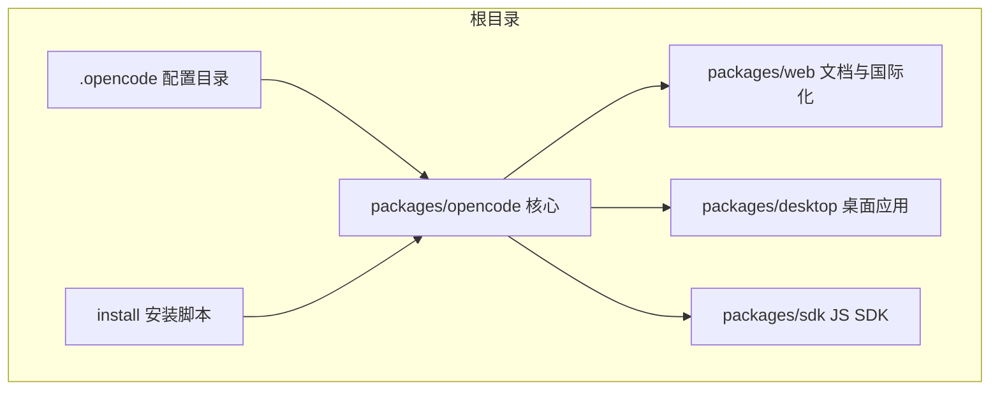
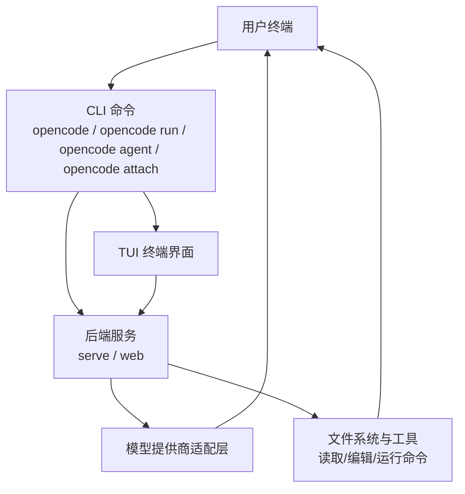
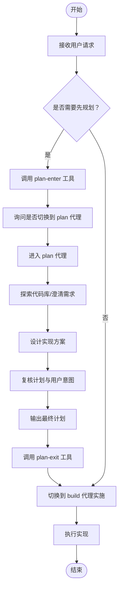
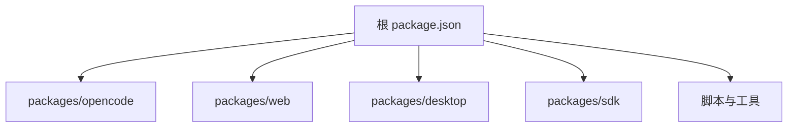

# 快速开始

<cite>
**本文引用的文件**
- [README.md](file://README.md)
- [AGENTS.md](file://AGENTS.md)
- [CONTRIBUTING.md](file://CONTRIBUTING.md)
- [package.json](file://package.json)
- [.opencode/opencode.jsonc](file://.opencode/opencode.jsonc)
- [packages/web/src/content/docs/cli.mdx](file://packages/web/src/content/docs/cli.mdx)
- [packages/web/src/content/docs/commands.mdx](file://packages/web/src/content/docs/commands.mdx)
- [packages/web/src/content/docs/network.mdx](file://packages/web/src/content/docs/network.mdx)
- [install](file://install)
- [packages/opencode/src/tool/plan-enter.txt](file://packages/opencode/src/tool/plan-enter.txt)
- [packages/opencode/src/tool/plan-exit.txt](file://packages/opencode/src/tool/plan-exit.txt)
- [packages/opencode/src/tool/plan.ts](file://packages/opencode/src/tool/plan.ts)
- [packages/opencode/src/session/prompt.ts](file://packages/opencode/src/session/prompt.ts)
</cite>

## 目录
1. [简介](#简介)
2. [项目结构](#项目结构)
3. [核心组件](#核心组件)
4. [架构总览](#架构总览)
5. [详细组件分析](#详细组件分析)
6. [依赖分析](#依赖分析)
7. [性能考虑](#性能考虑)
8. [故障排除指南](#故障排除指南)
9. [结论](#结论)
10. [附录](#附录)

## 简介
OpenCode 是一个开源的 AI 编码助手，提供终端用户界面（TUI）与可编程 CLI，支持两种内置代理：build（默认全权限开发工作）与 plan（只读分析与规划）。它既可作为本地命令行工具直接使用，也可通过服务模式运行并通过 TUI 或其他客户端访问。

- 安装方式多样，支持包管理器、安装脚本与桌面应用
- 默认启动 TUI；也可通过命令行直接运行
- 提供代理切换、代理管理、自定义命令、网络代理与证书配置等能力

章节来源
- [README.md:1-142](file://README.md#L1-L142)

## 项目结构
仓库采用多包（monorepo）组织，核心 CLI 与服务位于 packages/opencode，文档与国际化内容位于 packages/web，另有桌面应用、SDK、插件等模块。.opencode 目录存放用户配置与扩展资源（如代理、命令、主题等）。

图表来源
- [package.json:1-118](file://package.json#L1-L118)
- [install:1-461](file://install#L1-L461)

章节来源
- [package.json:1-118](file://package.json#L1-L118)
- [README.md:46-118](file://README.md#L46-L118)

## 核心组件
- CLI 与命令
  - opencode 命令默认启动 TUI；也支持 run、agent、attach、serve、web 等子命令
  - 可通过 flags 控制会话、模型、端口、主机名等
- 代理（Agents）
  - build：全权限开发代理，可编辑文件、运行 bash 命令
  - plan：只读分析代理，默认拒绝文件编辑，运行 bash 前需授权
  - general：用于复杂搜索与多步任务的子代理
- 自定义命令
  - 在 .opencode/commands 下创建 Markdown 文件即可定义自定义命令
- 网络与代理
  - 支持标准代理环境变量与自定义证书，确保本地 TUI 与服务通信不被代理干扰
- 配置
  - .opencode/opencode.jsonc 提供 provider、权限、工具开关等配置入口

章节来源
- [packages/web/src/content/docs/cli.mdx:1-95](file://packages/web/src/content/docs/cli.mdx#L1-L95)
- [packages/web/src/content/docs/commands.mdx:1-56](file://packages/web/src/content/docs/commands.mdx#L1-L56)
- [packages/web/src/content/docs/network.mdx:1-57](file://packages/web/src/content/docs/network.mdx#L1-L57)
- [.opencode/opencode.jsonc:1-19](file://.opencode/opencode.jsonc#L1-L19)
- [README.md:100-113](file://README.md#L100-L113)

## 架构总览
OpenCode 的典型使用路径包括：安装 → 初始化项目 → 选择代理 → 执行任务 → 切换代理（如需要）→ 查看结果与会话历史。

图表来源
- [packages/web/src/content/docs/cli.mdx:22-85](file://packages/web/src/content/docs/cli.mdx#L22-L85)
- [README.md:100-113](file://README.md#L100-L113)

## 详细组件分析

### CLI 命令与参数
- 默认行为：无参运行启动 TUI
- 子命令：
  - run：直接执行一次对话或任务
  - agent：代理管理（创建、列出等）
  - attach：附加到已运行的服务端
  - serve：启动无头 API 服务
  - web：启动服务并打开 Web 界面
- 关键 flags（部分）：
  - --continue/-c、--session/-s、--fork：会话控制
  - --prompt：指定提示词
  - --model/-m：指定模型（provider/model）
  - --agent：指定代理
  - --port、--hostname：服务监听配置

章节来源
- [packages/web/src/content/docs/cli.mdx:8-95](file://packages/web/src/content/docs/cli.mdx#L8-L95)
- [CONTRIBUTING.md:84-95](file://CONTRIBUTING.md#L84-L95)

### 代理（Agent）与切换
- build 代理：默认全权限，适合实现阶段
- plan 代理：只读分析与规划，适合探索与设计阶段
- 切换策略：
  - 使用 plan-enter 工具建议切换至 plan 代理进行分析
  - 使用 plan-exit 工具在计划完成后切换回 build 代理实施
- 交互流程（概览）

图表来源
- [packages/opencode/src/tool/plan-enter.txt:1-14](file://packages/opencode/src/tool/plan-enter.txt#L1-L14)
- [packages/opencode/src/tool/plan-exit.txt:1-13](file://packages/opencode/src/tool/plan-exit.txt#L1-L13)
- [packages/opencode/src/tool/plan.ts:31-76](file://packages/opencode/src/tool/plan.ts#L31-L76)
- [packages/opencode/src/session/prompt.ts:1406-1452](file://packages/opencode/src/session/prompt.ts#L1406-L1452)

章节来源
- [README.md:100-113](file://README.md#L100-L113)
- [packages/opencode/src/tool/plan-enter.txt:1-14](file://packages/opencode/src/tool/plan-enter.txt#L1-L14)
- [packages/opencode/src/tool/plan-exit.txt:1-13](file://packages/opencode/src/tool/plan-exit.txt#L1-L13)
- [packages/opencode/src/tool/plan.ts:31-76](file://packages/opencode/src/tool/plan.ts#L31-L76)
- [packages/opencode/src/session/prompt.ts:1406-1452](file://packages/opencode/src/session/prompt.ts#L1406-L1452)

### 自定义命令
- 在 .opencode/commands 下创建 Markdown 文件，定义命令描述、目标代理、模型与模板内容
- 通过 /命令名 触发执行
- 也可通过配置文件添加命令

章节来源
- [packages/web/src/content/docs/commands.mdx:16-56](file://packages/web/src/content/docs/commands.mdx#L16-L56)

### 网络与代理配置
- 支持标准代理环境变量（HTTPS_PROXY/HTTP_PROXY/NO_PROXY）
- 本地 TUI 与服务通信必须绕过代理，避免路由环路
- 支持自定义证书（NODE_EXTRA_CA_CERTS）

章节来源
- [packages/web/src/content/docs/network.mdx:10-57](file://packages/web/src/content/docs/network.mdx#L10-L57)

### 安装与首次使用
- 安装方式：curl 安装脚本、包管理器、桌面应用
- 首次使用建议：
  - 在项目目录中运行 opencode 启动 TUI
  - 如需服务模式，使用 opencode web 或 opencode serve
  - 配置代理与证书（如企业网络环境）
  - 创建自定义命令以提升重复性任务效率

章节来源
- [README.md:46-118](file://README.md#L46-L118)
- [install:1-461](file://install#L1-L461)

## 依赖分析
- 包管理与工作区
  - 顶层 package.json 声明工作区与依赖，便于统一构建与类型检查
- 开发与调试
  - CONTRIBUTING.md 提供开发命令与调试建议（如 --inspect、spawn 模式）

图表来源
- [package.json:21-72](file://package.json#L21-L72)

章节来源
- [package.json:1-118](file://package.json#L1-L118)
- [CONTRIBUTING.md:34-95](file://CONTRIBUTING.md#L34-L95)

## 性能考虑
- 优先使用单个代理完成任务，避免不必要的并行开销
- 对于大型项目，先使用 plan 代理探索与设计，再切换到 build 实施
- 在企业网络下正确配置代理与证书，避免额外的失败重试与超时

## 故障排除指南
- 代理无法访问外部模型
  - 检查代理环境变量与 NO_PROXY 是否包含本地地址
  - 确认自定义证书路径设置正确
- 本地 TUI 无法连接服务
  - 确保服务监听在 127.0.0.1 或正确主机名，并在 NO_PROXY 中排除
- 会话与模型切换异常
  - 使用 --session/--continue 管理会话状态
  - 使用 --model 指定正确的 provider/model

章节来源
- [packages/web/src/content/docs/network.mdx:10-57](file://packages/web/src/content/docs/network.mdx#L10-L57)
- [packages/web/src/content/docs/cli.mdx:30-85](file://packages/web/src/content/docs/cli.mdx#L30-L85)

## 结论
通过本快速开始指南，你可以在几分钟内完成安装、启动 TUI、选择合适的代理、执行任务并切换到实现阶段。建议结合自定义命令与网络配置，进一步提升日常开发效率。

## 附录

### 常用命令清单（摘要）
- opencode：启动 TUI
- opencode run "任务描述"：直接执行一次任务
- opencode agent create：创建自定义代理
- opencode agent list：列出可用代理
- opencode attach http://host:port：附加到远程服务
- opencode serve：启动无头服务
- opencode web：启动服务并打开 Web 界面

章节来源
- [packages/web/src/content/docs/cli.mdx:8-95](file://packages/web/src/content/docs/cli.mdx#L8-L95)
- [CONTRIBUTING.md:84-95](file://CONTRIBUTING.md#L84-L95)