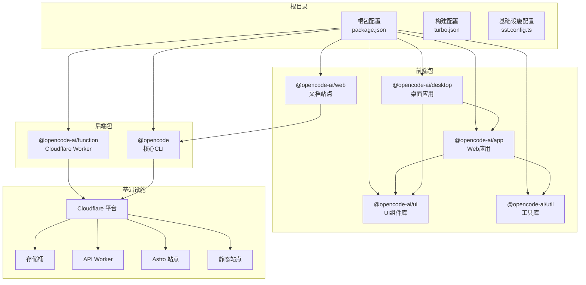
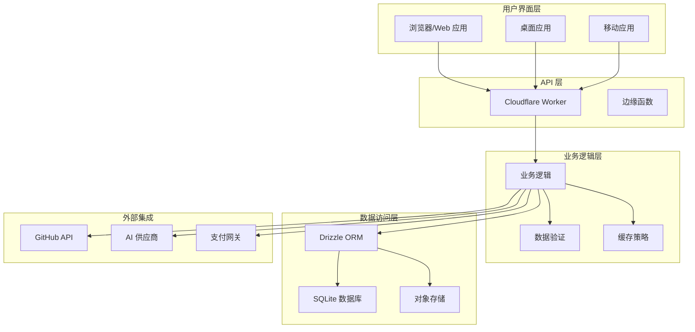
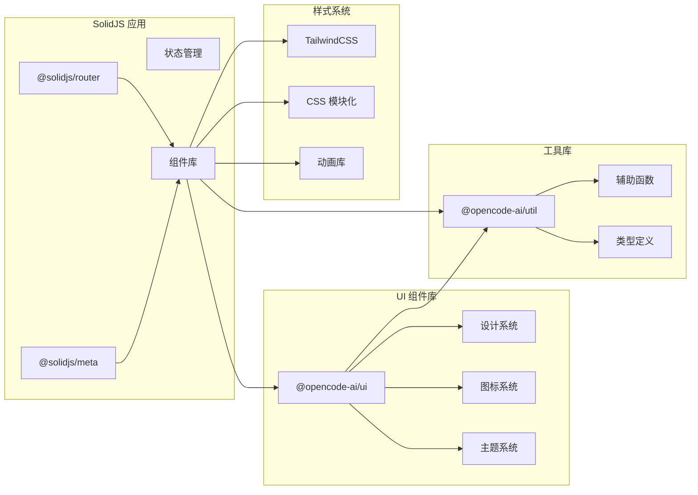
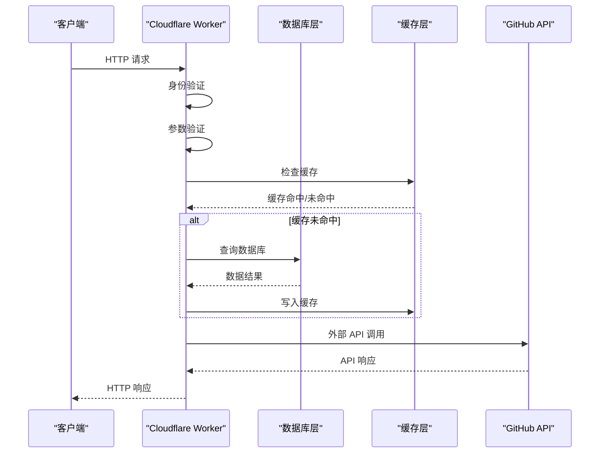
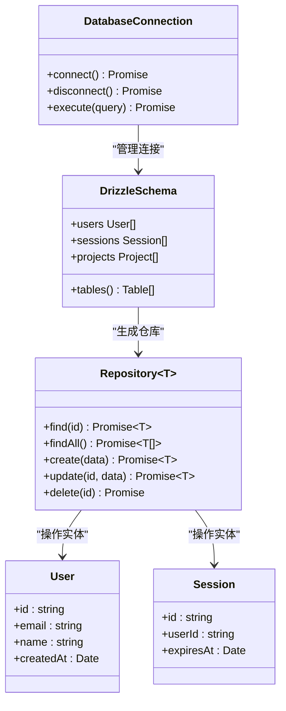
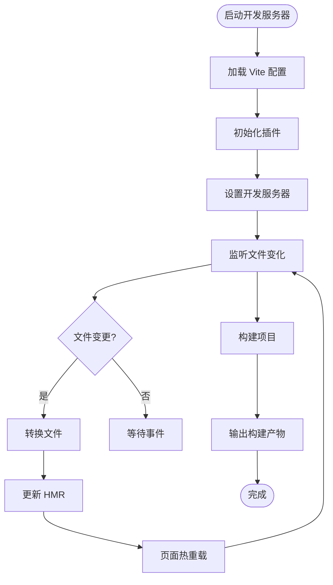
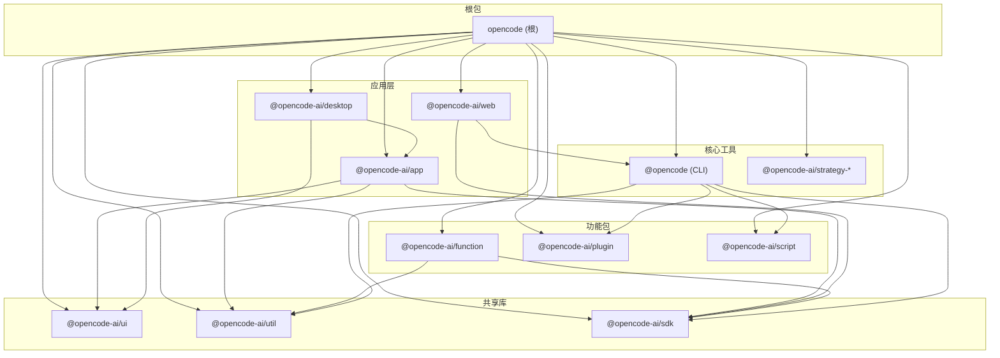

# 技术架构概览

<cite>
**本文档引用的文件**
- [package.json](file://package.json)
- [turbo.json](file://turbo.json)
- [bunfig.toml](file://bunfig.toml)
- [sst.config.ts](file://sst.config.ts)
- [tsconfig.json](file://tsconfig.json)
- [packages/opencode/package.json](file://packages/opencode/package.json)
- [packages/app/package.json](file://packages/app/package.json)
- [packages/web/package.json](file://packages/web/package.json)
- [packages/desktop/package.json](file://packages/desktop/package.json)
- [packages/ui/package.json](file://packages/ui/package.json)
- [packages/util/package.json](file://packages/util/package.json)
- [packages/function/package.json](file://packages/function/package.json)
- [infra/app.ts](file://infra/app.ts)
</cite>

## 目录
1. [引言](#引言)
2. [项目结构](#项目结构)
3. [核心组件](#核心组件)
4. [架构总览](#架构总览)
5. [详细组件分析](#详细组件分析)
6. [依赖关系分析](#依赖关系分析)
7. [性能考虑](#性能考虑)
8. [故障排除指南](#故障排除指南)
9. [结论](#结论)

## 引言

OpenCode 是一个基于 Monorepo 的 AI 驱动开发工具，采用现代化全栈技术栈构建。该项目的核心目标是提供统一的开发体验，支持 Web 应用、桌面应用以及云端服务的协同工作。通过精心设计的架构，OpenCode 实现了跨平台的一致性、可扩展性和高性能。

本技术架构概览将深入解析项目的设计原则、技术选型决策以及各组件间的交互关系，帮助开发者快速理解并高效参与项目开发。

## 项目结构

OpenCode 采用标准的 Monorepo 架构，使用 Bun 作为包管理器和运行时环境，结合 Turbo 进行构建优化。项目结构清晰地分离了前端、后端、基础设施和共享库模块。

**图表来源**
- [package.json:1-118](file://package.json#L1-L118)
- [packages/app/package.json:1-74](file://packages/app/package.json#L1-L74)
- [packages/web/package.json:1-44](file://packages/web/package.json#L1-L44)
- [packages/desktop/package.json:1-45](file://packages/desktop/package.json#L1-L45)
- [packages/ui/package.json:1-74](file://packages/ui/package.json#L1-L74)
- [packages/util/package.json:1-21](file://packages/util/package.json#L1-L21)
- [packages/function/package.json:1-21](file://packages/function/package.json#L1-L21)
- [infra/app.ts:1-69](file://infra/app.ts#L1-L69)

**章节来源**
- [package.json:1-118](file://package.json#L1-L118)
- [turbo.json:1-21](file://turbo.json#L1-L21)
- [sst.config.ts:1-24](file://sst.config.ts#L1-L24)

## 核心组件

### Monorepo 架构优势

OpenCode 的 Monorepo 架构提供了以下核心优势：

1. **统一依赖管理**：通过 Bun 的工作空间机制，所有包共享统一的依赖树，避免版本冲突
2. **跨包代码复用**：UI 组件库、工具函数和类型定义可以在多个包之间无缝共享
3. **一致的开发体验**：统一的构建脚本、类型检查和测试配置
4. **高效的增量构建**：Turbo 提供智能缓存和并行执行能力

### 技术栈选择原则

项目采用"现代、稳定、高性能"的技术选型策略：

- **前端层**：SolidJS + TailwindCSS，提供高性能的响应式界面
- **后端层**：Node.js + TypeScript，确保类型安全和开发效率
- **数据库层**：Drizzle ORM + SQLite，简化数据访问和部署复杂度
- **构建工具**：Vite + Bun + Turbo，实现极速开发和构建体验
- **基础设施**：Cloudflare Workers，提供全球边缘计算能力

**章节来源**
- [package.json:21-72](file://package.json#L21-L72)
- [packages/opencode/package.json:58-141](file://packages/opencode/package.json#L58-L141)

## 架构总览

OpenCode 采用分层架构设计，从基础设施到应用层形成清晰的职责分离：

**图表来源**
- [infra/app.ts:13-49](file://infra/app.ts#L13-L49)
- [packages/function/package.json:14-19](file://packages/function/package.json#L14-L19)
- [packages/opencode/package.json:62-80](file://packages/opencode/package.json#L62-L80)

## 详细组件分析

### 前端技术栈

#### SolidJS 应用架构

OpenCode 的前端采用 SolidJS 作为核心框架，结合 Vite 进行开发服务器和构建优化：

**图表来源**
- [packages/app/package.json:40-72](file://packages/app/package.json#L40-L72)
- [packages/ui/package.json:44-72](file://packages/ui/package.json#L44-L72)
- [packages/util/package.json:13-15](file://packages/util/package.json#L13-L15)

#### TailwindCSS 集成

项目采用 TailwindCSS 作为主要样式解决方案，通过自定义配置实现一致的设计语言：

- **原子化 CSS**：提高样式开发效率和维护性
- **响应式设计**：内置断点支持移动端适配
- **主题定制**：支持动态主题切换和品牌色彩
- **性能优化**：生产环境自动清理未使用样式

**章节来源**
- [packages/app/package.json:26-38](file://packages/app/package.json#L26-L38)
- [packages/ui/package.json:31-42](file://packages/ui/package.json#L31-L42)

### 后端架构

#### Cloudflare Worker 服务

后端采用 Cloudflare Workers 作为无服务器运行时，提供全球边缘计算能力：

**图表来源**
- [infra/app.ts:13-49](file://infra/app.ts#L13-L49)
- [packages/function/package.json:14-19](file://packages/function/package.json#L14-L19)

#### Drizzle ORM 数据层

数据访问层采用 Drizzle ORM，提供类型安全的数据库操作：

**图表来源**
- [packages/opencode/package.json:112-113](file://packages/opencode/package.json#L112-L113)
- [packages/function/package.json:14-19](file://packages/function/package.json#L14-L19)

**章节来源**
- [infra/app.ts:1-69](file://infra/app.ts#L1-L69)
- [packages/function/package.json:1-21](file://packages/function/package.json#L1-L21)

### 构建工具链

#### Vite 开发服务器

项目使用 Vite 作为开发服务器和构建工具，提供极速的热重载和打包能力：

**图表来源**
- [packages/app/package.json:11-24](file://packages/app/package.json#L11-L24)
- [packages/desktop/package.json:7-14](file://packages/desktop/package.json#L7-L14)

#### Bun 包管理器

Bun 作为包管理器和 JavaScript 运行时，提供比传统 npm/yarn 更快的安装和执行速度：

- **超快安装**：并行下载和解析依赖
- **原生运行时**：无需额外的 Node.js 运行时
- **内置工具**：集成测试、格式化、类型检查等功能
- **兼容性**：完全兼容 npm 生态系统

**章节来源**
- [package.json:7](file://package.json#L7)
- [bunfig.toml:1-7](file://bunfig.toml#L1-L7)

## 依赖关系分析

### 包依赖图

OpenCode 的包之间形成了清晰的依赖层次结构：

**图表来源**
- [package.json:21-27](file://package.json#L21-L27)
- [packages/app/package.json:42-44](file://packages/app/package.json#L42-L44)
- [packages/desktop/package.json:16-17](file://packages/desktop/package.json#L16-L17)
- [packages/web/package.json:38](file://packages/web/package.json#L38)

### 依赖管理策略

项目采用多种策略确保依赖关系的健康：

1. **工作空间依赖**：内部包使用 `workspace:*` 确保版本同步
2. **目录清单**：通过 `workspaces.packages` 明确声明包范围
3. **版本锁定**：使用 `bunfig.toml` 的 `exact = true` 确保精确版本
4. **类型安全**：统一的 TypeScript 配置确保类型一致性

**章节来源**
- [package.json:21-72](file://package.json#L21-L72)
- [bunfig.toml:2](file://bunfig.toml#L2)

## 性能考虑

### 构建性能优化

OpenCode 在构建性能方面采用了多项优化策略：

- **并行构建**：Turbo 利用任务依赖图实现并行执行
- **智能缓存**：基于文件内容哈希的增量构建缓存
- **零配置优化**：Vite 默认启用现代浏览器特性优化
- **按需加载**：SolidJS 的细粒度响应式系统减少不必要的重渲染

### 运行时性能

- **边缘计算**：Cloudflare Workers 将服务部署在全球边缘节点
- **内存优化**：Bun 的原生运行时提供更好的内存使用效率
- **连接池**：数据库连接池管理减少连接开销
- **缓存策略**：多层缓存（内存、边缘、CDN）提升响应速度

## 故障排除指南

### 常见问题诊断

#### 依赖安装问题

当遇到依赖安装失败时，可以尝试：

1. 清理缓存：`bun cache clean`
2. 重新安装：`bun install --no-cache`
3. 检查网络：确认代理设置正确
4. 更新 Bun：`bun upgrade`

#### 构建错误排查

构建过程中常见的错误类型及解决方法：

- **类型检查失败**：检查 TypeScript 配置和类型定义
- **模块解析错误**：确认 `tsconfig.json` 的路径映射配置
- **环境变量缺失**：检查 `.env` 文件和 CI 环境变量
- **权限问题**：确认文件系统权限和证书配置

**章节来源**
- [package.json:15](file://package.json#L15)
- [bunfig.toml:4-5](file://bunfig.toml#L4-L5)

## 结论

OpenCode 的技术架构体现了现代全栈应用的最佳实践。通过精心选择的技术栈和合理的架构设计，项目实现了高性能、可扩展性和开发效率的平衡。

关键成功因素包括：

1. **Monorepo 架构**：统一管理和高效复用
2. **现代化技术栈**：SolidJS + Cloudflare + Bun 的黄金组合
3. **完善的工具链**：Vite + Turbo + Drizzle 的开发体验
4. **云原生部署**：充分利用边缘计算优势

这一架构为 OpenCode 的持续发展奠定了坚实基础，支持从个人开发者到企业级应用的多样化需求。