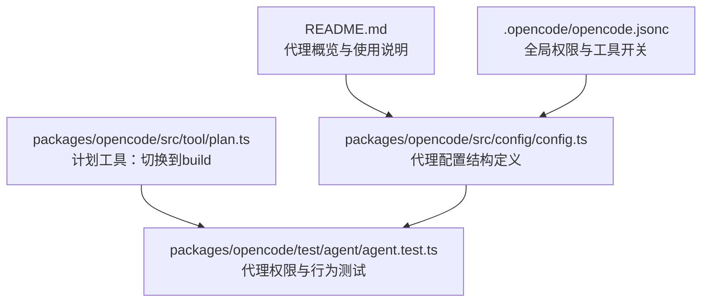
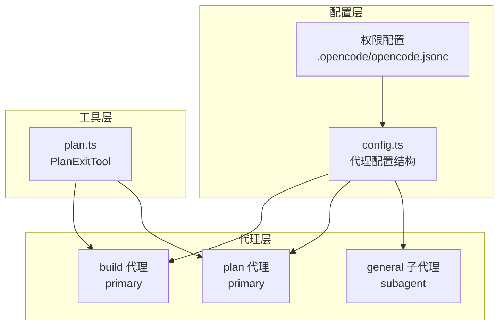
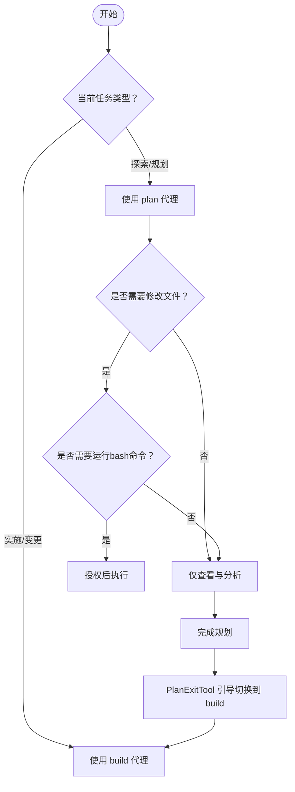
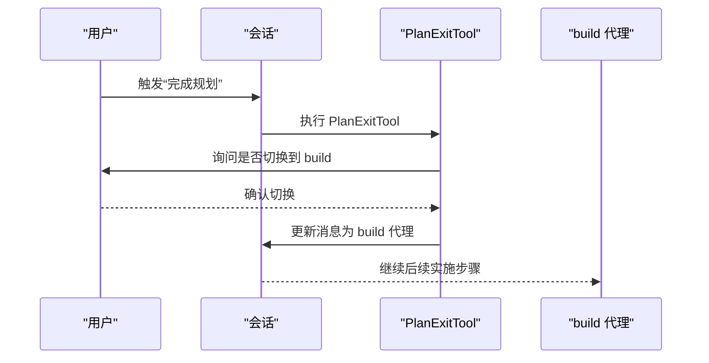
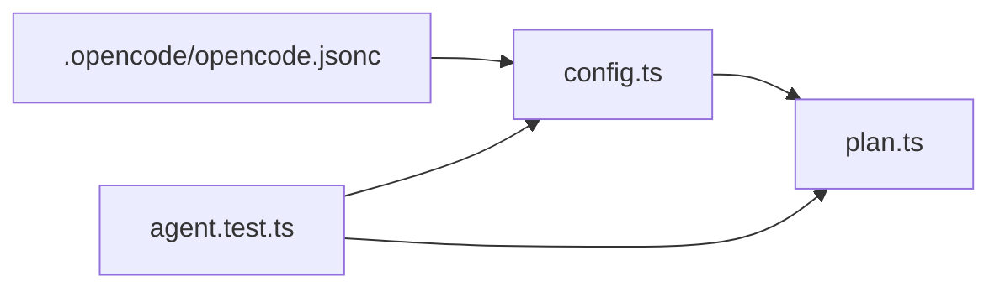

# AI代理系统

<cite>
**本文引用的文件**
- [AGENTS.md](file://AGENTS.md)
- [README.md](file://README.md)
- [.opencode/opencode.jsonc](file://.opencode/opencode.jsonc)
- [packages/opencode/src/config/config.ts](file://packages/opencode/src/config/config.ts)
- [packages/opencode/src/tool/plan.ts](file://packages/opencode/src/tool/plan.ts)
- [packages/opencode/test/agent/agent.test.ts](file://packages/opencode/test/agent/agent.test.ts)
</cite>

## 目录
1. [简介](#简介)
2. [项目结构](#项目结构)
3. [核心组件](#核心组件)
4. [架构总览](#架构总览)
5. [详细组件分析](#详细组件分析)
6. [依赖关系分析](#依赖关系分析)
7. [性能考虑](#性能考虑)
8. [故障排除指南](#故障排除指南)
9. [结论](#结论)
10. [附录](#附录)

## 简介
本文件面向OpenCode的AI代理系统，聚焦以下目标：
- 深入解释build代理与plan代理的核心区别、适用场景与配置方法
- 说明general子代理的复杂搜索与多步骤任务处理能力
- 解释代理的创建、启动、配置与管理流程
- 介绍代理的权限控制机制、安全限制与最佳实践
- 提供不同开发场景下的使用示例与选择建议
- 给出性能优化建议与常见问题排查指引

## 项目结构
OpenCode在仓库根目录提供了关于代理的高层说明，并通过配置文件与测试用例体现代理行为与权限模型。核心相关位置如下：
- 根目录文档：包含代理类型与通用子代理的说明
- 配置定义：定义了代理配置结构（包括primary与subagent）
- 权限配置：全局与代理级权限策略
- 计划工具：提供从plan到build的切换逻辑
- 测试用例：验证代理默认属性、权限与禁用行为

图表来源
- [README.md:100-114](file://README.md#L100-L114)
- [packages/opencode/src/config/config.ts:1099-1114](file://packages/opencode/src/config/config.ts#L1099-L1114)
- [.opencode/opencode.jsonc:8-18](file://.opencode/opencode.jsonc#L8-L18)
- [packages/opencode/src/tool/plan.ts:19-72](file://packages/opencode/src/tool/plan.ts#L19-L72)
- [packages/opencode/test/agent/agent.test.ts:32-60](file://packages/opencode/test/agent/agent.test.ts#L32-L60)

章节来源
- [README.md:100-114](file://README.md#L100-L114)
- [packages/opencode/src/config/config.ts:1099-1114](file://packages/opencode/src/config/config.ts#L1099-L1114)
- [.opencode/opencode.jsonc:8-18](file://.opencode/opencode.jsonc#L8-L18)
- [packages/opencode/src/tool/plan.ts:19-72](file://packages/opencode/src/tool/plan.ts#L19-L72)
- [packages/opencode/test/agent/agent.test.ts:32-60](file://packages/opencode/test/agent/agent.test.ts#L32-L60)

## 核心组件
- build代理（默认主代理）：具备完整访问权限，适合开发与变更执行
- plan代理（只读代理）：默认拒绝文件编辑；运行bash命令前需要授权；适合探索与规划
- general子代理：用于复杂搜索与多步骤任务，内部调用，可通过消息中的“@general”触发
- 权限系统：支持全局与代理级权限合并；内置“ask/allow/deny”三态决策
- 计划工具：在plan完成后引导用户切换至build以实施计划

章节来源
- [README.md:100-114](file://README.md#L100-L114)
- [packages/opencode/src/config/config.ts:1099-1114](file://packages/opencode/src/config/config.ts#L1099-L1114)
- [packages/opencode/src/tool/plan.ts:19-72](file://packages/opencode/src/tool/plan.ts#L19-L72)
- [packages/opencode/test/agent/agent.test.ts:32-60](file://packages/opencode/test/agent/agent.test.ts#L32-L60)

## 架构总览
下图展示了代理配置、权限与计划工具之间的交互关系。

图表来源
- [packages/opencode/src/config/config.ts:1099-1114](file://packages/opencode/src/config/config.ts#L1099-L1114)
- [.opencode/opencode.jsonc:8-18](file://.opencode/opencode.jsonc#L8-L18)
- [packages/opencode/src/tool/plan.ts:19-72](file://packages/opencode/src/tool/plan.ts#L19-L72)

## 详细组件分析

### build代理与plan代理：区别、场景与配置
- 默认行为差异
  - build代理默认允许编辑与bash执行，适合直接开发与变更
  - plan代理默认拒绝编辑（除特定路径外），运行bash需授权，适合探索与规划
- 场景选择
  - 初次进入不熟悉的代码库或需要先做研究与规划时，优先使用plan代理
  - 已有明确计划并准备实施时，使用PlanExitTool切换到build代理
- 配置要点
  - 可通过配置覆盖模型、温度等参数；禁用某代理可从列表中移除
  - 全局权限与代理级权限会合并生效

图表来源
- [README.md:100-114](file://README.md#L100-L114)
- [packages/opencode/src/tool/plan.ts:19-72](file://packages/opencode/src/tool/plan.ts#L19-L72)
- [packages/opencode/test/agent/agent.test.ts:32-60](file://packages/opencode/test/agent/agent.test.ts#L32-L60)

章节来源
- [README.md:100-114](file://README.md#L100-L114)
- [packages/opencode/test/agent/agent.test.ts:32-60](file://packages/opencode/test/agent/agent.test.ts#L32-L60)
- [packages/opencode/src/tool/plan.ts:19-72](file://packages/opencode/src/tool/plan.ts#L19-L72)

### general子代理：复杂搜索与多步骤任务
- 能力定位
  - general为内部使用的子代理，用于复杂搜索与多步骤任务
  - 可通过消息中的“@general”触发
- 行为特征
  - 作为subagent，默认对某些工具（如todo类）进行限制
  - 在权限上通常比primary更保守，避免误操作
- 使用建议
  - 对于跨模块检索、多步推理与综合分析任务，优先考虑general
  - 若任务涉及文件写入或外部命令，建议先在plan代理中验证可行性

章节来源
- [README.md:110-111](file://README.md#L110-L111)
- [packages/opencode/test/agent/agent.test.ts:92-105](file://packages/opencode/test/agent/agent.test.ts#L92-L105)

### 代理创建、启动、配置与管理
- 创建与发现
  - 通过配置项在agent字段下声明自定义代理；若未显式配置，则采用默认代理
  - 支持禁用某个代理，使其不在可用列表中出现
- 启动与切换
  - 可通过工具在plan与build之间切换
  - 切换时会保留模型信息并生成合成消息以指示上下文转换
- 管理与覆盖
  - 代理级配置可覆盖全局默认值（如模型、描述、温度等）
  - 全局权限与代理级权限合并生效

图表来源
- [packages/opencode/src/tool/plan.ts:19-72](file://packages/opencode/src/tool/plan.ts#L19-L72)

章节来源
- [packages/opencode/src/config/config.ts:1099-1114](file://packages/opencode/src/config/config.ts#L1099-L1114)
- [packages/opencode/test/agent/agent.test.ts:122-177](file://packages/opencode/test/agent/agent.test.ts#L122-L177)
- [packages/opencode/src/tool/plan.ts:19-72](file://packages/opencode/src/tool/plan.ts#L19-L72)

### 权限控制机制、安全限制与最佳实践
- 权限模型
  - 三态决策：ask（询问）、allow（允许）、deny（拒绝）
  - 支持对特定路径、命令模式与外部目录进行细粒度控制
- 安全限制
  - plan代理默认拒绝编辑（除特定路径外），运行bash需授权
  - explore与compaction等子代理进一步收紧权限
- 最佳实践
  - 在引入新代理或工具前，先在plan代理中验证可行性
  - 明确区分primary与subagent的职责边界
  - 通过配置文件集中管理权限，避免在会话中频繁调整

章节来源
- [packages/opencode/test/agent/agent.test.ts:47-90](file://packages/opencode/test/agent/agent.test.ts#L47-L90)
- [packages/opencode/test/agent/agent.test.ts:107-120](file://packages/opencode/test/agent/agent.test.ts#L107-L120)
- [.opencode/opencode.jsonc:8-18](file://.opencode/opencode.jsonc#L8-L18)

### 使用示例：不同开发场景的选择与流程
- 探索与规划
  - 步骤：使用plan代理进行代码探索与问题分析；必要时授权bash命令
  - 输出：生成计划文件，随后通过PlanExitTool切换到build实施
- 复杂检索与多步骤任务
  - 步骤：在消息中触发general子代理，执行跨模块检索与推理
  - 输出：返回综合结果，再由用户决定下一步（如切换到plan或build）
- 自定义代理
  - 步骤：在配置中新增自定义代理，设置模型与参数；按需禁用内置代理
  - 输出：在可用代理列表中出现，可在会话中直接选择

章节来源
- [README.md:100-114](file://README.md#L100-L114)
- [packages/opencode/test/agent/agent.test.ts:122-177](file://packages/opencode/test/agent/agent.test.ts#L122-L177)
- [packages/opencode/src/tool/plan.ts:19-72](file://packages/opencode/src/tool/plan.ts#L19-L72)

## 依赖关系分析
- 配置依赖
  - config.ts定义了代理配置结构，涵盖primary与subagent两类
  - .opencode/opencode.jsonc提供全局权限与工具开关
- 行为依赖
  - plan.ts中的PlanExitTool依赖会话状态与模型信息，用于在plan与build间切换
  - 测试用例验证了代理默认属性、权限与禁用行为，确保配置正确落地

图表来源
- [packages/opencode/src/config/config.ts:1099-1114](file://packages/opencode/src/config/config.ts#L1099-L1114)
- [.opencode/opencode.jsonc:8-18](file://.opencode/opencode.jsonc#L8-L18)
- [packages/opencode/src/tool/plan.ts:19-72](file://packages/opencode/src/tool/plan.ts#L19-L72)
- [packages/opencode/test/agent/agent.test.ts:32-60](file://packages/opencode/test/agent/agent.test.ts#L32-L60)

章节来源
- [packages/opencode/src/config/config.ts:1099-1114](file://packages/opencode/src/config/config.ts#L1099-L1114)
- [.opencode/opencode.jsonc:8-18](file://.opencode/opencode.jsonc#L8-L18)
- [packages/opencode/src/tool/plan.ts:19-72](file://packages/opencode/src/tool/plan.ts#L19-L72)
- [packages/opencode/test/agent/agent.test.ts:32-60](file://packages/opencode/test/agent/agent.test.ts#L32-L60)

## 性能考虑
- 代理选择与成本
  - 不同代理可绑定不同模型；在保证质量的前提下，选择合适模型有助于控制成本
- 上下文与压缩
  - 合理利用会话压缩与输出裁剪，减少上下文开销
- 工具与权限
  - 通过权限限制不必要的工具调用，降低无效计算与潜在风险

## 故障排除指南
- 代理不可用或未显示
  - 检查配置中是否禁用了该代理
  - 确认代理名称拼写与大小写一致
- 权限不足导致失败
  - plan代理默认拒绝编辑；如需修改，请在特定允许路径或授权后执行
  - 对外部目录访问，确认是否被标记为ask/allow/deny
- 切换失败或未生效
  - 确认PlanExitTool已正确执行并生成了切换后的消息
  - 检查会话中是否存在模型信息丢失的情况

章节来源
- [packages/opencode/test/agent/agent.test.ts:179-197](file://packages/opencode/test/agent/agent.test.ts#L179-L197)
- [packages/opencode/test/agent/agent.test.ts:47-60](file://packages/opencode/test/agent/agent.test.ts#L47-L60)
- [packages/opencode/src/tool/plan.ts:19-72](file://packages/opencode/src/tool/plan.ts#L19-L72)

## 结论
OpenCode的代理体系通过清晰的primary/subagent分层、完善的权限控制与灵活的配置机制，为不同开发阶段提供了安全高效的协作方式。建议在探索与规划阶段优先使用plan代理，在需要实施时通过PlanExitTool切换到build代理；对于复杂检索与多步骤任务，可借助general子代理完成。通过合理配置与权限约束，既能提升效率，又能保障安全性。

## 附录
- 配置参考
  - 代理配置结构与字段说明参见配置文件
  - 全局权限与工具开关参见配置文件
- 行为参考
  - 代理默认属性、权限与禁用行为参见测试用例

章节来源
- [packages/opencode/src/config/config.ts:1099-1114](file://packages/opencode/src/config/config.ts#L1099-L1114)
- [.opencode/opencode.jsonc:8-18](file://.opencode/opencode.jsonc#L8-L18)
- [packages/opencode/test/agent/agent.test.ts:32-60](file://packages/opencode/test/agent/agent.test.ts#L32-L60)