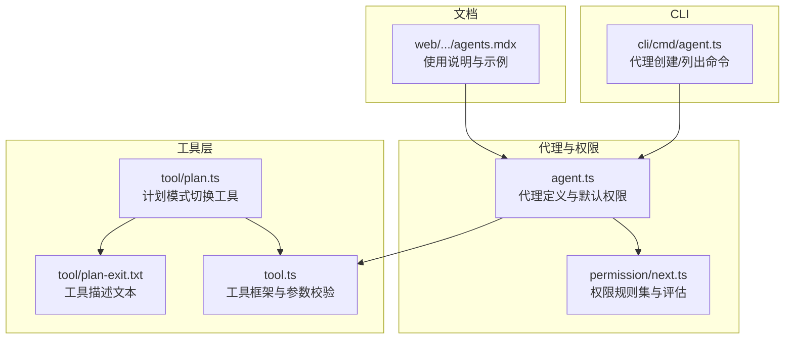
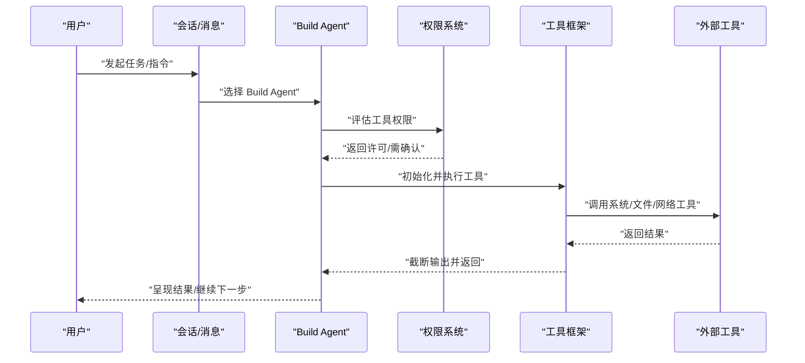
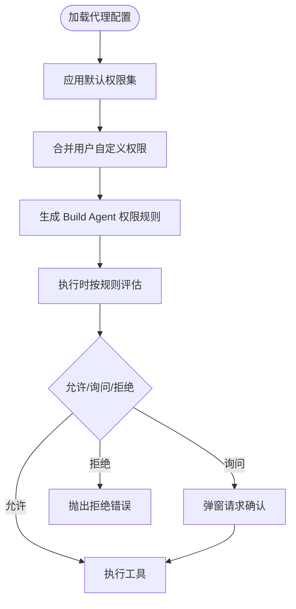
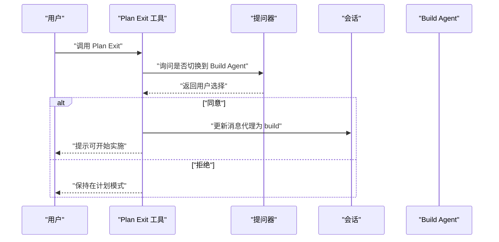
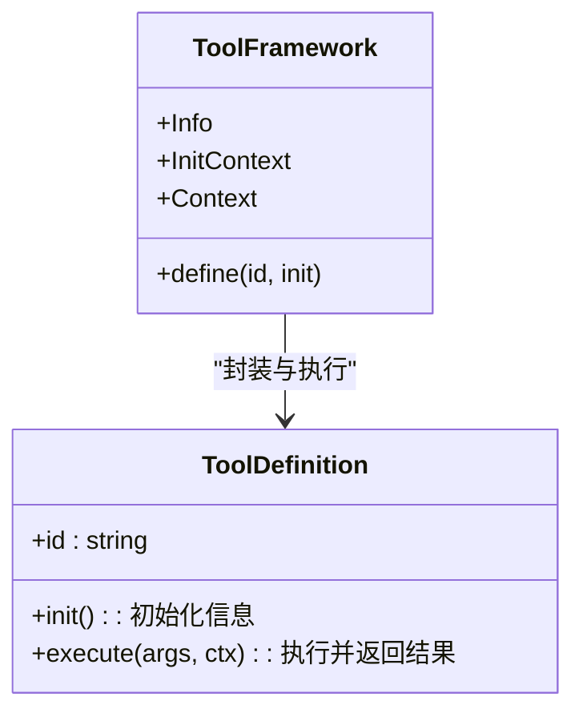
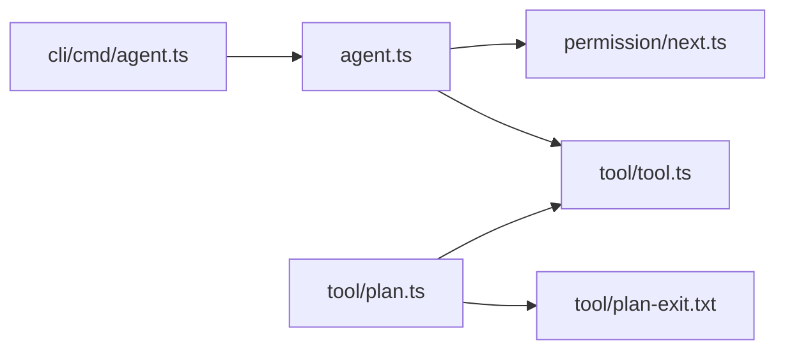

# 构建代理（Build Agent）

<cite>
**本文引用的文件**
- [packages/opencode/src/agent/agent.ts](file://packages/opencode/src/agent/agent.ts)
- [packages/opencode/src/tool/plan.ts](file://packages/opencode/src/tool/plan.ts)
- [packages/opencode/src/tool/plan-exit.txt](file://packages/opencode/src/tool/plan-exit.txt)
- [packages/opencode/src/tool/tool.ts](file://packages/opencode/src/tool/tool.ts)
- [packages/opencode/src/permission/next.ts](file://packages/opencode/src/permission/next.ts)
- [packages/opencode/src/cli/cmd/agent.ts](file://packages/opencode/src/cli/cmd/agent.ts)
- [packages/web/src/content/docs/de/agents.mdx](file://packages/web/src/content/docs/de/agents.mdx)
</cite>

## 目录
1. [简介](#简介)
2. [项目结构](#项目结构)
3. [核心组件](#核心组件)
4. [架构总览](#架构总览)
5. [详细组件分析](#详细组件分析)
6. [依赖关系分析](#依赖关系分析)
7. [性能考量](#性能考量)
8. [故障排除指南](#故障排除指南)
9. [结论](#结论)
10. [附录](#附录)

## 简介
本文件面向 OpenCode 的 Build Agent（构建代理）使用与实现，系统性阐述其作为默认主代理的核心能力与工作原理，重点覆盖以下方面：
- 基于权限的工具执行机制：如何通过统一的权限规则控制系统工具的访问与执行。
- 权限控制规则详解：特别说明 question、plan_enter 等关键权限的作用与影响。
- 与其他代理的区别：Build Agent 与 Plan、General、Explore 等代理的职责差异及适用场景。
- 使用示例：在日常开发中如何使用 Build Agent 进行代码修改、文件操作与工具调用。
- 配置选项、最佳实践与常见问题。

## 项目结构
围绕 Build Agent 的相关代码主要分布在以下模块：
- 代理定义与默认权限：packages/opencode/src/agent/agent.ts
- 计划模式切换工具：packages/opencode/src/tool/plan.ts、packages/opencode/src/tool/plan-exit.txt
- 工具框架与参数校验：packages/opencode/src/tool/tool.ts
- 权限系统（新式）：packages/opencode/src/permission/next.ts
- CLI 代理管理命令：packages/opencode/src/cli/cmd/agent.ts
- 文档与使用说明：packages/web/src/content/docs/de/agents.mdx

**图表来源**
- [packages/opencode/src/agent/agent.ts:1-341](file://packages/opencode/src/agent/agent.ts#L1-L341)
- [packages/opencode/src/permission/next.ts:1-94](file://packages/opencode/src/permission/next.ts#L1-L94)
- [packages/opencode/src/tool/tool.ts:1-91](file://packages/opencode/src/tool/tool.ts#L1-L91)
- [packages/opencode/src/tool/plan.ts:1-132](file://packages/opencode/src/tool/plan.ts#L1-L132)
- [packages/opencode/src/tool/plan-exit.txt:1-13](file://packages/opencode/src/tool/plan-exit.txt#L1-L13)
- [packages/opencode/src/cli/cmd/agent.ts:1-258](file://packages/opencode/src/cli/cmd/agent.ts#L1-L258)
- [packages/web/src/content/docs/de/agents.mdx:31-68](file://packages/web/src/content/docs/de/agents.mdx#L31-L68)

**章节来源**
- [packages/opencode/src/agent/agent.ts:1-341](file://packages/opencode/src/agent/agent.ts#L1-L341)
- [packages/opencode/src/tool/plan.ts:1-132](file://packages/opencode/src/tool/plan.ts#L1-L132)
- [packages/opencode/src/tool/tool.ts:1-91](file://packages/opencode/src/tool/tool.ts#L1-L91)
- [packages/opencode/src/permission/next.ts:1-94](file://packages/opencode/src/permission/next.ts#L1-L94)
- [packages/opencode/src/cli/cmd/agent.ts:1-258](file://packages/opencode/src/cli/cmd/agent.ts#L1-L258)
- [packages/web/src/content/docs/de/agents.mdx:31-68](file://packages/web/src/content/docs/de/agents.mdx#L31-L68)

## 核心组件
- Build Agent 默认代理：作为主代理，具备“全部工具可用”的默认权限，并允许交互式提问与进入计划模式，适合直接执行开发任务。
- Plan Agent 规划代理：限制所有编辑类工具，仅允许提问与退出计划模式，用于纯分析与规划阶段，避免误改代码库。
- 工具框架：统一的工具定义、参数校验、输出截断与权限请求流程，确保安全可控的工具执行。
- 权限系统（新式）：以规则集形式表达许可策略，支持通配符匹配、合并与评估，是 Build Agent 权限控制的核心。

**章节来源**
- [packages/opencode/src/agent/agent.ts:77-115](file://packages/opencode/src/agent/agent.ts#L77-L115)
- [packages/opencode/src/tool/tool.ts:8-91](file://packages/opencode/src/tool/tool.ts#L8-L91)
- [packages/opencode/src/permission/next.ts:47-94](file://packages/opencode/src/permission/next.ts#L47-L94)

## 架构总览
Build Agent 的工作流由“代理定义 → 权限评估 → 工具执行 → 输出截断”构成；同时通过计划模式工具在“规划阶段”与“实施阶段”之间进行切换。

**图表来源**
- [packages/opencode/src/agent/agent.ts:77-92](file://packages/opencode/src/agent/agent.ts#L77-L92)
- [packages/opencode/src/permission/next.ts:77-79](file://packages/opencode/src/permission/next.ts#L77-L79)
- [packages/opencode/src/tool/tool.ts:58-85](file://packages/opencode/src/tool/tool.ts#L58-L85)

## 详细组件分析

### Build Agent 权限模型与默认规则
- 默认权限集：对大部分操作采用“允许”，并对敏感路径（如外部目录）与特定文件（如 .env*）设置“询问”或“拒绝”策略。
- 用户自定义权限：通过配置合并到默认集，形成最终生效规则。
- Build Agent 特权：
  - 允许交互式提问（question），便于在执行前澄清需求。
  - 允许进入计划模式（plan_enter），便于先规划再实施。
  - 对编辑类工具默认开放，适合直接开发实施。

**图表来源**
- [packages/opencode/src/agent/agent.ts:57-92](file://packages/opencode/src/agent/agent.ts#L57-L92)
- [packages/opencode/src/permission/next.ts:65-79](file://packages/opencode/src/permission/next.ts#L65-L79)

**章节来源**
- [packages/opencode/src/agent/agent.ts:57-92](file://packages/opencode/src/agent/agent.ts#L57-L92)
- [packages/opencode/src/permission/next.ts:47-94](file://packages/opencode/src/permission/next.ts#L47-L94)

### 计划模式切换工具（Plan Exit）
- 功能：在完成规划后，提示用户是否切换到 Build Agent 实施计划。
- 行为：
  - 若用户同意，则更新会话消息目标代理为 build，并提示可开始文件编辑。
  - 若用户拒绝，则保持在当前代理继续细化计划。
- 触发条件：仅在计划文件已完整、问题已澄清、且用户确认准备实施时调用。

**图表来源**
- [packages/opencode/src/tool/plan.ts:19-72](file://packages/opencode/src/tool/plan.ts#L19-L72)
- [packages/opencode/src/tool/plan-exit.txt:1-13](file://packages/opencode/src/tool/plan-exit.txt#L1-L13)

**章节来源**
- [packages/opencode/src/tool/plan.ts:19-72](file://packages/opencode/src/tool/plan.ts#L19-L72)
- [packages/opencode/src/tool/plan-exit.txt:1-13](file://packages/opencode/src/tool/plan-exit.txt#L1-L13)

### 工具框架与参数校验
- 统一定义工具接口，自动进行参数校验与错误格式化。
- 执行前后钩子：在工具执行前解析参数，在执行后进行输出截断处理。
- 与权限系统的集成：当工具需要额外权限时，可通过上下文触发“询问”。

**图表来源**
- [packages/opencode/src/tool/tool.ts:8-91](file://packages/opencode/src/tool/tool.ts#L8-L91)

**章节来源**
- [packages/opencode/src/tool/tool.ts:8-91](file://packages/opencode/src/tool/tool.ts#L8-L91)

### 与其他代理的区别与选择
- Build Agent：默认主代理，工具全开，适合直接开发实施。
- Plan Agent：限制编辑工具，仅允许提问与退出计划，适合纯分析与规划。
- General Agent：通用型子代理，适合多步骤研究与并行任务，但禁用待办工具。
- Explore Agent：探索型子代理，专注快速检索与浏览，工具受限但高效。

选择建议：
- 当你需要直接修改代码、执行系统命令或进行文件操作时，优先选择 Build Agent。
- 当你希望先进行分析与规划，避免误改代码时，使用 Plan Agent 或在两者间切换。

**章节来源**
- [packages/web/src/content/docs/de/agents.mdx:31-68](file://packages/web/src/content/docs/de/agents.mdx#L31-L68)
- [packages/opencode/src/agent/agent.ts:116-157](file://packages/opencode/src/agent/agent.ts#L116-L157)

## 依赖关系分析
- Build Agent 依赖权限系统进行实时评估，决定工具是否可执行。
- 工具框架负责参数校验与输出截断，保障执行安全与稳定性。
- 计划模式工具依赖会话状态与提问器，实现跨代理切换。
- CLI 命令用于生成与列出代理配置，便于用户定制权限与模式。

**图表来源**
- [packages/opencode/src/agent/agent.ts:1-341](file://packages/opencode/src/agent/agent.ts#L1-L341)
- [packages/opencode/src/permission/next.ts:1-94](file://packages/opencode/src/permission/next.ts#L1-L94)
- [packages/opencode/src/tool/tool.ts:1-91](file://packages/opencode/src/tool/tool.ts#L1-L91)
- [packages/opencode/src/tool/plan.ts:1-132](file://packages/opencode/src/tool/plan.ts#L1-L132)
- [packages/opencode/src/tool/plan-exit.txt:1-13](file://packages/opencode/src/tool/plan-exit.txt#L1-L13)
- [packages/opencode/src/cli/cmd/agent.ts:1-258](file://packages/opencode/src/cli/cmd/agent.ts#L1-L258)

**章节来源**
- [packages/opencode/src/agent/agent.ts:1-341](file://packages/opencode/src/agent/agent.ts#L1-L341)
- [packages/opencode/src/permission/next.ts:1-94](file://packages/opencode/src/permission/next.ts#L1-L94)
- [packages/opencode/src/tool/tool.ts:1-91](file://packages/opencode/src/tool/tool.ts#L1-L91)
- [packages/opencode/src/tool/plan.ts:1-132](file://packages/opencode/src/tool/plan.ts#L1-L132)
- [packages/opencode/src/tool/plan-exit.txt:1-13](file://packages/opencode/src/tool/plan-exit.txt#L1-L13)
- [packages/opencode/src/cli/cmd/agent.ts:1-258](file://packages/opencode/src/cli/cmd/agent.ts#L1-L258)

## 性能考量
- 权限评估：规则集合并与逐条匹配在执行前完成，避免运行期重复计算。
- 输出截断：工具返回内容统一进行截断处理，减少上下文长度与传输成本。
- 并行与子代理：General Agent 支持并行执行多个子任务，提升复杂问题的处理效率。
- 模型选择：CLI 与代理配置支持指定模型与变体，按任务复杂度选择合适模型以平衡速度与质量。

[本节为通用指导，不涉及具体文件分析]

## 故障排除指南
- 权限被拒绝（Denied）：检查代理权限配置，确认目标工具与路径是否在规则集中被明确允许或询问。
  - 参考：[packages/opencode/src/permission/next.ts:47-94](file://packages/opencode/src/permission/next.ts#L47-L94)
- 需要用户确认（Ask）：当规则命中“询问”策略时，工具会弹窗等待确认；请根据提示进行选择。
  - 参考：[packages/opencode/src/agent/agent.ts:57-92](file://packages/opencode/src/agent/agent.ts#L57-L92)
- 参数校验失败：工具定义包含参数校验，若输入不符合模式，会返回格式化后的错误信息。
  - 参考：[packages/opencode/src/tool/tool.ts:58-69](file://packages/opencode/src/tool/tool.ts#L58-L69)
- 计划模式切换无效：Plan Exit 工具仅在计划文件已完整、问题已澄清、用户确认后才切换至 Build Agent。
  - 参考：[packages/opencode/src/tool/plan.ts:19-72](file://packages/opencode/src/tool/plan.ts#L19-L72)

**章节来源**
- [packages/opencode/src/permission/next.ts:47-94](file://packages/opencode/src/permission/next.ts#L47-L94)
- [packages/opencode/src/agent/agent.ts:57-92](file://packages/opencode/src/agent/agent.ts#L57-L92)
- [packages/opencode/src/tool/tool.ts:58-69](file://packages/opencode/src/tool/tool.ts#L58-L69)
- [packages/opencode/src/tool/plan.ts:19-72](file://packages/opencode/src/tool/plan.ts#L19-L72)

## 结论
Build Agent 作为 OpenCode 的默认主代理，凭借完善的权限体系与工具框架，能够在保证安全的前提下高效完成开发任务。通过合理配置权限与正确使用计划模式工具，可以在“分析—规划—实施”的闭环中获得更高的可控性与产出质量。对于需要纯分析或探索的场景，Plan/Explore/General 等代理提供了更精细的选择。

[本节为总结性内容，不涉及具体文件分析]

## 附录

### 使用示例（基于权限与工具的组合）
- 在日常开发中，直接使用 Build Agent 进行：
  - 文件读写与编辑（受权限控制）
  - 执行系统命令（如构建、测试脚本）
  - 搜索与浏览代码库（结合 Explore Agent）
- 在需要先分析与规划时：
  - 使用 Plan Agent 完成无侵入式分析与计划撰写
  - 通过 Plan Exit 工具切换到 Build Agent 实施计划

**章节来源**
- [packages/web/src/content/docs/de/agents.mdx:31-68](file://packages/web/src/content/docs/de/agents.mdx#L31-L68)
- [packages/opencode/src/tool/plan.ts:19-72](file://packages/opencode/src/tool/plan.ts#L19-L72)

### 配置选项与最佳实践
- 代理模式（mode）：primary（主代理）、subagent（子代理）、all（两者皆可）
- 工具启用（tools）：可按需禁用危险工具（如 bash、edit 等）
- 权限定制（permission）：通过规则集精确控制工具与路径访问
- 最佳实践：
  - 默认使用 Build Agent 处理常规开发任务
  - 在引入新工具或新路径时，先在本地测试权限
  - 将敏感文件（如 .env*）纳入“询问/拒绝”策略
  - 利用 CLI 命令生成与管理代理配置，保持一致性

**章节来源**
- [packages/opencode/src/cli/cmd/agent.ts:17-258](file://packages/opencode/src/cli/cmd/agent.ts#L17-L258)
- [packages/opencode/src/agent/agent.ts:77-115](file://packages/opencode/src/agent/agent.ts#L77-L115)
- [packages/opencode/src/permission/next.ts:47-94](file://packages/opencode/src/permission/next.ts#L47-L94)