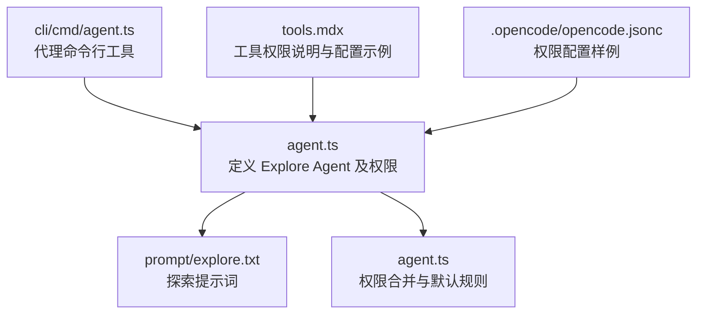
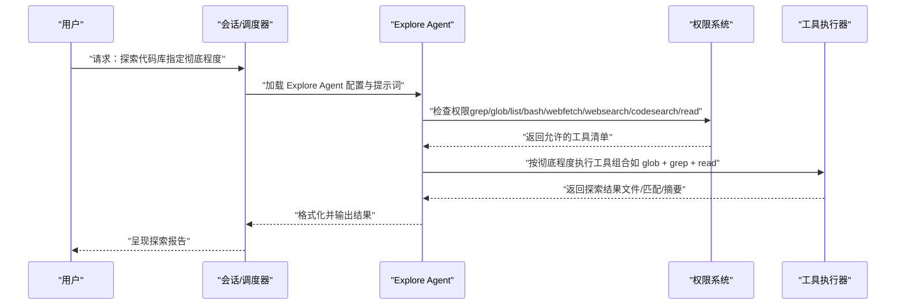
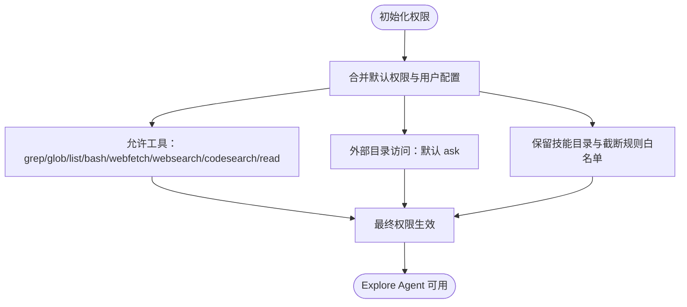
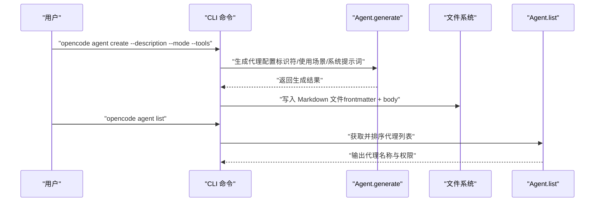
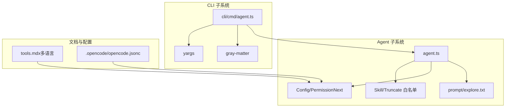

# Explore Agent（探索代理）

<cite>
**本文引用的文件**
- [packages/opencode/src/agent/agent.ts](file://packages/opencode/src/agent/agent.ts)
- [packages/opencode/src/agent/prompt/explore.txt](file://packages/opencode/src/agent/prompt/explore.txt)
- [packages/opencode/src/cli/cmd/agent.ts](file://packages/opencode/src/cli/cmd/agent.ts)
- [packages/web/src/content/docs/de/tools.mdx](file://packages/web/src/content/docs/de/tools.mdx)
- [packages/web/src/content/docs/nb/tools.mdx](file://packages/web/src/content/docs/nb/tools.mdx)
- [packages/web/src/content/docs/ar/tools.mdx](file://packages/web/src/content/docs/ar/tools.mdx)
- [packages/web/src/content/docs/bs/tools.mdx](file://packages/web/src/content/docs/bs/tools.mdx)
- [packages/web/src/content/docs/tr/tools.mdx](file://packages/web/src/content/docs/tr/tools.mdx)
- [README.md](file://README.md)
- [.opencode/opencode.jsonc](file://.opencode/opencode.jsonc)
</cite>

## 目录
1. [简介](#简介)
2. [项目结构](#项目结构)
3. [核心组件](#核心组件)
4. [架构总览](#架构总览)
5. [详细组件分析](#详细组件分析)
6. [依赖关系分析](#依赖关系分析)
7. [性能考量](#性能考量)
8. [故障排查指南](#故障排查指南)
9. [结论](#结论)
10. [附录](#附录)

## 简介
Explore Agent 是 OpenCode 内置的“快速代理”，专为代码库探索而设计。它默认仅启用一组受限但高效的工具集，用于快速发现文件、按模式匹配与正则搜索代码、读取文件内容、执行基础 Bash 操作、以及进行网络检索与搜索。Explore Agent 的目标是在不修改系统状态的前提下，帮助用户高效地完成代码库导航、文件定位与初步分析。

在交互层，Explore Agent 的描述明确指出：当调用该代理时，请指定所需的探索彻底程度级别：“quick”（基础搜索）、“medium”（中度探索）、或“very thorough”（全面分析）。该级别将指导代理在不同范围与命名约定上进行更广泛的探索。

此外，README 中也提到 OpenCode 提供两类内置代理：build（默认全权限开发代理）与 plan（只读分析代理），并说明 plan 适合探索不熟悉的代码库或规划变更。Explore Agent 在权限与用途上与 plan 一致，强调“快速代理”与“探索”。

章节来源
- [packages/opencode/src/agent/agent.ts:131-157](file://packages/opencode/src/agent/agent.ts#L131-L157)
- [packages/opencode/src/agent/prompt/explore.txt:1-19](file://packages/opencode/src/agent/prompt/explore.txt#L1-L19)
- [README.md:100-114](file://README.md#L100-L114)

## 项目结构
Explore Agent 的核心定义位于 agent 模块中，并通过统一的权限系统进行控制；其提示词（prompt）单独存放以便复用与维护；CLI 命令模块提供了对代理的创建与列表能力；Web 文档中提供了工具权限的配置示例与说明；配置文件中展示了权限声明的 JSON 结构。

图表来源
- [packages/opencode/src/agent/agent.ts:131-157](file://packages/opencode/src/agent/agent.ts#L131-L157)
- [packages/opencode/src/agent/prompt/explore.txt:1-19](file://packages/opencode/src/agent/prompt/explore.txt#L1-L19)
- [packages/opencode/src/cli/cmd/agent.ts:17-29](file://packages/opencode/src/cli/cmd/agent.ts#L17-L29)
- [packages/web/src/content/docs/de/tools.mdx:111-177](file://packages/web/src/content/docs/de/tools.mdx#L111-L177)
- [.opencode/opencode.jsonc:1-19](file://.opencode/opencode.jsonc#L1-L19)

章节来源
- [packages/opencode/src/agent/agent.ts:131-157](file://packages/opencode/src/agent/agent.ts#L131-L157)
- [packages/opencode/src/cli/cmd/agent.ts:17-29](file://packages/opencode/src/cli/cmd/agent.ts#L17-L29)
- [packages/web/src/content/docs/de/tools.mdx:111-177](file://packages/web/src/content/docs/de/tools.mdx#L111-L177)
- [.opencode/opencode.jsonc:1-19](file://.opencode/opencode.jsonc#L1-L19)

## 核心组件
- Explore Agent 定义与权限
  - Explore Agent 在 agent.ts 中被显式定义，其权限通过 PermissionNext 合并默认规则与用户配置生成。
  - 默认情况下，仅允许以下工具：grep、glob、list、bash、webfetch、websearch、codesearch、read。
  - 对外部目录访问采用“询问”策略，确保安全边界。
- 探索提示词
  - explore.txt 明确了代理的职责：擅长使用 glob 快速定位文件、使用正则 grep 搜索代码、按需读取文件内容、必要时使用 Bash 执行只读操作，并根据调用方指定的“彻底程度”调整探索策略。
- CLI 命令
  - agent.ts 中的 CLI 提供了创建与列出代理的能力，支持选择工具集合与模式（all/primary/subagent）。
- 工具权限与配置示例
  - 多语言文档（如德语、挪威语、阿拉伯语、波斯尼亚语、土耳其语）均提供 read、grep、glob、list、webfetch、websearch 等工具的权限配置示例，展示如何在 opencode.jsonc 中声明 permission 字段以授予相应工具的使用许可。
- 配置文件示例
  - .opencode/opencode.jsonc 展示了 permission 节点的结构，便于理解如何在项目或全局配置中声明权限。

章节来源
- [packages/opencode/src/agent/agent.ts:131-157](file://packages/opencode/src/agent/agent.ts#L131-L157)
- [packages/opencode/src/agent/prompt/explore.txt:1-19](file://packages/opencode/src/agent/prompt/explore.txt#L1-L19)
- [packages/opencode/src/cli/cmd/agent.ts:17-29](file://packages/opencode/src/cli/cmd/agent.ts#L17-L29)
- [packages/web/src/content/docs/de/tools.mdx:111-177](file://packages/web/src/content/docs/de/tools.mdx#L111-L177)
- [packages/web/src/content/docs/nb/tools.mdx:268-326](file://packages/web/src/content/docs/nb/tools.mdx#L268-L326)
- [packages/web/src/content/docs/ar/tools.mdx:268-314](file://packages/web/src/content/docs/ar/tools.mdx#L268-L314)
- [packages/web/src/content/docs/bs/tools.mdx:108-174](file://packages/web/src/content/docs/bs/tools.mdx#L108-L174)
- [packages/web/src/content/docs/tr/tools.mdx:99-170](file://packages/web/src/content/docs/tr/tools.mdx#L99-L170)
- [.opencode/opencode.jsonc:1-19](file://.opencode/opencode.jsonc#L1-L19)

## 架构总览
Explore Agent 的运行流程可概括为：用户发起请求 → 选择 Explore Agent → 系统根据“彻底程度”与权限执行工具调用 → 返回结果（文件路径、匹配内容、摘要等）。

图表来源
- [packages/opencode/src/agent/agent.ts:131-157](file://packages/opencode/src/agent/agent.ts#L131-L157)
- [packages/opencode/src/agent/prompt/explore.txt:8-18](file://packages/opencode/src/agent/prompt/explore.txt#L8-L18)

## 详细组件分析

### Explore Agent 权限模型
- 默认允许的工具
  - grep：按正则表达式搜索文件内容
  - glob：按模式匹配查找文件
  - list：列出目录内容（支持 glob 过滤）
  - bash：执行只读类 Bash 命令（如 ls、cat 等）
  - webfetch：抓取网页内容（用于查阅文档或在线资料）
  - websearch：基于搜索引擎检索信息（需特定环境变量启用）
  - codesearch：在代码库内进行跨文件搜索（与 grep 协同）
  - read：读取文件内容（支持大文件的行区间读取）
- 外部目录访问策略
  - 默认对外部目录访问采用“询问”策略，避免越权访问；同时保留对特定技能目录与截断规则的白名单放行，确保工具链正常运作。
- 用户自定义权限
  - 用户可在配置中覆盖默认权限，例如将某些工具设为 deny 或 ask，或放宽外部目录访问限制。

图表来源
- [packages/opencode/src/agent/agent.ts:57-75](file://packages/opencode/src/agent/agent.ts#L57-L75)
- [packages/opencode/src/agent/agent.ts:133-149](file://packages/opencode/src/agent/agent.ts#L133-L149)

章节来源
- [packages/opencode/src/agent/agent.ts:57-75](file://packages/opencode/src/agent/agent.ts#L57-L75)
- [packages/opencode/src/agent/agent.ts:133-149](file://packages/opencode/src/agent/agent.ts#L133-L149)

### 探索彻底程度与适用场景
- quick（基础搜索）
  - 适用于快速定位常见文件模式或简单关键字搜索，侧重效率与最小化工具调用。
- medium（中度探索）
  - 在 quick 基础上扩大搜索范围与命名约定，尝试更多潜在位置与变体。
- very thorough（全面分析）
  - 在多个位置与多种命名约定之间进行广泛探索，适合复杂问题与深层分析。

提示词明确要求代理根据调用方指定的“彻底程度”调整策略，确保在不同场景下取得合适的平衡。

章节来源
- [packages/opencode/src/agent/prompt/explore.txt:13](file://packages/opencode/src/agent/prompt/explore.txt#L13)

### 工具使用示例与最佳实践
- 查找文件模式
  - 使用 glob 按模式匹配查找文件，例如查找所有 TypeScript 组件文件或特定目录下的配置文件。
  - 列出目录内容以确认路径与结构，再结合 glob 进行筛选。
- 搜索代码关键字
  - 使用 grep 进行正则搜索，支持跨文件匹配与上下文定位。
  - codesearch 可作为补充，进行更广范围的代码关联搜索。
- 读取文件内容
  - 对已知路径使用 read 获取文件内容，必要时限定行区间以提升性能。
- 执行只读 Bash 操作
  - 使用 bash 执行只读命令（如列出目录、统计行数等），避免修改系统状态。
- 网络检索与搜索
  - 使用 webfetch 抓取特定页面内容，用于查阅文档或参考资料。
  - 使用 websearch 进行主题检索（需满足环境变量条件）。
- 最佳实践
  - 先 glob 定位，再 grep 精准搜索，最后 read 获取关键文件内容。
  - 在大规模搜索前，优先缩小 glob 范围，减少 IO 与处理开销。
  - 对于敏感文件（如 .env），遵循权限策略，必要时走“询问”流程。
  - 将探索结果以绝对路径呈现，便于后续引用与二次分析。

章节来源
- [packages/opencode/src/agent/prompt/explore.txt:8-18](file://packages/opencode/src/agent/prompt/explore.txt#L8-L18)
- [packages/web/src/content/docs/de/tools.mdx:111-177](file://packages/web/src/content/docs/de/tools.mdx#L111-L177)
- [packages/web/src/content/docs/nb/tools.mdx:268-326](file://packages/web/src/content/docs/nb/tools.mdx#L268-L326)
- [packages/web/src/content/docs/ar/tools.mdx:268-314](file://packages/web/src/content/docs/ar/tools.mdx#L268-L314)
- [packages/web/src/content/docs/bs/tools.mdx:108-174](file://packages/web/src/content/docs/bs/tools.mdx#L108-L174)
- [packages/web/src/content/docs/tr/tools.mdx:99-170](file://packages/web/src/content/docs/tr/tools.mdx#L99-L170)

### CLI 与配置集成
- 创建代理
  - CLI 支持非交互式参数（路径、描述、模式、工具列表、模型），也可通过交互式向导生成代理配置。
  - 生成后写入 Markdown 文件，包含 frontmatter（描述、模式、工具）与正文（系统提示词）。
- 列出代理
  - 输出所有可用代理及其权限配置，便于审计与调试。
- 权限配置
  - 在 opencode.jsonc 中通过 permission 节点声明各工具的允许/拒绝/询问状态，与 Explore Agent 的默认权限保持一致。

图表来源
- [packages/opencode/src/cli/cmd/agent.ts:31-226](file://packages/opencode/src/cli/cmd/agent.ts#L31-L226)

章节来源
- [packages/opencode/src/cli/cmd/agent.ts:31-226](file://packages/opencode/src/cli/cmd/agent.ts#L31-L226)

## 依赖关系分析
- 组件耦合
  - Explore Agent 的权限由 PermissionNext 统一管理，与 Config、Skill、Truncate 等模块协作，确保默认规则与白名单正确生效。
  - 提示词模块独立存放，降低与业务逻辑耦合，便于迭代与复用。
- 外部依赖
  - CLI 命令依赖 gray-matter 解析 frontmatter，依赖 yargs 处理参数。
  - 工具权限文档与配置示例分布在多语言文档与配置文件中，形成互补的知识体系。

图表来源
- [packages/opencode/src/agent/agent.ts:57-75](file://packages/opencode/src/agent/agent.ts#L57-L75)
- [packages/opencode/src/cli/cmd/agent.ts:10-13](file://packages/opencode/src/cli/cmd/agent.ts#L10-L13)
- [packages/web/src/content/docs/de/tools.mdx:111-177](file://packages/web/src/content/docs/de/tools.mdx#L111-L177)
- [.opencode/opencode.jsonc:1-19](file://.opencode/opencode.jsonc#L1-L19)

章节来源
- [packages/opencode/src/agent/agent.ts:57-75](file://packages/opencode/src/agent/agent.ts#L57-L75)
- [packages/opencode/src/cli/cmd/agent.ts:10-13](file://packages/opencode/src/cli/cmd/agent.ts#L10-L13)
- [packages/web/src/content/docs/de/tools.mdx:111-177](file://packages/web/src/content/docs/de/tools.mdx#L111-L177)
- [.opencode/opencode.jsonc:1-19](file://.opencode/opencode.jsonc#L1-L19)

## 性能考量
- 工具选择与顺序
  - 优先使用 glob 缩小文件集合，再用 grep 精准定位，最后 read 读取关键文件，可显著降低 IO 与处理时间。
- 大文件读取
  - read 支持行区间读取，建议仅读取必要片段，避免一次性加载整文件。
- 并发与批量
  - Explore Agent 本身是子代理，适合在更高层的任务编排中与其他子代理并行协作，但具体并发策略取决于上层工作流。
- 外部访问
  - 外部目录访问默认“询问”，避免不必要的网络或磁盘访问，提高整体稳定性与可控性。

## 故障排查指南
- 权限不足
  - 若某工具报错或被拒绝，请检查 opencode.jsonc 中的 permission 配置，确认对应工具是否被允许或处于 ask 状态。
- 外部目录访问
  - 当遇到外部目录访问失败时，确认是否已在配置中为相应路径设置白名单，或在交互中授权。
- 环境变量限制
  - websearch 需要满足特定环境变量条件才可用，若不可用请检查相关变量设置。
- CLI 生成冲突
  - 若创建代理时报文件已存在，请更换标识符或目标路径，避免覆盖已有配置。

章节来源
- [.opencode/opencode.jsonc:1-19](file://.opencode/opencode.jsonc#L1-L19)
- [packages/web/src/content/docs/nb/tools.mdx:293-302](file://packages/web/src/content/docs/nb/tools.mdx#L293-L302)
- [packages/opencode/src/cli/cmd/agent.ts:206-213](file://packages/opencode/src/cli/cmd/agent.ts#L206-L213)

## 结论
Explore Agent 通过精简而高效的工具集与严格的权限控制，为代码库探索提供了“快速代理”的能力。结合“彻底程度”策略与合理的工具使用顺序，用户可以在不修改系统状态的前提下，迅速完成文件定位、代码搜索与初步分析。配合 CLI 与配置文件，用户可以灵活定制权限与代理行为，满足不同场景下的探索需求。

## 附录
- 快速参考
  - 允许工具：grep、glob、list、bash、webfetch、websearch、codesearch、read
  - 彻底程度：quick、medium、very thorough
  - 配置入口：opencode.jsonc 的 permission 节点
  - CLI 命令：opencode agent create / list