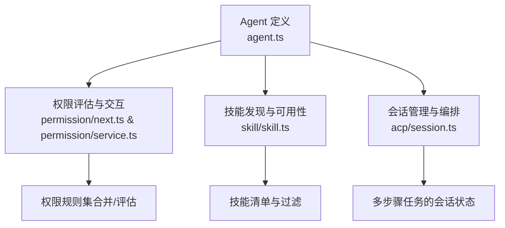
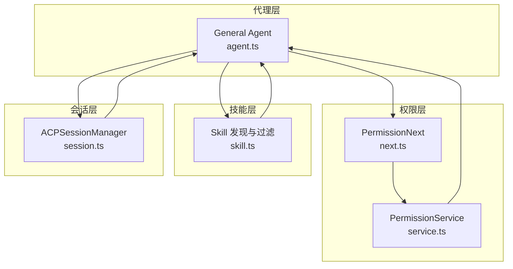
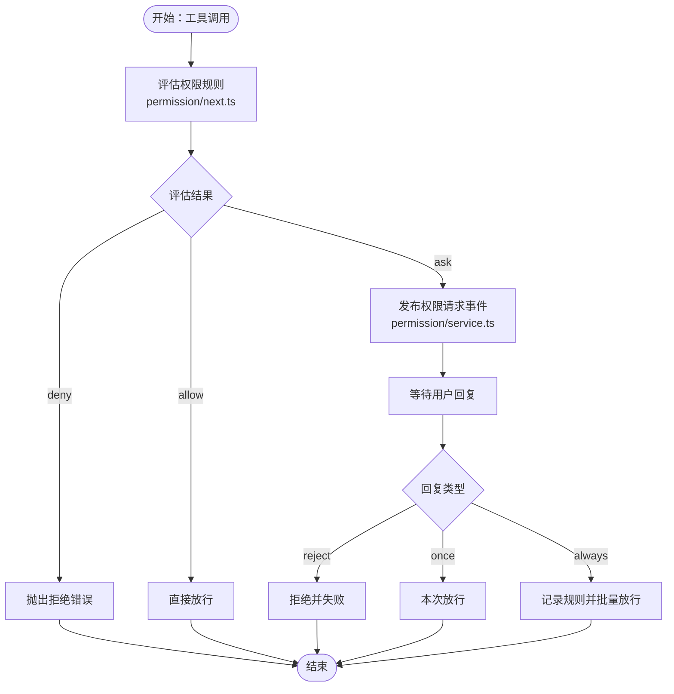
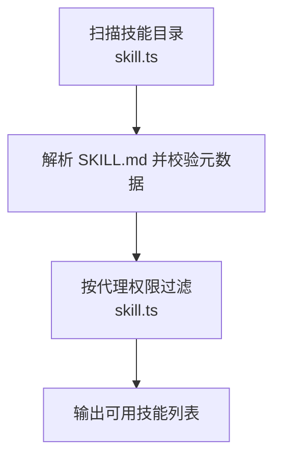
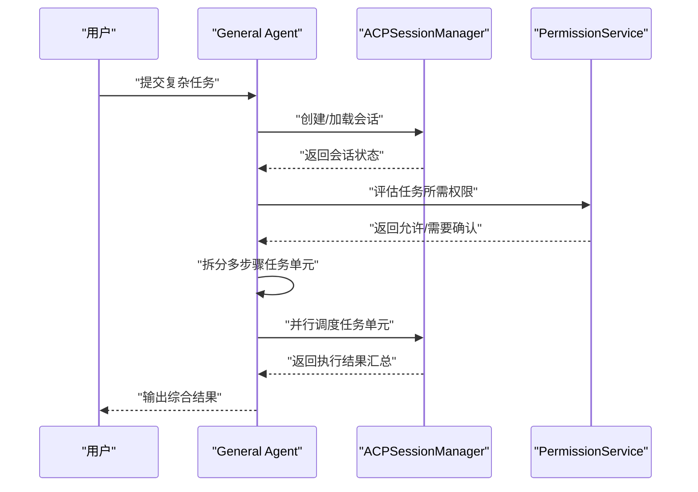
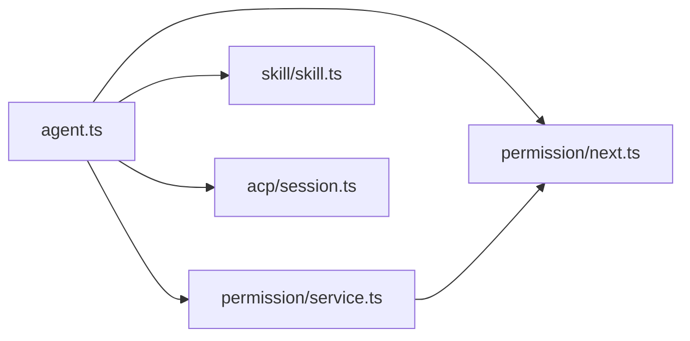

# General Agent（通用代理）

<cite>
**本文引用的文件**
- [README.md](file://README.md)
- [AGENTS.md](file://AGENTS.md)
- [agent.ts](file://packages/opencode/src/agent/agent.ts)
- [next.ts](file://packages/opencode/src/permission/next.ts)
- [service.ts](file://packages/opencode/src/permission/service.ts)
- [skill.ts](file://packages/opencode/src/skill/skill.ts)
- [session.ts](file://packages/opencode/src/acp/session.ts)
</cite>

## 目录
1. [简介](#简介)
2. [项目结构](#项目结构)
3. [核心组件](#核心组件)
4. [架构总览](#架构总览)
5. [详细组件分析](#详细组件分析)
6. [依赖关系分析](#依赖关系分析)
7. [性能考量](#性能考量)
8. [故障排查指南](#故障排查指南)
9. [结论](#结论)
10. [附录：使用示例与最佳实践](#附录使用示例与最佳实践)

## 简介
本文件面向使用者与开发者，系统化阐述 OpenCode 的 General Agent（通用代理）能力与用法。General Agent 是一个专为“复杂搜索与多步骤任务”设计的子代理（subagent），支持在受限权限下并行执行多个任务单元，适合在复杂项目分析、多文件操作与高级开发任务中承担协调与编排职责。

- General Agent 的定位与入口：可通过消息中输入特定标记触发其内部调用，用于执行多项工作单元并行化处理。
- 权限模型：默认对两类高风险权限显式拒绝，以确保安全边界；同时继承统一的权限评估与交互流程。
- 多步骤与并行：通过技能（Skill）与会话（Session）机制，将复杂任务拆解为可评估、可并行的任务单元，并在权限允许范围内执行。

章节来源
- [README.md:100-114](file://README.md#L100-L114)

## 项目结构
围绕 General Agent 的关键代码分布在以下模块：
- 代理定义与权限配置：packages/opencode/src/agent/agent.ts
- 权限评估与交互：packages/opencode/src/permission/next.ts、packages/opencode/src/permission/service.ts
- 技能发现与可用性过滤：packages/opencode/src/skill/skill.ts
- 会话与多步骤编排：packages/opencode/src/acp/session.ts

图表来源
- [agent.ts:24-204](file://packages/opencode/src/agent/agent.ts#L24-L204)
- [next.ts:17-94](file://packages/opencode/src/permission/next.ts#L17-L94)
- [service.ts:130-256](file://packages/opencode/src/permission/service.ts#L130-L256)
- [skill.ts:20-219](file://packages/opencode/src/skill/skill.ts#L20-L219)
- [session.ts:8-117](file://packages/opencode/src/acp/session.ts#L8-L117)

章节来源
- [agent.ts:24-204](file://packages/opencode/src/agent/agent.ts#L24-L204)
- [next.ts:17-94](file://packages/opencode/src/permission/next.ts#L17-L94)
- [service.ts:130-256](file://packages/opencode/src/permission/service.ts#L130-L256)
- [skill.ts:20-219](file://packages/opencode/src/skill/skill.ts#L20-L219)
- [session.ts:8-117](file://packages/opencode/src/acp/session.ts#L8-L117)

## 核心组件
- 代理定义与模式
  - General Agent 被声明为“subagent”，具备“通用研究与多步骤任务”的描述与默认权限策略。
  - 其 mode 字段明确为 subagent，表明它通常由其他代理或用户通过指令触发，而非直接作为主代理使用。
- 权限控制
  - 默认对 todoread 与 todowrite 显式拒绝，避免在未授权情况下读取/写入待办类资源。
  - 继承统一的权限规则合并与评估机制，支持用户自定义覆盖。
- 技能与可用性
  - 通过技能发现机制加载本地与外部技能，结合代理权限对技能可用性进行过滤。
- 会话与并行
  - 通过会话管理器维护任务上下文，支持多步骤任务的创建、加载与模型/变体设置，便于并行执行多个任务单元。

章节来源
- [agent.ts:116-130](file://packages/opencode/src/agent/agent.ts#L116-L130)
- [next.ts:47-94](file://packages/opencode/src/permission/next.ts#L47-L94)
- [service.ts:130-256](file://packages/opencode/src/permission/service.ts#L130-L256)
- [skill.ts:189-197](file://packages/opencode/src/skill/skill.ts#L189-L197)
- [session.ts:20-117](file://packages/opencode/src/acp/session.ts#L20-L117)

## 架构总览
General Agent 的运行时架构围绕“代理定义—权限评估—技能过滤—会话编排—工具调用”展开。下图展示了从代理配置到权限决策与会话执行的关键节点：

图表来源
- [agent.ts:24-204](file://packages/opencode/src/agent/agent.ts#L24-L204)
- [next.ts:17-94](file://packages/opencode/src/permission/next.ts#L17-L94)
- [service.ts:130-256](file://packages/opencode/src/permission/service.ts#L130-L256)
- [skill.ts:20-219](file://packages/opencode/src/skill/skill.ts#L20-L219)
- [session.ts:8-117](file://packages/opencode/src/acp/session.ts#L8-L117)

## 详细组件分析

### General Agent 权限控制机制
- 规则来源与合并
  - 默认规则集包含对多种敏感路径与行为的细粒度控制，例如外部目录访问白名单、环境变量文件读取需确认等。
  - 用户配置与默认规则通过合并函数叠加，最终形成代理的完整权限集。
- 对 todoread/todowrite 的限制
  - General Agent 在默认规则中显式拒绝这两类权限，从而避免在未授权情况下对“待办”数据进行读取或写入。
- 权限评估与交互
  - 当工具调用涉及受控权限时，服务会根据规则进行评估；若为“deny”，直接抛出错误；若为“ask”，则通过事件总线向用户发起交互请求，等待“一次”或“总是”授权。
  - 授权结果会更新已批准规则集，以便后续调用自动放行。

图表来源
- [next.ts:77-79](file://packages/opencode/src/permission/next.ts#L77-L79)
- [service.ts:148-246](file://packages/opencode/src/permission/service.ts#L148-L246)

章节来源
- [agent.ts:57-75](file://packages/opencode/src/agent/agent.ts#L57-L75)
- [agent.ts:119-126](file://packages/opencode/src/agent/agent.ts#L119-L126)
- [next.ts:65-79](file://packages/opencode/src/permission/next.ts#L65-L79)
- [service.ts:148-246](file://packages/opencode/src/permission/service.ts#L148-L246)

### 技能发现与可用性过滤
- 技能来源
  - 支持扫描外部目录（如 .claude/skills、.agents/skills）、项目内 .opencode/skill、配置指定路径与远程 URL 下载的技能集合。
- 可用性过滤
  - 基于代理权限对技能名称进行权限评估，仅返回非“deny”的技能，确保 General Agent 只能调用被允许的技能。

图表来源
- [skill.ts:55-179](file://packages/opencode/src/skill/skill.ts#L55-L179)
- [skill.ts:189-197](file://packages/opencode/src/skill/skill.ts#L189-L197)

章节来源
- [skill.ts:55-179](file://packages/opencode/src/skill/skill.ts#L55-L179)
- [skill.ts:189-197](file://packages/opencode/src/skill/skill.ts#L189-L197)

### 会话与多步骤任务编排
- 会话生命周期
  - 创建：传入工作目录与 MCP 服务器，初始化会话状态并保存至内存映射。
  - 加载：根据会话 ID 获取已有会话，恢复时间戳与模型信息。
  - 模型/变体/模式设置：支持动态切换模型与变体，以及设置会话模式（如针对 General Agent 的多步骤任务）。
- 并行执行
  - 通过会话管理器维护多个任务单元的状态，结合权限与技能可用性，协调多个任务单元并发执行。

图表来源
- [session.ts:20-117](file://packages/opencode/src/acp/session.ts#L20-L117)
- [service.ts:148-246](file://packages/opencode/src/permission/service.ts#L148-L246)

章节来源
- [session.ts:20-117](file://packages/opencode/src/acp/session.ts#L20-L117)
- [service.ts:148-246](file://packages/opencode/src/permission/service.ts#L148-L246)

## 依赖关系分析
- 组件耦合
  - Agent 定义依赖权限模块（PermissionNext）与技能模块（Skill），并通过会话模块（ACPSessionManager）组织多步骤任务。
  - 权限模块通过服务层实现与事件总线交互，保证权限决策的可审计与可交互。
- 关键依赖链
  - Agent → PermissionNext → PermissionService（评估与交互）
  - Agent → Skill（可用性过滤）
  - Agent → ACPSessionManager（会话与并行编排）

图表来源
- [agent.ts:24-204](file://packages/opencode/src/agent/agent.ts#L24-L204)
- [next.ts:17-94](file://packages/opencode/src/permission/next.ts#L17-L94)
- [service.ts:130-256](file://packages/opencode/src/permission/service.ts#L130-L256)
- [skill.ts:20-219](file://packages/opencode/src/skill/skill.ts#L20-L219)
- [session.ts:8-117](file://packages/opencode/src/acp/session.ts#L8-L117)

章节来源
- [agent.ts:24-204](file://packages/opencode/src/agent/agent.ts#L24-L204)
- [next.ts:17-94](file://packages/opencode/src/permission/next.ts#L17-L94)
- [service.ts:130-256](file://packages/opencode/src/permission/service.ts#L130-L256)
- [skill.ts:20-219](file://packages/opencode/src/skill/skill.ts#L20-L219)
- [session.ts:8-117](file://packages/opencode/src/acp/session.ts#L8-L117)

## 性能考量
- 权限评估开销
  - 权限评估采用规则集合并与通配符匹配，建议尽量减少不必要的规则层级，避免过深的嵌套与过多的通配符匹配。
- 技能扫描范围
  - 技能扫描会遍历多个目录与远程源，建议合理配置技能路径与禁用外部技能以降低启动成本。
- 并行任务调度
  - 并行执行多个任务单元时，注意资源竞争与 I/O 吞吐，建议根据项目规模与硬件条件调整并发度。

## 故障排查指南
- 权限被拒绝
  - 现象：工具调用抛出拒绝错误。
  - 排查：检查代理权限规则中对应权限是否被显式拒绝；必要时通过交互界面授予“一次”或“总是”授权。
- 权限请求未响应
  - 现象：工具调用进入等待状态。
  - 排查：确认权限请求事件是否被正确发布与消费；检查会话上下文中是否存在未决请求。
- 技能不可用
  - 现象：技能列表为空或过滤后为空。
  - 排查：确认技能目录与配置是否正确；检查代理权限对技能名称的评估结果是否为“deny”。

章节来源
- [service.ts:148-246](file://packages/opencode/src/permission/service.ts#L148-L246)
- [next.ts:77-79](file://packages/opencode/src/permission/next.ts#L77-L79)
- [skill.ts:189-197](file://packages/opencode/src/skill/skill.ts#L189-L197)

## 结论
General Agent 通过“子代理模式 + 权限控制 + 技能过滤 + 会话编排”的组合，实现了在受限安全边界内的复杂搜索与多步骤任务处理能力。其默认对 todoread/todowrite 的拒绝策略有效降低了误操作风险；借助权限服务的“询问-确认”机制，既保障了安全性，又保留了灵活性。配合技能发现与并行会话管理，General Agent 能胜任复杂项目分析、多文件操作与高级开发任务的协调与执行。

## 附录：使用示例与最佳实践
- 使用场景
  - 复杂问题求解：将大问题拆分为若干子任务，交由 General Agent 并行处理，再汇总结果。
  - 多文件操作：在权限允许范围内，批量执行读取、搜索、修改等操作，确保每一步均经过权限评估。
  - 高级开发任务：结合技能与会话，完成跨模块重构、依赖分析与生成文档等任务。
- 最佳实践
  - 明确权限边界：在配置中细化权限规则，优先使用“ask”策略对高风险操作进行确认。
  - 合理拆分任务：将复杂任务分解为可评估的子任务单元，充分利用并行能力提升效率。
  - 选择合适模型与变体：根据任务复杂度与数据规模，在会话中设置合适的模型与变体以平衡性能与质量。
  - 监控与回溯：关注权限请求与会话状态，及时处理阻塞与异常，确保任务顺利完成。

章节来源
- [README.md:100-114](file://README.md#L100-L114)
- [AGENTS.md:100-129](file://AGENTS.md#L100-L129)