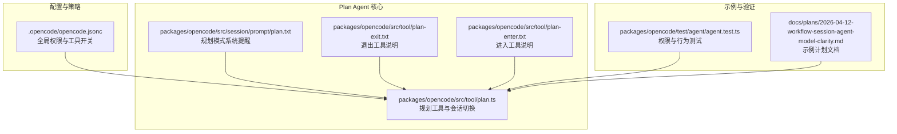
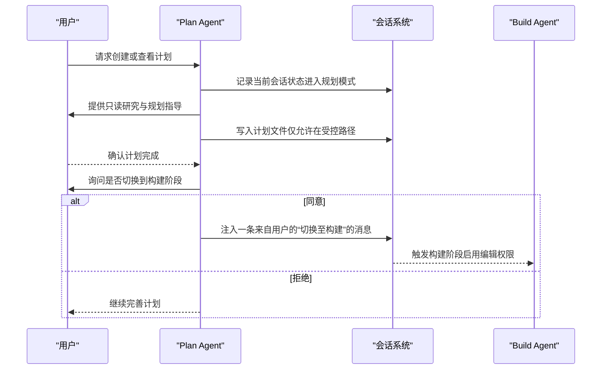
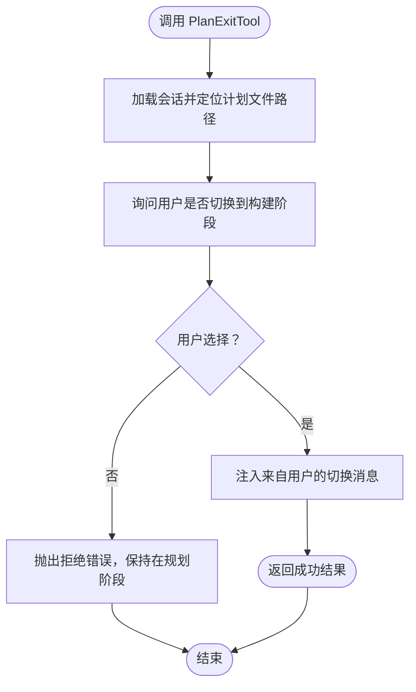
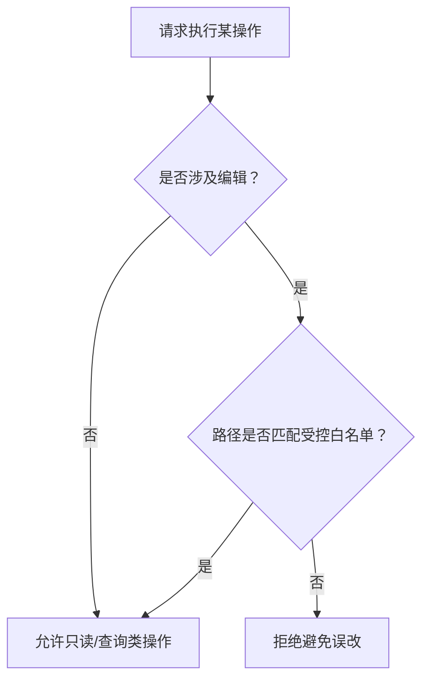
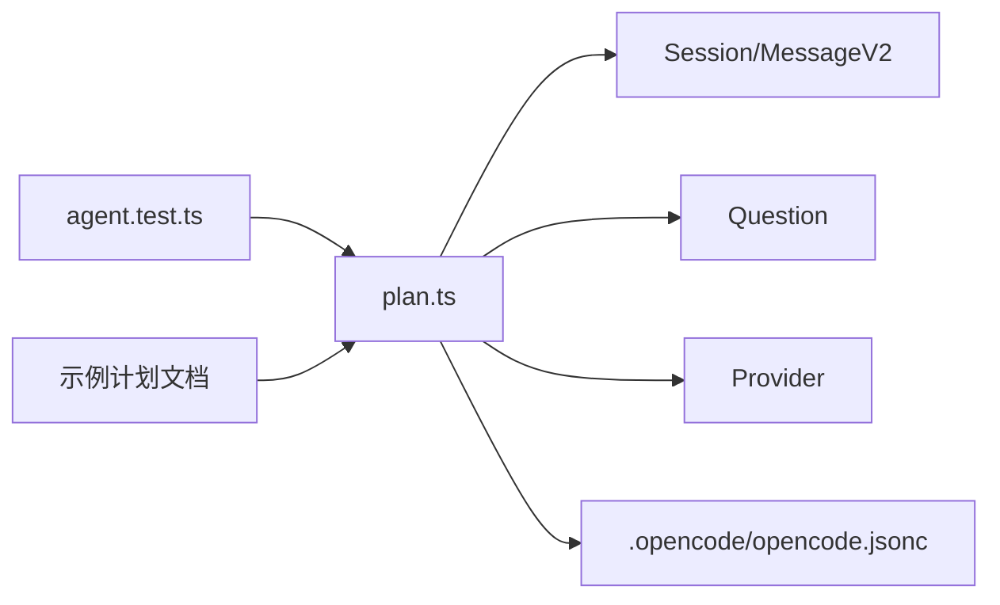

# Plan Agent（规划代理）

<cite>
**本文引用的文件**
- [packages/opencode/src/tool/plan.ts](file://packages/opencode/src/tool/plan.ts)
- [packages/opencode/src/session/prompt/plan.txt](file://packages/opencode/src/session/prompt/plan.txt)
- [packages/opencode/src/tool/plan-exit.txt](file://packages/opencode/src/tool/plan-exit.txt)
- [packages/opencode/src/tool/plan-enter.txt](file://packages/opencode/src/tool/plan-enter.txt)
- [.opencode/opencode.jsonc](file://.opencode/opencode.jsonc)
- [packages/opencode/test/agent/agent.test.ts](file://packages/opencode/test/agent/agent.test.ts)
- [docs/plans/2026-04-12-workflow-session-agent-model-clarity.md](file://docs/plans/2026-04-12-workflow-session-agent-model-clarity.md)
</cite>

## 目录
1. [简介](#简介)
2. [项目结构](#项目结构)
3. [核心组件](#核心组件)
4. [架构总览](#架构总览)
5. [详细组件分析](#详细组件分析)
6. [依赖关系分析](#依赖关系分析)
7. [性能考量](#性能考量)
8. [故障排查指南](#故障排查指南)
9. [结论](#结论)
10. [附录：使用示例与最佳实践](#附录使用示例与最佳实践)

## 简介
Plan Agent（规划代理）是 OpenCode 中用于“只读规划”的专用智能体。它的核心设计目标是在进入实现阶段前，通过系统化的研究、分析与规划，产出可执行的计划文件，并在完成规划后引导用户切换到 Build Agent 进入实施阶段。Plan Agent 的关键设计理念是“禁用所有编辑工具”，确保在规划阶段不产生任何不可逆的变更。

## 项目结构
围绕 Plan Agent 的相关代码与资源主要分布在以下位置：
- 工具定义与交互逻辑：packages/opencode/src/tool/plan.ts
- 规划模式系统提醒与行为约束：packages/opencode/src/session/prompt/plan.txt
- 规划退出与进入的工具说明文本：packages/opencode/src/tool/plan-exit.txt、packages/opencode/src/tool/plan-enter.txt
- 全局配置与权限策略：.opencode/opencode.jsonc
- 权限测试与验证：packages/opencode/test/agent/agent.test.ts
- 示例计划文档：docs/plans/...md

**图表来源**
- [packages/opencode/src/tool/plan.ts:1-132](file://packages/opencode/src/tool/plan.ts#L1-L132)
- [packages/opencode/src/session/prompt/plan.txt:1-27](file://packages/opencode/src/session/prompt/plan.txt#L1-L27)
- [packages/opencode/src/tool/plan-exit.txt:1-14](file://packages/opencode/src/tool/plan-exit.txt#L1-L14)
- [packages/opencode/src/tool/plan-enter.txt:1-15](file://packages/opencode/src/tool/plan-enter.txt#L1-L15)
- [.opencode/opencode.jsonc:1-19](file://.opencode/opencode.jsonc#L1-L19)
- [packages/opencode/test/agent/agent.test.ts:47-60](file://packages/opencode/test/agent/agent.test.ts#L47-L60)
- [docs/plans/2026-04-12-workflow-session-agent-model-clarity.md:1-359](file://docs/plans/2026-04-12-workflow-session-agent-model-clarity.md#L1-L359)

**章节来源**
- [packages/opencode/src/tool/plan.ts:1-132](file://packages/opencode/src/tool/plan.ts#L1-L132)
- [packages/opencode/src/session/prompt/plan.txt:1-27](file://packages/opencode/src/session/prompt/plan.txt#L1-L27)
- [packages/opencode/src/tool/plan-exit.txt:1-14](file://packages/opencode/src/tool/plan-exit.txt#L1-L14)
- [packages/opencode/src/tool/plan-enter.txt:1-15](file://packages/opencode/src/tool/plan-enter.txt#L1-L15)
- [.opencode/opencode.jsonc:1-19](file://.opencode/opencode.jsonc#L1-L19)
- [packages/opencode/test/agent/agent.test.ts:47-60](file://packages/opencode/test/agent/agent.test.ts#L47-L60)
- [docs/plans/2026-04-12-workflow-session-agent-model-clarity.md:1-359](file://docs/plans/2026-04-12-workflow-session-agent-model-clarity.md#L1-L359)

## 核心组件
- 规划工具（PlanExitTool）：在规划完成后询问用户是否切换到 Build Agent 实施计划；若同意，则构造一条来自用户的“切换消息”，并附带提示文本，引导进入实现阶段。
- 规划模式系统提醒：明确规划模式为“只读”，禁止一切文件修改与系统变更，强调该绝对约束覆盖其他指令。
- 权限与工具策略：通过全局配置禁用部分工具（如特定第三方工具），并通过权限规则限制编辑范围，仅允许对特定路径（例如 .opencode/plans/*）进行编辑。
- 测试与验证：单元测试覆盖 Plan Agent 的权限行为，确保除指定路径外的编辑请求被拒绝。

**章节来源**
- [packages/opencode/src/tool/plan.ts:19-72](file://packages/opencode/src/tool/plan.ts#L19-L72)
- [packages/opencode/src/session/prompt/plan.txt:4-9](file://packages/opencode/src/session/prompt/plan.txt#L4-L9)
- [.opencode/opencode.jsonc:14-17](file://.opencode/opencode.jsonc#L14-L17)
- [packages/opencode/test/agent/agent.test.ts:47-60](file://packages/opencode/test/agent/agent.test.ts#L47-L60)

## 架构总览
Plan Agent 的工作流由“进入规划模式”“只读研究与规划”“生成计划文件”“退出规划模式并切换到构建”四个阶段构成。系统通过权限与工具策略确保规划阶段的只读性，并通过会话消息机制实现跨代理的协作。

**图表来源**
- [packages/opencode/src/tool/plan.ts:19-72](file://packages/opencode/src/tool/plan.ts#L19-L72)
- [packages/opencode/src/session/prompt/plan.txt:4-9](file://packages/opencode/src/session/prompt/plan.txt#L4-L9)

## 详细组件分析

### 规划工具与会话切换（PlanExitTool）
- 功能职责
  - 在规划完成后，向用户确认是否切换到 Build Agent 开始实施。
  - 若用户同意，构造一条来自用户的“切换消息”，并附带提示文本，触发后续流程。
- 关键行为
  - 读取最近一次使用的模型，以保持上下文一致性。
  - 通过问题询问（Question.ask）收集用户意图，若用户选择“否”，则抛出拒绝错误，阻止切换。
  - 成功切换时返回结构化结果，包含标题、输出与元数据。
- 与会话系统的交互
  - 更新消息与消息部件，形成跨代理协作的信号。

**图表来源**
- [packages/opencode/src/tool/plan.ts:19-72](file://packages/opencode/src/tool/plan.ts#L19-L72)

**章节来源**
- [packages/opencode/src/tool/plan.ts:19-72](file://packages/opencode/src/tool/plan.ts#L19-L72)

### 规划模式系统提醒（只读约束）
- 设计要点
  - 明确规划模式为“只读”，禁止任何文件修改、系统变更与非只读工具使用。
  - 强调该约束覆盖其他指令，杜绝例外。
- 对实现的影响
  - 在规划阶段，Plan Agent 不应尝试任何写操作或系统命令，需通过探索类代理收集信息后再汇总为计划。

**章节来源**
- [packages/opencode/src/session/prompt/plan.txt:4-9](file://packages/opencode/src/session/prompt/plan.txt#L4-L9)

### 权限控制机制与外部目录/编辑权限
- 编辑权限（edit）
  - 默认情况下，Plan Agent 的编辑权限被全局策略拒绝。
  - 仅对特定路径（例如 .opencode/plans/*）允许编辑，这是计划文件的唯一合法落点。
- 外部目录权限（external_directory）
  - Explore Agent 等代理可能需要访问外部目录，但默认策略要求“询问”授权。
  - 本节重点在于说明 Plan Agent 的编辑权限被严格限制，而非外部目录访问。
- 工具开关
  - 配置中可关闭某些第三方工具，降低风险面。

**图表来源**
- [packages/opencode/test/agent/agent.test.ts:47-60](file://packages/opencode/test/agent/agent.test.ts#L47-L60)
- [.opencode/opencode.jsonc:14-17](file://.opencode/opencode.jsonc#L14-L17)

**章节来源**
- [packages/opencode/test/agent/agent.test.ts:47-60](file://packages/opencode/test/agent/agent.test.ts#L47-L60)
- [.opencode/opencode.jsonc:14-17](file://.opencode/opencode.jsonc#L14-L17)

### 计划文件读写与“.plans”目录交互
- 路径约定
  - 计划文件应保存在受控路径下（例如 .opencode/plans/*），以确保权限与审计可控。
- 读写流程
  - 规划阶段：只读读取与分析，不写入。
  - 完成阶段：通过受控工具写入计划文件，随后触发切换流程。
- 与会话的集成
  - 切换消息通过会话系统注入，作为跨代理协作的信号。

**章节来源**
- [packages/opencode/src/tool/plan.ts:24-64](file://packages/opencode/src/tool/plan.ts#L24-L64)

### 示例计划文档与应用场景
- 示例文档展示了从需求到任务分解再到验收标准的完整规划过程，体现了 Plan Agent 在大型功能重构、多模块协同与前后端联动中的应用价值。
- 场景建议
  - 复杂重构：冻结语义、移除误导性 UI、统一默认模型来源等。
  - 多模块迁移：明确节点代理与模型覆盖优先级，提供运行时内省能力。
  - 回归保障：补充后端与前端回归测试，确保行为正确且无回退。

**章节来源**
- [docs/plans/2026-04-12-workflow-session-agent-model-clarity.md:1-359](file://docs/plans/2026-04-12-workflow-session-agent-model-clarity.md#L1-L359)

## 依赖关系分析
- 工具依赖
  - PlanExitTool 依赖会话系统（Session）、消息系统（MessageV2）、问题交互（Question）与模型提供方（Provider）。
- 配置依赖
  - 全局配置（opencode.jsonc）影响工具可用性与权限策略，间接约束 Plan Agent 的行为边界。
- 文档与测试
  - 示例计划文档为实际落地提供参考；测试用例验证权限与行为的正确性。

**图表来源**
- [packages/opencode/src/tool/plan.ts:1-132](file://packages/opencode/src/tool/plan.ts#L1-L132)
- [.opencode/opencode.jsonc:1-19](file://.opencode/opencode.jsonc#L1-L19)
- [packages/opencode/test/agent/agent.test.ts:47-60](file://packages/opencode/test/agent/agent.test.ts#L47-L60)
- [docs/plans/2026-04-12-workflow-session-agent-model-clarity.md:1-359](file://docs/plans/2026-04-12-workflow-session-agent-model-clarity.md#L1-L359)

**章节来源**
- [packages/opencode/src/tool/plan.ts:1-132](file://packages/opencode/src/tool/plan.ts#L1-L132)
- [.opencode/opencode.jsonc:1-19](file://.opencode/opencode.jsonc#L1-L19)
- [packages/opencode/test/agent/agent.test.ts:47-60](file://packages/opencode/test/agent/agent.test.ts#L47-L60)
- [docs/plans/2026-04-12-workflow-session-agent-model-clarity.md:1-359](file://docs/plans/2026-04-12-workflow-session-agent-model-clarity.md#L1-L359)

## 性能考量
- 只读规划减少 IO 与副作用，提升稳定性与可重复性。
- 将复杂任务拆分为多个步骤与验收标准，有助于缩短单次迭代周期。
- 使用受控路径保存计划文件，避免不必要的磁盘扫描与权限检查开销。

## 故障排查指南
- 症状：无法切换到构建阶段
  - 排查：确认是否已调用退出工具并获得用户同意；检查会话消息注入是否成功。
  - 参考：PlanExitTool 的问题询问与消息注入逻辑。
- 症状：编辑被拒绝
  - 排查：确认目标路径是否在受控白名单内；检查全局权限配置。
  - 参考：权限测试用例与配置文件。
- 症状：工具不可用
  - 排查：检查工具开关配置；确认未被全局策略禁用。

**章节来源**
- [packages/opencode/src/tool/plan.ts:19-72](file://packages/opencode/src/tool/plan.ts#L19-L72)
- [packages/opencode/test/agent/agent.test.ts:47-60](file://packages/opencode/test/agent/agent.test.ts#L47-L60)
- [.opencode/opencode.jsonc:14-17](file://.opencode/opencode.jsonc#L14-L17)

## 结论
Plan Agent 通过严格的只读约束与受控的编辑权限，确保在进入实现阶段前完成高质量的规划与决策。配合会话系统与工具策略，它能够稳定地引导用户从“思考—研究—规划”过渡到“实施—验证—迭代”。在复杂项目中，Plan Agent 是保障质量与安全的重要环节。

## 附录：使用示例与最佳实践
- 创建计划
  - 步骤：进入规划模式 → 收集信息 → 输出计划文件（仅写入受控路径）→ 调用退出工具 → 切换到构建阶段。
  - 注意：规划阶段严禁任何修改系统的行为。
- 查看与管理计划
  - 通过受控路径读取与审阅计划文件；必要时在规划阶段进行修订，完成后再次调用退出工具。
- 最佳实践
  - 将复杂任务拆解为清晰的任务与验收标准，减少歧义。
  - 在规划阶段充分与用户对齐目标与权衡，避免后期返工。
  - 使用示例计划文档作为模板，统一格式与内容深度。

**章节来源**
- [packages/opencode/src/session/prompt/plan.txt:4-9](file://packages/opencode/src/session/prompt/plan.txt#L4-L9)
- [packages/opencode/src/tool/plan-exit.txt:1-14](file://packages/opencode/src/tool/plan-exit.txt#L1-L14)
- [packages/opencode/src/tool/plan-enter.txt:1-15](file://packages/opencode/src/tool/plan-enter.txt#L1-L15)
- [docs/plans/2026-04-12-workflow-session-agent-model-clarity.md:1-359](file://docs/plans/2026-04-12-workflow-session-agent-model-clarity.md#L1-L359)