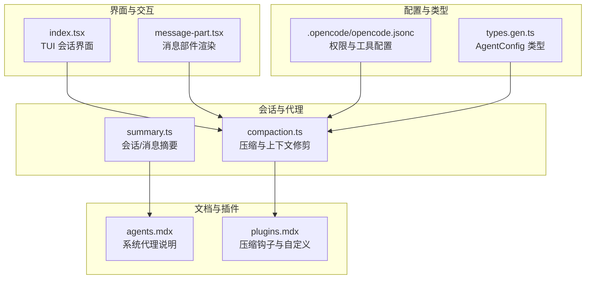
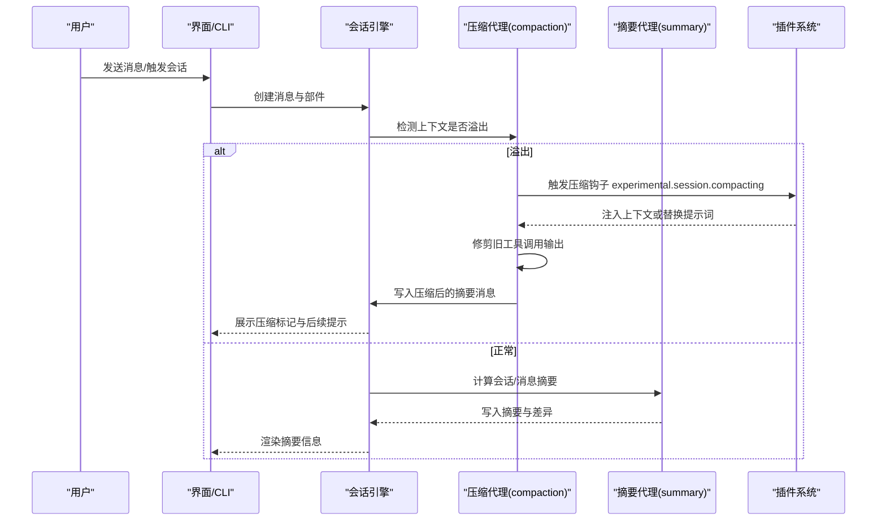
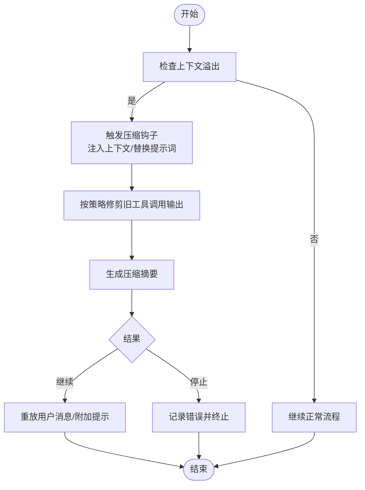
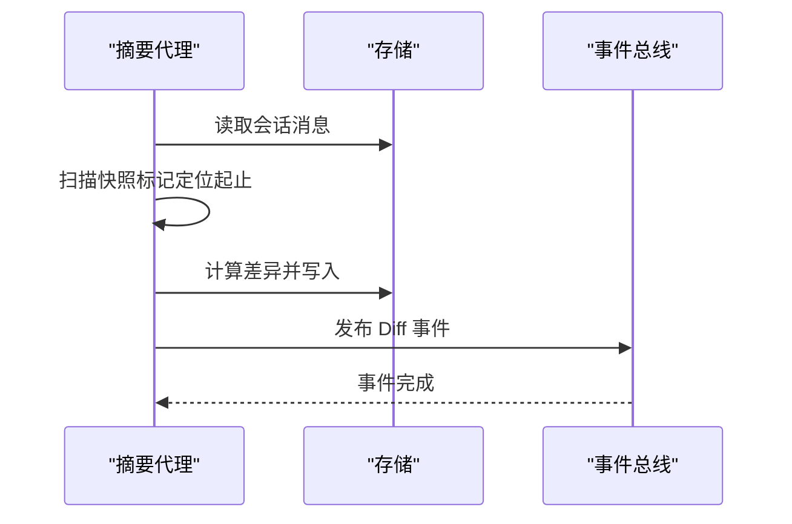
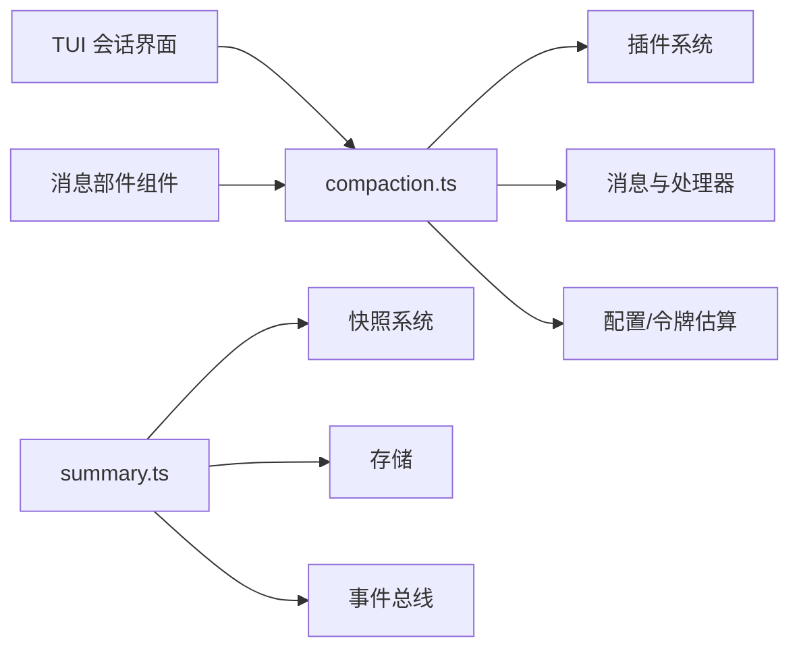

# 系统代理

<cite>
**本文引用的文件**
- [compaction.ts](file://packages/opencode/src/session/compaction.ts)
- [summary.ts](file://packages/opencode/src/session/summary.ts)
- [plugins.mdx](file://packages/web/src/content/docs/plugins.mdx)
- [agents.mdx](file://packages/web/src/content/docs/agents.mdx)
- [index.tsx](file://packages/opencode/src/cli/cmd/tui/routes/session/index.tsx)
- [message-part.tsx](file://packages/ui/src/components/message-part.tsx)
- [github.ts](file://packages/opencode/src/cli/cmd/github.ts)
- [opencode.jsonc](file://.opencode/opencode.jsonc)
- [types.gen.ts](file://packages/sdk/js/src/gen/types.gen.ts)
</cite>

## 目录
1. [简介](#简介)
2. [项目结构](#项目结构)
3. [核心组件](#核心组件)
4. [架构总览](#架构总览)
5. [详细组件分析](#详细组件分析)
6. [依赖关系分析](#依赖关系分析)
7. [性能考量](#性能考量)
8. [故障排查指南](#故障排查指南)
9. [结论](#结论)
10. [附录](#附录)

## 简介
本文件面向 OpenCode 的“系统代理”能力，重点覆盖三大隐藏代理：compaction（压缩）、title（标题生成）、summary（摘要）。我们将从系统内部流程、与用户代理的协作方式、配置选项、触发条件与维护注意事项等维度进行深入说明，并提供可操作的使用示例，帮助在项目管理与文档生成场景中高效落地。

## 项目结构
围绕系统代理的关键实现与文档分布如下：
- 核心实现位于会话模块：compaction 压缩逻辑、summary 摘要计算
- 文档与国际化说明：agents.mdx 与 plugins.mdx
- UI 展示与交互：TUI 会话界面与 UI 组件
- 配置与类型：opencode.jsonc 与 SDK 类型定义

图表来源
- [compaction.ts:1-330](file://packages/opencode/src/session/compaction.ts#L1-L330)
- [summary.ts:1-163](file://packages/opencode/src/session/summary.ts#L1-L163)
- [plugins.mdx:350-389](file://packages/web/src/content/docs/plugins.mdx#L350-L389)
- [agents.mdx:76-122](file://packages/web/src/content/docs/agents.mdx#L76-L122)
- [index.tsx:1314-1322](file://packages/opencode/src/cli/cmd/tui/routes/session/index.tsx#L1314-L1322)
- [message-part.tsx:1646-1680](file://packages/ui/src/components/message-part.tsx#L1646-L1680)
- [opencode.jsonc:1-19](file://.opencode/opencode.jsonc#L1-L19)
- [types.gen.ts:975-1026](file://packages/sdk/js/src/gen/types.gen.ts#L975-L1026)

章节来源
- [compaction.ts:1-330](file://packages/opencode/src/session/compaction.ts#L1-L330)
- [summary.ts:1-163](file://packages/opencode/src/session/summary.ts#L1-L163)
- [plugins.mdx:350-389](file://packages/web/src/content/docs/plugins.mdx#L350-L389)
- [agents.mdx:76-122](file://packages/web/src/content/docs/agents.mdx#L76-L122)
- [index.tsx:1314-1322](file://packages/opencode/src/cli/cmd/tui/routes/session/index.tsx#L1314-L1322)
- [message-part.tsx:1646-1680](file://packages/ui/src/components/message-part.tsx#L1646-L1680)
- [opencode.jsonc:1-19](file://.opencode/opencode.jsonc#L1-L19)
- [types.gen.ts:975-1026](file://packages/sdk/js/src/gen/types.gen.ts#L975-L1026)

## 核心组件
- compaction（压缩代理）
  - 自动检测上下文溢出并进行压缩；支持插件注入上下文或完全替换压缩提示词；可按策略修剪旧工具调用输出以降低 token 占用。
- title（标题生成代理）
  - 隐藏的系统代理，自动生成简短会话标题，供 UI 与导航使用。
- summary（摘要代理）
  - 计算会话与消息级别的摘要，包括文件变更统计与差异快照，支撑项目进度与成果追踪。

章节来源
- [compaction.ts:19-49](file://packages/opencode/src/session/compaction.ts#L19-L49)
- [summary.ts:70-113](file://packages/opencode/src/session/summary.ts#L70-L113)
- [agents.mdx:76-122](file://packages/web/src/content/docs/agents.mdx#L76-L122)

## 架构总览
系统代理在会话生命周期中的位置与交互如下：

图表来源
- [compaction.ts:33-49](file://packages/opencode/src/session/compaction.ts#L33-L49)
- [compaction.ts:168-202](file://packages/opencode/src/session/compaction.ts#L168-L202)
- [compaction.ts:59-100](file://packages/opencode/src/session/compaction.ts#L59-L100)
- [summary.ts:70-113](file://packages/opencode/src/session/summary.ts#L70-L113)

## 详细组件分析

### 组件一：compaction（压缩代理）
- 功能职责
  - 上下文溢出检测与自动压缩
  - 插件钩子注入领域上下文或完全替换压缩提示词
  - 基于策略的工具调用输出修剪，保护关键步骤，降低 token 占用
  - 在 UI 中以“压缩”标记呈现，便于识别与处理
- 关键流程
  - 溢出判断：基于模型上下文限制与保留输出估算
  - 压缩执行：构造压缩提示词，调用处理器生成摘要
  - 后续动作：根据结果决定继续对话或停止并返回错误
- 触发条件
  - 当会话消息总 token 超过可用上下文阈值时自动触发
  - 可通过配置禁用自动压缩或调整保留输出
- 维护要点
  - 合理设置保留输出，避免压缩后无法继续工作
  - 利用插件钩子注入业务上下文，提升压缩质量
  - 注意修剪策略对工具调用输出的影响，确保关键步骤可追溯

图表来源
- [compaction.ts:33-49](file://packages/opencode/src/session/compaction.ts#L33-L49)
- [compaction.ts:168-202](file://packages/opencode/src/session/compaction.ts#L168-L202)
- [compaction.ts:59-100](file://packages/opencode/src/session/compaction.ts#L59-L100)
- [compaction.ts:225-295](file://packages/opencode/src/session/compaction.ts#L225-L295)

章节来源
- [compaction.ts:33-49](file://packages/opencode/src/session/compaction.ts#L33-L49)
- [compaction.ts:59-100](file://packages/opencode/src/session/compaction.ts#L59-L100)
- [compaction.ts:102-295](file://packages/opencode/src/session/compaction.ts#L102-L295)
- [plugins.mdx:350-389](file://packages/web/src/content/docs/plugins.mdx#L350-L389)
- [index.tsx:1314-1322](file://packages/opencode/src/cli/cmd/tui/routes/session/index.tsx#L1314-L1322)

### 组件二：title（标题生成代理）
- 功能职责
  - 自动生成简短的会话标题，便于 UI 展示与导航
  - 作为隐藏系统代理，自动运行且不可在 UI 中选择
- 使用场景
  - 多会话并行时快速识别各会话主题
  - 项目看板与历史记录中的标题化呈现
- 配置与集成
  - 通过 AgentConfig 的模式字段控制代理角色
  - UI 组件根据子代理类型与描述动态渲染标题与副标题

章节来源
- [agents.mdx:76-122](file://packages/web/src/content/docs/agents.mdx#L76-L122)
- [message-part.tsx:1646-1680](file://packages/ui/src/components/message-part.tsx#L1646-L1680)
- [types.gen.ts:975-1026](file://packages/sdk/js/src/gen/types.gen.ts#L975-L1026)

### 组件三：summary（摘要代理）
- 功能职责
  - 计算会话级别与消息级别的摘要，包括新增/删除行数与文件数量
  - 生成快照差异，支持文件路径转义与缓存更新
- 数据流
  - 扫描会话消息中的快照标记，确定起止快照
  - 计算完整差异并写入存储，同时发布差异事件
- 应用场景
  - 项目进度可视化与成果归档
  - 团队协作中的变更追踪与审计

图表来源
- [summary.ts:84-113](file://packages/opencode/src/session/summary.ts#L84-L113)
- [summary.ts:136-161](file://packages/opencode/src/session/summary.ts#L136-L161)

章节来源
- [summary.ts:70-113](file://packages/opencode/src/session/summary.ts#L70-L113)
- [summary.ts:115-134](file://packages/opencode/src/session/summary.ts#L115-L134)
- [summary.ts:136-161](file://packages/opencode/src/session/summary.ts#L136-L161)

## 依赖关系分析
- compaction 依赖
  - 插件系统：通过钩子注入上下文或替换提示词
  - 会话消息与处理器：构建压缩提示词并执行模型调用
  - 配置与令牌估算：决定是否压缩与保留输出
- summary 依赖
  - 快照系统：计算文件差异
  - 存储与事件总线：持久化差异并广播事件
- UI 依赖
  - TUI 会话界面：展示压缩标记
  - 消息部件组件：渲染标题与副标题

图表来源
- [compaction.ts:1-330](file://packages/opencode/src/session/compaction.ts#L1-L330)
- [summary.ts:1-163](file://packages/opencode/src/session/summary.ts#L1-L163)
- [index.tsx:1314-1322](file://packages/opencode/src/cli/cmd/tui/routes/session/index.tsx#L1314-L1322)
- [message-part.tsx:1646-1680](file://packages/ui/src/components/message-part.tsx#L1646-L1680)

章节来源
- [compaction.ts:1-330](file://packages/opencode/src/session/compaction.ts#L1-L330)
- [summary.ts:1-163](file://packages/opencode/src/session/summary.ts#L1-L163)
- [index.tsx:1314-1322](file://packages/opencode/src/cli/cmd/tui/routes/session/index.tsx#L1314-L1322)
- [message-part.tsx:1646-1680](file://packages/ui/src/components/message-part.tsx#L1646-L1680)

## 性能考量
- 上下文溢出阈值与保留输出
  - 合理设置保留输出，避免压缩后无法继续工作
  - 根据模型上下文限制与输出上限动态计算可用空间
- 工具调用输出修剪
  - 保护关键工具（如技能类）输出，避免影响后续工作
  - 控制修剪最小阈值与保护阈值，平衡性能与可追溯性
- 插件钩子开销
  - 注入上下文应尽量精简，避免增加额外 token 与延迟
  - 替换提示词时需确保格式与模板兼容

## 故障排查指南
- 常见问题
  - 压缩后仍超限：检查保留输出设置与上下文修剪策略
  - 压缩失败或报错：查看压缩钩子输出是否被正确注入或替换
  - 摘要缺失或不准确：确认快照标记是否存在，存储读写是否成功
- 排查步骤
  - 查看会话消息中压缩标记与错误信息
  - 检查插件钩子返回的上下文或提示词
  - 核对配置文件中的权限与工具开关
- 相关实现参考
  - 压缩错误处理与停止逻辑
  - 摘要差异计算与事件发布

章节来源
- [compaction.ts:225-295](file://packages/opencode/src/session/compaction.ts#L225-L295)
- [summary.ts:84-113](file://packages/opencode/src/session/summary.ts#L84-L113)
- [github.ts:977-983](file://packages/opencode/src/cli/cmd/github.ts#L977-L983)

## 结论
compaction、title、summary 三大系统代理在 OpenCode 中承担了“压缩上下文、生成标题、计算摘要”的关键职责。通过插件钩子与配置项，系统在保证自动化的同时提供了灵活的定制能力。结合 UI 展示与事件总线，这些代理有效支撑了多会话并行、项目进度追踪与团队协作场景。

## 附录

### 使用示例（项目管理与文档生成）
- 场景一：多轮开发会话压缩
  - 当会话中包含大量媒体附件导致上下文超限时，系统自动触发压缩代理，移除媒体并生成继续提示，保障对话连续性。
- 场景二：跨代理协作与恢复
  - 压缩代理生成的结构化摘要可被其他代理读取并继续工作，实现多代理协同与任务交接。
- 场景三：项目进度与成果归档
  - 摘要代理计算文件变更与差异，形成可检索的项目进展记录，便于文档生成与审计。

章节来源
- [compaction.ts:174-200](file://packages/opencode/src/session/compaction.ts#L174-L200)
- [summary.ts:84-99](file://packages/opencode/src/session/summary.ts#L84-L99)

### 配置选项与触发条件
- compaction 自动压缩
  - 配置项：可通过配置禁用自动压缩或调整保留输出
  - 触发条件：消息总 token 超过可用上下文阈值
- 压缩钩子
  - 钩子名称：experimental.session.compacting
  - 行为：注入上下文或替换默认提示词
- 权限与工具
  - 配置文件：opencode.jsonc 中的权限与工具开关
  - 类型定义：AgentConfig 支持模式、工具与权限配置

章节来源
- [compaction.ts:33-49](file://packages/opencode/src/session/compaction.ts#L33-L49)
- [plugins.mdx:350-389](file://packages/web/src/content/docs/plugins.mdx#L350-L389)
- [opencode.jsonc:1-19](file://.opencode/opencode.jsonc#L1-L19)
- [types.gen.ts:975-1026](file://packages/sdk/js/src/gen/types.gen.ts#L975-L1026)