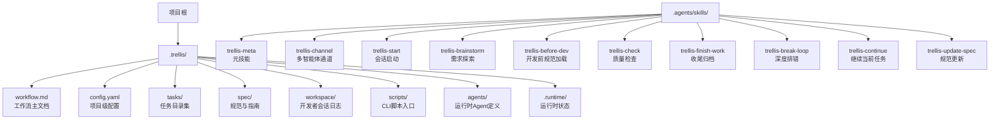
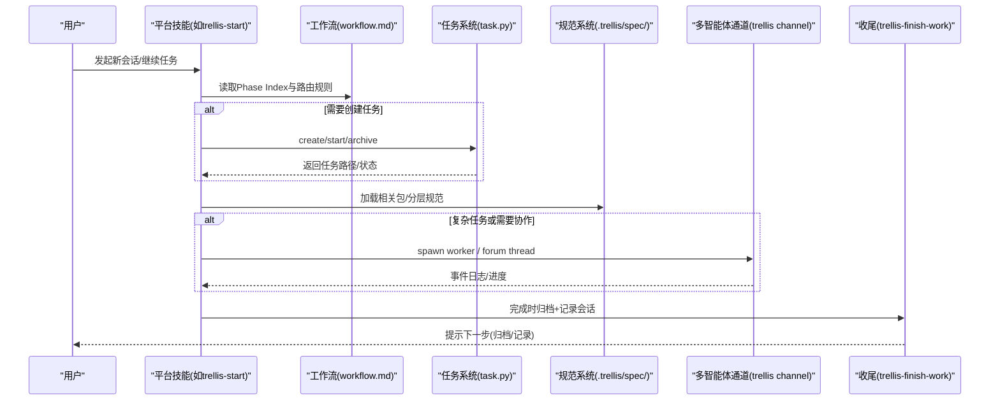
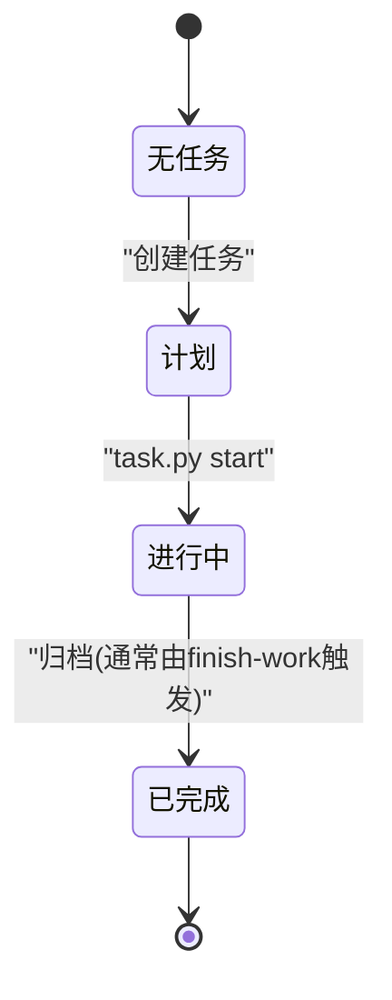
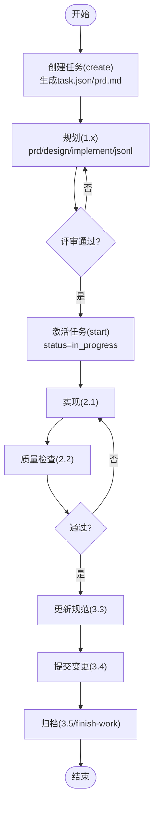
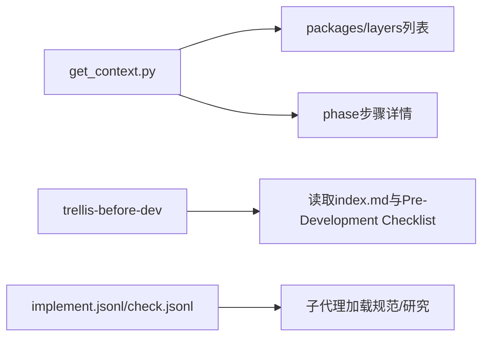
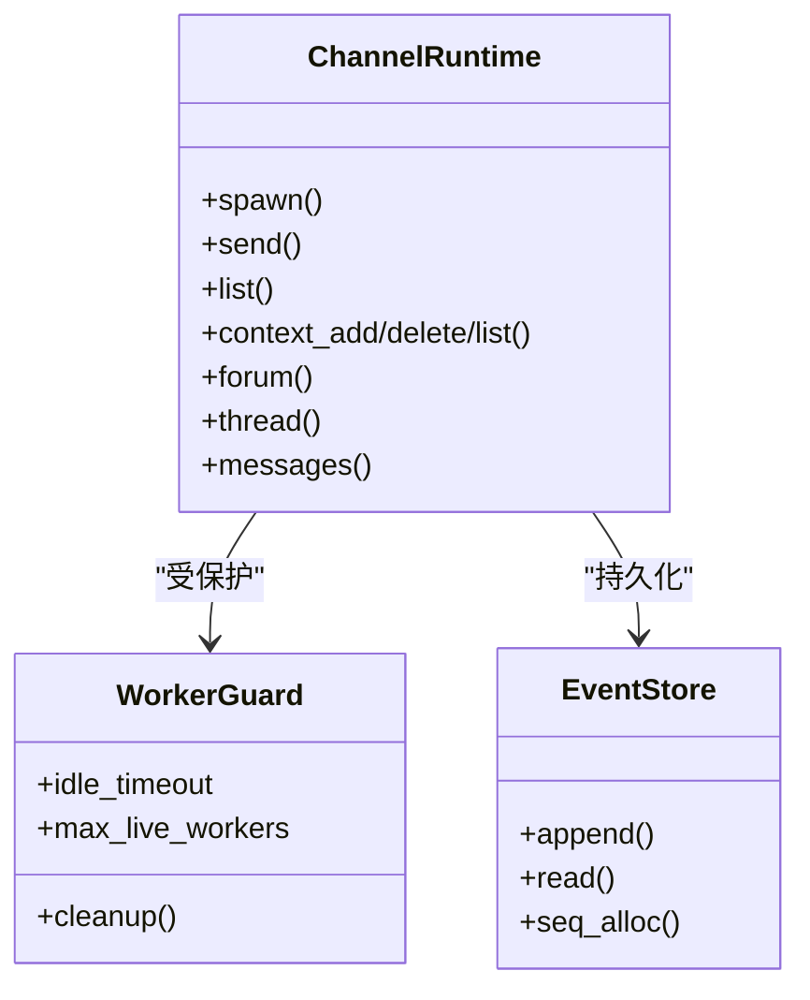
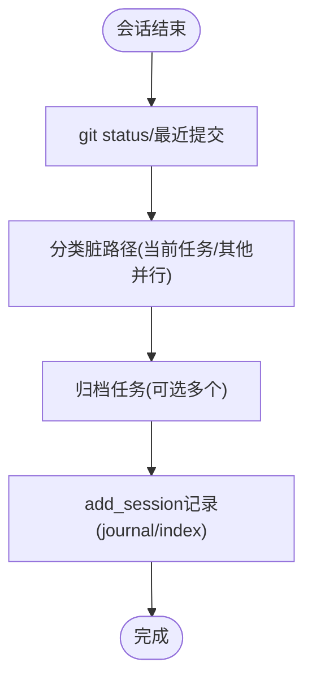
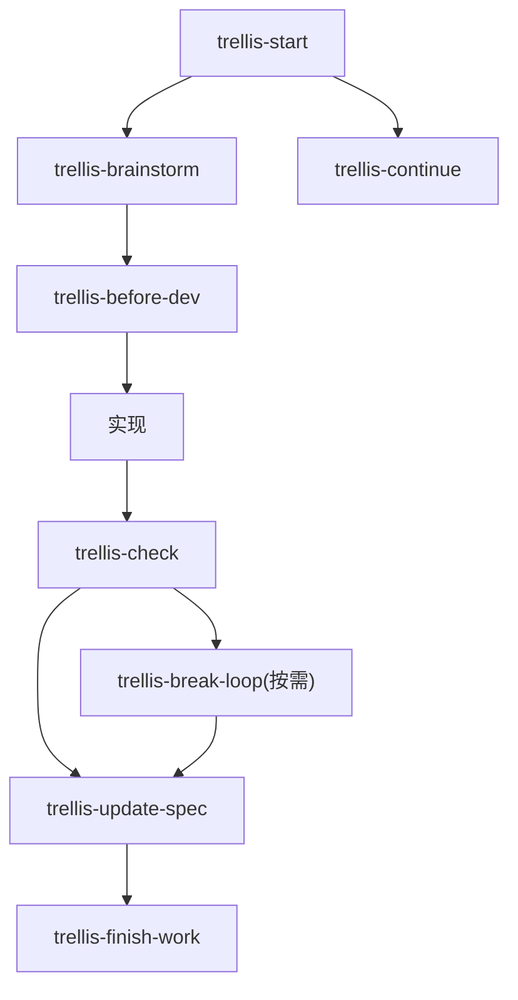
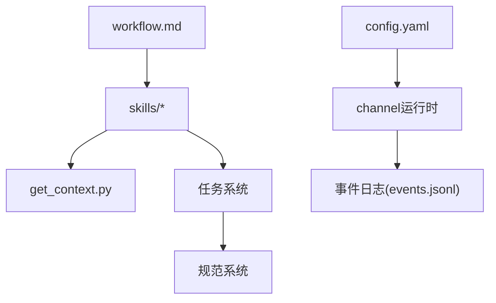

# Trellis工作流系统

<cite>
**本文引用的文件**
- [.trellis/workflow.md](file://.trellis/workflow.md)
- [.trellis/config.yaml](file://.trellis/config.yaml)
- [.agents/skills/trellis-meta/SKILL.md](file://.agents/skills/trellis-meta/SKILL.md)
- [.agents/skills/trellis-channel/SKILL.md](file://.agents/skills/trellis-channel/SKILL.md)
- [.agents/skills/trellis-start/SKILL.md](file://.agents/skills/trellis-start/SKILL.md)
- [.agents/skills/trellis-brainstorm/SKILL.md](file://.agents/skills/trellis-brainstorm/SKILL.md)
- [.agents/skills/trellis-before-dev/SKILL.md](file://.agents/skills/trellis-before-dev/SKILL.md)
- [.agents/skills/trellis-check/SKILL.md](file://.agents/skills/trellis-check/SKILL.md)
- [.agents/skills/trellis-finish-work/SKILL.md](file://.agents/skills/trellis-finish-work/SKILL.md)
- [.agents/skills/trellis-break-loop/SKILL.md](file://.agents/skills/trellis-break-loop/SKILL.md)
- [.agents/skills/trellis-continue/SKILL.md](file://.agents/skills/trellis-continue/SKILL.md)
- [.agents/skills/trellis-update-spec/SKILL.md](file://.agents/skills/trellis-update-spec/SKILL.md)
</cite>

## 目录
1. [简介](#简介)
2. [项目结构](#项目结构)
3. [核心组件](#核心组件)
4. [架构总览](#架构总览)
5. [详细组件分析](#详细组件分析)
6. [依赖关系分析](#依赖关系分析)
7. [性能与可扩展性](#性能与可扩展性)
8. [故障排查指南](#故障排查指南)
9. [结论](#结论)
10. [附录](#附录)

## 简介
Trellis工作流系统是一套面向AI辅助开发的本地化、可定制、跨平台的工作流与协作运行时。它以“先规划后实现”的三阶段流程为核心，结合任务管理、规范注入、会话记录与多智能体协作通道，确保在复杂工程中也能稳定产出高质量代码并沉淀团队知识。

- 核心理念：先计划再编码；规范通过钩子/技能注入而非记忆；一切持久化到文件；增量推进；每次任务后复盘并更新规范。
- 三阶段流程：计划（Phase 1）→ 执行（Phase 2）→ 收尾（Phase 3）。
- 关键能力：
  - 任务生命周期与父子树
  - 规范体系与上下文注入
  - 会话日志与跨会话记忆
  - 多智能体协作通道（论坛/线程、工人进程、OOM保护、幂等键）
  - 平台适配（Claude Code、Cursor、OpenCode、Codex、Kiro、Gemini、Qoder、CodeBuddy、Copilot、Droid、Pi、ZCode、Reasonix、Trae等）

章节来源
- [.trellis/workflow.md:1-12](file://.trellis/workflow.md#L1-L12)

## 项目结构
Trellis在用户项目中以“.trellis/”为根，承载工作流、配置、任务、规范、工作区、脚本与运行时状态；同时通过“.agents/skills/”提供可被平台自动分发的技能集合。

图表来源
- [.trellis/workflow.md:1-12](file://.trellis/workflow.md#L1-L12)
- [.trellis/config.yaml:1-171](file://.trellis/config.yaml#L1-L171)
- [.agents/skills/trellis-meta/SKILL.md:1-86](file://.agents/skills/trellis-meta/SKILL.md#L1-L86)

章节来源
- [.trellis/workflow.md:1-12](file://.trellis/workflow.md#L1-L12)
- [.trellis/config.yaml:1-171](file://.trellis/config.yaml#L1-L171)
- [.agents/skills/trellis-meta/SKILL.md:1-86](file://.agents/skills/trellis-meta/SKILL.md#L1-L86)

## 核心组件
- 工作流主文档（workflow.md）：定义三阶段流程、每步要求、路由规则、[workflow-state:*]面包屑契约、以及自定义扩展点。
- 项目配置（config.yaml）：会话记录策略、自动提交开关、任务生命周期钩子、包清单、通道工人保护、Codex分发模式等。
- 技能层（.agents/skills/*）：将工作流步骤封装为可被平台识别的技能，如脑暴、规范加载、检查、收尾、继续、更新规范等。
- 多智能体通道（trellis channel）：基于JSONL事件日志的本地协作运行时，支持论坛/线程、工人进程、中断调试、进度查看、OOM保护与幂等键。
- 任务系统：每个任务一个目录，包含prd/design/implement/research与jsonl上下文清单，支持父子树、活跃任务指针与归档。
- 规范系统：按包与分层组织，index.md作为入口，指引具体规范文件；可通过注册表刷新。
- 会话与工作区：journal轮转、索引、跨会话检索（mem），用于沉淀经验与回溯。

章节来源
- [.trellis/workflow.md:144-306](file://.trellis/workflow.md#L144-L306)
- [.trellis/config.yaml:1-171](file://.trellis/config.yaml#L1-L171)
- [.agents/skills/trellis-channel/SKILL.md:1-68](file://.agents/skills/trellis-channel/SKILL.md#L1-L68)
- [.agents/skills/trellis-meta/SKILL.md:1-86](file://.agents/skills/trellis-meta/SKILL.md#L1-L86)

## 架构总览
下图展示了从用户请求到落地归档的整体流程，包括平台技能路由、工作流状态、任务与规范注入、多智能体通道与收尾归档。

图表来源
- [.trellis/workflow.md:144-306](file://.trellis/workflow.md#L144-L306)
- [.agents/skills/trellis-start/SKILL.md:1-65](file://.agents/skills/trellis-start/SKILL.md#L1-L65)
- [.agents/skills/trellis-channel/SKILL.md:1-68](file://.agents/skills/trellis-channel/SKILL.md#L1-L68)
- [.agents/skills/trellis-finish-work/SKILL.md:1-72](file://.agents/skills/trellis-finish-work/SKILL.md#L1-L72)

## 详细组件分析

### 工作流与状态机（workflow.md）
- 三阶段：计划（1）、执行（2）、收尾（3）。每阶段有明确步骤、门槛与回滚路径。
- 面包屑契约：通过[workflow-state:*]块驱动平台Hook在每个回合注入当前步骤提示，保证强制步骤不被跳过。
- 平台差异：支持sub-agent派发与inline两种模式（例如Codex inline直接编辑，避免隔离导致无法继承任务上下文）。
- 自定义：允许新增状态块、生命周期钩子、调整步骤含义与提示文本。

图表来源
- [.trellis/workflow.md:174-261](file://.trellis/workflow.md#L174-L261)

章节来源
- [.trellis/workflow.md:144-306](file://.trellis/workflow.md#L144-L306)
- [.trellis/workflow.md:646-709](file://.trellis/workflow.md#L646-L709)

### 任务系统（tasks/ + task.py）
- 任务目录：包含task.json、prd.md、可选design.md/implement.md、research/、implement.jsonl/check.jsonl。
- 生命周期：create → start（进入in_progress）→ archive（归档，清理活跃指针）。
- 父子树：parent/child用于拆分独立可验证交付物；依赖顺序写在子任务制品中而非树位置。
- 上下文清单：sub-agent模式下，通过jsonl预注册规范与研究文件，供实现/检查子代理加载。

图表来源
- [.trellis/workflow.md:40-76](file://.trellis/workflow.md#L40-L76)
- [.trellis/workflow.md:308-467](file://.trellis/workflow.md#L308-L467)
- [.trellis/workflow.md:566-644](file://.trellis/workflow.md#L566-L644)

章节来源
- [.trellis/workflow.md:40-76](file://.trellis/workflow.md#L40-L76)
- [.trellis/workflow.md:308-467](file://.trellis/workflow.md#L308-L467)
- [.trellis/workflow.md:566-644](file://.trellis/workflow.md#L566-L644)

### 规范系统与上下文注入（spec/ + get_context.py）
- 结构：按包与分层组织，index.md作为入口，链接具体规范文件。
- 注入时机：开发前（before-dev）、实现/检查子代理（jsonl清单）、阶段详情（get_context --mode phase）。
- 刷新机制：支持registry.spec源拉取，本地修改冲突通过模板哈希检测。

图表来源
- [.agents/skills/trellis-before-dev/SKILL.md:1-41](file://.agents/skills/trellis-before-dev/SKILL.md#L1-L41)
- [.agents/skills/trellis-check/SKILL.md:1-99](file://.agents/skills/trellis-check/SKILL.md#L1-L99)
- [.trellis/workflow.md:381-428](file://.trellis/workflow.md#L381-L428)

章节来源
- [.agents/skills/trellis-before-dev/SKILL.md:1-41](file://.agents/skills/trellis-before-dev/SKILL.md#L1-L41)
- [.agents/skills/trellis-check/SKILL.md:1-99](file://.agents/skills/trellis-check/SKILL.md#L1-L99)
- [.trellis/workflow.md:381-428](file://.trellis/workflow.md#L381-L428)

### 多智能体协作通道（trellis channel）
- 用途：跨agent对话、spawn worker、中断/调试、论坛/线程、进度查看。
- 存储：~/.trellis/channels/<project>/<channel>/events.jsonl，项目级事件日志。
- 安全与健壮性：OOM保护（空闲超时、最大并发）、幂等键、序列号与文件锁。
- 使用建议：优先使用forum/thread命令与messages查看，不要直接解析events.jsonl；使用--kind done/turn_finished作为完成信号。

图表来源
- [.agents/skills/trellis-channel/SKILL.md:1-68](file://.agents/skills/trellis-channel/SKILL.md#L1-L68)
- [.trellis/config.yaml:94-98](file://.trellis/config.yaml#L94-L98)
- [.agents/skills/trellis-meta/SKILL.md:10-76](file://.agents/skills/trellis-meta/SKILL.md#L10-L76)

章节来源
- [.agents/skills/trellis-channel/SKILL.md:1-68](file://.agents/skills/trellis-channel/SKILL.md#L1-L68)
- [.trellis/config.yaml:94-98](file://.trellis/config.yaml#L94-L98)
- [.agents/skills/trellis-meta/SKILL.md:10-76](file://.agents/skills/trellis-meta/SKILL.md#L10-L76)

### 会话与工作区（workspace/ + add_session.py）
- journal轮转：单文件最大行数限制，超出自动新建。
- 索引与统计：个人index维护会话总数与最近活跃时间。
- 记录时机：finish-work阶段记录本次会话摘要与关联commit hash。

图表来源
- [.agents/skills/trellis-finish-work/SKILL.md:1-72](file://.agents/skills/trellis-finish-work/SKILL.md#L1-L72)
- [.trellis/workflow.md:78-87](file://.trellis/workflow.md#L78-L87)

章节来源
- [.agents/skills/trellis-finish-work/SKILL.md:1-72](file://.agents/skills/trellis-finish-work/SKILL.md#L1-L72)
- [.trellis/workflow.md:78-87](file://.trellis/workflow.md#L78-L87)

### 技能路由与编排（skills/*）
- trellis-start：初始化会话上下文、决定下一步动作。
- trellis-brainstorm：需求探索与PRD收敛，必要时产出design/implement。
- trellis-before-dev：开发前加载规范与检查清单。
- trellis-check：质量检查（lint/type/test/跨层一致性）。
- trellis-break-loop：深度排错与预防机制设计。
- trellis-update-spec：将经验固化为可执行的code-spec。
- trellis-continue：恢复上次任务，定位到正确阶段与步骤。
- trellis-finish-work：收尾归档与会话记录。

图表来源
- [.agents/skills/trellis-start/SKILL.md:1-65](file://.agents/skills/trellis-start/SKILL.md#L1-L65)
- [.agents/skills/trellis-brainstorm/SKILL.md:1-174](file://.agents/skills/trellis-brainstorm/SKILL.md#L1-L174)
- [.agents/skills/trellis-before-dev/SKILL.md:1-41](file://.agents/skills/trellis-before-dev/SKILL.md#L1-L41)
- [.agents/skills/trellis-check/SKILL.md:1-99](file://.agents/skills/trellis-check/SKILL.md#L1-L99)
- [.agents/skills/trellis-break-loop/SKILL.md:1-189](file://.agents/skills/trellis-break-loop/SKILL.md#L1-L189)
- [.agents/skills/trellis-update-spec/SKILL.md:1-357](file://.agents/skills/trellis-update-spec/SKILL.md#L1-L357)
- [.agents/skills/trellis-finish-work/SKILL.md:1-72](file://.agents/skills/trellis-finish-work/SKILL.md#L1-L72)

章节来源
- [.agents/skills/trellis-start/SKILL.md:1-65](file://.agents/skills/trellis-start/SKILL.md#L1-L65)
- [.agents/skills/trellis-brainstorm/SKILL.md:1-174](file://.agents/skills/trellis-brainstorm/SKILL.md#L1-L174)
- [.agents/skills/trellis-before-dev/SKILL.md:1-41](file://.agents/skills/trellis-before-dev/SKILL.md#L1-L41)
- [.agents/skills/trellis-check/SKILL.md:1-99](file://.agents/skills/trellis-check/SKILL.md#L1-L99)
- [.agents/skills/trellis-break-loop/SKILL.md:1-189](file://.agents/skills/trellis-break-loop/SKILL.md#L1-L189)
- [.agents/skills/trellis-update-spec/SKILL.md:1-357](file://.agents/skills/trellis-update-spec/SKILL.md#L1-L357)
- [.agents/skills/trellis-finish-work/SKILL.md:1-72](file://.agents/skills/trellis-finish-work/SKILL.md#L1-L72)

## 依赖关系分析
- 工作流与配置：workflow.md是运行时契约，config.yaml提供项目级开关（如codex.dispatch_mode、channel.worker_guard）。
- 技能与工作流：各技能对应工作流步骤，通过get_context.py动态加载阶段详情与包/分层信息。
- 通道与工人：channel运行时依赖config中的worker_guard参数进行资源保护。
- 任务与规范：任务制品（prd/design/implement/jsonl）与规范体系共同构成实现与检查的输入。

图表来源
- [.trellis/workflow.md:144-306](file://.trellis/workflow.md#L144-L306)
- [.trellis/config.yaml:94-98](file://.trellis/config.yaml#L94-L98)
- [.agents/skills/trellis-channel/SKILL.md:1-68](file://.agents/skills/trellis-channel/SKILL.md#L1-L68)

章节来源
- [.trellis/workflow.md:144-306](file://.trellis/workflow.md#L144-L306)
- [.trellis/config.yaml:94-98](file://.trellis/config.yaml#L94-L98)
- [.agents/skills/trellis-channel/SKILL.md:1-68](file://.agents/skills/trellis-channel/SKILL.md#L1-L68)

## 性能与可扩展性
- 通道工人保护：通过idle_timeout与max_live_workers控制并发与闲置清理，防止OOM与资源泄漏。
- 会话日志轮转：单文件行数上限避免大文件读写开销。
- 规范加载优化：通过index与jsonl清单精准注入，减少无关上下文。
- 可扩展点：
  - 自定义workflow-state块与生命周期钩子
  - 新增bundled skill（通过模板机制分发至各平台）
  - 调整codex.dispatch_mode以适配不同平台特性

章节来源
- [.trellis/config.yaml:94-98](file://.trellis/config.yaml#L94-L98)
- [.trellis/workflow.md:646-709](file://.trellis/workflow.md#L646-L709)
- [.agents/skills/trellis-meta/SKILL.md:66-76](file://.agents/skills/trellis-meta/SKILL.md#L66-L76)

## 故障排查指南
- 面包屑不生效：检查[workflow-state:*]块是否匹配当前状态，确认平台Hook能解析该标签。
- 子代理未加载上下文：确认implement.jsonl/check.jsonl已包含真实条目（非_example种子行）。
- 通道卡住/无输出：使用progress/raw查看，检查--kind完成信号是否正确；关注OOM保护与退出码。
- 归档失败：确认工作区干净（仅保留本任务范围），否则回到3.4提交后再归档。
- 规范未更新：在check或break-loop后务必执行update-spec，确保知识沉淀。

章节来源
- [.trellis/workflow.md:174-261](file://.trellis/workflow.md#L174-L261)
- [.trellis/workflow.md:381-428](file://.trellis/workflow.md#L381-L428)
- [.agents/skills/trellis-channel/SKILL.md:42-68](file://.agents/skills/trellis-channel/SKILL.md#L42-L68)
- [.agents/skills/trellis-finish-work/SKILL.md:24-58](file://.agents/skills/trellis-finish-work/SKILL.md#L24-L58)
- [.agents/skills/trellis-check/SKILL.md:59-64](file://.agents/skills/trellis-check/SKILL.md#L59-L64)
- [.agents/skills/trellis-break-loop/SKILL.md:174-189](file://.agents/skills/trellis-break-loop/SKILL.md#L174-L189)

## 结论
Trellis工作流系统将“规划-实现-收尾”的流程标准化，并通过规范注入、任务制品、会话记录与多智能体通道形成闭环。其强约束与高可定制性使其既能保障复杂工程的质量，又能适应不同平台与团队的差异化需求。建议在团队内推广“先规划后实现”“持续更新规范”“善用通道协作”的最佳实践。

## 附录
- 快速参考：
  - 会话启动：trellis-start
  - 需求探索：trellis-brainstorm
  - 开发前规范：trellis-before-dev
  - 质量检查：trellis-check
  - 深度排错：trellis-break-loop
  - 规范更新：trellis-update-spec
  - 继续任务：trellis-continue
  - 收尾归档：trellis-finish-work
  - 多智能体通道：trellis channel

章节来源
- [.agents/skills/trellis-start/SKILL.md:1-65](file://.agents/skills/trellis-start/SKILL.md#L1-L65)
- [.agents/skills/trellis-brainstorm/SKILL.md:1-174](file://.agents/skills/trellis-brainstorm/SKILL.md#L1-L174)
- [.agents/skills/trellis-before-dev/SKILL.md:1-41](file://.agents/skills/trellis-before-dev/SKILL.md#L1-L41)
- [.agents/skills/trellis-check/SKILL.md:1-99](file://.agents/skills/trellis-check/SKILL.md#L1-L99)
- [.agents/skills/trellis-break-loop/SKILL.md:1-189](file://.agents/skills/trellis-break-loop/SKILL.md#L1-L189)
- [.agents/skills/trellis-update-spec/SKILL.md:1-357](file://.agents/skills/trellis-update-spec/SKILL.md#L1-L357)
- [.agents/skills/trellis-continue/SKILL.md:1-62](file://.agents/skills/trellis-continue/SKILL.md#L1-L62)
- [.agents/skills/trellis-finish-work/SKILL.md:1-72](file://.agents/skills/trellis-finish-work/SKILL.md#L1-L72)
- [.agents/skills/trellis-channel/SKILL.md:1-68](file://.agents/skills/trellis-channel/SKILL.md#L1-L68)