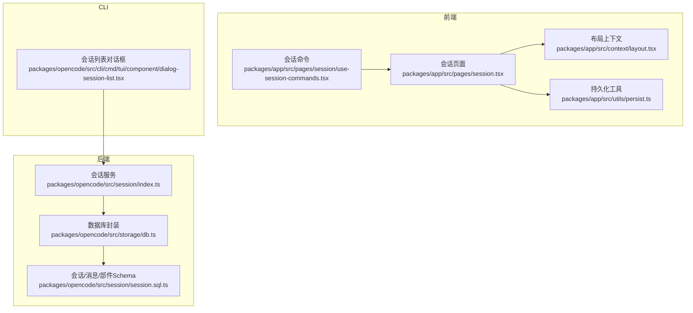
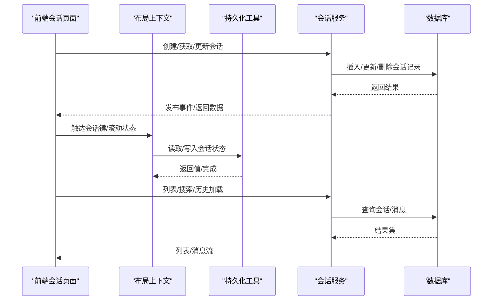
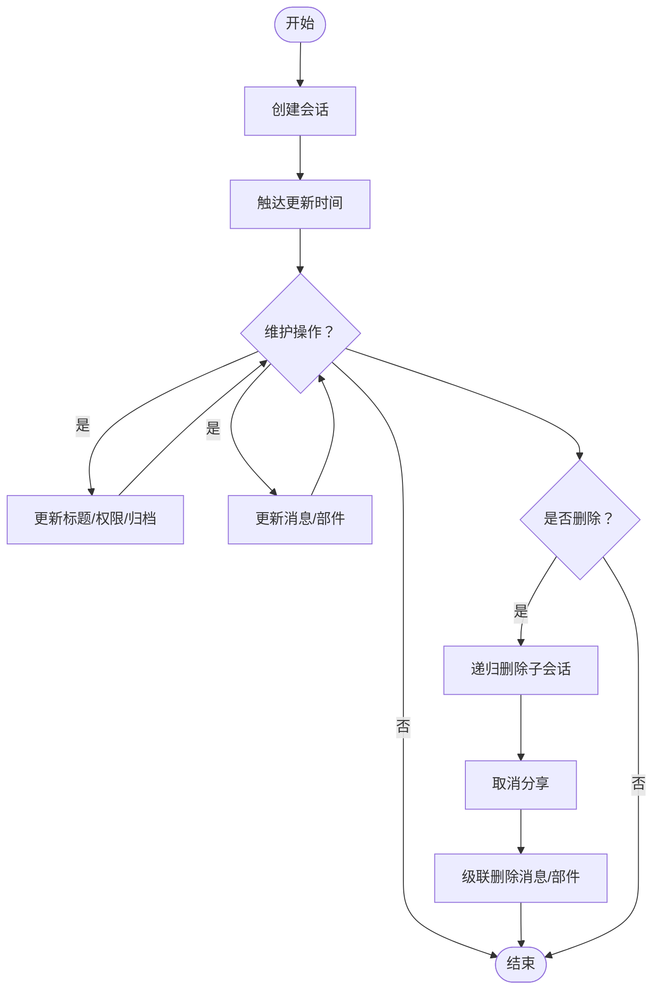
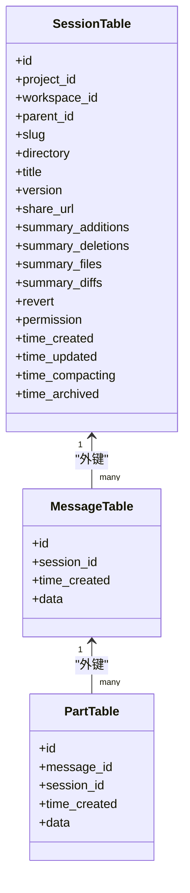
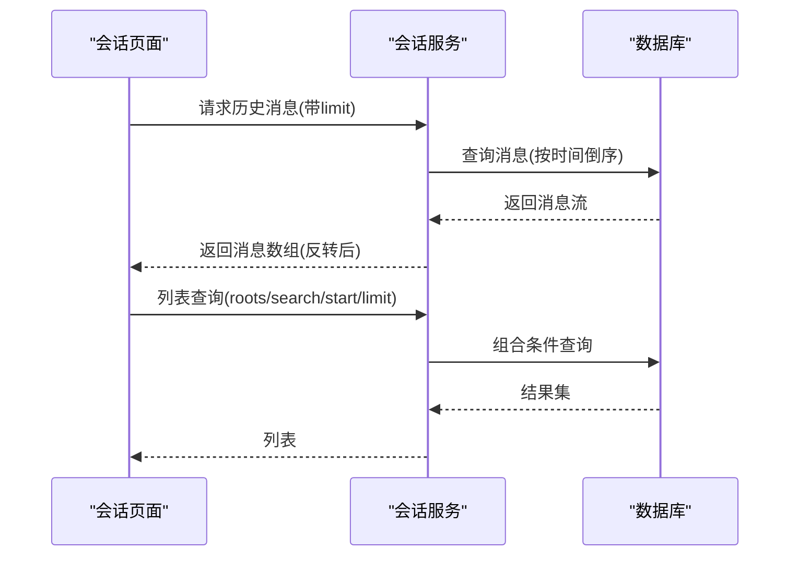
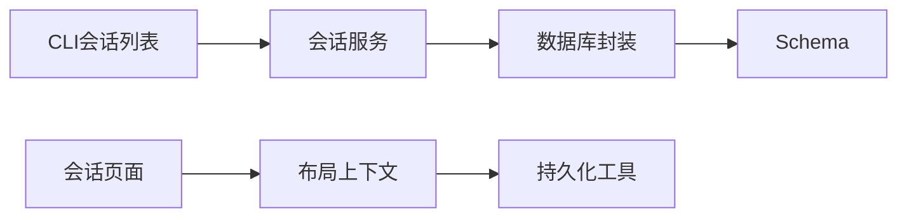

# 会话管理

<cite>
**本文档引用的文件**
- [packages/opencode/src/session/index.ts](file://packages/opencode/src/session/index.ts)
- [packages/opencode/src/session/session.sql.ts](file://packages/opencode/src/session/session.sql.ts)
- [packages/opencode/src/storage/db.ts](file://packages/opencode/src/storage/db.ts)
- [packages/app/src/utils/persist.ts](file://packages/app/src/utils/persist.ts)
- [packages/app/src/context/layout.tsx](file://packages/app/src/context/layout.tsx)
- [packages/app/src/pages/session.tsx](file://packages/app/src/pages/session.tsx)
- [packages/app/src/pages/session/use-session-commands.tsx](file://packages/app/src/pages/session/use-session-commands.tsx)
- [packages/opencode/src/cli/cmd/tui/component/dialog-session-list.tsx](file://packages/opencode/src/cli/cmd/tui/component/dialog-session-list.tsx)
- [packages/opencode/test/server/session-list.test.ts](file://packages/opencode/test/server/session-list.test.ts)
- [packages/opencode/test/server/global-session-list.test.ts](file://packages/opencode/test/server/global-session-list.test.ts)
- [packages/app/src/context/notification.tsx](file://packages/app/src/context/notification.tsx)
- [packages/app/src/pages/layout.tsx](file://packages/app/src/pages/layout.tsx)
</cite>

## 目录
1. [简介](#简介)
2. [项目结构](#项目结构)
3. [核心组件](#核心组件)
4. [架构总览](#架构总览)
5. [详细组件分析](#详细组件分析)
6. [依赖关系分析](#依赖关系分析)
7. [性能考量](#性能考量)
8. [故障排查指南](#故障排查指南)
9. [结论](#结论)
10. [附录](#附录)

## 简介
本文件面向OpenCode的会话管理系统，系统性阐述会话的创建、维护与销毁流程，会话数据的存储格式与持久化机制，历史记录管理、搜索与检索能力，多会话并发处理、会话间数据隔离与共享机制，以及性能优化、内存管理与清理策略，并提供会话迁移、导入导出与版本兼容性处理指南。

## 项目结构
OpenCode的会话管理横跨后端（会话核心逻辑与数据库）、前端（UI与持久化）与CLI工具三部分：
- 后端核心：会话业务逻辑、消息与部件模型、数据库Schema与事务封装
- 前端：会话页面、布局上下文、持久化工具、命令与交互
- CLI：会话列表对话框，支持搜索与筛选

**图表来源**
- [packages/opencode/src/session/index.ts:36-894](file://packages/opencode/src/session/index.ts#L36-L894)
- [packages/opencode/src/storage/db.ts:30-172](file://packages/opencode/src/storage/db.ts#L30-L172)
- [packages/opencode/src/session/session.sql.ts:14-104](file://packages/opencode/src/session/session.sql.ts#L14-L104)
- [packages/app/src/pages/session.tsx:300-800](file://packages/app/src/pages/session.tsx#L300-L800)
- [packages/app/src/context/layout.tsx:227-376](file://packages/app/src/context/layout.tsx#L227-L376)
- [packages/app/src/utils/persist.ts:337-465](file://packages/app/src/utils/persist.ts#L337-L465)
- [packages/app/src/pages/session/use-session-commands.tsx:420-496](file://packages/app/src/pages/session/use-session-commands.tsx#L420-L496)
- [packages/opencode/src/cli/cmd/tui/component/dialog-session-list.tsx:15-109](file://packages/opencode/src/cli/cmd/tui/component/dialog-session-list.tsx#L15-L109)

**章节来源**
- [packages/opencode/src/session/index.ts:36-894](file://packages/opencode/src/session/index.ts#L36-L894)
- [packages/opencode/src/storage/db.ts:30-172](file://packages/opencode/src/storage/db.ts#L30-L172)
- [packages/opencode/src/session/session.sql.ts:14-104](file://packages/opencode/src/session/session.sql.ts#L14-L104)
- [packages/app/src/pages/session.tsx:300-800](file://packages/app/src/pages/session.tsx#L300-L800)
- [packages/app/src/context/layout.tsx:227-376](file://packages/app/src/context/layout.tsx#L227-L376)
- [packages/app/src/utils/persist.ts:337-465](file://packages/app/src/utils/persist.ts#L337-L465)
- [packages/app/src/pages/session/use-session-commands.tsx:420-496](file://packages/app/src/pages/session/use-session-commands.tsx#L420-L496)
- [packages/opencode/src/cli/cmd/tui/component/dialog-session-list.tsx:15-109](file://packages/opencode/src/cli/cmd/tui/component/dialog-session-list.tsx#L15-L109)

## 核心组件
- 会话服务（Session Service）
  - 提供会话创建、获取、标题更新、归档、权限设置、分享/取消分享、消息与部件的增删改查、会话树（父子）管理、全局与项目内列表、历史窗口加载等能力
  - 关键接口路径参考：[packages/opencode/src/session/index.ts:219-894](file://packages/opencode/src/session/index.ts#L219-L894)
- 数据库与Schema
  - 使用SQLite（Bun）与Drizzle ORM，定义会话、消息、部件、待办、权限等表及索引
  - 关键Schema路径参考：[packages/opencode/src/session/session.sql.ts:14-104](file://packages/opencode/src/session/session.sql.ts#L14-L104)
  - 数据库初始化与迁移路径参考：[packages/opencode/src/storage/db.ts:30-172](file://packages/opencode/src/storage/db.ts#L30-L172)
- 前端会话页面与布局
  - 会话页面负责消息时间线渲染、历史窗口分页加载、滚动与回滚、撤销/重做、摘要与派生子会话等
  - 布局上下文负责会话键的触达与修剪、滚动状态持久化、会话标签页与视图状态管理
  - 关键路径参考：
    - [packages/app/src/pages/session.tsx:70-298](file://packages/app/src/pages/session.tsx#L70-L298)
    - [packages/app/src/context/layout.tsx:264-376](file://packages/app/src/context/layout.tsx#L264-L376)
- 持久化工具
  - 统一封装localStorage/前缀存储/桌面平台存储，支持缓存、配额溢出回收、迁移与合并
  - 关键路径参考：[packages/app/src/utils/persist.ts:337-465](file://packages/app/src/utils/persist.ts#L337-L465)
- CLI会话列表
  - 支持按标题搜索、按更新时间排序、删除/重命名等操作
  - 关键路径参考：[packages/opencode/src/cli/cmd/tui/component/dialog-session-list.tsx:15-109](file://packages/opencode/src/cli/cmd/tui/component/dialog-session-list.tsx#L15-L109)

**章节来源**
- [packages/opencode/src/session/index.ts:219-894](file://packages/opencode/src/session/index.ts#L219-L894)
- [packages/opencode/src/session/session.sql.ts:14-104](file://packages/opencode/src/session/session.sql.ts#L14-L104)
- [packages/opencode/src/storage/db.ts:30-172](file://packages/opencode/src/storage/db.ts#L30-L172)
- [packages/app/src/pages/session.tsx:70-298](file://packages/app/src/pages/session.tsx#L70-L298)
- [packages/app/src/context/layout.tsx:264-376](file://packages/app/src/context/layout.tsx#L264-L376)
- [packages/app/src/utils/persist.ts:337-465](file://packages/app/src/utils/persist.ts#L337-L465)
- [packages/opencode/src/cli/cmd/tui/component/dialog-session-list.tsx:15-109](file://packages/opencode/src/cli/cmd/tui/component/dialog-session-list.tsx#L15-L109)

## 架构总览
会话管理采用“后端服务 + 前端页面 + 持久化”的分层架构：
- 后端服务通过Drizzle ORM访问SQLite，提供会话与消息的CRUD、聚合查询与事件发布
- 前端页面通过全局同步与本地持久化结合，维护会话视图、滚动状态与标签页
- CLI提供会话列表与基本操作入口

**图表来源**
- [packages/app/src/pages/session.tsx:300-800](file://packages/app/src/pages/session.tsx#L300-L800)
- [packages/app/src/context/layout.tsx:322-376](file://packages/app/src/context/layout.tsx#L322-L376)
- [packages/app/src/utils/persist.ts:337-465](file://packages/app/src/utils/persist.ts#L337-L465)
- [packages/opencode/src/session/index.ts:524-723](file://packages/opencode/src/session/index.ts#L524-L723)
- [packages/opencode/src/storage/db.ts:134-172](file://packages/opencode/src/storage/db.ts#L134-L172)

## 详细组件分析

### 会话创建、维护与销毁
- 创建
  - 通过会话服务创建会话，生成唯一ID、slug、版本号与时间戳，必要时自动分享
  - 参考路径：[packages/opencode/src/session/index.ts:297-338](file://packages/opencode/src/session/index.ts#L297-L338)
- 维护
  - 更新标题、权限、归档状态、摘要与回滚点；消息与部件的插入/更新/删除
  - 参考路径：
    - [packages/opencode/src/session/index.ts:381-488](file://packages/opencode/src/session/index.ts#L381-L488)
    - [packages/opencode/src/session/index.ts:686-776](file://packages/opencode/src/session/index.ts#L686-L776)
- 销毁
  - 递归删除子会话，取消分享，级联删除消息与部件
  - 参考路径：[packages/opencode/src/session/index.ts:664-684](file://packages/opencode/src/session/index.ts#L664-L684)

**图表来源**
- [packages/opencode/src/session/index.ts:297-338](file://packages/opencode/src/session/index.ts#L297-L338)
- [packages/opencode/src/session/index.ts:381-488](file://packages/opencode/src/session/index.ts#L381-L488)
- [packages/opencode/src/session/index.ts:664-684](file://packages/opencode/src/session/index.ts#L664-L684)

**章节来源**
- [packages/opencode/src/session/index.ts:297-338](file://packages/opencode/src/session/index.ts#L297-L338)
- [packages/opencode/src/session/index.ts:381-488](file://packages/opencode/src/session/index.ts#L381-L488)
- [packages/opencode/src/session/index.ts:664-684](file://packages/opencode/src/session/index.ts#L664-L684)

### 会话数据存储格式与持久化机制
- 数据库存储
  - 会话表包含项目ID、工作区ID、父会话ID、标题、版本、分享URL、摘要统计与JSON字段、时间戳等
  - 消息表与部件表通过外键关联，支持级联删除
  - 参考路径：
    - [packages/opencode/src/session/session.sql.ts:14-76](file://packages/opencode/src/session/session.sql.ts#L14-L76)
    - [packages/opencode/src/storage/db.ts:83-117](file://packages/opencode/src/storage/db.ts#L83-L117)
- 前端持久化
  - 统一的持久化工具支持：
    - 缓存（LRU淘汰、字节总量控制）
    - 配额溢出回收（逐出旧项）
    - 迁移与合并（兼容旧键/版本）
    - 桌面平台与Web平台差异化存储
  - 参考路径：[packages/app/src/utils/persist.ts:22-154](file://packages/app/src/utils/persist.ts#L22-L154)

**图表来源**
- [packages/opencode/src/session/session.sql.ts:14-76](file://packages/opencode/src/session/session.sql.ts#L14-L76)

**章节来源**
- [packages/opencode/src/session/session.sql.ts:14-76](file://packages/opencode/src/session/session.sql.ts#L14-L76)
- [packages/opencode/src/storage/db.ts:83-117](file://packages/opencode/src/storage/db.ts#L83-L117)
- [packages/app/src/utils/persist.ts:22-154](file://packages/app/src/utils/persist.ts#L22-L154)

### 历史记录管理、搜索与检索
- 历史窗口
  - 页面实现“初始少量渲染 + 向上滚动分批回填 + 顶部预取”的策略，控制初始绘制与滚动体验
  - 参考路径：[packages/app/src/pages/session.tsx:70-298](file://packages/app/src/pages/session.tsx#L70-L298)
- 搜索与检索
  - 项目内列表支持按根会话、起始时间、标题模糊匹配、限制数量
  - 全局列表支持目录过滤、游标分页、归档过滤、标题模糊匹配
  - CLI会话列表支持实时搜索与删除/重命名
  - 参考路径：
    - [packages/opencode/src/session/index.ts:540-650](file://packages/opencode/src/session/index.ts#L540-L650)
    - [packages/opencode/src/cli/cmd/tui/component/dialog-session-list.tsx:27-60](file://packages/opencode/src/cli/cmd/tui/component/dialog-session-list.tsx#L27-L60)
    - [packages/opencode/test/server/session-list.test.ts:38-90](file://packages/opencode/test/server/session-list.test.ts#L38-L90)
    - [packages/opencode/test/server/global-session-list.test.ts:34-72](file://packages/opencode/test/server/global-session-list.test.ts#L34-L72)

**图表来源**
- [packages/opencode/src/session/index.ts:524-581](file://packages/opencode/src/session/index.ts#L524-L581)
- [packages/opencode/src/session/index.ts:540-650](file://packages/opencode/src/session/index.ts#L540-L650)

**章节来源**
- [packages/opencode/src/session/index.ts:524-581](file://packages/opencode/src/session/index.ts#L524-L581)
- [packages/opencode/src/session/index.ts:540-650](file://packages/opencode/src/session/index.ts#L540-L650)
- [packages/opencode/src/cli/cmd/tui/component/dialog-session-list.tsx:27-60](file://packages/opencode/src/cli/cmd/tui/component/dialog-session-list.tsx#L27-L60)
- [packages/opencode/test/server/session-list.test.ts:38-90](file://packages/opencode/test/server/session-list.test.ts#L38-L90)
- [packages/opencode/test/server/global-session-list.test.ts:34-72](file://packages/opencode/test/server/global-session-list.test.ts#L34-L72)

### 多会话并发处理、数据隔离与共享
- 并发处理
  - 会话服务内部通过数据库事务封装，确保读写一致性；消息与部件更新通过事件总线广播
  - 参考路径：[packages/opencode/src/storage/db.ts:134-172](file://packages/opencode/src/storage/db.ts#L134-L172)
- 数据隔离
  - 会话与消息/部件通过外键建立强隔离；项目维度限定列表范围
  - 参考路径：[packages/opencode/src/session/index.ts:540-581](file://packages/opencode/src/session/index.ts#L540-L581)
- 数据共享
  - 会话可分享（生成URL），分享信息写入会话表；支持取消分享
  - 参考路径：[packages/opencode/src/session/index.ts:353-379](file://packages/opencode/src/session/index.ts#L353-L379)

**章节来源**
- [packages/opencode/src/storage/db.ts:134-172](file://packages/opencode/src/storage/db.ts#L134-L172)
- [packages/opencode/src/session/index.ts:540-581](file://packages/opencode/src/session/index.ts#L540-L581)
- [packages/opencode/src/session/index.ts:353-379](file://packages/opencode/src/session/index.ts#L353-L379)

### 性能优化与内存管理
- 前端滚动与视图
  - 布局上下文维护每个会话的滚动位置，支持去抖刷新与页面隐藏时批量落盘
  - 参考路径：[packages/app/src/context/layout.tsx:333-376](file://packages/app/src/context/layout.tsx#L333-L376)
- 会话键修剪
  - 限制同时活跃的会话键数量，基于最近使用时间淘汰，释放内存与IO压力
  - 参考路径：[packages/app/src/context/layout.tsx:71-91](file://packages/app/src/context/layout.tsx#L71-L91)
- 持久化缓存
  - 本地缓存最大条目数与字节上限，超限逐出最旧项；配额溢出时尝试删除再写入
  - 参考路径：[packages/app/src/utils/persist.ts:22-154](file://packages/app/src/utils/persist.ts#L22-L154)
- 数据库参数
  - WAL模式、正常同步、忙等待、缓存大小、外键约束、被动checkpoint
  - 参考路径：[packages/opencode/src/storage/db.ts:89-94](file://packages/opencode/src/storage/db.ts#L89-L94)

**章节来源**
- [packages/app/src/context/layout.tsx:71-91](file://packages/app/src/context/layout.tsx#L71-L91)
- [packages/app/src/context/layout.tsx:333-376](file://packages/app/src/context/layout.tsx#L333-L376)
- [packages/app/src/utils/persist.ts:22-154](file://packages/app/src/utils/persist.ts#L22-L154)
- [packages/opencode/src/storage/db.ts:89-94](file://packages/opencode/src/storage/db.ts#L89-L94)

### 会话迁移、导入导出与版本兼容
- 版本与通道
  - 数据库文件名根据安装通道动态选择，支持禁用通道数据库
  - 参考路径：[packages/opencode/src/storage/db.ts:31-37](file://packages/opencode/src/storage/db.ts#L31-L37)
- 持久化迁移
  - 持久化工具支持旧键/版本迁移与默认值合并，避免破坏性升级
  - 参考路径：[packages/app/src/utils/persist.ts:198-204](file://packages/app/src/utils/persist.ts#L198-L204)
- 导入/导出
  - 会话服务提供fork能力，复制到指定消息点之前的完整消息与部件树
  - 参考路径：[packages/opencode/src/session/index.ts:239-280](file://packages/opencode/src/session/index.ts#L239-L280)

**章节来源**
- [packages/opencode/src/storage/db.ts:31-37](file://packages/opencode/src/storage/db.ts#L31-L37)
- [packages/app/src/utils/persist.ts:198-204](file://packages/app/src/utils/persist.ts#L198-L204)
- [packages/opencode/src/session/index.ts:239-280](file://packages/opencode/src/session/index.ts#L239-L280)

## 依赖关系分析
- 会话服务依赖数据库封装与Schema定义
- 前端会话页面依赖布局上下文与持久化工具
- CLI会话列表依赖会话服务进行查询与操作

**图表来源**
- [packages/opencode/src/session/index.ts:36-894](file://packages/opencode/src/session/index.ts#L36-L894)
- [packages/opencode/src/storage/db.ts:30-172](file://packages/opencode/src/storage/db.ts#L30-L172)
- [packages/opencode/src/session/session.sql.ts:14-104](file://packages/opencode/src/session/session.sql.ts#L14-L104)
- [packages/app/src/pages/session.tsx:300-800](file://packages/app/src/pages/session.tsx#L300-L800)
- [packages/app/src/context/layout.tsx:227-376](file://packages/app/src/context/layout.tsx#L227-L376)
- [packages/app/src/utils/persist.ts:337-465](file://packages/app/src/utils/persist.ts#L337-L465)
- [packages/opencode/src/cli/cmd/tui/component/dialog-session-list.tsx:15-109](file://packages/opencode/src/cli/cmd/tui/component/dialog-session-list.tsx#L15-L109)

**章节来源**
- [packages/opencode/src/session/index.ts:36-894](file://packages/opencode/src/session/index.ts#L36-L894)
- [packages/opencode/src/storage/db.ts:30-172](file://packages/opencode/src/storage/db.ts#L30-L172)
- [packages/opencode/src/session/session.sql.ts:14-104](file://packages/opencode/src/session/session.sql.ts#L14-L104)
- [packages/app/src/pages/session.tsx:300-800](file://packages/app/src/pages/session.tsx#L300-L800)
- [packages/app/src/context/layout.tsx:227-376](file://packages/app/src/context/layout.tsx#L227-L376)
- [packages/app/src/utils/persist.ts:337-465](file://packages/app/src/utils/persist.ts#L337-L465)
- [packages/opencode/src/cli/cmd/tui/component/dialog-session-list.tsx:15-109](file://packages/opencode/src/cli/cmd/tui/component/dialog-session-list.tsx#L15-L109)

## 性能考量
- 初始绘制控制：历史窗口仅渲染最近若干轮次，向上滚动时按批次回填，减少首屏压力
- 滚动状态持久化：去抖刷新与页面隐藏时批量落盘，降低频繁IO
- 会话键修剪：限制活跃会话键数量，避免内存与IO膨胀
- 数据库参数优化：WAL、缓存、外键、忙等待等参数提升并发与稳定性
- 持久化缓存：LRU与字节上限控制，避免本地存储膨胀

[本节为通用指导，无需特定文件引用]

## 故障排查指南
- 会话列表异常
  - 检查全局/项目内列表过滤参数（根会话、起始时间、搜索词、归档状态）
  - 参考测试用例定位行为差异
  - 参考路径：
    - [packages/opencode/test/server/session-list.test.ts:38-90](file://packages/opencode/test/server/session-list.test.ts#L38-L90)
    - [packages/opencode/test/server/global-session-list.test.ts:34-72](file://packages/opencode/test/server/global-session-list.test.ts#L34-L72)
- 会话撤销/重做
  - 确认回滚点存在且消息顺序正确；撤销时需终止当前任务
  - 参考路径：
    - [packages/app/src/pages/session.tsx:1500-1570](file://packages/app/src/pages/session.tsx#L1500-L1570)
    - [packages/app/src/pages/session/use-session-commands.tsx:420-496](file://packages/app/src/pages/session/use-session-commands.tsx#L420-L496)
- 通知与会话状态
  - 监听会话空闲事件，播放提示音并生成通知
  - 参考路径：[packages/app/src/context/notification.tsx:229-244](file://packages/app/src/context/notification.tsx#L229-L244)
- 归档与导航
  - 归档后自动从侧边栏移除并导航至相邻会话
  - 参考路径：[packages/app/src/pages/layout.tsx:967-985](file://packages/app/src/pages/layout.tsx#L967-L985)

**章节来源**
- [packages/opencode/test/server/session-list.test.ts:38-90](file://packages/opencode/test/server/session-list.test.ts#L38-L90)
- [packages/opencode/test/server/global-session-list.test.ts:34-72](file://packages/opencode/test/server/global-session-list.test.ts#L34-L72)
- [packages/app/src/pages/session.tsx:1500-1570](file://packages/app/src/pages/session.tsx#L1500-L1570)
- [packages/app/src/pages/session/use-session-commands.tsx:420-496](file://packages/app/src/pages/session/use-session-commands.tsx#L420-L496)
- [packages/app/src/context/notification.tsx:229-244](file://packages/app/src/context/notification.tsx#L229-L244)
- [packages/app/src/pages/layout.tsx:967-985](file://packages/app/src/pages/layout.tsx#L967-L985)

## 结论
OpenCode的会话管理系统通过后端服务+数据库+前端页面+持久化的协同，实现了完整的会话生命周期管理、高性能的历史记录加载、灵活的搜索与检索、可靠的并发与隔离机制，并提供了完善的性能优化与故障排查手段。配合fork、分享与归档等功能，满足多场景下的会话协作与管理需求。

[本节为总结性内容，无需特定文件引用]

## 附录
- 会话命令与快捷键
  - 撤销、重做、摘要、派生子会话、分享等命令入口
  - 参考路径：[packages/app/src/pages/session/use-session-commands.tsx:420-496](file://packages/app/src/pages/session/use-session-commands.tsx#L420-L496)
- 会话列表对话框
  - 支持搜索、删除、重命名、按更新时间分类
  - 参考路径：[packages/opencode/src/cli/cmd/tui/component/dialog-session-list.tsx:15-109](file://packages/opencode/src/cli/cmd/tui/component/dialog-session-list.tsx#L15-L109)

**章节来源**
- [packages/app/src/pages/session/use-session-commands.tsx:420-496](file://packages/app/src/pages/session/use-session-commands.tsx#L420-L496)
- [packages/opencode/src/cli/cmd/tui/component/dialog-session-list.tsx:15-109](file://packages/opencode/src/cli/cmd/tui/component/dialog-session-list.tsx#L15-L109)