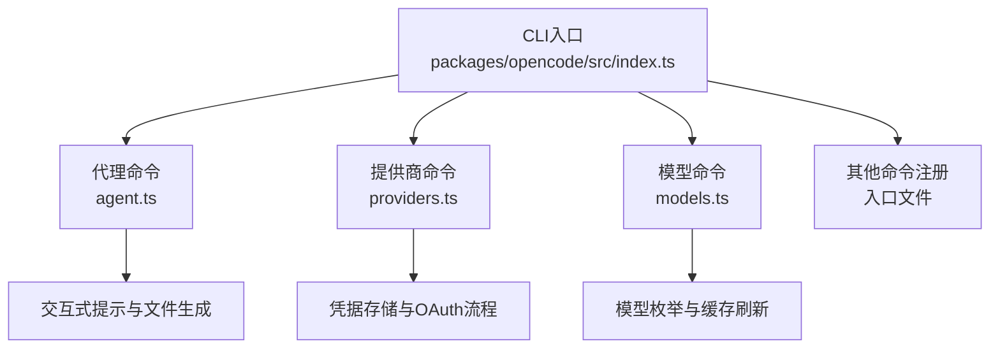
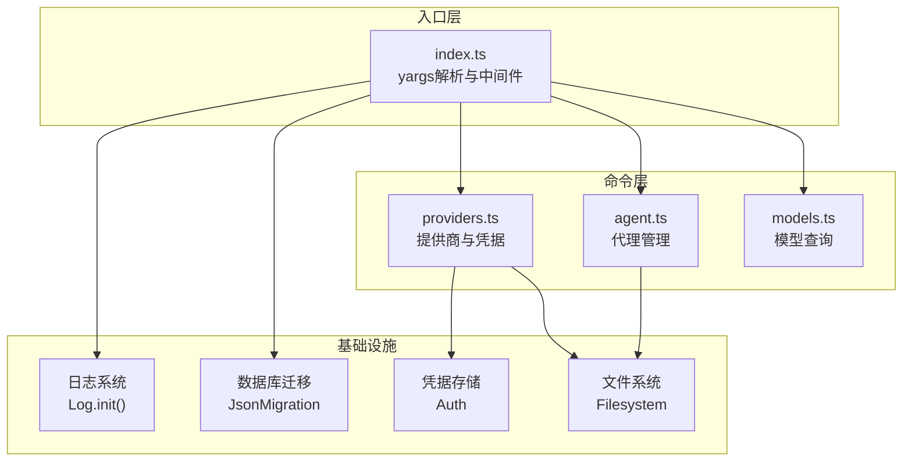
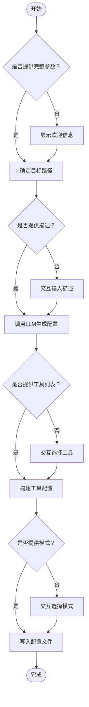
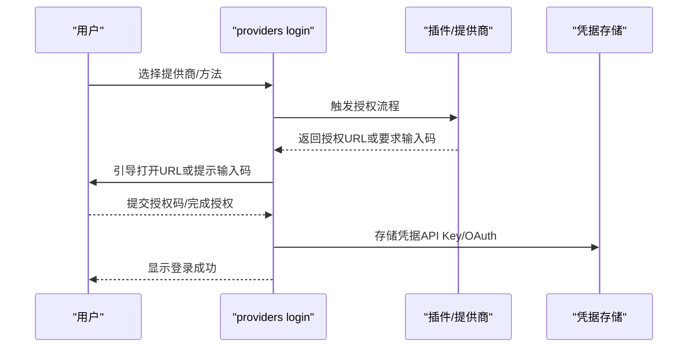
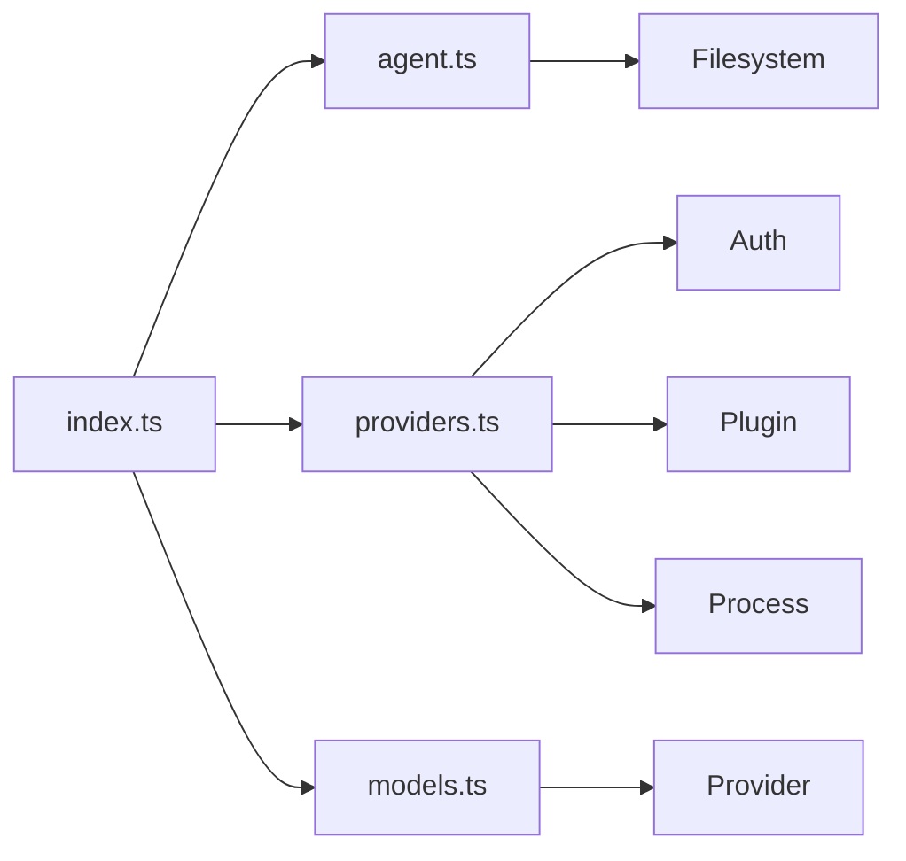

# CLI命令行界面

<cite>
**本文档引用的文件**
- [packages/opencode/src/index.ts](file://packages/opencode/src/index.ts)
- [packages/opencode/src/cli/cmd/agent.ts](file://packages/opencode/src/cli/cmd/agent.ts)
- [packages/opencode/src/cli/cmd/providers.ts](file://packages/opencode/src/cli/cmd/providers.ts)
- [packages/opencode/src/cli/cmd/models.ts](file://packages/opencode/src/cli/cmd/models.ts)
- [packages/opencode/package.json](file://packages/opencode/package.json)
- [README.md](file://README.md)
</cite>

## 目录
1. [简介](#简介)
2. [项目结构](#项目结构)
3. [核心组件](#核心组件)
4. [架构概览](#架构概览)
5. [详细组件分析](#详细组件分析)
6. [依赖关系分析](#依赖关系分析)
7. [性能考虑](#性能考虑)
8. [故障排除指南](#故障排除指南)
9. [结论](#结论)
10. [附录](#附录)

## 简介
本文件为 OpenCode 的命令行界面（CLI）功能文档，面向开发者与高级用户，系统性阐述 CLI 的设计理念、命令结构、使用模式与最佳实践。OpenCode CLI 基于 yargs 构建，提供代理管理、模型提供商配置、模型查询、调试与统计等功能，支持交互式与非交互式两种运行模式，并通过统一的日志系统与错误处理机制保障稳定性。

## 项目结构
OpenCode CLI 的入口位于 `packages/opencode/src/index.ts`，该文件集中注册了所有命令模块，并设置全局中间件以初始化日志、数据库迁移与环境变量。命令模块按功能划分在 `packages/opencode/src/cli/cmd/` 目录下，主要包括：
- 代理管理：agent.ts
- 模型提供商与凭据：providers.ts
- 模型列表：models.ts
- 其他命令：run、generate、serve、stats、debug 等（在入口文件中统一注册）

图表来源
- [packages/opencode/src/index.ts:50-147](file://packages/opencode/src/index.ts#L50-L147)
- [packages/opencode/src/cli/cmd/agent.ts:31-257](file://packages/opencode/src/cli/cmd/agent.ts#L31-L257)
- [packages/opencode/src/cli/cmd/providers.ts:195-475](file://packages/opencode/src/cli/cmd/providers.ts#L195-L475)
- [packages/opencode/src/cli/cmd/models.ts:10-78](file://packages/opencode/src/cli/cmd/models.ts#L10-L78)

章节来源
- [packages/opencode/src/index.ts:1-214](file://packages/opencode/src/index.ts#L1-L214)
- [packages/opencode/package.json:21-23](file://packages/opencode/package.json#L21-L23)

## 核心组件
- CLI 入口与全局中间件
  - 使用 yargs 配置脚本名、帮助、版本、补全与全局选项（打印日志、日志级别）。
  - 中间件负责初始化日志系统、设置环境变量、执行一次性数据库迁移。
  - 错误处理：捕获未处理拒绝与异常，格式化错误信息并输出到 UI 与日志文件。
- 命令注册
  - 统一在入口文件中注册各命令模块，支持严格模式与失败回调。
- 交互式体验
  - 基于 @clack/prompts 提供一致的交互式 UI，支持取消、验证与进度反馈。

章节来源
- [packages/opencode/src/index.ts:50-167](file://packages/opencode/src/index.ts#L50-L167)
- [packages/opencode/src/index.ts:168-214](file://packages/opencode/src/index.ts#L168-L214)

## 架构概览
CLI 采用分层设计：入口层负责解析与路由，命令层封装业务逻辑，底层依赖提供工具与数据访问。

图表来源
- [packages/opencode/src/index.ts:67-123](file://packages/opencode/src/index.ts#L67-L123)
- [packages/opencode/src/cli/cmd/agent.ts:58-224](file://packages/opencode/src/cli/cmd/agent.ts#L58-L224)
- [packages/opencode/src/cli/cmd/providers.ts:269-448](file://packages/opencode/src/cli/cmd/providers.ts#L269-L448)
- [packages/opencode/src/cli/cmd/models.ts:29-76](file://packages/opencode/src/cli/cmd/models.ts#L29-L76)

## 详细组件分析

### 代理命令（agent）
- 功能概述
  - 支持创建与列出代理，生成基于描述的代理配置文件（Markdown + Frontmatter），可选择工具集与模式（all/primary/subagent）。
- 关键特性
  - 交互式与非交互式模式：可通过命令行参数直接指定路径、描述、模式与工具；否则进入交互流程。
  - 作用域选择：支持全局或当前项目范围，自动决定目标目录。
  - 工具集：内置工具集合，可启用/禁用；默认启用全部。
  - 模型绑定：支持通过 provider/model 格式指定默认模型。
- 输出与行为
  - 创建成功后输出文件路径或在交互模式下提示结果。
  - 若目标文件已存在且为非交互模式，直接退出并报告错误。
- 典型使用场景
  - 快速生成一个用于特定任务的代理配置文件。
  - 在 CI 环境中批量生成代理配置（非交互模式）。

图表来源
- [packages/opencode/src/cli/cmd/agent.ts:58-224](file://packages/opencode/src/cli/cmd/agent.ts#L58-L224)

章节来源
- [packages/opencode/src/cli/cmd/agent.ts:31-257](file://packages/opencode/src/cli/cmd/agent.ts#L31-L257)

### 模型提供商命令（providers）
- 功能概述
  - 列出已配置的提供商与凭据类型，展示活跃的环境变量。
  - 登录提供商：支持内置提供商、插件提供商与自定义提供商；支持 OAuth 与 API Key 两种方式。
  - 登出提供商：移除已配置的凭据。
- 关键特性
  - 插件集成：自动发现插件提供的认证方法与提供商，支持多步骤输入与条件提示。
  - 优先级与过滤：根据配置过滤禁用/启用的提供商，按优先级排序。
  - 特定提供商提示：针对 Amazon Bedrock、OpenCode、Vercel、Cloudflare 等提供配置建议。
- 认证流程（OAuth）

图表来源
- [packages/opencode/src/cli/cmd/providers.ts:19-166](file://packages/opencode/src/cli/cmd/providers.ts#L19-L166)
- [packages/opencode/src/cli/cmd/providers.ts:250-448](file://packages/opencode/src/cli/cmd/providers.ts#L250-L448)

章节来源
- [packages/opencode/src/cli/cmd/providers.ts:195-475](file://packages/opencode/src/cli/cmd/providers.ts#L195-L475)

### 模型命令（models）
- 功能概述
  - 列出所有可用模型，支持按提供商过滤、详细输出与刷新缓存。
- 关键特性
  - 缓存刷新：通过 --refresh 从 models.dev 更新本地缓存。
  - 详细输出：--verbose 打印模型元数据（如计费信息）。
  - 排序规则：OpenCode 提供商优先，其余按字母序排列。
- 使用场景
  - 查看可用模型清单，结合 --verbose 获取详细能力信息。
  - 在 CI 中预热模型缓存，减少首次请求延迟。

章节来源
- [packages/opencode/src/cli/cmd/models.ts:10-78](file://packages/opencode/src/cli/cmd/models.ts#L10-L78)

### 其他命令（概览）
- 运行与生成：执行会话或生成内容（入口文件注册）。
- 服务与Web：启动本地服务或打开网页界面（入口文件注册）。
- 调试与统计：输出调试信息与运行统计（入口文件注册）。
- 导入/导出：工作区数据的导入导出（入口文件注册）。
- GitHub与PR：与 GitHub 集成的命令（入口文件注册）。
- 数据库：数据库相关操作（入口文件注册）。

章节来源
- [packages/opencode/src/index.ts:126-147](file://packages/opencode/src/index.ts#L126-L147)

## 依赖关系分析
- CLI 入口对命令模块的依赖：通过统一注册，降低耦合度。
- 命令模块对基础设施的依赖：日志、文件系统、凭据存储、实例上下文等。
- 外部依赖：yargs（命令解析）、@clack/prompts（交互式 UI）、插件系统（扩展认证）。

图表来源
- [packages/opencode/src/index.ts:3-32](file://packages/opencode/src/index.ts#L3-L32)
- [packages/opencode/src/cli/cmd/agent.ts:8-13](file://packages/opencode/src/cli/cmd/agent.ts#L8-L13)
- [packages/opencode/src/cli/cmd/providers.ts:1-15](file://packages/opencode/src/cli/cmd/providers.ts#L1-L15)
- [packages/opencode/src/cli/cmd/models.ts:2-8](file://packages/opencode/src/cli/cmd/models.ts#L2-L8)

## 性能考虑
- 数据库迁移
  - 首次运行时进行一次性 SQLite 迁移，CLI 提供进度条与日志输出，建议在空闲时段运行以避免阻塞。
- 模型缓存
  - 使用 --refresh 预热模型缓存，减少后续查询的网络开销。
- 日志级别
  - 生产环境建议使用 INFO 或更高日志级别，避免 DEBUG 带来的额外 IO。
- 并发与批处理
  - 对于批量操作（如批量创建代理），优先使用非交互模式并通过外部脚本循环调用，减少交互等待时间。

## 故障排除指南
- 常见问题
  - 未知参数或值无效：CLI 将显示帮助并终止，检查参数拼写与取值范围。
  - 未找到提供商：确保提供商 ID 正确，必要时先执行模型缓存刷新。
  - 凭据错误：确认 API Key 或 OAuth 授权流程已完成，检查环境变量与凭据存储位置。
- 调试选项
  - 启用详细日志：--print-logs 与 --log-level=DEBUG。
  - 查看日志文件：错误处理会记录到日志文件，便于定位问题。
- 退出码
  - 命令失败时返回非零退出码，便于 CI/CD 管道识别失败状态。

章节来源
- [packages/opencode/src/index.ts:154-166](file://packages/opencode/src/index.ts#L154-L166)
- [packages/opencode/src/index.ts:178-206](file://packages/opencode/src/index.ts#L178-L206)

## 结论
OpenCode CLI 通过清晰的命令分层、完善的交互式体验与稳健的错误处理机制，为用户提供从代理创建、提供商配置到模型查询的一站式终端工作流。建议在生产环境中结合缓存预热、合适的日志级别与非交互模式，以获得更佳的性能与可靠性。

## 附录

### CLI 命令总览与参数
- 通用选项
  - --print-logs：将日志输出到标准错误。
  - --log-level：设置日志级别（DEBUG/INFO/WARN/ERROR）。
  - --help/-h：显示帮助。
  - --version/-v：显示版本号。
- 代理命令（agent）
  - 子命令：create、list
  - create 参数：
    - --path：生成代理文件的目标目录。
    - --description：代理用途描述（非交互模式必填）。
    - --mode：代理模式（all/primary/subagent）。
    - --tools：逗号分隔的工具列表（默认全部启用）。
    - -m/--model：默认模型（provider/model 格式）。
- 提供商命令（providers）
  - 子命令：list、login、logout
  - list：无参数，显示已配置凭据与活跃环境变量。
  - login [url]：
    - --provider/-p：跳过选择，直接登录指定提供商。
    - --method/-m：跳过选择，直接使用指定方法。
    - [url]：OpenCode 认证提供商地址。
  - logout：移除已配置的凭据。
- 模型命令（models）
  - 位置参数：[provider]（可选，按提供商过滤）。
  - --verbose：输出模型详细信息。
  - --refresh：刷新模型缓存。

章节来源
- [packages/opencode/src/cli/cmd/agent.ts:34-57](file://packages/opencode/src/cli/cmd/agent.ts#L34-L57)
- [packages/opencode/src/cli/cmd/providers.ts:250-268](file://packages/opencode/src/cli/cmd/providers.ts#L250-L268)
- [packages/opencode/src/cli/cmd/models.ts:13-27](file://packages/opencode/src/cli/cmd/models.ts#L13-L27)

### 使用示例
- 创建代理（交互模式）
  - opencode agent create
- 创建代理（非交互模式）
  - opencode agent create --path ./agents --description "代码审查助手" --mode primary --tools read,write,grep -m opencode/claude-3.5-sonnet
- 列出代理
  - opencode agent list
- 列出提供商与凭据
  - opencode providers list
- 登录提供商（OAuth）
  - opencode providers login https://auth.example.com
- 登录提供商（API Key）
  - opencode providers login
- 刷新模型缓存并列出模型
  - opencode models --refresh
  - opencode models --verbose

章节来源
- [packages/opencode/src/cli/cmd/agent.ts:58-224](file://packages/opencode/src/cli/cmd/agent.ts#L58-L224)
- [packages/opencode/src/cli/cmd/providers.ts:269-448](file://packages/opencode/src/cli/cmd/providers.ts#L269-L448)
- [packages/opencode/src/cli/cmd/models.ts:29-76](file://packages/opencode/src/cli/cmd/models.ts#L29-L76)

### 环境变量与配置
- 安装目录优先级
  - OPENCODE_INSTALL_DIR > XDG_BIN_DIR > $HOME/bin > $HOME/.opencode/bin
- CLI 运行时环境变量
  - AGENT=1、OPENCODE=1、OPENCODE_PID=当前进程ID
- 日志与数据库
  - 日志初始化由中间件控制，数据库迁移在首次运行时触发。

章节来源
- [README.md:85-98](file://README.md#L85-L98)
- [packages/opencode/src/index.ts:78-85](file://packages/opencode/src/index.ts#L78-L85)
- [packages/opencode/src/index.ts:87-122](file://packages/opencode/src/index.ts#L87-L122)